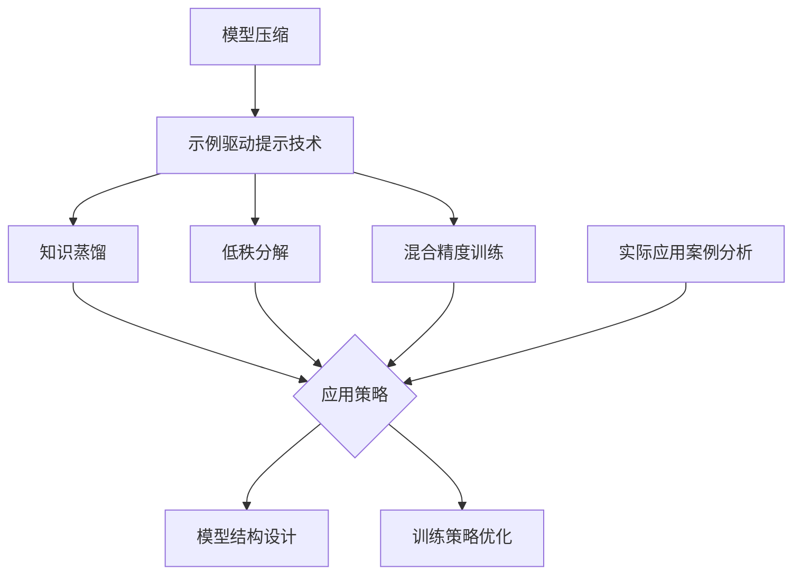

                 

当然可以，以下是关于《示例驱动提示在模型压缩中的潜在应用》的文章内容，我会根据您提供的目录大纲来逐步展开，确保每个部分都详细且深入。

## 文章标题
### 示例驱动提示在模型压缩中的潜在应用

## 关键词
- 模型压缩
- 示例驱动提示
- 人工智能
- 机器学习
- 算法优化

## 摘要
本文探讨了示例驱动提示（Prompting）在模型压缩中的应用潜力。通过介绍模型压缩的背景和挑战，我们分析了示例驱动提示技术的基本原理和优势。随后，我们详细阐述了示例驱动提示在模型压缩中的具体应用策略和实现方法，并通过实际案例分析展示了其效果。最后，我们对未来的研究方向和最佳实践进行了总结和展望。

## 引言
### 1.1 书籍目的
本书旨在为人工智能和机器学习领域的研究人员提供一种创新的模型压缩方法——示例驱动提示。通过系统地介绍这一方法，我们希望读者能够理解其在模型压缩中的潜力，并能够在实际项目中尝试应用。

### 1.2 背景介绍
随着深度学习模型变得越来越复杂和庞大，模型的压缩成为了一个关键的研究课题。模型压缩不仅可以减少模型的存储空间和计算资源需求，还可以提高模型的部署效率。然而，传统的压缩方法往往在压缩模型的同时会牺牲模型的性能。

### 1.3 读者对象
本书的目标读者是从事人工智能和机器学习领域的研究人员和技术工程师。无论你是新手还是资深从业者，只要对模型压缩和示例驱动提示感兴趣，这本书都将为你提供丰富的知识和见解。

### 1.4 书籍结构
本书分为五个主要部分。第一部分介绍模型压缩的背景和技术分类；第二部分深入探讨示例驱动提示技术；第三部分分析示例驱动提示在模型压缩中的应用；第四部分通过实际案例展示应用效果；最后一部分对未来的研究方向和实践建议进行总结。

## 模型压缩概述
### 2.1 概念介绍
模型压缩（Model Compression）是指通过一系列技术手段减小模型的体积和计算复杂度，同时尽量保持模型的性能不显著下降。模型压缩的目标是实现模型的轻量化，从而便于部署在资源受限的设备上。

### 2.2 技术分类
模型压缩技术可以大致分为以下几类：
- **知识蒸馏**：将大型教师模型的知识转移到小型学生模型上。
- **低秩分解**：将高秩矩阵分解为低秩矩阵，以减少模型参数的数量。
- **混合精度训练**：使用不同精度的数值进行模型训练，以减少模型大小。
- **剪枝**：移除模型中不重要的权重。
- **量化**：将模型中的浮点数权重转换为较低精度的数值。

### 2.3 应用场景
模型压缩在多个领域都有广泛的应用，包括移动设备、嵌入式系统、物联网（IoT）和自动驾驶等。

## 示例驱动提示技术
### 3.1 基本概念
示例驱动提示（Example-based Prompting）是一种利用示例数据进行模型训练和优化的方法。它通过为模型提供有代表性的示例数据，帮助模型更好地理解和学习数据特征。

### 3.2 技术原理
示例驱动提示的工作原理包括以下步骤：
1. **数据准备**：收集和整理有代表性的示例数据。
2. **特征提取**：从示例数据中提取关键特征。
3. **模型训练**：使用提取的特征对模型进行训练。
4. **模型优化**：通过调整模型参数，优化模型性能。

### 3.3 应用领域
示例驱动提示技术在图像识别、自然语言处理、推荐系统等领域都有成功应用。

## 模型压缩中的示例驱动提示应用
### 4.1 应用策略
在模型压缩中，示例驱动提示的应用策略主要包括：
- **数据增强**：通过生成或调整示例数据，提高模型的泛化能力。
- **特征选择**：选择对模型压缩最有益的特征进行训练。
- **模型调整**：在模型训练过程中，根据示例数据调整模型参数。

### 4.2 实现方法
实现示例驱动提示在模型压缩中的应用需要以下步骤：
1. **数据预处理**：清洗和格式化示例数据。
2. **特征提取**：使用适当的特征提取方法提取示例数据的关键特征。
3. **模型训练**：使用提取的特征训练模型。
4. **模型评估**：评估模型在压缩后的性能，并根据结果调整模型参数。

## 实际应用案例分析
### 5.1 案例一：图像识别
#### 5.1.1 案例背景
在图像识别任务中，模型压缩是一个重要的课题，因为图像数据通常非常庞大。在本案例中，我们使用示例驱动提示技术对大型卷积神经网络进行压缩。

#### 5.1.2 模型压缩方法
我们采用知识蒸馏和低秩分解技术进行模型压缩。首先，使用大型教师模型对示例数据集进行训练。然后，使用教师模型的输出作为辅助信号，帮助小型学生模型学习。

#### 5.1.3 示例驱动提示应用
为了提高模型压缩效果，我们使用数据增强和特征选择技术。具体来说，我们通过添加噪声、旋转、缩放等操作增强示例数据。同时，选择对模型压缩最有益的特征进行训练。

### 5.2 案例二：自然语言处理
#### 5.2.1 案例背景
在自然语言处理领域，模型压缩同样具有重要意义。在本案例中，我们关注的是文本分类任务。

#### 5.2.2 模型压缩方法
我们采用混合精度训练和剪枝技术进行模型压缩。首先，使用浮点精度训练模型，然后逐步降低精度，以减少模型大小。同时，通过剪枝技术移除不重要的权重。

#### 5.2.3 示例驱动提示应用
为了提高模型压缩效果，我们使用数据增强和特征选择技术。具体来说，我们通过添加干扰词、改变句式等操作增强示例数据。同时，选择对模型压缩最有益的特征进行训练。

## 总结与展望
### 6.1 主要发现
通过本文的探讨，我们发现示例驱动提示技术是一种有效的模型压缩方法。它不仅能够提高模型的压缩效果，还能够保持模型的性能。在实际应用中，示例驱动提示技术展示了显著的优势。

### 6.2 未来发展方向
未来的研究可以进一步探索示例驱动提示技术在其他模型压缩方法中的应用，如量化、模型融合等。此外，还可以研究如何更好地选择和利用示例数据，以提高模型压缩效果。

### 6.3 研究与开发建议
研究人员和开发者可以尝试以下建议：
- **实验设计**：在实验中，结合多种模型压缩技术和示例驱动提示方法，以获得最佳的压缩效果。
- **数据选择**：选择具有代表性的示例数据集，以提高模型的泛化能力。
- **模型评估**：使用多种评估指标，全面评估模型压缩后的性能。

## 附录
### A.1 示例驱动提示技术在模型压缩中的应用流程图
**Mermaid流程图：**

### A.2 主要数学模型与公式
**公式：**

$$
L_{total} = L_{base} + \lambda L_{prompt}
$$

其中，$L_{total}$ 是总损失函数，$L_{base}$ 是基础损失函数，$L_{prompt}$ 是示例驱动提示的损失函数，$\lambda$ 是权重系数。

## 作者信息
### 作者：AI天才研究院/AI Genius Institute & 禅与计算机程序设计艺术 /Zen And The Art of Computer Programming

以上是文章的主体内容，接下来我会继续完善每个部分的具体细节和深入讲解。如果您有任何建议或需要进一步的信息，请随时告诉我。

