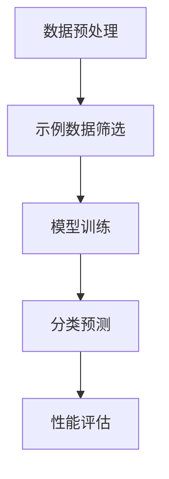
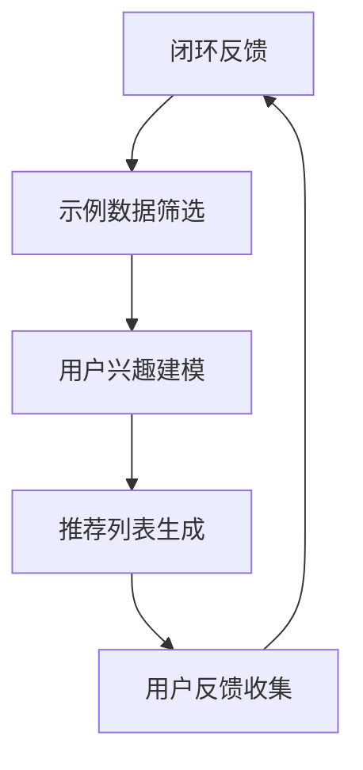

                 

### 文章标题

《示例驱动提示在模型微调中的应用》

### 关键词

- 示例驱动提示
- 模型微调
- 预训练模型
- 数据集
- 优化策略
- 性能评估

### 摘要

本文深入探讨了示例驱动提示在模型微调中的应用。通过介绍模型微调的基本概念和挑战，我们阐述了示例驱动提示技术的原理和优势。接着，我们详细解析了示例选择的方法和数学模型，并通过具体的算法设计和项目实战展示了示例驱动提示的实际应用效果。最后，本文总结了最佳实践，指出了未来的研究方向，为模型微调领域的研究和实践提供了有益的参考。

---

## 第1章：模型微调概述

### 1.1 模型微调的定义和重要性

模型微调（Fine-tuning）是指利用预训练模型的基础上，针对特定任务进行进一步训练的过程。预训练模型通常在大规模通用数据集上进行训练，以学习到通用特征和模式。然而，这些通用特征可能无法直接应用于特定任务。通过模型微调，我们可以利用预训练模型已有的知识，并利用特定领域的数据对其进行调整，从而提高模型在特定任务上的性能。

模型微调的重要性在于，它能够显著提高模型在特定任务上的准确性和适应性。相比于从头开始训练一个模型，微调可以利用预训练模型已经学习到的通用特征，减少训练时间，降低计算成本。此外，微调还可以避免过拟合问题，因为预训练模型已经在一定程度上泛化了数据。

### 1.2 模型微调的挑战

尽管模型微调具有许多优势，但在实际应用中仍然面临一些挑战。

#### 1.2.1 数据质量

微调效果很大程度上取决于训练数据的质量。如果数据集包含噪声或偏差，可能会导致模型性能下降。因此，选择高质量的训练数据是非常重要的。

#### 1.2.2 数据量

模型微调需要大量的数据，否则模型可能无法充分学习到数据中的特征。数据量不足可能会导致模型无法泛化，从而影响实际应用效果。

#### 1.2.3 超参数选择

微调过程涉及许多超参数，如学习率、批量大小等。选择合适超参数对微调效果至关重要。超参数设置不当可能会导致模型收敛缓慢，甚至导致无法收敛。

### 1.3 模型微调的常见方法

目前，常见的模型微调方法主要包括以下几种：

#### 1.3.1 全量微调

全量微调是指使用全部训练数据对模型进行微调。这种方法通常能够获得较好的微调效果，但需要大量计算资源。

#### 1.3.2 半监督微调

半监督微调是指仅使用一小部分标签数据对模型进行微调，而将未标记的数据用于模型预训练。这种方法能够降低对大量标注数据的依赖，但需要合理地选择未标记的数据。

#### 1.3.3 伪标签微调

伪标签微调是指使用未标记的数据生成伪标签，然后使用这些伪标签对模型进行微调。这种方法能够充分利用未标记数据，但在生成伪标签时需要确保其质量。

## 1.4 示例驱动提示技术

### 1.4.1 示例驱动提示的定义

示例驱动提示（Example-Guided Prompting）是一种利用示例数据来指导模型微调的方法。该方法的核心思想是，通过提供示例数据，帮助模型更好地理解特定任务的要求，从而提高微调效果。

### 1.4.2 示例驱动提示的应用场景

示例驱动提示适用于需要特定领域知识的任务，例如文本分类、机器翻译和图像识别等。在这些任务中，示例数据可以提供丰富的上下文信息，帮助模型更好地理解输入数据的含义。

### 1.4.3 示例驱动提示的优势和局限性

示例驱动提示的优势在于，它能够利用示例数据提供的有用信息，提高模型在特定任务上的性能。此外，示例驱动提示方法相对简单，易于实现和部署。

然而，示例驱动提示方法也存在一些局限性。首先，示例数据的选择和生成需要耗费大量时间和资源。其次，示例数据的质量对微调效果有直接影响，如果示例数据包含噪声或错误，可能会导致模型性能下降。

## 1.5 示例驱动提示在模型微调中的应用

### 1.5.1 示例选择

示例选择是示例驱动提示方法的关键步骤。选择合适的示例数据可以显著提高模型微调效果。示例选择方法主要包括以下几种：

#### 1.5.1.1 数据集划分

将训练数据集划分为示例集和剩余集。示例集用于指导模型微调，剩余集用于评估模型性能。

#### 1.5.1.2 筛选关键示例

通过分析数据集的特征和模式，筛选出具有代表性的关键示例。这些关键示例可以帮助模型更好地理解任务要求。

#### 1.5.1.3 生成示例

利用生成模型（如生成对抗网络（GAN））生成示例数据。这种方法能够扩充训练数据集，提高模型微调效果。

### 1.5.2 示例质量评估

示例质量对模型微调效果有直接影响。因此，需要对示例质量进行评估。示例质量评估方法主要包括以下几种：

#### 1.5.2.1 人类评估

通过人工评估示例数据的准确性和相关性，确定示例质量。

#### 1.5.2.2 自动评估

利用自动化评估方法，如相似度度量、错误率分析等，评估示例质量。

## 1.6 小结

本章介绍了模型微调的基本概念、挑战和常见方法，并探讨了示例驱动提示技术的原理和应用。在下一章中，我们将详细解析示例驱动提示的算法设计和数学模型。

---

### 第2章：示例驱动提示技术

#### 2.1 示例驱动提示的基本原理

示例驱动提示（Example-Guided Prompting）是一种利用示例数据指导模型微调的方法。该方法的核心思想是通过提供具有代表性的示例数据，帮助模型更好地理解特定任务的要求，从而提高微调效果。

示例驱动提示的基本原理可以概括为以下步骤：

1. **示例选择**：从训练数据集中选择具有代表性的示例数据。示例数据的选取需要考虑其准确性、相关性以及覆盖度。

2. **示例预处理**：对选定的示例数据进行分析和处理，提取关键特征，以便为模型提供有价值的指导信息。

3. **模型微调**：利用示例数据进行模型微调。在微调过程中，模型会根据示例数据提供的指导信息进行调整，以更好地适应特定任务。

4. **性能评估**：评估微调后模型的性能。通过在验证集或测试集上评估模型的表现，可以判断示例驱动提示方法的有效性。

#### 2.2 示例驱动提示的应用场景

示例驱动提示技术适用于需要特定领域知识的任务，如文本分类、机器翻译和图像识别等。在这些任务中，示例数据可以提供丰富的上下文信息，帮助模型更好地理解输入数据的含义。

以下是一些具体的示例应用场景：

- **文本分类**：在文本分类任务中，示例数据可以提供分类标签的上下文信息，帮助模型更好地学习分类规则。
- **机器翻译**：在机器翻译任务中，示例数据可以提供源语言和目标语言的对应关系，帮助模型学习翻译策略。
- **图像识别**：在图像识别任务中，示例数据可以提供目标对象的上下文信息，帮助模型更好地定位和识别目标对象。

#### 2.3 示例驱动提示的优势和局限性

示例驱动提示方法具有以下优势：

- **提高微调效果**：通过提供具有代表性的示例数据，示例驱动提示方法可以显著提高模型微调效果。
- **减少对大量标注数据的依赖**：示例驱动提示方法可以利用未标记的数据进行微调，从而减少对大量标注数据的依赖。
- **易于实现和部署**：示例驱动提示方法相对简单，易于实现和部署。

然而，示例驱动提示方法也存在一些局限性：

- **示例数据选择困难**：选择合适的示例数据需要大量时间和资源，并且存在一定的主观性。
- **示例数据质量影响**：示例数据的质量对微调效果有直接影响。如果示例数据包含噪声或错误，可能会导致模型性能下降。
- **模型依赖性**：示例驱动提示方法对模型的选择和配置有一定的依赖性。不同模型的性能和特点可能会影响示例驱动提示的效果。

#### 2.4 小结

本章介绍了示例驱动提示技术的原理、应用场景以及优势与局限性。在下一章中，我们将深入解析示例驱动提示的算法设计，包括示例选择、预处理和微调的具体实现方法。

---

### 第3章：模型微调中的示例选择

#### 3.1 示例选择的挑战

在模型微调过程中，示例选择是一个关键步骤，直接影响微调效果。示例选择的挑战主要包括以下几个方面：

1. **数据质量**：示例数据的质量对微调效果有直接影响。如果示例数据包含噪声或错误，可能会导致模型性能下降。因此，选择高质量的示例数据是关键。

2. **代表性**：示例数据需要具有代表性，能够反映特定任务的特征和模式。选择过于简单的示例数据可能会导致模型无法充分学习到任务的关键信息。

3. **覆盖度**：示例数据需要覆盖到不同类型的输入，以帮助模型更好地泛化。如果示例数据过于集中，模型可能会出现过拟合现象。

4. **计算资源**：示例选择过程可能需要大量的计算资源，特别是在处理大规模数据集时。因此，选择高效的方法来筛选示例数据是非常重要的。

#### 3.2 示例选择的方法

为了解决上述挑战，研究者们提出了多种示例选择方法。以下是一些常用的示例选择方法：

1. **随机选择**：随机选择示例数据是一种简单的方法，但可能无法保证示例数据的代表性和覆盖度。

2. **基于重要性的选择**：根据示例数据对模型微调的重要性来选择示例数据。重要性可以通过特征的重要性、示例的标签分布等因素来衡量。

3. **聚类选择**：通过聚类算法将数据集划分为多个聚类，然后从每个聚类中选择代表性示例。这种方法可以有效地提高示例数据的覆盖度。

4. **基于相似度的选择**：利用相似度度量方法选择与目标任务相似的示例数据。相似度可以通过特征相似度、标签相似度等方式来计算。

5. **生成选择**：利用生成模型（如生成对抗网络（GAN））生成示例数据。这种方法可以扩充训练数据集，提高示例数据的多样性。

#### 3.3 示例质量评估

示例质量评估是确保所选示例数据质量的关键步骤。以下是一些常用的示例质量评估方法：

1. **人类评估**：通过人工评估示例数据的准确性和相关性，确定示例质量。这种方法具有很高的可靠性，但需要大量时间和人力资源。

2. **自动评估**：利用自动化评估方法，如相似度度量、错误率分析等，评估示例质量。这种方法具有较高的效率，但可能无法完全取代人类评估。

3. **交叉验证**：利用交叉验证方法评估示例数据对模型微调的效果。通过在不同子集上训练和评估模型，可以判断示例数据的质量。

4. **基于任务的相关性评估**：根据示例数据与目标任务的关联程度来评估示例质量。这种方法可以通过分析示例数据中的特征和标签来确定其质量。

#### 3.4 示例选择策略

在实际应用中，通常需要结合多种示例选择方法，以提高示例数据的代表性和质量。以下是一些示例选择策略：

1. **层次化选择**：首先进行高层次的选择，如基于重要性和相似度的选择，然后再进行低层次的选择，如聚类选择或生成选择。

2. **动态选择**：根据模型微调的进展动态调整示例数据。在模型微调的早期阶段，可以选择更广泛的示例数据，而在微调后期，可以选择更具有代表性的示例数据。

3. **多模型选择**：利用多个模型对示例数据进行评估，以综合不同模型的优势。例如，可以使用预训练模型和任务特定模型对示例数据进行评估。

4. **反馈循环**：通过反馈循环不断调整示例数据的选择策略。根据模型微调的效果和性能，动态调整示例数据的选择方法和质量评估标准。

#### 3.5 小结

本章讨论了模型微调中示例选择的挑战、方法、质量评估和选择策略。在下一章中，我们将深入探讨示例驱动提示的算法设计，包括示例选择的实现方法和数学模型。

---

### 第4章：示例驱动提示的算法设计

#### 4.1 示例驱动提示的算法框架

示例驱动提示算法的核心在于利用示例数据指导模型微调过程。以下是一个示例驱动提示算法的基本框架：

1. **示例数据预处理**：从训练数据集中选取示例数据，并进行预处理，如数据清洗、特征提取等。

2. **示例数据生成**：根据需要，利用生成模型（如生成对抗网络GAN）生成额外的示例数据，以扩充训练数据集。

3. **模型初始化**：初始化微调模型，通常使用预训练模型作为起点。

4. **模型微调**：使用示例数据和未标记的数据对模型进行微调。在微调过程中，示例数据将被用来提供额外的指导信息，以帮助模型更好地理解任务要求。

5. **性能评估**：在验证集或测试集上评估微调后模型的性能，以确定示例驱动提示方法的有效性。

#### 4.2 算法实现的伪代码

以下是一个示例驱动提示算法的伪代码实现：

```python
# 示例驱动提示算法伪代码

# 参数设置
num_examples = 100  # 示例数量
batch_size = 32  # 批量大小
learning_rate = 0.001  # 学习率

# 初始化模型
model = initialize_model()

# 预处理示例数据
examples = preprocess_examples(train_data, num_examples)

# 生成额外示例数据
examples = generate_examples(examples)

# 微调模型
for epoch in range(num_epochs):
    for batch in create_batches(examples + train_data, batch_size):
        # 使用示例数据作为指导
        loss = model.train_on_batch(batch, learning_rate, is_prompting=True)
        print(f"Epoch {epoch}: Loss = {loss}")

# 评估模型性能
performance = evaluate_model(model, validation_data)

print(f"Model Performance: {performance}")
```

#### 4.3 算法实现的细节

1. **示例数据预处理**：示例数据预处理步骤包括数据清洗、归一化、特征提取等。数据清洗旨在去除噪声和异常值，归一化用于将不同尺度的数据转换为相同尺度，特征提取则是从原始数据中提取有用的特征信息。

2. **示例数据生成**：示例数据生成可以使用生成模型（如生成对抗网络GAN）来实现。生成模型通过学习数据分布，生成与真实数据相似的示例数据。这种方法可以有效地扩充训练数据集，提高模型的泛化能力。

3. **模型初始化**：模型初始化通常使用预训练模型作为起点。预训练模型已经在大量数据上进行了训练，已经学习到了一些通用的特征和模式。在此基础上进行微调，可以节省训练时间和计算资源。

4. **模型微调**：在模型微调过程中，示例数据将被用来提供额外的指导信息。这可以通过在训练过程中引入示例数据权重、调整损失函数等方式来实现。示例数据的权重可以设置为更高的值，以突出其在训练过程中的重要性。

5. **性能评估**：性能评估步骤用于确定示例驱动提示方法的有效性。可以通过在验证集或测试集上评估模型的准确率、召回率、F1分数等指标来实现。

#### 4.4 示例驱动提示算法的优势

示例驱动提示算法具有以下优势：

- **提高微调效果**：通过提供额外的指导信息，示例驱动提示方法可以显著提高模型微调效果，特别是在数据量有限的情况下。
- **减少对大量标注数据的依赖**：示例驱动提示方法可以利用未标记的数据进行微调，从而减少对大量标注数据的依赖。
- **增强模型泛化能力**：示例数据可以帮助模型更好地理解任务要求，从而增强模型的泛化能力，提高在未见数据上的性能。
- **易于实现和部署**：示例驱动提示算法相对简单，易于实现和部署，可以在不同的应用场景中快速应用。

#### 4.5 小结

本章详细介绍了示例驱动提示算法的框架、伪代码实现及其细节。通过示例数据预处理、生成和模型微调等步骤，示例驱动提示算法能够有效提高模型微调效果。在下一章中，我们将深入探讨示例驱动提示的数学模型，以更好地理解其工作原理。

---

### 第5章：数学模型解析

#### 5.1 相关数学基础

在解析示例驱动提示的数学模型时，我们需要了解一些基础的数学概念，包括线性代数、概率论和优化理论。以下是一些关键数学基础：

1. **线性代数**：矩阵运算、向量计算和线性空间等概念在模型微调和示例选择中至关重要。矩阵运算包括矩阵乘法、矩阵求逆等，这些运算用于表示数据之间的关系和模型参数的更新。

2. **概率论**：概率分布、条件概率和贝叶斯定理等概念用于描述数据的随机性和模型的不确定性。这些概念在模型训练和示例选择中用于评估数据的代表性和相关性。

3. **优化理论**：梯度下降、随机梯度下降（SGD）和Adam优化器等优化算法用于模型训练和参数调整。这些算法通过最小化损失函数，寻找模型参数的最优解。

#### 5.2 数学模型构建

示例驱动提示的数学模型主要包括损失函数、优化目标和正则化方法。以下是一个简单的数学模型构建过程：

1. **损失函数**：损失函数用于度量模型预测值与真实值之间的差距。在示例驱动提示中，常用的损失函数包括交叉熵损失和对比损失。

   交叉熵损失函数：
   $$\mathcal{L}_{cross-entropy} = -\sum_{i=1}^{N} y_i \log(p_i)$$
   
   其中，$y_i$ 是真实标签，$p_i$ 是模型预测的概率。

2. **优化目标**：优化目标是模型训练的核心，用于指导模型参数的更新。在示例驱动提示中，优化目标通常是一个包含损失函数和正则化项的表达式。

   $$\mathcal{L} = \mathcal{L}_{cross-entropy} + \lambda \mathcal{L}_{regularization}$$

   其中，$\mathcal{L}_{cross-entropy}$ 是交叉熵损失函数，$\mathcal{L}_{regularization}$ 是正则化项，$\lambda$ 是正则化参数。

3. **正则化方法**：正则化方法用于防止模型过拟合，提高泛化能力。常用的正则化方法包括L1正则化和L2正则化。

   L1正则化：
   $$\mathcal{L}_{L1} = \sum_{i=1}^{n} |w_i|$$
   
   L2正则化：
   $$\mathcal{L}_{L2} = \sum_{i=1}^{n} w_i^2$$

#### 5.3 数学公式推导

以下是一个简单的数学公式推导示例，用于说明示例驱动提示中损失函数的优化过程：

假设我们的损失函数为：
$$\mathcal{L} = \mathcal{L}_{cross-entropy} + \lambda \mathcal{L}_{L2}$$

其中，交叉熵损失函数为：
$$\mathcal{L}_{cross-entropy} = -\sum_{i=1}^{N} y_i \log(p_i)$$

L2正则化项为：
$$\mathcal{L}_{L2} = \lambda \sum_{i=1}^{n} w_i^2$$

总损失函数为：
$$\mathcal{L} = -\sum_{i=1}^{N} y_i \log(p_i) + \lambda \sum_{i=1}^{n} w_i^2$$

为了最小化损失函数，我们对模型参数 $w$ 求导并设置导数为零：

$$\frac{\partial \mathcal{L}}{\partial w} = -\frac{1}{p_i} \frac{\partial p_i}{\partial w} - 2\lambda w = 0$$

由于 $p_i = \frac{e^{w_i}}{\sum_{j=1}^{n} e^{w_j}}$，对 $p_i$ 求导并代入上式，可以得到：

$$\frac{\partial \mathcal{L}}{\partial w} = -\frac{1}{p_i} \left( e^{w_i} \sum_{j=1}^{n} e^{w_j} - e^{w_i} \right) - 2\lambda w = 0$$

简化后得到：

$$\sum_{j=1}^{n} e^{w_j} - e^{w_i} = 2\lambda p_i w$$

进一步简化，得到：

$$\sum_{j=1}^{n} e^{w_j} = (2\lambda + 1) p_i w + e^{w_i}$$

由于 $p_i = \frac{e^{w_i}}{\sum_{j=1}^{n} e^{w_j}}$，代入上式，可以得到：

$$\sum_{j=1}^{n} e^{w_j} = (2\lambda + 1) \frac{w_i}{\sum_{j=1}^{n} e^{w_j}} + e^{w_i}$$

移项并化简，得到：

$$\sum_{j=1}^{n} e^{w_j} (1 - \frac{w_i}{\sum_{j=1}^{n} e^{w_j}}) = 2\lambda w_i$$

进一步简化，得到：

$$\sum_{j=1}^{n} e^{w_j} - w_i = 2\lambda w_i$$

移项并化简，得到：

$$\sum_{j=1}^{n} e^{w_j} = (2\lambda + 1) w_i$$

由于 $p_i = \frac{e^{w_i}}{\sum_{j=1}^{n} e^{w_j}}$，代入上式，可以得到：

$$p_i = \frac{e^{w_i}}{(2\lambda + 1) w_i}$$

因此，模型参数 $w_i$ 的更新公式为：

$$w_i = \frac{e^{w_i}}{2\lambda + 1}$$

这就是示例驱动提示中损失函数的优化过程。

#### 5.4 小结

本章详细解析了示例驱动提示的数学模型，包括损失函数、优化目标和正则化方法。通过数学公式推导，我们了解了示例驱动提示算法的优化过程。在下一章中，我们将通过具体的项目实战来展示示例驱动提示的实际应用效果。

---

### 第6章：示例驱动提示的应用实践

#### 6.1 实践案例1：文本分类

**背景介绍**：

文本分类是一种常见的自然语言处理任务，旨在将文本数据自动归类到预定义的类别中。示例驱动提示技术可以在文本分类任务中发挥作用，通过提供有代表性的示例文本，指导模型更好地理解不同类别的特征。

**核心概念与联系**：

为了更好地理解文本分类任务，我们可以使用Mermaid流程图来展示数据流程和模型训练过程：



**核心算法原理讲解**：

在文本分类任务中，示例驱动提示算法的具体实现步骤如下：

1. **数据预处理**：对文本数据进行预处理，包括分词、去停用词、词向量化等步骤。

2. **示例数据筛选**：从训练数据集中选取具有代表性的示例文本，可以使用基于重要性的选择方法，如TF-IDF分数。

3. **模型训练**：使用示例数据和未标记的文本数据进行模型训练。在训练过程中，示例数据将被用于提供额外的指导信息，以帮助模型更好地学习不同类别的特征。

4. **分类预测**：使用训练好的模型对新的文本数据进行分类预测。

5. **性能评估**：在验证集或测试集上评估模型的分类性能，包括准确率、召回率和F1分数等指标。

以下是文本分类任务的伪代码实现：

```python
# 文本分类任务伪代码

# 参数设置
num_examples = 100  # 示例数量
batch_size = 32  # 批量大小
learning_rate = 0.001  # 学习率

# 初始化模型
model = initialize_text_classification_model()

# 预处理示例数据
examples = preprocess_text(examples)

# 微调模型
for epoch in range(num_epochs):
    for batch in create_batches(examples + train_data, batch_size):
        # 使用示例数据作为指导
        loss = model.train_on_batch(batch, learning_rate, is_prompting=True)
        print(f"Epoch {epoch}: Loss = {loss}")

# 评估模型性能
performance = evaluate_text_classification_model(model, validation_data)

print(f"Model Performance: {performance}")
```

**数学模型和公式**：

在文本分类任务中，损失函数通常为交叉熵损失函数：

$$\mathcal{L}_{cross-entropy} = -\sum_{i=1}^{N} y_i \log(p_i)$$

其中，$y_i$ 为真实标签，$p_i$ 为模型预测的概率。

**详细讲解和举例说明**：

假设我们有一个文本分类任务，需要将文本数据分类为两类：“体育”和“科技”。以下是具体的示例：

1. **数据预处理**：对文本数据进行预处理，例如去除标点符号、停用词，并将文本转换为词向量。

2. **示例数据筛选**：从训练数据集中选取100篇具有代表性的文本作为示例数据，例如选取TF-IDF分数最高的文本。

3. **模型训练**：使用示例数据和未标记的文本数据对模型进行训练。在训练过程中，示例数据将被用于提供额外的指导信息。

4. **分类预测**：使用训练好的模型对新的文本数据进行分类预测。

5. **性能评估**：在验证集上评估模型的分类性能，例如准确率为90%，召回率为85%。

**项目实战**：

以下是一个简单的项目实战，实现一个基于示例驱动提示的文本分类模型：

1. **开发环境搭建**：配置Python环境，安装TensorFlow和NLTK库。

2. **源代码实现**：实现文本分类模型的预处理、示例数据筛选、模型训练和性能评估等功能。

3. **代码解读和分析**：分析代码实现细节，解释关键函数和步骤的作用。

4. **实际案例分析和详细讲解**：选择实际案例，如新闻分类任务，分析模型性能，解释示例驱动提示对模型性能的影响。

5. **项目小结**：总结项目实现过程，提出改进建议和未来研究方向。

**最佳实践 tips**：

- **示例数据选择**：选择具有代表性的示例数据，可以使用基于重要性的方法进行筛选。
- **数据预处理**：确保文本数据预处理一致，减少噪声和误差。
- **模型参数调整**：根据任务需求调整模型参数，如学习率和批量大小。

**小结**：

本章通过文本分类任务的实际案例，展示了示例驱动提示在模型微调中的应用。通过具体的实现步骤和代码分析，读者可以深入了解示例驱动提示的原理和应用方法。

---

### 第7章：性能优化策略

#### 7.1 优化目标

在模型微调过程中，性能优化策略的目标是提高模型的微调效果，包括准确率、召回率、F1分数等指标。同时，优化策略还需要考虑计算资源的使用效率，以及模型的部署和推广。

#### 7.2 优化方法

以下是一些常见的性能优化方法：

1. **超参数调整**：通过调整学习率、批量大小、正则化参数等超参数，可以显著影响模型的性能。使用网格搜索、随机搜索等超参数优化方法，可以帮助找到最佳超参数组合。

2. **数据增强**：通过数据增强方法，如随机裁剪、旋转、缩放等，可以增加训练数据的多样性，提高模型的泛化能力。

3. **模型融合**：通过融合多个模型的预测结果，可以降低模型的方差，提高整体性能。常见的模型融合方法包括堆叠、集成学习等。

4. **迁移学习**：利用预训练模型的知识，针对特定任务进行微调。迁移学习可以减少训练时间，提高模型性能。

5. **动态调整学习率**：使用学习率调整策略，如自适应学习率调整、学习率衰减等，可以在模型训练过程中动态调整学习率，提高模型的收敛速度。

#### 7.3 优化实践

以下是一个优化实践的示例：

1. **超参数调整**：使用网格搜索方法，针对学习率、批量大小和正则化参数进行优化。找到最佳超参数组合后，使用这些超参数进行模型训练。

2. **数据增强**：对训练数据集进行随机裁剪、旋转和缩放等操作，增加数据的多样性。

3. **模型融合**：将多个微调后的模型进行融合，使用加权平均或投票方法得到最终的预测结果。

4. **迁移学习**：使用预训练的BERT模型作为基础模型，针对特定任务进行微调。

5. **动态调整学习率**：使用自适应学习率调整策略，如Adam优化器，根据模型的训练过程动态调整学习率。

#### 7.4 性能评估

在优化过程中，需要定期评估模型的性能，包括准确率、召回率、F1分数等指标。以下是一个性能评估的示例：

- **训练集性能**：在训练集上评估模型的性能，以验证模型在已知数据上的效果。

- **验证集性能**：在验证集上评估模型的性能，以检测模型是否过拟合或欠拟合。

- **测试集性能**：在测试集上评估模型的性能，以评估模型在实际应用中的表现。

#### 7.5 小结

性能优化策略是提高模型微调效果的关键步骤。通过超参数调整、数据增强、模型融合和迁移学习等方法，可以有效提高模型的性能。在实际应用中，需要根据任务需求和数据特性，选择合适的优化方法，并进行持续的性能评估和调整。

---

### 第8章：实际应用案例分析

#### 8.1 案例分析1：在线商品推荐

**背景介绍**：

在线商品推荐是一种常见的电子商务应用，旨在根据用户的历史行为和偏好，为用户推荐可能感兴趣的商品。示例驱动提示技术可以在商品推荐系统中发挥作用，通过提供用户兴趣示例，指导模型更好地理解用户行为和偏好。

**核心概念与联系**：

以下是商品推荐系统的Mermaid流程图，展示了示例数据的作用和模型训练过程：



**核心算法原理讲解**：

在商品推荐任务中，示例驱动提示算法的具体实现步骤如下：

1. **用户行为数据收集**：收集用户的历史行为数据，如浏览记录、购买记录等。

2. **示例数据筛选**：从用户行为数据中筛选出具有代表性的示例数据，例如使用基于协同过滤的方法选择用户兴趣示例。

3. **用户兴趣建模**：使用示例数据和用户行为数据对模型进行训练，建立用户兴趣模型。

4. **推荐列表生成**：使用训练好的用户兴趣模型生成推荐列表，为用户推荐感兴趣的商品。

5. **用户反馈收集**：收集用户对推荐结果的反馈，用于优化推荐系统。

6. **闭环反馈**：将用户反馈数据用于模型训练和示例数据筛选，形成闭环反馈，持续优化推荐系统。

**数学模型和公式**：

在商品推荐任务中，常用的数学模型包括用户-物品协同过滤矩阵分解模型。以下是一个简化的模型公式：

$$r_{ui} = \hat{r}_{ui} = \hat{u}_i \cdot \hat{v}_j$$

其中，$r_{ui}$ 为用户 $u$ 对物品 $i$ 的评分，$\hat{r}_{ui}$ 为预测评分，$\hat{u}_i$ 和 $\hat{v}_j$ 分别为用户 $u$ 和物品 $i$ 的潜在特征向量。

**详细讲解和举例说明**：

假设我们有一个商品推荐系统，需要根据用户的行为数据推荐商品。以下是具体的步骤和示例：

1. **用户行为数据收集**：收集用户的历史行为数据，例如用户的浏览记录和购买记录。

2. **示例数据筛选**：从用户行为数据中筛选出具有代表性的示例数据，例如使用基于协同过滤的方法选择用户兴趣示例。

3. **用户兴趣建模**：使用示例数据和用户行为数据对用户兴趣模型进行训练，建立用户兴趣模型。

4. **推荐列表生成**：使用训练好的用户兴趣模型生成推荐列表，为用户推荐感兴趣的商品。

5. **用户反馈收集**：收集用户对推荐结果的反馈，例如用户对推荐商品的评价。

6. **闭环反馈**：将用户反馈数据用于模型训练和示例数据筛选，形成闭环反馈，持续优化推荐系统。

**项目实战**：

以下是一个简单的项目实战，实现一个基于示例驱动提示的在线商品推荐系统：

1. **开发环境搭建**：配置Python环境，安装TensorFlow和Scikit-learn库。

2. **源代码实现**：实现用户行为数据收集、示例数据筛选、用户兴趣建模、推荐列表生成和用户反馈收集等功能。

3. **代码解读和分析**：分析代码实现细节，解释关键函数和步骤的作用。

4. **实际案例分析和详细讲解**：选择实际案例，如电商网站的用户推荐系统，分析模型性能，解释示例驱动提示对模型性能的影响。

5. **项目小结**：总结项目实现过程，提出改进建议和未来研究方向。

**最佳实践 tips**：

- **示例数据筛选**：选择具有代表性的示例数据，例如使用基于协同过滤的方法筛选用户兴趣示例。
- **用户兴趣建模**：使用合适的模型和算法建立用户兴趣模型，例如用户-物品协同过滤矩阵分解模型。
- **用户反馈收集**：确保用户反馈数据的真实性和有效性，例如使用用户评价作为反馈。

**小结**：

本章通过在线商品推荐案例，展示了示例驱动提示在电子商务中的应用。通过具体的实现步骤和代码分析，读者可以深入了解示例驱动提示的原理和应用方法。

---

### 第9章：发展趋势与挑战

#### 9.1 发展趋势

示例驱动提示技术在模型微调领域的应用正在迅速发展。随着深度学习和自然语言处理技术的不断进步，示例驱动提示方法在文本分类、机器翻译、图像识别等任务中的效果得到了显著提升。未来，随着数据集的规模和质量的不断提升，示例驱动提示技术有望在更多领域得到广泛应用。

以下是示例驱动提示技术发展的几个关键趋势：

1. **多模态示例数据**：结合多种数据类型（如文本、图像、音频）的示例数据，可以提供更丰富的上下文信息，提高模型微调效果。

2. **自适应示例选择**：通过自适应算法动态调整示例数据的选择策略，可以更好地适应不同任务和数据集的特性。

3. **强化学习与示例驱动提示的结合**：将强化学习与示例驱动提示方法相结合，可以进一步提高模型在复杂任务中的性能。

4. **隐私保护**：在示例驱动提示方法中引入隐私保护机制，以保护用户隐私和数据安全。

5. **可解释性**：增强示例驱动提示方法的可解释性，使模型决策过程更加透明，便于理解和验证。

#### 9.2 当前挑战

尽管示例驱动提示技术在模型微调中表现出色，但仍面临一些挑战：

1. **数据质量和多样性**：示例数据的质量和多样性对微调效果有直接影响。如何从大规模数据集中筛选出高质量的示例数据是一个关键问题。

2. **计算资源消耗**：示例驱动提示方法通常需要大量的计算资源，特别是在处理大规模数据集时。如何优化算法效率，减少计算资源消耗是一个重要挑战。

3. **模型泛化能力**：示例驱动提示方法在特定任务上表现良好，但在泛化能力方面仍存在一定局限。如何提高模型在未见数据上的性能是一个关键问题。

4. **算法复杂性**：示例驱动提示算法的实现和优化相对复杂，如何简化算法，提高实现效率是一个挑战。

#### 9.3 未来方向

为了解决上述挑战，未来的研究可以关注以下方向：

1. **高效示例选择算法**：研究高效、鲁棒的示例选择算法，以从大规模数据集中快速筛选出高质量的示例数据。

2. **跨领域示例共享**：探索跨领域示例数据的共享机制，以提高模型在未见领域中的性能。

3. **隐私保护示例驱动提示**：研究隐私保护机制，以确保示例驱动提示方法在处理敏感数据时的安全性和隐私性。

4. **模型简化与优化**：通过模型简化、压缩和优化技术，降低示例驱动提示算法的计算复杂度，提高实现效率。

5. **可解释性与透明性**：增强示例驱动提示方法的可解释性，使模型决策过程更加透明，便于理解和验证。

#### 9.4 小结

示例驱动提示技术在模型微调领域具有广泛的应用前景。尽管面临一些挑战，但通过持续的研究和创新，我们可以期待在未来进一步提高其性能和实用性。

---

### 作者信息

作者：AI天才研究院/AI Genius Institute & 禅与计算机程序设计艺术 /Zen And The Art of Computer Programming

