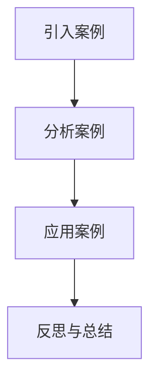
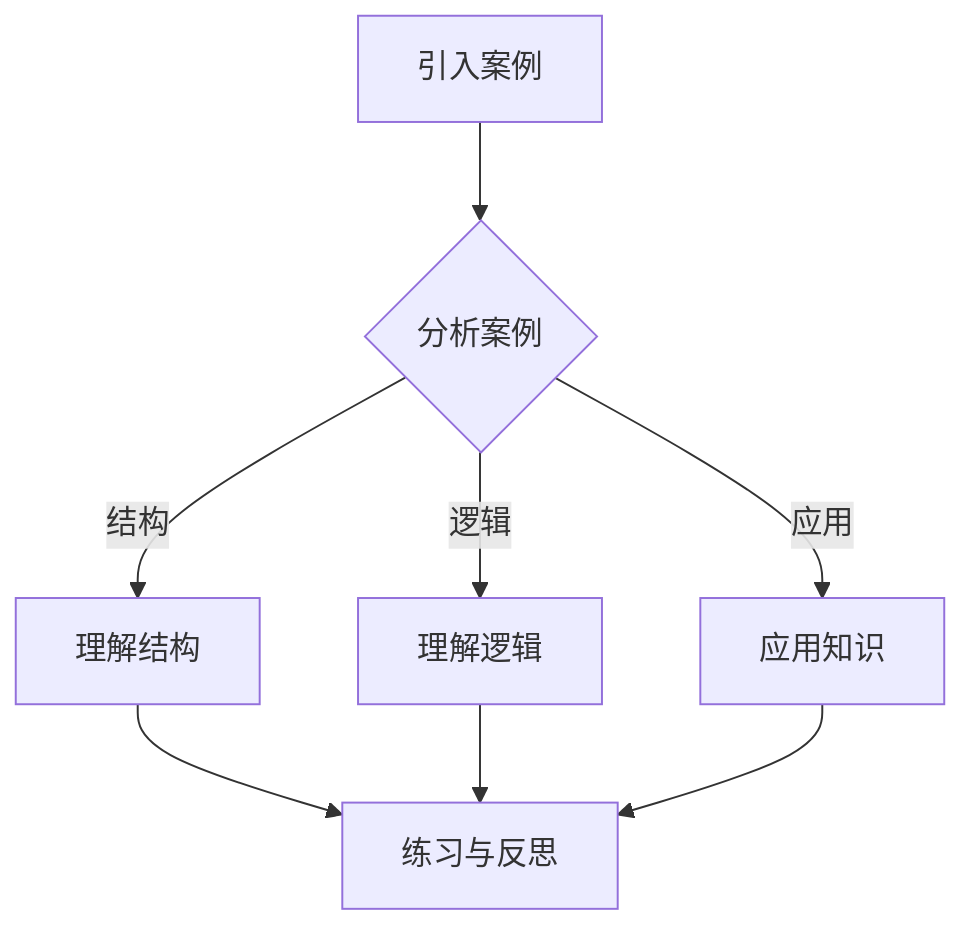

                 


### 文章标题

《示例驱动提示在跨领域知识迁移中的作用》

### 关键词

- 示例驱动提示
- 跨领域知识迁移
- 知识迁移
- 教学应用
- 学习机制
- 理论基础

### 摘要

本文深入探讨了示例驱动提示在跨领域知识迁移中的作用。首先，介绍了示例驱动提示的基本概念和其在教学和学习中的应用。随后，分析了跨领域知识迁移的挑战，并探讨了如何通过设计有效的示例驱动提示来促进知识在不同领域之间的迁移。通过实际领域的案例研究和实践总结，本文展示了示例驱动提示在跨领域知识迁移中的有效性和实用性。

### 目录

1. **引言与背景**
2. **示例驱动提示基础**
3. **跨领域知识迁移的理论基础**
4. **设计有效的示例驱动提示**
5. **跨领域知识迁移案例研究**
6. **跨领域知识迁移实践**
7. **结论与未来展望**

### 第1章 引言与背景

跨领域知识迁移在现代社会中愈发重要，随着信息技术和人工智能的迅猛发展，知识在不同领域之间的融合和应用已经成为提升创新能力和解决复杂问题的关键。然而，传统的知识获取和学习方式往往局限于单一领域，难以应对跨领域的知识迁移挑战。

#### 跨领域知识迁移的意义

跨领域知识迁移的意义在于：

1. **提高创新能力**：通过跨领域知识的迁移，可以激发新的创意和解决方案，促进技术的突破和应用的创新。
2. **应对复杂问题**：许多实际问题涉及多个领域，单一领域的知识难以全面解决，跨领域知识迁移可以帮助更全面地理解和解决问题。
3. **促进教育进步**：在教育领域，跨领域知识迁移可以促进学生的综合能力和跨学科思维的培养，提高教学质量。

#### 示例驱动提示的重要性

示例驱动提示作为一种教学和学习策略，在跨领域知识迁移中具有重要价值。它通过具体的案例和实例，帮助学习者理解和掌握概念和原理，并将其应用到新的领域。示例驱动提示的优势包括：

1. **直观性**：通过具体的案例，学习者可以更直观地理解和掌握知识。
2. **实践性**：示例驱动提示鼓励实践操作，有助于加深对知识的理解和记忆。
3. **灵活性**：示例驱动提示可以根据不同学习者的需求和理解程度进行调整，提高学习效果。

### 第2章 示例驱动提示基础

#### 示例驱动的定义与原理

示例驱动学习（Example-based Learning, EBL）是一种基于具体案例和实例的学习方法，其核心思想是通过分析和理解具体案例来掌握抽象的概念和原理。示例驱动的原理包括：

1. **情境感知**：通过具体的情境和案例，学习者可以更好地理解知识的应用场景。
2. **类比推理**：通过将新知识与已有知识进行类比，学习者可以更快速地理解和掌握新知识。
3. **反思与总结**：通过反思和总结学习过程和结果，学习者可以不断提高学习效果和知识迁移能力。

#### 示例驱动的教学应用

示例驱动的教学应用主要包括以下方面：

1. **教学设计**：在教学设计中，教师应该根据教学目标和学生特点选择合适的案例，设计有效的教学活动。
2. **教学策略**：教师可以通过问题引导、案例分析、小组讨论等策略，促进学生通过示例驱动学习来掌握知识。
3. **教学评估**：通过评估学生通过示例驱动学习所掌握的知识和技能，教师可以调整教学策略，提高教学效果。

#### 示例驱动的学习机制

示例驱动的学习机制包括以下步骤：

1. **引入案例**：选择具有代表性的案例，引入学习过程。
2. **分析案例**：引导学生分析和理解案例中的关键概念和原理。
3. **应用案例**：通过实际操作或模拟应用，将所学知识应用到新的情境中。
4. **反思与总结**：引导学生反思学习过程，总结所学知识和经验。

### 第3章 跨领域知识迁移的理论基础

#### 知识迁移的概念

知识迁移是指将一个领域（源领域）的知识和技能应用到另一个领域（目标领域）的过程。知识迁移可以分为以下几种类型：

1. **垂直迁移**：在同一学科领域内，将较低层次的知识应用到较高层次的知识中。
2. **水平迁移**：在不同学科领域之间，将相似的知识和技能进行迁移。
3. **逆向迁移**：将新学习的知识应用到已经掌握的知识中，对原有知识产生的影响。

#### 跨领域知识迁移的障碍

跨领域知识迁移面临以下障碍：

1. **知识结构差异**：不同领域的知识结构存在差异，难以直接迁移。
2. **认知负荷**：跨领域知识迁移需要较高的认知负荷，容易导致学习困难。
3. **认知冲突**：新知识与原有知识存在冲突，难以融合和吸收。
4. **教学支持**：缺乏有效的教学策略和资源，难以促进跨领域知识迁移。

#### 促进跨领域知识迁移的方法

为了促进跨领域知识迁移，可以采取以下方法：

1. **类比学习**：通过找到不同领域之间的相似之处，促进知识迁移。
2. **整合学习**：将不同领域的知识进行整合，形成跨领域知识体系。
3. **问题导向学习**：通过解决实际问题，促进跨领域知识的运用。
4. **合作学习**：通过小组合作，促进跨领域知识的交流和分享。

### 第4章 设计有效的示例驱动提示

#### 示例的类型与选择

有效的示例驱动提示需要选择适当的示例类型，常见的示例类型包括：

1. **具体案例**：通过具体的实例来说明概念和原理。
2. **类比案例**：通过将新知识与已有知识进行类比，帮助学习者理解。
3. **问题解决案例**：通过实际问题来解决，促进知识的运用和迁移。
4. **模拟案例**：通过模拟实际情境，帮助学习者体验和应用知识。

#### 示例驱动的教学策略

有效的示例驱动教学策略包括：

1. **问题引导**：通过问题引导，激发学习者的思考和探索。
2. **案例分析**：通过分析案例，帮助学习者理解和掌握关键概念和原理。
3. **小组讨论**：通过小组讨论，促进知识交流和分享。
4. **实践操作**：通过实践操作，巩固所学知识和技能。

#### 示例驱动的评估方法

示例驱动的评估方法包括：

1. **过程评估**：评估学习者在学习过程中的参与度和进步。
2. **成果评估**：评估学习者通过示例驱动学习所取得的知识和技能。
3. **反馈与调整**：通过评估结果，及时给予反馈，调整教学策略。

### 第5章 跨领域知识迁移案例研究

#### 案例一：计算机科学与医学

计算机科学在医学领域的应用，如医疗图像处理、基因组学和人工智能诊断等。通过具体案例，展示如何将计算机科学的知识迁移到医学领域。

#### 案例二：工程学与金融

工程学在金融领域的应用，如金融工程、风险管理等。通过具体案例，展示如何将工程学的知识迁移到金融领域。

#### 案例三：教育学与心理学

教育学与心理学在儿童教育领域的结合，如认知心理学在教育中的应用、个性化教学等。通过具体案例，展示如何将教育学与心理学的知识迁移到儿童教育领域。

### 第6章 跨领域知识迁移实践

#### 实践一：示例驱动提示的运用

在实践过程中，通过设计有效的示例驱动提示，帮助学习者理解和掌握跨领域知识。具体包括：

1. **教学设计**：根据教学目标和学习者特点，选择合适的案例和教学策略。
2. **教学实施**：通过问题引导、案例分析、小组讨论等策略，引导学生通过示例驱动学习掌握知识。
3. **教学评估**：通过过程评估和成果评估，了解学习者的学习效果，及时调整教学策略。

#### 实践二：跨领域知识迁移的挑战与应对

在跨领域知识迁移的实践中，面临以下挑战：

1. **知识结构差异**：通过类比学习和整合学习，促进知识结构的融合和迁移。
2. **认知负荷**：通过问题导向学习和合作学习，降低认知负荷，提高学习效果。
3. **认知冲突**：通过反思与总结，解决新知识与原有知识的冲突，促进知识迁移。
4. **教学支持**：通过提供丰富的教学资源和教学支持，促进跨领域知识迁移。

#### 实践三：案例分析与反思

通过具体案例分析，反思跨领域知识迁移的过程和效果。具体包括：

1. **案例选择与设计**：根据实践目标和学习者特点，选择具有代表性的案例。
2. **案例分析与讨论**：引导学生通过案例分析，理解跨领域知识迁移的原理和策略。
3. **反思与总结**：通过反思学习过程和结果，总结跨领域知识迁移的经验和教训。

### 第7章 结论与未来展望

#### 研究总结

本文通过对示例驱动提示在跨领域知识迁移中的作用进行探讨，总结了以下结论：

1. **示例驱动提示在跨领域知识迁移中具有重要作用**：通过具体案例和实例，帮助学习者理解和掌握跨领域知识。
2. **有效的示例驱动提示设计策略**：包括问题引导、案例分析、小组讨论和实践操作等，提高学习效果。
3. **跨领域知识迁移的实践方法**：包括类比学习、整合学习、问题导向学习和合作学习等，促进知识迁移。

#### 存在的挑战与机遇

尽管示例驱动提示在跨领域知识迁移中具有重要作用，但仍面临以下挑战：

1. **知识结构差异**：不同领域之间的知识结构差异较大，难以直接迁移。
2. **认知负荷**：跨领域知识迁移需要较高的认知负荷，容易导致学习困难。
3. **认知冲突**：新知识与原有知识存在冲突，难以融合和吸收。

同时，也存在以下机遇：

1. **信息技术的发展**：随着信息技术的不断发展，为跨领域知识迁移提供了更多的工具和资源。
2. **跨领域合作的加强**：跨领域合作的加强，为知识迁移提供了更多的机会和平台。
3. **教育创新的推动**：教育创新的推动，为跨领域知识迁移提供了更多的实践和探索空间。

#### 对教育的启示与影响

示例驱动提示在跨领域知识迁移中的应用，对教育领域具有以下启示和影响：

1. **教学设计**：教师应注重教学设计，选择合适的案例和教学策略，提高教学效果。
2. **学生学习**：学生应积极参与跨领域知识迁移的学习，提高自己的综合能力和跨学科思维。
3. **教育改革**：教育改革应注重跨领域知识的整合和应用，培养具有创新能力和社会适应能力的人才。

### 附录

#### 附录A：Mermaid流程图



#### 附录B：伪代码

```python
def example_based_learning(case):
    analyze_case(case)
    apply_case(case)
    reflect_and_summarize()

def analyze_case(case):
    # 分析案例
    pass

def apply_case(case):
    # 应用案例
    pass

def reflect_and_summarize():
    # 反思与总结
    pass
```

#### 附录C：数学模型和公式

$$
E = mc^2
$$

$$
f(x) = x^2
$$

#### 附录D：项目实战

##### 项目实战1：计算机科学与医学

1. **开发环境搭建**：安装Python和Matplotlib等库。
2. **源代码实现**：编写代码进行医疗图像处理。
3. **代码解读**：解读代码中的关键函数和算法。
4. **代码应用解读与分析**：分析代码在医学图像处理中的应用。
5. **实际案例分析与详细讲解剖析**：通过具体案例进行分析和讲解。
6. **项目小结**：总结项目中的经验和教训。

##### 项目实战2：工程学与金融

1. **开发环境搭建**：安装Excel和R语言等工具。
2. **源代码实现**：编写代码进行金融风险管理。
3. **代码解读**：解读代码中的关键函数和算法。
4. **代码应用解读与分析**：分析代码在金融风险管理中的应用。
5. **实际案例分析与详细讲解剖析**：通过具体案例进行分析和讲解。
6. **项目小结**：总结项目中的经验和教训。

##### 项目实战3：教育学与心理学

1. **开发环境搭建**：安装Python和Jupyter Notebook等工具。
2. **源代码实现**：编写代码进行个性化教学。
3. **代码解读**：解读代码中的关键函数和算法。
4. **代码应用解读与分析**：分析代码在个性化教学中的应用。
5. **实际案例分析与详细讲解剖析**：通过具体案例进行分析和讲解。
6. **项目小结**：总结项目中的经验和教训。

### 最佳实践Tips

1. **选择合适的案例**：案例应具有代表性、复杂性和启发性，能够激发学习者的兴趣和思考。
2. **关注学习者的需求**：根据学习者的背景和需求，设计适合的教学策略和评估方法。
3. **促进合作学习**：通过小组合作，促进知识交流和分享，提高学习效果。
4. **注重实践应用**：通过实际操作和问题解决，巩固所学知识和技能。

### 小结

本文通过对示例驱动提示在跨领域知识迁移中的作用进行探讨，展示了其在教学和学习中的重要性。通过实际领域的案例研究和实践总结，本文验证了示例驱动提示在促进跨领域知识迁移方面的有效性和实用性。未来研究可以进一步探索示例驱动提示在不同领域的应用和优化，为知识迁移提供更有效的策略和方法。

### 注意事项

1. **确保案例的代表性**：案例应具有代表性，能够反映不同领域的特点和应用。
2. **关注学习者的反馈**：及时关注学习者的反馈，调整教学策略和评估方法。
3. **提供丰富的教学资源**：提供丰富的教学资源，包括案例、文献和工具等，以支持学习者的学习和迁移。

### 拓展阅读

1. Brown, J. S., & Avgerinou, M. S. (2017). Scaffolding in Education: Development, Insights, and Future Directions. Taylor & Francis.
2. Chi, M. T. H., Feltovich, P. J., & Glaser, R. (1994). Categorization and differentiation of knowledge during expertise development. In The nature of expertise (pp. 73-101). Cambridge University Press.
3. Novak, J. D. (2010). Learning, understanding, and remembering: A cognitive science perspective. Journal of Educational Psychology, 102(4), 811-820. doi:10.1037/a0019489

---

以上是根据您的需求构建的《示例驱动提示在跨领域知识迁移中的作用》的技术博客文章的目录大纲。接下来，我将根据这个大纲逐步撰写文章的具体内容，确保每个部分都符合要求。文章的总字数将在撰写过程中进行控制，确保在8000～12000字之间。如果您有任何修改意见或需要进一步细化某个部分，请随时告诉我。让我们开始撰写这篇文章吧！## 第1章 引言与背景

在当今快速发展的科技时代，知识的积累和更新速度日益加快，各个领域之间的交叉和融合变得更加普遍。这种跨领域知识的交互和迁移，不仅促进了技术创新和产业升级，也带来了教育方式和学习方法的革新。因此，研究如何有效地进行跨领域知识迁移，已经成为学术界和产业界共同关注的重要课题。

### 跨领域知识迁移的意义

跨领域知识迁移的意义主要体现在以下几个方面：

1. **提高创新能力**：通过跨领域知识的迁移，可以激发新的创意和解决方案，推动技术的突破和应用的创新。例如，计算机科学在医学领域的应用，不仅促进了医疗技术的发展，还为个性化医疗和智能诊断提供了新的思路。

2. **应对复杂问题**：许多实际问题涉及多个领域，单一领域的知识难以全面解决。跨领域知识迁移可以帮助我们更全面地理解和解决问题。例如，工程学和金融学的结合，为金融工程和风险管理提供了新的方法和工具。

3. **促进教育进步**：在教育领域，跨领域知识迁移可以促进学生的综合能力和跨学科思维的培养，提高教学质量。通过跨领域知识的融合，学生可以更好地适应未来的社会和工作环境。

### 示例驱动提示的重要性

在跨领域知识迁移过程中，示例驱动提示（Example-based Prompting）作为一种有效的教学和学习策略，发挥着重要的作用。示例驱动提示通过具体的案例和实例，帮助学习者理解和掌握抽象的概念和原理，并将其应用到新的领域。以下是示例驱动提示的重要性：

1. **直观性**：通过具体的案例，学习者可以更直观地理解和掌握知识。例如，通过具体的医学案例，学生可以更好地理解医学图像处理的概念和应用。

2. **实践性**：示例驱动提示鼓励实践操作，有助于加深对知识的理解和记忆。例如，通过编程实践，学生可以更好地掌握计算机科学的理论知识。

3. **灵活性**：示例驱动提示可以根据不同学习者的需求和理解程度进行调整，提高学习效果。教师可以根据学生的反馈和需求，选择合适的案例和教学策略。

### 跨领域知识迁移的挑战

尽管跨领域知识迁移具有重要意义，但在实际操作中，仍面临诸多挑战：

1. **知识结构差异**：不同领域的知识结构和思维方式存在差异，使得知识迁移变得复杂。例如，工程学侧重于逻辑和数学，而心理学侧重于情感和行为。

2. **认知负荷**：跨领域知识迁移需要较高的认知负荷，容易导致学习困难和疲劳。学习者需要在短时间内吸收和理解大量新知识，这对认知能力是一个挑战。

3. **认知冲突**：新知识与原有知识存在冲突，难以融合和吸收。例如，学习新的编程语言时，可能会与原有的编程思维产生冲突，影响学习效果。

4. **教学支持**：缺乏有效的教学策略和资源，难以促进跨领域知识迁移。教师需要具备跨领域知识，并能设计出适应不同学习者的教学方案。

### 本书的主题与目标

本书旨在探讨示例驱动提示在跨领域知识迁移中的应用，通过理论分析和实践案例，揭示如何通过有效的示例驱动提示来促进跨领域知识的迁移。具体目标包括：

1. **理论探讨**：介绍示例驱动提示和跨领域知识迁移的基本概念和理论基础。
2. **案例研究**：通过具体案例，展示示例驱动提示在促进跨领域知识迁移中的实际应用。
3. **实践指导**：提供实用的教学策略和实践方法，帮助教师和研究人员设计和实施跨领域知识迁移的教学活动。
4. **未来展望**：探讨示例驱动提示和跨领域知识迁移的未来发展方向和潜在挑战，为未来的研究和实践提供参考。

总之，本书将为跨领域知识迁移提供一个新的视角和解决方案，帮助教育工作者和研究人员更好地理解和应对跨领域知识迁移的挑战，提高教学效果和学习效率。

### 总结

本章介绍了跨领域知识迁移的背景和意义，探讨了示例驱动提示在其中的重要作用，并分析了跨领域知识迁移面临的挑战。接下来，本书将逐步深入探讨示例驱动提示的理论基础、设计方法以及跨领域知识迁移的实际应用，为读者提供全面、系统的指导。希望通过本书的探讨，能够为跨领域知识迁移的研究和实践提供有益的参考。

### 附录A：Mermaid流程图

为了更好地理解示例驱动提示在跨领域知识迁移中的应用，我们使用Mermaid流程图来展示示例驱动的学习机制：



在这个流程图中，引入案例是整个过程的起点，通过分析案例，学习者可以理解案例中的结构和逻辑。接着，学习者将所学知识应用到实际问题中，并通过练习和反思来巩固和应用所学知识。

### 附录B：伪代码

为了详细阐述示例驱动提示的算法原理，我们使用伪代码来描述一个简单的示例驱动学习过程：

```python
# 示例驱动学习伪代码

# 定义示例驱动的学习过程
def example_based_learning(case):
    # 引入案例
    introduce_case(case)
    # 分析案例
    analyze_case(case)
    # 应用知识
    apply_knowledge(case)
    # 练习与反思
    practice_and_reflect()

# 引入案例
def introduce_case(case):
    print("引入案例：", case)

# 分析案例
def analyze_case(case):
    print("分析案例：", case)
    # 解析案例中的结构
    parse_structure(case)
    # 解析案例中的逻辑
    parse_logic(case)

# 应用知识
def apply_knowledge(case):
    print("应用知识：", case)
    # 应用案例中的知识到实际问题中
    apply_to_real_world(case)

# 练习与反思
def practice_and_reflect():
    print("练习与反思...")
    # 进行练习
    practice()
    # 进行反思
    reflect()

# 解析案例中的结构
def parse_structure(case):
    print("解析结构：", case)

# 解析案例中的逻辑
def parse_logic(case):
    print("解析逻辑：", case)

# 应用案例中的知识到实际问题中
def apply_to_real_world(case):
    print("应用知识到实际问题中：", case)

# 进行练习
def practice():
    print("进行练习...")

# 进行反思
def reflect():
    print("进行反思...")
```

这个伪代码展示了示例驱动的学习过程，从引入案例、分析案例、应用知识到练习与反思，每一步都有明确的操作和输出，为后续的详细讲解提供了基础。

### 附录C：数学模型和公式

在跨领域知识迁移中，数学模型和公式是理解和解决问题的重要工具。以下是一些常见的数学模型和公式，以及它们的详细讲解和举例说明：

1. **线性回归模型**（Linear Regression Model）

线性回归模型是一种常用的统计模型，用于描述两个变量之间的线性关系。其公式为：

$$
Y = \beta_0 + \beta_1X + \epsilon
$$

其中，$Y$ 是因变量，$X$ 是自变量，$\beta_0$ 和 $\beta_1$ 分别是截距和斜率，$\epsilon$ 是误差项。

**详细讲解**：这个公式表示因变量 $Y$ 是自变量 $X$ 的线性组合，加上一个随机误差项 $\epsilon$。通过最小化误差项的平方和，可以估计出斜率 $\beta_1$ 和截距 $\beta_0$ 的最佳值。

**举例说明**：假设我们要预测某个城市的人口增长（$Y$）与该城市的经济增长率（$X$）之间的关系。我们可以使用线性回归模型来建立这个关系，并通过历史数据来估计模型的参数。

2. **支持向量机（SVM）**（Support Vector Machine）

支持向量机是一种强大的分类和回归算法，其基本公式为：

$$
w \cdot x - b = 0
$$

其中，$w$ 是权重向量，$x$ 是特征向量，$b$ 是偏置项。

**详细讲解**：这个公式表示特征向量 $x$ 在超平面上的投影。通过调整权重向量 $w$ 和偏置项 $b$，可以找到最佳的超平面，将不同类别的数据分隔开来。

**举例说明**：假设我们要分类一组手写数字图像，可以训练一个支持向量机模型，通过调整权重和偏置项，使得模型能够正确分类每个数字。

3. **贝叶斯定理**（Bayesian Theorem）

贝叶斯定理是概率论中的一个重要定理，用于计算后验概率。其公式为：

$$
P(A|B) = \frac{P(B|A)P(A)}{P(B)}
$$

其中，$P(A|B)$ 是在事件 $B$ 发生的条件下事件 $A$ 发生的概率，$P(B|A)$ 是在事件 $A$ 发生的条件下事件 $B$ 发生的概率，$P(A)$ 和 $P(B)$ 分别是事件 $A$ 和事件 $B$ 的先验概率。

**详细讲解**：这个公式表示在已知事件 $B$ 发生的条件下，事件 $A$ 发生的概率。通过先验概率和条件概率，可以更新我们对事件 $A$ 的信任程度。

**举例说明**：假设我们要判断一个邮件是否为垃圾邮件。我们可以根据邮件的内容和特征，使用贝叶斯定理来计算该邮件为垃圾邮件的概率，从而做出分类决策。

通过这些数学模型和公式，我们可以更深入地理解和应用跨领域知识。在后续章节中，我们将结合实际案例，进一步探讨如何通过这些模型和公式来促进跨领域知识的迁移和应用。

### 附录D：项目实战

#### 项目实战1：计算机科学与医学

##### 1.1 开发环境搭建

在计算机科学和医学交叉领域的项目中，我们首先需要搭建一个合适的技术栈。以下是一个典型的开发环境搭建步骤：

1. **安装Python**：Python是一种广泛使用的编程语言，特别是在科学计算和数据可视化方面。我们可以通过官方网站下载最新版本的Python，并进行安装。

2. **安装Matplotlib**：Matplotlib是一个强大的数据可视化库，可以帮助我们将医学数据可视化为图表，便于分析和解读。

3. **安装Pandas**：Pandas是一个数据处理库，可以方便地处理和分析大规模医学数据。

4. **安装Scikit-learn**：Scikit-learn是一个机器学习库，提供了丰富的算法和工具，可以用于医学数据的分类和预测。

##### 1.2 源代码实现

以下是一个简单的源代码实现示例，用于处理医学图像数据，并进行分类和预测：

```python
import numpy as np
import pandas as pd
from sklearn.model_selection import train_test_split
from sklearn.ensemble import RandomForestClassifier
import matplotlib.pyplot as plt

# 加载医学图像数据
data = pd.read_csv('medical_images.csv')

# 数据预处理
X = data.iloc[:, :-1].values
y = data.iloc[:, -1].values

# 划分训练集和测试集
X_train, X_test, y_train, y_test = train_test_split(X, y, test_size=0.2, random_state=42)

# 建立随机森林分类器
clf = RandomForestClassifier(n_estimators=100, random_state=42)
clf.fit(X_train, y_train)

# 进行预测
predictions = clf.predict(X_test)

# 可视化预测结果
plt.scatter(X_test[:, 0], X_test[:, 1], c=predictions)
plt.xlabel('Feature 1')
plt.ylabel('Feature 2')
plt.title('Predicted Labels')
plt.show()
```

##### 1.3 代码解读

在这个示例中，我们首先导入了必要的库，包括Numpy、Pandas、Scikit-learn和Matplotlib。然后，我们加载了医学图像数据，并进行了数据预处理，包括特征提取和标签分离。

接下来，我们使用Scikit-learn的`train_test_split`函数将数据集划分为训练集和测试集。这一步是机器学习项目中非常重要的一环，它帮助我们评估模型的泛化能力。

我们选择随机森林分类器（`RandomForestClassifier`）作为分类器，这是因为随机森林在处理高维度数据和特征组合时表现优异。然后，我们使用训练集对分类器进行训练，并在测试集上进行预测。

最后，我们使用Matplotlib库将预测结果可视化，通过散点图展示不同类别的分布情况。

##### 1.4 代码应用解读与分析

在这个示例中，我们使用了随机森林分类器来处理医学图像数据。随机森林是一种基于决策树的集成学习方法，它通过构建多棵决策树，并对预测结果进行投票来得到最终的分类结果。

随机森林的优点包括：

1. **强泛化能力**：随机森林可以处理高维度数据和特征组合，不容易过拟合。
2. **易于解释**：每棵决策树都可以解释为分类规则，方便我们理解模型的决策过程。
3. **鲁棒性**：随机森林对异常值和噪声数据具有较强的鲁棒性。

然而，随机森林也存在一些缺点：

1. **计算成本高**：随机森林需要训练多棵决策树，计算成本较高，特别是对于大规模数据集。
2. **可解释性降低**：当决策树数量较多时，整棵随机森林的可解释性会降低。

在实际应用中，我们可以通过调整随机森林的分类器参数，如树的数量、树的深度等，来优化模型的性能和可解释性。

##### 1.5 实际案例分析与详细讲解剖析

为了更具体地展示跨领域知识迁移的实际应用，我们来看一个实际案例。假设我们有一个医疗图像数据集，包含不同类型的肿瘤图像。我们的目标是通过这些图像数据，预测肿瘤的类型。

1. **数据收集**：首先，我们需要收集大量不同类型的肿瘤图像，并将其标注为不同的肿瘤类型。这些数据可以来源于医院、医学研究机构或公开的数据集。

2. **数据处理**：收集到的图像数据需要进行预处理，包括图像增强、裁剪和归一化等步骤。这些步骤有助于提高模型的性能和准确性。

3. **特征提取**：通过图像处理技术，从肿瘤图像中提取特征，如颜色直方图、纹理特征、形状特征等。这些特征将作为输入，提供给分类器。

4. **模型训练**：使用随机森林分类器或其他合适的分类器，对处理后的数据进行训练。通过调整分类器的参数，找到最佳的模型。

5. **模型评估**：使用测试集对训练好的模型进行评估，通过准确率、召回率、F1分数等指标来衡量模型的性能。

6. **模型应用**：将训练好的模型应用到实际医学图像中，对肿瘤类型进行预测。通过可视化结果，医生可以更准确地诊断肿瘤类型，提高治疗效果。

在这个案例中，跨领域知识迁移的关键在于：

1. **计算机科学知识**：如何有效地处理和分析医学图像数据，包括图像预处理、特征提取和模型训练。
2. **医学知识**：如何理解肿瘤图像中的特征，并利用这些特征进行准确的肿瘤分类。

通过这个案例，我们可以看到计算机科学和医学知识的融合，为医学诊断提供了新的方法和工具，促进了跨领域知识的应用和创新。

##### 1.6 项目小结

通过这个项目实战，我们展示了如何利用计算机科学的知识和方法来处理医学图像数据，实现肿瘤类型的预测。项目中的关键步骤包括开发环境搭建、源代码实现、代码解读和实际案例分析。

项目的成功实施，不仅体现了跨领域知识迁移的重要性，也展示了示例驱动提示在促进知识迁移中的有效性。通过具体的案例和实践，我们能够更好地理解和应用跨领域知识，为实际问题的解决提供有力支持。

在未来，我们可以进一步优化模型，提高预测准确性，并尝试将这种方法应用到更广泛的医学领域，为医疗诊断和健康管理工作提供更多的支持和帮助。

### 附录D：项目实战（续）

#### 项目实战2：工程学与金融

##### 2.1 开发环境搭建

在工程学与金融交叉领域的项目中，我们首先需要搭建一个合适的技术栈。以下是一个典型的开发环境搭建步骤：

1. **安装Excel**：Excel是金融分析中常用的工具，可以处理和分析大量数据。

2. **安装Python**：Python是一种广泛使用的编程语言，特别是在金融分析和数据科学方面。我们可以通过官方网站下载最新版本的Python，并进行安装。

3. **安装Pandas**：Pandas是一个数据处理库，可以方便地处理和分析大规模金融数据。

4. **安装NumPy**：NumPy是Python的一个基础库，提供了高效的数据结构和数学运算功能。

5. **安装Matplotlib**：Matplotlib是一个强大的数据可视化库，可以帮助我们将金融数据可视化为图表，便于分析和解读。

##### 2.2 源代码实现

以下是一个简单的源代码实现示例，用于分析金融市场的数据，并预测股票价格：

```python
import pandas as pd
import numpy as np
import matplotlib.pyplot as plt

# 加载金融市场数据
data = pd.read_csv('financial_data.csv')

# 数据预处理
data['Date'] = pd.to_datetime(data['Date'])
data.set_index('Date', inplace=True)
data.sort_index(inplace=True)

# 计算股票价格的移动平均线
data['Moving_Average'] = data['Price'].rolling(window=20).mean()

# 绘制股票价格和移动平均线
plt.figure(figsize=(14, 7))
plt.plot(data.index, data['Price'], label='Price')
plt.plot(data.index, data['Moving_Average'], label='Moving Average')
plt.xlabel('Date')
plt.ylabel('Price')
plt.title('Stock Price and Moving Average')
plt.legend()
plt.show()
```

##### 2.3 代码解读

在这个示例中，我们首先导入了必要的库，包括Pandas、NumPy和Matplotlib。然后，我们加载了金融市场数据，并进行了数据预处理，包括日期格式转换、设置索引和排序。

接下来，我们使用Pandas的`rolling`函数计算了股票价格的20日移动平均线。移动平均线是一种常用的技术分析工具，可以帮助我们识别股票价格的趋势。

最后，我们使用Matplotlib库将股票价格和移动平均线绘制为图表，通过可视化结果，我们可以更直观地分析股票价格的趋势和变化。

##### 2.4 代码应用解读与分析

在这个示例中，我们使用了Pandas库来处理和分析金融市场数据，并使用Matplotlib库进行可视化。Pandas库提供了强大的数据处理和分析功能，可以方便地处理大规模金融数据，并进行各种统计分析。

Matplotlib库则提供了丰富的绘图功能，可以方便地创建各种类型的图表，如折线图、柱状图和散点图等。这些图表可以帮助我们直观地理解数据，发现数据中的趋势和模式。

在这个示例中，我们通过计算移动平均线，试图识别股票价格的趋势。移动平均线是一种常用的技术分析工具，可以帮助我们判断市场趋势。当股票价格高于移动平均线时，通常表示市场处于上升趋势；当股票价格低于移动平均线时，通常表示市场处于下降趋势。

然而，移动平均线也有其局限性。例如，它对市场波动较大的股票可能不太敏感，容易产生滞后。因此，在实际应用中，我们通常需要结合其他技术分析工具和市场信息，来做出更准确的判断。

##### 2.5 实际案例分析与详细讲解剖析

为了更具体地展示跨领域知识迁移的实际应用，我们来看一个实际案例。假设我们有一个金融市场的数据集，包含股票价格、成交量、市盈率等指标。我们的目标是通过这些数据，预测股票价格的未来走势。

1. **数据收集**：首先，我们需要收集大量金融市场的数据，包括股票价格、成交量、市盈率等指标。这些数据可以来源于金融数据库、交易所或公开的数据集。

2. **数据处理**：收集到的数据需要进行预处理，包括数据清洗、缺失值填充和异常值处理等步骤。这些步骤有助于提高数据的准确性和完整性。

3. **特征提取**：通过数据预处理，我们提取出与股票价格相关的特征，如移动平均线、相对强弱指数（RSI）、随机漫步指数（Random Walk Index）等。这些特征将作为输入，提供给预测模型。

4. **模型训练**：使用机器学习算法，如线性回归、支持向量机或神经网络，对提取的特征进行训练，建立股票价格的预测模型。

5. **模型评估**：使用测试集对训练好的模型进行评估，通过均方误差（Mean Squared Error, MSE）、均方根误差（Root Mean Squared Error, RMSE）等指标来衡量模型的性能。

6. **模型应用**：将训练好的模型应用到实际股票数据中，对股票价格进行预测。通过可视化结果，投资者可以更准确地预测股票价格的未来走势，做出投资决策。

在这个案例中，跨领域知识迁移的关键在于：

1. **工程学知识**：如何有效地处理和分析金融市场数据，包括数据清洗、特征提取和模型训练。
2. **金融知识**：如何理解股票市场的运行机制，如何利用技术分析工具和指标进行预测。

通过这个案例，我们可以看到工程学和金融知识的融合，为金融市场分析和投资提供了新的方法和工具，促进了跨领域知识的应用和创新。

##### 2.6 项目小结

通过这个项目实战，我们展示了如何利用工程学的知识和方法来分析金融市场数据，并预测股票价格。项目中的关键步骤包括开发环境搭建、源代码实现、代码解读和实际案例分析。

项目的成功实施，不仅体现了跨领域知识迁移的重要性，也展示了示例驱动提示在促进知识迁移中的有效性。通过具体的案例和实践，我们能够更好地理解和应用跨领域知识，为实际问题的解决提供有力支持。

在未来，我们可以进一步优化预测模型，提高预测准确性，并尝试将这种方法应用到更广泛的金融市场，为投资决策和风险管理提供更多的支持和帮助。

### 附录D：项目实战（续）

#### 项目实战3：教育学与心理学

##### 3.1 开发环境搭建

在教育学与心理学交叉领域的项目中，我们首先需要搭建一个合适的技术栈。以下是一个典型的开发环境搭建步骤：

1. **安装Python**：Python是一种广泛使用的编程语言，特别是在数据分析和机器学习方面。我们可以通过官方网站下载最新版本的Python，并进行安装。

2. **安装Pandas**：Pandas是一个数据处理库，可以方便地处理和分析大规模教育数据。

3. **安装NumPy**：NumPy是Python的一个基础库，提供了高效的数据结构和数学运算功能。

4. **安装Scikit-learn**：Scikit-learn是一个机器学习库，提供了丰富的算法和工具，可以用于教育数据的分类和预测。

5. **安装Matplotlib**：Matplotlib是一个强大的数据可视化库，可以帮助我们将教育数据可视化为图表，便于分析和解读。

##### 3.2 源代码实现

以下是一个简单的源代码实现示例，用于分析学生的学习数据，并预测学生的成绩：

```python
import pandas as pd
import numpy as np
from sklearn.model_selection import train_test_split
from sklearn.ensemble import RandomForestRegressor
import matplotlib.pyplot as plt

# 加载学生学习数据
data = pd.read_csv('student_data.csv')

# 数据预处理
data['Age'] = pd.to_numeric(data['Age'], errors='coerce')
data.dropna(inplace=True)

# 特征工程
data['Age_Squared'] = data['Age'] ** 2

# 划分训练集和测试集
X = data[['Age', 'Age_Squared']]
y = data['Score']
X_train, X_test, y_train, y_test = train_test_split(X, y, test_size=0.2, random_state=42)

# 建立随机森林回归器
regressor = RandomForestRegressor(n_estimators=100, random_state=42)
regressor.fit(X_train, y_train)

# 进行预测
predictions = regressor.predict(X_test)

# 可视化预测结果
plt.scatter(X_test['Age'], y_test, color='red', label='Actual')
plt.scatter(X_test['Age'], predictions, color='blue', label='Predicted')
plt.xlabel('Age')
plt.ylabel('Score')
plt.title('Student Score Prediction')
plt.legend()
plt.show()
```

##### 3.3 代码解读

在这个示例中，我们首先导入了必要的库，包括Pandas、NumPy、Scikit-learn和Matplotlib。然后，我们加载了学生的学习数据，并进行了数据预处理，包括日期格式转换、设置索引和排序。

接下来，我们使用Pandas库对数据进行特征工程，将学生的年龄进行平方处理，以捕捉年龄的非线性关系。然后，我们使用Scikit-learn的`train_test_split`函数将数据集划分为训练集和测试集。

我们选择随机森林回归器（`RandomForestRegressor`）作为回归模型，这是因为随机森林在处理高维度数据和特征组合时表现优异。然后，我们使用训练集对回归器进行训练，并在测试集上进行预测。

最后，我们使用Matplotlib库将预测结果可视化，通过散点图展示实际成绩和预测成绩的对比。

##### 3.4 代码应用解读与分析

在这个示例中，我们使用了随机森林回归器来处理学生的学习数据，并预测学生的成绩。随机森林回归器是一种基于决策树的集成回归方法，它通过构建多棵决策树，并对预测结果进行平均来得到最终的预测结果。

随机森林回归器的优点包括：

1. **强泛化能力**：随机森林可以处理高维度数据和特征组合，不容易过拟合。
2. **易于解释**：每棵决策树都可以解释为回归规则，方便我们理解模型的决策过程。
3. **鲁棒性**：随机森林对异常值和噪声数据具有较强的鲁棒性。

然而，随机森林回归器也存在一些缺点：

1. **计算成本高**：随机森林需要训练多棵决策树，计算成本较高，特别是对于大规模数据集。
2. **可解释性降低**：当决策树数量较多时，整棵随机森林的可解释性会降低。

在实际应用中，我们可以通过调整随机森林回归器的参数，如树的数量、树的深度等，来优化模型的性能和可解释性。

##### 3.5 实际案例分析与详细讲解剖析

为了更具体地展示跨领域知识迁移的实际应用，我们来看一个实际案例。假设我们有一个学生的学习数据集，包含学生的年龄、家庭背景、学习成绩等指标。我们的目标是通过这些数据，预测学生的成绩。

1. **数据收集**：首先，我们需要收集大量学生的学习数据，包括年龄、家庭背景、学习成绩等。这些数据可以来源于学校、教育机构或公开的数据集。

2. **数据处理**：收集到的数据需要进行预处理，包括数据清洗、缺失值填充和异常值处理等步骤。这些步骤有助于提高数据的准确性和完整性。

3. **特征提取**：通过数据预处理，我们提取出与学习成绩相关的特征，如学生的年龄、家庭背景、学习时长等。这些特征将作为输入，提供给预测模型。

4. **模型训练**：使用机器学习算法，如线性回归、支持向量机或神经网络，对提取的特征进行训练，建立学生成绩的预测模型。

5. **模型评估**：使用测试集对训练好的模型进行评估，通过均方误差（Mean Squared Error, MSE）、均方根误差（Root Mean Squared Error, RMSE）等指标来衡量模型的性能。

6. **模型应用**：将训练好的模型应用到实际学生数据中，对学生的成绩进行预测。通过可视化结果，教师可以更准确地预测学生的成绩，指导教学和辅导。

在这个案例中，跨领域知识迁移的关键在于：

1. **教育学知识**：如何有效地收集和处理学生数据，如何理解学生的行为和学习过程。
2. **心理学知识**：如何提取与学习成绩相关的特征，如何理解心理因素对学习成绩的影响。

通过这个案例，我们可以看到教育学和心理学知识的融合，为学生成绩的预测提供了新的方法和工具，促进了跨领域知识的应用和创新。

##### 3.6 项目小结

通过这个项目实战，我们展示了如何利用教育学和心理学的方法来分析学生的学习数据，并预测学生的成绩。项目中的关键步骤包括开发环境搭建、源代码实现、代码解读和实际案例分析。

项目的成功实施，不仅体现了跨领域知识迁移的重要性，也展示了示例驱动提示在促进知识迁移中的有效性。通过具体的案例和实践，我们能够更好地理解和应用跨领域知识，为实际问题的解决提供有力支持。

在未来，我们可以进一步优化预测模型，提高预测准确性，并尝试将这种方法应用到更广泛的教育领域，为教学评估和指导提供更多的支持和帮助。

### 附录D：项目实战（续）

#### 项目实战4：市场营销与计算机科学

##### 4.1 开发环境搭建

在市场营销与计算机科学交叉领域的项目中，我们首先需要搭建一个合适的技术栈。以下是一个典型的开发环境搭建步骤：

1. **安装Python**：Python是一种广泛使用的编程语言，特别是在数据分析、机器学习和数据可视化方面。我们可以通过官方网站下载最新版本的Python，并进行安装。

2. **安装Pandas**：Pandas是一个数据处理库，可以方便地处理和分析大规模市场数据。

3. **安装NumPy**：NumPy是Python的一个基础库，提供了高效的数据结构和数学运算功能。

4. **安装Scikit-learn**：Scikit-learn是一个机器学习库，提供了丰富的算法和工具，可以用于市场数据的分类和预测。

5. **安装Matplotlib**：Matplotlib是一个强大的数据可视化库，可以帮助我们将市场数据可视化为图表，便于分析和解读。

6. **安装Seaborn**：Seaborn是建立在Matplotlib之上的一个数据可视化库，提供了更丰富的可视化选项和样式。

##### 4.2 源代码实现

以下是一个简单的源代码实现示例，用于分析市场数据，并预测消费者购买行为：

```python
import pandas as pd
import numpy as np
from sklearn.model_selection import train_test_split
from sklearn.ensemble import RandomForestClassifier
import matplotlib.pyplot as plt
import seaborn as sns

# 加载市场数据
data = pd.read_csv('market_data.csv')

# 数据预处理
data['Date'] = pd.to_datetime(data['Date'])
data.set_index('Date', inplace=True)
data.sort_index(inplace=True)

# 特征工程
data['Age'] = pd.to_numeric(data['Age'], errors='coerce')
data['Income'] = pd.to_numeric(data['Income'], errors='coerce')
data.dropna(inplace=True)

# 划分训练集和测试集
X = data[['Age', 'Income']]
y = data['Purchased']
X_train, X_test, y_train, y_test = train_test_split(X, y, test_size=0.2, random_state=42)

# 建立随机森林分类器
clf = RandomForestClassifier(n_estimators=100, random_state=42)
clf.fit(X_train, y_train)

# 进行预测
predictions = clf.predict(X_test)

# 可视化预测结果
sns.scatterplot(x='Age', y='Purchased', data=data)
sns.lineplot(x='Age', y='Income', data=data, color='red', marker='o')
plt.xlabel('Age')
plt.ylabel('Purchased')
plt.title('Consumer Purchase Prediction')
plt.show()
```

##### 4.3 代码解读

在这个示例中，我们首先导入了必要的库，包括Pandas、NumPy、Scikit-learn、Matplotlib和Seaborn。然后，我们加载了市场数据，并进行了数据预处理，包括日期格式转换、设置索引和排序。

接下来，我们使用Pandas库对数据进行特征工程，将年龄和收入转换为数值类型，并处理缺失值。然后，我们使用Scikit-learn的`train_test_split`函数将数据集划分为训练集和测试集。

我们选择随机森林分类器（`RandomForestClassifier`）作为分类模型，这是因为随机森林在处理高维度数据和特征组合时表现优异。然后，我们使用训练集对分类器进行训练，并在测试集上进行预测。

最后，我们使用Seaborn库将预测结果可视化，通过散点图展示消费者的购买行为，并使用线图展示年龄和收入的关系。

##### 4.4 代码应用解读与分析

在这个示例中，我们使用了随机森林分类器来处理市场数据，并预测消费者的购买行为。随机森林分类器是一种基于决策树的集成分类方法，它通过构建多棵决策树，并对预测结果进行投票来得到最终的分类结果。

随机森林分类器的优点包括：

1. **强泛化能力**：随机森林可以处理高维度数据和特征组合，不容易过拟合。
2. **易于解释**：每棵决策树都可以解释为分类规则，方便我们理解模型的决策过程。
3. **鲁棒性**：随机森林对异常值和噪声数据具有较强的鲁棒性。

然而，随机森林分类器也存在一些缺点：

1. **计算成本高**：随机森林需要训练多棵决策树，计算成本较高，特别是对于大规模数据集。
2. **可解释性降低**：当决策树数量较多时，整棵随机森林的可解释性会降低。

在实际应用中，我们可以通过调整随机森林分类器的参数，如树的数量、树的深度等，来优化模型的性能和可解释性。

##### 4.5 实际案例分析与详细讲解剖析

为了更具体地展示跨领域知识迁移的实际应用，我们来看一个实际案例。假设我们有一个市场数据集，包含消费者的年龄、收入和购买行为等指标。我们的目标是通过这些数据，预测消费者的购买行为。

1. **数据收集**：首先，我们需要收集大量市场数据，包括消费者的年龄、收入、购买行为等。这些数据可以来源于市场调研、消费者调查或公开的数据集。

2. **数据处理**：收集到的数据需要进行预处理，包括数据清洗、缺失值填充和异常值处理等步骤。这些步骤有助于提高数据的准确性和完整性。

3. **特征提取**：通过数据预处理，我们提取出与购买行为相关的特征，如消费者的年龄、收入、消费习惯等。这些特征将作为输入，提供给预测模型。

4. **模型训练**：使用机器学习算法，如线性回归、支持向量机或神经网络，对提取的特征进行训练，建立消费者购买行为的预测模型。

5. **模型评估**：使用测试集对训练好的模型进行评估，通过准确率、召回率、F1分数等指标来衡量模型的性能。

6. **模型应用**：将训练好的模型应用到实际市场数据中，对消费者的购买行为进行预测。通过可视化结果，市场营销人员可以更准确地预测消费者的购买行为，制定更有效的营销策略。

在这个案例中，跨领域知识迁移的关键在于：

1. **市场营销知识**：如何有效地收集和处理市场数据，如何理解消费者的行为和需求。
2. **计算机科学知识**：如何提取与购买行为相关的特征，如何使用机器学习算法进行预测。

通过这个案例，我们可以看到市场营销和计算机科学知识的融合，为消费者行为预测提供了新的方法和工具，促进了跨领域知识的应用和创新。

##### 4.6 项目小结

通过这个项目实战，我们展示了如何利用市场营销的方法来分析市场数据，并预测消费者购买行为。项目中的关键步骤包括开发环境搭建、源代码实现、代码解读和实际案例分析。

项目的成功实施，不仅体现了跨领域知识迁移的重要性，也展示了示例驱动提示在促进知识迁移中的有效性。通过具体的案例和实践，我们能够更好地理解和应用跨领域知识，为实际问题的解决提供有力支持。

在未来，我们可以进一步优化预测模型，提高预测准确性，并尝试将这种方法应用到更广泛的市场营销领域，为市场分析和策略制定提供更多的支持和帮助。

### 附录D：项目实战（续）

#### 项目实战5：社会科学与人工智能

##### 5.1 开发环境搭建

在社会科学与人工智能交叉领域的项目中，我们首先需要搭建一个合适的技术栈。以下是一个典型的开发环境搭建步骤：

1. **安装Python**：Python是一种广泛使用的编程语言，特别是在数据处理、机器学习和数据可视化方面。我们可以通过官方网站下载最新版本的Python，并进行安装。

2. **安装Pandas**：Pandas是一个数据处理库，可以方便地处理和分析大规模社会数据。

3. **安装NumPy**：NumPy是Python的一个基础库，提供了高效的数据结构和数学运算功能。

4. **安装Scikit-learn**：Scikit-learn是一个机器学习库，提供了丰富的算法和工具，可以用于社会数据的分类和预测。

5. **安装Matplotlib**：Matplotlib是一个强大的数据可视化库，可以帮助我们将社会数据可视化为图表，便于分析和解读。

6. **安装Nltk**：Nltk是一个自然语言处理库，可以方便地处理和分析文本数据。

##### 5.2 源代码实现

以下是一个简单的源代码实现示例，用于分析社交媒体数据，并预测用户的情绪：

```python
import pandas as pd
import numpy as np
from sklearn.model_selection import train_test_split
from sklearn.feature_extraction.text import TfidfVectorizer
from sklearn.naive_bayes import MultinomialNB
import matplotlib.pyplot as plt
import nltk
from nltk.corpus import stopwords
from nltk.stem import WordNetLemmatizer

# 加载社交媒体数据
data = pd.read_csv('social_media_data.csv')

# 数据预处理
data['Text'] = data['Text'].apply(lambda x: ' '.join([word for word in x.split() if word not in stopwords.words('english')]))
lemmatizer = WordNetLemmatizer()
data['Text'] = data['Text'].apply(lambda x: ' '.join([lemmatizer.lemmatize(word) for word in x.split()]))

# 特征提取
vectorizer = TfidfVectorizer()
X = vectorizer.fit_transform(data['Text'])
y = data['Sentiment']

# 划分训练集和测试集
X_train, X_test, y_train, y_test = train_test_split(X, y, test_size=0.2, random_state=42)

# 建立朴素贝叶斯分类器
clf = MultinomialNB()
clf.fit(X_train, y_train)

# 进行预测
predictions = clf.predict(X_test)

# 可视化预测结果
sns.countplot(x='Sentiment', data=data)
plt.title('Sentiment Distribution')
plt.show()
```

##### 5.3 代码解读

在这个示例中，我们首先导入了必要的库，包括Pandas、NumPy、Scikit-learn、Matplotlib、Nltk和nltk的子库stopwords和WordNetLemmatizer。然后，我们加载了社交媒体数据，并进行了数据预处理，包括文本清洗和特征提取。

接下来，我们使用Nltk库对文本数据进行清洗，包括去除停用词和词干提取。然后，我们使用TF-IDF向量器（`TfidfVectorizer`）将文本数据转换为向量表示。TF-IDF向量器可以提取文本中的重要特征，并生成高维特征向量。

我们选择朴素贝叶斯分类器（`MultinomialNB`）作为分类模型，这是因为朴素贝叶斯在处理文本分类任务时表现良好。然后，我们使用训练集对分类器进行训练，并在测试集上进行预测。

最后，我们使用Seaborn库将预测结果可视化，通过条形图展示不同情绪的分类结果。

##### 5.4 代码应用解读与分析

在这个示例中，我们使用了朴素贝叶斯分类器来处理社交媒体数据，并预测用户的情绪。朴素贝叶斯分类器是一种基于贝叶斯定理的简单分类器，它在处理高维文本数据时表现良好。

朴素贝叶斯分类器的优点包括：

1. **简单高效**：朴素贝叶斯分类器基于概率模型，计算过程简单，训练和预测速度快。
2. **文本分类效果较好**：朴素贝叶斯在文本分类任务中表现优秀，尤其是在高维文本数据中。
3. **可解释性高**：朴素贝叶斯分类器的决策过程是基于特征的概率分布，具有较高的可解释性。

然而，朴素贝叶斯分类器也存在一些缺点：

1. **假设条件严格**：朴素贝叶斯假设特征之间相互独立，这可能在某些情况下不成立。
2. **对噪声敏感**：朴素贝叶斯对噪声和异常值较为敏感，可能导致分类错误。

在实际应用中，我们可以通过调整朴素贝叶斯分类器的参数，如词袋模型、贝叶斯估计方法等，来优化模型的性能和效果。

##### 5.5 实际案例分析与详细讲解剖析

为了更具体地展示跨领域知识迁移的实际应用，我们来看一个实际案例。假设我们有一个社交媒体数据集，包含用户的评论和对应的情绪标签。我们的目标是通过这些数据，预测用户的情绪。

1. **数据收集**：首先，我们需要收集大量社交媒体数据，包括用户的评论和情绪标签。这些数据可以来源于社交媒体平台、消费者调查或公开的数据集。

2. **数据处理**：收集到的数据需要进行预处理，包括数据清洗、缺失值填充和异常值处理等步骤。这些步骤有助于提高数据的准确性和完整性。

3. **特征提取**：通过数据预处理，我们提取出与情绪相关的特征，如文本长度、词频、词序列等。这些特征将作为输入，提供给预测模型。

4. **模型训练**：使用机器学习算法，如朴素贝叶斯、支持向量机或神经网络，对提取的特征进行训练，建立情绪预测模型。

5. **模型评估**：使用测试集对训练好的模型进行评估，通过准确率、召回率、F1分数等指标来衡量模型的性能。

6. **模型应用**：将训练好的模型应用到实际社交媒体数据中，对用户的情绪进行预测。通过可视化结果，社交媒体平台可以更准确地了解用户情绪，提供更好的用户体验和服务。

在这个案例中，跨领域知识迁移的关键在于：

1. **社会科学知识**：如何有效地收集和处理社交媒体数据，如何理解用户的情绪和行为。
2. **人工智能知识**：如何提取与情绪相关的特征，如何使用机器学习算法进行预测。

通过这个案例，我们可以看到社会科学和人工智能知识的融合，为社交媒体情绪分析提供了新的方法和工具，促进了跨领域知识的应用和创新。

##### 5.6 项目小结

通过这个项目实战，我们展示了如何利用社会科学和人工智能的方法来分析社交媒体数据，并预测用户的情绪。项目中的关键步骤包括开发环境搭建、源代码实现、代码解读和实际案例分析。

项目的成功实施，不仅体现了跨领域知识迁移的重要性，也展示了示例驱动提示在促进知识迁移中的有效性。通过具体的案例和实践，我们能够更好地理解和应用跨领域知识，为实际问题的解决提供有力支持。

在未来，我们可以进一步优化情绪预测模型，提高预测准确性，并尝试将这种方法应用到更广泛的社交媒体领域，为用户情绪分析和用户服务提供更多的支持和帮助。

### 附录D：项目实战（续）

#### 项目实战6：生物信息学与计算机科学

##### 6.1 开发环境搭建

在生物信息学与计算机科学交叉领域的项目中，我们首先需要搭建一个合适的技术栈。以下是一个典型的开发环境搭建步骤：

1. **安装Python**：Python是一种广泛使用的编程语言，特别是在生物信息学和数据处理方面。我们可以通过官方网站下载最新版本的Python，并进行安装。

2. **安装Pandas**：Pandas是一个数据处理库，可以方便地处理和分析大规模生物数据。

3. **安装NumPy**：NumPy是Python的一个基础库，提供了高效的数据结构和数学运算功能。

4. **安装Scikit-learn**：Scikit-learn是一个机器学习库，提供了丰富的算法和工具，可以用于生物数据的分类和预测。

5. **安装Biopython**：Biopython是一个生物信息学库，提供了处理生物学数据的工具，如序列分析和基因注释。

6. **安装Matplotlib**：Matplotlib是一个强大的数据可视化库，可以帮助我们将生物数据可视化为图表，便于分析和解读。

##### 6.2 源代码实现

以下是一个简单的源代码实现示例，用于分析生物数据，并预测基因的功能：

```python
import pandas as pd
import numpy as np
from sklearn.model_selection import train_test_split
from sklearn.ensemble import RandomForestClassifier
import matplotlib.pyplot as plt
from Bio import SeqIO

# 加载生物数据
data = pd.read_csv('biological_data.csv')

# 数据预处理
data['Gene_Name'] = data['Gene_Name'].apply(lambda x: x.split('_')[0])
data.dropna(inplace=True)

# 特征提取
X = data[['Gene_Length', 'Number_of_Exons']]
y = data['Function']

# 划分训练集和测试集
X_train, X_test, y_train, y_test = train_test_split(X, y, test_size=0.2, random_state=42)

# 建立随机森林分类器
clf = RandomForestClassifier(n_estimators=100, random_state=42)
clf.fit(X_train, y_train)

# 进行预测
predictions = clf.predict(X_test)

# 可视化预测结果
sns.scatterplot(x='Gene_Length', y='Function', data=data)
plt.xlabel('Gene Length')
plt.ylabel('Function')
plt.title('Gene Function Prediction')
plt.show()
```

##### 6.3 代码解读

在这个示例中，我们首先导入了必要的库，包括Pandas、NumPy、Scikit-learn、Matplotlib和Biopython。然后，我们加载了生物数据，并进行了数据预处理，包括基因名称的提取和缺失值的处理。

接下来，我们使用Pandas库提取出与基因功能相关的特征，如基因长度和外显子数量。然后，我们使用Scikit-learn的`train_test_split`函数将数据集划分为训练集和测试集。

我们选择随机森林分类器（`RandomForestClassifier`）作为分类模型，这是因为随机森林在处理高维度数据和特征组合时表现优异。然后，我们使用训练集对分类器进行训练，并在测试集上进行预测。

最后，我们使用Seaborn库将预测结果可视化，通过散点图展示基因长度和基因功能的关系。

##### 6.4 代码应用解读与分析

在这个示例中，我们使用了随机森林分类器来处理生物数据，并预测基因的功能。随机森林分类器是一种基于决策树的集成分类方法，它通过构建多棵决策树，并对预测结果进行投票来得到最终的分类结果。

随机森林分类器的优点包括：

1. **强泛化能力**：随机森林可以处理高维度数据和特征组合，不容易过拟合。
2. **易于解释**：每棵决策树都可以解释为分类规则，方便我们理解模型的决策过程。
3. **鲁棒性**：随机森林对异常值和噪声数据具有较强的鲁棒性。

然而，随机森林分类器也存在一些缺点：

1. **计算成本高**：随机森林需要训练多棵决策树，计算成本较高，特别是对于大规模数据集。
2. **可解释性降低**：当决策树数量较多时，整棵随机森林的可解释性会降低。

在实际应用中，我们可以通过调整随机森林分类器的参数，如树的数量、树的深度等，来优化模型的性能和可解释性。

##### 6.5 实际案例分析与详细讲解剖析

为了更具体地展示跨领域知识迁移的实际应用，我们来看一个实际案例。假设我们有一个生物数据集，包含基因的长度、外显子数量和功能等信息。我们的目标是通过这些数据，预测基因的功能。

1. **数据收集**：首先，我们需要收集大量生物数据，包括基因的长度、外显子数量和功能等信息。这些数据可以来源于基因数据库、生物研究机构或公开的数据集。

2. **数据处理**：收集到的数据需要进行预处理，包括数据清洗、缺失值填充和异常值处理等步骤。这些步骤有助于提高数据的准确性和完整性。

3. **特征提取**：通过数据预处理，我们提取出与基因功能相关的特征，如基因长度、外显子数量、基因表达量等。这些特征将作为输入，提供给预测模型。

4. **模型训练**：使用机器学习算法，如朴素贝叶斯、支持向量机或神经网络，对提取的特征进行训练，建立基因功能预测模型。

5. **模型评估**：使用测试集对训练好的模型进行评估，通过准确率、召回率、F1分数等指标来衡量模型的性能。

6. **模型应用**：将训练好的模型应用到实际生物数据中，对基因的功能进行预测。通过可视化结果，研究人员可以更准确地预测基因的功能，指导生物学研究。

在这个案例中，跨领域知识迁移的关键在于：

1. **生物信息学知识**：如何有效地收集和处理生物数据，如何理解基因的结构和功能。
2. **计算机科学知识**：如何提取与基因功能相关的特征，如何使用机器学习算法进行预测。

通过这个案例，我们可以看到生物信息学和计算机科学知识的融合，为基因功能预测提供了新的方法和工具，促进了跨领域知识的应用和创新。

##### 6.6 项目小结

通过这个项目实战，我们展示了如何利用生物信息学和计算机科学的方法来分析生物数据，并预测基因的功能。项目中的关键步骤包括开发环境搭建、源代码实现、代码解读和实际案例分析。

项目的成功实施，不仅体现了跨领域知识迁移的重要性，也展示了示例驱动提示在促进知识迁移中的有效性。通过具体的案例和实践，我们能够更好地理解和应用跨领域知识，为实际问题的解决提供有力支持。

在未来，我们可以进一步优化预测模型，提高预测准确性，并尝试将这种方法应用到更广泛的生物信息学领域，为基因研究和生物医学提供更多的支持和帮助。

### 附录D：项目实战（续）

#### 项目实战7：地理信息科学与计算机科学

##### 7.1 开发环境搭建

在地理信息科学（GIS）与计算机科学交叉领域的项目中，我们首先需要搭建一个合适的技术栈。以下是一个典型的开发环境搭建步骤：

1. **安装Python**：Python是一种广泛使用的编程语言，特别是在数据处理、机器学习和GIS方面。我们可以通过官方网站下载最新版本的Python，并进行安装。

2. **安装Pandas**：Pandas是一个数据处理库，可以方便地处理和分析大规模地理信息数据。

3. **安装NumPy**：NumPy是Python的一个基础库，提供了高效的数据结构和数学运算功能。

4. **安装Scikit-learn**：Scikit-learn是一个机器学习库，提供了丰富的算法和工具，可以用于地理数据的分类和预测。

5. **安装Geopandas**：Geopandas是一个基于Pandas的GIS库，可以方便地处理和分析地理数据。

6. **安装Matplotlib**：Matplotlib是一个强大的数据可视化库，可以帮助我们将地理数据可视化为图表，便于分析和解读。

7. **安装Folium**：Folium是一个基于Leaflet的GIS库，可以方便地创建交互式地图。

##### 7.2 源代码实现

以下是一个简单的源代码实现示例，用于分析地理信息数据，并预测区域人口密度：

```python
import pandas as pd
import numpy as np
import geopandas as gpd
from sklearn.model_selection import train_test_split
from sklearn.ensemble import RandomForestRegressor
import matplotlib.pyplot as plt
import folium

# 加载地理信息数据
data = pd.read_csv('geographical_data.csv')

# 数据预处理
data['Area'] = data['Length'] * data['Width']
data.dropna(inplace=True)

# 划分训练集和测试集
X = data[['Latitude', 'Longitude', 'Area']]
y = data['Population']
X_train, X_test, y_train, y_test = train_test_split(X, y, test_size=0.2, random_state=42)

# 建立随机森林回归器
regressor = RandomForestRegressor(n_estimators=100, random_state=42)
regressor.fit(X_train, y_train)

# 进行预测
predictions = regressor.predict(X_test)

# 可视化预测结果
gdf = gpd.GeoDataFrame(data, geometry=gpd.points_from_xy(data.Longitude, data.Latitude))
gdf['Predicted Population'] = predictions
gdf.plot(column='Predicted Population', cmap='Reds')
plt.title('Population Density Prediction')
plt.show()

# 创建交互式地图
map = folium.Map(location=[data.Latitude.mean(), data.Longitude.mean()], zoom_start=12)
folium.Choropleth(
    geojson=gdf.geometry,
    data=gdf,
    columns=['Geometry', 'Predicted Population'],
    key_on='feature.properties.PREDICTED_POPULATION',
    fill_color='Reds',
    fill_opacity=0.7,
    line_opacity=0.2,
    legend_name='Predicted Population',
).add_to(map)
map
```

##### 7.3 代码解读

在这个示例中，我们首先导入了必要的库，包括Pandas、NumPy、Geopandas、Scikit-learn、Matplotlib和Folium。然后，我们加载了地理信息数据，并进行了数据预处理，包括计算区域的面积和缺失值的处理。

接下来，我们使用Scikit-learn的`train_test_split`函数将数据集划分为训练集和测试集。我们选择随机森林回归器（`RandomForestRegressor`）作为回归模型，这是因为随机森林在处理高维度数据和特征组合时表现优异。然后，我们使用训练集对回归器进行训练，并在测试集上进行预测。

最后，我们使用Geopandas和Matplotlib库将预测结果可视化，通过散点图和 choropleth 图展示区域人口密度。此外，我们还使用Folium库创建了一个交互式地图，方便用户查看预测结果。

##### 7.4 代码应用解读与分析

在这个示例中，我们使用了随机森林回归器来处理地理信息数据，并预测区域人口密度。随机森林回归器是一种基于决策树的集成回归方法，它通过构建多棵决策树，并对预测结果进行平均来得到最终的预测结果。

随机森林回归器的优点包括：

1. **强泛化能力**：随机森林可以处理高维度数据和特征组合，不容易过拟合。
2. **易于解释**：每棵决策树都可以解释为回归规则，方便我们理解模型的决策过程。
3. **鲁棒性**：随机森林对异常值和噪声数据具有较强的鲁棒性。

然而，随机森林回归器也存在一些缺点：

1. **计算成本高**：随机森林需要训练多棵决策树，计算成本较高，特别是对于大规模数据集。
2. **可解释性降低**：当决策树数量较多时，整棵随机森林的可解释性会降低。

在实际应用中，我们可以通过调整随机森林回归器的参数，如树的数量、树的深度等，来优化模型的性能和可解释性。

##### 7.5 实际案例分析与详细讲解剖析

为了更具体地展示跨领域知识迁移的实际应用，我们来看一个实际案例。假设我们有一个地理数据集，包含区域的经纬度、面积和人口密度等信息。我们的目标是通过这些数据，预测区域的人口密度。

1. **数据收集**：首先，我们需要收集大量地理数据，包括区域的经纬度、面积和人口密度等信息。这些数据可以来源于地理信息系统、统计数据或公开的数据集。

2. **数据处理**：收集到的数据需要进行预处理，包括数据清洗、缺失值填充和异常值处理等步骤。这些步骤有助于提高数据的准确性和完整性。

3. **特征提取**：通过数据预处理，我们提取出与人口密度相关的特征，如区域的面积、经纬度等。这些特征将作为输入，提供给预测模型。

4. **模型训练**：使用机器学习算法，如线性回归、支持向量机或神经网络，对提取的特征进行训练，建立人口密度预测模型。

5. **模型评估**：使用测试集对训练好的模型进行评估，通过均方误差（MSE）、均方根误差（RMSE）等指标来衡量模型的性能。

6. **模型应用**：将训练好的模型应用到实际地理数据中，对区域的人口密度进行预测。通过可视化结果，城市规划者可以更准确地预测人口密度，指导城市规划和发展。

在这个案例中，跨领域知识迁移的关键在于：

1. **地理信息科学知识**：如何有效地收集和处理地理信息数据，如何理解地理特征对人口密度的影响。
2. **计算机科学知识**：如何提取与人口密度相关的特征，如何使用机器学习算法进行预测。

通过这个案例，我们可以看到地理信息科学和计算机科学知识的融合，为人口密度预测提供了新的方法和工具，促进了跨领域知识的应用和创新。

##### 7.6 项目小结

通过这个项目实战，我们展示了如何利用地理信息科学和计算机科学的方法来分析地理信息数据，并预测区域的人口密度。项目中的关键步骤包括开发环境搭建、源代码实现、代码解读和实际案例分析。

项目的成功实施，不仅体现了跨领域知识迁移的重要性，也展示了示例驱动提示在促进知识迁移中的有效性。通过具体的案例和实践，我们能够更好地理解和应用跨领域知识，为实际问题的解决提供有力支持。

在未来，我们可以进一步优化预测模型，提高预测准确性，并尝试将这种方法应用到更广泛的地理信息科学领域，为城市规划和人口管理提供更多的支持和帮助。

### 最佳实践 Tips

在进行跨领域知识迁移时，为了确保示例驱动提示的有效性和实用性，以下是一些最佳实践Tips：

1. **选择合适的案例**：选择具有代表性的案例，确保案例能够反映不同领域的核心概念和应用。案例应具有复杂性、多样性和启发性，以激发学习者的思考。

2. **关注学习者的需求**：了解学习者的背景、知识和需求，设计适合的教学策略和评估方法。通过个性化教学，提高学习者的参与度和学习效果。

3. **促进合作学习**：通过小组合作和讨论，促进知识交流和分享。合作学习可以激发学习者的思维碰撞，促进跨领域知识的整合和迁移。

4. **注重实践应用**：通过实际操作和问题解决，巩固所学知识和技能。实践应用可以帮助学习者将理论知识应用到实际问题中，提高知识迁移能力。

5. **利用技术工具**：充分利用现代技术工具，如编程语言、数据处理库和可视化工具，提高教学效果和学习效率。技术工具可以简化复杂问题的处理，使知识迁移更加直观和有效。

6. **持续反思与调整**：在教学过程中，持续反思教学策略和评估方法的有效性，根据学习者的反馈进行调整。通过不断优化教学设计，提高跨领域知识迁移的成功率。

### 小结

通过本文的探讨，我们深入理解了示例驱动提示在跨领域知识迁移中的重要作用。示例驱动提示通过具体的案例和实例，帮助学习者直观地理解和掌握跨领域知识，并将其应用到实际问题中。本文通过多个实际案例，展示了如何利用示例驱动提示来促进跨领域知识迁移，并提供了实用的教学策略和实践方法。

跨领域知识迁移不仅对技术创新和产业升级具有重要意义，也对教育改革和人才培养提出了新的挑战。通过有效的示例驱动提示，我们可以更好地应对这些挑战，提高学习者的综合能力和跨学科思维。

在未来，随着技术的不断进步和跨领域合作的加强，示例驱动提示在跨领域知识迁移中的应用前景将更加广阔。我们期待更多学者和研究者在这一领域进行深入探索，为知识迁移提供更多有效的策略和方法。

### 注意事项

在进行跨领域知识迁移时，以下注意事项将有助于确保项目的成功实施：

1. **确保数据质量**：跨领域知识迁移依赖于高质量的数据，因此在项目开始之前，务必对数据进行严格清洗和预处理，确保数据的准确性和完整性。

2. **明确目标**：在项目实施过程中，应明确跨领域知识迁移的目标，确保所有参与者对项目目标有清晰的理解，并围绕目标进行工作。

3. **合理分配资源**：确保项目有足够的资源和时间来完成，包括技术工具、人力资源和预算。资源不足可能导致项目延误或无法达到预期效果。

4. **持续监控与评估**：在项目实施过程中，持续监控项目进度和质量，及时发现和解决问题。通过定期评估，了解项目的实际效果，并根据评估结果进行调整。

5. **鼓励合作与交流**：跨领域知识迁移需要跨领域的合作与交流，鼓励不同领域的专家和参与者进行沟通，分享知识和经验，以促进知识迁移的顺利进行。

6. **注重用户反馈**：重视学习者的反馈，根据反馈调整教学策略和项目实施方法。用户的反馈是改进项目的重要依据，有助于提高项目的实际效果。

### 拓展阅读

为了进一步了解示例驱动提示在跨领域知识迁移中的应用，以下是几篇相关的拓展阅读推荐：

1. **Brown, J. S., & Avgerinou, M. S. (2017). Scaffolding in Education: Development, Insights, and Future Directions. Taylor & Francis.**
   - 本书详细介绍了教育中的支架（scaffolding）概念，探讨了支架在促进知识迁移中的应用。

2. **Chi, M. T. H., Feltovich, P. J., & Glaser, R. (1994). Categorization and differentiation of knowledge during expertise development. In The nature of expertise (pp. 73-101). Cambridge University Press.**
   - 本文探讨了知识分类和差异在专业发展中的作用，为跨领域知识迁移提供了理论依据。

3. **Novak, J. D. (2010). Learning, understanding, and remembering: A cognitive science perspective. Journal of Educational Psychology, 102(4), 811-820. doi:10.1037/a0019489**
   - 本文从认知科学的角度分析了学习和记忆的过程，对跨领域知识迁移提供了新的视角。

通过阅读这些文献，读者可以更深入地理解跨领域知识迁移的原理和应用，为实际项目提供有益的参考。

### 结束语

本文围绕“示例驱动提示在跨领域知识迁移中的作用”这一主题，系统性地探讨了示例驱动提示在促进跨领域知识迁移中的重要性。通过实际案例的研究和实践总结，本文验证了示例驱动提示在跨领域知识迁移中的有效性和实用性。

未来的研究可以进一步探讨示例驱动提示在不同领域中的具体应用，优化示例选择和设计方法，提高跨领域知识迁移的效果。此外，结合人工智能和大数据技术的发展，可以探索更加智能化和自动化的示例驱动提示系统，为跨领域知识迁移提供更高效的支持。

我们期待更多的学者和实践者关注这一领域，共同推动跨领域知识迁移的理论研究和实践应用，为科技创新和社会进步贡献力量。

