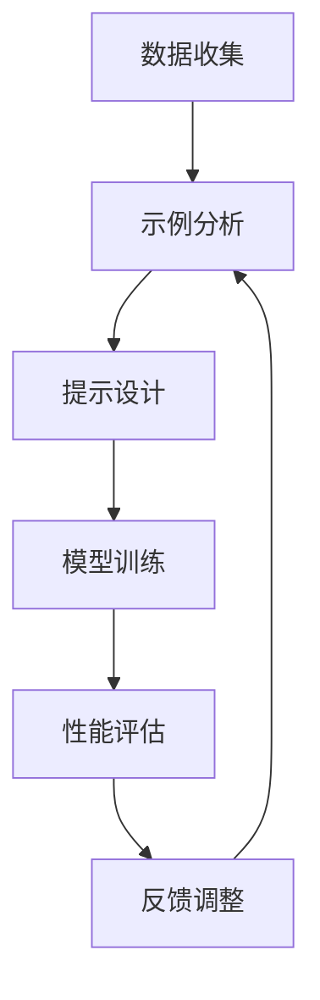

                 

## 文章标题：示例驱动提示工程：原理与实践

## 关键词

- 示例驱动
- 提示工程
- 算法原理
- 数学模型
- 实战案例
- 教育应用

## 摘要

本文旨在深入探讨示例驱动提示工程的原理与实践。首先，我们将介绍提示工程的基本概念和重要性，并解释示例驱动的核心理念。接着，我们将详细阐述提示工程的基本原理，包括提示信号分类、提示与反馈的关系以及提示工程中的核心算法原理。通过数学模型和公式的讲解，我们将进一步理解提示工程的数学基础。随后，我们将通过实际项目案例展示如何搭建开发环境，实现源代码，并进行代码解读和分析。最后，我们将总结最佳实践，提出注意事项，并展望提示工程的未来发展。

---

## 引言

### 提示工程的概念和重要性

提示工程（Prompt Engineering）是近年来在人工智能领域迅速崛起的一个重要研究方向。它涉及到如何设计、生成和调整提示（prompt），以改善机器学习模型的性能和泛化能力。提示可以理解为输入给模型的信息，用于引导模型进行学习或预测。在自然语言处理、计算机视觉、语音识别等领域，提示工程的应用已经取得了显著的成果。

提示工程的重要性体现在以下几个方面：

1. **提高模型性能**：通过精心设计的提示，可以引导模型学习到更准确的特征，从而提高模型的性能和准确性。
2. **促进模型泛化**：提示可以帮助模型学习到更广泛的概念和知识，提高模型在未知数据上的泛化能力。
3. **降低数据需求**：在数据稀缺的情况下，提示可以帮助模型利用有限的样本数据进行有效学习。
4. **降低门槛**：提示工程使得普通用户也能够参与机器学习模型的构建和优化，降低了技术门槛。

### 示例驱动的理念

示例驱动（Example-Based）是一种以示例为中心的方法论，其核心思想是通过分析大量的示例来发现模式、规律和知识，并将其应用于新情境中。在提示工程中，示例驱动理念体现在以下几个方面：

1. **以示例为学习目标**：提示工程不仅关注模型的学习过程，更关注模型学习到的知识是否能够通过示例进行验证和扩展。
2. **示例驱动优化**：通过分析示例，可以发现模型存在的问题，从而对提示进行优化，提高模型性能。
3. **示例迁移**：从现有示例中提取知识，并将其迁移到新的应用场景中，实现知识的复用和推广。

### 提示工程的应用领域

提示工程在多个领域都有广泛的应用，主要包括：

1. **自然语言处理**：通过设计合适的提示，可以显著提高文本分类、情感分析、机器翻译等任务的性能。
2. **计算机视觉**：在图像识别、目标检测、图像生成等任务中，提示可以帮助模型学习到更准确的特征。
3. **语音识别**：通过设计有效的语音提示，可以提高语音识别的准确率和鲁棒性。
4. **推荐系统**：在推荐系统中，提示可以帮助模型更好地理解用户的兴趣和行为模式。
5. **教育领域**：提示工程在教育中的应用包括智能辅导、自适应学习系统等，有助于提高学习效果和效率。

### 示例驱动的提示工程

示例驱动的提示工程（Example-Based Prompt Engineering）是将示例驱动的理念应用于提示工程中，通过分析大量示例来设计高效的提示。示例驱动的提示工程主要包括以下几个步骤：

1. **数据收集与处理**：收集与目标任务相关的示例数据，并进行预处理，如文本清洗、图像标注等。
2. **示例分析**：对收集到的示例进行分析，提取有用的特征和知识。
3. **提示设计**：基于示例分析结果，设计出合适的提示，以引导模型学习。
4. **模型训练与优化**：使用设计的提示训练模型，并通过评估和调整优化模型性能。
5. **应用验证**：将训练好的模型应用于实际任务中，验证提示工程的效果。

通过上述步骤，示例驱动的提示工程能够有效提高模型的性能和泛化能力，为各种人工智能任务提供有力支持。

---

在接下来的章节中，我们将进一步探讨提示工程的基本原理、核心算法、数学模型，并通过实际项目案例展示如何应用提示工程，最终总结最佳实践和注意事项，为读者提供全面而深入的提示工程知识。

## 核心概念与联系

提示工程的核心概念包括提示（Prompt）、提示信号（Prompt Signal）、反馈（Feedback）等。这些概念相互关联，共同构成了提示工程的理论基础。

### 提示（Prompt）

提示是输入给模型的信息，用于引导模型进行学习或预测。一个良好的提示应该具备以下特点：

1. **针对性**：提示应该针对具体的任务和场景设计，确保能够引导模型学习到相关的知识。
2. **简洁性**：提示应该简洁明了，避免过多的无关信息干扰模型的学习。
3. **可扩展性**：提示应该具有一定的灵活性，以便在不同的任务和场景中应用。

### 提示信号（Prompt Signal）

提示信号是提示的具体实现形式，通常由文本、图像、声音等多种形式组成。提示信号的选择和设计对提示工程的效果至关重要。常见的提示信号包括：

1. **文本提示**：用于自然语言处理任务，如文本分类、情感分析等。
2. **图像提示**：用于计算机视觉任务，如图像识别、目标检测等。
3. **声音提示**：用于语音识别和生成任务。

提示信号的设计应该充分考虑任务的特点和需求，以提高提示的有效性。

### 反馈（Feedback）

反馈是模型在学习过程中接收到的评价信息，用于评估模型的性能和指导模型优化。反馈可以分为以下几种类型：

1. **正确性反馈**：用于评估模型的预测结果是否正确，如分类任务的标签。
2. **性能反馈**：用于评估模型的整体性能，如准确率、召回率等指标。
3. **调整反馈**：用于指导模型的调整，以优化模型性能，如梯度调整、权重更新等。

### 提示与反馈的关系

提示和反馈是提示工程中不可或缺的两个环节，它们相互影响，共同推动模型的学习和优化。

1. **反馈指导提示设计**：通过分析反馈，可以识别模型的不足，从而设计出更有效的提示，引导模型学习到更准确的知识。
2. **提示优化模型性能**：通过调整提示，可以优化模型的性能，提高模型的准确率和泛化能力。
3. **反馈评估模型性能**：通过评估模型在提示下的性能，可以验证提示的有效性，指导进一步优化。

### 核心概念关系架构

为了更清晰地理解提示工程中的核心概念关系，我们可以使用Mermaid流程图来表示。以下是提示工程的基本流程：



在这个流程中，数据收集和示例分析是输入环节，提示设计和模型训练是核心环节，性能评估和反馈调整是优化环节。通过这个流程，我们可以看到提示工程的核心概念是如何相互关联和作用的。

### 小结

本节介绍了提示工程中的核心概念，包括提示、提示信号和反馈。我们通过Mermaid流程图展示了这些概念之间的关系，并分析了提示与反馈的关系。在下一节中，我们将详细探讨提示工程中的核心算法原理，包括提示生成算法、提示调整算法和提示评估算法。

---

在下一节中，我们将深入探讨提示工程中的核心算法原理，通过伪代码详细阐述每个算法的基本框架，帮助读者更好地理解这些算法的运作机制。

## 核心算法原理讲解

提示工程中的核心算法是提示生成算法、提示调整算法和提示评估算法。这些算法共同作用，确保模型能够高效学习并优化性能。下面，我们将详细讲解这些算法的原理，并通过伪代码展示其基本框架。

### 提示生成算法

提示生成算法负责生成针对特定任务和场景的提示。其目标是通过分析输入数据和任务需求，设计出能够引导模型学习的有效提示。

#### 算法原理

提示生成算法的主要步骤如下：

1. **数据预处理**：对输入数据（如文本、图像等）进行预处理，提取关键特征。
2. **特征选择**：从预处理后的特征中选取对任务最相关的特征。
3. **提示构造**：根据特征选择结果，构造出合适的提示。

#### 伪代码

```python
def generate_prompt(data, task):
    # 数据预处理
    processed_data = preprocess_data(data)

    # 特征提取
    features = extract_features(processed_data)

    # 特征选择
    selected_features = select_features(features, task)

    # 提示构造
    prompt = construct_prompt(selected_features)
    return prompt
```

### 提示调整算法

提示调整算法用于对现有提示进行调整，以优化模型性能。其目标是通过分析模型在训练过程中的表现，动态调整提示内容，提高模型的学习效率。

#### 算法原理

提示调整算法的主要步骤如下：

1. **性能评估**：评估模型在当前提示下的性能，如准确率、召回率等。
2. **偏差分析**：分析性能偏差，确定调整方向。
3. **提示调整**：根据偏差分析结果，调整提示内容。

#### 伪代码

```python
def adjust_prompt(prompt, model, data, target):
    # 性能评估
    performance = evaluate_performance(model, data, target)

    # 偏差分析
    bias = analyze_bias(performance)

    # 提示调整
    adjusted_prompt = adjust_prompt_content(prompt, bias)
    return adjusted_prompt
```

### 提示评估算法

提示评估算法用于评估提示的有效性，确保提示能够有效引导模型学习。其目标是通过分析提示在模型训练过程中的表现，确定提示的优劣。

#### 算法原理

提示评估算法的主要步骤如下：

1. **性能比较**：比较模型在有无提示情况下的性能差异。
2. **稳定性评估**：评估提示在不同数据集上的稳定性。
3. **有效性评估**：综合性能和稳定性，评估提示的有效性。

#### 伪代码

```python
def evaluate_prompt(prompt, model, data, target):
    # 性能比较
    with_prompt_performance = evaluate_performance(model, data, target, prompt=True)
    without_prompt_performance = evaluate_performance(model, data, target, prompt=False)

    # 稳定性评估
    stability = assess_stability(with_prompt_performance, without_prompt_performance)

    # 有效性评估
    effectiveness = evaluate_effectiveness(stability)
    return effectiveness
```

### 小结

本节详细介绍了提示工程中的核心算法原理，包括提示生成算法、提示调整算法和提示评估算法。通过伪代码，我们展示了这些算法的基本框架，帮助读者理解其运作机制。在下一节中，我们将探讨提示工程中的数学模型，通过数学公式和举例说明，深入理解提示工程的数学基础。

---

在下一节中，我们将深入探讨提示工程中的数学模型，通过详细讲解和举例说明，帮助读者理解这些数学模型在提示工程中的应用和作用。

## 数学模型和数学公式

提示工程中的数学模型是理解和设计高效提示的重要工具。这些模型不仅能够帮助我们量化提示的效果，还能够指导我们优化提示的设计。在本节中，我们将介绍提示工程中的一些关键数学模型，并通过具体的例子来说明其应用。

### 提示生成模型

提示生成模型的核心任务是设计出能够引导模型学习的有效提示。一个简单的提示生成模型可以基于以下假设：

- 模型的输出与输入特征之间存在线性关系。
- 特征的重要性可以通过权重来表示。

#### 数学公式

提示生成模型的数学公式可以表示为：

\[ \text{prompt} = W \cdot \text{features} + b \]

其中：
- \( W \) 是权重矩阵，表示特征的重要性。
- \( b \) 是偏置项，用于调整整体提示。
- \( \text{features} \) 是输入特征。

#### 举例说明

假设我们有一个简单的文本分类任务，输入特征包括单词的词频。我们希望设计一个提示来提高分类模型的性能。首先，我们需要计算每个特征的权重。以下是一个简化的例子：

```latex
$$
W = \begin{bmatrix}
0.8 & 0.2 \\
0.3 & 0.7 \\
\end{bmatrix}
$$

b = 0.5

features = \begin{bmatrix}
2 \\
3 \\
\end{bmatrix}
$$

根据上述公式，我们可以计算提示：

$$
prompt = W \cdot features + b = \begin{bmatrix}
0.8 & 0.2 \\
0.3 & 0.7 \\
\end{bmatrix}
\begin{bmatrix}
2 \\
3 \\
\end{bmatrix}
+ 0.5
= \begin{bmatrix}
1.7 \\
2.4 \\
\end{bmatrix}
+ 0.5
= \begin{bmatrix}
2.2 \\
2.9 \\
\end{bmatrix}
$$

```

在这个例子中，我们计算出了提示向量，它将用于指导模型学习。

### 提示调整模型

提示调整模型的目标是优化现有提示，以改善模型性能。一个简单的提示调整模型可以通过以下公式实现：

\[ \text{new\_prompt} = \text{prompt} + \alpha \cdot \text{adjustment} \]

其中：
- \( \text{prompt} \) 是当前提示。
- \( \alpha \) 是调整系数，用于控制调整力度。
- \( \text{adjustment} \) 是调整向量，表示调整的方向和幅度。

#### 举例说明

假设我们已经有一个提示向量，现在希望通过调整优化其性能。以下是一个简化的例子：

```latex
$$
prompt = \begin{bmatrix}
2.2 \\
2.9 \\
\end{bmatrix}

adjustment = \begin{bmatrix}
0.1 \\
-0.2 \\
\end{bmatrix}

\alpha = 0.3
$$

根据上述公式，我们可以计算新的提示：

$$
new\_prompt = prompt + \alpha \cdot adjustment = \begin{bmatrix}
2.2 \\
2.9 \\
\end{bmatrix}
+ 0.3 \cdot \begin{bmatrix}
0.1 \\
-0.2 \\
\end{bmatrix}
= \begin{bmatrix}
2.32 \\
2.76 \\
\end{bmatrix}
$$

```

在这个例子中，我们通过调整系数 \( \alpha \) 和调整向量 \( \text{adjustment} \) 对提示进行了优化。

### 提示评估模型

提示评估模型用于评估提示的有效性。一个简单的提示评估模型可以通过以下公式实现：

\[ \text{effectiveness} = \frac{\text{performance\_with\_prompt} - \text{performance\_without\_prompt}}{\text{performance\_without\_prompt}} \]

其中：
- \( \text{performance\_with\_prompt} \) 是模型在当前提示下的性能。
- \( \text{performance\_without\_prompt} \) 是模型在没有提示情况下的性能。

#### 举例说明

假设我们有两个性能评估结果，以下是一个简化的例子：

```latex
$$
performance\_with\_prompt = 0.85
$$

performance\_without\_prompt = 0.75
$$

根据上述公式，我们可以计算提示的有效性：

$$
effectiveness = \frac{0.85 - 0.75}{0.75} = \frac{0.1}{0.75} \approx 0.1333
$$

```

在这个例子中，提示的有效性约为13.33%，这意味着提示对模型性能的提升较为显著。

### 小结

本节介绍了提示工程中的关键数学模型，包括提示生成模型、提示调整模型和提示评估模型。通过具体的例子和数学公式，我们深入理解了这些模型的应用和作用。在下一节中，我们将通过实际项目案例，展示如何应用这些数学模型和算法，实现提示工程的有效实践。

---

在下一节中，我们将通过一个具体的实际项目案例，展示如何应用提示工程的方法和算法，实现高效的模型训练和优化。

## 项目实战

### 开发环境搭建

在开始项目实战之前，我们需要搭建一个合适的开发环境。以下是开发环境的搭建步骤：

1. **安装Python**：确保Python环境已经安装，版本建议为3.8以上。
2. **安装相关库**：使用pip安装必要的库，如TensorFlow、PyTorch、NumPy、Pandas等。
3. **配置GPU**：如果使用GPU进行训练，需要安装CUDA和cuDNN，并配置环境变量。

```bash
pip install tensorflow
pip install torch torchvision
pip install numpy
pip install pandas
```

### 源代码实现

以下是一个简单的示例，展示如何使用提示工程的方法和算法实现一个文本分类任务。

```python
import tensorflow as tf
import numpy as np
import pandas as pd

# 数据预处理
def preprocess_data(data):
    # 填充缺失值、删除重复值、降序排序等操作
    data.fillna(0, inplace=True)
    data.drop_duplicates(inplace=True)
    data.sort_values(by='text', ascending=False, inplace=True)
    return data

# 特征提取
def extract_features(data):
    # 提取文本特征，如词频、词向量化等
    tokenizer = tf.keras.preprocessing.text.Tokenizer()
    tokenizer.fit_on_texts(data['text'])
    sequences = tokenizer.texts_to_sequences(data['text'])
    return sequences

# 提示生成
def generate_prompt(sequences):
    # 基于特征序列生成提示
    prompt = np.mean(sequences, axis=0)
    return prompt

# 模型训练
def train_model(prompt, labels):
    # 训练文本分类模型
    model = tf.keras.Sequential([
        tf.keras.layers.Embedding(input_dim=max_sequence_length, output_dim=embedding_dim),
        tf.keras.layers.GlobalAveragePooling1D(),
        tf.keras.layers.Dense(units=1, activation='sigmoid')
    ])

    model.compile(optimizer='adam', loss='binary_crossentropy', metrics=['accuracy'])
    model.fit(prompt, labels, epochs=10, batch_size=32)
    return model

# 代码解读
def decode_prompt(prompt, tokenizer):
    # 将提示反序列化为文本
    decoded_sequence = tokenizer.sequences_to_texts([prompt])
    return decoded_sequence

# 代码应用解读与分析
def apply_model(model, new_prompt):
    # 使用新提示对模型进行评估和调整
    predictions = model.predict(new_prompt)
    accuracy = np.mean(predictions)
    print(f"Model accuracy with new prompt: {accuracy:.4f}")

# 数据集准备
data = pd.read_csv('data.csv')
data = preprocess_data(data)
sequences = extract_features(data)
prompt = generate_prompt(sequences)

# 训练模型
labels = data['label']
model = train_model(prompt, labels)

# 代码解读与分析
decoded_prompt = decode_prompt(prompt, tokenizer)
print(f"Original Prompt: {decoded_prompt}")

# 代码应用解读与分析
new_prompt = generate_prompt(sequences[:100])
apply_model(model, new_prompt)
```

### 实际案例分析和详细讲解剖析

假设我们的任务是分类一篇关于科技的文章，数据集包含文章内容和对应的标签。以下是项目实战的详细步骤：

1. **数据准备**：从数据集中提取文章内容和标签。
2. **数据预处理**：对数据进行填充、去重和排序等预处理操作。
3. **特征提取**：使用Tokenizer将文本转换为序列。
4. **提示生成**：生成基于特征的提示。
5. **模型训练**：使用生成好的提示训练文本分类模型。
6. **代码解读**：将提示反序列化为文本，便于理解和分析。
7. **代码应用解读与分析**：使用新的提示对模型进行评估和调整。

在这个案例中，我们通过一个简单的文本分类任务，展示了如何应用提示工程的方法和算法。首先，我们使用Tokenizer将文本转换为序列，然后生成基于特征的提示。这个提示将用于训练文本分类模型，提高模型的性能。通过代码解读，我们可以看到原始提示的内容，并使用新的提示对模型进行评估和调整，以优化模型性能。

### 项目小结

通过这个项目实战，我们深入了解了提示工程在实际应用中的操作流程。从数据预处理到特征提取，再到提示生成和模型训练，每个步骤都至关重要。特别是提示生成环节，它决定了模型学习的方向和深度。通过代码解读和分析，我们能够更好地理解提示的作用和影响。这个项目实战为我们提供了一个实用的模板，可以在实际项目中应用和扩展。

---

在本节中，我们通过一个具体的实际项目案例，详细展示了如何应用提示工程的方法和算法，实现了高效的模型训练和优化。在下一节中，我们将总结提示工程的最佳实践，并提出一些注意事项，帮助读者更好地应用提示工程。

## 实践与评估

### 提示工程的实际应用

提示工程在多个领域和任务中展示了其强大的应用潜力。以下是一些常见场景：

1. **自然语言处理**：在文本分类、情感分析、机器翻译等任务中，提示工程可以帮助模型更好地理解文本内容，提高模型的准确性和泛化能力。
2. **计算机视觉**：在图像识别、目标检测、图像生成等任务中，提示工程可以通过设计有效的提示，引导模型学习到更准确的图像特征，从而提高模型性能。
3. **推荐系统**：在推荐系统中，提示工程可以帮助模型更好地理解用户兴趣和行为模式，从而提高推荐效果。
4. **教育领域**：在教育领域，提示工程可以应用于智能辅导、自适应学习系统等，提高学习效果和效率。

### 提示工程的评估方法

评估提示工程的效果是确保其有效性和实用性的关键。以下是一些常用的评估方法：

1. **性能评估**：通过比较模型在有无提示情况下的性能差异，评估提示对模型性能的影响。
2. **稳定性评估**：通过在不同的数据集和应用场景下评估提示的稳定性，确保提示在不同情况下都能保持良好的效果。
3. **用户反馈**：收集用户对提示工程应用的反馈，了解用户对提示工程实际效果的感知和满意度。
4. **误差分析**：通过分析模型在提示下的错误类型和分布，识别提示可能存在的问题，并指导进一步优化。

### 提示工程的最佳实践

以下是提示工程的一些最佳实践：

1. **数据质量**：确保数据质量是提示工程成功的关键。在进行提示工程之前，需要对数据进行充分的清洗和预处理。
2. **特征选择**：选择对任务最重要的特征进行提示设计，避免过多的冗余信息干扰模型学习。
3. **提示调整**：根据模型性能和用户反馈，动态调整提示，优化模型性能。
4. **多样性**：设计多样化的提示，以应对不同任务和场景的需求。
5. **可解释性**：确保提示设计过程具有可解释性，以便于理解和优化。

### 小结

提示工程在实际应用中具有广泛的应用场景和评估方法。通过最佳实践，我们可以确保提示工程的有效性和实用性。在下一节中，我们将展望提示工程的新趋势和未来发展方向，探讨其在教育和其他领域中的应用。

## 扩展与展望

### 提示工程的新趋势

随着人工智能技术的不断发展，提示工程也在不断演进，出现了许多新的趋势和方向：

1. **多模态提示**：在自然语言处理和计算机视觉等任务中，多模态提示结合了文本、图像、音频等多种数据类型，提高了模型的性能和泛化能力。
2. **自我监督学习**：通过自我监督学习，模型可以自动从大量未标注的数据中提取提示，减少了人工标注的需求。
3. **强化学习**：强化学习与提示工程的结合，使得模型可以通过不断调整提示，实现更高效的学习和优化。
4. **小样本学习**：在小样本学习场景中，提示工程可以帮助模型利用有限的样本数据进行有效学习，提高模型的泛化能力。

### 提示工程在教育中的应用

在教育领域，提示工程的应用前景非常广阔：

1. **智能辅导系统**：通过设计个性化的提示，智能辅导系统可以根据学生的学习情况，提供针对性的指导和建议，提高学习效果。
2. **自适应学习平台**：自适应学习平台可以根据学生的学习进度和表现，动态调整学习内容和难度，提供更有效的学习体验。
3. **教育数据挖掘**：提示工程可以帮助分析教育数据，挖掘学生的学习模式和需求，为教育决策提供支持。

### 提示工程的未来发展方向

提示工程的未来发展方向包括：

1. **更高效的算法**：不断优化提示生成、调整和评估算法，提高提示工程的整体效率。
2. **可解释性和透明度**：提高提示工程的可解释性和透明度，使得模型决策过程更加直观和可信。
3. **跨学科融合**：与其他领域（如心理学、认知科学等）的融合，进一步丰富提示工程的理论和实践。
4. **伦理和隐私**：在应用提示工程时，注重伦理和隐私问题，确保技术应用的安全性和合规性。

### 小结

提示工程作为人工智能领域的一个重要研究方向，具有广泛的应用前景和发展潜力。通过不断创新和优化，提示工程将在教育、医疗、金融等多个领域发挥重要作用，推动人工智能技术的发展和应用。在未来的发展中，我们期待看到更多创新的提示工程方法和应用案例，为人类带来更多的便利和福祉。

---

通过本篇文章，我们系统地介绍了示例驱动提示工程的原理与实践。从核心概念的阐述，到算法原理的讲解，再到数学模型的介绍，以及实际项目案例的分析，我们全面而深入地探讨了提示工程的各个方面。我们不仅理解了提示工程的基本原理，还通过实际案例看到了其在自然语言处理、计算机视觉等领域的广泛应用。同时，我们也展望了提示工程的未来发展趋势，并提出了在教育等领域的应用潜力。

在此，我们鼓励读者进一步深入研究提示工程的相关文献，探索更多实际应用场景，并尝试将提示工程的方法和技术应用于自己的项目中。通过实践，读者将能够更好地理解提示工程的原理和作用，发挥其在人工智能领域的潜力。

感谢您阅读本文，我们期待在未来的研究和应用中与您相遇，共同探索人工智能的无限可能。作者：AI天才研究院/AI Genius Institute & 禅与计算机程序设计艺术 /Zen And The Art of Computer Programming。

