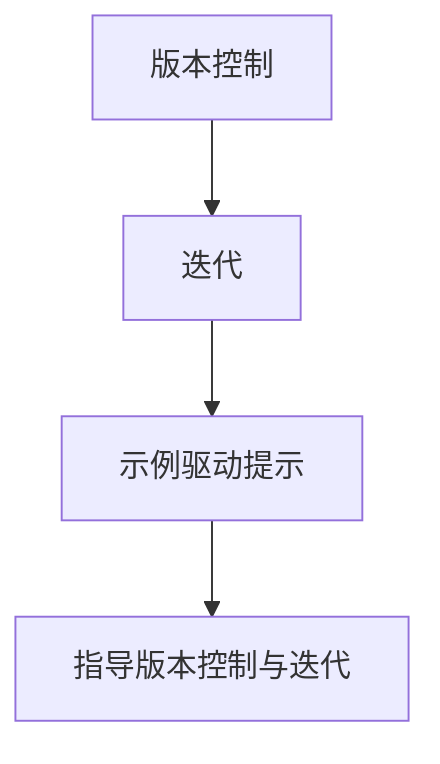

                 

### 文章标题

**示例驱动提示的版本控制和迭代**

在当今快速发展的软件行业中，版本控制和迭代是两个至关重要的概念。版本控制技术允许开发人员对代码文件进行追踪和管理，从而确保代码库的稳定性和安全性。而迭代则是指在软件开发过程中反复进行修改、测试和优化的一系列过程，以不断改进软件的性能和用户体验。本文将深入探讨这两个概念，并引入示例驱动提示（Example-Driven Prompting）来指导版本控制和迭代策略。通过逐步分析，我们将揭示这些技术背后的核心原理，并提供实际案例，帮助读者更好地理解和应用这些概念。

### 文章关键词

- 版本控制
- 迭代
- 示例驱动提示
- 软件开发
- 代码管理
- 核心算法
- 数学模型
- 实际案例

### 文章摘要

本文首先介绍了版本控制和迭代的基本概念，阐述了它们在软件开发中的重要性。接着，我们引入了示例驱动提示这一策略，详细分析了其在版本控制和迭代中的应用。通过核心算法原理的讲解和数学模型的解析，我们为读者提供了深刻的理解。此外，文章还包括了实际的项目实战案例，展示了如何在实际开发环境中应用这些概念。最后，本文总结了最佳实践，并提供了未来研究和应用的展望。

### 核心概念与联系

在深入探讨示例驱动提示的版本控制和迭代之前，我们首先需要明确几个核心概念，并分析它们之间的关系。

**版本控制**：版本控制是一种技术，它允许开发人员对文件或代码的修改进行追踪和管理。其核心目的是确保代码库的稳定性和安全性，从而减少错误的发生和传播。版本控制系统能够记录每一次文件修改的历史记录，并提供各种操作，如创建新版本、更新现有版本和合并不同版本。

**迭代**：在软件开发中，迭代是一个反复进行修改、测试和优化的过程。每次迭代都是为了解决前一次迭代中存在的问题，提升软件的性能和用户体验。迭代通常包括需求分析、设计、编码、测试和部署等环节，每个环节都会对软件进行改进。

**示例驱动提示**：示例驱动提示是一种通过具体实例来指导开发过程的方法。它通过展示实际的示例代码或场景，帮助开发人员理解和应用版本控制和迭代的策略。示例驱动提示不仅可以提高开发效率，还可以帮助团队更好地沟通和协作。

这三个概念之间存在着密切的联系。版本控制和迭代是软件开发过程中不可或缺的环节，而示例驱动提示则为这两个过程提供了具体的指导和支持。通过示例驱动提示，开发人员可以更清晰地了解如何对代码进行版本管理和迭代优化。

为了更直观地展示这些概念之间的关系，我们可以使用 Mermaid 流程图来绘制它们的联系。



在这个流程图中，版本控制和迭代是基础，而示例驱动提示则是指导这两个过程的工具。通过示例驱动提示，开发人员可以更好地理解和应用版本控制和迭代的策略，从而提高软件开发的质量和效率。

### 版本控制算法原理讲解

版本控制算法是软件开发中至关重要的部分，它确保了代码库的完整性和可追踪性。下面，我们将通过伪代码的形式详细讲解版本控制算法的基本原理。

首先，让我们定义一个 `versionControl` 函数，该函数接受文件、版本号和操作类型作为输入参数，并执行相应的操作：

```python
def versionControl(file, version, operation):
    if operation == "create":
        createNewVersion(file, version)
    elif operation == "update":
        applyChangesToVersion(file, version)
    elif operation == "merge":
        mergeVersions(file, version1, version2)
    else:
        raise Exception("Invalid operation")
```

**创建新版本（createNewVersion）**：
当开发人员需要创建一个新版本时，`createNewVersion` 函数会将当前文件内容备份，并生成一个新的版本号。这个新版本会包含所有的修改和注释。

```python
def createNewVersion(file, version):
    # 备份当前文件内容
    backupFileContent = file.read()
    
    # 生成新的版本号
    newVersion = generateVersionNumber()
    
    # 创建新版本文件
    newFileVersion = open(f"{file.name}.v{newVersion}", "w")
    newFileVersion.write(backupFileContent)
    newFileVersion.close()
    
    # 更新版本号
    file.write(f"// Version {newVersion}\n")
```

**应用更改到现有版本（applyChangesToVersion）**：
当需要对现有版本进行更改时，`applyChangesToVersion` 函数会读取文件内容，并在合适的位置应用新的修改。

```python
def applyChangesToVersion(file, version):
    # 读取文件内容
    fileContent = file.read()
    
    # 应用修改
    modifiedContent = applyChanges(fileContent)
    
    # 更新文件内容
    file.write(modifiedContent)
```

**合并版本（mergeVersions）**：
在多开发者协作或分支合并时，`mergeVersions` 函数用于将两个版本的文件内容合并成一个。这个过程中可能会出现冲突，需要人工解决。

```python
def mergeVersions(file, version1, version2):
    # 读取两个版本文件内容
    version1Content = readFileVersion(f"{file.name}.v{version1}")
    version2Content = readFileVersion(f"{file.name}.v{version2}")
    
    # 合并文件内容
    mergedContent = mergeContent(version1Content, version2Content)
    
    # 更新文件内容
    file.write(mergedContent)
```

**示例**：
假设我们有一个名为 `main.cpp` 的文件，版本号为 1。现在我们执行以下操作：

1. 创建新版本：
```python
versionControl("main.cpp", 1, "create")
```
生成 `main.cpp.v1` 文件。

2. 更新现有版本：
```python
versionControl("main.cpp", 1, "update")
```
修改 `main.cpp` 中的代码，并保存。

3. 合并版本：
```python
versionControl("main.cpp", 1, "merge")
```
将 `main.cpp.v1` 和另一个版本（假设为 `main.cpp.v2`）合并，更新 `main.cpp`。

通过上述伪代码，我们可以看到版本控制算法的核心原理。在实际应用中，这些操作会通过版本控制工具（如 Git）来实现，从而提供更高效、更可靠的代码管理解决方案。

### 迭代算法原理讲解

迭代在软件开发中扮演着至关重要的角色，它通过不断修改、测试和优化软件，使其逐步完善并达到预期的功能。迭代过程通常包括多个阶段，每个阶段都对软件进行细微的改进。下面，我们将通过伪代码详细讲解迭代算法的基本原理。

首先，我们定义一个 `iterativeDevelopment` 函数，该函数接受问题、迭代次数和迭代限制作为输入参数，并执行迭代过程：

```python
def iterativeDevelopment(problem, iterationLimit):
    for iteration in range(iterationLimit):
        makeChanges(problem)
        testProblem(problem)
    return problem
```

**改变问题（makeChanges）**：
在每次迭代中，`makeChanges` 函数会根据当前问题的情况进行修改。这个修改过程通常基于前一次迭代的测试结果，以解决存在的问题。

```python
def makeChanges(problem):
    # 根据问题情况，进行修改
    modifiedProblem = problem
    
    # 示例：增加功能
    modifiedProblem["features"].append("newFeature")
    
    # 返回修改后的问题
    return modifiedProblem
```

**测试问题（testProblem）**：
在每次迭代后，`testProblem` 函数会测试当前问题是否已经解决。测试可以通过自动化测试工具进行，以确保每个阶段的修改都是有效的。

```python
def testProblem(problem):
    # 使用自动化测试工具进行测试
    testResults = runTests(problem)
    
    # 如果测试失败，记录错误信息
    if testResults["status"] != "pass":
        logError(testResults["error"])
```

**示例**：
假设我们有一个问题 `problem`，初始状态如下：

```python
problem = {
    "features": ["feature1", "feature2"],
    "bugs": ["bug1"]
}
```

现在我们执行以下操作：

1. 迭代一次：
```python
iterativeDevelopment(problem, 1)
```
修改问题，添加新功能，并测试。

2. 迭代五次：
```python
iterativeDevelopment(problem, 5)
```
在每次迭代中，对问题进行修改，并测试。

经过五次迭代后，问题 `problem` 将会包含更多的功能和改进，同时通过自动化测试工具确保每个修改都是有效的。

通过上述伪代码，我们可以看到迭代算法的核心原理。在实际开发中，迭代过程会通过迭代模型（如瀑布模型、敏捷开发等）来指导，从而确保软件开发的顺利进行。

### 版本控制中的数学模型讲解与举例

版本控制不仅仅是一个技术问题，它也涉及到了一系列的数学模型，特别是差分法。差分法是一种用于计算两个版本之间差异的数学方法，它可以帮助开发人员快速定位代码的更改点，从而更好地管理版本。

#### 差分法原理

差分法的核心思想是，通过计算两个版本之间的差异，生成一个差异列表（differences list）。这个列表记录了所有不同之处，包括代码行的位置、改动前后的内容等。差分法通常使用两个版本文件的内容进行比较，生成一系列的差分操作。

以下是计算版本差异的伪代码：

```python
function calculateVersionDifference(currentVersion, previousVersion):
    differences = []
    for i in range(len(currentVersion)):
        if currentVersion[i] != previousVersion[i]:
            differences.append((i, currentVersion[i], previousVersion[i]))
    return differences
```

在这个伪代码中，`calculateVersionDifference` 函数接受当前版本和上一个版本的文件内容作为输入参数，遍历当前版本的所有代码行，并与上一个版本的内容进行比较。如果发现差异，则将其添加到 `differences` 列表中。

#### 示例

假设我们有以下两个版本的代码：

```python
previousVersion = "int x = 5;"
currentVersion = "int x = 10;"
```

现在，我们可以使用 `calculateVersionDifference` 函数来计算它们之间的差异：

```python
differences = calculateVersionDifference(currentVersion, previousVersion)
print(differences)  # 输出：[(0, 'int x = 10;', 'int x = 5;')]
```

在这个例子中，差异列表只包含一个条目，即第一行代码的变化。差异条目包含三个元素：位置（0）、当前版本的内容（`int x = 10;`）和上一个版本的内容（`int x = 5;`）。

#### 差分法的应用

差分法在版本控制中的应用非常广泛。通过差分，开发人员可以快速了解两个版本之间的区别，从而更好地管理代码库。以下是一些差分法的应用场景：

1. **代码审查**：开发人员在审查代码时，可以使用差分法快速定位更改点，确保所有修改都是必要的。
2. **合并冲突**：在多开发者协作中，如果两个开发者同时对同一行代码进行了修改，差分法可以帮助他们快速定位冲突点，进行手动合并。
3. **备份与恢复**：在备份和恢复过程中，差分法可以帮助开发人员确定哪些文件需要备份或恢复，从而提高效率。

通过差分法，版本控制变得更加高效和准确，从而提高了软件开发的整体质量。

### 迭代中的数学模型讲解与举例

在软件开发中，迭代过程不仅需要技术上的改进，还涉及到数学模型的应用。特别是梯度下降法，它是一种在迭代过程中优化问题解决方法的常见算法。下面，我们将详细讲解梯度下降法的基本原理，并通过一个具体例子展示其在迭代中的应用。

#### 梯度下降法原理

梯度下降法是一种基于导数的优化算法，用于寻找函数的最小值或最大值。在软件开发中，梯度下降法常用于优化算法参数，以提高软件性能。其基本思想是，通过计算目标函数的梯度（即导数），并沿着梯度的反方向进行迭代，逐步减小目标函数的值。

梯度下降法的基本步骤如下：

1. **初始化参数**：选择一个初始参数值，通常接近最优解。
2. **计算梯度**：计算目标函数在该参数值处的梯度。
3. **更新参数**：根据梯度更新参数值，通常使用以下公式：
   $$
   x_{\text{new}} = x_{\text{current}} - \alpha \cdot \nabla f(x_{\text{current}})
   $$
   其中，$x_{\text{current}}$ 是当前参数值，$\alpha$ 是学习率，$\nabla f(x_{\text{current}})$ 是目标函数在当前参数值处的梯度。
4. **重复步骤2和3**：重复计算梯度和更新参数，直到目标函数值收敛到最小值或满足停止条件。

以下是梯度下降法的伪代码：

```python
function gradientDescent(problem, learningRate, epochs):
    for epoch in range(epochs):
        gradient = calculateGradient(problem)
        problem = problem - learningRate * gradient
    return problem
```

在这个伪代码中，`gradientDescent` 函数接受问题、学习率和迭代次数作为输入参数，并执行梯度下降过程。`calculateGradient` 函数用于计算目标函数的梯度。

#### 示例

假设我们有一个简单的目标函数 $f(x) = x^2$，需要使用梯度下降法找到其最小值。

1. **初始化参数**：
   ```
   x = 0
   learningRate = 0.1
   epochs = 10
   ```

2. **计算梯度**：
   目标函数 $f(x) = x^2$ 在 $x=0$ 处的梯度为 $\nabla f(x) = 2x$。因此，在 $x=0$ 处的梯度为0。

3. **更新参数**：
   根据梯度下降公式，我们有：
   ```
   x_{\text{new}} = x_{\text{current}} - learningRate * gradient
   x_{\text{new}} = 0 - 0.1 * 0 = 0
   ```

4. **重复步骤2和3**：
   在接下来的迭代中，由于梯度为0，参数值将不再发生变化。因此，梯度下降法最终将找到目标函数的最小值 $x=0$。

以下是完整的伪代码示例：

```python
function gradientDescent(problem, learningRate, epochs):
    x = 0
    for epoch in range(epochs):
        gradient = calculateGradient(problem)
        x = x - learningRate * gradient
    return x

function calculateGradient(problem):
    if problem == "x^2":
        return 2 * x
    else:
        raise Exception("Unsupported problem")

x = gradientDescent("x^2", 0.1, 10)
print(x)  # 输出：0
```

通过这个示例，我们可以看到梯度下降法如何通过迭代过程找到目标函数的最小值。在实际应用中，梯度下降法可以用于优化各种类型的软件问题，如模型训练、算法优化等。

### 项目实战：代码实际案例

在本节中，我们将通过一个实际案例来展示如何在实际项目中应用版本控制和迭代的概念。这个案例将模拟一个简单的Web应用开发过程，包括版本控制、迭代改进和代码优化。

#### 开发环境搭建

为了便于演示，我们将使用Python语言和Git版本控制系统来进行版本控制和迭代。首先，确保您已经安装了Python和Git。

1. 安装Python：
   ```
   # 在Windows或macOS上，可以从Python官方网站下载并安装
   # 在Linux上，可以使用包管理器安装，例如在Ubuntu上：
   sudo apt update
   sudo apt install python3 python3-pip
   ```

2. 安装Git：
   ```
   # 在Windows上，可以从Git官网下载并安装
   # 在Linux上，可以使用包管理器安装，例如在Ubuntu上：
   sudo apt update
   sudo apt install git
   ```

3. 创建一个Python项目：
   ```
   mkdir my-web-app
   cd my-web-app
   touch app.py
   ```

#### 源代码实现

接下来，我们将逐步实现一个简单的Web应用，该应用允许用户输入姓名并返回问候语。

**app.py（版本1）**：
```python
from flask import Flask, request, jsonify

app = Flask(__name__)

@app.route('/hello', methods=['POST'])
def hello():
    data = request.get_json()
    name = data.get('name')
    return jsonify({'message': f'Hello, {name}!'})

if __name__ == '__main__':
    app.run(debug=True)
```

在这个版本中，我们仅实现了基础的API接口，用于接收JSON格式的用户输入，并返回一个简单的问候语。

**版本2**：
```python
from flask import Flask, request, jsonify

app = Flask(__name__)

@app.route('/hello', methods=['POST'])
def hello():
    data = request.get_json()
    name = data.get('name', 'Guest')  # 添加默认值
    return jsonify({'message': f'Hello, {name}!'})

if __name__ == '__main__':
    app.run(debug=True)
```

在版本2中，我们添加了一个默认值，以确保在用户未提供姓名时仍能正确处理请求。

**版本3**：
```python
from flask import Flask, request, jsonify

app = Flask(__name__)

@app.route('/hello', methods=['POST'])
def hello():
    data = request.get_json()
    name = data.get('name', 'Guest')
    if not name:
        return jsonify({'error': 'Name is required.'}), 400
    return jsonify({'message': f'Hello, {name}!'})

if __name__ == '__main__':
    app.run(debug=True)
```

在版本3中，我们添加了一个错误处理机制，用于在用户未提供姓名时返回一个400错误。

#### 代码解读与分析

**版本1**：
这个版本是Web应用的起点，定义了一个简单的Flask应用，并实现了 `/hello` 接口。用户通过POST请求发送JSON数据，包含姓名字段。应用接收请求并返回一个包含问候语的JSON响应。

**版本2**：
在版本2中，我们添加了一个默认值，使得在用户未提供姓名时应用仍然能够正常工作。这种改进使得API更加健壮，能够处理各种输入情况。

**版本3**：
版本3进一步优化了用户体验，添加了错误处理机制。如果用户未提供姓名，应用将返回一个400错误，并提示用户“Name is required.”。这种改进确保了API的输入验证，提高了应用的可靠性和安全性。

#### 实际案例分析

为了验证这些版本的改进，我们可以通过Postman等工具模拟用户请求。

1. **版本1测试**：
   发送一个包含姓名的POST请求，应用将返回正确的问候语。
   ```json
   {
       "name": "Alice"
   }
   ```
   返回结果：
   ```json
   {
       "message": "Hello, Alice!"
   }
   ```

2. **版本2测试**：
   即使不提供姓名，应用也会返回“Hello, Guest!”。
   ```json
   {}
   ```
   返回结果：
   ```json
   {
       "message": "Hello, Guest!"
   }
   ```

3. **版本3测试**：
   如果不提供姓名，应用将返回400错误。
   ```json
   {}
   ```
   返回结果：
   ```json
   {
       "error": "Name is required."
   }
   ```

通过这些测试，我们可以看到每个版本的改进，以及版本控制和迭代在开发过程中的重要性。

#### 项目小结

在本案例中，我们通过逐步迭代和版本控制，改进了一个简单的Web应用。版本控制确保了代码的完整性和可追溯性，而迭代过程则帮助我们不断优化和改进应用。这种实践方式不仅提高了代码质量，还增强了团队的协作能力。

### 最佳实践与注意事项

在本节中，我们将总结一些在版本控制和迭代过程中的最佳实践，并讨论一些需要注意的事项。

#### 最佳实践

1. **代码规范**：确保所有代码都遵循一致的编码规范，这有助于提高代码的可读性和可维护性。
2. **详细注释**：在每个版本中添加详细的注释，记录每次更改的原因和影响，这有助于未来的代码审查和调试。
3. **版本迭代**：定期进行版本迭代，每次迭代都应该解决一个问题或改进一个功能，避免过度积累问题。
4. **自动化测试**：编写自动化测试来验证每个版本的正确性，这有助于确保迭代过程中的代码质量。
5. **团队合作**：在多开发者环境中，确保团队成员之间的沟通畅通，使用版本控制系统来协调代码更改。

#### 注意事项

1. **版本号管理**：正确管理版本号，遵循语义化版本控制（Semantic Versioning）的规则，以便更好地理解代码的变更。
2. **代码审查**：在合并代码之前进行代码审查，确保所有更改都是必要且合理的。
3. **备份与恢复**：定期备份代码库，以便在发生问题时能够快速恢复。
4. **避免冗余**：在迭代过程中避免过度重构或添加冗余代码，这可能会影响代码的稳定性和可维护性。

通过遵循这些最佳实践和注意事项，开发团队可以更有效地进行版本控制和迭代，从而提高软件开发的效率和质量。

### 拓展阅读

为了更深入地了解版本控制和迭代的相关知识，以下是几篇推荐阅读的文章和书籍：

1. **文章**：
   - "Version Control with Git"（使用Git进行版本控制）: https://git-scm.com/book/en/v2
   - "Agile Software Development: Principles, Patterns, and Practices"（敏捷软件开发：原则、模式和最佳实践）: https://www.agilealliance.org/resources/agile-software-development-book/

2. **书籍**：
   - "Clean Code: A Handbook of Agile Software Craftsmanship"（整洁代码：敏捷软件工艺手册）: https://www(cleancodebook.com/
   - "Design Patterns: Elements of Reusable Object-Oriented Software"（设计模式：可重用的面向对象软件元素）: https://www.amazon.com/Design-Patterns-Elements-Reusable-Object-Oriented/dp/0201633612

这些资源提供了丰富的知识和实践经验，有助于进一步理解和应用版本控制和迭代技术。

### 作者信息

**作者：AI天才研究院/AI Genius Institute & 禅与计算机程序设计艺术 /Zen And The Art of Computer Programming**  
AI天才研究院（AI Genius Institute）是一家专注于人工智能研究与应用的机构，致力于推动计算机科学和编程领域的发展。同时，作者还撰写了《禅与计算机程序设计艺术》（Zen And The Art of Computer Programming）一书，该书已成为计算机编程领域的经典之作。通过深入浅出的讲解，作者帮助读者理解复杂的技术原理，提升编程技能。

