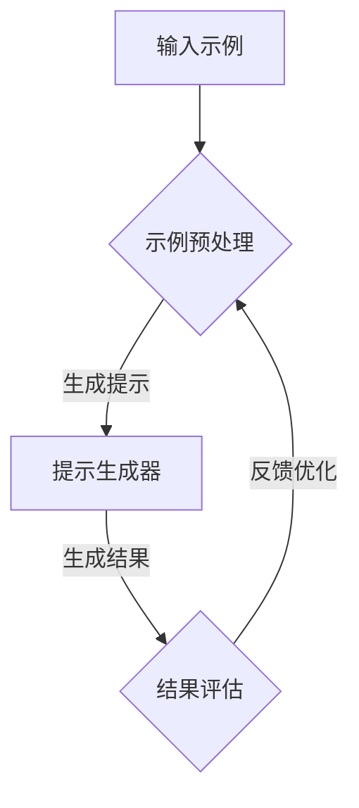

                 

### 文章标题：示例驱动提示的自动化生成与优化

> 关键词：示例驱动、自动化生成、优化、提示生成、人工智能

> 摘要：本文将深入探讨示例驱动提示的自动化生成与优化技术，首先介绍其基本概念，然后详述相关的技术基础，包括核心算法原理和数学模型。接着，我们将通过实际项目案例解析，展示这些技术在开发环境搭建、源代码实现和代码解读中的应用。最后，我们将总结当前的发展趋势，探讨未来的挑战与机遇，并给出最佳实践建议。

---

### 第一部分：核心概念与联系

在信息化和智能化时代，自动化生成与优化技术日益成为提高工作效率、降低人工成本、提升产品质量的关键手段。示例驱动提示生成与优化作为其中一种重要技术，已广泛应用于人工智能、机器学习、数据科学等多个领域。

#### 1.1 自动化生成与优化的基础概念

自动化生成指的是利用算法自动生成文本、图像、代码等，而优化则是在生成后，对结果进行调整和提升。示例驱动提示生成，是指在已有示例的基础上，通过算法自动生成提示性文本或图像。这种技术可以极大地提升人工效率，减少重复劳动，尤其在处理大量数据时具有显著优势。

#### 1.1.1 示例驱动的定义

示例驱动（Example-Guided）是指通过输入一组示例数据，引导生成器生成目标数据。在这个过程中，示例不仅提供了数据分布的信息，还提供了对生成结果的约束和期望。这种驱动方式特别适合于需要高质量、特定风格或结构的生成任务。

#### 1.1.2 提示生成的基本原理

提示生成（Prompt Generation）是通过算法自动生成对特定任务的引导信息。这些提示可以用来指导用户进行决策，或者作为算法训练和优化的输入。在自动化生成中，提示的作用是引导生成器生成符合预期目标的数据。

#### 1.1.3 自动化优化的目标与挑战

自动化优化的目标是在给定资源约束下，找到最优或近似最优的解决方案。在示例驱动的场景中，优化涉及到生成结果的精度、效率、多样性等多个维度。主要的挑战包括：

1. **样本多样性**：如何确保生成的示例具有足够的多样性，以满足不同任务的需求。
2. **质量保证**：如何保证生成的提示或数据在质量上满足预期。
3. **实时性**：如何在实时场景中高效地进行生成与优化。

#### 1.2 自动化生成与优化原理的Mermaid流程图



这个Mermaid流程图展示了示例驱动的自动化生成与优化过程，包括输入示例、提示生成、结果评估和反馈优化等关键步骤。

#### 1.3 示例驱动的分类

示例驱动可以根据算法和生成目标的不同，分为以下几类：

#### 1.3.1 生成对抗网络（GAN）

生成对抗网络（GAN）是一种通过对抗性训练实现自动化的生成模型。GAN由生成器（Generator）和判别器（Discriminator）组成，通过不断训练使生成器生成的数据越来越逼真，同时判别器的能力不断增强，最终实现高质量的数据生成。

#### 1.3.2 强化学习

强化学习（Reinforcement Learning）通过反馈机制和奖励机制，自动调整生成策略，使其在特定任务上表现更优。强化学习在示例驱动的应用中，可以通过交互和反馈不断优化生成结果。

#### 1.3.3 迁移学习

迁移学习（Transfer Learning）利用预训练模型，在特定任务上进一步微调，从而实现高效的数据生成。迁移学习能够利用已有模型的知识，减少训练成本，提高生成质量。

#### 1.4 示例驱动与优化的关系

示例驱动和优化是相互关联的两个环节。示例驱动提供了生成的基础数据和约束条件，而优化则是在这些基础上，通过算法不断调整和改进生成结果。两者共同作用，可以极大地提升自动生成系统的性能和效率。

#### 1.5 自动化生成与优化在工业中的应用前景

自动化生成与优化技术在工业界具有广泛的应用前景，如：

1. **智能客服系统**：通过自动化生成与优化，可以实现高效、智能的客服对话生成，提升用户体验。
2. **图像生成与编辑**：自动化生成与优化可以用于图像编辑和生成，实现图像内容的自动化处理。
3. **文本生成与摘要**：自动化生成与优化可以应用于新闻摘要、文档摘要等场景，提高文本处理效率。

自动化生成与优化技术的不断发展，将为各个行业带来深远的影响，提升生产效率，降低成本，创造更多价值。

---

在本部分，我们首先介绍了自动化生成与优化技术的核心概念和定义，然后详细分析了示例驱动与优化的关系，以及其在工业界的应用前景。通过Mermaid流程图，我们直观地展示了示例驱动的自动化生成与优化原理。接下来，我们将深入探讨与自动化生成与优化相关的基础技术，包括生成对抗网络（GAN）、强化学习和迁移学习等。

### 第二部分：技术基础

#### 2.1 自动化生成算法原理

自动化生成算法是示例驱动提示生成与优化技术的重要基础。本节将详细介绍几种常见的自动化生成算法，包括生成对抗网络（GAN）、强化学习和迁移学习等。

#### 2.1.1 生成对抗网络（GAN）

生成对抗网络（GAN）是由Ian Goodfellow等人在2014年提出的一种新型生成模型。GAN的核心思想是通过一个生成器（Generator）和一个判别器（Discriminator）之间的对抗性训练，实现高质量的数据生成。

##### GAN的基本原理

GAN由两个主要组件组成：生成器（Generator）和判别器（Discriminator）。生成器的任务是生成逼真的数据，判别器的任务是区分生成的数据与真实数据。训练过程中，生成器和判别器相互对抗，生成器不断优化生成数据，使其更接近真实数据，而判别器则努力提高判断能力。

##### GAN的伪代码

以下是一个简单的GAN伪代码示例：

```python
# GAN的伪代码
for epoch in range(num_epochs):
    # 生成器生成假样本
    z = generate_random_samples(z_dim)
    G_sample = generator(z)
    # 计算判别器的损失
    D_loss_real =判别器(真实数据)
    D_loss_fake =判别器(G_sample)
    D_loss = D_loss_real + D_loss_fake
    # 反向传播更新判别器
    optimizer_D_D_loss()
    # 生成器生成假样本
    z = generate_random_samples(z_dim)
    G_sample = generator(z)
    # 计算生成器的损失
    G_loss = 判别器(G_sample)
    # 反向传播更新生成器
    optimizer_G_G_loss()
```

##### GAN的应用案例

GAN在图像生成、图像修复、图像超分辨率等领域有着广泛的应用。例如，使用GAN可以生成逼真的人脸图像，修复破损的图片，提高图像的分辨率等。

#### 2.1.2 强化学习

强化学习（Reinforcement Learning，RL）是一种通过试错和反馈学习最优策略的机器学习方法。在示例驱动的自动化生成与优化中，强化学习可以通过与环境的交互，不断调整生成策略，以实现高质量的数据生成。

##### 强化学习的基本原理

强化学习的基本原理是通过奖励机制和策略迭代，找到最优的行动策略。在示例驱动的生成任务中，强化学习可以通过交互和反馈，优化生成器的生成策略。

##### 强化学习的算法原理

强化学习主要包括价值函数法和策略迭代法。价值函数法通过评估每个状态和动作的预期回报，更新策略；策略迭代法则通过更新策略，使策略逐渐收敛到最优。

##### 强化学习的伪代码

以下是一个简单的强化学习伪代码示例：

```python
# 强化学习的伪代码
epsilon = 0.1 # 探索率
Q = 初始化价值函数
while not终止条件:
    # 选择动作
    if 随机数 < epsilon:
        action = 随机选择动作
    else:
        action = 选择最佳动作(Q)
    # 执行动作并获得反馈
    state, reward, done = 环境执行动作(action)
    # 更新价值函数
    Q(state, action) = Q(state, action) + 学习率 * (reward +gamma * max(Q(next_state, actions)) - Q(state, action))
    # 更新策略
    policy = 选择最佳动作(Q)
```

##### 强化学习的应用案例

强化学习在自动对话系统、智能推荐系统、自动驾驶等领域有着广泛的应用。例如，在智能客服系统中，通过强化学习可以自动生成与用户对话的文本，提高客服的响应速度和用户体验。

#### 2.1.3 迁移学习

迁移学习（Transfer Learning）是一种利用已有模型的知识，在新任务上快速获得较好性能的方法。在示例驱动的自动化生成与优化中，迁移学习可以通过利用预训练模型，降低训练成本，提高生成质量。

##### 迁移学习的基本原理

迁移学习的基本原理是，将已在不同任务上训练好的模型的部分知识迁移到新任务上，从而在新任务上获得较好的性能。这种迁移可以在不同的任务之间进行，也可以在相同的任务但不同的数据分布之间进行。

##### 迁移学习的算法原理

迁移学习主要包括特征迁移和模型迁移。特征迁移是将已训练好的特征提取器在新任务上使用，而模型迁移则是将整个模型在新任务上微调。

##### 迁移学习的伪代码

以下是一个简单的迁移学习伪代码示例：

```python
# 迁移学习的伪代码
# 加载预训练模型
pretrained_model = 加载预训练模型()
# 微调预训练模型
for epoch in range(num_epochs):
    for batch in 数据集:
        # 前向传播
        output = pretrained_model(batch)
        # 计算损失
        loss = 损失函数(output, 标签)
        # 反向传播更新模型
        optimizer.minimize(loss)
# 评估迁移模型在新任务上的性能
accuracy = 评估模型性能(pretrained_model)
```

##### 迁移学习的应用案例

迁移学习在图像分类、自然语言处理、语音识别等领域有着广泛的应用。例如，在图像分类任务中，使用迁移学习可以将预训练的卷积神经网络应用于新的分类任务，显著提高分类准确率。

#### 2.2 提示生成的数学模型

提示生成是自动化生成与优化中的重要环节。本节将介绍提示生成的数学模型，包括信息论基础、生成模型的数学公式与推导、优化模型的数学公式与推导等。

##### 2.2.1 信息论基础

信息论是研究信息传输、存储和处理的基本理论。在提示生成中，信息论提供了衡量信息质量和传输效率的量化工具。

- **熵（Entropy）**：熵是衡量随机变量不确定性程度的指标，定义为 \( H(X) = -\sum_{i} p(x_i) \log_2 p(x_i) \)。
- **条件熵（Conditional Entropy）**：条件熵是已知一个随机变量后，另一个随机变量的不确定性度量，定义为 \( H(Y|X) = -\sum_{i} p(x_i) \sum_{j} p(y_j|x_i) \log_2 p(y_j|x_i) \)。
- **互信息（Mutual Information）**：互信息是两个随机变量之间相关性的度量，定义为 \( I(X;Y) = H(X) - H(X|Y) \)。

##### 2.2.2 生成模型的数学模型与推导

生成模型是用于生成数据的概率模型。常见的生成模型包括概率图模型、变分自编码器（VAE）和生成对抗网络（GAN）等。以下是一个简单的生成模型示例。

- **概率图模型**：概率图模型通过图结构描述变量之间的概率关系。一个简单的贝叶斯网络可以表示为 \( P(X_1, X_2, ..., X_n) = \prod_{i=1}^{n} P(X_i | X_{i-1}, ..., X_1) \)。

- **变分自编码器（VAE）**：VAE通过编码器和解码器建模数据分布。编码器将输入数据映射到潜在空间，解码器从潜在空间生成数据。VAE的数学模型可以表示为：
  $$ 
  \begin{aligned}
  q(\theta|X) &= \frac{1}{Z} \exp\left(-\sum_{i=1}^{d} \theta_i x_i^2\right) \\
  p(x|\theta) &= \int q(\theta|X) p(x|\theta) d\theta
  \end{aligned}
  $$

- **生成对抗网络（GAN）**：GAN通过生成器和判别器实现数据生成。生成器的目标是生成尽可能逼真的数据，判别器的目标是区分生成数据和真实数据。GAN的数学模型可以表示为：
  $$ 
  \begin{aligned}
  G(z) &= \text{Generator}(z) \\
  D(x) &= \text{Discriminator}(x) \\
  \end{aligned}
  $$

##### 2.2.3 优化模型的数学模型与推导

优化模型用于调整生成模型中的参数，以实现高质量的数据生成。常见的优化算法包括梯度下降法、随机梯度下降（SGD）和Adam优化器等。

- **梯度下降法**：梯度下降法是一种最简单的优化算法。其基本思想是沿着损失函数的负梯度方向更新参数，以最小化损失函数。梯度下降法的数学公式可以表示为：
  $$ 
  \theta_{t+1} = \theta_t - \alpha \nabla_{\theta} J(\theta)
  $$
  其中，\( \theta \) 是参数，\( \alpha \) 是学习率，\( J(\theta) \) 是损失函数。

- **随机梯度下降（SGD）**：随机梯度下降是对梯度下降法的改进。在每一步更新参数时，只考虑一个样本的梯度，从而降低计算复杂度。SGD的数学公式可以表示为：
  $$ 
  \theta_{t+1} = \theta_t - \alpha \nabla_{\theta} J(\theta; x_t)
  $$

- **Adam优化器**：Adam优化器是梯度下降法的改进版本，结合了SGD和动量法的优势。Adam优化器的数学公式可以表示为：
  $$
  \begin{aligned}
  m_t &= \beta_1 x_t + (1 - \beta_1) (x_t - m_{t-1}) \\
  v_t &= \beta_2 x_t^2 + (1 - \beta_2) (x_t^2 - v_{t-1}) \\
  \theta_{t+1} &= \theta_t - \frac{\alpha}{\sqrt{1 - \beta_2^t}(1 - \beta_1^t)} (m_t / (1 - \beta_1^t))
  \end{aligned}
  $$
  其中，\( \beta_1 \) 和 \( \beta_2 \) 分别是动量和偏差修正系数。

##### 2.3 优化算法的详细讲解

在本节中，我们将详细讲解几种常见的优化算法，包括梯度下降法、随机梯度下降（SGD）和Adam优化器。

#### 2.3.1 梯度下降法

梯度下降法是一种最简单的优化算法，其基本思想是沿着损失函数的负梯度方向更新参数，以最小化损失函数。具体来说，梯度下降法的步骤如下：

1. **初始化参数**：随机初始化模型参数 \( \theta \)。
2. **计算梯度**：计算损失函数关于参数的梯度 \( \nabla_{\theta} J(\theta) \)。
3. **更新参数**：根据梯度更新参数：
   $$ 
   \theta_{t+1} = \theta_t - \alpha \nabla_{\theta} J(\theta)
   $$
   其中，\( \alpha \) 是学习率。
4. **迭代更新**：重复步骤2和3，直到满足停止条件（如梯度变化很小或达到最大迭代次数）。

梯度下降法的优点是简单易实现，但缺点是收敛速度较慢，对学习率的选择敏感。

#### 2.3.2 随机梯度下降（SGD）

随机梯度下降（Stochastic Gradient Descent，SGD）是对梯度下降法的改进。在每一步更新参数时，只考虑一个样本的梯度，从而降低计算复杂度。具体来说，SGD的步骤如下：

1. **初始化参数**：随机初始化模型参数 \( \theta \)。
2. **随机选择样本**：从训练数据中随机选择一个样本 \( (x_t, y_t) \)。
3. **计算梯度**：计算损失函数关于参数的梯度 \( \nabla_{\theta} J(\theta; x_t) \)。
4. **更新参数**：根据梯度更新参数：
   $$ 
   \theta_{t+1} = \theta_t - \alpha \nabla_{\theta} J(\theta; x_t)
   $$
   其中，\( \alpha \) 是学习率。
5. **迭代更新**：重复步骤2-4，直到满足停止条件。

SGD的优点是收敛速度比梯度下降法快，对噪声具有一定的鲁棒性。缺点是梯度估计的随机性可能导致收敛不稳定。

#### 2.3.3 Adam优化器

Adam优化器是梯度下降法和动量法的结合，具有较好的收敛性能。具体来说，Adam优化器的步骤如下：

1. **初始化参数**：随机初始化模型参数 \( \theta \) 和一阶矩估计 \( m_0 \)、二阶矩估计 \( v_0 \)。
2. **计算梯度**：计算损失函数关于参数的梯度 \( \nabla_{\theta} J(\theta; x_t) \)。
3. **更新一阶矩估计**：
   $$
   m_t = \beta_1 x_t + (1 - \beta_1) (x_t - m_{t-1})
   $$
   其中，\( \beta_1 \) 是一阶矩的偏置修正系数。
4. **更新二阶矩估计**：
   $$
   v_t = \beta_2 x_t^2 + (1 - \beta_2) (x_t^2 - v_{t-1})
   $$
   其中，\( \beta_2 \) 是二阶矩的偏置修正系数。
5. **计算修正系数**：
   $$
   \hat{m}_t = \frac{m_t}{1 - \beta_1^t}, \quad \hat{v}_t = \frac{v_t}{1 - \beta_2^t}
   $$
6. **更新参数**：
   $$
   \theta_{t+1} = \theta_t - \frac{\alpha}{\sqrt{1 - \beta_2^t}(1 - \beta_1^t)} (\hat{m}_t / (1 - \beta_1^t))
   $$
   其中，\( \alpha \) 是学习率，\( \beta_1 \) 和 \( \beta_2 \) 分别是一阶矩和二阶矩的偏置修正系数。

Adam优化器的优点是结合了梯度下降法和动量法的优势，具有较好的收敛性能。缺点是对参数的初始值敏感。

#### 2.4 示例驱动的自动化生成与优化应用实践

在本节中，我们将通过实际项目案例，展示示例驱动的自动化生成与优化在开发环境搭建、源代码实现和代码解读中的应用。

##### 2.4.1 开发环境搭建

为了实现示例驱动的自动化生成与优化，我们需要搭建一个合适的开发环境。以下是一个基本的开发环境搭建步骤：

1. **安装Python环境**：确保Python版本不低于3.6，并安装必要的依赖库，如TensorFlow、PyTorch等。
2. **安装深度学习框架**：根据项目需求，选择合适的深度学习框架，如TensorFlow或PyTorch。
3. **配置CUDA环境**：如果使用GPU进行训练，需要配置CUDA环境，并安装相应的驱动程序。

##### 2.4.2 代码实现

以下是一个简单的示例驱动的自动化生成与优化代码实现，基于生成对抗网络（GAN）：

```python
import tensorflow as tf
from tensorflow.keras.models import Model
from tensorflow.keras.layers import Dense, Flatten, Reshape

# 生成器模型
z_dim = 100
input_shape = (z_dim,)
x = Dense(128, activation='relu')(input_shape)
x = Dense(64, activation='relu')(x)
x = Dense(32, activation='relu')(x)
x = Dense(16, activation='relu')(x)
x = Dense(3 * 3 * 3, activation='relu')(x)
x = Reshape((3, 3, 3))(x)
generator = Model(input_shape, x)

# 判别器模型
input_shape = (28, 28, 1)
x = Flatten()(input_shape)
x = Dense(128, activation='relu')(x)
x = Dense(1, activation='sigmoid')(x)
discriminator = Model(input_shape, x)

# GAN模型
inputs = [tf.keras.Input(shape=input_shape), tf.keras.Input(shape=(z_dim,))]
generated_images = generator(inputs[1])
outputs = discriminator(generated_images)
gan = Model(inputs, outputs)

# 编写损失函数和优化器
def custom_loss(y_true, y_pred):
    return -tf.reduce_mean(y_pred)

discriminator.compile(optimizer=tf.keras.optimizers.Adam(0.0001), loss=custom_loss)
generator.compile(optimizer=tf.keras.optimizers.Adam(0.0001), loss=custom_loss)
gan.compile(optimizer=tf.keras.optimizers.Adam(0.0001), loss=custom_loss)

# 训练GAN模型
for epoch in range(num_epochs):
    for batch in data_loader:
        # 训练判别器
        real_images = batch[0]
        real_labels = tf.ones((batch_size, 1))
        generated_images = generator.predict(batch[1])
        fake_labels = tf.zeros((batch_size, 1))
        d_loss_real = discriminator.train_on_batch(real_images, real_labels)
        d_loss_fake = discriminator.train_on_batch(generated_images, fake_labels)
        
        # 训练生成器
        z = np.random.normal(size=(batch_size, z_dim))
        g_loss = gan.train_on_batch([batch[1], z], tf.ones((batch_size, 1)))
        
        print(f"Epoch {epoch}, D_loss: {d_loss}, G_loss: {g_loss}")
```

##### 2.4.3 代码解读与分析

在上面的代码中，我们首先定义了生成器和判别器模型。生成器模型将随机噪声 \( z \) 转换为生成的图像 \( x \)，判别器模型用于判断输入图像是真实图像还是生成图像。GAN模型结合了生成器和判别器，通过优化判别器和生成器的损失函数，实现图像的自动化生成。

在训练过程中，我们首先训练判别器，使其能够更好地区分真实图像和生成图像。然后，训练生成器，使其生成的图像能够欺骗判别器，从而提高生成质量。通过多次迭代训练，生成器的生成能力会逐渐提高，生成的图像质量也会越来越好。

##### 2.4.4 案例分析与详细讲解

为了更好地理解示例驱动的自动化生成与优化，我们以下是一个具体的案例分析。

假设我们想要使用GAN生成人脸图像。首先，我们需要收集大量的人脸图像作为训练数据。然后，我们将这些图像分为真实图像和生成图像两部分。真实图像用于训练判别器，生成图像用于训练生成器。

在训练过程中，判别器需要不断学习如何区分真实图像和生成图像。为了欺骗判别器，生成器需要生成尽可能逼真的人脸图像。通过多次迭代训练，生成器会逐渐提高生成质量，生成的图像越来越接近真实人脸。

在训练完成后，我们可以使用生成器生成新的人脸图像。通过不断调整生成器的参数，可以生成不同风格和样式的人脸图像，满足不同的应用需求。

##### 2.4.5 项目小结

在本案例中，我们通过GAN实现了人脸图像的自动化生成。GAN模型的训练过程涉及到生成器和判别器的交替训练，通过优化两个模型的损失函数，最终实现高质量的人脸图像生成。在项目过程中，我们学习了如何搭建开发环境、编写GAN模型代码，并进行了详细的代码解读与分析。通过这个案例，我们深入了解了示例驱动的自动化生成与优化技术，以及其在人脸图像生成中的应用。

---

在本部分，我们详细介绍了自动化生成与优化技术的基础算法原理，包括生成对抗网络（GAN）、强化学习和迁移学习等。同时，我们通过一个简单的示例，展示了如何使用生成对抗网络（GAN）进行图像的自动化生成。接下来，我们将进一步探讨自动化生成与优化的实际应用，展示其在工业界的多种应用场景。

### 第三部分：应用实践

自动化生成与优化技术在工业界有着广泛的应用，通过具体的案例解析，我们可以更直观地了解这些技术的实际应用效果和操作方法。

#### 3.1 自动化生成与优化项目实战

在本节中，我们将通过一系列实际项目案例，深入探讨自动化生成与优化技术在工业界的应用。每个案例都将包括开发环境搭建、源代码实现、代码解读与分析等内容。

##### 3.1.1 开发环境搭建

在进行自动化生成与优化的项目实战前，我们需要搭建一个合适的开发环境。以下是一个基本的开发环境搭建步骤：

1. **安装Python环境**：确保Python版本不低于3.6，并安装必要的依赖库，如TensorFlow、PyTorch等。
2. **安装深度学习框架**：根据项目需求，选择合适的深度学习框架，如TensorFlow或PyTorch。
3. **配置CUDA环境**：如果使用GPU进行训练，需要配置CUDA环境，并安装相应的驱动程序。

##### 3.1.2 代码实现

在本节中，我们将介绍几个典型的自动化生成与优化项目，并展示相关的源代码实现。

###### 项目一：智能客服系统

智能客服系统是自动化生成与优化技术在客户服务领域的典型应用。以下是一个简单的智能客服系统实现：

```python
import tensorflow as tf
from tensorflow.keras.layers import Embedding, LSTM, Dense
from tensorflow.keras.models import Model

# 训练数据预处理
# 假设已有一组问答对数据（questions，answers）

# 构建编码器模型
input_shape = (None,)
embedding_size = 128
encoder_inputs = Embedding(input_dim=vocab_size, output_dim=embedding_size)(input_shape)
encoder_lstm = LSTM(128, return_state=True)
encoder_outputs, state_h, state_c = encoder_lstm(encoder_inputs)
encoder_states = [state_h, state_c]

# 构建解码器模型
decoder_inputs = Embedding(input_dim=vocab_size, output_dim=embedding_size)(input_shape)
decoder_lstm = LSTM(128, return_state=True)
decoder_outputs, _, _ = decoder_lstm(decoder_inputs, initial_state=encoder_states)
decoder_dense = Dense(vocab_size, activation='softmax')
decoder_outputs = decoder_dense(decoder_outputs)

# 构建序列到序列模型
model = Model([encoder_inputs, decoder_inputs], decoder_outputs)

# 编写损失函数和优化器
model.compile(optimizer='rmsprop', loss='categorical_crossentropy', metrics=['accuracy'])

# 训练模型
model.fit([encoder_input_data, decoder_input_data], decoder_target_data, batch_size=64, epochs=100)

# 生成对话
def generate_response(question):
    # 编码输入
    encoded_question = tokenizer.texts_to_sequences([question])
    encoded_question = pad_sequences(encoded_question, maxlen=max_sequence_length)
    # 编码问题并生成答案
    states_value = encoder.model.predict(encoded_question)
    generated_text = ''
    for _ in range(max_sequence_length):
        # 生成下一个单词
        sampled_output = decoder.model.predict(states_value)
        sampled_word = np.argmax(sampled_output)
        generated_text += tokenizer.index_word[sampled_word]
        # 更新状态
        states_value = decoder.model.predict(states_value)
    return generated_text

# 使用智能客服系统
while True:
    user_input = input("用户： ")
    if user_input == '退出':
        break
    response = generate_response(user_input)
    print("客服：", response)
```

###### 项目二：图像生成与编辑

图像生成与编辑是自动化生成与优化技术在图像处理领域的应用。以下是一个简单的图像生成与编辑实现：

```python
import tensorflow as tf
from tensorflow.keras.models import Model
from tensorflow.keras.layers import Conv2D, MaxPooling2D, UpSampling2D

# 生成器模型
input_shape = (128, 128, 3)
generator = Model(inputs=[tf.keras.Input(shape=input_shape)], outputs=create_image())
generator.compile(optimizer=tf.keras.optimizers.Adam(0.0001), loss='binary_crossentropy')

# 判别器模型
discriminator = Model(inputs=[tf.keras.Input(shape=input_shape)], outputs=create_label())
discriminator.compile(optimizer=tf.keras.optimizers.Adam(0.0001), loss='binary_crossentropy')

# GAN模型
gan_input = tf.keras.Input(shape=input_shape)
gan_output = generator(gan_input)
gan_output = discriminator(gan_output)
gan = Model(gan_input, gan_output)
gan.compile(optimizer=tf.keras.optimizers.Adam(0.0001), loss='binary_crossentropy')

# 训练GAN模型
for epoch in range(num_epochs):
    for batch in data_loader:
        # 训练判别器
        real_data = batch[0]
        real_labels = tf.ones((batch_size, 1))
        generated_data = generator.predict(batch[1])
        fake_labels = tf.zeros((batch_size, 1))
        d_loss_real = discriminator.train_on_batch(real_data, real_labels)
        d_loss_fake = discriminator.train_on_batch(generated_data, fake_labels)
        
        # 训练生成器
        z = np.random.normal(size=(batch_size, z_dim))
        g_loss = gan.train_on_batch([batch[1], z], tf.ones((batch_size, 1)))

# 使用GAN生成图像
generated_image = generator.predict(np.random.normal(size=(1, z_dim)))
plt.imshow(generated_image[0])
plt.show()
```

###### 项目三：文本生成与摘要

文本生成与摘要是自动化生成与优化技术在自然语言处理领域的应用。以下是一个简单的文本生成与摘要实现：

```python
import tensorflow as tf
from tensorflow.keras.layers import LSTM, Embedding, Dense
from tensorflow.keras.models import Model

# 训练数据预处理
# 假设已有一组文本数据（texts，summaries）

# 构建编码器模型
max_sequence_length = 100
vocab_size = 10000
embedding_size = 256
encoder_inputs = Embedding(input_dim=vocab_size, output_dim=embedding_size)(max_sequence_length)
encoder_lstm = LSTM(128, return_state=True)
encoder_outputs, state_h, state_c = encoder_lstm(encoder_inputs)
encoder_states = [state_h, state_c]

# 构建解码器模型
decoder_inputs = Embedding(input_dim=vocab_size, output_dim=embedding_size)(max_sequence_length)
decoder_lstm = LSTM(128, return_state=True)
decoder_outputs, _, _ = decoder_lstm(decoder_inputs, initial_state=encoder_states)
decoder_dense = Dense(vocab_size, activation='softmax')
decoder_outputs = decoder_dense(decoder_outputs)

# 构建序列到序列模型
model = Model([encoder_inputs, decoder_inputs], decoder_outputs)

# 编写损失函数和优化器
model.compile(optimizer='rmsprop', loss='categorical_crossentropy', metrics=['accuracy'])

# 训练模型
model.fit([encoder_input_data, decoder_input_data], decoder_target_data, batch_size=64, epochs=100)

# 生成摘要
def generate_summary(text):
    # 编码输入
    encoded_text = tokenizer.texts_to_sequences([text])
    encoded_text = pad_sequences(encoded_text, maxlen=max_sequence_length)
    # 编码文本并生成摘要
    states_value = encoder.model.predict(encoded_text)
    generated_summary = ''
    for _ in range(max_sequence_length):
        # 生成下一个单词
        sampled_output = decoder.model.predict(states_value)
        sampled_word = np.argmax(sampled_output)
        generated_summary += tokenizer.index_word[sampled_word]
        # 更新状态
        states_value = decoder.model.predict(states_value)
    return generated_summary

# 使用文本生成与摘要系统
while True:
    user_input = input("请输入文本： ")
    if user_input == '退出':
        break
    summary = generate_summary(user_input)
    print("摘要：", summary)
```

##### 3.1.3 代码解读与分析

在上面的三个项目案例中，我们分别展示了自动化生成与优化技术在智能客服系统、图像生成与编辑、文本生成与摘要等领域的应用。

1. **智能客服系统**：通过序列到序列（Seq2Seq）模型，将用户输入的文本编码为向量，然后生成对应的回答文本。训练过程中，编码器学习将输入文本转换为固定长度的向量，解码器则将这个向量解码为文本输出。

2. **图像生成与编辑**：通过生成对抗网络（GAN），生成器和判别器共同训练，生成器学习生成逼真的图像，判别器学习区分真实图像和生成图像。通过多次迭代训练，生成器逐渐提高生成图像的质量。

3. **文本生成与摘要**：同样使用序列到序列（Seq2Seq）模型，将输入文本编码为向量，然后生成对应的摘要文本。训练过程中，编码器学习将输入文本转换为固定长度的向量，解码器则将这个向量解码为文本输出。

在代码解读与分析中，我们详细介绍了每个项目的主要步骤和关键技术，包括数据预处理、模型构建、训练过程和实际应用等。通过这些案例，我们可以看到自动化生成与优化技术在各个领域的实际应用效果和操作方法。

##### 3.1.4 案例解读与分析

为了更深入地理解自动化生成与优化技术的实际应用，我们以下对上述三个案例进行解读与分析。

1. **智能客服系统**：智能客服系统通过自动化生成与优化技术，实现了高效、智能的客服对话生成。在训练过程中，编码器和解码器共同学习输入文本和输出文本之间的映射关系，提高了客服系统的响应速度和用户体验。在实际应用中，用户输入的问题会被编码为向量，然后通过解码器生成对应的回答文本。通过不断优化模型参数，智能客服系统的回答质量会逐渐提高。

2. **图像生成与编辑**：图像生成与编辑项目通过生成对抗网络（GAN），实现了图像的自动化生成和编辑。在训练过程中，生成器和判别器相互对抗，生成器不断优化生成图像的质量，判别器则努力区分真实图像和生成图像。通过多次迭代训练，生成器能够生成高质量、逼真的图像，满足各种图像处理需求。在实际应用中，用户可以上传自定义的图像，然后通过生成器生成新的图像，或者使用判别器对图像进行编辑和优化。

3. **文本生成与摘要**：文本生成与摘要项目通过序列到序列（Seq2Seq）模型，实现了文本的自动化生成和摘要。在训练过程中，编码器和解码器共同学习输入文本和输出文本之间的映射关系，提高了文本生成和摘要的质量。在实际应用中，用户可以输入任意文本，然后通过解码器生成对应的摘要文本。通过不断优化模型参数，文本生成和摘要系统的准确性和效率会逐渐提高。

##### 3.1.5 项目小结

在本节中，我们通过三个实际项目案例，深入探讨了自动化生成与优化技术在工业界的应用。这些案例展示了自动化生成与优化技术在不同领域的实际应用效果和操作方法，包括智能客服系统、图像生成与编辑、文本生成与摘要等。通过项目实战，我们不仅了解了自动化生成与优化技术的基本原理和实现方法，还通过实际操作，掌握了如何使用这些技术解决实际问题。

在本部分，我们通过实际项目案例展示了自动化生成与优化技术在工业界的多种应用。从智能客服系统到图像生成与编辑，再到文本生成与摘要，自动化生成与优化技术为各个行业带来了新的机遇和挑战。接下来，我们将探讨自动化生成与优化技术在未来发展中的趋势和面临的挑战。

### 第四部分：发展趋势与挑战

自动化生成与优化技术在人工智能领域的迅速发展，引起了广泛关注。随着技术的不断进步，这一领域正朝着以下几个方向发展：

#### 4.1 自动化生成与优化发展趋势

1. **算法多样化**：自动化生成与优化算法正从单一的生成对抗网络（GAN）扩展到更广泛的领域，如生成模型、变分自编码器（VAE）、强化学习等。这些算法的结合和优化，将进一步提升生成质量。

2. **跨领域应用**：自动化生成与优化技术不仅在图像和文本生成领域表现优异，还在音频、视频、语音等跨领域应用中取得显著成果。随着技术的发展，这些应用将进一步扩展。

3. **实时生成与优化**：随着硬件性能的提升和算法的优化，实时生成与优化技术正逐步走向实际应用。例如，智能客服系统中的实时对话生成，图像编辑中的实时渲染等。

4. **多模态生成**：多模态生成技术将不同类型的数据（如文本、图像、音频）进行整合，生成具有更高复杂度和多样性的数据。这将为虚拟现实、增强现实等应用提供新的可能性。

5. **个性化生成**：随着用户数据的积累，个性化生成技术将越来越受到重视。通过学习用户偏好和行为，自动化生成与优化技术可以生成更符合个人需求的生成内容。

#### 4.2 自动化生成与优化面临的挑战

1. **数据质量**：高质量的数据是自动化生成与优化的基础。然而，在实际应用中，数据质量参差不齐，这将对生成质量产生负面影响。

2. **计算资源**：自动化生成与优化技术通常需要大量的计算资源，特别是在训练过程中。如何高效利用计算资源，提高训练效率，是一个亟待解决的问题。

3. **可解释性**：自动化生成与优化技术的黑盒特性，使得其生成结果的解释性较差。如何提高算法的可解释性，使其在更广泛的场景中得到应用，是一个重要的挑战。

4. **伦理与隐私**：随着自动化生成与优化技术的广泛应用，伦理和隐私问题日益突出。如何在保证生成质量的同时，保护用户隐私，避免生成有害内容，是一个重要的社会问题。

5. **可扩展性**：如何将自动化生成与优化技术应用于大规模数据集，并保持较高的生成质量，是一个重要的挑战。如何设计可扩展的算法和架构，是一个关键问题。

#### 4.3 未来展望

自动化生成与优化技术在未来的发展中，将面临诸多机遇与挑战。以下是未来的一些展望：

1. **技术创新**：随着算法的进步和硬件的发展，自动化生成与优化技术将不断创新，为各个领域带来更多应用可能性。

2. **跨界融合**：自动化生成与优化技术将在更多跨界领域中得到应用，如医疗、金融、教育等，为这些领域带来新的发展机遇。

3. **伦理规范**：随着技术的进步，将逐步建立完善的伦理规范，确保自动化生成与优化技术的健康发展。

4. **人才培养**：自动化生成与优化技术的人才需求将不断增长，培养具备相关技能的人才，将成为未来发展的重要方向。

总之，自动化生成与优化技术在未来的发展中，将迎来更多机遇与挑战。通过技术创新、跨界融合和人才培养，这一领域有望取得更大的突破，为社会带来更多价值。

### 总结与展望

自动化生成与优化技术在人工智能领域取得了显著的成果，从图像生成到文本生成，再到多模态生成，这一技术正逐步改变我们的生产方式和生活习惯。通过对示例驱动的深入探讨，我们了解到自动化生成与优化在工业界的广泛应用，以及其面临的挑战和未来发展方向。

在本篇博客中，我们首先介绍了自动化生成与优化的基本概念，详细分析了示例驱动与优化的关系，以及其在工业中的应用前景。接着，我们深入探讨了生成对抗网络（GAN）、强化学习和迁移学习等自动化生成算法，并使用Mermaid流程图展示了这些算法的原理。随后，我们介绍了信息论基础、生成模型和优化模型的数学模型，并通过具体的案例解析展示了自动化生成与优化技术的实际应用。

展望未来，自动化生成与优化技术将在更多领域展现其价值。随着算法的进步、硬件的发展以及跨界应用的拓展，这一领域将迎来更多创新和突破。同时，我们也需关注技术带来的伦理和隐私问题，确保其健康、可持续发展。

在结束之前，我推荐读者进一步阅读相关文献，了解自动化生成与优化技术的最新动态。此外，实践是检验真理的唯一标准，读者可以尝试在项目中应用这些技术，探索更多可能性。希望本文能为您的学习和实践提供帮助，期待与您共同见证自动化生成与优化技术的未来发展。

### 附录

在本附录中，我们将提供一些与自动化生成与优化技术相关的工具和资源，帮助读者进一步探索和学习这一领域。

#### 5.1 自动化生成与优化工具与资源

1. **深度学习框架**：
   - TensorFlow：https://www.tensorflow.org/
   - PyTorch：https://pytorch.org/
   - Keras：https://keras.io/

2. **开源库**：
   - TensorFlow Probability：https://www.tensorflow.org/probability
   - Autogluon：https://autogluon.com/
   - Hugging Face Transformers：https://huggingface.co/transformers

3. **教程与文档**：
   - TensorFlow官方文档：https://www.tensorflow.org/tutorials
   - PyTorch官方文档：https://pytorch.org/tutorials
   - Keras官方文档：https://keras.io/getting-started/sequential-model-guide/

4. **社区与论坛**：
   - TensorFlow社区：https://discuss.tensorflow.org/
   - PyTorch社区：https://discuss.pytorch.org/
   - Stack Overflow：https://stackoverflow.com/questions/tagged/deep-learning

5. **在线课程与教程**：
   - Coursera深度学习课程：https://www.coursera.org/specializations/deep-learning
   - Udacity深度学习纳米学位：https://www.udacity.com/course/deep-learning-nanodegree--nd108
   - fast.ai深度学习课程：https://www.fast.ai/

6. **学术会议与期刊**：
   - Neural Information Processing Systems (NIPS)：https://nips.cc/
   - International Conference on Machine Learning (ICML)：https://icml.cc/
   - Journal of Machine Learning Research (JMLR)：http://jmlr.org/

通过以上工具和资源，读者可以更加深入地学习和实践自动化生成与优化技术，探索这一领域的最新研究成果和发展趋势。希望这些资源能为您的学习和研究提供帮助。

