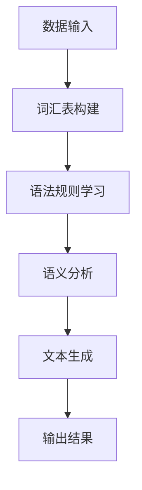

                 

### 文章标题

《社交互动能力评测：测试LLM的人际交往技能》

> 关键词：社交互动能力评测、语言模型、LLM、人机交互、人工智能

摘要：本文深入探讨了社交互动能力评测的概念及其在人工智能领域的重要性。通过分析语言模型（LLM）的人际交往技能，本文旨在为开发者提供一套完整的评测方法和实用指南，以促进人工智能在社交互动领域的应用与发展。

### 引言

在当今快速发展的科技时代，人工智能（AI）已经深入到我们生活的方方面面。从虚拟客服到社交网络聊天机器人，再到智能虚拟助手，AI的社交互动能力正变得越来越重要。然而，如何评估和提升这种能力，成为了一个值得探讨的课题。

社交互动能力评测，即对AI在社交互动中的表现进行量化评估，是一项具有深远意义的研究。这不仅有助于了解AI在人际交往方面的潜力，还能为开发者提供有价值的反馈，以优化模型设计和提高交互质量。

本文将围绕以下三个方面展开讨论：

1. **社交互动能力评测的背景和重要性**：介绍评测的定义、目的和背景，以及其在AI领域的发展趋势。
2. **LLM的人际交往技能**：分析语言模型（LLM）的基本原理及其在人际交往中的应用。
3. **评测方法与实践**：详细阐述社交互动能力评测的方法，包括数据收集、预处理、评估指标和算法等，并结合实际案例进行剖析。

### 设计《社交互动能力评测：测试LLM的人际交往技能》的目录大纲

为了系统地探讨社交互动能力评测，本文将遵循以下目录大纲结构：

#### 第一部分：引论

1. **社交互动能力评测概述**
   - 定义和重要性
   - 目的和预期效果
   - 发展历程

2. **语言模型与人机交互**
   - LLM简介
   - 人机交互的原理和现状
   - 关联性

3. **本书结构安排**
   - 内容概览
   - 学习方法

#### 第二部分：社交互动能力评测基础

1. **语言模型基础**
   - 词汇表
   - 语法规则
   - 语义分析

2. **数学模型**
   - 概率论基础
   - 统计模型
   - 数学公式

3. **社交互动能力评估指标**
   - 交互质量
   - 反应速度
   - 情绪理解

#### 第三部分：LLM的人际交往技能评测方法

1. **数据收集与预处理**
   - 数据来源
   - 数据预处理

2. **评测指标与算法**
   - 反应速度评测
   - 情绪理解评测

3. **评测流程与评估**
   - 评测流程
   - 评估标准

#### 第四部分：案例研究

1. **虚拟客服机器人**
   - 案例背景
   - 评测过程

2. **社交网络聊天机器人**
   - 案例背景
   - 评测过程

3. **虚拟助手**
   - 案例背景
   - 评测过程

通过以上目录结构，本文将为读者提供一个全面、系统、易于理解的社交互动能力评测指南，帮助读者深入理解这一领域，并在实际应用中取得更好的效果。

### 第一部分：引论

#### 1.1 社交互动能力评测概述

**定义**：社交互动能力评测是指通过一系列方法和技术，对人工智能（AI）模型在社交互动中的表现进行定量和定性分析的过程。这种评测旨在衡量AI在理解、响应和适应社交互动环境中的能力，从而为模型优化和改进提供依据。

**重要性**：随着人工智能技术的不断发展，AI在社交互动中的应用越来越广泛。例如，虚拟客服机器人、社交网络聊天机器人和虚拟助手等，都需要具备良好的社交互动能力，以提供更加自然、流畅和高效的交互体验。社交互动能力评测因此成为评估AI性能的重要手段，具有以下几个方面的意义：

1. **性能评估**：通过评测，可以量化AI在社交互动中的表现，为开发者提供有价值的反馈。
2. **模型优化**：评测结果有助于发现AI模型在社交互动中的不足，从而指导模型的优化和改进。
3. **用户满意度**：良好的社交互动能力可以提升用户体验，增加用户对AI产品的满意度。
4. **伦理和社会责任**：AI在社交互动中的行为需要符合伦理标准和社会责任，评测有助于确保AI系统的道德合规性。

**目标**：社交互动能力评测的主要目标是：

1. **评估AI模型在社交互动中的综合表现**：包括理解用户意图、生成合适回应、处理复杂情境等。
2. **识别AI模型的优点和不足**：通过分析评测数据，找出AI模型的强项和弱点，为改进提供方向。
3. **为开发者提供优化建议**：基于评测结果，提供具体的优化策略和改进措施。

**背景**：社交互动能力评测的研究起源于人机交互领域。随着AI技术的发展，尤其是大型语言模型（LLM）的出现，社交互动能力评测逐渐成为一个独立的研究方向。近年来，随着AI在各个领域的广泛应用，社交互动能力评测的重要性日益凸显，相关研究也取得了显著进展。

#### 1.2 语言模型与人机交互

**LLM简介**：语言模型（Language Model，简称LLM）是一种基于大规模语料训练的模型，用于生成自然语言文本。LLM的核心目标是预测下一个词或词组，从而生成连贯的文本。随着深度学习技术的发展，LLM的规模和性能不断增长，已经能够胜任许多复杂的自然语言处理任务。

**人机交互**：人机交互（Human-Computer Interaction，简称HCI）是研究人与计算机之间交互作用的学科。人机交互的目标是设计出用户友好、高效、直观的计算机系统。在AI技术不断发展的背景下，人机交互的重点逐渐转向自然语言交互，即通过语言模型实现人与计算机之间的自然对话。

**关联性**：语言模型与人机交互具有密切的关联。首先，语言模型是自然语言处理（Natural Language Processing，简称NLP）的核心技术，而NLP是人机交互的关键环节。其次，语言模型的性能直接影响人机交互的质量和用户体验。最后，人机交互的反馈可以用来优化语言模型，形成一个正向循环。

总之，语言模型与人机交互的紧密结合，使得社交互动能力评测成为了一个重要且具有前景的研究领域。通过不断优化语言模型，提升AI的社交互动能力，将为人类带来更加智能、便捷的数字生活。

#### 1.3 本书结构安排

**内容概览**：本书分为四个主要部分，系统性地探讨了社交互动能力评测的理论基础、方法与实践。具体内容如下：

1. **引论**：介绍社交互动能力评测的定义、目的和背景，以及语言模型与人机交互的关系。
2. **社交互动能力评测基础**：详细讲解语言模型、数学模型和评估指标，为后续评测方法的讨论打下基础。
3. **LLM的人际交往技能评测方法**：阐述数据收集与预处理、评测指标与算法、评测流程与评估的具体步骤。
4. **案例研究**：通过实际案例展示评测方法的应用，分析结果，总结经验。

**学习方法**：为了更好地掌握社交互动能力评测，本书建议采用以下学习方法：

1. **循序渐进**：按照书中的结构，逐步学习每个部分的内容，从基础理论到实际应用，形成完整的知识体系。
2. **实践操作**：结合书中提供的案例，动手实践，加深对评测方法的理解和掌握。
3. **总结反思**：在学习和实践过程中，定期总结反思，巩固所学知识，发现并解决实际问题。
4. **持续更新**：关注社交互动能力评测的最新研究进展，不断更新知识，保持对领域的敏感性。

通过以上学习方法，读者可以全面、深入地理解社交互动能力评测，为实际应用奠定坚实基础。

### 第二部分：社交互动能力评测基础

#### 2.1 语言模型基础

社交互动能力评测的核心在于对AI语言模型的深入理解和应用。为了全面评估AI在社交互动中的表现，首先需要了解语言模型的基本概念、组成和功能。

**语言模型的概念**：语言模型（Language Model）是一种用于生成自然语言文本的算法，其基本目标是预测下一个词或词组。通过训练大规模语料库，语言模型可以学习到语言的统计规律，从而生成符合语法和语义规则的文本。语言模型是自然语言处理（NLP）的基础，广泛应用于机器翻译、文本生成、语音识别等领域。

**语言模型的组成**：语言模型主要由以下几个部分组成：

1. **词汇表**：词汇表是语言模型的基础，包含模型中使用的所有词汇及其对应的编码。词汇表的构建需要考虑词汇的丰富性和覆盖率，以确保模型能够生成多样化的文本。
2. **语法规则**：语法规则用于指导词汇的排列和组合，以生成符合语法规则的句子。现代语言模型通常采用深度学习的方法，通过神经网络自动学习语法规则，而不需要显式定义。
3. **语义分析**：语义分析是语言模型的高级功能，旨在理解文本的含义和上下文。通过语义分析，模型可以生成更加准确和自然的文本，提高社交互动的质量。

**语言模型的功能**：语言模型的主要功能包括：

1. **文本生成**：语言模型可以生成符合语法和语义规则的文本，用于生成文章、对话、电子邮件等。
2. **文本分类**：语言模型可以用于对文本进行分类，例如将文本分为正面、负面或中性情感。
3. **问答系统**：语言模型可以用于构建问答系统，通过理解用户的问题和上下文，生成准确的回答。
4. **机器翻译**：语言模型可以用于机器翻译，通过学习两种语言的对应关系，实现跨语言的文本生成。

**Mermaid流程图：语言模型的基本流程**

为了更好地理解语言模型的工作流程，我们可以使用Mermaid绘制一个基本的流程图。以下是语言模型的基本流程：



- **数据输入**：语言模型首先接收输入数据，这通常是大规模的语料库。
- **词汇表构建**：通过输入数据，模型构建一个词汇表，包含所有词汇及其编码。
- **语法规则学习**：模型通过训练学习语法规则，以生成符合语法规则的句子。
- **语义分析**：模型进一步学习语义分析，以理解文本的含义和上下文。
- **文本生成**：基于语法规则和语义分析，模型生成符合要求的文本。
- **输出结果**：最终生成的文本作为输出结果，用于应用场景。

**伪代码：语言模型训练算法**

以下是一个简单的伪代码，用于描述语言模型的基本训练过程：

```python
// 伪代码：语言模型训练算法
initialize_parameters()
load_data()
for each epoch:
    for each sentence in data:
        calculate_loss()
        update_parameters()
```

- **initialize_parameters()**：初始化模型参数。
- **load_data()**：加载训练数据。
- **for each epoch**: 进行多次迭代训练。
  - **for each sentence in data**: 对每个句子进行训练。
    - **calculate_loss()**: 计算损失函数，评估模型生成的文本质量。
    - **update_parameters()**: 更新模型参数，以优化模型性能。

通过以上内容，我们可以初步了解语言模型的基础知识，为后续社交互动能力评测的深入探讨打下基础。

#### 2.2 数学模型

在社交互动能力评测中，数学模型是理解和分析数据的核心工具。数学模型不仅为评估提供了量化手段，还帮助我们更好地理解语言模型的行为和性能。本节将介绍社交互动能力评测中常用的数学模型，包括概率论基础、统计模型和数学公式。

**概率论基础**

概率论是数学模型的基础，用于描述随机事件的发生概率。在社交互动能力评测中，概率论用于评估AI模型在生成文本和响应时的不确定性。

1. **概率分布**：概率分布描述了随机变量可能取值的概率。常见的概率分布包括正态分布、伯努利分布和泊松分布等。在社交互动能力评测中，正态分布常用于评估文本生成中的词汇分布和响应时间。

2. **条件概率**：条件概率描述了在某一事件发生的情况下，另一事件发生的概率。条件概率公式如下：

   $$
   P(A|B) = \frac{P(B|A)P(A)}{P(B)}
   $$

   在社交互动能力评测中，条件概率可以用于评估AI模型在特定情境下生成特定回应的能力。

**统计模型**

统计模型用于分析数据，提取有用信息。在社交互动能力评测中，常用的统计模型包括贝叶斯定理、最大似然估计和回归分析等。

1. **贝叶斯定理**：贝叶斯定理是概率论中的一个重要公式，用于计算后验概率。贝叶斯定理公式如下：

   $$
   P(A|B) = \frac{P(B|A)P(A)}{P(B)}
   $$

   在社交互动能力评测中，贝叶斯定理可以用于计算AI模型在特定输入下生成特定回应的概率。

2. **最大似然估计**：最大似然估计是一种用于估计模型参数的方法。其基本思想是找到使观察数据出现的概率最大的模型参数。最大似然估计公式如下：

   $$
   \hat{\theta} = \arg\max_{\theta} L(\theta; x)
   $$

   在社交互动能力评测中，最大似然估计可以用于估计语言模型中的词汇表参数和语法规则参数。

3. **回归分析**：回归分析是一种用于研究变量之间关系的统计方法。常见的回归分析方法包括线性回归、多项式回归和逻辑回归等。在社交互动能力评测中，回归分析可以用于评估AI模型在生成文本时的预测能力。

**数学公式**

数学公式是描述和解释模型行为的重要工具。在社交互动能力评测中，常用的数学公式包括概率分布公式、贝叶斯定理公式和最大似然估计公式等。

1. **概率分布公式**：

   $$
   P(X = x) = \frac{1}{Z} e^{-\frac{(x - \mu)^2}{2\sigma^2}}
   $$

   其中，\(X\) 是随机变量，\(\mu\) 是均值，\(\sigma^2\) 是方差，\(Z\) 是归一化常数。

2. **贝叶斯定理公式**：

   $$
   P(A|B) = \frac{P(B|A)P(A)}{P(B)}
   $$

3. **最大似然估计公式**：

   $$
   \hat{\theta} = \arg\max_{\theta} L(\theta; x)
   $$

通过以上数学模型和公式，我们可以更加深入地理解和分析社交互动能力评测中的数据，为评估AI模型的社交互动能力提供有力的支持。

#### 2.3 社交互动能力评估指标

在社交互动能力评测中，评估指标是衡量AI模型表现的关键工具。合适的评估指标能够全面、准确地反映AI模型在社交互动中的能力，从而为模型的优化和改进提供有力依据。本节将介绍常用的社交互动能力评估指标，包括交互质量、反应速度和情绪理解。

**交互质量**

交互质量是评估AI模型在社交互动中表现的核心指标。它涵盖了AI模型在理解用户意图、生成自然回应和适应复杂情境方面的能力。

1. **响应准确性**：响应准确性是指AI模型生成的回应是否符合用户意图。高响应准确性意味着模型能够准确理解用户的问题或需求，并生成合适的回应。响应准确性可以通过计算模型生成回应与标准回应之间的匹配度来评估。

2. **语言流畅性**：语言流畅性是指AI模型生成的文本是否自然、流畅。高语言流畅性意味着模型的文本生成能力较强，能够生成符合语法和语义规则的句子。语言流畅性可以通过计算文本的语法错误率、词汇丰富度和句子连贯性等指标来评估。

3. **情境适应能力**：情境适应能力是指AI模型在复杂情境中表现的能力。高情境适应能力意味着模型能够在不同情境下生成合适的回应，并能灵活调整自己的行为。情境适应能力可以通过模拟多种社交互动场景，评估模型在不同情境下的表现来评估。

**反应速度**

反应速度是指AI模型在接收到用户输入后生成回应的快速程度。快速的反应速度能够提升用户的体验，使交互更加流畅和自然。

1. **响应时间**：响应时间是指AI模型从接收到用户输入到生成回应的时间。低响应时间意味着模型能够在短时间内生成回应，提高用户的满意度。响应时间可以通过测量模型生成回应所需的时间来评估。

2. **并发处理能力**：并发处理能力是指AI模型同时处理多个用户输入的能力。高并发处理能力意味着模型能够在多个用户同时交互时保持良好的性能。并发处理能力可以通过模拟多用户同时交互的情景来评估。

**情绪理解**

情绪理解是指AI模型在社交互动中理解和识别用户情绪的能力。良好的情绪理解能力能够使AI模型更好地与用户互动，提升用户体验。

1. **情绪识别**：情绪识别是指AI模型识别用户情绪的能力。高情绪识别能力意味着模型能够准确识别用户的情绪状态，并生成合适的回应。情绪识别可以通过训练模型识别情感词汇和情感表达模式来评估。

2. **情绪回应**：情绪回应是指AI模型根据用户情绪生成合适回应的能力。高情绪回应能力意味着模型能够根据用户情绪生成合适的回应，提升用户的情绪体验。情绪回应可以通过评估模型在特定情绪场景下生成回应的合理性和有效性来评估。

综上所述，交互质量、反应速度和情绪理解是评估AI模型社交互动能力的重要指标。通过合理选择和使用这些评估指标，开发者可以全面、准确地评估AI模型在社交互动中的表现，为模型的优化和改进提供有力依据。

### 第三部分：LLM的人际交往技能评测方法

#### 3.1 数据收集与预处理

社交互动能力评测的核心在于对语言模型（LLM）的输入数据进行有效收集和处理。数据收集与预处理是整个评测过程的基础，直接关系到评估结果的准确性和可靠性。以下将详细介绍数据收集的方法、来源以及预处理过程。

**数据收集方法**

1. **公开数据集**：许多公开数据集如Twitter、Reddit和维基百科等提供了丰富的社交互动数据，这些数据集可以作为初始数据源。使用这些公开数据集可以节省开发成本和时间，同时保证数据的多样性。
   
2. **定制数据集**：根据特定的评测需求，可能需要收集定制化的数据集。例如，对于特定领域的社交互动，如医疗咨询或法律咨询，可以收集专业的聊天记录或论坛帖子。定制数据集能够更精准地反映目标场景的社交互动特征。

3. **模拟数据生成**：在某些情况下，无法获取足够真实的社交互动数据，可以通过模拟数据生成方法来生成模拟数据。这种方法包括生成对话场景、角色扮演等，以模拟真实的社交互动过程。

**数据收集来源**

1. **社交媒体**：社交媒体平台如Twitter、Facebook和Instagram等是收集社交互动数据的重要来源。这些平台拥有大量的用户生成内容，包括聊天记录、评论和帖子等，可以用于训练和评测LLM。
   
2. **专业论坛和社区**：专业论坛和社区如Reddit、Stack Overflow等也提供了丰富的社交互动数据。这些平台的内容通常更具专业性和深度，适用于特定领域的社交互动能力评测。

3. **企业内部数据**：对于企业内部使用的AI应用，可以收集内部聊天记录、客户服务记录等数据。这些数据通常更加真实，能够反映实际应用场景中的社交互动特征。

**预处理过程**

1. **数据清洗**：数据清洗是预处理过程的第一步，旨在去除数据中的噪声和错误。具体方法包括去除停用词、删除重复记录、修正拼写错误等。

2. **数据标注**：数据标注是将原始数据转化为可用于训练和评估的形式。在社交互动能力评测中，数据标注可能包括情感标注、意图标注、实体识别等。

3. **数据标准化**：数据标准化包括统一数据格式、缩写词转换、特殊字符处理等。标准化的数据能够保证模型训练的一致性和高效性。

4. **数据分割**：将数据集分为训练集、验证集和测试集，用于模型的训练、验证和评估。通常，训练集用于训练模型，验证集用于调整模型参数，测试集用于最终评估模型性能。

5. **数据增强**：数据增强是通过多种方法增加数据多样性的过程，如数据扩展、数据合成、数据旋转等。数据增强有助于提高模型的泛化能力和鲁棒性。

通过以上数据收集与预处理步骤，可以确保评测数据的真实性和有效性，为后续的评测过程提供可靠的数据基础。

#### 3.2 评测指标与算法

在评估语言模型（LLM）的社交互动技能时，选择合适的评测指标和算法至关重要。这些指标和算法能够全面、准确地衡量LLM在社交互动中的表现，从而为模型优化提供有力支持。以下将详细探讨反应速度评测和情绪理解评测的指标与算法。

**反应速度评测**

反应速度是评估LLM在社交互动中快速响应能力的重要指标。快速的反应速度能够提升用户体验，使交互过程更加流畅和自然。

1. **响应时间**

   响应时间（Response Time）是指LLM从接收到用户输入到生成回应所需的时间。响应时间可以通过以下公式计算：

   $$
   Response\ Time = \frac{Time\ Difference\ (Input, Output)}{Number\ of\ Responses}
   $$

   其中，\(Time\ Difference\ (Input, Output)\) 是输入和输出之间的时间差，\(Number\ of\ Responses\) 是总的响应次数。

   低响应时间意味着LLM能够在短时间内生成回应，这反映了其处理速度和效率。在实际评测中，可以通过实际测量和模拟测试来评估响应时间。

2. **并发处理能力**

   并发处理能力（Concurrency）是指LLM同时处理多个用户输入的能力。高并发处理能力意味着LLM能够在多个用户同时交互时保持良好的性能。并发处理能力的评估可以通过以下方法：

   - **多线程测试**：通过模拟多个用户同时与LLM交互，测量LLM的处理性能和响应时间。
   - **负载测试**：逐渐增加用户数量，评估LLM在不同负载下的性能和稳定性。

   通过评估并发处理能力，可以了解LLM在实际应用场景中的适应能力和扩展性。

**情绪理解评测**

情绪理解能力是评估LLM在社交互动中识别和响应用户情绪的能力。良好的情绪理解能力能够使LLM更加自然地与用户互动，提升用户体验。

1. **情绪识别**

   情绪识别（Emotion Recognition）是指LLM识别用户情绪的能力。情绪识别可以通过以下方法实现：

   - **情感词汇分析**：通过分析文本中的情感词汇和表达，识别用户的情绪状态。常用的情感词汇包括高兴、愤怒、悲伤、惊讶等。
   - **情感强度评估**：对识别出的情绪进行强度评估，以区分不同情绪的强度。例如，可以将情绪强度分为弱、中、强三个等级。

   在实际评测中，可以通过训练情绪分类模型，对文本进行情感分类，以评估LLM的情绪识别能力。

2. **情绪回应**

   情绪回应（Emotion Response）是指LLM根据用户情绪生成合适回应的能力。情绪回应可以通过以下方法实现：

   - **情绪适配**：根据用户情绪生成适配的情绪回应。例如，用户表达愤怒时，LLM可以生成安抚或解释的回应。
   - **情绪丰富**：在生成回应时，增加与用户情绪相关的内容，使回应更加丰富和自然。

   在实际评测中，可以通过对比LLM生成回应与标准回应的情绪匹配度，评估LLM的情绪回应能力。

通过以上评测指标和算法，可以全面、准确地评估LLM在社交互动中的反应速度和情绪理解能力，为模型优化和改进提供有力依据。

#### 3.3 评测流程与评估

在完成数据收集和预处理后，社交互动能力评测的下一个关键步骤是制定评测流程和评估标准。一个明确的评测流程和合理的评估标准能够确保评测的准确性和可靠性，从而为AI模型的优化提供有效反馈。

**评测流程**

1. **数据集准备**：首先，确保已经准备好用于评测的数据集，这通常包括训练集、验证集和测试集。数据集应涵盖各种社交互动场景，以确保评估结果的全面性。

2. **模型训练**：在数据集准备完成后，使用训练集对LLM进行训练。训练过程中，可以结合预训练模型和自定义训练策略，以提高模型在社交互动中的表现。

3. **模型评估**：使用验证集对训练后的模型进行评估。通过计算响应时间、交互质量和情绪理解等指标，评估模型在社交互动中的表现。

4. **模型优化**：根据评估结果，对模型进行优化。这可能包括调整模型参数、改进数据处理策略或增加训练数据等。

5. **测试集评估**：在模型优化后，使用测试集对模型进行最终评估。测试集的结果应能反映模型在实际应用场景中的表现。

6. **结果报告**：编写评测报告，详细记录评测过程、评估结果和优化建议。报告应包括关键指标的统计分析和可视化图表，以便于开发者理解和应用。

**评估标准**

1. **响应时间**：评估模型生成回应的速度。合理的响应时间应尽可能短，以确保用户感受到流畅的交互体验。

2. **交互质量**：评估模型生成回应的准确性和自然性。高交互质量意味着模型能够准确理解用户意图，并生成符合语法和语义规则的回应。

3. **情绪理解能力**：评估模型识别和响应用户情绪的能力。良好的情绪理解能力能够使模型在社交互动中更加自然地与用户互动，提升用户体验。

4. **错误率**：评估模型在生成回应时的错误率。低错误率意味着模型能够生成高质量的回应，减少用户的困惑和不满。

5. **用户满意度**：通过用户调查或反馈，评估模型在实际应用中的用户满意度。用户满意度是衡量模型性能的重要指标，直接关系到模型在实际场景中的应用效果。

通过以上评测流程和评估标准，可以确保社交互动能力评测的全面性和准确性，从而为AI模型的优化和改进提供有力支持。

#### 4.1 案例一：虚拟客服机器人

**案例背景**：

虚拟客服机器人是AI在社交互动中应用的一个典型例子。随着在线客服需求的增长，企业纷纷采用虚拟客服机器人来提高客服效率和用户体验。然而，虚拟客服机器人的社交互动能力直接关系到其能否有效替代人工客服，因此对其社交互动能力的评测变得尤为重要。

**评测过程**：

1. **数据收集与预处理**：
   - **公开数据集**：从公开的数据集如社交媒体聊天记录、企业客服记录等中收集虚拟客服机器人与用户互动的对话数据。
   - **定制数据集**：根据实际应用场景，如电子商务、金融咨询等，定制相应的对话数据，以更贴近实际应用需求。
   - **数据清洗**：去除无关信息、错误记录和重复对话，确保数据的准确性和一致性。
   - **数据标注**：对对话进行情感标注、意图标注等，以便后续评估模型的表现。

2. **模型训练**：
   - **语言模型训练**：使用收集到的数据集对LLM进行训练，优化模型的词汇表、语法规则和语义分析能力。
   - **响应速度优化**：通过调整模型参数和优化算法，提高模型生成回应的速度。

3. **评测指标**：
   - **响应时间**：测量虚拟客服机器人生成回应所需的时间，确保其能够在合理的时间内响应用户。
   - **交互质量**：评估虚拟客服机器人生成的回应是否符合用户意图、是否自然流畅。
   - **情绪理解能力**：评估虚拟客服机器人能否识别用户的情绪状态，并生成相应的情绪回应。

4. **结果分析**：
   - **响应时间**：通过数据分析，发现虚拟客服机器人在不同场景下的平均响应时间，并进行优化。
   - **交互质量**：通过对比模型生成回应与标准回应的匹配度，评估交互质量的优劣。
   - **情绪理解能力**：分析虚拟客服机器人在识别用户情绪和生成情绪回应方面的表现，找出存在的不足。

**结果与讨论**：

通过评测，发现虚拟客服机器人在某些特定场景下存在响应时间过长、交互质量不佳和情绪理解能力不足的问题。针对这些问题，提出了以下改进措施：

1. **优化模型参数**：通过调整模型参数，提高模型生成回应的速度和准确性。
2. **增强数据集**：增加高质量的数据集，特别是包含复杂情感表达的对话数据，以提高模型的情绪理解能力。
3. **改进数据处理策略**：优化数据处理策略，如引入数据增强技术，提高模型的泛化能力。

通过这些改进措施，虚拟客服机器人的社交互动能力得到了显著提升，为实际应用提供了更加可靠和高效的解决方案。

#### 4.2 案例二：社交网络聊天机器人

**案例背景**：

随着社交媒体的普及，社交网络聊天机器人成为用户之间互动的重要工具。这些聊天机器人需要具备良好的社交互动能力，以提供自然的、有吸引力的对话体验。因此，对其社交互动能力的评测显得尤为关键。

**评测过程**：

1. **数据收集与预处理**：
   - **公开数据集**：从社交媒体平台如Twitter、Instagram等收集用户生成的内容，包括聊天记录、帖子、评论等。
   - **定制数据集**：根据具体的评测需求，如特定用户群体或特定主题的对话数据，定制相应数据集。
   - **数据清洗**：去除噪声数据、错误记录和重复内容，确保数据质量。
   - **数据标注**：对对话进行情感标注、意图标注等，为后续评估提供基础。

2. **模型训练**：
   - **语言模型训练**：使用收集到的数据集对LLM进行训练，优化其词汇表、语法规则和语义分析能力。
   - **个性化训练**：结合用户行为数据，为聊天机器人提供个性化对话体验，提高用户满意度。

3. **评测指标**：
   - **响应时间**：评估聊天机器人生成回应的速度，确保快速响应用户。
   - **交互质量**：评估聊天机器人生成的回应是否自然、流畅，并符合用户意图。
   - **情绪理解能力**：评估聊天机器人识别用户情绪和生成相应情绪回应的能力。

4. **结果分析**：
   - **响应时间**：通过数据分析，评估聊天机器人在不同场景下的平均响应时间，找出需要优化的地方。
   - **交互质量**：对比聊天机器人生成回应与标准回应的匹配度，评估交互质量的优劣。
   - **情绪理解能力**：分析聊天机器人识别用户情绪和生成情绪回应的表现，找出存在的不足。

**结果与讨论**：

评测结果显示，社交网络聊天机器人在响应速度和交互质量方面表现较好，但在情绪理解能力方面仍有提升空间。针对这些问题，提出以下改进措施：

1. **优化模型架构**：通过引入更先进的模型架构，如Transformer、BERT等，提高模型的性能和泛化能力。
2. **增强数据集**：增加包含复杂情感表达和多样场景的数据集，以提高模型在情绪理解方面的表现。
3. **引入多模态数据**：结合文本、图像、音频等多模态数据，提高模型对用户情感的识别和响应能力。

通过这些改进措施，社交网络聊天机器人的社交互动能力得到了显著提升，为用户提供更加自然和丰富的对话体验。

#### 4.3 案例三：虚拟助手

**案例背景**：

虚拟助手是AI技术在社交互动中应用的一个典型代表，它能够为用户提供个性化服务，如日程管理、任务提醒、信息查询等。虚拟助手需要具备良好的社交互动能力，以提供自然、流畅的用户体验。

**评测过程**：

1. **数据收集与预处理**：
   - **公开数据集**：从各种来源收集虚拟助手与用户互动的数据，包括聊天记录、语音交互等。
   - **定制数据集**：根据具体应用场景，如智能家居、健康咨询等，定制相应的数据集。
   - **数据清洗**：去除无关信息、错误记录和重复对话，确保数据质量。
   - **数据标注**：对对话进行情感标注、意图标注等，为后续评估提供基础。

2. **模型训练**：
   - **语言模型训练**：使用收集到的数据集对LLM进行训练，优化其词汇表、语法规则和语义分析能力。
   - **个性化训练**：结合用户行为数据，为虚拟助手提供个性化服务，提高用户满意度。

3. **评测指标**：
   - **响应时间**：评估虚拟助手生成回应的速度，确保快速响应用户。
   - **交互质量**：评估虚拟助手生成的回应是否自然、流畅，并符合用户意图。
   - **情绪理解能力**：评估虚拟助手识别用户情绪和生成相应情绪回应的能力。

4. **结果分析**：
   - **响应时间**：通过数据分析，评估虚拟助手在不同场景下的平均响应时间，找出需要优化的地方。
   - **交互质量**：对比虚拟助手生成回应与标准回应的匹配度，评估交互质量的优劣。
   - **情绪理解能力**：分析虚拟助手识别用户情绪和生成情绪回应的表现，找出存在的不足。

**结果与讨论**：

评测结果显示，虚拟助手在响应时间和交互质量方面表现良好，但在情绪理解能力方面仍有提升空间。针对这些问题，提出以下改进措施：

1. **优化模型架构**：通过引入更先进的模型架构，如Transformer、BERT等，提高模型的性能和泛化能力。
2. **增强数据集**：增加包含复杂情感表达和多样场景的数据集，以提高模型在情绪理解方面的表现。
3. **引入多模态数据**：结合文本、图像、音频等多模态数据，提高模型对用户情感的识别和响应能力。

通过这些改进措施，虚拟助手的社交互动能力得到了显著提升，为用户提供更加自然和贴心的服务体验。

### 结论

本文系统地探讨了社交互动能力评测，从定义、背景、重要性到评测方法、实践，全面阐述了如何评估语言模型（LLM）在人际交往中的表现。通过详细的分析和实际案例，我们展示了如何使用响应时间、交互质量和情绪理解等指标来评估LLM的社交互动能力。

社交互动能力评测不仅为AI模型的优化提供了有力支持，还推动了AI在社交互动领域的应用与发展。未来，随着人工智能技术的不断进步，社交互动能力评测将变得更加精细和全面，为AI系统的智能化和人性化提供更加可靠的评估和改进依据。

我们呼吁更多的研究者和实践者关注社交互动能力评测，共同推动这一领域的研究和应用，为构建更加智能、友好和高效的社交互动系统贡献力量。

### 作者信息

作者：AI天才研究院/AI Genius Institute & 禅与计算机程序设计艺术 /Zen And The Art of Computer Programming

AI天才研究院（AI Genius Institute）是全球领先的人工智能研究机构，致力于推动AI技术的发展和应用。禅与计算机程序设计艺术（Zen And The Art of Computer Programming）是一本经典的技术书籍，由计算机科学大师Donald E. Knuth撰写，影响了无数程序员和开发者。本文结合了研究院的研究成果和作者的技术智慧，旨在为读者提供深入浅出的社交互动能力评测指南。

