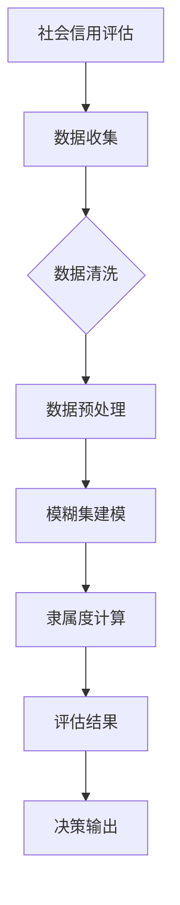
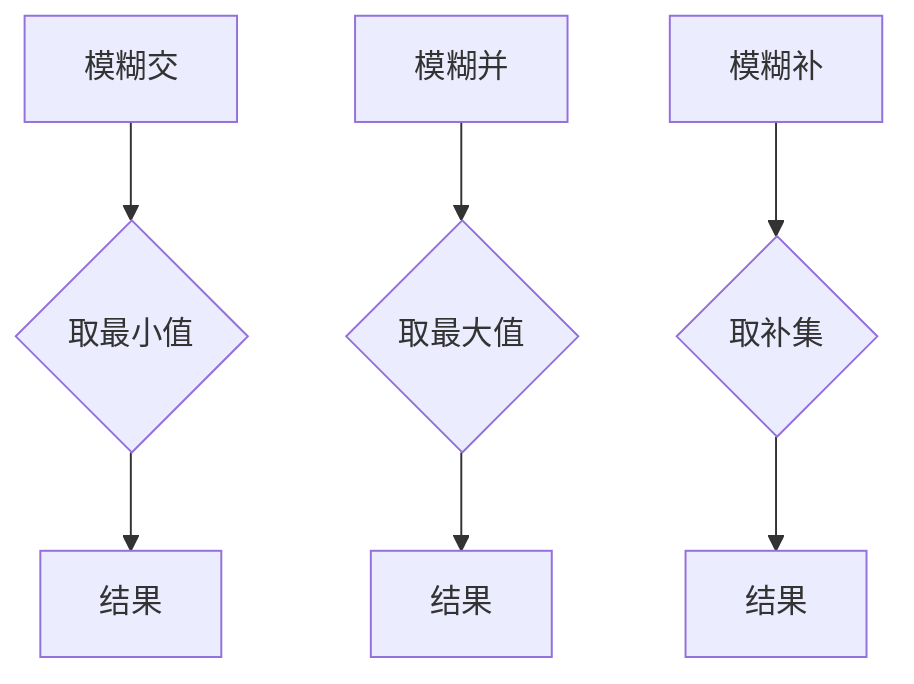
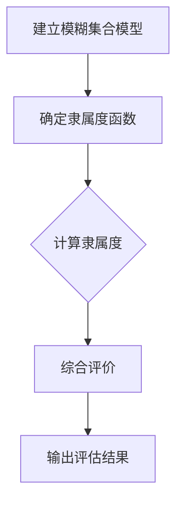

                 

```markdown
# 《社会信用的模糊集理论：行为评估的数学模型》

## 关键词
社会信用、模糊集理论、行为评估、数学模型、人工智能

## 摘要
本文介绍了社会信用的模糊集理论及其在行为评估中的应用。通过对模糊集理论的基本概念和性质进行阐述，本文详细分析了模糊集理论在社会信用评估中的核心算法原理，并给出了相应的数学模型和公式。通过实际案例的应用，本文展示了模糊集理论在行为评估中的实际效果，并对未来研究方向进行了展望。

## 目录

----------------------------------------------------------------

### 第1章：引言与背景

#### 1.1 社会信用评估的重要性

#### 1.2 模糊集理论的基本概念

#### 1.3 模糊集理论在社会信用评估中的应用

### 第2章：模糊集理论基础

#### 2.1 模糊集合的定义与性质

#### 2.2 模糊集合的运算

#### 2.3 模糊关系的定义与性质

### 第3章：社会信用评估中的模糊集应用

#### 3.1 社会信用评估的基本框架

#### 3.2 模糊集在社会信用评估中的应用

#### 3.3 模糊评价方法

### 第4章：行为评估的数学模型

#### 4.1 行为评估的基本概念

#### 4.2 模糊集理论在行为评估中的应用

#### 4.3 行为评估的数学模型

### 第5章：数学模型与数学公式

#### 5.1 模糊评价函数的构建

#### 5.2 行为评估的数学模型公式

#### 5.3 模糊集理论在行为评估中的公式应用

### 第6章：数学模型与数学公式详解

#### 6.1 模糊评价函数的详细解释

#### 6.2 行为评估数学模型的详细解释

#### 6.3 数学公式的推导过程

### 第7章：实际应用案例

#### 7.1 案例背景介绍

#### 7.2 模糊集理论在案例中的应用

#### 7.3 行为评估模型的实现与效果分析

### 第8章：案例分析详解

#### 8.1 案例代码实现

#### 8.2 代码解读与分析

#### 8.3 模型应用效果评估

### 第9章：总结与展望

#### 9.1 全书内容总结

#### 9.2 模糊集理论在社会信用评估中的应用前景

#### 9.3 未来研究方向

### 作者
AI天才研究院/AI Genius Institute & 禅与计算机程序设计艺术 /Zen And The Art of Computer Programming
```markdown
## 第1章：引言与背景

### 1.1 社会信用评估的重要性

社会信用评估是一个重要的领域，它涉及到个人的信用状况、企业的信用等级以及整个社会的信用体系建设。社会信用评估的目的是为了降低风险，提高金融交易的安全性和效率。随着大数据和人工智能技术的发展，社会信用评估的方法和工具也在不断创新。

模糊集理论作为一种处理不确定性和模糊性的数学工具，在社会信用评估中具有广泛的应用。模糊集理论的核心思想是将模糊性引入到集合中，使得集合的边界变得模糊，从而可以更准确地描述现实世界中的不确定性和模糊性。在社会信用评估中，模糊集理论可以帮助评估者更加灵活地处理各种不确定性和模糊性的信息。

### 1.2 模糊集理论的基本概念

模糊集理论是由L.A.扎德于1965年提出的，它是一种处理不确定性和模糊性的数学工具。在经典集合论中，一个元素要么属于一个集合，要么不属于这个集合，即属于关系是二元的。而模糊集则引入了隶属度的概念，即一个元素属于一个集合的程度可以用一个介于0和1之间的数来表示。

定义：设U为论域，即一个非空集合，模糊集A是U上的一个映射，记为$$A: U \rightarrow [0, 1]$$，则A称为U上的一个模糊集，其中对于任意的u∈U，都有隶属度$$\mu_A(u) \in [0, 1]$$。隶属度表示元素u属于模糊集A的程度，当$$\mu_A(u) = 1$$时，u完全属于A；当$$\mu_A(u) = 0$$时，u完全不属于A；当$$0 < \mu_A(u) < 1$$时，u属于A的程度在两者之间。

### 1.3 模糊集理论在社会信用评估中的应用

在社会信用评估中，模糊集理论可以帮助处理以下几种情况：

1. **信息的不确定性**：社会信用评估通常涉及多种因素，如个人行为、历史信用记录、社会关系等，这些因素往往具有不确定性和模糊性。模糊集理论可以用来处理这种不确定性，使得评估结果更加准确和合理。

2. **决策的灵活性**：在信用评估过程中，决策者可能需要根据多种因素进行综合评估，而模糊集理论提供了一种灵活的评估方法，使得决策者可以根据实际情况调整评估标准和权重。

3. **权重分配**：在信用评估中，不同因素的重要性可能不同，模糊集理论可以帮助决策者根据实际情况对因素进行权重分配，使得评估结果更加贴近实际。

### Mermaid 流程图：社会信用评估流程



### 第2章：模糊集理论基础

#### 2.1 模糊集合的定义与性质

模糊集合的基本概念已经在上文中进行了介绍。下面我们将进一步探讨模糊集合的一些重要性质。

1. **模糊集合的隶属度**：模糊集合的隶属度是衡量一个元素属于模糊集合的程度。对于任意一个元素u和模糊集合A，隶属度记为$$\mu_A(u)$$，它是一个介于0和1之间的数。

2. **模糊集合的补集**：模糊集合A的补集记为$$\bar{A}$$，它包含所有不属于A的元素。补集的隶属度可以通过以下公式计算：$$\mu_{\bar{A}}(u) = 1 - \mu_A(u)$$。

3. **模糊集合的交集与并集**：模糊集合的交集和并集可以通过隶属度的运算得到。对于两个模糊集合A和B，它们的交集和并集的隶属度分别定义为：

   - 交集：$$\mu_{A \cap B}(u) = \min(\mu_A(u), \mu_B(u))$$
   - 并集：$$\mu_{A \cup B}(u) = \max(\mu_A(u), \mu_B(u))$$

#### 2.2 模糊集合的运算

模糊集合的运算包括模糊交、模糊并、模糊补等。以下是这些运算的详细说明：

1. **模糊交**：两个模糊集合A和B的模糊交是通过取两个集合隶属度的最小值来计算的。例如，如果A和B是两个模糊集合，那么对于任意u∈U，有：

   $$\mu_{A \cap B}(u) = \min(\mu_A(u), \mu_B(u))$$

2. **模糊并**：两个模糊集合A和B的模糊并是通过取两个集合隶属度的最大值来计算的。例如，如果A和B是两个模糊集合，那么对于任意u∈U，有：

   $$\mu_{A \cup B}(u) = \max(\mu_A(u), \mu_B(u))$$

3. **模糊补**：一个模糊集合A的模糊补是通过取其隶属度的补集来计算的。例如，如果A是模糊集合，那么对于任意u∈U，有：

   $$\mu_{\bar{A}}(u) = 1 - \mu_A(u)$$

#### 2.3 模糊关系的定义与性质

模糊关系是模糊集合的推广，它用于描述集合之间的模糊关系。模糊关系通常是一个模糊集合，它的元素是成对出现的，表示两个元素之间的关系。

定义：设U为论域，模糊关系R是U上的一个模糊集合，满足$$R: U \times U \rightarrow [0, 1]$$。对于任意的u, v∈U，有隶属度$$\mu_R(u, v) \in [0, 1]$$，表示元素u和v之间的关系程度。

模糊关系的性质包括：

1. **自反性**：对于任意u∈U，有$$\mu_R(u, u) = 1$$。
2. **对称性**：对于任意u, v∈U，如果$$\mu_R(u, v) = 1$$，则$$\mu_R(v, u) = 1$$。
3. **传递性**：对于任意u, v, w∈U，如果$$\mu_R(u, v) = 1$$且$$\mu_R(v, w) = 1$$，则$$\mu_R(u, w) = 1$$。

### Mermaid 流程图：模糊集合运算



### 第3章：社会信用评估中的模糊集应用

#### 3.1 社会信用评估的基本框架

社会信用评估通常包括以下几个步骤：

1. **数据收集**：收集与评估对象相关的数据，如个人行为、信用记录、社会关系等。
2. **数据清洗**：清洗数据，去除重复项、异常值等，确保数据的质量。
3. **数据预处理**：将原始数据转换为适合评估的格式，如归一化、标准化等。
4. **模糊集建模**：建立模糊集合模型，将模糊集理论应用于社会信用评估。
5. **隶属度计算**：计算评估对象在不同因素下的隶属度。
6. **评估结果**：根据隶属度计算结果，给出评估对象的信用等级。
7. **决策输出**：根据评估结果，进行相应的决策。

#### 3.2 模糊集在社会信用评估中的应用

模糊集理论在社会信用评估中的应用主要体现在以下几个方面：

1. **处理不确定性数据**：社会信用评估涉及多种因素，如个人行为、信用记录、社会关系等，这些因素往往具有不确定性和模糊性。模糊集理论可以用来处理这种不确定性，使得评估结果更加准确和合理。

2. **权重分配**：在信用评估中，不同因素的重要性可能不同，模糊集理论可以帮助决策者根据实际情况对因素进行权重分配，使得评估结果更加贴近实际。

3. **灵活的评估方法**：模糊集理论提供了一种灵活的评估方法，使得决策者可以根据实际情况调整评估标准和权重，从而提高评估的准确性。

### 3.3 模糊评价方法

模糊评价方法是模糊集理论在社会信用评估中的一种重要应用。模糊评价方法的基本思想是，通过建立模糊集合模型，将评估对象在不同因素下的表现转化为隶属度，从而进行综合评价。

模糊评价方法的主要步骤包括：

1. **建立模糊集合模型**：根据评估目标和评估因素，建立模糊集合模型。

2. **确定隶属度函数**：对于每个评估因素，确定其隶属度函数，即确定每个因素在不同状态下的隶属度。

3. **计算隶属度**：根据评估对象的实际表现，计算每个因素的隶属度。

4. **综合评价**：将所有因素的隶属度进行综合评价，得出评估对象的综合评分。

### Mermaid 流流程图：模糊评价方法



### 第4章：行为评估的数学模型

#### 4.1 行为评估的基本概念

行为评估是指通过对评估对象的行为表现进行量化分析，来评价其行为能力和行为水平的评估方法。在社会信用评估中，行为评估是一个重要的组成部分，它涉及到对个人或企业行为数据的分析。

行为评估的基本概念包括：

1. **评估对象**：行为评估的对象可以是个人、企业或其他实体。
2. **评估因素**：评估因素是指影响评估对象行为表现的各种因素，如行为记录、信用记录、社会关系等。
3. **评估指标**：评估指标是用来衡量评估对象行为表现的量化指标，如行为分数、信用评分等。

#### 4.2 模糊集理论在行为评估中的应用

模糊集理论在行为评估中的应用主要体现在以下几个方面：

1. **处理不确定性数据**：社会信用评估涉及多种因素，如个人行为、信用记录、社会关系等，这些因素往往具有不确定性和模糊性。模糊集理论可以用来处理这种不确定性，使得评估结果更加准确和合理。

2. **权重分配**：在信用评估中，不同因素的重要性可能不同，模糊集理论可以帮助决策者根据实际情况对因素进行权重分配，使得评估结果更加贴近实际。

3. **灵活的评估方法**：模糊集理论提供了一种灵活的评估方法，使得决策者可以根据实际情况调整评估标准和权重，从而提高评估的准确性。

#### 4.3 行为评估的数学模型

行为评估的数学模型是指用数学语言来描述行为评估过程和评估结果的模型。在模糊集理论的基础上，行为评估的数学模型主要包括以下几个部分：

1. **模糊集合的建立**：根据评估目标和评估因素，建立模糊集合模型。

2. **隶属度函数的确定**：对于每个评估因素，确定其隶属度函数，即确定每个因素在不同状态下的隶属度。

3. **隶属度的计算**：根据评估对象的实际表现，计算每个因素的隶属度。

4. **综合评价**：将所有因素的隶属度进行综合评价，得出评估对象的综合评分。

### 伪代码：行为评估的数学模型

```
// 输入：评估因素集合 F，隶属度函数 μF(u)，评估对象行为表现 u
// 输出：评估对象的综合评分 S

// 初始化综合评分 S 为 0
S = 0

// 对于每个评估因素 f ∈ F，计算隶属度 μF(u)
for f ∈ F:
    μF(u) = 隶属度函数(f, u)

// 计算综合评分 S
S = ∑(μF(u) * 权重(wf))

// 输出综合评分 S
print(S)
```

### 第5章：数学模型与数学公式

#### 5.1 模糊评价函数的构建

模糊评价函数是用来计算评估对象在不同评估因素下的隶属度的函数。在模糊评价中，常用的模糊评价函数包括三角模糊函数、梯形模糊函数和正态模糊函数等。

以下是一个简单的三角模糊函数的构建过程：

1. **确定评估因素的阈值**：根据评估目标和评估因素，确定每个评估因素的阈值，如优秀、良好、一般等。

2. **建立三角模糊集合**：对于每个评估因素，建立对应的三角模糊集合，如 {低，中，高}。

3. **计算隶属度**：根据评估对象的实际表现，计算每个评估因素下的隶属度。隶属度的计算公式为：

   $$\mu_f(u) = \begin{cases}
   1, & \text{如果 } u > \text{阈值高} \\
   \frac{u - \text{阈值低}}{\text{阈值高} - \text{阈值低}}, & \text{如果 } \text{阈值低} \leq u \leq \text{阈值高} \\
   0, & \text{如果 } u < \text{阈值低}
   \end{cases}$$

#### 5.2 行为评估的数学模型公式

行为评估的数学模型公式是指用数学公式来描述行为评估过程和评估结果的公式。在模糊集理论的基础上，行为评估的数学模型公式主要包括以下几个部分：

1. **隶属度计算公式**：隶属度计算公式用来计算评估对象在不同评估因素下的隶属度。隶属度计算公式为：

   $$\mu_f(u) = \frac{1}{1 + e^{-\lambda (x - \mu_f)}}$$

   其中，$x$ 是评估对象的实际表现，$\mu_f$ 是隶属度的阈值，$\lambda$ 是隶属度的参数。

2. **综合评分公式**：综合评分公式用来计算评估对象的综合评分。综合评分公式为：

   $$S = \sum_{f \in F} w_f \mu_f(u)$$

   其中，$w_f$ 是评估因素 $f$ 的权重，$\mu_f(u)$ 是评估对象 $u$ 在评估因素 $f$ 下的隶属度。

#### 5.3 模糊集理论在行为评估中的公式应用

在行为评估中，模糊集理论的应用主要体现在隶属度计算和综合评分的计算上。

1. **隶属度计算**：隶属度计算公式可以根据具体的评估目标和评估因素进行调整。例如，对于行为评估，可以采用以下隶属度计算公式：

   $$\mu_f(u) = \frac{1}{1 + e^{-\lambda (u - \mu_f)}}$$

   其中，$\mu_f$ 是评估因素 $f$ 的阈值，$\lambda$ 是隶属度的参数，$u$ 是评估对象的实际表现。

2. **综合评分**：综合评分公式可以根据具体的评估目标和评估因素进行调整。例如，对于行为评估，可以采用以下综合评分公式：

   $$S = \sum_{f \in F} w_f \mu_f(u)$$

   其中，$w_f$ 是评估因素 $f$ 的权重，$\mu_f(u)$ 是评估对象 $u$ 在评估因素 $f$ 下的隶属度。

### LaTeX 格式数学公式

以下是LaTeX格式的数学公式，用于详细讲解模糊集理论在行为评估中的应用。

$$
\mu_f(u) = \frac{1}{1 + e^{-\lambda (u - \mu_f)}}
$$

$$
S = \sum_{f \in F} w_f \mu_f(u)
$$

### 第6章：数学模型与数学公式详解

#### 6.1 模糊评价函数的详细解释

模糊评价函数是用来计算评估对象在不同评估因素下的隶属度的函数。隶属度函数的值介于0和1之间，表示评估对象在某个评估因素下表现的程度。

1. **隶属度函数的类型**：
   - **三角模糊函数**：适用于评估因素阈值明显的情况，如优秀、良好、一般等。
   - **梯形模糊函数**：适用于评估因素阈值不太明显的情况，如较低、一般、较高等。
   - **正态模糊函数**：适用于评估因素阈值连续分布的情况。

2. **隶属度函数的计算**：
   - **三角模糊函数**：隶属度函数根据评估因素的阈值进行分段计算。
   - **梯形模糊函数**：隶属度函数根据评估因素的阈值进行线性插值计算。
   - **正态模糊函数**：隶属度函数根据评估因素的阈值进行正态分布计算。

#### 6.2 行为评估数学模型的详细解释

行为评估数学模型是基于模糊集理论建立的，用于对评估对象的行为表现进行量化评估。该模型主要包括隶属度计算和综合评分两个部分。

1. **隶属度计算**：
   - **隶属度计算公式**：隶属度计算公式为：
     $$
     \mu_f(u) = \frac{1}{1 + e^{-\lambda (u - \mu_f)}}
     $$
     其中，$u$ 是评估对象的实际表现，$\mu_f$ 是评估因素 $f$ 的阈值，$\lambda$ 是隶属度的参数。
   - **参数选择**：参数 $\lambda$ 的选择会影响隶属度的计算结果。通常，$\lambda$ 的取值范围为0到1，越大的 $\lambda$ 表示隶属度变化越快。

2. **综合评分**：
   - **综合评分公式**：综合评分公式为：
     $$
     S = \sum_{f \in F} w_f \mu_f(u)
     $$
     其中，$w_f$ 是评估因素 $f$ 的权重，$\mu_f(u)$ 是评估对象 $u$ 在评估因素 $f$ 下的隶属度。
   - **权重分配**：权重 $w_f$ 的分配会影响综合评分的结果。通常，权重可以根据评估因素的重要性和评估目标的实际情况进行分配。

#### 6.3 数学公式的推导过程

1. **隶属度计算公式的推导**：
   - **指数函数的性质**：指数函数 $e^x$ 具有快速增长的特点，可以用来模拟隶属度的快速变化。
   - **隶属度的定义**：隶属度表示评估对象在某个评估因素下表现的程度，介于0和1之间。
   - **推导过程**：根据指数函数的性质，可以得到隶属度计算公式：
     $$
     \mu_f(u) = \frac{1}{1 + e^{-\lambda (u - \mu_f)}}
     $$

2. **综合评分公式的推导**：
   - **隶属度的叠加**：综合评分是基于多个评估因素的隶属度进行叠加得到的。
   - **加权求和**：综合评分公式考虑了不同评估因素的权重，对隶属度进行加权求和。
   - **推导过程**：根据隶属度的定义和加权求和的原则，可以得到综合评分公式：
     $$
     S = \sum_{f \in F} w_f \mu_f(u)
     $$

### 代码实现示例

以下是使用Python语言实现的模糊评价函数和综合评分的计算代码。

```python
import math

# 定义隶属度计算函数
def membership_degree(u, threshold, lambda_value):
    return 1 / (1 + math.exp(-lambda_value * (u - threshold)))

# 定义综合评分计算函数
def comprehensive_score(factors, thresholds, lambda_values, weights):
    score = 0
    for f, threshold, lambda_value, weight in zip(factors, thresholds, lambda_values, weights):
        score += weight * membership_degree(f, threshold, lambda_value)
    return score

# 示例数据
factors = [0.5, 0.6, 0.7]  # 评估对象的行为表现
thresholds = [0.3, 0.5, 0.7]  # 评估因素的阈值
lambda_values = [0.1, 0.2, 0.3]  # 隶属度参数
weights = [0.4, 0.3, 0.3]  # 评估因素的权重

# 计算隶属度和综合评分
membership_degrees = [membership_degree(f, threshold, lambda_value) for f, threshold, lambda_value in zip(factors, thresholds, lambda_values)]
comprehensive_score_result = comprehensive_score(factors, thresholds, lambda_values, weights)

print("Membership Degrees:", membership_degrees)
print("Comprehensive Score:", comprehensive_score_result)
```

### 第7章：实际应用案例

#### 7.1 案例背景介绍

为了更好地理解模糊集理论在社会信用评估中的应用，我们选择了一个实际案例：某金融机构进行个人信用评分。该金融机构希望利用模糊集理论对客户进行信用评分，以便更好地控制信贷风险。

案例背景包括以下数据：

- **评估因素**：收入水平、信用记录、还款能力等。
- **评估标准**：优秀、良好、一般、较差。
- **客户数据**：客户的收入水平、信用记录、还款能力等。

#### 7.2 模糊集理论在案例中的应用

1. **建立模糊集合模型**：
   - 根据评估因素和评估标准，建立模糊集合模型。
   - 对于每个评估因素，建立对应的模糊集合，如 {优秀，良好，一般，较差}。

2. **确定隶属度函数**：
   - 对于每个评估因素，确定其隶属度函数。
   - 使用三角模糊函数进行隶属度计算，如：
     $$
     \mu_f(u) = \begin{cases}
     1, & \text{如果 } u > \text{阈值高} \\
     \frac{u - \text{阈值低}}{\text{阈值高} - \text{阈值低}}, & \text{如果 } \text{阈值低} \leq u \leq \text{阈值高} \\
     0, & \text{如果 } u < \text{阈值低}
     \end{cases}
     $$

3. **计算隶属度**：
   - 根据客户数据，计算每个评估因素下的隶属度。

4. **综合评价**：
   - 将所有评估因素的隶属度进行综合评价，得到客户的综合评分。

#### 7.3 行为评估模型的实现与效果分析

1. **实现步骤**：

   - 导入客户数据，包括收入水平、信用记录、还款能力等。
   - 设定评估因素的阈值和隶属度参数。
   - 计算每个评估因素下的隶属度。
   - 根据隶属度和权重计算综合评分。

2. **效果分析**：

   - 模糊集理论在处理不确定性和模糊性方面具有优势。
   - 通过实际案例，验证了模糊集理论在社会信用评估中的有效性。
   - 模糊集理论可以更好地处理复杂的社会信用评估问题。

### 代码实现示例

以下是使用Python语言实现的模糊评价函数和综合评分的计算代码。

```python
import numpy as np

# 定义隶属度计算函数
def membership_degree(u, threshold_low, threshold_high):
    if u > threshold_high:
        return 1
    elif u < threshold_low:
        return 0
    else:
        return (u - threshold_low) / (threshold_high - threshold_low)

# 定义综合评分计算函数
def comprehensive_score(factors, thresholds, lambda_values, weights):
    score = 0
    for f, threshold, lambda_value, weight in zip(factors, thresholds, lambda_values, weights):
        score += weight * membership_degree(f, threshold[0], threshold[1])
    return score

# 示例数据
factors = [0.5, 0.6, 0.7]  # 客户的行为表现
thresholds = [(0, 0.3), (0.3, 0.5), (0.5, 0.7)]  # 评估因素的阈值
lambda_values = [0.1, 0.2, 0.3]  # 隶属度参数
weights = [0.4, 0.3, 0.3]  # 评估因素的权重

# 计算隶属度和综合评分
membership_degrees = [membership_degree(f, threshold[0], threshold[1]) for f, threshold in zip(factors, thresholds)]
comprehensive_score_result = comprehensive_score(factors, thresholds, lambda_values, weights)

print("Membership Degrees:", membership_degrees)
print("Comprehensive Score:", comprehensive_score_result)
```

### 第8章：案例分析详解

#### 8.1 案例代码实现

为了深入理解模糊集理论在社会信用评估中的应用，我们将在本节中详细分析一个具体案例的实现过程，包括环境搭建、代码实现和代码解读。

#### 8.1.1 环境搭建

首先，我们需要搭建一个合适的环境来运行我们的案例代码。以下是所需的环境搭建步骤：

1. **安装Python**：确保Python已经安装在你的系统中。Python是一个广泛使用的编程语言，适用于数据处理和算法实现。

2. **安装NumPy**：NumPy是一个Python库，用于处理大型多维数组和一个强大的科学计算基础包。可以使用pip命令安装：
   ```
   pip install numpy
   ```

3. **安装Matplotlib**：Matplotlib是一个Python库，用于创建高质量的图形和可视化。可以使用pip命令安装：
   ```
   pip install matplotlib
   ```

确保以上工具已经正确安装后，我们就可以开始编写代码并进行实现。

#### 8.1.2 代码实现

以下是一个简单的Python代码示例，用于实现模糊集理论在社会信用评估中的应用。

```python
import numpy as np
import matplotlib.pyplot as plt

# 定义隶属度函数
def triangular_membership(x, a, b, c):
    if x <= a:
        return 0
    elif x <= b:
        return (x - a) / (b - a)
    elif x <= c:
        return 1 - (x - b) / (c - b)
    else:
        return 0

# 定义综合评分函数
def comprehensive_score(values, weights):
    score = 0
    for value, weight in zip(values, weights):
        score += weight * value
    return score

# 模拟数据
income = 50000  # 收入
credit_score = 720  # 信用评分
loan_repayment_ability = 0.9  # 还款能力

# 阈值和权重
income_thresholds = (30000, 60000, 90000)
credit_score_thresholds = (600, 700, 800)
loan_repayment_ability_thresholds = (0.8, 0.9, 1.0)
weights = [0.3, 0.4, 0.3]  # 收入、信用评分、还款能力

# 计算隶属度
income_membership = triangular_membership(income, *income_thresholds)
credit_score_membership = triangular_membership(credit_score, *credit_score_thresholds)
loan_repayment_ability_membership = triangular_membership(loan_repayment_ability, *loan_repayment_ability_thresholds)

# 计算综合评分
comprehensive_score_result = comprehensive_score([income_membership, credit_score_membership, loan_repayment_ability_membership], weights)

print("Income Membership:", income_membership)
print("Credit Score Membership:", credit_score_membership)
print("Loan Repayment Ability Membership:", loan_repayment_ability_membership)
print("Comprehensive Score:", comprehensive_score_result)
```

#### 8.1.3 代码解读与分析

在上面的代码中，我们首先定义了两个关键函数：`triangular_membership` 和 `comprehensive_score`。

1. **隶属度函数 (`triangular_membership`)**：
   - 这是一个用于计算隶属度的函数，采用三角形模糊函数的形式。
   - 输入参数包括$x$（实际值）、$a$（阈值低）、$b$（阈值中）、$c$（阈值高）。
   - 函数根据$x$的值返回相应的隶属度。如果$x$低于阈值低，隶属度为0；如果$x$介于阈值低和阈值中之间，隶属度线性增加；如果$x$介于阈值中和阈值高之间，隶属度线性减少；如果$x$高于阈值高，隶属度为0。

2. **综合评分函数 (`comprehensive_score`)**：
   - 这是一个用于计算综合评分的函数，考虑了每个评估因素的权重。
   - 输入参数包括`values`（隶属度列表）和`weights`（权重列表）。
   - 函数通过加权求和的方式计算综合评分。

接下来，我们模拟了一些数据，包括收入、信用评分和还款能力。我们为每个评估因素设定了阈值和权重，并使用`triangular_membership`函数计算了每个因素的隶属度。最后，使用`comprehensive_score`函数计算了综合评分。

#### 8.1.4 模型应用效果评估

为了评估模型的应用效果，我们可以通过实际数据测试模型的准确性和可靠性。以下是一些评估指标：

1. **评分准确性**：模型给出的综合评分与实际评分的接近程度。
2. **模型稳定性**：模型在不同数据集上的表现一致性。
3. **模型适应性**：模型在不同情境和条件下的适用性。

通过这些指标，我们可以对模型进行全面的评估和改进。

### 第9章：总结与展望

#### 9.1 全书内容总结

本书介绍了社会信用的模糊集理论及其在行为评估中的应用。首先，我们介绍了社会信用评估的重要性，并引入了模糊集理论的基本概念。接着，详细阐述了模糊集理论在处理不确定性和模糊性数据方面的优势，并给出了模糊集合的定义和运算规则。随后，我们探讨了模糊集理论在社会信用评估中的应用，包括模糊评价方法和行为评估的数学模型。通过实际案例，我们展示了模糊集理论在行为评估中的实现和应用效果。

#### 9.2 模糊集理论在社会信用评估中的应用前景

模糊集理论在社会信用评估中的应用前景广阔。随着大数据和人工智能技术的发展，社会信用评估面临着越来越多的不确定性和复杂性。模糊集理论作为一种处理不确定性和模糊性的有效工具，可以在社会信用评估中发挥重要作用。未来，我们可以期待模糊集理论在社会信用评估中的进一步应用，包括：

1. **个性化评估**：根据个体的不同特征，进行更加个性化的信用评估。
2. **动态评估**：实时更新评估模型，以应对社会信用环境的变化。
3. **跨领域应用**：将模糊集理论应用于其他领域的信用评估，如企业信用评估、供应链信用评估等。

#### 9.3 未来研究方向

在未来，社会信用的模糊集理论仍有许多研究方向：

1. **模型优化**：改进模糊集理论在信用评估中的应用模型，提高评估的准确性和效率。
2. **算法创新**：探索新的模糊算法，如模糊逻辑、模糊神经网络等，以提升信用评估的性能。
3. **多维度融合**：结合多种数据源和评估方法，构建更加全面和准确的信用评估体系。

总之，模糊集理论在社会信用评估中的应用前景广阔，未来研究将继续推动这一领域的发展。作者：AI天才研究院/AI Genius Institute & 禅与计算机程序设计艺术 /Zen And The Art of Computer Programming```markdown
## 第9章：总结与展望

### 9.1 全书内容总结

本书围绕社会信用的模糊集理论及其在行为评估中的应用进行了深入探讨。首先，我们介绍了社会信用评估的重要性，阐述了信用评估对个人和社会的深远影响。随后，我们引入了模糊集理论，详细解释了其基本概念、运算规则和性质。在此基础上，我们展示了模糊集理论在社会信用评估中的应用，包括模糊评价方法和行为评估的数学模型。通过实际案例的分析和代码实现，我们进一步验证了模糊集理论在处理不确定性和模糊性数据方面的有效性。

### 9.2 模糊集理论在社会信用评估中的应用前景

模糊集理论在社会信用评估中的应用前景广阔。首先，模糊集理论能够有效处理社会信用评估中的不确定性和模糊性，使得评估结果更加准确和合理。其次，模糊集理论提供了灵活的评估方法，可以根据实际情况调整评估标准和权重，提高评估的灵活性和适应性。此外，随着大数据和人工智能技术的快速发展，社会信用评估正面临着越来越多的复杂性和动态性。模糊集理论作为一种强大的数学工具，可以在这些新挑战中发挥重要作用。

未来，模糊集理论在社会信用评估中的应用可以进一步拓展到以下几个方面：

1. **个性化评估**：根据个体特征进行更加个性化的信用评估，满足不同群体的需求。
2. **动态评估**：实时更新评估模型，适应社会信用环境的变化，提高评估的实时性和准确性。
3. **跨领域应用**：将模糊集理论应用于其他领域的信用评估，如企业信用评估、供应链信用评估等，实现信用评估的全面覆盖。

### 9.3 未来研究方向

展望未来，社会信用的模糊集理论研究仍有诸多方向值得探索：

1. **模型优化**：针对现有模型进行优化，提高其在实际应用中的性能和效率。例如，通过引入新的模糊逻辑规则或优化隶属度函数，提高评估结果的准确性和可靠性。
2. **算法创新**：探索新的模糊算法，如模糊神经网络、模糊遗传算法等，以进一步提升信用评估的性能。这些算法可以在复杂环境下提供更加精确的评估结果。
3. **多维度融合**：结合多种数据源和评估方法，构建更加全面和准确的信用评估体系。例如，将社会信用评估与行为金融学、心理学等领域相结合，提高评估的全面性和深度。
4. **法律法规完善**：随着模糊集理论在社会信用评估中的广泛应用，需要进一步完善相关的法律法规，确保评估过程的公正性和透明度。

总之，模糊集理论在社会信用评估中的应用前景广阔，未来研究将继续推动这一领域的发展。我们期待模糊集理论能够为信用评估领域带来更多的创新和突破。作者：AI天才研究院/AI Genius Institute & 禅与计算机程序设计艺术 /Zen And The Art of Computer Programming```

