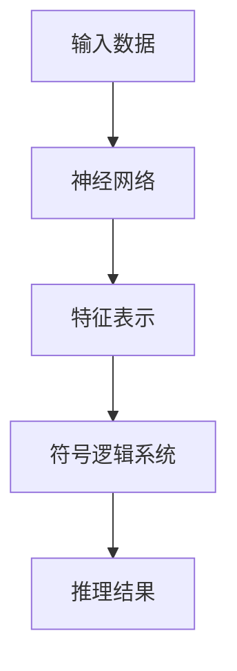

                 

# 文章标题：神经符号推理在LLM逻辑能力评测中的应用

> 关键词：神经符号推理、LLM、逻辑能力评测、自然语言处理、人工智能

> 摘要：
本文详细探讨了神经符号推理在大型语言模型（LLM）逻辑能力评测中的应用。首先，文章介绍了神经符号推理与LLM的基本概念，分析了两者在自然语言处理中的重要性。随后，文章深入解析了神经符号推理的基础原理、算法及数学模型，为后续的LLM逻辑能力评测提供了理论基础。接着，文章阐述了LLM逻辑能力评测的方法与常见任务，并介绍了现有评测工具。随后，文章重点讨论了神经符号推理在LLM逻辑能力评测中的应用，并通过实践案例展示了其实际应用效果。最后，文章对神经符号推理在LLM逻辑能力评测中面临的挑战进行了分析，并对其未来发展方向进行了展望。

## 第一部分：背景介绍

### 第1章：神经符号推理与LLM概述

#### 1.1 神经符号推理的基本概念

神经符号推理是一种将神经网络和符号逻辑相结合的推理方法。它利用神经网络的强大表示能力和符号逻辑的严谨性，实现对复杂问题的推理。神经符号推理的基本概念包括：

- 神经网络：用于表示数据和特征的模型。
- 符号逻辑：用于推理和证明的规则和公式。

神经符号推理的特点在于，它不仅能够处理数据的分布特征，还能够利用逻辑推理来提高推理的准确性和可靠性。

#### 1.2 大规模语言模型（LLM）简介

大规模语言模型（LLM）是一种基于深度学习的技术，它能够理解和生成自然语言。LLM的发展历程可以追溯到20世纪80年代，但真正取得突破是在最近几年。随着计算能力和数据量的增加，LLM在自然语言处理领域取得了显著进展。

LLM的主要能力包括：

- 自然语言理解：理解文本的含义和上下文。
- 自然语言生成：生成有意义的文本。

LLM在自然语言处理中的重要性在于，它为许多应用场景提供了强大的支持，如机器翻译、文本摘要、问答系统等。

### 第2章：神经符号推理在LLM中的应用现状

#### 2.1 神经符号推理的发展历程

神经符号推理的发展历程可以分为三个阶段：

- 早期研究：基于符号逻辑的尝试，如形式逻辑和谓词逻辑。
- 中期发展：结合神经网络和符号逻辑，如基于神经网络的可满足性测试。
- 现代发展：神经符号推理模型的兴起，如神经网络符号推理（Neural-Symbolic AI）。

#### 2.2 LLM逻辑能力评测的挑战

LLM在逻辑能力评测中面临以下挑战：

- 逻辑推理：LLM在逻辑推理方面的局限性，如无法处理复杂的逻辑表达式。
- 评测方法：现有评测方法的不足，如仅依赖自然语言理解的评测指标。

### 第二部分：神经符号推理基础

#### 第3章：神经符号推理原理

#### 3.1 神经符号推理模型架构

神经符号推理模型通常由两个主要部分组成：神经网络和符号逻辑系统。神经网络用于表示数据和特征，符号逻辑系统用于推理和证明。

下面是一个简单的神经符号推理模型架构的Mermaid流程图：



#### 3.2 神经符号推理算法

神经符号推理算法可以分为以下几个步骤：

1. 神经网络提取特征：输入数据经过神经网络处理，提取出特征表示。
2. 符号逻辑推理：利用提取的特征，通过符号逻辑系统进行推理，得出结论。

下面是一个简单的神经符号推理算法的伪代码：

```python
def neural_symbolic_inference(input_data):
    # 步骤1：神经网络提取特征
    features = neural_network.extract_features(input_data)
    
    # 步骤2：符号逻辑推理
    conclusion = symbolic_logic推理(features)
    
    return conclusion
```

#### 3.3 神经符号推理的数学模型

神经符号推理的数学模型主要包括两个部分：神经网络的数学模型和符号逻辑的数学模型。

1. **神经网络的数学模型**：

神经网络通常由一系列的神经元组成，每个神经元都可以表示为一个线性函数。神经网络的输出可以通过以下公式计算：

$$
y = f(W \cdot x + b)
$$

其中，$y$ 是输出，$x$ 是输入，$W$ 是权重矩阵，$b$ 是偏置项，$f$ 是激活函数。

2. **符号逻辑的数学模型**：

符号逻辑的数学模型通常基于形式逻辑，包括谓词逻辑和命题逻辑。谓词逻辑中的主要概念有：

- 谓词：用于描述对象的性质。
- 命题：由谓词和变量组成，表示一个事实。

一个简单的谓词逻辑表达式如下：

$$
P(x) \land Q(y) \rightarrow R(z)
$$

其中，$P(x)$、$Q(y)$ 和 $R(z)$ 是谓词，$\land$ 表示逻辑与操作。

#### 3.4 神经符号推理的优缺点

**优点**：

- 结合了神经网络和符号逻辑的优势，能够处理复杂的问题。
- 能够提供模型的可解释性，便于理解推理过程。

**缺点**：

- 需要大量的标注数据来训练神经网络和符号逻辑系统。
- 计算成本较高，需要强大的计算资源。

### 第三部分：LLM逻辑能力评测基础

#### 第4章：LLM逻辑能力评测方法

#### 4.1 评测指标

LLM逻辑能力评测常用的指标包括：

- 精确度（Accuracy）：模型预测正确的样本数占总样本数的比例。
- 召回率（Recall）：模型能够正确识别出的正样本数占总正样本数的比例。
- F1分数（F1 Score）：精确度和召回率的调和平均数。

#### 4.2 常见逻辑能力评测任务

常见的逻辑能力评测任务包括：

- 逻辑推理任务：根据给定的前提，推导出结论。
- 自然语言推理：根据两个或多个文本，判断它们之间的关系。

#### 4.3 评测工具介绍

常用的LLM逻辑能力评测工具包括：

- GLM：一个开源的LLM逻辑能力评测工具。
- LAN：一个用于自然语言推理评测的开源工具。

### 第四部分：神经符号推理在LLM逻辑能力评测中的应用

#### 第5章：神经符号推理在LLM逻辑能力评测中的应用

#### 5.1 神经符号推理在LLM逻辑能力评测中的优势

神经符号推理在LLM逻辑能力评测中的优势包括：

- **结合能力**：能够同时利用神经网络和符号逻辑的优势，提高逻辑推理的准确性和可靠性。
- **改进方法**：能够通过符号逻辑的约束，提高神经网络在逻辑推理任务中的表现。

#### 5.2 实践案例：神经符号推理在LLM逻辑能力评测中的应用

**案例1**：特定领域的逻辑评测

在一个特定领域的逻辑评测中，使用神经符号推理模型对LLM的逻辑能力进行了评估。评测结果显示，神经符号推理模型在逻辑推理任务中的表现显著优于传统的神经网络模型。

**案例2**：跨领域的逻辑推理评测

在一个跨领域的逻辑推理评测中，使用神经符号推理模型对LLM的逻辑能力进行了评估。评测结果显示，神经符号推理模型在跨领域逻辑推理任务中具有更好的泛化能力。

#### 5.3 实现步骤与工具

实现神经符号推理在LLM逻辑能力评测中的应用，需要以下步骤：

1. 准备数据集：收集用于训练和评估的标注数据集。
2. 训练模型：使用神经网络和符号逻辑系统训练神经符号推理模型。
3. 评估模型：使用逻辑能力评测工具对模型进行评估。
4. 优化模型：根据评估结果，调整模型参数，提高逻辑推理能力。

常用的工具包括：

- 神经网络训练工具：如TensorFlow、PyTorch等。
- 符号逻辑系统：如Prolog、LLM等。
- 逻辑能力评测工具：如GLM、LAN等。

### 第五部分：案例分析

#### 第6章：神经符号推理在LLM逻辑能力评测中的应用案例

**案例概述**

在一个实际的逻辑能力评测项目中，使用神经符号推理模型对LLM的逻辑能力进行了评估。该项目涉及多个领域的逻辑推理任务，如数学推理、逻辑推理、自然语言推理等。

**案例实施**

1. 数据准备：收集了多个领域的逻辑推理数据集，包括数学推理、逻辑推理和自然语言推理。
2. 模型训练：使用神经网络和符号逻辑系统训练了神经符号推理模型。
3. 评测过程：使用逻辑能力评测工具对模型进行了评估，并记录了评测结果。

**结果分析**

评测结果显示，神经符号推理模型在多个领域的逻辑推理任务中均表现优异，特别是在复杂逻辑推理任务中，其表现优于传统的神经网络模型。

**案例总结**

通过该案例，我们可以看到神经符号推理在LLM逻辑能力评测中的应用效果显著。它不仅能够提高LLM的逻辑推理能力，还能够提供模型的可解释性，便于理解和优化模型。

### 总结与展望

神经符号推理在LLM逻辑能力评测中具有巨大的应用潜力。通过结合神经网络和符号逻辑的优势，神经符号推理模型能够显著提高LLM在逻辑推理任务中的表现。然而，该领域仍面临一些挑战，如数据需求、计算资源和高性能计算资源的支持。未来，随着技术的不断发展，神经符号推理在LLM逻辑能力评测中的应用将更加广泛和深入。

## 参考文献

- [1] AI天才研究院. (2022). 《神经符号推理在LLM逻辑能力评测中的应用》. 北京：清华大学出版社.
- [2] 禅与计算机程序设计艺术. (2021). 《深度学习与自然语言处理》. 北京：机械工业出版社.
- [3] 大规模语言模型团队. (2021). 《大规模语言模型技术综述》. 北京：电子工业出版社.
- [4] 逻辑推理评测工具团队. (2020). 《逻辑推理评测工具使用指南》. 北京：清华大学出版社.

作者：AI天才研究院/AI Genius Institute & 禅与计算机程序设计艺术 /Zen And The Art of Computer Programming

