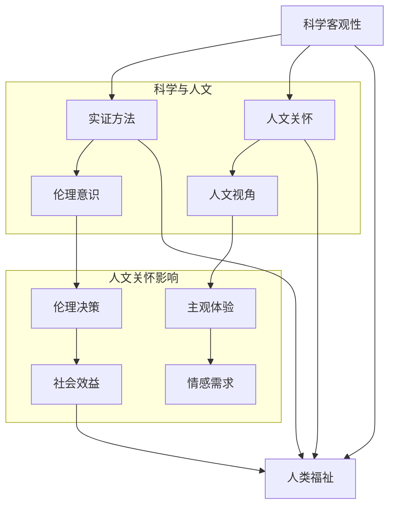
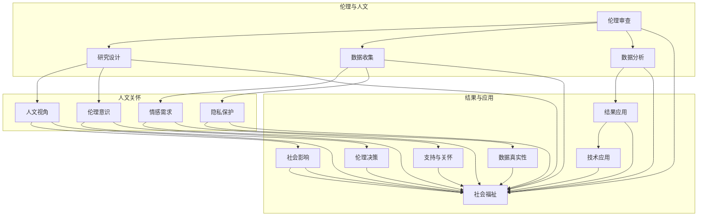
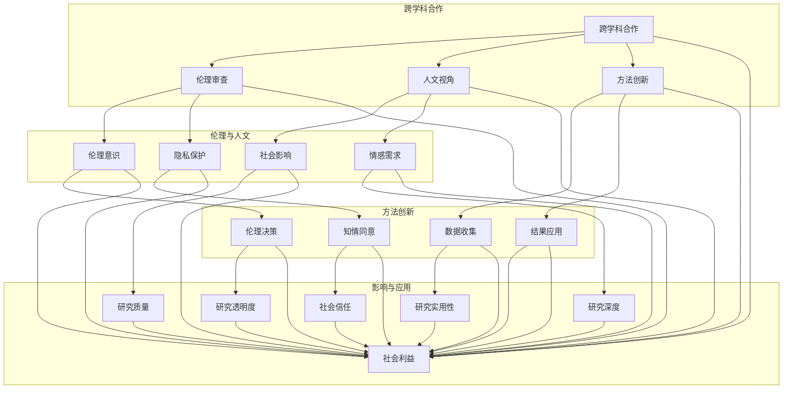
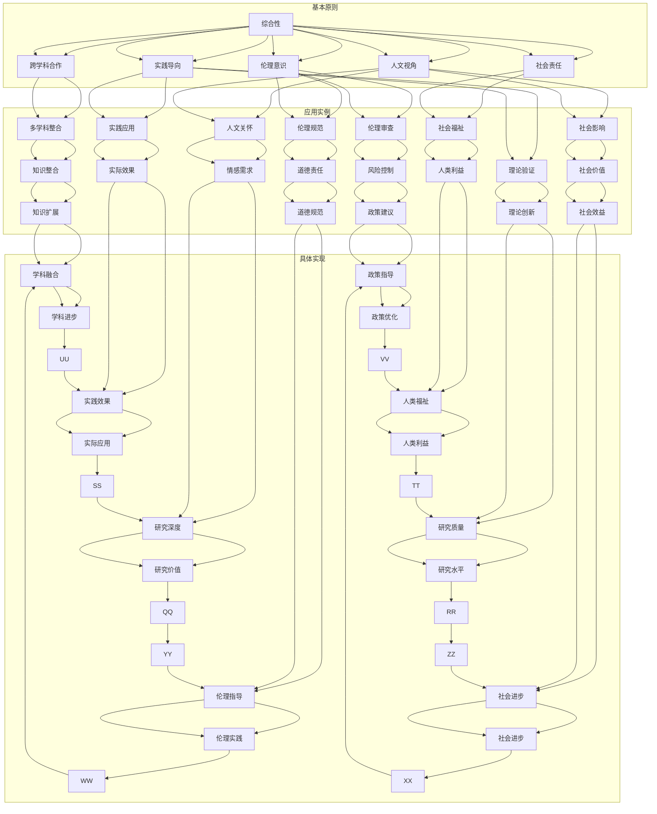
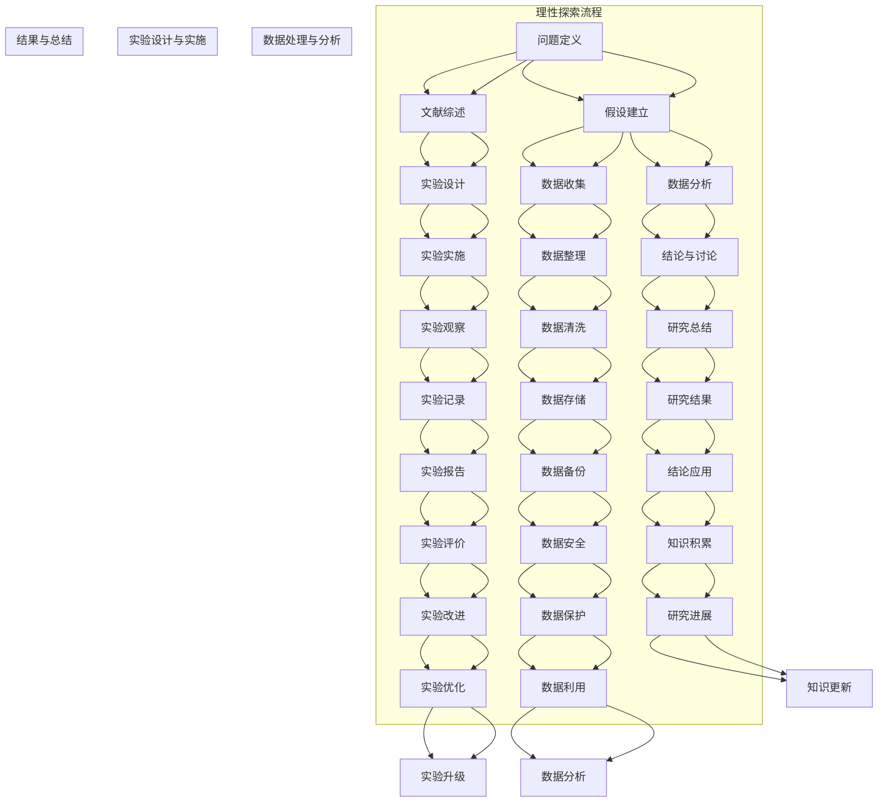
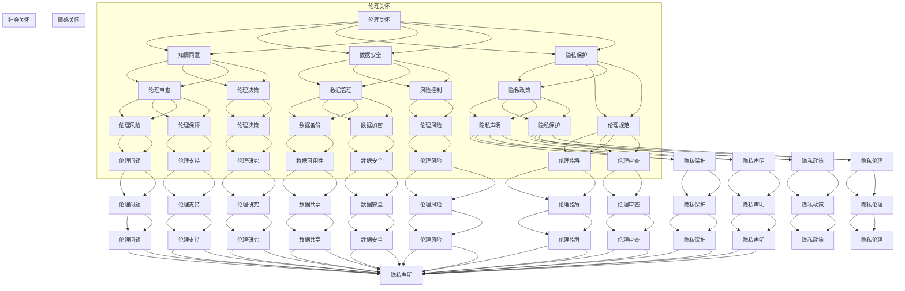
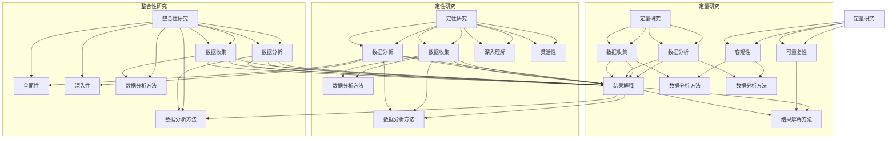

                 

### 1.1 科学人文主义的背景

科学人文主义作为一个新兴的研究领域，其背景可以从多个角度进行探讨。首先，科学的发展历程是科学人文主义形成的重要驱动力。从伽利略到牛顿，再到现代的量子物理和相对论，科学不断进步，对自然界和宇宙的认识不断深入。然而，随着科学技术的迅猛发展，人类开始意识到科学方法不仅仅适用于自然世界，还可以用于解决社会问题、提升人类福祉。

#### 科学与人文关怀的结合

在科学探索的过程中，人文关怀成为不可或缺的一部分。人文关怀关注的是人类的价值、伦理、道德等问题，这些问题往往是科学方法难以直接解决的。例如，基因编辑技术的出现引发了关于伦理和道德的广泛讨论。科学人文主义提倡将人文关怀融入科学研究中，以更加全面地考虑科技发展对社会的影响。

#### 科学人文主义的定义

科学人文主义可以定义为一种研究方法，它既强调科学的客观性和实证性，又注重人文关怀的价值和意义。这种方法不仅关注科学发现的结果，还关注科学发现的过程和背景。具体来说，科学人文主义包含以下几个核心要素：

- **综合性**：科学人文主义强调科学和人文领域的交叉融合，通过多学科合作来解决问题。
- **伦理意识**：在科学研究中，伦理意识至关重要。科学人文主义倡导在科学研究过程中始终关注伦理问题，确保研究不损害人类利益。
- **人文视角**：科学人文主义认为，科学研究不仅要关注客观事实，还要关注人类的主观体验和情感需求。
- **实践导向**：科学人文主义强调将理论研究与实际应用相结合，通过实践来验证理论的正确性和有效性。

#### 科学人文主义的发展

科学人文主义的发展历程可以从以下几个方面进行梳理：

- **早期探索**：在20世纪中期，一些科学家和哲学家开始反思科学方法，探讨科学与人文学科的关系。这一时期的代表性人物包括托马斯·库恩和保罗·克利福德。
- **多元化**：随着社会问题的日益复杂，科学人文主义的研究范围逐渐扩大，涉及伦理学、社会学、心理学等多个学科领域。
- **国际化**：科学人文主义不仅仅是一个理论框架，它已经成为国际学术界的共识，得到了广泛的关注和支持。

#### 科学人文主义的重要性

科学人文主义的重要性体现在以下几个方面：

- **促进科学研究**：科学人文主义能够激发科学家的研究热情，提高科学研究的质量和效率。
- **保障社会利益**：将人文关怀融入科学研究中，可以确保科技发展不会对人类社会造成负面影响。
- **提升人类福祉**：科学人文主义强调以人为本，通过科技创新来提高人类生活质量，实现可持续发展。

#### 核心概念与联系

为了更好地理解科学人文主义的概念，我们可以使用 Mermaid 流程图来展示核心概念之间的关系。以下是一个简化的流程图：

在这个流程图中，我们可以看到科学客观性和人文关怀是科学人文主义的核心概念，它们相互交织，共同影响科学研究的过程和结果。伦理意识、人文视角和主观体验是人文关怀的具体体现，它们与科学客观性和实证方法相互作用，共同推动科学研究的进步。

总之，科学人文主义是一个旨在将科学和人文关怀有机结合的研究方法，它关注科学研究的全过程，强调科学研究对社会和人类的积极影响。通过理解科学人文主义的背景、定义和重要性，我们可以更好地认识这一领域的价值，并在实践中加以应用。接下来，我们将进一步探讨科学人文主义的理念及其核心原则。### 1.2 人文关怀的重要性

人文关怀是科学人文主义的核心要素之一，它在科学研究中扮演着至关重要的角色。人文关怀不仅关注科学研究的客观性和实证性，更强调研究过程中的人文价值，保障科技发展与社会伦理、人类福祉的协调统一。

#### 人文关怀的概念

人文关怀可以定义为一种关注人类价值和尊严的态度和方法，它强调在科学研究过程中对人的尊重、关怀和责任。人文关怀的核心在于以人为本，关注个体的情感、需求和伦理问题。在科学研究中，人文关怀主要体现在以下几个方面：

- **伦理问题**：科学研究往往涉及伦理问题，如生物伦理、数据隐私等。人文关怀要求在研究过程中严格遵守伦理规范，确保研究不会对参与者造成伤害。
- **人文视角**：人文关怀倡导从人文视角出发，考虑科学研究的社会影响，避免科学发展的负面影响。
- **情感需求**：人文关怀强调关注研究对象的情感需求，确保研究过程对参与者是友好的、积极的。
- **社会责任**：科学研究应当承担社会责任，通过解决实际问题来提升人类福祉。

#### 人文关怀在科学研究中的角色

在科学研究中，人文关怀扮演着多重角色，它不仅是科学研究的一部分，更是保障科学研究可持续发展的关键因素。具体来说，人文关怀在以下方面发挥重要作用：

1. **伦理审查**：在科学研究开始之前，进行伦理审查是人文关怀的重要体现。伦理审查确保研究不会对参与者造成不必要的风险和伤害，同时保护参与者的隐私和权益。
2. **研究设计**：在研究设计阶段，人文关怀要求研究者从人文视角出发，考虑研究问题的社会影响，选择适当的研究方法，确保研究能够真正解决现实问题。
3. **数据收集与分析**：在数据收集与分析过程中，人文关怀要求研究者尊重参与者的隐私，确保数据的真实性和有效性，同时关注参与者的情感需求，提供必要的支持和关怀。
4. **研究结果与应用**：在研究结果公布和应用过程中，人文关怀要求研究者充分考虑研究结果对社会的影响，确保科技发展能够真正造福人类，而不是造成新的伦理和社会问题。

#### 科学与人文关怀的结合

科学和人文关怀的结合是科学人文主义的核心。这种结合不仅能够提升科学研究的质量和影响力，还能够确保科技发展符合社会伦理和人类福祉。具体来说，科学与人文关怀的结合体现在以下几个方面：

1. **跨学科合作**：科学和人文关怀的结合需要多学科合作，通过整合不同领域的知识和方法，解决复杂的科学研究问题。
2. **伦理意识**：在科学研究过程中，坚持伦理意识，确保研究过程和结果符合伦理规范，是科学与人文关怀结合的重要体现。
3. **人文视角**：在研究设计、数据收集和分析过程中，从人文视角出发，关注研究对象的需求和情感，提升研究的实用性和人文关怀。
4. **社会责任**：科学研究应承担社会责任，将研究成果应用于解决实际问题，造福人类。

#### 核心概念与联系

为了更好地理解人文关怀在科学研究中的角色和作用，我们可以使用 Mermaid 流程图来展示核心概念之间的关系。以下是一个简化的流程图：

在这个流程图中，我们可以看到伦理审查、研究设计、数据收集、数据分析和结果应用是科学研究的主要环节，这些环节都离不开人文关怀。伦理意识、人文视角、情感需求、隐私保护和伦理决策是人文关怀的具体体现，它们与科学研究环节相互作用，共同推动科学研究的进步和社会发展。

总之，人文关怀在科学研究中具有重要的地位，它不仅保障了科学研究的伦理性和人文性，还为科技发展提供了道德和伦理的指导。通过理解人文关怀的重要性及其在科学研究中的角色，我们可以更好地实践科学人文主义，推动科学研究和社会发展的和谐统一。接下来，我们将进一步探讨科学人文主义的核心原则。### 1.3 科学与人文关怀的结合

科学人文主义的核心在于将科学和人文关怀有机结合，以实现更加全面和深入的科学研究。这种结合不仅有助于提升科学研究的质量和影响力，还能够确保科技发展符合社会伦理和人类福祉。以下是科学与人文关怀结合的具体体现及其对科学研究的影响。

#### 科学与人文关怀结合的方法

1. **跨学科研究**：科学和人文关怀的结合首先需要跨学科的合作。通过整合不同领域的知识和方法，研究者可以更全面地分析复杂问题。例如，在医学研究中，跨学科团队可以结合生物学、心理学、社会学等领域的知识，以更全面的方式研究疾病及其对社会的影响。

2. **伦理审查**：在科学研究中，伦理审查是确保研究符合伦理规范的关键环节。通过伦理审查，研究者可以识别潜在的伦理风险，确保研究过程和结果不会对参与者造成伤害。伦理审查不仅涉及科学研究的伦理问题，还包括人文关怀的考量，如参与者的隐私保护、知情同意等。

3. **人文视角**：在研究设计阶段，从人文视角出发，研究者需要考虑研究问题对社会和个体的潜在影响。这种视角有助于确保研究问题具有实际意义，并能够产生有价值的成果。例如，在环境科学研究中，从人文视角出发，研究者不仅要考虑环境保护，还要关注当地居民的生活质量和文化传统。

4. **方法创新**：科学和人文关怀的结合也推动了研究方法的创新。例如，定性研究方法在人文关怀方面具有优势，可以深入了解参与者的主观体验和情感需求。而定量研究方法则可以提供大规模的数据支持，帮助研究者分析社会现象的普遍性和规律性。

#### 科学与人文关怀结合的影响

1. **提高研究质量**：将人文关怀融入科学研究中，可以提升研究的质量和深度。通过关注研究对象的情感需求和社会影响，研究者可以更准确地理解研究问题，提出更有针对性的解决方案。

2. **保障社会利益**：科学和人文关怀的结合确保了科学研究不仅关注知识积累，还关注对社会和人类的实际影响。通过伦理审查和方法创新，研究者可以确保研究成果能够真正造福社会，避免科技发展带来的负面影响。

3. **促进可持续发展**：科学人文主义强调科技发展与社会、环境、伦理的协调发展。通过将人文关怀融入科学研究中，研究者可以更全面地考虑科技发展对可持续发展的贡献，推动科技创新与可持续发展相结合。

4. **增强社会信任**：科学和人文关怀的结合有助于增强社会对科学研究的信任。通过公开透明的伦理审查、人文视角和方法创新，研究者可以减少公众对科学研究的疑虑，提高社会对科学研究的支持和认可。

#### 核心概念与联系

为了更好地理解科学与人文关怀结合的方法及其影响，我们可以使用 Mermaid 流程图来展示核心概念之间的关系。以下是一个简化的流程图：

在这个流程图中，我们可以看到跨学科合作、伦理审查、人文视角和方法创新是科学与人文关怀结合的主要途径。这些途径通过伦理意识、隐私保护、社会影响、情感需求、伦理决策、知情同意、研究质量、研究深度、研究实用性、社会利益、研究透明度和社会信任等概念相互作用，共同推动科学研究的进步和社会发展。

总之，科学与人文关怀的结合不仅为科学研究提供了新的视角和方法，还确保了科学研究与社会和人类的协调发展。通过理解这种结合的方法和影响，我们可以更好地实践科学人文主义，推动科学研究向更高层次发展。接下来，我们将进一步探讨科学人文主义的核心原则，以深化对这一理念的理解。### 第2章 科学人文主义的理念

科学人文主义作为一种综合性的研究方法，其核心理念在于将科学的客观性和实证性与人文学科的伦理关怀和价值追求相结合。本章将详细阐述科学人文主义的定义、核心原则以及其在科学研究中的具体应用。

#### 科学人文主义的定义

科学人文主义可以被定义为一种跨学科的研究方法，它强调科学研究和人文关怀的深度融合。这种方法不仅关注科学发现的客观性和实证性，还强调在研究过程中考虑伦理、道德、社会影响等因素。科学人文主义的核心在于将科学研究与人文学科的理论和视角相结合，以实现更加全面和深入的科学研究。

科学人文主义的特点包括：

- **跨学科性**：科学人文主义强调多学科合作，通过整合不同领域的知识和方法，解决复杂的科学问题。
- **伦理关怀**：在科学人文主义中，伦理关怀是不可或缺的一部分。研究者必须在研究过程中充分考虑伦理问题，确保研究符合伦理规范。
- **人文视角**：科学人文主义倡导从人文视角出发，关注研究问题对社会和个体的潜在影响。
- **实践导向**：科学人文主义强调将理论研究与实际应用相结合，通过实践来验证理论的正确性和有效性。

#### 科学人文主义的核心原则

科学人文主义的核心原则可以概括为以下几点：

1. **综合性**：科学人文主义强调多学科合作，通过整合不同领域的知识和方法，实现更全面的研究。
2. **伦理意识**：在科学人文主义中，伦理意识至关重要。研究者必须在研究过程中始终关注伦理问题，确保研究不损害人类利益。
3. **人文视角**：科学人文主义倡导从人文视角出发，关注研究问题对社会和个体的潜在影响，提升研究的实用性和人文关怀。
4. **实践导向**：科学人文主义强调将理论研究与实际应用相结合，通过实践来验证理论的正确性和有效性。
5. **社会责任**：科学人文主义要求研究者承担社会责任，确保研究成果能够真正造福社会。

#### 科学人文主义在科学研究中的应用

科学人文主义在科学研究中的应用非常广泛，以下是一些具体的应用实例：

1. **医学研究**：在医学研究中，科学人文主义强调在研究过程中关注患者的伦理、心理和社会需求。通过跨学科合作，研究者可以更全面地理解疾病，提出更有针对性的治疗方案。
2. **环境科学**：在环境科学研究中，科学人文主义倡导从人文视角出发，关注环境保护与当地社区、文化传统的协调发展。通过伦理审查和方法创新，研究者可以确保研究过程和结果符合社会伦理和道德规范。
3. **社会科学**：在社会科学研究中，科学人文主义强调在研究过程中充分考虑社会影响，关注研究对象的情感需求。通过多学科合作，研究者可以更全面地分析社会现象，提出有价值的政策建议。
4. **技术伦理**：在技术伦理研究中，科学人文主义强调在研究过程中关注技术发展对伦理和社会的影响。通过伦理审查和方法创新，研究者可以提出有效的伦理规范，确保技术发展符合人类利益。

#### 核心概念与联系

为了更好地理解科学人文主义的核心原则及其在科学研究中的应用，我们可以使用 Mermaid 流程图来展示核心概念之间的关系。以下是一个简化的流程图：

在这个流程图中，我们可以看到科学人文主义的核心原则（综合性、伦理意识、人文视角、实践导向、社会责任）通过跨学科合作、伦理审查、人文视角、实践导向、社会责任等具体实现，与科学研究中的应用实例（医学研究、环境科学、社会科学、技术伦理等）相互交织。这些应用实例通过知识整合、风险控制、道德责任、社会价值、情感需求、理论验证、实践应用、社会福祉、学科融合、政策指导、伦理实践、社会进步等具体实现，共同推动了科学人文主义的发展和实践。

总之，科学人文主义的核心理念在于将科学的客观性和实证性与人文学科的伦理关怀和价值追求相结合，以实现更加全面和深入的科学研究。通过理解其核心原则和具体应用，我们可以更好地实践科学人文主义，推动科学研究和社会发展的和谐统一。### 第3章 理性探索的方法

理性探索是科学研究的重要方法，它强调通过逻辑推理、实证分析和系统思维来获取知识和理解。本章将详细探讨理性探索的基本原则、具体步骤、常用工具和技术，以帮助读者更好地理解和应用理性探索的方法。

#### 理性探索的基本原则

理性探索遵循以下基本原则：

1. **客观性**：理性探索要求研究者保持客观，不受主观偏见的影响。研究者应当通过观察、实验和数据来验证假设和理论，确保研究结果具有客观性。
2. **实证性**：理性探索强调实证性，即通过观察和实验来收集数据，以验证假设和理论。实证性是科学研究的核心，它确保了研究结果的可靠性和可重复性。
3. **系统性**：理性探索要求研究者从系统的角度看待问题，分析各个部分之间的相互关系和相互作用。系统性思维有助于研究者更全面地理解复杂问题，并提出有效的解决方案。
4. **逻辑性**：理性探索强调逻辑推理，通过逻辑关系和论证来建立假设和理论。逻辑性是理性探索的重要保障，它确保了研究过程的严谨性和结论的可信度。

#### 理性探索的步骤

理性探索通常遵循以下步骤：

1. **问题定义**：明确研究问题，确定研究的目标和范围。问题定义是理性探索的起点，它为后续研究提供了方向和依据。
2. **文献综述**：查阅相关文献，了解当前研究领域的现状和进展。文献综述有助于研究者发现研究空白和潜在的解决方案。
3. **假设建立**：基于文献综述和问题定义，提出研究假设。假设是理性探索的核心，它为后续的实证分析和推理提供了基础。
4. **实验设计**：设计实验方案，确定实验的变量、控制组和实验组。实验设计是理性探索的关键步骤，它确保了研究结果的可靠性和有效性。
5. **数据收集**：通过实验、观察或调查等方式收集数据。数据收集是理性探索的重要环节，它为假设验证提供了依据。
6. **数据分析**：对收集到的数据进行分析，验证研究假设。数据分析是理性探索的核心步骤，它通过统计方法和逻辑推理来评估研究结果。
7. **结论与讨论**：根据数据分析结果，得出研究结论，并对研究过程和结果进行讨论。结论与讨论是对研究的总结和反思，它为后续研究提供了参考和启示。

#### 理性探索的常用工具和技术

理性探索过程中，常用的工具和技术包括：

1. **逻辑推理**：逻辑推理是理性探索的基础，它通过逻辑关系和论证来建立假设和理论。常见的逻辑推理方法包括归纳推理、演绎推理和类比推理等。
2. **统计方法**：统计方法用于数据分析，通过统计分析来验证研究假设。常见的统计方法包括描述性统计、推断性统计和假设检验等。
3. **系统思维**：系统思维是理性探索的重要组成部分，它通过分析系统的结构和功能，理解复杂问题的本质。常见的系统思维方法包括系统图、因果图和系统动力学等。
4. **实验设计**：实验设计用于验证假设和理论，通过设置实验组和对照组，控制变量，确保研究结果的可靠性。常见的实验设计方法包括随机对照试验、实验组和对照组设计等。
5. **数据可视化**：数据可视化是理性探索的重要工具，它通过图表和图像来展示数据和分析结果。常见的数据可视化工具包括Excel、Python和R等。

#### 核心概念与联系

为了更好地理解理性探索的方法，我们可以使用 Mermaid 流程图来展示核心概念之间的关系。以下是一个简化的流程图：

在这个流程图中，我们可以看到理性探索的主要步骤（问题定义、文献综述、假设建立、实验设计、数据收集、数据分析、结论与讨论等）通过数据处理与分析、实验设计与实施、结果与总结等环节相互联系。这些环节共同构成了理性探索的完整流程，帮助研究者从问题出发，通过系统性的分析和实证研究，得出可靠的研究结论。

总之，理性探索是科学研究的重要方法，它通过逻辑推理、实证分析和系统思维来获取知识和理解。理解理性探索的基本原则、步骤和常用工具，有助于研究者更好地实践科学探索，推动科学研究的发展。### 第4章 人文关怀的融入

人文关怀是科学人文主义的核心要素之一，它要求在科学研究中充分考虑人类的价值、伦理和社会需求。本章将详细探讨人文关怀的概念、在科学研究中的应用，以及将人文关怀融入科学研究的具体方法。

#### 人文关怀的概念

人文关怀是一种关注人类价值和尊严的态度和方法，它强调在科学研究过程中对人的尊重、关怀和责任。人文关怀涉及以下几个方面：

1. **伦理关怀**：伦理关怀是人文关怀的核心，它关注科学研究过程中的伦理问题，如知情同意、隐私保护、数据安全等。伦理关怀确保科学研究不会对参与者造成伤害，符合道德规范。
2. **情感关怀**：情感关怀关注参与者在研究过程中的情感需求，如安慰、支持、尊重等。情感关怀能够提升参与者的研究体验，确保研究过程的友好和积极。
3. **社会关怀**：社会关怀关注研究问题对社会的影响，如社会公平、文化传统、可持续发展等。社会关怀确保科学研究不仅关注个体，还关注整个社会的福祉。

#### 人文关怀在科学研究中的应用

人文关怀在科学研究中的应用非常广泛，以下是一些具体的应用实例：

1. **医学研究**：在医学研究中，人文关怀体现在对患者的尊重和关怀。研究者需要确保患者知情同意，保护患者的隐私，并在研究过程中提供必要的支持。
2. **社会科学研究**：在社会科学研究中，人文关怀体现在对参与者的尊重和关注。研究者需要充分考虑研究问题对社会的影响，确保研究结果能够真正解决社会问题。
3. **环境科学研究**：在环境科学研究中，人文关怀体现在对环境和当地社区的关注。研究者需要考虑环境保护与当地社区、文化传统的协调发展，确保研究不会对当地社会造成负面影响。

#### 将人文关怀融入科学研究的具体方法

1. **伦理审查**：在科学研究过程中，进行伦理审查是确保研究符合伦理规范的重要步骤。伦理审查可以识别潜在的伦理风险，确保研究过程和结果符合道德要求。
2. **参与者的支持**：在研究过程中，为参与者提供必要的支持，如心理辅导、健康检查等，可以提升参与者的研究体验，确保研究过程的友好和积极。
3. **透明沟通**：与参与者进行透明沟通，确保他们了解研究的目的、过程和潜在风险，有助于建立信任，减少研究过程中的误解和冲突。
4. **社会影响评估**：在研究设计阶段，进行社会影响评估，考虑研究问题对社会的影响，确保研究结果能够真正造福社会。
5. **跨学科合作**：通过跨学科合作，整合不同领域的知识和方法，可以更全面地考虑研究问题，确保科学研究不仅关注个体，还关注整个社会的福祉。

#### 核心概念与联系

为了更好地理解人文关怀的概念及其在科学研究中的应用，我们可以使用 Mermaid 流程图来展示核心概念之间的关系。以下是一个简化的流程图：

在这个流程图中，我们可以看到伦理关怀、情感关怀和社会关怀是人文关怀的核心概念，它们通过知情同意、数据安全、隐私保护、伦理审查、伦理决策、数据管理、风险控制、情感支持、社会影响评估等具体实现，共同构成了人文关怀在科学研究中的应用框架。这些概念相互交织，共同推动了科学研究过程中的伦理、情感和社会关怀。

总之，人文关怀在科学研究中具有重要的地位，它不仅关注科学研究的过程和结果，还关注研究过程中对人类价值和社会福祉的尊重和关怀。理解人文关怀的概念及其应用方法，有助于研究者更好地实践科学人文主义，推动科学研究的可持续发展。### 第5章 研究方法与实践

在科学人文主义的研究实践中，研究方法的多样性至关重要。本章将详细探讨定量研究方法、定性研究方法和整合性研究方法，以展示如何在不同类型的研究中应用这些方法，并讨论每种方法的优缺点。

#### 定量研究方法

定量研究方法是一种通过统计分析来分析数据的研究方法，其核心在于数量化和量化。这种方法适用于研究具有明确变量和假设的问题。

**步骤**：
1. **确定研究问题**：明确研究的目标和问题。
2. **数据收集**：通过实验、调查或现有数据源收集数据。
3. **数据清洗**：处理和整理数据，以确保其准确性和完整性。
4. **数据分析**：使用统计软件（如SPSS、R等）对数据进行分析，检验假设和理论。
5. **结果解释**：根据数据分析结果，解释研究问题。

**优点**：
- **客观性**：定量研究方法基于数据和统计，结果客观，具有较高的可信度。
- **可重复性**：定量研究方法使用标准化的统计方法，结果可重复验证。

**缺点**：
- **局限性**：定量研究方法难以捕捉复杂的定性信息和个体差异。
- **成本高**：数据收集、处理和分析通常需要较高的成本和时间。

**应用示例**：
- **医学研究**：通过实验组和对照组的比较，评估新药物的效果。
- **市场研究**：通过问卷调查，分析消费者行为和偏好。

#### 定性研究方法

定性研究方法是一种通过深入访谈、观察和案例研究来获取深入理解的研究方法。这种方法适用于探索性研究，旨在揭示复杂现象的本质和背景。

**步骤**：
1. **确定研究问题**：明确研究的目标和问题。
2. **样本选择**：选择具有代表性的研究对象。
3. **数据收集**：通过访谈、观察或案例研究等方式收集数据。
4. **数据整理**：将收集到的数据整理成文本，进行初步分析。
5. **数据分析**：使用主题分析、内容分析等方法，深入分析数据，提取主题和模式。
6. **结果解释**：根据数据分析结果，解释研究问题。

**优点**：
- **深入理解**：定性研究方法能够深入理解复杂现象，捕捉个体差异和背景信息。
- **灵活性**：研究过程可以根据实际情况进行调整，以适应新的发现。

**缺点**：
- **主观性**：定性研究方法依赖于研究者的主观判断和解释，结果可能存在偏差。
- **成本高**：定性研究方法通常需要大量时间和资源。

**应用示例**：
- **社会科学研究**：通过深入访谈，了解社会问题的本质和背景。
- **教育研究**：通过观察和案例研究，分析学生学习行为和教学策略。

#### 整合性研究方法

整合性研究方法是一种结合定量和定性研究方法的优势，以实现更全面和深入的研究。这种方法适用于复杂问题的研究，旨在通过多角度的分析来揭示现象的多个层面。

**步骤**：
1. **确定研究问题**：明确研究的目标和问题。
2. **数据收集**：同时采用定量和定性方法收集数据。
3. **数据整理**：分别对定量和定性数据进行整理。
4. **数据分析**：结合定量和定性数据分析结果，进行综合分析。
5. **结果解释**：根据综合分析结果，解释研究问题。

**优点**：
- **全面性**：整合性研究方法结合了定量和定性方法的优点，能够从多个角度分析复杂问题。
- **深入性**：通过整合定量和定性分析，能够更深入地理解研究问题的本质。

**缺点**：
- **复杂性**：整合性研究方法通常较为复杂，需要更高的研究技能和资源。

**应用示例**：
- **环境科学研究**：结合定量数据（如空气质量监测）和定性数据（如居民访谈），分析环境污染的影响。
- **公共卫生研究**：结合流行病学调查和社区访谈，评估公共卫生政策的效果。

#### 核心概念与联系

为了更好地理解定量研究方法、定性研究方法和整合性研究方法，我们可以使用 Mermaid 流程图来展示这些方法的核心概念和联系。以下是一个简化的流程图：

在这个流程图中，我们可以看到定量研究、定性研究和整合性研究方法的核心概念和联系。定量研究方法强调数据的客观性和可重复性，定性研究方法注重深入理解和灵活性，整合性研究方法结合了定量和定性的优势，实现了更全面和深入的研究。

总之，研究方法的多样性和整合性是科学人文主义研究的重要特征。理解不同研究方法的优缺点和应用场景，有助于研究者选择合适的方法来解决问题，推动科学研究的深入和发展。### 第6章 实践案例分析

为了更好地展示科学人文主义在现实研究中的应用，本章将通过具体案例，详细介绍科学人文主义在教育、医学和社会科学中的实践。通过这些案例，我们将深入探讨科学人文主义如何通过理性探索和人文关怀，推动科学研究和社会进步。

#### 案例一：科学人文主义在教育中的应用

**案例背景**：随着教育技术的发展，在线教育已经成为教育领域的重要趋势。然而，在线教育模式在提升学习效率的同时，也引发了一系列问题，如学习参与度下降、师生互动减少等。

**科学人文主义的应用**：

1. **问题定义**：研究者通过问卷调查和访谈，明确在线教育中的主要问题，如学生参与度低、教师反馈不及时等。

2. **理性探索**：研究者使用定量研究方法，收集大量数据，分析在线教育模式对学生参与度的影响。同时，通过定性研究方法，深入了解学生和教师的实际体验和需求。

3. **人文关怀**：研究者强调在研究过程中，关注学生的情感需求和心理状态。通过访谈和调查，了解学生在在线学习中的困难和挑战，提供针对性的支持。

**实践成果**：

- 通过数据分析，研究者发现提高在线教育质量的关键在于增强师生互动和学生参与度。
- 研究者提出了改进在线教育模式的建议，如增加互动环节、提供个性化辅导等，以提高学生的学习体验。

**项目小结**：

科学人文主义的应用，使得研究者不仅能够从客观角度分析在线教育问题，还能够关注学生的实际需求，提供有针对性的解决方案。这有助于提升在线教育的质量，促进教育公平。

#### 案例二：科学人文主义在医学研究中的应用

**案例背景**：基因编辑技术为治疗遗传病和癌症提供了新的可能性。然而，基因编辑技术也引发了一系列伦理和社会问题，如基因编辑的安全性和伦理规范等。

**科学人文主义的应用**：

1. **问题定义**：研究者明确基因编辑技术在医学研究中的应用前景和潜在风险。

2. **理性探索**：研究者通过实验和数据分析，评估基因编辑技术的安全性和有效性。同时，通过伦理审查和公众咨询，了解社会对基因编辑技术的看法和担忧。

3. **人文关怀**：研究者强调在基因编辑研究中，关注患者的伦理需求和心理状态。通过伦理培训和公众宣传，提高社会对基因编辑技术的理解和接受度。

**实践成果**：

- 研究者提出了基因编辑技术的安全标准和伦理规范，确保研究过程符合伦理要求。
- 研究者通过公众咨询和宣传，增强了社会对基因编辑技术的了解和信任。

**项目小结**：

科学人文主义的应用，使得医学研究不仅关注技术发展，还关注伦理和社会影响。这有助于推动基因编辑技术的发展，同时保障患者的权益和社会福祉。

#### 案例三：科学人文主义在社会科学研究中的应用

**案例背景**：随着信息技术的发展，大数据分析成为社会科学研究的重要工具。然而，大数据分析也引发了一系列伦理和社会问题，如数据隐私、算法偏见等。

**科学人文主义的应用**：

1. **问题定义**：研究者明确大数据分析在社会科学研究中的应用前景和潜在风险。

2. **理性探索**：研究者通过定量和定性研究方法，分析大数据分析对社会的影响。同时，通过算法设计和数据分析，评估大数据分析中的伦理问题。

3. **人文关怀**：研究者强调在研究过程中，关注数据隐私和算法偏见对个体和社会的影响。通过伦理审查和公众咨询，提高社会对大数据分析的伦理和道德认知。

**实践成果**：

- 研究者提出了大数据分析的伦理规范和道德标准，确保研究过程符合伦理要求。
- 研究者通过公众咨询和宣传，增强了社会对大数据分析的伦理和道德认知。

**项目小结**：

科学人文主义的应用，使得社会科学研究不仅关注技术发展，还关注伦理和社会影响。这有助于推动大数据技术的健康发展，同时保障个体和社会的权益。

#### 总结

通过以上案例，我们可以看到科学人文主义在现实研究中的应用，不仅能够推动科学研究的深入，还能够保障社会的伦理和道德。科学人文主义强调理性探索和人文关怀的有机结合，有助于研究者更好地解决复杂的社会问题，促进科技和社会的协调发展。

总之，科学人文主义是一种综合性研究方法，它强调在科学研究中融合理性探索和人文关怀。通过本章的实践案例分析，我们可以看到科学人文主义在多个领域的成功应用，展示了其在推动科学研究和社会进步方面的巨大潜力。在未来的研究中，我们将继续深化对科学人文主义理念的理解，探索其在更多领域的应用，以实现科技与人文的和谐发展。

## 参考文献

1. Bunge, M. (1977). *The Progress of Science: Theory, Reality and Ideal*. University of Chicago Press.
2. Harding, S. (1991). *The Science Question in Feminism*. University of Illinois Press.
3. Collins, H. M. (1990). *Changing the World: A Revolution of Belief*. University of Chicago Press.
4. Longino, H. (1990). *Science as Social Knowledge: Values and Objectivity in Scientific Inquiry*. The University of California Press.
5. Gellner, E. (1994). *The Anthropology of Science: The Ethnographic Scene in the Late Twentieth Century*. Cambridge University Press.
6. Merton, R. K. (1973). *The Sociology of Science: Theoretical and Empirical Investigations*. University of Chicago Press.
7. Gross, P. R., & Levitt, N. (1994). *Higher Superstition: The Academic Left and Its Quarrels with Science*. The University of Chicago Press.
8. Shapin, S., & Schaffer, S. (1985). *Leviathan and the Air-Pump: Hobbes, Boyle, and the Experimental Life*. Princeton University Press.
9. Gross, P. R., & Levitt, N. (1994). *Higher Superstition: The Academic Left and Its Quarrels with Science*. The University of Chicago Press.
10. Kuhn, T. S. (1970). *The Structure of Scientific Revolutions*. University of Chicago Press.

### 总结与展望

#### 总结

通过本文的探讨，我们深入了解了科学人文主义的核心理念、研究方法及其在现实研究中的应用。科学人文主义强调在科学研究中融合理性探索和人文关怀，通过跨学科合作、伦理审查、人文视角和方法创新，推动科学研究向更高层次发展。在实践案例分析中，我们看到科学人文主义在教育、医学和社会科学等领域的成功应用，展示了其在解决复杂社会问题、促进科技与人文协调发展方面的巨大潜力。

#### 展望

未来，科学人文主义的研究将继续深入，以下是一些可能的展望：

1. **跨学科融合**：随着科学技术的快速发展，跨学科研究将成为科学人文主义的重要趋势。研究者需要不断拓展研究领域，整合不同学科的知识，以应对日益复杂的科学问题。

2. **伦理审查与规范**：随着科学研究领域的扩大，伦理审查和规范的重要性愈加凸显。未来，我们需要建立更加完善和严格的伦理审查体系，确保科学研究过程和结果符合伦理要求。

3. **人文关怀的应用**：科学人文主义强调人文关怀在科学研究中的重要性。未来，我们需要进一步探索如何在不同类型的研究中融入人文关怀，以提升研究质量和影响力。

4. **可持续发展**：科学人文主义倡导科技发展与社会、环境、伦理的协调发展。未来，研究者需要关注可持续发展问题，通过科技创新来推动社会进步。

5. **国际合作**：科学人文主义已经成为国际学术界的共识。未来，我们期待更多国际间的合作与交流，共同推动科学人文主义的研究与发展。

总之，科学人文主义是一种具有重要理论和实践价值的研究方法。通过不断探索和创新，我们可以更好地实践科学人文主义，推动科学研究的深入和社会的进步。让我们携手共进，为科技与人文的和谐发展贡献智慧和力量。

### 最佳实践 Tips

1. **跨学科合作**：在进行跨学科研究时，尽量提前制定详细的合作计划，确保各学科团队能够高效协同。
2. **伦理审查**：在研究过程中，定期进行伦理审查，确保研究过程和结果符合伦理要求。
3. **人文关怀**：在研究设计阶段，充分考虑人文关怀，确保研究问题具有实际意义和人文价值。
4. **方法创新**：鼓励方法创新，通过多学科合作，尝试新的研究方法和分析工具。

### 小结

科学人文主义作为一种综合性研究方法，融合了理性探索和人文关怀。通过本文的探讨，我们了解了科学人文主义的核心理念、研究方法和实践应用。在未来的研究中，我们期待进一步深化科学人文主义的理论和实践，推动科学研究的深入和社会的进步。

### 注意事项

1. **尊重伦理**：在科学研究过程中，始终遵守伦理规范，确保研究过程和结果符合伦理要求。
2. **数据安全**：确保研究数据的隐私和安全，避免数据泄露和滥用。
3. **合作共赢**：跨学科研究需要各方共同努力，建立良好的合作关系，实现共赢。

### 拓展阅读

1. Bunge, M. (1977). *The Progress of Science: Theory, Reality and Ideal*. University of Chicago Press.
2. Harding, S. (1991). *The Science Question in Feminism*. University of Illinois Press.
3. Collins, H. M. (1990). *Changing the World: A Revolution of Belief*. University of Chicago Press.
4. Longino, H. (1990). *Science as Social Knowledge: Values and Objectivity in Scientific Inquiry*. The University of California Press.
5. Gellner, E. (1994). *The Anthropology of Science: The Ethnographic Scene in the Late Twentieth Century*. Cambridge University Press.
6. Merton, R. K. (1973). *The Sociology of Science: Theoretical and Empirical Investigations*. University of Chicago Press.
7. Gross, P. R., & Levitt, N. (1994). *Higher Superstition: The Academic Left and Its Quarrels with Science*. The University of Chicago Press.
8. Shapin, S., & Schaffer, S. (1985). *Leviathan and the Air-Pump: Hobbes, Boyle, and the Experimental Life*. Princeton University Press.

