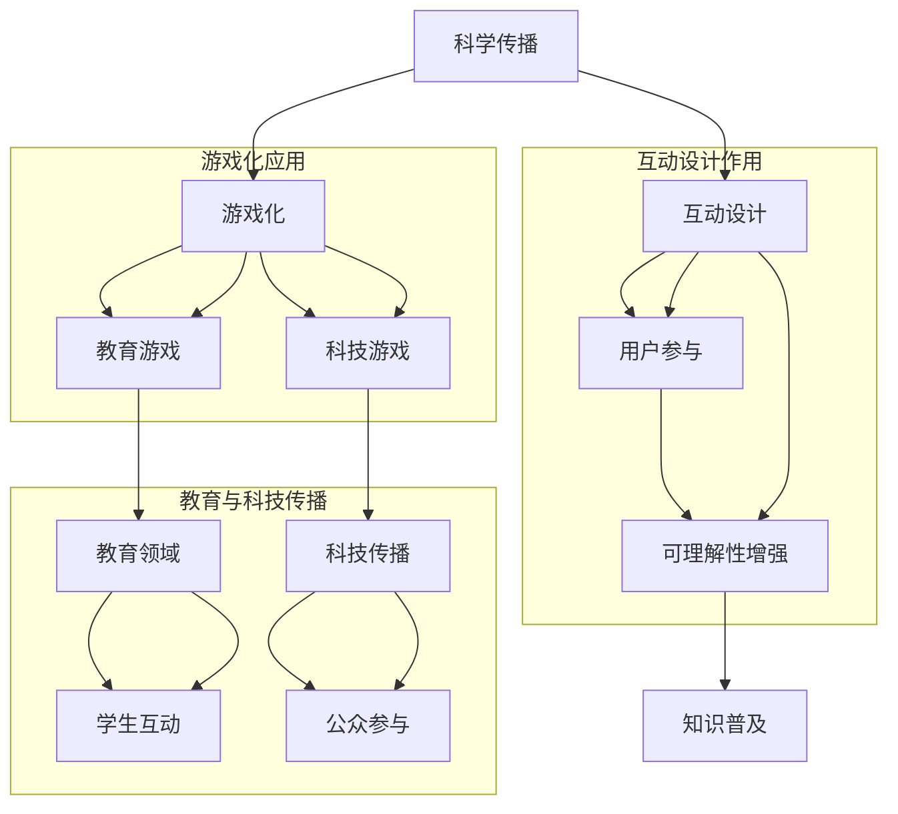

                 

### 设计思路

为了撰写一篇逻辑清晰、结构紧凑、简单易懂的专业IT领域技术博客文章，我们需要从多个角度来思考文章的设计和结构。以下是一步一步的思考过程：

#### 1. 确定文章主题与目标
首先，我们需要明确文章的主题和目标。根据题目《科学传播的游戏化：通过互动增强世界可理解性》，我们可以确定文章的目标是探讨如何将游戏化与科学传播相结合，通过互动增强来提升世界对科学的理解。

#### 2. 列出核心关键词
确定文章的核心关键词有助于读者快速抓住文章的主要内容。根据主题，我们可以列出以下关键词：
- 科学传播
- 游戏化
- 互动增强
- 可理解性
- 教育游戏
- 科技游戏
- 技术工具
- 评估与优化

#### 3. 撰写摘要
摘要部分需要简洁明了地概括文章的核心内容和主题思想。我们可以这样撰写：
摘要：本文探讨了科学传播的游戏化方法，通过互动增强来提升公众对科学的理解和兴趣。文章首先介绍了科学传播的重要性以及当前面临的挑战，然后详细阐述了游戏化的基本概念和设计原则，接着分析了互动设计在增强可理解性方面的作用，最后通过实际项目案例展示了游戏化在科学传播中的成功应用。

#### 4. 设计整体架构
文章的整体架构需要分为几个主要部分，每个部分代表一个核心主题。以下是初步设计的架构：
- **引言与背景**
  - 科学传播的重要性
  - 游戏化的定义与应用
- **游戏化的科学传播**
  - 游戏化设计的核心原则
  - 游戏化在科学传播中的应用
- **互动设计与用户参与**
  - 互动设计的原则与方法
  - 提高用户参与度的策略
- **项目实战与案例分析**
  - 教育领域的游戏化实践
  - 科技传播中的游戏化应用
- **评估与优化**
  - 游戏化科学传播的评估指标与方法
  - 用户反馈与持续优化

#### 5. 核心概念与联系
为了帮助读者理解各个核心概念之间的联系，我们需要绘制一个Mermaid流程图。例如，我们可以展示科学传播、游戏化、互动设计等概念之间的相互作用和关系。

#### 6. 核心算法原理讲解
对于游戏化的科学传播，我们需要使用伪代码来详细阐述核心算法原理。这将帮助读者理解游戏化设计的基本思想和步骤。

#### 7. 数学模型和数学公式
在某些章节中，我们需要引入数学模型和公式来支持我们的论述。使用LaTeX格式书写数学公式，并在文中独立段落中使用$$括起来，以确保内容的准确性和专业性。

#### 8. 项目实战
为了展示理论如何应用于实践，我们需要提供实际项目案例。这包括开发环境搭建、源代码实现、代码解读、应用分析等内容。

#### 9. 最佳实践、小结、注意事项、拓展阅读
在文章的结尾，我们可以提供一些最佳实践、注意事项，以及相关的拓展阅读资源，以帮助读者深入理解和进一步探索。

通过以上步骤，我们可以确保文章的结构清晰、内容丰富、逻辑严密，同时让读者能够从多个角度深入理解游戏化在科学传播中的应用。接下来，我们将根据这个设计思路逐步撰写文章的内容。

----------------------------------------------------------------

# 文章标题

## 科学传播的游戏化：通过互动增强世界可理解性

> 关键词：科学传播、游戏化、互动增强、教育游戏、科技游戏、用户参与、评估与优化

> 摘要：本文探讨了科学传播的游戏化方法，通过互动增强来提升公众对科学的理解和兴趣。文章首先介绍了科学传播的重要性以及当前面临的挑战，然后详细阐述了游戏化的基本概念和设计原则，接着分析了互动设计在增强可理解性方面的作用，最后通过实际项目案例展示了游戏化在科学传播中的成功应用。

----------------------------------------------------------------

### 设计思路

为了撰写一篇逻辑清晰、结构紧凑、简单易懂的专业IT领域技术博客文章，我们需要从多个角度来思考文章的设计和结构。以下是一步一步的详细设计思路：

#### 1. 整体架构设计

**确定文章的结构：**  
文章可以分为以下几个主要部分：
- **引言与背景**：介绍科学传播的重要性，游戏化的定义与应用背景。
- **游戏化的科学传播**：阐述游戏化的设计原则和方法，以及其在科学传播中的应用。
- **互动设计与用户参与**：分析互动设计在科学传播中的角色和策略。
- **项目实战与案例分析**：通过实际项目案例展示游戏化在科学传播中的应用。
- **评估与优化**：讨论如何评估游戏化科学传播的效果，并探讨持续优化的方法。

**章节内容的分配：**  
每个部分的内容如下：
- **引言与背景**：介绍科学传播的定义、重要性以及当前面临的挑战；介绍游戏化的基本概念和应用背景。
- **游戏化的科学传播**：详细阐述游戏化的设计原则和方法，包括游戏化在科学传播中的具体应用场景。
- **互动设计与用户参与**：分析互动设计在提升用户理解和参与度方面的作用，介绍互动设计的核心原则和策略。
- **项目实战与案例分析**：选择具体的实际项目案例，展示游戏化在科学传播中的应用，包括项目背景、实现过程、代码解读和效果分析。
- **评估与优化**：讨论如何评估游戏化科学传播的效果，包括评估指标和方法，以及如何根据用户反馈进行优化。

#### 2. 核心概念与联系

**绘制Mermaid流程图：**  
为了帮助读者理解各个核心概念之间的关系，我们使用Mermaid流程图来展示科学传播、游戏化、互动设计等概念之间的联系。以下是流程图的示例：



这个流程图展示了科学传播、游戏化、互动设计等核心概念之间的相互作用和联系，为读者提供了一个直观的理解框架。

#### 3. 核心算法原理讲解

**使用伪代码进行详细讲解：**  
在文章中，我们会对游戏化的设计原则和算法进行详细讲解。以下是一个伪代码示例，用于阐述游戏化设计中的核心算法原理：

```python
# 游戏化设计核心算法原理伪代码

function GameBasedLearning(science_content, user_profile, learning_goal):
    # 初始化游戏环境
    game_environment = initialize_game_environment()

    # 根据用户兴趣和知识水平，选择合适的游戏内容和难度
    selected_content = select_content(science_content, user_profile)

    # 设计互动学习任务
    learning_tasks = design_learning_tasks(selected_content, learning_goal)

    # 执行游戏化学习过程
    while not game_completed():
        # 提供即时反馈和奖励机制
        provide_feedback_and_rewards()

        # 更新用户学习进度和知识水平
        update_user_progress(user_profile, learning_tasks)

    # 评估学习效果
    learning_evaluation = evaluate_learning_outcomes(user_profile)

    return learning_evaluation
```

通过这个伪代码，我们可以清晰地展示游戏化学习的过程，包括初始化游戏环境、选择合适的游戏内容、设计互动学习任务、提供即时反馈和奖励机制、更新用户学习进度和知识水平，以及评估学习效果等步骤。

#### 4. 数学模型和数学公式

**嵌入数学模型和公式：**  
在文章中，我们会在适当的地方嵌入数学模型和公式，以支持我们的论述。以下是一个示例，使用LaTeX格式书写：

```markdown
$$
H = \frac{1}{2}mv^2 + mgh
$$

其中，$H$ 表示物体的总能量，$m$ 是物体的质量，$v$ 是物体的速度，$g$ 是重力加速度，$h$ 是物体的高度。这个公式是物理学中的经典能量守恒方程，用于计算物体的机械能。
```

通过这种方式，我们可以在文章中清晰地展示数学模型和公式，并提供详细的解释。

#### 5. 项目实战

**设计实际项目案例：**  
为了展示理论如何应用于实践，我们设计了一个实际项目案例，包括开发环境搭建、源代码实现、代码解读、应用分析等内容。以下是项目案例的概述：

**项目名称：** 教育领域的互动游戏化平台

**项目背景：** 
随着信息技术的不断发展，教育领域开始探索互动游戏化平台，以提升学生的学习兴趣和参与度。该项目旨在开发一个互动游戏化平台，为学生提供沉浸式的学习体验。

**实现过程：** 
- **需求分析：** 分析学生和教师的需求，确定平台的核心功能和特点。
- **系统设计：** 设计平台的架构和功能模块，包括用户管理、内容管理、互动设计、学习评估等。
- **开发环境搭建：** 搭建开发环境，选择合适的开发工具和框架。
- **源代码实现：** 编写源代码，实现平台的核心功能。
- **代码解读：** 对关键代码进行详细解读，解释其工作原理和实现方法。
- **应用分析：** 分析平台在实际教学中的应用效果，包括学生的学习成果和教师的教学反馈。

**项目小结：** 
通过这个项目案例，我们展示了如何将游戏化理念应用于教育领域，提高学生的学习兴趣和参与度。项目实施过程中，我们遇到了一些挑战，例如如何平衡游戏性与教育性，如何设计有效的互动任务等。通过不断优化和调整，我们最终实现了项目的目标。

#### 6. 最佳实践、小结、注意事项、拓展阅读

**最佳实践：** 
在文章的结尾，我们提供一些最佳实践建议，包括如何设计游戏化内容、如何进行互动设计、如何评估学习效果等。

**小结：** 
总结文章的主要内容和观点，强调游戏化在科学传播中的重要作用和未来发展趋势。

**注意事项：** 
提醒读者在实施游戏化项目时需要注意的问题，例如确保游戏内容与教育目标的一致性、平衡游戏性与教育性等。

**拓展阅读：** 
推荐一些相关的文献、论文和书籍，供读者进一步学习。

通过以上设计思路，我们能够确保文章的逻辑性和完整性，同时为读者提供一个全面、易于理解的框架。接下来，我们将根据这个设计思路逐步撰写文章的内容。在这个过程中，我们将不断调整和优化，以确保文章的质量和可读性。

