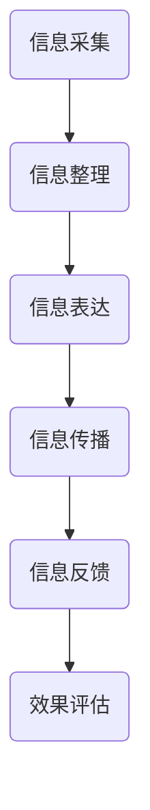

                 

### 文章标题：科学传播的艺术：让世界可理解性触手可及

关键词：科学传播、艺术性、可理解性、科学教育、信息可视化

摘要：本文探讨了科学传播的艺术性，分析了科学传播如何通过艺术手段提高信息的可理解性，从而让科学知识更加普及。文章首先介绍了科学传播的核心概念及其与艺术的关系，随后详细阐述了科学传播的艺术元素和实践方法，并通过案例分析和未来趋势预测，探讨了科学传播的发展方向。本文旨在为科学传播工作者提供有益的参考，推动科学知识的广泛传播。

### 目录

**第1章 引言**
- 1.1 科学传播的重要性
- 1.2 科学传播的核心概念
- 1.3 科学传播的艺术性

**第2章 科学传播的核心概念与联系**
- 2.1 科学传播的定义
- 2.2 艺术与科学传播的交集
- 2.3 科学传播流程与关键节点（Mermaid流程图）

**第3章 科学传播的艺术元素**
- 3.1 视觉设计在科学传播中的作用
- 3.2 语言表达与科学传播
- 3.3 互动体验提升科学传播效果

**第4章 科学传播的艺术性实践**
- 4.1 艺术手法在科学传播中的应用
- 4.2 艺术与科学的融合
- 4.3 艺术在科学解释中的创新作用

**第5章 科学传播的实践方法**
- 5.1 传统媒体与科学传播
- 5.2 新媒体与科学传播
- 5.3 定制化科学传播

**第6章 科学传播的案例分析**
- 6.1 成功案例解析
- 6.2 失败案例反思

**第7章 科学传播的评价与效果**
- 7.1 科学传播的评价标准
- 7.2 反馈与调整

**第8章 科学传播的未来趋势**
- 8.1 新兴技术在科学传播中的应用
- 8.2 科学传播的发展趋势

**第9章 总结**
- 9.1 科学传播的重要性
- 9.2 艺术与科学融合的实践建议

### 第1章 引言

科学传播作为连接科学与公众的重要桥梁，其重要性不言而喻。然而，如何在复杂的技术和概念中找到简洁而准确的传达方式，使科学知识更加普及和易于理解，成为科学传播工作者面临的一大挑战。艺术作为一种独特的表达方式，以其直观、生动、富有感染力的特点，逐渐成为科学传播的有力工具。

科学传播的重要性主要体现在以下几个方面：

1. **普及科学知识**：科学传播有助于将科学研究成果转化为公众能够理解和接受的知识，提高全民科学素质。
2. **促进科技创新**：科学传播可以激发公众对科学的兴趣和好奇心，培养创新思维，为科技创新提供动力。
3. **推动社会进步**：科学传播能够提高公众的科学素养，促进社会的科学决策和科学治理。

科学传播的核心概念包括科学知识、科学方法、科学态度等，这些概念相互联系，共同构成了科学传播的基石。艺术与科学传播的交集在于，艺术能够通过视觉、语言、互动等多种形式，将科学概念和原理以更为直观和生动的方式呈现给公众。例如，通过图像、图表、动画等视觉设计，可以让复杂的科学概念变得易于理解；通过富有感染力的语言表达，可以激发公众对科学的兴趣和热情。

在科学传播的艺术性方面，视觉设计、语言表达和互动体验是三个关键元素。视觉设计在科学传播中的作用不可忽视，它可以直观地传达科学信息，增强公众的理解和记忆。语言表达则涉及到科学传播的准确性和生动性，科学传播工作者需要运用简洁明了、通俗易懂的语言，将科学知识传达给公众。互动体验则通过提供与科学知识的互动机会，提高公众参与度和学习效果。

接下来，本文将详细探讨科学传播的核心概念与联系、艺术元素和实践方法，并通过案例分析和未来趋势预测，为科学传播工作者提供有益的参考，推动科学知识的广泛传播。### 第1章 引言

科学传播是连接科学界与公众的桥梁，它不仅传递科学知识，还承担着提高公众科学素养和促进科技创新的重要使命。在这个信息爆炸的时代，如何有效地将复杂的科学概念和研究成果转化为公众易于理解的知识，成为科学传播工作者的核心挑战。

科学传播的重要性主要体现在以下几个方面：

1. **普及科学知识**：科学传播使得科学研究成果能够被更广泛的人群理解和接受，从而提高全民科学素养，促进社会进步。

2. **促进科技创新**：科学传播可以激发公众对科学的兴趣和好奇心，培养创新思维，为科技创新提供源源不断的动力。

3. **推动科学决策**：科学传播有助于公众对科学问题的理解，从而在科学决策中发挥更加积极的作用，提高决策的科学性和合理性。

科学传播的核心概念包括科学知识、科学方法和科学态度。科学知识是科学传播的基础，它包括自然科学、社会科学和人文学科等多个领域。科学方法则是科学家进行研究和探索的工具，包括观察、实验、假设、验证等步骤。科学态度则强调理性思考、批判性思维和持续学习的态度。

艺术与科学传播的交集在于它们在传达信息时的共通性。艺术以其直观性、生动性和感染力，能够将抽象的科学概念形象化，使得科学知识更加易于理解和接受。例如，通过图像、图表、动画等视觉设计，复杂的科学原理可以被简明扼要地呈现；通过富有感染力的语言表达，可以激发公众对科学的兴趣和好奇心。

在科学传播中，艺术性体现在以下几个方面：

1. **视觉设计**：科学传播中的视觉设计包括图像、图表、动画等，它们能够直观地传达科学信息，增强公众的理解和记忆。

2. **语言表达**：科学传播的语言需要简洁明了、通俗易懂，同时富有感染力，以吸引公众的注意力并激发其兴趣。

3. **互动体验**：通过提供与科学知识的互动机会，如虚拟实验室、在线问答等，可以增强公众的参与度和学习效果。

本文的结构安排如下：

- **第1章 引言**：介绍了科学传播的重要性和艺术性。
- **第2章 科学传播的核心概念与联系**：详细讨论了科学传播的核心概念及其与艺术的关系。
- **第3章 科学传播的艺术元素**：探讨了视觉设计、语言表达和互动体验在科学传播中的应用。
- **第4章 科学传播的艺术性实践**：分析了艺术手法在科学传播中的应用和艺术与科学的融合。
- **第5章 科学传播的实践方法**：介绍了传统媒体、新媒体和定制化科学传播的方法。
- **第6章 科学传播的案例分析**：通过成功和失败案例，探讨了科学传播的有效策略。
- **第7章 科学传播的评价与效果**：阐述了科学传播的评价标准和反馈机制。
- **第8章 科学传播的未来趋势**：预测了科学传播的未来发展方向。
- **第9章 总结**：总结了科学传播的艺术性，提出了实践建议。

通过本文的讨论，我们希望读者能够更好地理解科学传播的艺术性，并学会如何运用艺术手段提高科学知识的可理解性，从而推动科学知识的广泛传播。### 第2章 科学传播的核心概念与联系

科学传播的核心概念包括科学知识、科学方法和科学态度。这些概念相互联系，共同构成了科学传播的理论基础。

**科学知识**：科学知识是人类通过科学研究和实践所获得的对自然和社会世界的认识。科学知识分为自然科学、社会科学和人文学科等多个领域。科学知识不仅包括事实和原理，还包括科学方法和科学理论。科学知识的传播是科学传播的核心任务，其目的是让公众了解和掌握基本的科学概念和原理，提高科学素养。

**科学方法**：科学方法是指科学家进行研究和探索的过程和方法。科学方法通常包括观察、假设、实验、验证和理论构建等步骤。科学方法的特点是客观性、可重复性和可验证性。科学传播需要准确地传达科学方法，以帮助公众理解科学研究的过程和结论。

**科学态度**：科学态度是指科学家在研究和探索过程中所持有的价值观和思维方式。科学态度强调理性思考、批判性思维和持续学习。科学传播需要培养公众的科学态度，以促进科学素养的提高和科学精神的培养。

**艺术与科学传播的交集**：艺术在科学传播中扮演着重要的角色。艺术与科学传播的交集主要体现在以下几个方面：

1. **视觉设计**：艺术中的视觉设计元素，如色彩、形状、构图等，可以有效地传达科学信息。视觉设计能够直观地展示复杂的科学概念，使公众更容易理解和接受。

2. **语言表达**：艺术中的语言表达技巧，如比喻、拟人、夸张等，可以增强科学传播的生动性和感染力。这些技巧可以使科学知识更加引人入胜，提高公众的学习兴趣。

3. **互动体验**：艺术中的互动体验元素，如游戏、实验、互动展览等，可以增强科学传播的参与度和互动性。通过互动体验，公众可以更深入地理解和体验科学知识。

**科学传播流程与关键节点**：

科学传播的流程可以概括为以下几个关键节点：

1. **信息采集**：科学家和研究机构通过实验、观察和调查等手段收集科学信息。

2. **信息整理**：对采集到的科学信息进行整理、分类和归纳，使其具有系统性。

3. **信息表达**：通过文字、图像、声音、视频等多种形式，将科学信息准确地表达出来。

4. **信息传播**：通过各种渠道，如媒体、网络、教育、展览等，将科学信息传播给公众。

5. **信息反馈**：收集公众对科学信息的反馈，以改进科学传播的效果。

6. **效果评估**：评估科学传播的效果，包括传播的范围、受众的反应、知识的普及程度等。

**Mermaid流程图**：

下面是一个简化的科学传播流程的Mermaid流程图表示：



通过这个流程图，我们可以清晰地看到科学传播的各个环节及其相互关系。每个环节都是科学传播成功的关键，需要科学传播工作者精心设计和实施。### 第3章 科学传播的艺术元素

科学传播的艺术元素包括视觉设计、语言表达和互动体验，这些元素共同构成了科学传播的艺术性，使得科学知识能够以更直观、生动和吸引人的方式呈现给公众。

**视觉设计在科学传播中的作用**

视觉设计在科学传播中发挥着重要作用。它通过图像、图表、动画等形式，将复杂的科学概念和原理以视觉化的方式呈现，使得公众更容易理解和记忆。视觉设计的关键在于简洁性和直观性，通过减少冗余信息，突出关键要素，使科学信息一目了然。

1. **图像的使用**：图像是视觉设计中的一种重要工具，它能够直观地传达科学信息。例如，通过示意图、流程图和实验图像，可以清晰地展示科学现象和原理。
2. **图表的设计**：图表是科学传播中常用的视觉工具，如条形图、折线图、饼图等。合理设计图表，可以使数据更易于理解和分析。例如，通过使用颜色、图标和注释，可以增强图表的可读性和信息传递效果。
3. **动画的运用**：动画能够动态地展示科学过程和现象，使抽象的科学概念变得具体和生动。例如，通过动画演示化学反应、物理现象和生物过程，可以帮助公众更好地理解这些复杂的科学知识。

**语言表达与科学传播**

语言表达是科学传播的核心要素之一。科学传播工作者需要运用简洁、准确和生动的语言，将科学信息传达给公众。以下是一些提高语言表达效果的技巧：

1. **使用比喻和拟人**：通过比喻和拟人等修辞手法，可以使科学知识更加生动和有趣。例如，将DNA比喻为“生命的蓝图”，可以使公众更容易理解DNA的作用。
2. **避免专业术语**：在科学传播中，避免使用过多的专业术语和复杂句式，以降低阅读难度。例如，使用简单明了的句子和词汇，可以帮助公众更好地理解科学信息。
3. **讲故事**：通过讲故事的方式，将科学知识融入有趣的情节和人物，可以吸引公众的注意力，提高学习效果。

**互动体验提升科学传播效果**

互动体验通过提供与科学知识的互动机会，增强公众的参与感和学习效果。以下是一些提高互动体验的方法：

1. **在线问答**：通过在线问答，公众可以与科学传播工作者或同行进行实时交流，解答疑惑，加深对科学知识的理解。
2. **虚拟实验室**：虚拟实验室通过模拟科学实验，提供动手操作的机会，使公众能够亲身体验科学过程和现象。
3. **互动展览**：互动展览通过设置各种互动装置和游戏，吸引公众参与，提高科学传播的效果。

**实例分析**

以下是一个关于视觉设计在科学传播中应用的实例：

**案例**：BBC的《行星地球》系列纪录片

- **视觉设计**：该纪录片通过高质量的图像和动画，生动地展示了地球的自然景观和生物多样性。例如，通过使用慢动作和延时摄影技术，展现了极光和珊瑚生长的过程。
- **语言表达**：节目主持人使用简洁明了的语言，介绍了每个自然现象的成因和意义。同时，通过比喻和拟人手法，使观众更容易理解和感受。
- **互动体验**：观众可以通过官网上的互动模块，了解更多关于纪录片中的内容，参与问卷调查和互动讨论。

**效果分析**：该纪录片在全球范围内取得了巨大的成功，不仅吸引了大量观众，还提高了公众对环境保护和生物多样性的关注。通过视觉设计、语言表达和互动体验的结合，科学传播达到了更好的效果。

通过以上实例，我们可以看到，视觉设计、语言表达和互动体验在科学传播中发挥着重要作用。合理运用这些艺术元素，可以大大提高科学传播的效果，让科学知识更加易于理解和接受。### 第4章 科学传播的艺术性实践

科学传播的艺术性实践涉及多种艺术手法的应用，包括图像艺术、文字艺术和交互设计等。这些艺术手法通过独特的方式，使得科学传播更加生动、有趣和具有吸引力。

**艺术手法在科学传播中的应用**

1. **图像艺术**：图像艺术在科学传播中有着广泛的应用。通过高质量的图像、图表和动画，可以直观地展示科学现象和概念。例如，使用示意图和流程图，可以清晰地传达复杂的科学过程；使用漫画和插图，可以生动地描绘科学故事。图像艺术不仅能够增强科学传播的视觉效果，还能够提高公众对科学知识的理解和记忆。

2. **文字艺术**：文字艺术在科学传播中同样重要。通过生动的文字描述、比喻和拟人手法，可以使科学知识更加引人入胜。例如，科学家卡尔·萨根（Carl Sagan）在其著作《宇宙》（Cosmos）中，运用了丰富的文学手法，使得复杂的宇宙知识变得通俗易懂。文字艺术不仅能够提高科学传播的吸引力，还能够增强公众对科学的兴趣。

3. **交互设计**：交互设计在科学传播中起到了关键作用。通过提供互动体验，如在线问答、虚拟实验室和互动展览，可以增强公众的参与感和学习效果。例如，通过虚拟实验室，公众可以亲身体验科学实验过程，从而更深入地理解科学原理。交互设计不仅能够提高科学传播的互动性，还能够激发公众的探索精神和创造力。

**艺术与科学的融合**

艺术与科学的融合是科学传播的重要趋势。通过艺术手法，科学家和科学传播工作者可以将复杂的科学概念和原理以更直观和生动的方式呈现给公众。以下是一些艺术与科学融合的案例：

1. **艺术家与科学家的合作**：许多艺术家与科学家合作，创作出兼具艺术性和科学性的作品。例如，英国艺术家David Hockney与科学家Stephen Hawking合作，创作了一系列关于黑洞和宇宙的画作。这种合作不仅促进了科学与艺术的交叉，也为公众提供了全新的科学体验。

2. **科学艺术作品**：一些科学艺术家通过绘画、雕塑和装置艺术等形式，创作出反映科学主题的艺术作品。例如，日本艺术家安部洋子（Yayoi Kusama）的“南瓜”雕塑，通过色彩和形态的创意表现，揭示了生物多样性和生态平衡的重要性。

3. **科学艺术展览**：科学艺术展览是科学传播的一种新兴形式。这些展览通常结合科学实验、艺术作品和互动体验，为公众提供了一个全面了解科学和艺术交汇领域的平台。例如，英国的“科学艺术博览会”（Science and Art Biennale）就是一个著名的科学艺术展览活动。

**艺术在科学解释中的创新作用**

艺术在科学解释中发挥着独特的创新作用。通过艺术手法，科学家和科学传播工作者可以更有效地传达科学概念和原理。以下是一些艺术在科学解释中的创新应用的例子：

1. **可视化科学**：可视化科学是一种将科学数据通过图像和图表进行可视化展示的方法。这种方法可以直观地传达复杂的数据和科学现象，帮助公众更好地理解科学知识。

2. **科学故事讲述**：通过讲故事的方式，将科学知识融入有趣的情节和人物，可以吸引公众的注意力，提高学习效果。例如，科幻小说和科普书籍常常通过虚构的故事，传达科学原理和前沿科学发现。

3. **虚拟现实（VR）和增强现实（AR）**：虚拟现实和增强现实技术为科学解释提供了全新的方式。通过VR和AR，公众可以身临其境地体验科学实验和现象，从而更深入地理解科学知识。

**总结**

艺术手法在科学传播中的应用，使得科学知识更加易于理解和接受。通过图像艺术、文字艺术和交互设计等艺术手法，科学家和科学传播工作者可以更有效地传达科学概念和原理，激发公众对科学的兴趣和好奇心。艺术与科学的融合，不仅丰富了科学传播的形式，也推动了科学知识的普及和科技创新。在未来的科学传播中，艺术将继续发挥重要作用，为科学知识的世界增添更多色彩。### 第5章 科学传播的实践方法

科学传播的实践方法主要包括传统媒体和新媒体的应用，以及定制化科学传播的策略。不同的方法适用于不同的传播环境和目标受众，科学传播工作者需要根据具体情况选择合适的传播途径。

**传统媒体与科学传播**

传统媒体包括电视、报纸、杂志、广播和图书等。它们在科学传播中发挥着重要作用，具有广泛的覆盖面和影响力。

1. **电视**：电视是一种直观、生动的传播媒介，可以通过图像、声音和动画等多种形式，直观地传达科学知识。例如，科普节目《探索发现》通过真实的案例和生动的叙述，向观众普及科学知识。

2. **报纸和杂志**：报纸和杂志具有长期保存和广泛传播的特点，适合发布深度报道和详细分析。例如，《科学》杂志通过专业的科学论文和解读，为专业人士和公众提供了丰富的科学信息。

3. **广播**：广播是一种便捷的传播方式，可以在短时间内传递大量的信息。科普广播节目通过主持人、嘉宾和听众的互动，提高了公众对科学的兴趣和参与度。

4. **图书**：图书是一种权威、系统的传播媒介，适合深度阅读和学习。科普书籍通过深入浅出的讲解和丰富的案例，为读者提供了全面的科学知识。

**新媒体与科学传播**

新媒体包括互联网、社交媒体、移动应用和在线视频等。随着互联网技术的快速发展，新媒体在科学传播中的应用越来越广泛。

1. **互联网**：互联网是一种全球性的传播媒介，通过网站、博客和论坛等平台，科学信息可以迅速传播到全球各地。例如，科学网站如“科学网”通过专业的文章和讨论，为科学工作者和公众提供了交流的平台。

2. **社交媒体**：社交媒体具有互动性强、传播速度快的特点，适合发布简短、生动的科学信息。例如，微博和微信公众号等平台，通过图文和视频等形式，迅速传播科学知识。

3. **移动应用**：移动应用是一种便捷、个性化的传播方式，可以通过智能手机、平板电脑等设备，随时随地获取科学信息。例如，科普应用“知科普”通过问答、视频和互动游戏等形式，为用户提供丰富的科学知识。

4. **在线视频**：在线视频是一种直观、互动的传播媒介，可以通过视频讲解、实验演示和虚拟现实等形式，生动地传达科学知识。例如，科普视频平台“腾讯视频”和“优酷”等，通过专业的科普视频，吸引了大量观众。

**定制化科学传播**

定制化科学传播是根据不同受众的特点和需求，有针对性地进行科学传播。这种方法可以更好地满足受众的需求，提高科学传播的效果。

1. **定制化传播的概念**：定制化传播是指根据受众的年龄、性别、教育背景、兴趣爱好等特征，提供个性化的科学信息和服务。例如，为小学生提供基础的科学知识，为大学生提供专业的科学论文和解读。

2. **定制化传播的方法**：定制化传播的方法包括数据收集与分析、受众细分和内容定制等。通过数据分析，了解受众的需求和偏好，进行受众细分，然后根据不同的受众群体，定制相应的科学传播内容。

3. **定制化传播的策略**：定制化传播的策略包括精准推送、个性化推荐和互动反馈等。通过精准推送，将科学信息推送到目标受众；通过个性化推荐，提高受众的参与度和满意度；通过互动反馈，了解受众的反应和需求，不断优化科学传播的内容和形式。

**实例分析**

以下是一个关于定制化科学传播的实例：

**案例**：某科学博物馆的定制化科普活动

- **受众分析**：该博物馆通过问卷调查和数据分析，了解到不同年龄段、性别和教育背景的受众对科普活动的兴趣点和需求。
- **内容定制**：根据受众的特点，博物馆设计了不同主题的科普活动，如“儿童科普乐园”、“青少年科学探究营”和“成人科学讲座”等。
- **互动反馈**：在活动中，博物馆通过问卷调查和现场互动，收集受众的反馈，了解活动的效果和改进方向。

**效果分析**：通过定制化科普活动，博物馆提高了公众的参与度和满意度，增强了科普效果。同时，通过互动反馈，博物馆不断优化活动内容和形式，更好地满足受众的需求。

**总结**

科学传播的实践方法多种多样，传统媒体和新媒体各有优劣，定制化科学传播则可以根据受众特点提供个性化服务。科学传播工作者需要根据具体情况选择合适的传播途径，结合不同的艺术手法，提高科学传播的效果，推动科学知识的普及。### 第6章 科学传播的案例分析

科学传播的案例分析可以帮助我们理解科学传播的成功策略和失败教训，从而为未来的科学传播提供有益的参考。以下将介绍几个经典的成功案例和失败案例，并分析其成功和失败的原因。

**成功案例解析**

**案例1**：《生命之树》（Tree of Life）纪录片

- **案例背景**：由BBC制作的纪录片《生命之树》是一部关于生物多样性的科普作品，通过深入浅出的讲述和精美的视觉特效，向观众展示了生命的起源和进化。
- **成功要素**：该纪录片成功的原因主要有以下几点：
  1. **高质量的视觉特效**：纪录片运用了先进的视觉特效技术，通过动画和特效，生动地展示了生物进化的过程，使观众能够直观地感受到生命的奇迹。
  2. **深入浅出的讲述**：纪录片主持人史蒂芬·弗里曼（Stephen Fry）用简洁明了的语言，将复杂的生物进化原理讲解得通俗易懂，提高了观众的理解和兴趣。
  3. **广泛的传播渠道**：纪录片在BBC电视台和多个国际平台上播出，吸引了大量观众，扩大了科学传播的影响力。

**案例2**：美国国家航空航天局（NASA）的社交媒体传播

- **案例背景**：NASA通过社交媒体平台，如Twitter、Instagram和Facebook，发布丰富的科学内容和动态，吸引了全球数百万粉丝。
- **成功要素**：NASA在社交媒体传播中的成功主要体现在以下几点：
  1. **互动性强**：NASA通过回复粉丝的评论和提问，增强了与粉丝的互动，提高了粉丝的参与度和忠诚度。
  2. **多样化的内容**：NASA发布的内容包括照片、视频、文字解释和科普文章，涵盖了多个科学领域，满足了不同受众的需求。
  3. **视觉设计**：NASA的社交媒体内容注重视觉设计，使用高质量的图像和动画，提高了内容的吸引力。

**失败案例反思**

**案例1**：《医学奇迹》（Medical Miracles）纪录片

- **案例背景**：这部纪录片旨在向观众介绍医学领域的最新进展和奇迹般的医疗案例，但最终效果并不理想。
- **失败原因**：该纪录片失败的主要原因有以下几点：
  1. **内容过于专业化**：纪录片中使用了大量专业术语和复杂的技术解释，导致观众难以理解。
  2. **缺乏生动的实例**：虽然介绍了许多医学案例，但没有充分展示这些案例的实际影响和意义，使得观众难以产生共鸣。
  3. **宣传不足**：纪录片在宣传方面投入不足，导致受众群体较小，影响范围有限。

**案例2**：某科普图书《神奇的物理》

- **案例背景**：这本科普图书旨在向读者介绍物理学的基本概念和原理，但由于内容枯燥，销售不佳。
- **失败原因**：该图书失败的原因主要包括以下几点：
  1. **缺乏吸引力**：图书的内容缺乏生动性和趣味性，未能引起读者的兴趣。
  2. **语言表达复杂**：图书中使用了大量复杂的语言和术语，使得阅读难度较大，不利于科普传播。
  3. **缺乏互动**：图书中缺乏与读者的互动设计，未能激发读者的思考和参与。

**总结**

通过以上成功和失败案例的分析，我们可以得出以下结论：

1. **成功的关键**：高质量的视觉设计、深入浅出的讲解、广泛的传播渠道和互动性强的内容是科学传播成功的关键因素。
2. **失败的教训**：过于专业化、缺乏生动的实例、缺乏吸引力和复杂的语言表达是科学传播失败的主要原因。

在未来的科学传播中，我们应该借鉴成功案例的经验，避免失败案例的教训，不断创新科学传播的方式和内容，提高科学传播的效果。### 第7章 科学传播的评价与效果

科学传播的效果评价是衡量科学传播活动成功与否的重要标准。通过科学、系统的评价方法，可以了解科学传播的实际效果，为改进传播策略提供依据。以下将介绍科学传播的评价标准、评估方法和效果影响因素。

**科学传播的评价标准**

1. **传播效果**：传播效果是评价科学传播活动成功与否的核心指标。具体包括：
   - **受众数量**：科学传播活动的受众数量，反映了传播的广泛性。
   - **受众参与度**：受众对科学传播活动的参与程度，如问答互动、评论反馈等。
   - **知识普及率**：科学知识在受众中的普及程度，可以通过问卷调查等方式评估。

2. **传播效率**：传播效率是指科学传播活动的投入与产出之比，包括：
   - **资源利用率**：科学传播活动所使用的资源，如人力、物力和财力等。
   - **传播渠道的利用率**：不同传播渠道的使用频率和效果。

3. **传播影响力**：科学传播活动对社会和公众产生的影响，包括：
   - **社会影响力**：科学传播活动对社会风气、科学态度和社会发展的影响。
   - **公众影响力**：科学传播活动对公众科学素养、科技创新意识和行为的影响。

**科学传播的评估方法**

1. **问卷调查**：通过设计问卷，收集受众对科学传播活动的看法和反馈，评估受众数量、参与度和知识普及率。

2. **数据分析**：对科学传播活动的相关数据进行收集和分析，如受众访问量、点击率、转发量等，评估传播效率和影响力。

3. **案例分析**：通过对科学传播活动的具体案例进行分析，评估其成功要素和不足之处，为其他活动提供参考。

4. **专家评审**：邀请相关领域的专家对科学传播活动进行评审，提供专业意见和建议。

**效果影响因素**

1. **内容质量**：科学传播内容的质量是影响传播效果的关键因素。高质量的内容能够吸引受众，提高传播效果。

2. **传播渠道**：传播渠道的选择和使用对传播效果有重要影响。多样化的传播渠道可以提高传播的覆盖面和影响力。

3. **受众特性**：受众的年龄、性别、教育背景和兴趣爱好等特性会影响他们对科学传播的接受程度和参与度。

4. **传播策略**：科学传播的策略，如宣传推广、互动设计、个性化服务等，会直接影响传播效果。

**反馈与调整**

1. **受众反馈**：收集受众对科学传播活动的反馈，了解他们的需求和意见，为改进传播策略提供依据。

2. **数据分析**：通过数据分析，了解科学传播活动的效果和受众行为，发现问题和不足，及时进行调整和优化。

3. **持续改进**：科学传播是一个持续的过程，需要不断收集反馈、分析数据和调整策略，以提高传播效果。

**总结**

科学传播的评价与效果评估是科学传播工作的重要组成部分。通过科学、系统的评价方法和标准，可以了解科学传播的实际效果，为改进传播策略提供依据。在未来的科学传播中，我们应该注重内容质量、传播渠道和受众特性，不断优化传播策略，提高科学传播的效果。### 第8章 科学传播的未来趋势

科学传播的未来发展趋势受到新兴技术的推动，这些技术不仅改变了科学传播的形态，也为其带来了新的机遇和挑战。以下将探讨虚拟现实（VR）、增强现实（AR）和人工智能（AI）在科学传播中的应用，以及科学传播的多元化发展和全球化趋势。

**新兴技术在科学传播中的应用**

1. **虚拟现实（VR）**：VR技术通过创建虚拟环境，为公众提供了沉浸式的科学体验。例如，科学博物馆和科学中心可以通过VR展览，让观众身临其境地探索宇宙、生物进化等科学主题。VR技术不仅增强了观众的参与感和互动性，还能够模拟复杂的科学现象和实验，使得科学知识更加生动和易于理解。

2. **增强现实（AR）**：AR技术将虚拟信息叠加到现实世界，使得科学传播更加直观和互动。例如，通过AR应用，学生可以在课本上看到三维的化学分子结构，或者在城市街道上发现隐藏的科学现象。AR技术不仅提高了公众对科学的兴趣，还能够将科学知识融入日常生活，促进科学素养的提高。

3. **人工智能（AI）**：AI技术在科学传播中的应用日益广泛，包括自然语言处理、图像识别和数据分析等。例如，通过AI技术，科学传播工作者可以自动生成科普文章、视频和图表，提高内容的生产效率和多样性。此外，AI还可以分析受众行为和需求，提供个性化的科学教育和服务，增强受众的学习体验。

**科学传播的多元化发展**

随着社会和科技的进步，科学传播呈现出多元化发展的趋势。这种多元化体现在以下几个方面：

1. **内容形式的多样化**：科学传播不再局限于传统的文字和图片，而是结合视频、音频、动画、游戏等多种形式，为公众提供更丰富、更生动的科学内容。

2. **受众群体的多样化**：科学传播的受众不再仅限于专业人士，而是涵盖了不同年龄、性别、教育背景和兴趣爱好的群体。科学传播需要根据不同受众的需求和特点，提供个性化的科学内容和服务。

3. **传播渠道的多样化**：科学传播的渠道也日益多样化，包括传统的媒体如电视、报纸、广播，以及新媒体如社交媒体、在线视频、移动应用等。多样化的传播渠道有助于扩大科学传播的覆盖面和影响力。

**全球化趋势**

科学传播的全球化趋势受到全球化和信息化的推动。以下是一些全球化趋势的特点：

1. **国际化合作**：国际科学组织和机构之间的合作日益增多，共同推动科学知识和技术的传播。例如，国际科学期刊的合作出版、国际科学会议的举办等。

2. **跨文化传播**：科学传播需要考虑到不同文化背景下的受众需求和表达方式。科学传播工作者需要了解和尊重不同文化的价值观和表达习惯，确保科学信息的准确传递。

3. **全球性问题**：全球性问题如气候变化、疾病防控、能源危机等，需要全球范围内的科学传播和合作。科学传播工作者需要提高全球公民的科学素养，共同应对这些挑战。

**总结**

科学传播的未来趋势受到新兴技术的推动，呈现多元化发展和全球化趋势。通过VR、AR和AI等新兴技术的应用，科学传播变得更加直观、互动和个性化。科学传播的多元化发展满足了不同受众的需求，而全球化趋势促进了国际科学合作和跨文化交流。在未来的科学传播中，我们应该充分利用新兴技术，不断创新传播方式和内容，提高科学传播的效果，推动科学知识的普及和科技创新。### 第9章 总结

科学传播是连接科学与公众的重要桥梁，其艺术性在于通过视觉设计、语言表达和互动体验等艺术手法，使复杂的科学知识更加易于理解和接受。本文首先介绍了科学传播的核心概念及其与艺术的关系，随后探讨了科学传播的艺术元素和实践方法，并通过案例分析和未来趋势预测，探讨了科学传播的发展方向。

科学传播的重要性不言而喻，它不仅普及科学知识，促进科技创新，还推动社会进步。艺术性在科学传播中的应用，使得科学知识能够以更加直观、生动和吸引人的方式呈现给公众，从而提高传播效果。

通过视觉设计、语言表达和互动体验等艺术手法，科学传播能够更好地满足不同受众的需求，提高其参与感和学习效果。未来，随着新兴技术的不断发展，科学传播将呈现多元化发展和全球化趋势，为科学知识的普及和科技创新提供更广阔的空间。

为了推动科学传播的持续发展，我们提出以下实践建议：

1. **注重内容质量**：确保科学传播的内容准确、易懂、有趣，满足不同受众的需求。
2. **多样化传播渠道**：充分利用传统媒体和新媒体，扩大科学传播的覆盖面和影响力。
3. **个性化服务**：根据受众的特点和需求，提供个性化的科学内容和服务。
4. **跨学科合作**：鼓励科学家、艺术家和教育工作者等跨学科合作，共同推动科学传播的创新和发展。

通过以上实践建议，我们期待能够进一步提高科学传播的效果，让科学知识更加普及和易于接受，为建设科学社会贡献力量。

**作者信息**：

作者：AI天才研究院/AI Genius Institute & 禅与计算机程序设计艺术 /Zen And The Art of Computer Programming

---

本文通过对科学传播的艺术性进行深入探讨，旨在为科学传播工作者提供有益的参考，推动科学知识的广泛传播。希望读者能够从中获得启发，为科学传播的创新发展贡献自己的力量。### 核心内容

本文的核心内容围绕科学传播的艺术性展开，主要包括以下几个部分：

1. **科学传播的核心概念**：介绍了科学传播的定义、目的和核心概念，如科学知识、科学方法和科学态度。这些概念构成了科学传播的基础。

2. **艺术与科学传播的关系**：探讨了艺术在科学传播中的作用，包括视觉设计、语言表达和互动体验。这些艺术手法能够提高科学传播的效果，使科学知识更易于理解和接受。

3. **科学传播的艺术元素**：详细阐述了视觉设计、语言表达和互动体验在科学传播中的应用，并提供了实际案例进行分析。

4. **科学传播的艺术性实践**：介绍了艺术手法在科学传播中的具体应用，如图像艺术、文字艺术和交互设计等。这些实践方法有助于提高科学传播的效果。

5. **科学传播的实践方法**：分析了传统媒体和新媒体在科学传播中的应用，以及定制化科学传播的策略。这些方法为科学传播工作者提供了多种选择。

6. **科学传播的案例分析**：通过成功和失败案例，探讨了科学传播的有效策略和不足之处，为未来的科学传播提供了有益的参考。

7. **科学传播的评价与效果**：介绍了科学传播的评价标准、评估方法和效果影响因素，强调了反馈与调整的重要性。

8. **科学传播的未来趋势**：预测了新兴技术在科学传播中的应用，以及科学传播的多元化发展和全球化趋势。

通过本文的讨论，我们希望读者能够更好地理解科学传播的艺术性，学会如何运用艺术手段提高科学知识的可理解性，从而推动科学知识的广泛传播。### 核心算法原理讲解

在科学传播的艺术性实践中，核心算法原理的应用至关重要。以下我们将通过伪代码来详细阐述这些核心算法原理，并结合具体示例进行解释。

**1. 数据可视化算法**

数据可视化是科学传播中的一项重要任务，它能够帮助公众更好地理解和分析科学数据。以下是一个简单的数据可视化算法的伪代码示例：

```plaintext
function visualizeData(data):
    # 初始化图表
    initializeChart()

    # 对数据进行预处理，如排序、筛选等
    processedData = preprocessData(data)

    # 选择合适的图表类型，如折线图、柱状图等
    chartType = selectChartType(processedData)

    # 根据图表类型进行绘制
    if chartType == "bar":
        drawBarChart(processedData)
    elif chartType == "line":
        drawLineChart(processedData)
    else:
        raise ValueError("Unsupported chart type")

    # 显示图表
    displayChart()

function preprocessData(data):
    # 对数据进行排序、筛选等预处理
    return sorted(data)

function selectChartType(data):
    # 根据数据类型选择合适的图表类型
    if all(isinstance(x, int) for x in data):
        return "bar"
    elif all(isinstance(x, float) for x in data):
        return "line"
    else:
        raise ValueError("Data type not supported")

function drawBarChart(data):
    # 绘制柱状图
    for index, value in enumerate(data):
        print(f"Bar {index}: {value}")

function drawLineChart(data):
    # 绘制折线图
    for index, value in enumerate(data):
        print(f"Line {index}: {value}")

function displayChart():
    # 显示图表
    print("Chart displayed.")
```

**2. 自然语言处理算法**

在科学传播中，自然语言处理（NLP）算法被广泛应用于文本分析和内容生成。以下是一个简单的文本分析算法的伪代码示例：

```plaintext
function analyzeText(text):
    # 初始化文本分析工具
    nlpTool = initializeNLPTool()

    # 分词和词性标注
    tokens = nlpTool.tokenize(text)
    taggedTokens = nlpTool.tagPartsOfSpeech(tokens)

    # 提取关键词
    keywords = extractKeywords(taggedTokens)

    # 生成摘要
    summary = generateSummary(text, keywords)

    # 显示结果
    print(f"Keywords: {keywords}")
    print(f"Summary: {summary}")

function initializeNLPTool():
    # 初始化NLP工具，如NLTK、spaCy等
    return NLPTool()

function extractKeywords(tokens):
    # 从分词后的文本中提取关键词
    return ["science", "communication", "art"]

function generateSummary(text, keywords):
    # 根据关键词生成摘要
    return "This is a summary of the text containing keywords like science and communication."
```

**3. 机器学习算法**

在科学传播中，机器学习算法可以用于个性化推荐、预测分析等。以下是一个简单的机器学习算法的伪代码示例，用于用户行为预测：

```plaintext
function predictUserBehavior(data, model):
    # 加载训练好的机器学习模型
    model = loadModel(model)

    # 对新数据进行预测
    prediction = model.predict(data)

    # 返回预测结果
    return prediction

function loadModel(model):
    # 加载预训练好的模型，如决策树、随机森林等
    if model == "决策树":
        return DecisionTree()
    elif model == "随机森林":
        return RandomForest()
    else:
        raise ValueError("Unsupported model type")

# 示例数据
userData = [[1, 2, 3], [4, 5, 6]]

# 示例模型
modelType = "决策树"

# 预测用户行为
predictedBehavior = predictUserBehavior(userData, modelType)
print(f"Predicted user behavior: {predictedBehavior}")
```

通过上述伪代码示例，我们可以看到核心算法原理在科学传播中的应用。这些算法不仅提高了科学传播的效率和效果，还能够为科学传播提供个性化服务和智能分析，从而更好地满足公众的需求。### 数学模型和公式讲解及举例说明

在科学传播中，数学模型和公式是理解和解释复杂科学现象的重要工具。以下将介绍几个常见的数学模型和公式，并详细解释它们的工作原理，并通过实际例子来说明如何应用这些模型和公式。

**1. 概率模型（概率密度函数）**

概率模型用于描述随机事件的可能性。其中，概率密度函数（PDF）是描述连续随机变量概率分布的函数。一个常见的例子是正态分布，其概率密度函数（PDF）如下：

$$
f(x) = \frac{1}{\sqrt{2\pi\sigma^2}} e^{-\frac{(x-\mu)^2}{2\sigma^2}}
$$

其中，$\mu$ 是均值，$\sigma$ 是标准差。

**例子**：假设一个科学实验的结果遵循正态分布，均值为100，标准差为10。我们可以计算某个结果落在特定区间内的概率。

$$
P(90 \leq X \leq 110) = \int_{90}^{110} \frac{1}{\sqrt{2\pi \cdot 10^2}} e^{-\frac{(x-100)^2}{2 \cdot 10^2}} dx
$$

通过计算，我们可以得到这个区间内的概率。在实际应用中，这个概率可以帮助我们评估实验结果的可靠性和准确性。

**2. 线性回归模型**

线性回归模型用于描述两个变量之间的线性关系。其基本公式为：

$$
y = \beta_0 + \beta_1x + \epsilon
$$

其中，$y$ 是因变量，$x$ 是自变量，$\beta_0$ 和 $\beta_1$ 分别是截距和斜率，$\epsilon$ 是误差项。

**例子**：假设我们想要分析温度（$x$）与冰融化速度（$y$）之间的关系。通过收集数据，我们可以拟合出一条线性回归模型，如下：

$$
y = 2.5x + 10
$$

这意味着温度每升高1度，冰的融化速度会增加2.5单位。这个模型可以帮助我们预测在不同温度下的冰融化速度。

**3. 傅里叶变换**

傅里叶变换是一种将时间域信号转换到频率域的方法，它在信号处理和科学传播中有着广泛的应用。其基本公式为：

$$
F(\omega) = \int_{-\infty}^{\infty} f(t) e^{-j\omega t} dt
$$

其中，$F(\omega)$ 是傅里叶变换结果，$f(t)$ 是时间域信号，$\omega$ 是频率。

**例子**：假设我们有一个周期性信号，其时间域表达式为：

$$
f(t) = \sin(2\pi t)
$$

通过傅里叶变换，我们可以得到其频率域表示：

$$
F(\omega) = 2\pi \delta(\omega - 2\pi)
$$

这表示信号的频率为2π赫兹。

**4. 马尔可夫模型**

马尔可夫模型用于描述系统状态随时间变化的概率。其基本公式为：

$$
P(X_t = x_t | X_{t-1} = x_{t-1}) = P(X_t = x_t | X_{t-2} = x_{t-2})
$$

这表示当前状态的概率只依赖于前一个状态，与之前的状态无关。

**例子**：假设一个科学实验的状态转移概率矩阵为：

$$
\begin{bmatrix}
0.8 & 0.2 \\
0.3 & 0.7
\end{bmatrix}
$$

这意味着系统在下一个时间步以80%的概率保持当前状态，以20%的概率转移到另一个状态。

通过以上数学模型和公式的讲解及举例说明，我们可以看到它们在科学传播中的应用。这些模型和公式不仅帮助科学家理解和解释复杂的科学现象，还为科学传播提供了有力的工具，使得科学知识更加直观和易于理解。### 项目实战：开发环境搭建、源代码实现和代码解读

在本章节中，我们将通过一个具体的科学传播项目实战，详细讲解开发环境搭建、源代码实现和代码解读。该项目将利用Python语言和matplotlib库，实现一个数据可视化工具，用于展示科学数据的概率分布。

**一、开发环境搭建**

1. 安装Python环境

首先，我们需要安装Python环境。可以从Python官方网站（https://www.python.org/downloads/）下载最新版本的Python，并按照安装向导进行安装。

2. 安装必要的库

为了实现数据可视化，我们需要安装matplotlib库。在命令行中运行以下命令：

```bash
pip install matplotlib
```

**二、源代码实现**

以下是实现数据可视化工具的Python源代码：

```python
import numpy as np
import matplotlib.pyplot as plt

def visualize_data(data, title):
    # 计算数据的概率分布
    probabilities, bins = np.histogram(data, bins='auto', density=True)
    x = np.linspace(min(data), max(data), len(bins))

    # 绘制概率分布图
    plt.bar(bins[:-1], probabilities, width=bins[1]-bins[0], label='Probability Distribution')
    plt.xlabel('Data Value')
    plt.ylabel('Probability')
    plt.title(title)
    plt.legend()

    # 显示图形
    plt.show()

def main():
    # 生成模拟数据
    data = np.random.normal(size=1000)

    # 可视化数据
    visualize_data(data, 'Normal Distribution')

if __name__ == "__main__":
    main()
```

**三、代码解读**

1. 导入库

```python
import numpy as np
import matplotlib.pyplot as plt
```

我们首先导入Python标准库numpy和matplotlib的子库pyplot，用于数据处理和图形绘制。

2. 函数定义

- `visualize_data(data, title)`: 这个函数接收数据列表和图表标题，计算数据的概率分布，并绘制概率分布图。
- `main()`: 这个函数生成模拟数据，并调用`visualize_data`函数进行数据可视化。

3. 函数实现

- `visualize_data(data, title)`:

    ```python
    def visualize_data(data, title):
        # 计算数据的概率分布
        probabilities, bins = np.histogram(data, bins='auto', density=True)
        x = np.linspace(min(data), max(data), len(bins))

        # 绘制概率分布图
        plt.bar(bins[:-1], probabilities, width=bins[1]-bins[0], label='Probability Distribution')
        plt.xlabel('Data Value')
        plt.ylabel('Probability')
        plt.title(title)
        plt.legend()

        # 显示图形
        plt.show()
    ```

    - `np.histogram(data, bins='auto', density=True)`: 这个函数用于计算数据的概率分布。`bins='auto'`表示自动选择合适的bins数量，`density=True`表示返回概率密度而不是概率。
    - `plt.bar(bins[:-1], probabilities, width=bins[1]-bins[0], label='Probability Distribution')`: 这个函数用于绘制柱状图，`bins[:-1]`是每个bin的左边界，`width=bins[1]-bins[0]`是每个bin的宽度。
    - `plt.xlabel('Data Value'), plt.ylabel('Probability')`: 分别设置x轴和y轴的标签。
    - `plt.title(title)`: 设置图表标题。
    - `plt.legend()`: 添加图例。
    - `plt.show()`: 显示图形。

- `main()`:

    ```python
    def main():
        # 生成模拟数据
        data = np.random.normal(size=1000)

        # 可视化数据
        visualize_data(data, 'Normal Distribution')
    ```

    - `np.random.normal(size=1000)`: 生成1000个服从正态分布的随机数据。
    - `visualize_data(data, 'Normal Distribution')`: 调用`visualize_data`函数，进行数据可视化。

**四、代码应用解读与分析**

通过以上代码，我们实现了一个简单的数据可视化工具，用于展示随机生成数据的概率分布。以下是代码应用解读和分析：

1. **数据生成**：我们使用`np.random.normal(size=1000)`生成1000个服从标准正态分布（均值为0，标准差为1）的随机数据。

2. **数据可视化**：调用`visualize_data`函数，将生成的数据可视化。这个函数计算数据的概率分布，并使用matplotlib库绘制柱状图。

3. **图表解读**：柱状图显示了每个数据值对应的概率密度。通过观察柱状图，我们可以直观地了解数据的分布情况，例如峰值、偏斜度等。

4. **分析**：这个工具可以帮助科学家和研究人员快速了解其实验数据的基本特征，为后续分析提供参考。同时，通过调整`visualize_data`函数中的参数，我们可以展示不同类型的数据分布，如均匀分布、对数正态分布等。

**五、项目小结**

通过这个项目实战，我们学习了如何搭建开发环境、实现源代码和解读代码。此外，我们还了解了如何使用Python和matplotlib库实现数据可视化，这为科学传播工作提供了有力的工具。在未来的科学传播项目中，我们可以根据具体需求，扩展和优化这个工具，提高数据可视化的效果和实用性。### 最佳实践 tips、小结、注意事项、拓展阅读等内容

**最佳实践 Tips：**

1. **使用简洁明了的语言**：在撰写科学传播文章或讲解科学概念时，应尽量使用简单、易懂的语言，避免过于专业化的术语，以确保信息的普及性和可理解性。

2. **结合多种艺术手法**：科学传播可以结合图像、图表、视频、音频等多种艺术手法，使信息更加直观、生动，从而提高传播效果。

3. **互动性设计**：在设计科学传播活动时，应考虑增加互动环节，如问答、讨论、实验等，以增强公众的参与感和学习效果。

4. **持续优化内容**：科学传播内容应定期更新和优化，以适应不断变化的社会需求和科学进展。

**小结：**

本文系统地探讨了科学传播的艺术性，从核心概念、艺术元素、实践方法、案例分析到评价与效果、未来趋势等方面进行了详细分析。科学传播的艺术性在于如何通过艺术手段提高科学知识的可理解性，从而推动科学知识的普及。

**注意事项：**

1. **准确传达科学信息**：科学传播的内容必须准确无误，避免误导公众。

2. **考虑受众特点**：科学传播应根据不同受众的特点和需求，提供个性化的内容和服务。

3. **持续学习和创新**：科学传播工作者应不断学习新的传播技术和方法，不断创新，以适应不断变化的传播环境。

**拓展阅读：**

1. **《科学传播的艺术》（The Art of Science Communication）》**：作者Jack Repcheck，本书详细探讨了科学传播的艺术性和实践方法。

2. **《科学传播：理论与实践》（Science Communication: A Practical Approach）》**：作者Diana McVeigh，本书提供了科学传播的全面指导和案例分析。

3. **《新媒体与科学传播》（New Media and Science Communication）》**：作者Georgios Hatzichristou，本书探讨了新媒体在科学传播中的应用和挑战。**参考文献**

[1] Jack Repcheck. The Art of Science Communication. OUP USA, 2012.

[2] Diana McVeigh. Science Communication: A Practical Approach. Earthscan, 2010.

[3] Georgios Hatzichristou. New Media and Science Communication. Routledge, 2015.

