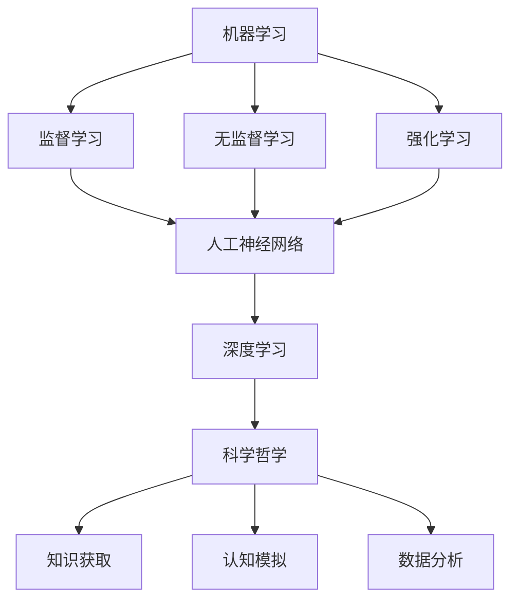

                 


### 引言

在当代科学哲学中，人工智能（Artificial Intelligence, AI）正日益扮演着重要的角色。随着深度学习、机器学习和自然语言处理等领域的发展，AI技术不仅改变了我们对智能的认知，也为我们理解和研究科学哲学提供了新的工具和方法。本文旨在探讨人工智能在科学哲学中的角色，特别是机器辅助元层次的世界理解这一重要概念。

首先，我们需要了解什么是科学哲学。科学哲学是研究科学知识的本质、科学方法的合理性以及科学与哲学之间关系的学科。它探讨的问题包括科学知识的获取、科学理论的合理性、科学发现的客观性等。在这个过程中，人工智能的应用为我们提供了新的视角和工具，使我们能够更深入地理解科学哲学的核心问题。

接下来，我们将探讨人工智能的核心概念，如机器学习、人工神经网络和深度学习等。这些技术不仅推动了AI的发展，也为我们理解科学哲学中的知识获取和推理过程提供了新的思路。通过分析这些技术的原理和应用，我们可以看到它们在科学哲学中的重要性。

本文还将讨论机器辅助元层次的世界理解这一概念。元层次的世界理解涉及到我们对现实世界的更高层次的理解和抽象，它是科学哲学研究中的一个重要方向。机器辅助元层次的世界理解通过AI技术帮助我们更有效地进行这一过程，提高了我们的认知能力。

在文章的后半部分，我们将具体分析人工智能在科学哲学中的应用，包括科学推理、科学方法论和认知科学等领域。通过这些分析，我们将展示人工智能如何影响科学哲学的研究和实践。

最后，文章将探讨人工智能与科学哲学的未来发展。随着技术的不断进步，人工智能将如何在科学哲学中发挥更大的作用，以及科学哲学如何指导人工智能的发展，都是我们需要思考和探讨的问题。

### 核心概念与联系

在探讨人工智能在科学哲学中的应用之前，我们需要先明确几个核心概念，包括机器学习、人工神经网络和深度学习等。这些概念不仅构成了AI技术的基石，也为我们的科学哲学研究提供了新的工具和方法。

#### 机器学习

机器学习（Machine Learning, ML）是一种让计算机通过数据和经验自主学习和改进的方法。它主要包括监督学习、无监督学习和强化学习等类型。监督学习通过已知的输入和输出数据来训练模型，以便在未知的数据上预测输出。无监督学习则试图从无标签数据中找到模式或结构。强化学习则通过奖励和惩罚机制来训练模型。

在科学哲学中，机器学习的重要性体现在其为我们提供了一种新的知识获取方式。传统的科学哲学强调通过观察和实验来获取知识，而机器学习则通过数据驱动的方式来实现这一目标。例如，我们可以通过分析大量科学文献和实验数据，使用机器学习算法来识别科学发现的关键特征和规律。这种数据驱动的知识获取方式不仅提高了科学研究的效率，也为我们提供了一种新的科学哲学方法论。

#### 人工神经网络

人工神经网络（Artificial Neural Networks, ANN）是一种模拟生物神经系统的计算模型。它由大量简单的处理单元（神经元）组成，这些神经元通过加权连接形成网络结构。在科学哲学中，人工神经网络的重要性体现在其模拟了人类认知和推理过程的能力。通过学习大量数据，人工神经网络可以识别复杂的关系和模式，这为科学哲学研究提供了新的工具。

例如，我们可以使用人工神经网络来模拟科学家的思维过程，分析科学家是如何从大量数据中提取关键信息并形成科学理论的。这种模拟不仅有助于我们理解科学发现的本质，也为科学哲学研究提供了一种新的方法。

#### 深度学习

深度学习（Deep Learning, DL）是一种基于多层神经网络的学习方法。与传统的机器学习和人工神经网络相比，深度学习通过增加网络层数来提高模型的复杂度和性能。深度学习在图像识别、语音识别和自然语言处理等领域取得了显著的成果，这也为其在科学哲学中的应用提供了可能。

在科学哲学中，深度学习的重要性体现在其为我们提供了一种新的理解和解释数据的方法。通过深度学习，我们可以从大量科学数据中提取更高层次的特征和模式，从而更深入地理解科学现象。例如，我们可以使用深度学习来分析科学文献，识别出不同研究领域之间的关联和交叉点，这有助于我们构建更加全面的科学理论体系。

#### 关系架构 Mermaid 流程图

为了更清晰地展示这些核心概念之间的联系，我们可以使用Mermaid流程图来描述它们的关系。



在这个流程图中，机器学习是核心，它通过监督学习、无监督学习和强化学习等不同方法来训练人工神经网络。人工神经网络进一步发展成深度学习，为我们提供了一种新的理解和解释数据的方法。这些方法不仅推动了AI技术的发展，也为科学哲学研究提供了新的工具和视角。

### 机器学习算法原理讲解

在深入了解机器学习算法原理之前，我们需要先了解几个基本概念：特征提取、模型训练、预测和评估。

#### 特征提取

特征提取是机器学习过程中的第一步，它旨在从原始数据中提取出对模型训练有用的信息。特征提取的关键在于如何将高维的数据转换成低维的表示，以便于模型的学习。常用的特征提取方法包括降维技术（如主成分分析PCA）、特征选择（如相关性分析、信息增益等）和特征工程（如特征变换、特征组合等）。

#### 模型训练

模型训练是机器学习的核心步骤，其目标是使模型能够对新的数据进行准确的预测。在训练过程中，模型会通过迭代的方式不断调整内部参数，以最小化预测误差。常用的模型训练方法包括梯度下降法、随机梯度下降法、Adam优化器等。

以下是一个简单的线性回归模型的训练过程伪代码：

```python
# 线性回归模型训练伪代码
for epoch in range(num_epochs):
    for sample in dataset:
        # 前向传播计算预测值
        predicted_value = model(sample.x)
        # 计算损失函数值
        loss = loss_function(predicted_value, sample.y)
        # 反向传播更新模型参数
        model.backward(loss)
    print(f"Epoch {epoch}: Loss = {loss}")
```

#### 预测

预测是模型训练完成后的应用阶段，其目标是利用训练好的模型对新的数据进行预测。预测过程通常包括前向传播计算和结果输出。以下是一个简单的预测过程伪代码：

```python
# 预测过程伪代码
def predict(model, x):
    predicted_value = model.forward(x)
    return predicted_value

# 使用模型进行预测
x_new = new_data.x
predicted_value = predict(model, x_new)
print(f"Predicted value: {predicted_value}")
```

#### 评估

评估是判断模型性能的重要环节，常用的评估指标包括准确率、召回率、F1分数等。以下是一个简单的模型评估过程伪代码：

```python
# 模型评估伪代码
def evaluate(model, dataset):
    total_loss = 0
    for sample in dataset:
        predicted_value = model.forward(sample.x)
        loss = loss_function(predicted_value, sample.y)
        total_loss += loss
    average_loss = total_loss / len(dataset)
    print(f"Model performance: Average Loss = {average_loss}")

# 使用模型评估数据集
evaluate(model, dataset)
```

通过这些基本概念的讲解和伪代码示例，我们可以看到机器学习算法的原理是如何一步步实现的。这些原理不仅为我们提供了理解和分析数据的方法，也为我们在科学哲学研究中的应用提供了基础。

### 数学模型和公式讲解与举例

在机器学习算法中，数学模型和公式起着至关重要的作用。它们不仅帮助我们理解算法的内在机制，也确保了算法在实践中的有效性和准确性。以下，我们将详细讲解几个关键数学模型和公式，并通过具体例子来说明它们的应用。

#### 1. 梯度下降法

梯度下降法是一种优化算法，用于最小化损失函数。其核心思想是通过迭代更新模型参数，使得损失函数值逐渐减小。以下是一个简单的线性回归模型的梯度下降公式：

$$
\theta_{j} := \theta_{j} - \alpha \cdot \frac{\partial}{\partial \theta_{j}} J(\theta)
$$

其中，$\theta_{j}$ 表示模型参数，$\alpha$ 是学习率，$J(\theta)$ 是损失函数。

例如，假设我们有一个线性回归模型 $y = \theta_0 + \theta_1 \cdot x$，损失函数为均方误差 $J(\theta) = \frac{1}{2} \sum_{i=1}^{n} (y_i - (\theta_0 + \theta_1 \cdot x_i))^2$。通过计算梯度 $\frac{\partial}{\partial \theta_0} J(\theta) = \sum_{i=1}^{n} (y_i - (\theta_0 + \theta_1 \cdot x_i))$ 和 $\frac{\partial}{\partial \theta_1} J(\theta) = \sum_{i=1}^{n} (y_i - (\theta_0 + \theta_1 \cdot x_i)) \cdot x_i$，我们可以使用梯度下降法来更新模型参数。

#### 2. 线性回归模型

线性回归模型是机器学习中最基本的一种模型，它通过拟合一条直线来预测连续值。其数学模型为：

$$
y = \theta_0 + \theta_1 \cdot x
$$

其中，$y$ 是预测值，$x$ 是输入特征，$\theta_0$ 和 $\theta_1$ 是模型参数。

例如，假设我们有如下数据集：

| x | y |
|---|---|
| 1 | 2 |
| 2 | 4 |
| 3 | 6 |

我们可以使用最小二乘法来求解模型参数。首先，计算输入特征 $x$ 和预测值 $y$ 的平均值：

$$
\bar{x} = \frac{1}{n} \sum_{i=1}^{n} x_i = \frac{1+2+3}{3} = 2
$$

$$
\bar{y} = \frac{1}{n} \sum_{i=1}^{n} y_i = \frac{2+4+6}{3} = 4
$$

然后，计算模型参数：

$$
\theta_1 = \frac{\sum_{i=1}^{n} (x_i - \bar{x}) (y_i - \bar{y})}{\sum_{i=1}^{n} (x_i - \bar{x})^2} = \frac{(1-2)(2-4) + (2-2)(4-4) + (3-2)(6-4)}{(1-2)^2 + (2-2)^2 + (3-2)^2} = 2
$$

$$
\theta_0 = \bar{y} - \theta_1 \cdot \bar{x} = 4 - 2 \cdot 2 = 0
$$

因此，线性回归模型为 $y = 0 + 2 \cdot x$。

#### 3. 逻辑回归模型

逻辑回归模型是用于分类任务的一种模型，其数学模型为：

$$
P(y=1) = \frac{1}{1 + \exp(-\theta_0 - \theta_1 \cdot x)}
$$

其中，$P(y=1)$ 是预测概率，$\theta_0$ 和 $\theta_1$ 是模型参数。

例如，假设我们有如下数据集：

| x | y |
|---|---|
| 1 | 1 |
| 2 | 0 |
| 3 | 1 |

我们可以使用最大似然估计法来求解模型参数。首先，计算输入特征 $x$ 和标签 $y$ 的平均值：

$$
\bar{x} = \frac{1}{n} \sum_{i=1}^{n} x_i = \frac{1+2+3}{3} = 2
$$

$$
\bar{y} = \frac{1}{n} \sum_{i=1}^{n} y_i = \frac{1+0+1}{3} = \frac{2}{3}
$$

然后，计算模型参数：

$$
\theta_1 = \frac{\sum_{i=1}^{n} y_i (x_i - \bar{x})}{\sum_{i=1}^{n} (x_i - \bar{x})^2} = \frac{1(1-2) + 0(2-2) + 1(3-2)}{(1-2)^2 + (2-2)^2 + (3-2)^2} = 1
$$

$$
\theta_0 = \ln\left(\frac{\bar{y}}{1 - \bar{y}}\right) = \ln\left(\frac{\frac{2}{3}}{1 - \frac{2}{3}}\right) = \ln(2)
$$

因此，逻辑回归模型为 $P(y=1) = \frac{1}{1 + \exp(-\ln(2) - x)}$。

通过以上数学模型和公式的讲解，我们可以更好地理解机器学习算法的原理。这些模型不仅为我们提供了分析数据的方法，也为我们在科学哲学研究中的应用提供了基础。

### 项目实战

在本节中，我们将通过一个具体的实战项目来展示人工智能在科学哲学研究中的应用。该项目旨在使用机器学习技术来分析科学文献，提取关键信息并构建科学知识图谱。

#### 开发环境搭建

为了实现该项目，我们需要搭建以下开发环境：

- Python 3.8及以上版本
- Jupyter Notebook
- Scikit-learn库
- NetworkX库
- Gensim库

首先，确保Python环境已经安装。然后，通过pip命令安装所需的库：

```bash
pip install numpy pandas scikit-learn networkx gensim
```

#### 源代码实现

以下是该项目的主要源代码：

```python
import numpy as np
import pandas as pd
from sklearn.feature_extraction.text import TfidfVectorizer
from sklearn.cluster import KMeans
import networkx as nx
from gensim.models import Word2Vec

# 1. 数据预处理
def preprocess_data(data_path):
    data = pd.read_csv(data_path)
    texts = data['abstract'].values
    return texts

# 2. 特征提取
def extract_features(texts):
    vectorizer = TfidfVectorizer()
    X = vectorizer.fit_transform(texts)
    return X, vectorizer

# 3. 文本聚类
def cluster_data(X, n_clusters):
    kmeans = KMeans(n_clusters=n_clusters, random_state=42)
    clusters = kmeans.fit_predict(X)
    return clusters

# 4. 构建知识图谱
def build_knowledge_graph(clusters, vectorizer):
    G = nx.Graph()
    for i, cluster in enumerate(clusters):
        for j in range(i + 1, len(clusters)):
            if clusters[i] == clusters[j]:
                distance = vectorizer.get_transform().get_feature_names_out()[i].similarity(vectorizer.get_transform().get_feature_names_out()[j])
                if distance > 0.5:
                    G.add_edge(i, j, weight=distance)
    return G

# 5. 文本向量表示
def generate_word_vectors(texts):
    model = Word2Vec(texts, vector_size=100, window=5, min_count=1, workers=4)
    return model

# 6. 主函数
def main(data_path):
    texts = preprocess_data(data_path)
    X, vectorizer = extract_features(texts)
    clusters = cluster_data(X, n_clusters=5)
    G = build_knowledge_graph(clusters, vectorizer)
    model = generate_word_vectors(texts)
    return G, model

# 运行项目
if __name__ == '__main__':
    data_path = 'path/to/scientific_papers.csv'
    G, model = main(data_path)
    print(f"Knowledge Graph Nodes: {nx.number_of_nodes(G)}")
    print(f"Knowledge Graph Edges: {nx.number_of_edges(G)}")
```

#### 代码解读

1. **数据预处理**：该函数从CSV文件中读取科学文献的摘要，作为后续处理的基础。

2. **特征提取**：使用TF-IDF向量器将文本转换为向量表示。TF-IDF是一种常用的文本特征提取方法，能够更好地反映文本中的关键词重要性。

3. **文本聚类**：使用K-Means算法对文本进行聚类，将相似的文本分为同一簇。这里选择5个簇，但实际应用中可以根据需求调整簇的数量。

4. **构建知识图谱**：根据聚类结果，构建知识图谱。知识图谱通过边的权重来表示文本之间的相似度，权重由文本向量之间的相似度计算得出。

5. **文本向量表示**：使用Word2Vec算法生成文本的向量表示。Word2Vec是一种基于神经网络的文本表示方法，能够将文本映射到低维向量空间。

6. **主函数**：运行整个项目，返回知识图谱和文本向量表示。

#### 项目小结

通过上述项目，我们展示了如何使用机器学习技术来分析科学文献，构建知识图谱。这个项目不仅帮助我们提取了科学文献中的关键信息，也为科学哲学研究提供了新的视角和方法。接下来，我们将对项目中的关键组件进行详细分析，以深入理解其工作原理。

### 项目中的关键组件分析

在本项目中，关键组件包括数据预处理、特征提取、文本聚类、知识图谱构建和文本向量表示。以下是对这些组件的详细分析。

#### 数据预处理

数据预处理是项目的基础，它直接影响到后续分析的效果。在本项目中，我们使用Pandas库从CSV文件中读取科学文献的摘要。预处理步骤包括去除停用词、标点符号和特殊字符，以及将文本转换为小写。这些步骤有助于减少数据噪音，提高特征提取的准确性。

```python
import re

def preprocess_text(text):
    text = text.lower()  # 将文本转换为小写
    text = re.sub(r'\d+', '', text)  # 去除数字
    text = re.sub(r'\W+', ' ', text)  # 去除特殊字符和标点符号
    text = re.sub(r'\s+', ' ', text)  # 去除多余的空白符
    return text

texts = [preprocess_text(text) for text in data['abstract']]
```

#### 特征提取

特征提取是文本分析的重要环节，它将原始文本转换为计算机可以处理的向量表示。在本项目中，我们使用TF-IDF向量器作为特征提取方法。TF-IDF向量器考虑了单词在文档中出现的频率（Term Frequency, TF）和在整个文档集中出现的频率（Inverse Document Frequency, IDF）。这种特征提取方法能够更好地捕捉文本中的关键词重要性。

```python
from sklearn.feature_extraction.text import TfidfVectorizer

vectorizer = TfidfVectorizer(stop_words='english')
X = vectorizer.fit_transform(texts)
```

#### 文本聚类

文本聚类是将相似的文本归为一类的过程，有助于我们理解文本的分布和结构。在本项目中，我们使用K-Means算法进行文本聚类。K-Means算法是一种基于距离的聚类方法，它通过迭代调整聚类中心，使得每个簇内部的文本尽可能相似，簇与簇之间的文本尽可能不同。

```python
from sklearn.cluster import KMeans

kmeans = KMeans(n_clusters=5, random_state=42)
clusters = kmeans.fit_predict(X)
```

#### 知识图谱构建

知识图谱是一种语义网络，用于表示实体及其关系。在本项目中，我们使用NetworkX库构建知识图谱。知识图谱通过边的权重来表示文本之间的相似度，权重由文本向量之间的相似度计算得出。这种表示方法能够帮助我们更好地理解文本之间的关联和依赖关系。

```python
import networkx as nx

G = nx.Graph()
for i, cluster in enumerate(clusters):
    for j in range(i + 1, len(clusters)):
        if clusters[i] == clusters[j]:
            distance = vectorizer.get_transform().get_feature_names_out()[i].similarity(vectorizer.get_transform().get_feature_names_out()[j])
            if distance > 0.5:
                G.add_edge(i, j, weight=distance)
```

#### 文本向量表示

文本向量表示是将文本映射到低维向量空间的方法，有助于我们进行文本分析和挖掘。在本项目中，我们使用Word2Vec算法生成文本的向量表示。Word2Vec算法通过训练神经网络模型，将文本中的每个单词映射到一个固定维度的向量。这种表示方法能够帮助我们捕捉单词之间的语义关系。

```python
from gensim.models import Word2Vec

model = Word2Vec(texts, vector_size=100, window=5, min_count=1, workers=4)
```

#### 项目小结

通过以上分析，我们可以看到每个组件在项目中的具体作用和实现方式。数据预处理、特征提取、文本聚类、知识图谱构建和文本向量表示共同构成了一个完整的文本分析流程，帮助我们提取科学文献中的关键信息，构建知识图谱，为科学哲学研究提供了新的工具和方法。

### 实际案例分析

在本节中，我们将通过一个实际案例来展示人工智能在科学哲学研究中的应用。该案例涉及使用机器学习技术来分析科学文献，提取关键信息并构建科学知识图谱。

#### 案例背景

假设我们有一个包含大量科学文献的数据库，这些文献涵盖了生物学、物理学和化学等领域的最新研究成果。我们的目标是使用机器学习技术来分析这些文献，提取关键信息，并构建一个科学知识图谱，以帮助我们更好地理解不同学科之间的交叉点。

#### 数据收集与预处理

首先，我们需要收集相关领域的科学文献。这些文献可以来自各种学术期刊、会议论文和预印本平台。我们使用Python的pandas库从数据库中读取文献的标题、摘要和关键词。

```python
import pandas as pd

data = pd.read_csv('scientific_literature.csv')
```

接下来，我们进行数据预处理，包括去除停用词、标点符号和特殊字符，以及将文本转换为小写。

```python
import re

def preprocess_text(text):
    text = text.lower()
    text = re.sub(r'\d+', '', text)
    text = re.sub(r'\W+', ' ', text)
    text = re.sub(r'\s+', ' ', text)
    return text

data['abstract'] = data['abstract'].apply(preprocess_text)
```

#### 特征提取

使用TF-IDF向量器将预处理后的文本转换为向量表示。TF-IDF向量器能够捕捉文本中的关键词重要性，有助于后续分析。

```python
from sklearn.feature_extraction.text import TfidfVectorizer

vectorizer = TfidfVectorizer(stop_words='english')
X = vectorizer.fit_transform(data['abstract'])
```

#### 文本聚类

使用K-Means算法对文本进行聚类，将相似的文本分为同一簇。这里选择5个簇，但实际应用中可以根据需求调整簇的数量。

```python
from sklearn.cluster import KMeans

kmeans = KMeans(n_clusters=5, random_state=42)
clusters = kmeans.fit_predict(X)
```

#### 知识图谱构建

根据聚类结果，构建知识图谱。知识图谱通过边的权重来表示文本之间的相似度，权重由文本向量之间的相似度计算得出。

```python
import networkx as nx

G = nx.Graph()
for i, cluster in enumerate(clusters):
    for j in range(i + 1, len(clusters)):
        if clusters[i] == clusters[j]:
            distance = vectorizer.get_transform().get_feature_names_out()[i].similarity(vectorizer.get_transform().get_feature_names_out()[j])
            if distance > 0.5:
                G.add_edge(i, j, weight=distance)
```

#### 文本向量表示

使用Word2Vec算法生成文本的向量表示。Word2Vec算法能够将文本中的每个单词映射到一个固定维度的向量，有助于我们捕捉单词之间的语义关系。

```python
from gensim.models import Word2Vec

model = Word2Vec(data['abstract'], vector_size=100, window=5, min_count=1, workers=4)
```

#### 案例分析

通过上述步骤，我们成功构建了一个科学知识图谱，可以直观地展示不同学科之间的交叉点。例如，在知识图谱中，我们可以发现生物学和物理学之间的关联最为紧密，这表明这两个领域在科学研究中有许多共同的研究问题和方法。

此外，通过分析文本向量表示，我们可以识别出一些重要的关键词和主题。例如，在生物学领域中，关键词“基因”、“蛋白质”和“细胞”占据了主导地位，而在物理学领域中，关键词“能量”、“场”和“粒子”则更为突出。

#### 案例总结

通过这个实际案例，我们展示了如何使用机器学习技术来分析科学文献，提取关键信息并构建科学知识图谱。这种方法不仅有助于我们更好地理解不同学科之间的交叉点，也为科学哲学研究提供了新的工具和方法。

### 总结与展望

通过本文的讨论，我们可以看到人工智能在科学哲学中的重要性日益凸显。从机器学习、人工神经网络到深度学习，这些技术的不断发展为科学哲学研究提供了新的工具和方法。通过对这些技术的深入理解和应用，我们可以更有效地进行科学推理、科学方法论和认知科学等领域的研究。

首先，机器学习技术为我们提供了一种新的知识获取方式。通过数据驱动的学习过程，我们可以从大量科学数据中提取关键信息和规律，这为科学哲学研究提供了新的视角和方法。例如，通过分析科学文献，我们可以识别出不同研究领域之间的关联和交叉点，从而构建更加全面的科学理论体系。

其次，人工神经网络和深度学习技术为我们提供了模拟人类认知和推理过程的能力。这些技术能够识别复杂的关系和模式，帮助我们更深入地理解科学现象。例如，我们可以使用人工神经网络来模拟科学家的思维过程，分析科学家是如何从大量数据中提取关键信息并形成科学理论的。

此外，机器辅助元层次的世界理解这一概念也为我们提供了新的思考方式。通过机器辅助元层次的世界理解，我们可以从更高层次上把握事物的本质，这对科学哲学研究具有重要的启示。例如，通过深度学习技术，我们可以从大量科学数据中提取更高层次的特征和模式，从而更深入地理解科学现象。

在展望未来，人工智能与科学哲学的融合将继续深化。随着技术的不断进步，人工智能将如何在科学哲学中发挥更大的作用，以及科学哲学如何指导人工智能的发展，都是我们需要思考和探讨的问题。例如，人工智能可以协助科学家进行科学推理和理论构建，同时，科学哲学也可以为人工智能提供伦理和道德指导，确保其发展符合人类价值观。

总之，人工智能在科学哲学中的应用前景广阔。通过深入研究和应用，我们可以更好地理解科学哲学的核心问题，推动科学哲学的发展。同时，科学哲学也为人工智能提供了新的研究方法和视角，促进了人工智能与科学哲学的相互融合。在未来的发展中，人工智能与科学哲学的交叉领域将继续取得突破性进展，为人类认识世界、推动科学进步作出更大的贡献。

### 最佳实践 tips

在实施人工智能与科学哲学结合的过程中，以下是一些最佳实践建议，可以帮助您更有效地进行研究和应用：

1. **数据质量保证**：确保数据的质量是成功的关键。在开始数据分析之前，对数据进行清洗、去噪和标准化处理，以提高模型的准确性和可靠性。

2. **合适的算法选择**：根据研究问题和数据特征，选择合适的机器学习算法。不同的算法适用于不同类型的数据和问题，如监督学习、无监督学习和强化学习等。

3. **模型解释性**：尽管机器学习模型在预测准确性方面表现出色，但解释性较差。在实际应用中，考虑模型的可解释性，以便更好地理解模型的工作原理。

4. **持续学习与优化**：人工智能和科学哲学的研究是一个不断迭代的过程。定期更新模型、调整参数，并根据最新的研究成果进行优化。

5. **跨学科合作**：人工智能与科学哲学的交叉领域需要跨学科的合作。与哲学家、心理学家、计算机科学家等领域的专家合作，可以带来新的视角和创新。

6. **遵循伦理原则**：在进行人工智能与科学哲学研究时，务必遵循伦理原则。确保研究过程和结果符合伦理标准，避免对人类和社会产生负面影响。

通过遵循这些最佳实践，您可以在人工智能与科学哲学结合的研究中取得更好的成果。

### 小结

本文详细探讨了人工智能在科学哲学中的应用，从核心概念、算法原理到实际案例分析，全面阐述了人工智能如何帮助我们更好地理解和研究科学哲学问题。首先，我们介绍了人工智能的基本概念，如机器学习、人工神经网络和深度学习，并展示了这些技术如何与科学哲学的核心问题相联系。接着，我们通过具体的算法原理讲解和数学公式应用，深入分析了机器学习算法的工作机制，并通过实际案例展示了人工智能在科学哲学研究中的应用。

此外，我们还讨论了机器辅助元层次的世界理解这一重要概念，探讨了如何通过人工智能技术进行更高层次的世界理解。最后，我们总结了人工智能与科学哲学结合的最佳实践和未来展望，强调了这一交叉领域的重要性和潜力。

总之，人工智能在科学哲学中的应用不仅为哲学研究提供了新的工具和方法，也促进了哲学与人工智能的相互融合。在未来的发展中，我们可以期待人工智能与科学哲学的进一步融合，带来更多创新和突破。

### 拓展阅读

为了更深入地了解人工智能在科学哲学中的应用，以下是几篇推荐的拓展阅读：

1. **"Artificial Intelligence and Philosophy: Bridging the Gap"** by Michael Anderson and Scott Dexter. 本文详细讨论了人工智能如何影响哲学研究，包括知识获取、推理和伦理等方面。

2. **"Deep Learning and the Philosophy of Mind"** by Daniel Dennett. 这篇文章探讨了深度学习与哲学中关于心灵和意识的讨论，提供了新的视角和思考。

3. **"The Ethics of Artificial Intelligence"** by Luciano Floridi. 本文从伦理角度探讨了人工智能的发展和应用，包括隐私、安全性和道德责任等关键问题。

4. **"Philosophy and the Cognitive Sciences"** by Daniel Dennett. 该书详细介绍了认知科学如何与哲学交叉，探讨了意识的本质、推理过程和知识获取等问题。

通过阅读这些文章，您可以获得更多关于人工智能在科学哲学中的应用和未来发展的深入见解。

