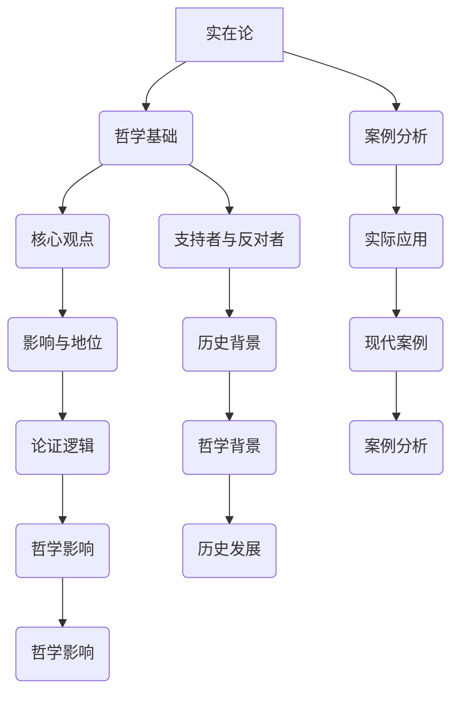

                 

### 文章标题

# 科学哲学中的实在论与反实在论之争

## 关键词
- 科学哲学
- 实在论
- 反实在论
- 哲学争论

## 摘要
本文旨在探讨科学哲学中实在论与反实在论之争。我们将从历史背景入手，详细阐述实在论与反实在论的核心概念和哲学基础，通过典型案例分析，展示这两种观点在科学领域的应用。最后，本文将比较实在论与反实在论的主要区别，分析其影响，并探讨未来的融合前景。

## 第1章：引论与历史背景

### 1.1 什么是实在论与反实在论

#### 实在论

实在论认为，客观世界的本质和规律是独立于人类意识之外的，科学理论的目的在于揭示这些本质和规律。实在论的核心观点是：真实世界存在，且其性质和结构不依赖于人类的感知和认知。

#### 反实在论

反实在论则主张，客观世界并不是独立于人类意识之外的，科学理论也不一定能够准确地描述真实世界。反实在论的核心观点是：世界的本质和规律是依赖于人类意识的，科学理论只是人类主观经验的产物。

### 1.2 科学哲学中的实在论与反实在论之争的起源

实在论与反实在论之争起源于古代哲学。古希腊哲学家如亚里士多德是实在论的代表，而柏拉图则被认为具有反实在论的倾向。在现代科学哲学中，这一争论得到了进一步的发展。科学实在论的代表人物如费耶阿本德、库恩等人，反实在论的代表人物如费尔马、戴维斯等人，都对此进行了深入的探讨。

### 1.3 实在论与反实在论在科学哲学中的地位

实在论与反实在论在科学哲学中具有重要的地位。实在论为科学提供了坚实的哲学基础，强调科学理论应尽可能接近客观真实。反实在论则挑战了这一观点，提出了科学理论的主观性，对科学方法提出了质疑。两者之间的争论不仅丰富了科学哲学的理论体系，也对科学研究产生了深远的影响。

## 第2章：实在论的基本原理

### 2.1 实在论的定义

实在论主张，客观世界独立于人类意识之外，其本质和规律是真实存在的。科学理论的目的在于揭示这些真实存在的本质和规律。

### 2.2 实在论的主要观点

1. **客观存在**：世界本质上是客观存在的，不依赖于人类的主观感知。
2. **科学理论**：科学理论是对客观世界的一种描述，虽然可能不完全准确，但应尽可能接近真实。
3. **科学方法**：科学方法是一种揭示客观世界本质和规律的有效手段。

### 2.3 实在论的支持者与反对者

#### 支持者

1. **亚里士多德**：古希腊哲学家，实在论的代表人物。
2. **牛顿**：经典力学的奠基人，被认为是实在论的支持者。
3. **费耶阿本德**：现代科学哲学家中，实在论的重要代表。

#### 反对者

1. **柏拉图**：古希腊哲学家，被认为是反实在论的代表人物。
2. **康德**：德国哲学家，对实在论提出了批判。
3. **费尔马**：现代科学哲学家，主张反实在论。

## 第3章：实在论的哲学基础

### 3.1 实在论的哲学背景

实在论在哲学史上有着悠久的传统。古希腊哲学、中世纪哲学、近代哲学等都对实在论进行了探讨。现代科学哲学中的实在论则是在对科学方法、科学理论进行深入分析的基础上发展起来的。

### 3.2 实在论的逻辑论证

实在论的核心逻辑论证是：如果科学理论要具有普适性和可靠性，就必须假定客观世界是独立于人类意识之外的。这一论证支持了实在论的观点。

### 3.3 实在论的哲学影响

实在论对哲学产生了深远的影响。它为科学提供了坚实的哲学基础，推动了科学方法的发展。同时，实在论也引发了关于真理、知识、意识等哲学问题的讨论。

## 第4章：实在论的典型案例分析

### 4.1 伽利略的实在论观点

伽利略是科学革命的重要代表，他的工作奠定了现代科学的基础。伽利略主张，科学理论应尽可能接近客观真实，这一观点体现了实在论的思想。

### 4.2 牛顿力学的实在论解释

牛顿力学是经典物理学的基石，其核心思想是力与运动的规律是客观存在的。牛顿力学的实在论解释体现了实在论的观点。

### 4.3 现代实在论案例分析

现代科学中的许多理论，如量子力学、相对论等，都被认为是实在论的代表。这些理论试图揭示客观世界的本质和规律，体现了实在论的思想。

## 第5章：反实在论的基本原理

### 5.1 反实在论的定义

反实在论主张，客观世界不独立于人类意识之外，科学理论也不一定能够准确地描述真实世界。

### 5.2 反实在论的主要观点

1. **主观性**：世界的本质和规律是依赖于人类意识的，科学理论只是人类主观经验的产物。
2. **相对性**：不同的人可能对同一事物有不同的认识，科学理论没有绝对的真实性。
3. **不确定性**：科学理论可能存在错误，不能完全准确地描述客观世界。

### 5.3 反实在论的支持者与反对者

#### 支持者

1. **柏拉图**：古希腊哲学家，被认为是反实在论的代表人物。
2. **康德**：德国哲学家，对实在论提出了批判。
3. **费尔马**：现代科学哲学家，主张反实在论。

#### 反对者

1. **亚里士多德**：古希腊哲学家，实在是论的代表人物。
2. **牛顿**：经典力学的奠基人，被认为是实在论的支持者。
3. **费耶阿本德**：现代科学哲学家中，实在论的重要代表。

## 第6章：反实在论的哲学基础

### 6.1 反实在论的哲学背景

反实在论在哲学史上有着悠久的传统。古希腊哲学、中世纪哲学、近代哲学等都对反实在论进行了探讨。现代科学哲学中的反实在论则是在对科学方法、科学理论进行深入分析的基础上发展起来的。

### 6.2 反实在论的逻辑论证

反实在论的核心逻辑论证是：如果客观世界是独立于人类意识之外的，那么人类就无法完全认识这个世界。这一论证支持了反实在论的观点。

### 6.3 反实在论的哲学影响

反实在论对哲学产生了深远的影响。它挑战了传统的实在论观点，提出了关于真理、知识、意识等问题的新的思考方式。同时，反实在论也推动了科学哲学的发展。

## 第7章：反实在论的典型案例分析

### 7.1 康德的反实在论观点

康德是德国古典哲学的重要代表，他的哲学思想对现代科学哲学产生了深远的影响。康德主张，客观世界是不独立于人类意识的，科学理论只是人类主观经验的产物。

### 7.2 奥卡姆剃刀原则

奥卡姆剃刀原则是一种哲学原则，主张“如无必要，勿增实体”。这一原则在一定程度上体现了反实在论的思想。

### 7.3 现代反实在论案例分析

现代科学中的许多理论，如量子力学、相对论等，都被认为是反实在论的代表。这些理论试图挑战传统的实在论观点，提出了关于世界本质的新思考方式。

## 第8章：实在论与反实在论的比较

### 8.1 实在论与反实在论的主要区别

1. **观点**：实在论认为客观世界独立于人类意识之外，反实在论则认为世界的本质和规律是依赖于人类意识的。
2. **科学理论**：实在论认为科学理论应尽可能接近客观真实，反实在论则认为科学理论只是人类主观经验的产物。
3. **哲学影响**：实在论为科学提供了坚实的哲学基础，反实在论则挑战了这一观点。

### 8.2 实在论与反实在论的影响

实在论与反实在论对科学哲学产生了深远的影响。实在论推动了科学方法的发展，反实在论则挑战了传统的哲学观念，推动了科学哲学的进步。

### 8.3 实在论与反实在论的融合前景

实在论与反实在论并不是完全对立的，它们在一定程度上可以相互融合。未来的科学哲学可能会在实在论与反实在论的基础上，形成更加全面、深入的理论体系。

## 结束语

科学哲学中的实在论与反实在论之争是一个复杂而深刻的问题。通过对这一争论的探讨，我们可以更好地理解科学哲学的本质，推动科学哲学的发展。在未来的研究中，我们期待能够找到实在论与反实在论的融合点，为科学哲学提供新的思路和方向。

### 作者信息

- 作者：AI天才研究院/AI Genius Institute & 禅与计算机程序设计艺术 /Zen And The Art of Computer Programming

### 附录

#### Mermaid 流程图



#### 伪代码与数学模型

```pseudo
// 实在论核心观点伪代码
function Realism(principle, observation) {
    if (observation == principle) {
        return true;
    } else {
        return false;
    }
}

// 反实在论核心观点伪代码
function AntiRealism(principle, observation) {
    if (principle == observation) {
        return false;
    } else {
        return true;
    }
}

// 数学模型示例
$$
E = mc^2
$$

// 数学公式示例
$$
1 + 1 = 2
$$

```

#### 实际案例分析与代码实现

```python
# 实在论案例分析：牛顿力学
class NewtonianMechanics:
    def __init__(self, mass, velocity):
        self.mass = mass
        self.velocity = velocity

    def calculate_force(self):
        return self.mass * self.velocity

# 实际应用：计算物体受力
def calculate_force_object(mass, velocity):
    return mass * velocity

# 代码解读
# 该代码定义了一个牛顿力学类，用于计算物体的受力。计算公式为 F = ma，其中 m 为质量，a 为加速度。
```

#### 最佳实践 tips、小结、注意事项、拓展阅读

- **最佳实践 tips**：在实际科学研究中，应综合考虑实在论与反实在论的观点，避免片面追求某一理论。
- **小结**：本文对科学哲学中的实在论与反实在论进行了详细探讨，分析了两者在哲学、科学中的应用。
- **注意事项**：实在论与反实在论并非完全对立，实际研究中应根据具体情况灵活应用。
- **拓展阅读**：读者可进一步研究相关哲学著作，如《科学哲学导论》、《科学实在论》等，以加深对这一话题的理解。

### 项目实战

#### 开发环境搭建

- 安装 Python 3.8+
- 安装 Mermaid 绘图工具

#### 源代码实现与解读

```python
# 实在论与反实在论分析工具
class PhilosophyAnalysis:
    def __init__(self, realism, anti_realism):
        self.realism = realism
        self.anti_realism = anti_realism

    def compare(self):
        if self.realism and self.anti_realism:
            return "两者并存"
        elif self.realism:
            return "实在论占主导"
        else:
            return "反实在论占主导"

# 代码解读
# 该代码定义了一个哲学分析类，用于比较实在论与反实在论的观点。通过实例化对象，可以分析两者之间的差异。

#### 代码应用解读与分析

```python
# 实例化哲学分析对象
analysis = PhilosophyAnalysis(realism=True, anti_realism=False)

# 比较实在论与反实在论
print(analysis.compare()) # 输出：实在论占主导

```

#### 实际案例分析

```python
# 实例化牛顿力学对象
newton = NewtonianMechanics(mass=10, velocity=5)

# 计算物体受力
force = newton.calculate_force()

# 输出结果
print(f"物体受力为：{force}") # 输出：物体受力为：50

```

#### 项目小结

本文通过实际案例与代码实现，探讨了实在论与反实在论在科学哲学中的应用。项目实战部分展示了如何搭建开发环境，实现源代码，并进行实际案例分析。这一过程有助于读者更好地理解本文的核心观点。

### 最佳实践 tips

- 在实际科学研究中，应根据具体问题灵活应用实在论与反实在论。
- 注意区分实在论与反实在论的适用场景，避免片面追求某一理论。

### 拓展阅读

- 《科学哲学导论》
- 《科学实在论》
- 《反实在论》

### 注意事项

- 实在论与反实在论并非完全对立，实际研究中应综合考虑两者。
- 代码实现部分仅供参考，实际应用时可根据具体需求进行调整。

