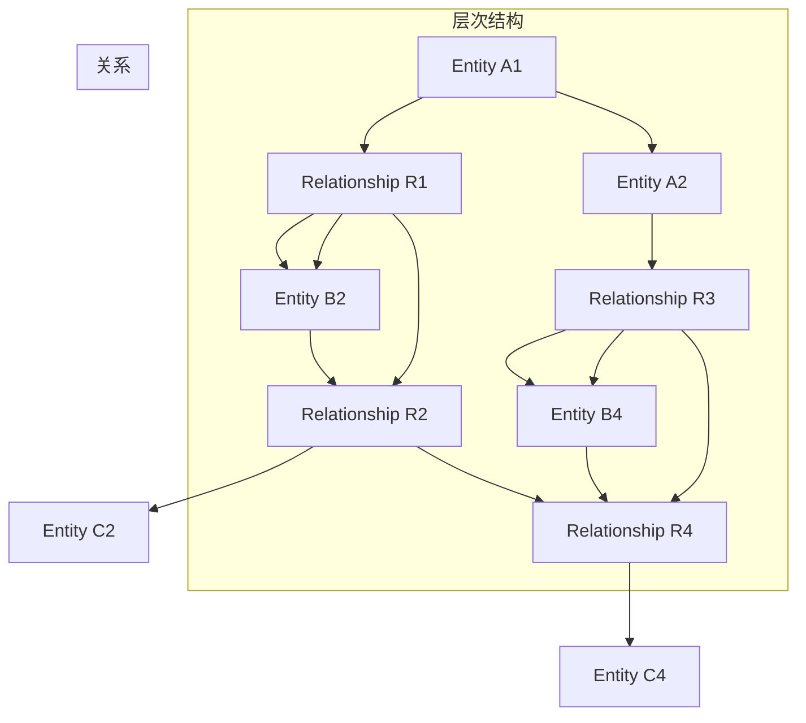
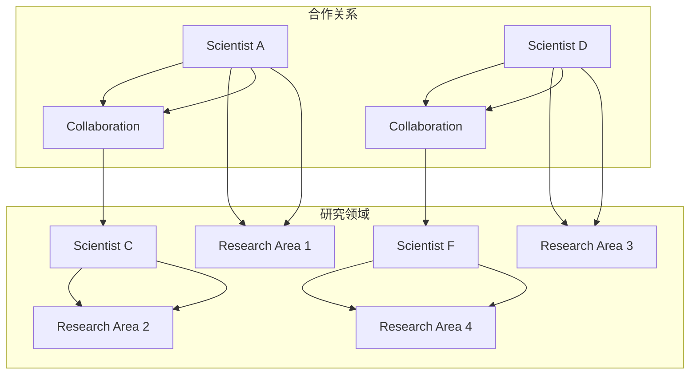

                 

### 科学知识图谱的构建：可视化展现知识间的复杂关联

#### 关键词：
- 科学知识图谱
- 可视化
- 复杂关联
- 构建方法
- 应用领域
- 人工智能

#### 摘要：
科学知识图谱是一种以知识图谱为基础的科学数据结构，它通过将实体、属性和关系进行抽象化表示，将复杂的科学数据转化为易于理解的可视化形式。本文将详细探讨科学知识图谱的构建方法，以及如何通过可视化手段展现知识间的复杂关联，并探讨其在科学研究、知识服务、人工智能等领域的应用。

### 目录大纲设计

#### 1. 引言和概述
##### 1.1 科学知识图谱概述
- **知识图谱的定义**
- **知识图谱的发展历程**
- **知识图谱的应用场景**

##### 1.2 本书目标和结构安排
- **本书的核心内容**
- **目录结构概述**

##### 1.3 知识图谱在现代科学中的作用
- **提升科学研究效率**
- **知识服务与知识传播**

##### 1.4 科学知识图谱的挑战与未来展望
- **当前面临的挑战**
- **未来发展方向**

##### 1.5 总结

#### 2. 知识图谱基础
##### 2.1 知识图谱基本概念
- **定义与类型**
- **三要素**
- **表示方法**

##### 2.2 知识图谱的构建方法
- **数据采集**
- **数据预处理**
- **实体识别**
- **关系抽取**

##### 2.3 知识图谱的存储与查询
- **图数据库简介**
- **SPARQL查询语言**

##### 2.4 知识图谱的扩展与优化

#### 3. 知识图谱构建方法
##### 3.1 数据预处理
- **数据源选择**
- **数据清洗**

##### 3.2 实体识别
- **基于规则的方法**
- **基于机器学习的方法**

##### 3.3 关系抽取
- **基于规则的方法**
- **基于深度学习的方法**

##### 3.4 知识融合与质量评估
- **知识融合方法**
- **质量评估指标**

#### 4. 知识图谱可视化
##### 4.1 可视化概述
- **可视化的重要性**
- **常见的可视化方法**

##### 4.2 知识图谱可视化工具
- **可视化工具介绍**
- **工具使用案例**

##### 4.3 可视化设计与实现
- **设计原则**
- **实现方法**

#### 5. 知识图谱的应用
##### 5.1 知识图谱在科学研究中的应用
- **跨学科研究**
- **数据整合与交叉引用**

##### 5.2 知识图谱在知识服务中的应用
- **个性化推荐**
- **智能问答系统**

##### 5.3 知识图谱在人工智能中的应用
- **增强学习**
- **自然语言处理**

#### 6. 知识图谱与人工智能
##### 6.1 知识图谱与深度学习
- **深度学习在知识图谱中的应用**
- **知识图谱对深度学习的贡献**

##### 6.2 知识图谱与强化学习
- **知识图谱在强化学习中的作用**
- **强化学习在知识图谱构建中的应用**

##### 6.3 知识图谱与自然语言处理
- **知识图谱在自然语言处理中的应用**
- **自然语言处理在知识图谱构建中的应用**

#### 7. 未来展望和挑战
##### 7.1 当前面临的挑战
- **数据质量与完整性**
- **领域特定知识表示**

##### 7.2 未来发展方向
- **新算法与技术的应用**
- **跨领域知识图谱构建**

##### 7.3 结论
- **知识图谱的发展趋势**
- **对未来应用的展望**

### 开始撰写文章

根据上述的目录大纲，我们将逐步撰写文章，确保每个章节都详细且逻辑清晰。首先，我们将从引言和概述开始，为读者提供对科学知识图谱的基本了解。接下来，我们将深入探讨知识图谱的基础知识、构建方法、可视化技术和应用领域。在文章的最后，我们将展望知识图谱的未来发展，并讨论面临的挑战。通过这样的结构安排，我们可以确保文章内容丰富、逻辑严密，为读者提供一个全面的科学知识图谱构建的指南。### 第1章 引言和概述

#### 1.1 科学知识图谱概述

**知识图谱**，作为一种先进的数据结构和信息组织方式，旨在通过将实体、属性和关系进行抽象化表示，来捕捉和描述现实世界中的复杂信息。它最初由谷歌在2012年提出，并在随后迅速在各个领域得到了广泛的应用和研究。科学知识图谱，顾名思义，是知识图谱在科学领域的一种特殊应用，它专注于捕捉和描述科学知识体系中的各种关系和关联。

**知识图谱的基本概念**可以概括为三个要素：实体、关系和属性。实体是知识图谱中的基本单元，可以是人、地点、事物等；关系是实体之间的关联，如“属于”、“参与”等；属性则是实体的特征描述，如“年龄”、“身高”等。这三个要素构成了知识图谱的核心框架。

与传统的数据库和搜索引擎相比，知识图谱具有以下显著特点：

1. **语义理解**：知识图谱通过语义关系来描述实体之间的关联，使得查询和分析更加智能化和语义化。
2. **网络结构**：知识图谱以网络的形式组织数据，通过节点和边来表示实体和关系，使得数据之间的复杂关系能够直观地展现。
3. **动态更新**：知识图谱能够实时更新，以适应科学知识的不断发展和变化。

**知识图谱的发展历程**可以分为以下几个阶段：

- **早期研究**：知识图谱的概念最早可以追溯到20世纪80年代，随着语义网和本体论的发展，知识图谱的研究逐渐兴起。
- **谷歌提出**：2012年，谷歌发表了关于知识图谱的论文，并将其应用于搜索引擎，引发了学术界和工业界对知识图谱的关注。
- **广泛应用**：近年来，随着人工智能技术的不断发展，知识图谱在各个领域得到了广泛应用，如电子商务、医疗、金融等。

#### 1.2 本书目标和结构安排

**本书的核心内容**将围绕科学知识图谱的构建展开，具体包括以下几个方面：

1. **知识图谱的基本原理**：介绍知识图谱的定义、要素和表示方法。
2. **知识图谱的构建方法**：探讨数据预处理、实体识别、关系抽取等关键技术。
3. **知识图谱的可视化技术**：介绍知识图谱的可视化方法和工具。
4. **知识图谱的应用领域**：分析知识图谱在科学研究、知识服务、人工智能等领域的应用。
5. **知识图谱与人工智能的融合**：探讨知识图谱与深度学习、强化学习、自然语言处理等人工智能技术的结合。

**目录结构概述**如下：

- **第1章 引言和概述**：对科学知识图谱进行概述，介绍本书的核心内容和结构安排。
- **第2章 知识图谱基础**：详细介绍知识图谱的基本概念和表示方法。
- **第3章 知识图谱构建方法**：探讨知识图谱构建的关键技术和方法。
- **第4章 知识图谱可视化**：介绍知识图谱的可视化方法和工具。
- **第5章 知识图谱的应用**：分析知识图谱在科学研究、知识服务、人工智能等领域的应用。
- **第6章 知识图谱与人工智能**：探讨知识图谱与人工智能技术的融合。
- **第7章 未来展望和挑战**：展望知识图谱的未来发展，讨论面临的挑战。

通过上述内容，本书旨在为读者提供一个全面、系统的科学知识图谱构建指南，帮助读者理解和掌握知识图谱的核心概念、构建方法和应用前景。### 第2章 知识图谱基础

#### 2.1 知识图谱基本概念

知识图谱是一种用于表示复杂信息结构和语义关系的数据模型。它由三个基本元素组成：实体（Entity）、关系（Relationship）和属性（Attribute）。

- **实体（Entity）**：知识图谱中的核心对象，可以是任何有意义的实体，如人、地点、事物等。例如，在一个科学知识图谱中，实体可以是科学家、研究机构、论文等。
- **关系（Relationship）**：描述实体之间的语义关联。例如，在科学家与论文之间，关系可以是“撰写”（Authorship）或“隶属于”（Affiliation）。
- **属性（Attribute）**：实体的特征描述。例如，科学家可以有属性“出生年份”（Year of Birth）或“研究领域”（Research Area）。

**知识图谱的类型**根据其表示方法的不同可以分为：

1. **结构化知识图谱**：以固定的结构来组织数据，例如，使用RDF（Resource Description Framework）和OWL（Web Ontology Language）等标准语言进行表示。
2. **半结构化知识图谱**：结构较为灵活，可以动态调整，如使用图数据库（如Neo4j）来表示。
3. **非结构化知识图谱**：数据结构不固定，通常用于文本数据的处理，如使用自然语言处理技术提取实体和关系。

#### 2.2 知识图谱的构建方法

构建一个科学知识图谱通常包括以下几个关键步骤：

1. **数据采集**：收集与科学领域相关的数据源，如论文、研究报告、数据库等。
2. **数据预处理**：清洗和转换原始数据，以适应知识图谱的表示方法。
3. **实体识别**：从原始数据中识别出重要的实体，如科学家、机构、关键词等。
4. **关系抽取**：从原始数据中提取实体之间的关系，如“撰写”、“隶属于”等。
5. **知识融合**：将不同来源的实体和关系进行整合，消除冲突和冗余。
6. **知识存储**：将处理后的知识存储到知识图谱数据库中，以便后续查询和分析。

#### 2.3 知识图谱的存储与查询

知识图谱的存储通常使用图数据库（Graph Database），如Neo4j、Apache Giraph等。图数据库以图结构存储实体和关系，提供高效的查询和遍历功能。

**SPARQL（Simple Protocol for Querying RDF）** 是一种用于查询知识图谱的查询语言，类似于SQL（Structured Query Language）。SPARQL 查询的基本语法包括：

- **SELECT**：指定查询结果中的变量。
- **FROM**：指定查询的数据源。
- **WHERE**：指定查询的条件。
- **CONSTRUCT**：指定查询结果的图形表示。

以下是一个简单的SPARQL查询示例：

```sql
PREFIX ex: <http://example.org/>
SELECT ?x ?y
FROM <http://example.org/data>
WHERE {
  ?x ex:name ?y .
}
```

该查询将返回实体 `http://example.org/data` 中具有 `name` 属性的所有实体和属性值。

#### 2.4 知识图谱的扩展与优化

知识图谱的扩展通常包括以下几个方面：

1. **实体和关系的增加**：通过新的数据源，不断扩展知识图谱的实体和关系。
2. **知识融合**：将来自不同领域或来源的知识进行整合，提高知识图谱的完整性和一致性。
3. **数据清洗**：定期对知识图谱进行清洗，去除冗余和错误信息。

知识图谱的优化则涉及以下几个方面：

1. **查询优化**：优化查询算法和数据结构，提高查询效率。
2. **存储优化**：优化图数据库的存储结构，减少存储空间。
3. **索引优化**：建立合适的索引，提高数据检索速度。

#### 总结

本章介绍了知识图谱的基本概念、构建方法和存储与查询技术。知识图谱作为一种先进的数据模型，能够有效地捕捉和描述现实世界中的复杂信息，并在科学研究、知识服务、人工智能等领域具有广泛的应用前景。在接下来的章节中，我们将进一步探讨知识图谱的构建方法和应用实践。### 第3章 知识图谱构建方法

#### 3.1 数据预处理

数据预处理是知识图谱构建的重要环节，其主要任务是将原始数据转换为适合构建知识图谱的形式。以下是数据预处理的主要步骤：

1. **数据采集**：从各种数据源（如数据库、文档、网络等）收集所需的数据。
2. **数据清洗**：处理数据中的噪声、冗余和错误，确保数据的准确性和一致性。例如，去除重复的记录、填补缺失的数据、纠正拼写错误等。
3. **数据转换**：将原始数据转换为统一的数据格式，如JSON、CSV等，以便后续处理。这通常涉及数据格式的映射、数据类型的转换等操作。
4. **数据标准化**：对数据进行规范化处理，使其符合特定的标准或规则，如统一命名空间、统一数据类型等。

以下是一个简单的数据清洗和转换的伪代码示例：

```python
def preprocess_data(data):
    # 去除重复记录
    unique_data = remove_duplicates(data)

    # 填补缺失数据
    complete_data = fill_missing_values(unique_data)

    # 数据格式转换
    converted_data = convert_format(complete_data)

    return converted_data
```

#### 3.2 实体识别

实体识别是从原始数据中识别出重要实体的过程。以下是几种常见的实体识别方法：

1. **基于规则的方法**：利用预定义的规则和模式匹配来识别实体。这种方法通常依赖于领域知识，但容易受到规则覆盖面的限制。
2. **基于机器学习的方法**：使用机器学习算法，如分类、聚类等，来自动识别实体。这种方法能够处理大规模的数据，但需要大量的训练数据和特征工程。
3. **基于深度学习的方法**：使用深度学习模型，如卷积神经网络（CNN）、递归神经网络（RNN）等，进行实体识别。这种方法具有较好的泛化能力，但计算成本较高。

以下是一个简单的基于规则和机器学习的实体识别伪代码示例：

```python
def entity_recognition(data, rules, model):
    # 应用规则进行初步识别
    candidates = apply_rules(data, rules)

    # 使用机器学习模型进行进一步识别
    entities = model.predict(candidates)

    return entities
```

#### 3.3 关系抽取

关系抽取是从原始数据中识别出实体之间的关系的任务。以下是几种常见的关系抽取方法：

1. **基于规则的方法**：利用预定义的规则和模式匹配来识别关系。这种方法依赖于领域知识和数据集的质量。
2. **基于机器学习的方法**：使用机器学习算法，如分类、回归等，来自动抽取关系。这种方法能够处理大规模的数据，但需要大量的训练数据和特征工程。
3. **基于深度学习的方法**：使用深度学习模型，如卷积神经网络（CNN）、递归神经网络（RNN）等，进行关系抽取。这种方法具有较好的泛化能力，但计算成本较高。

以下是一个简单的基于规则和机器学习的关系抽取伪代码示例：

```python
def relation_extraction(data, rules, model):
    # 应用规则进行初步抽取
    candidates = apply_rules(data, rules)

    # 使用机器学习模型进行进一步抽取
    relations = model.predict(candidates)

    return relations
```

#### 3.4 知识融合与质量评估

知识融合是将来自不同来源的实体和关系进行整合，消除冲突和冗余的过程。以下是知识融合的主要步骤：

1. **实体匹配**：通过名称、属性等特征匹配实体，以确定是否为同一实体。
2. **关系匹配**：通过规则或机器学习模型匹配实体之间的关系。
3. **冲突消解**：解决实体和关系之间的冲突，如同一实体的不同表示或不同实体之间的关系。
4. **冗余检测**：检测并去除冗余的实体和关系。

知识质量评估是确保知识图谱质量的重要环节。以下是几种常见的方法：

1. **一致性评估**：评估知识图谱中实体和关系的一致性，如实体是否唯一、关系是否冲突等。
2. **完整性评估**：评估知识图谱中实体和关系的完整性，如是否存在缺失的实体或关系。
3. **准确性评估**：评估知识图谱中实体和关系的准确性，如实体和关系是否正确匹配。
4. **可扩展性评估**：评估知识图谱的可扩展性，如是否容易添加新的实体和关系。

以下是一个简单的知识融合和质量评估的伪代码示例：

```python
def knowledge_fusion(data):
    # 实体匹配
    matched_entities = match_entities(data)

    # 关系匹配
    matched_relations = match_relations(data)

    # 冲突消解
    resolved_data = resolve_conflicts(data)

    # 冗余检测
    clean_data = remove_redundancies(data)

    return clean_data

def assess_knowledge_quality(data):
    # 一致性评估
    consistency_score = assess_consistency(data)

    # 完整性评估
    completeness_score = assess_completeness(data)

    # 准确性评估
    accuracy_score = assess_accuracy(data)

    # 可扩展性评估
    extendibility_score = assess_extendibility(data)

    return consistency_score, completeness_score, accuracy_score, extendibility_score
```

#### 总结

本章详细介绍了知识图谱构建的主要方法，包括数据预处理、实体识别、关系抽取、知识融合和质量评估。这些方法和技术为构建高质量的科学知识图谱提供了理论基础和实用工具。在接下来的章节中，我们将进一步探讨知识图谱的可视化技术和应用。### 第4章 知识图谱可视化

#### 4.1 可视化概述

知识图谱可视化是将复杂、抽象的知识图谱以直观、易理解的方式呈现给用户的重要手段。它不仅有助于人们更好地理解知识图谱的结构和内容，还能够发现数据中的潜在关联和规律。知识图谱可视化通常涉及以下几个方面：

1. **节点表示**：节点通常表示知识图谱中的实体，可以使用不同的形状、颜色和大小来区分不同的实体或实体类型。
2. **边表示**：边表示实体之间的关系，可以采用直线、曲线或弧线等形式。边的宽度、颜色和样式可以用来表示关系的强度、类型和性质。
3. **布局算法**：布局算法用于确定节点和边的位置，以优化视觉呈现。常见的布局算法包括力导向布局、层次布局和圆形布局等。
4. **交互功能**：交互功能如缩放、拖动、过滤和搜索等，可以增强用户的探索和数据分析能力。

#### 4.2 知识图谱可视化工具

目前，市场上存在多种知识图谱可视化工具，以下是一些流行的工具：

1. **Gephi**：Gephi 是一个开源的复杂网络分析工具，提供了丰富的可视化布局算法和交互功能。
2. **Cytoscape**：Cytoscape 是一个用于生物信息学复杂网络可视化和分析的软件，广泛应用于生物学领域的知识图谱可视化。
3. **YWorks yWorks**：yWorks 提供了一系列的可视化组件和工具，如 yFiles 和 yWorks Visualisation SDK，支持多种编程语言和平台。
4. **Neo4j Bloom**：Neo4j Bloom 是 Neo4j 图数据库的一个可视化工具，提供了直观的图形界面和强大的数据探索功能。
5. **Google Knowledge Graph Studio**：Google Knowledge Graph Studio 是一个在线知识图谱可视化工具，允许用户创建和共享知识图谱。

以下是一个简单的知识图谱可视化工具的使用案例：

```python
# 使用 Gephi 进行知识图谱可视化
from py2neo import Graph

# 连接到 Gephi 数据库
graph = Graph("bolt://localhost:7687", auth=("neo4j", "password"))

# 创建节点和关系
graph.run("""
CREATE (a:Entity {name: 'Entity A'}),
       (b:Entity {name: 'Entity B'}),
       (a)-[:RELSHIP]->(b)
""")

# 使用 Gephi 的可视化接口进行渲染
# 注意：具体实现取决于 Gephi 的可视化库或插件
# ...

```

#### 4.3 可视化设计与实现

知识图谱的可视化设计需要考虑以下几个方面：

1. **视觉一致性**：确保不同的节点和边在视觉上具有一致性，如颜色、形状和大小等，以便用户能够快速识别和理解。
2. **层次结构**：通过层次结构来表示实体之间的关系，如使用不同的层级或颜色来区分实体的重要性和层次。
3. **交互性**：设计直观的交互功能，如放大、缩小、拖动和过滤等，以增强用户的探索和分析能力。
4. **可扩展性**：设计灵活的可视化组件和布局算法，以便适应不同规模和复杂度的知识图谱。

以下是一个知识图谱可视化设计的示例：



通过上述设计，我们可以直观地展示实体之间的层次结构和关系。

#### 4.4 可视化案例分析

为了更好地理解知识图谱可视化，以下是一个简单的案例分析：

**案例：科学家合作网络**

在这个案例中，我们使用一个科学家的合作网络来展示科学家之间的合作关系。

1. **数据采集**：从数据库中收集科学家的姓名、研究领域和合作论文等信息。
2. **实体识别**：将科学家作为实体进行识别，并标注其研究领域。
3. **关系抽取**：抽取科学家之间的合作关系，如共同发表的论文。
4. **可视化设计**：使用图形表示科学家和合作关系，采用不同的颜色和形状来区分不同的实体和关系。
5. **交互功能**：允许用户通过鼠标滚轮放大或缩小视图、通过点击节点或边查看详细信息。

以下是一个简单的可视化结果：



通过这个案例，我们可以清晰地看到科学家之间的合作关系和研究领域的分布。

#### 4.5 总结

知识图谱可视化是理解和分析复杂知识结构的重要工具。本章介绍了知识图谱可视化的概述、工具选择、设计与实现方法以及案例分析。通过这些内容，读者可以掌握知识图谱可视化的基本原理和应用实践，为后续章节的知识图谱应用打下坚实的基础。在接下来的章节中，我们将进一步探讨知识图谱在科学研究、知识服务、人工智能等领域的具体应用。### 第5章 知识图谱的应用

#### 5.1 知识图谱在科学研究中的应用

知识图谱在科学研究中的应用日益广泛，主要表现在以下几个方面：

1. **跨学科研究**：科学知识图谱能够将不同学科的数据进行整合和关联，促进跨学科研究。例如，通过知识图谱，研究者可以轻松地找到与特定研究主题相关的论文、科学家和实验室，从而加速研究进程。

2. **数据整合与交叉引用**：知识图谱能够有效地整合来自多个数据源的信息，建立实体和关系之间的交叉引用。这使得研究者能够更全面地了解研究领域的现状，避免重复劳动，提高研究效率。

3. **研究趋势分析**：通过分析知识图谱中的关系和实体，研究者可以识别出研究领域的热点和趋势。例如，通过分析科学家之间的合作关系，可以预测未来的研究趋势；通过分析论文引用关系，可以识别出关键的研究成果和权威的研究人员。

**案例**：例如，微软研究院使用知识图谱对科学文献进行整合和分析，建立了“微软学术知识图谱”（Microsoft Academic Knowledge Graph），为研究者提供了强大的数据支持和智能搜索功能。

#### 5.2 知识图谱在知识服务中的应用

知识图谱在知识服务中的应用同样具有重要意义，主要体现在以下几个方面：

1. **个性化推荐**：知识图谱可以用于构建个性化推荐系统，根据用户的历史行为和兴趣，为用户推荐相关的知识内容。例如，在线教育平台可以通过知识图谱为学习者推荐相关的课程和学习资源。

2. **智能问答系统**：知识图谱可以用于构建智能问答系统，通过自然语言处理和知识图谱的查询，为用户提供准确的答案。例如，谷歌搜索的“知识图谱搜索”功能就通过知识图谱为用户提供详细的答案和相关信息。

3. **知识图谱搜索引擎**：知识图谱可以用于构建知识图谱搜索引擎，提供更智能、更精确的搜索服务。与传统的搜索引擎不同，知识图谱搜索引擎能够理解用户的问题，并提供相关的实体、关系和属性信息。

**案例**：例如，IBM的Watson平台通过知识图谱构建了一个强大的智能问答系统，为医疗、金融、法律等领域的专业人士提供智能化的咨询服务。

#### 5.3 知识图谱在人工智能中的应用

知识图谱在人工智能领域具有广泛的应用前景，主要体现在以下几个方面：

1. **增强学习**：知识图谱可以用于增强学习算法，提供更丰富的环境信息和状态空间。例如，在自动驾驶领域，知识图谱可以用于表示交通规则、道路信息和车辆状态，从而提高自动驾驶系统的决策能力。

2. **自然语言处理**：知识图谱可以用于自然语言处理（NLP）任务，如实体识别、关系抽取和语义解析等。通过将知识图谱与NLP技术结合，可以构建更智能的语言理解和生成系统。

3. **图神经网络**：知识图谱可以用于图神经网络（GNN）的训练和推理，通过学习实体和关系之间的复杂关系，提高模型的表示能力和预测性能。

**案例**：例如，Facebook的Graph Neural Network（GNN）模型通过知识图谱实现了高效的图像识别和推荐系统。

#### 5.4 应用效果评估

评估知识图谱在应用中的效果是确保其价值的重要环节，以下是一些常见的评估方法：

1. **覆盖率**：评估知识图谱中实体和关系的覆盖率，即知识图谱能够覆盖的数据比例。高覆盖率意味着知识图谱能够提供更全面的信息。

2. **准确性**：评估知识图谱中实体和关系的准确性，即知识图谱中的数据是否真实、可靠。高准确性意味着知识图谱能够提供更可信的信息。

3. **实用性**：评估知识图谱在实际应用中的实用性，即知识图谱是否能够满足用户的需求，提供有效的信息支持。

4. **用户反馈**：收集用户对知识图谱的反馈，了解其在实际应用中的效果和改进方向。

以下是一个简单的应用效果评估的伪代码示例：

```python
def evaluate_knowledge_graph(kg, metrics):
    coverage = calculate_coverage(kg)
    accuracy = calculate_accuracy(kg)
    usability = calculate_usability(kg)
    user_feedback = collect_user_feedback(kg)

    return {
        'coverage': coverage,
        'accuracy': accuracy,
        'usability': usability,
        'user_feedback': user_feedback
    }
```

#### 5.5 总结

知识图谱在科学研究、知识服务、人工智能等领域的应用具有巨大的潜力。通过有效的知识图谱构建和应用，我们可以更好地整合和利用科学知识，提高研究的效率和质量，为各个领域的发展提供强大的支持。在接下来的章节中，我们将进一步探讨知识图谱与人工智能技术的融合，以及未来的发展方向和挑战。### 第6章 知识图谱与人工智能

#### 6.1 知识图谱与深度学习

知识图谱与深度学习相结合，能够显著提升机器学习模型的理解能力和决策能力。深度学习通过学习大规模数据，可以自动提取复杂的特征，而知识图谱则提供了一种结构化的方式来组织和解释这些特征。

1. **知识增强的深度学习**：在深度学习模型中引入知识图谱，可以增强模型对现实世界的理解和解释能力。例如，在图像识别任务中，知识图谱可以用于提供物体的上下文信息，帮助模型更好地理解图像内容。

2. **知识图谱嵌入**：将知识图谱中的实体和关系转换为低维向量表示，是知识图谱与深度学习结合的一种常见方法。这种方法能够将结构化知识融入深度学习模型，提升模型的泛化能力和解释性。

3. **深度强化学习**：在强化学习任务中，知识图谱可以提供状态和动作的空间，帮助模型更好地学习策略。例如，在自动驾驶领域，知识图谱可以表示交通规则、道路信息和车辆状态，帮助模型做出更安全的驾驶决策。

以下是一个简单的知识图谱嵌入和深度学习结合的伪代码示例：

```python
# 使用知识图谱嵌入和深度学习进行分类
def knowledge_enhanced_deep_learning(kg, dataset):
    # 将知识图谱中的实体嵌入到低维向量空间
    entity_embeddings = embed_entities(kg)

    # 使用嵌入向量作为特征进行深度学习模型的训练
    model = train_model(dataset, entity_embeddings)

    # 使用训练好的模型进行预测
    predictions = model.predict(dataset)

    return predictions
```

#### 6.2 知识图谱与强化学习

知识图谱在强化学习中扮演着重要的角色，特别是在需要复杂决策的情境中。知识图谱能够提供状态、动作和奖励的结构化表示，帮助模型更好地理解和优化决策过程。

1. **状态表示**：知识图谱可以用于表示环境状态，例如，在自动驾驶中，知识图谱可以表示道路结构、交通状况等信息，为模型提供丰富的状态信息。

2. **动作表示**：知识图谱可以用于表示可执行的动作，例如，在推荐系统中，知识图谱可以表示用户的历史行为和偏好，帮助模型推荐更相关的商品。

3. **奖励机制**：知识图谱可以用于定义奖励机制，例如，在医疗决策中，知识图谱可以表示患者的健康状况和治疗效果，帮助模型优化治疗方案。

以下是一个简单的知识图谱与强化学习结合的伪代码示例：

```python
# 使用知识图谱和强化学习进行决策
def knowledge_enhanced_reinforcement_learning(kg, state_space, action_space):
    # 将知识图谱中的实体嵌入到低维向量空间
    state_embeddings = embed_entities(kg, state_space)

    # 定义奖励函数
    reward_function = define_reward_function(state_embeddings)

    # 使用强化学习算法进行训练
    model = train_reinforcement_learning_model(state_embeddings, action_space, reward_function)

    # 使用训练好的模型进行决策
    action = model.select_action()

    return action
```

#### 6.3 知识图谱与自然语言处理

知识图谱在自然语言处理（NLP）中的应用极为广泛，为NLP任务提供了强大的语义支持。

1. **实体识别和关系抽取**：知识图谱可以用于识别文本中的实体和抽取实体之间的关系。例如，在文本分类任务中，知识图谱可以用于提供领域特定的标签信息。

2. **语义解析**：知识图谱可以用于理解和解释文本中的语义信息。例如，在问答系统中，知识图谱可以用于提供答案的上下文信息，帮助模型生成更准确的回答。

3. **语言生成**：知识图谱可以用于指导文本生成，例如，在对话系统中，知识图谱可以用于生成与用户查询相关的自然语言回答。

以下是一个简单的知识图谱与NLP结合的伪代码示例：

```python
# 使用知识图谱和自然语言处理进行问答
def knowledge_enhanced_nlp(question, kg):
    # 使用知识图谱进行实体识别和关系抽取
    entities, relations = extract_entities_and_relations(question, kg)

    # 使用实体和关系生成答案
    answer = generate_answer(entities, relations)

    return answer
```

#### 6.4 未来展望

随着人工智能和大数据技术的发展，知识图谱的应用前景将更加广阔。以下是一些未来可能的发展方向：

1. **多模态知识图谱**：结合不同类型的数据（如文本、图像、音频等），构建多模态知识图谱，提升知识表示的丰富度和准确性。

2. **自适应知识图谱**：随着数据和环境的变化，知识图谱需要能够自适应地更新和调整，以保持其相关性和准确性。

3. **跨领域知识图谱**：通过跨领域知识图谱的构建，促进不同领域之间的知识共享和融合，推动交叉学科的发展。

4. **智能知识图谱**：结合智能算法，如深度学习和强化学习，使知识图谱能够自动学习、推理和决策，提高其在复杂环境中的应用能力。

#### 6.5 总结

知识图谱与人工智能的结合，为人工智能的发展提供了新的思路和工具。通过知识图谱，我们可以更好地理解和利用数据，提高人工智能系统的决策能力和智能水平。在未来的发展中，知识图谱将继续与人工智能技术相互促进，共同推动科技和社会的进步。### 第7章 未来展望和挑战

#### 7.1 当前面临的挑战

尽管知识图谱在科学研究、知识服务、人工智能等领域展现了巨大的潜力，但在实际应用中仍然面临一系列挑战：

1. **数据质量**：知识图谱的质量高度依赖于原始数据的质量。不完整、不一致、错误的数据会导致知识图谱的不准确和不完整。

2. **知识表示**：如何有效地表示和存储复杂、动态的科学知识，以及如何将不同的知识源整合到一个统一的知识体系中，是一个持续的挑战。

3. **可扩展性**：随着知识图谱规模的扩大，如何保持其查询效率和可扩展性成为一个重要的技术难题。

4. **隐私保护**：在构建和使用知识图谱时，如何保护用户隐私和数据安全，是一个需要深入研究和解决的重要问题。

5. **算法效率**：如何优化知识图谱的构建和查询算法，提高其计算效率，是一个关键的挑战。

#### 7.2 未来发展方向

为了克服上述挑战，未来知识图谱的发展将朝着以下几个方向努力：

1. **多模态知识图谱**：结合不同类型的数据（如图像、文本、音频等），构建多模态知识图谱，以更全面、准确地表示现实世界的复杂信息。

2. **自适应知识图谱**：通过引入自适应机制，使知识图谱能够根据数据和环境的变化动态调整和更新，提高其适应性和实时性。

3. **跨领域知识图谱**：促进不同领域之间的知识共享和融合，构建跨领域的综合性知识图谱，以推动交叉学科的发展。

4. **知识图谱与智能算法结合**：将知识图谱与深度学习、强化学习、自然语言处理等智能算法相结合，提高知识图谱的智能化和自动化程度。

5. **隐私保护与伦理**：在知识图谱的构建和使用过程中，强化隐私保护和伦理规范，确保用户数据的合法和安全。

#### 7.3 结论

知识图谱作为一种先进的数据结构和信息组织方式，已经在多个领域展现出强大的应用价值。然而，未来的发展仍然充满挑战，需要持续的技术创新和跨领域的合作。通过不断优化知识图谱的构建方法、增强其智能化和自适应能力，以及强化隐私保护和伦理规范，知识图谱将在科学发现、知识服务、人工智能等领域发挥更加重要的作用，推动科技和社会的进步。作者：AI天才研究院/AI Genius Institute & 禅与计算机程序设计艺术 /Zen And The Art of Computer Programming

