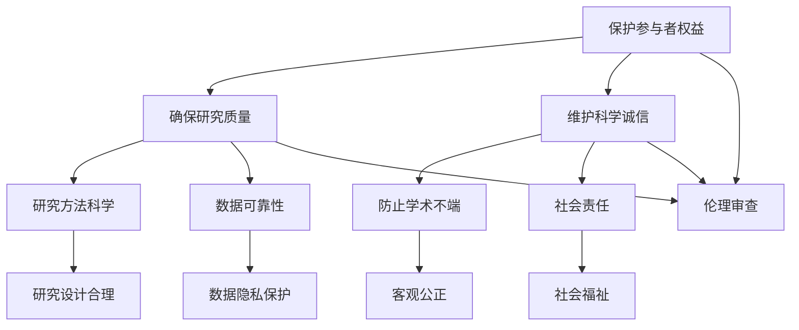
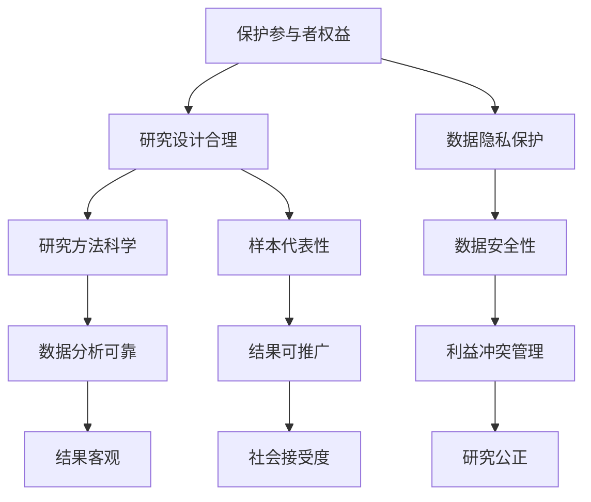
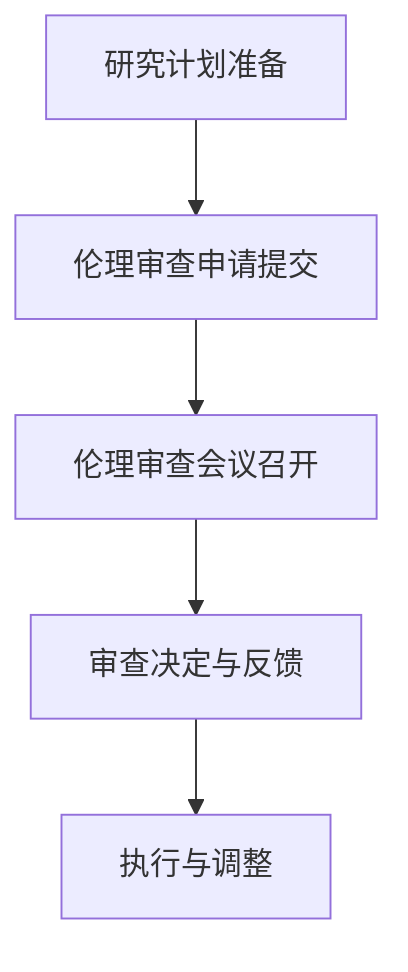

                 

### 引言

科学研究的伦理审查（ethical review of scientific research）是确保科学研究在道德和伦理层面合法性的重要机制。它不仅关乎研究者的学术诚信，更涉及到研究参与者的权益保护和公共利益。科学知识探索在推动社会进步和个人福祉方面具有巨大潜力，但同时也可能带来道德风险和负面影响。因此，伦理审查在平衡知识探索与道德约束之间扮演着至关重要的角色。

在现代科学研究中，伦理审查已经成为了不可或缺的一环。随着科学技术的迅猛发展，人类对于自然世界的认识不断深入，同时也面临着更多伦理挑战。例如，基因编辑技术的出现引发了关于基因伦理的讨论，人工智能的广泛应用带来了隐私和数据安全的担忧。因此，为了确保科学研究的道德合法性和社会接受度，伦理审查成为了一道必要的安全阀。

本文旨在探讨科学研究的伦理审查，分析其重要性、基本原则和具体实践。通过逐步分析推理，我们将探讨伦理审查如何帮助平衡知识探索与道德约束，以及其在现代科学研究中面临的各种挑战和应对策略。

接下来，我们将从以下几个方面展开讨论：

1. **研究伦理审查的重要性**：介绍伦理审查的基本概念和其作用，探讨知识探索与道德约束之间的关系。
2. **伦理审查的基本原则**：详细阐述伦理审查的核心原则，包括研究参与者权益保护、研究设计合理性和数据隐私保护等。
3. **伦理审查的过程**：描述伦理审查的申请、审批流程，以及伦理审查委员会的角色和职责。
4. **伦理审查中的特殊问题**：讨论涉及人权与尊严、动物实验和知识产权等特殊伦理问题。
5. **案例研究与实战**：通过国内外实际案例，展示伦理审查的应用和实践。
6. **未来展望**：分析伦理审查的发展趋势和面临的挑战，探讨未来研究方向。

通过以上逐步分析推理，我们将深入理解科学研究伦理审查的本质和重要性，为其在科学研究中的广泛应用提供理论支持和实践指导。

### 研究伦理审查的重要性

研究伦理审查（ethical review of scientific research）的重要性不言而喻，它不仅是为了保护研究参与者的权益，更是为了确保科学研究的道德合法性和社会接受度。在科学研究的各个环节中，伦理审查起到了不可替代的作用。

首先，伦理审查是保护研究参与者权益的重要保障。研究参与者可能包括人类受试者、动物模型和生物样本等。他们的安全和福利需要得到充分保障。伦理审查委员会（ethical review board, ERB）通过对研究计划进行审查，确保研究设计合理、参与者的风险最小化，并且在研究过程中遵守知情同意和隐私保护等伦理原则。例如，在临床试验中，伦理审查可以确保药物的安全性，防止不必要的风险。通过严格的伦理审查，可以降低研究参与者受到伤害的可能性，确保他们的权益得到尊重。

其次，伦理审查是确保研究质量的关键环节。科学研究的核心目标是追求真理，但研究过程中可能存在偏差和误导。伦理审查通过对研究设计的审查，确保研究方法科学、数据可靠，从而提高研究的质量和可信度。此外，伦理审查还可以帮助研究者识别和规避潜在的利益冲突，保证研究的客观性和公正性。例如，在研究基金的来源和使用方面，伦理审查可以确保研究者不受外部影响，保持研究的独立性和科学性。

最后，伦理审查是维护科学诚信和社会责任的重要机制。科学研究是社会进步的重要驱动力，但其发展也必须遵循道德规范和社会责任。伦理审查通过对研究过程的监督和评价，确保研究者遵守科学伦理规范，防止学术不端行为的发生。例如，在论文发表过程中，伦理审查可以防止抄袭、伪造数据和一稿多投等不当行为。此外，伦理审查还可以促进科学家的社会责任意识，引导他们将研究成果应用于造福人类的领域。

总之，研究伦理审查在知识探索与道德约束之间起到了重要的平衡作用。它不仅保护了研究参与者的权益，确保了研究的质量和可信度，更维护了科学诚信和社会责任。通过伦理审查，科学研究能够更加健康、有序地进行，为社会发展和人类福祉作出更大的贡献。

为了进一步说明伦理审查的重要性，我们可以通过一个简单的Mermaid流程图来展示其核心概念和联系：

通过这个流程图，我们可以清晰地看到伦理审查如何贯穿于研究的各个环节，保护参与者权益、确保研究质量和维护科学诚信，从而在知识探索与道德约束之间找到平衡。研究伦理审查的重要性在于它为科学研究提供了一个道德和伦理的框架，使其更加规范和有序，从而推动科学进步和社会发展。

### 伦理审查的基本原则

伦理审查的基本原则是确保科学研究在道德和伦理层面合法性的基石。这些基本原则涵盖了多个方面，包括研究参与者权益保护、研究设计合理性、数据隐私保护以及利益冲突管理等。以下将详细阐述这些原则，并通过具体的实例来解释其应用。

#### 1. 研究参与者权益保护

保护研究参与者的权益是伦理审查的核心原则之一。这包括确保参与者的知情同意、隐私保护和福祉。知情同意是指研究者在开始研究之前，必须向参与者详细说明研究的性质、目的、过程和潜在风险，并得到其明确同意。隐私保护则要求研究者对参与者的个人信息保密，不得泄露给无关第三方。

例如，在一项临床试验中，伦理审查委员会会检查研究计划是否包含了知情同意书，确保参与者完全了解研究的目的、过程和可能的风险。此外，还会审查研究者如何处理参与者的个人数据，确保其不被滥用或泄露。

#### 2. 研究设计合理性

研究设计的合理性是确保研究结果可靠性和科学性的关键。伦理审查会评估研究计划是否科学、合理，包括研究方法、样本选择和数据分析等。研究者需要提供详细的研究方案，并说明如何控制实验变量、如何保证数据的准确性和完整性。

例如，在开展一项随机对照试验时，伦理审查委员会会检查研究是否采用了随机分组和盲法设计，以确保结果的客观性和可信度。此外，还会评估研究样本的大小和代表性，确保研究结果能够推广到更广泛的群体。

#### 3. 数据隐私保护

数据隐私保护是伦理审查的重要组成部分。研究者必须采取措施确保收集的数据不被未授权访问或泄露。这包括使用加密技术、设置访问权限和数据匿名化等。

例如，在一项涉及患者电子健康记录的研究中，伦理审查委员会会检查研究者是否采取了严格的数据保护措施，如加密存储、访问控制和安全备份。此外，还会审查数据匿名化过程，确保无法通过数据识别参与者的身份。

#### 4. 利益冲突管理

利益冲突管理是确保研究客观性和公正性的重要原则。研究者可能存在与研究结果相关的潜在利益冲突，如资金支持、商业合作或专利权益。伦理审查委员会需要评估并管理这些利益冲突，确保研究过程的独立性和结果的客观性。

例如，在一项由制药公司资助的临床试验中，伦理审查委员会会审查研究者的利益冲突声明，并要求采取必要的措施，如独立数据分析和报告，以确保研究结果不受资助方的影响。

#### 5. 其他基本原则

除了上述原则，伦理审查还包括其他方面，如动物实验的伦理审查、知识共享和知识产权管理。动物实验的伦理审查需要评估实验设计是否合理，动物福利是否得到保障。知识共享和知识产权管理则要求研究者合理分享研究成果，并遵守知识产权法规。

通过上述基本原则，伦理审查为科学研究提供了一个全面的道德和伦理框架，确保研究在道德合法性和社会接受度方面达到标准。以下是一个简化的Mermaid流程图，展示这些基本原则的核心概念和联系：

通过这个流程图，我们可以清晰地看到伦理审查的基本原则如何相互关联，共同构建起一个确保科学研究道德合法性的框架。研究伦理审查的基本原则不仅保护了研究参与者的权益，确保了研究的科学性和公正性，更在知识探索与道德约束之间找到了平衡点，为科学研究提供了强有力的支持和保障。

### 伦理审查的过程

伦理审查的过程是确保科学研究在道德和伦理层面合规的关键环节。这个过程通常包括研究计划的准备、伦理审查申请的提交、伦理审查会议的召开以及审查决定的执行和反馈。以下我们将详细阐述这一过程，并探讨伦理审查委员会的角色和职责。

#### 研究计划的准备

研究计划的准备是伦理审查过程的第一步，也是至关重要的一步。研究者需要详细撰写研究计划，包括研究背景、目的、方法、预期结果和潜在风险等。以下是研究计划撰写过程中需要关注的关键点：

1. **研究背景与目的**：研究者需要清楚地阐述研究的背景，说明为什么进行这项研究，以及研究的目标是什么。
2. **研究方法**：研究者需要详细描述研究的方法，包括数据收集、实验设计、样本选择和数据分析等。
3. **潜在风险与收益**：研究者需要评估研究的潜在风险，包括对研究参与者和环境的影响，并说明预期的收益。
4. **参与者权益保护**：研究者需要明确如何保护研究参与者的权益，包括知情同意、隐私保护和福利保障等。

#### 伦理审查申请的提交

研究计划准备好后，研究者需要将其提交给伦理审查委员会（ethical review board, ERB）。伦理审查申请通常包括以下内容：

1. **研究计划书**：详细描述研究的内容和过程。
2. **伦理风险评估报告**：研究者需要对研究可能带来的伦理风险进行评估，并提出相应的风险缓解措施。
3. **知情同意书模板**：研究者需要准备知情同意书模板，确保研究参与者在充分了解研究情况后做出决定。
4. **其他相关文件**：包括研究者资质证明、资金支持来源等。

提交伦理审查申请时，研究者需要确保所有文件齐全、内容完整，以便伦理审查委员会进行审查。

#### 伦理审查会议的召开

伦理审查委员会通常定期召开审查会议，对提交的研究计划进行集体讨论和审查。会议流程通常包括以下环节：

1. **研究计划介绍**：研究者简要介绍研究背景、目的和方法。
2. **审查委员会讨论**：伦理审查委员会成员对研究计划进行详细讨论，评估其道德和伦理问题。
3. **投票表决**：审查委员会成员进行投票表决，决定研究计划是否通过审查。
4. **反馈与建议**：审查委员会会向研究者提供反馈和建议，帮助其改进研究计划。

#### 审查决定的执行和反馈

伦理审查委员会在审查会议结束后，会做出审查决定。决定通常包括以下几种情况：

1. **通过审查**：研究计划符合伦理要求，可以继续进行。
2. **修改后通过**：研究计划存在某些问题，需要研究者进行修改后再次提交审查。
3. **拒绝通过**：研究计划存在严重伦理问题，无法通过审查。

对于通过审查的研究计划，研究者需要按照审查委员会的要求进行相关准备工作，如完善知情同意书、数据保护措施等。对于修改后通过或拒绝通过的研究计划，研究者需要根据反馈进行相应调整，或重新设计研究方案。

#### 伦理审查委员会的角色和职责

伦理审查委员会在伦理审查过程中扮演着关键角色。其职责通常包括：

1. **审查研究计划**：对研究计划的道德和伦理问题进行评估。
2. **保护参与者权益**：确保研究参与者的权益得到充分保护。
3. **监督研究过程**：对研究过程进行监督，确保研究按照计划进行。
4. **提供反馈和建议**：向研究者提供反馈和建议，帮助其改进研究方案。
5. **处理伦理纠纷**：在研究过程中，处理参与者或研究者之间的伦理纠纷。

以下是一个简化的Mermaid流程图，展示伦理审查过程的核心步骤和关键环节：

通过上述步骤，伦理审查过程确保科学研究在道德和伦理层面得到充分保障，从而促进科学研究的健康发展。

#### 伦理审查中的特殊问题

在科学研究的伦理审查过程中，涉及到一些特殊问题，这些问题的处理往往需要更多的关注和细致的考量。以下将重点讨论人权与尊严、动物实验的伦理审查以及知识产权和利益冲突管理。

##### 人权与尊严

人权与尊严是伦理审查中的核心问题之一。科学研究的对象既包括人类，也包括动物。在处理人权与尊严问题时，伦理审查需要确保研究参与者的权益得到充分保护。这包括：

1. **知情同意**：研究者在开始研究前，必须向参与者详细解释研究的目的、过程、潜在风险和益处，并得到其明确的书面同意。知情同意书需要以易于理解的语言撰写，确保参与者能够充分了解研究的内容。
   
2. **隐私保护**：研究者需要对参与者的个人信息进行严格保密，不得泄露给无关第三方。在数据收集和分析过程中，需要采取加密、匿名化等技术手段，确保数据的安全性。

3. **尊严保护**：在研究过程中，参与者应受到尊重，不应受到歧视或贬低。研究者需要确保研究环境舒适，尊重参与者的文化和宗教信仰。

##### 动物实验的伦理审查

动物实验在科学研究，特别是医学和生物学研究中扮演着重要角色，但其伦理问题也备受关注。伦理审查委员会在处理动物实验问题时，需要考虑以下方面：

1. **动物选择**：研究者需要选择合适的动物模型，确保实验的科学性和必要性。动物的选择应基于最小痛苦原则，尽量减少动物的痛苦和伤害。

2. **动物福利**：研究者需要提供适宜的动物饲养环境，确保动物的饮食、卫生和健康。在实验过程中，应尽量减少动物的痛苦，采用无痛苦处死等方法结束实验。

3. **替代方案**：伦理审查委员会鼓励研究者寻找替代动物实验的方案，如使用细胞培养、计算机模拟等方法。如果动物实验不可避免，需要详细说明替代方案的不足之处。

##### 知识产权和利益冲突管理

知识产权和利益冲突管理是伦理审查中的另一个重要方面。研究者可能存在与研究结果相关的知识产权和利益冲突，这需要得到妥善处理。

1. **知识产权保护**：研究者在进行研究时，可能产生专利、版权等知识产权。伦理审查需要确保研究者的知识产权得到保护，避免研究成果被他人侵犯。

2. **利益冲突披露**：研究者需要主动披露与研究成果相关的潜在利益冲突，如商业合作、资金支持等。伦理审查委员会会评估这些利益冲突是否可能影响研究的客观性和公正性，并采取必要的措施进行管理。

3. **利益冲突缓解**：对于存在利益冲突的研究，可以采取以下措施进行缓解：

   - **独立审查**：研究数据分析和报告由独立的第三方进行，确保结果的客观性。
   - **利益冲突声明**：研究者需要在研究计划书中详细说明利益冲突情况，并在研究结果中公开声明。
   - **利益转让**：研究者可以将与研究成果相关的利益转让给无利益冲突的第三方，确保研究的独立性。

通过细致的伦理审查，处理人权与尊严、动物实验以及知识产权和利益冲突等特殊问题，确保科学研究在道德和伦理层面得到充分保障，推动科学研究的健康和可持续发展。

#### 案例研究与实战

在实际科学研究中，伦理审查不仅是一个理论框架，更需要通过具体的案例来展现其重要性和实际操作过程。以下将介绍几个国内外典型的伦理审查案例，通过这些案例展示伦理审查在实践中的应用，并讨论实践中面临的挑战和应对策略。

##### 案例一：中国某医学院伦理审查过程

**研究背景**：某医学院计划开展一项关于新型抗肿瘤药物的临床试验，旨在评估药物的安全性和有效性。

**伦理审查过程**：

1. **研究计划准备**：研究者撰写详细的研究计划书，包括研究目的、方法、样本选择、预期结果和潜在风险。同时，制定知情同意书模板，确保研究参与者在充分了解研究情况后做出决定。

2. **伦理审查申请提交**：研究者将研究计划和知情同意书提交给医学院的伦理审查委员会（ERB）。申请文件包括研究计划书、伦理风险评估报告和研究者资质证明等。

3. **伦理审查会议召开**：ERB召开审查会议，审查委员会成员对研究计划进行详细讨论，评估其道德和伦理问题。会议内容包括研究背景介绍、审查委员会提问、投票表决等。

4. **审查决定与反馈**：ERB做出审查决定，并给予反馈。对于通过审查的研究计划，研究者需要根据审查意见进行相应调整，如完善知情同意书、加强数据保护措施等。

**挑战与应对策略**：

- **挑战**：临床试验的伦理审查面临的主要挑战是确保研究设计的科学性和合理性，同时保护参与者的权益。特别是在新药临床试验中，研究者需要对潜在风险进行充分评估，并制定有效的风险管理措施。
- **应对策略**：ERB在审查过程中，会对研究计划的每个环节进行详细审查，包括研究设计、样本选择、数据收集和分析等。通过严格审查和反馈机制，确保研究计划的科学性和合理性，从而保护参与者的权益。

##### 案例二：美国某大学伦理审查案例

**研究背景**：美国某大学的一项研究计划涉及人工智能在医学诊断中的应用，旨在通过分析大量医疗数据提高诊断准确性。

**伦理审查过程**：

1. **研究计划准备**：研究者撰写详细的研究计划书，描述研究的目的、方法、数据来源和预期结果。同时，制定知情同意书模板，确保参与者在充分了解研究情况后做出决定。

2. **伦理审查申请提交**：研究者将研究计划和知情同意书提交给大学的伦理审查委员会（Institutional Review Board, IRB）。申请文件包括研究计划书、伦理风险评估报告和研究者资质证明等。

3. **伦理审查会议召开**：IRB召开审查会议，审查委员会成员对研究计划进行详细讨论，评估其道德和伦理问题。会议内容包括研究背景介绍、审查委员会提问、投票表决等。

4. **审查决定与反馈**：IRB做出审查决定，并给予反馈。对于通过审查的研究计划，研究者需要根据审查意见进行相应调整，如完善数据保护措施、加强参与者权益保障等。

**挑战与应对策略**：

- **挑战**：人工智能在医学领域的应用涉及大量患者数据的收集和分析，数据隐私保护和患者权益保护是主要挑战。此外，研究结果的解释和伦理问题也需要得到充分关注。
- **应对策略**：IRB在审查过程中，会对数据保护措施和患者权益保障进行重点审查。通过严格的数据加密、匿名化和访问控制措施，确保患者数据的安全和隐私。同时，要求研究者制定详细的伦理问题应对方案，确保研究结果能够得到合理解释和应用。

##### 案例三：英国某研究机构伦理审查实践

**研究背景**：英国某研究机构计划开展一项涉及动物实验的研究，旨在探索新型药物对特定疾病的治疗效果。

**伦理审查过程**：

1. **研究计划准备**：研究者撰写详细的研究计划书，描述实验设计、动物选择、实验过程和预期结果。同时，制定动物福利保障方案。

2. **伦理审查申请提交**：研究者将研究计划和动物福利保障方案提交给研究机构的伦理审查委员会（Animal Welfare and Ethical Review Body, AWERB）。申请文件包括研究计划书、动物福利保障方案和研究者资质证明等。

3. **伦理审查会议召开**：AWERB召开审查会议，审查委员会成员对研究计划进行详细讨论，评估其道德和伦理问题。会议内容包括研究背景介绍、审查委员会提问、投票表决等。

4. **审查决定与反馈**：AWERB做出审查决定，并给予反馈。对于通过审查的研究计划，研究者需要根据审查意见进行相应调整，如完善动物福利保障措施、加强数据保护等。

**挑战与应对策略**：

- **挑战**：动物实验的伦理审查面临的主要挑战是确保实验设计的科学性和动物福利的保障。特别是在动物福利方面，需要确保实验过程对动物的痛苦最小化。
- **应对策略**：AWERB在审查过程中，会对实验设计的科学性和动物福利保障进行重点审查。通过严格的实验设计评估和动物福利保障方案审查，确保实验对动物的痛苦最小化，同时确保研究结果的科学性和可靠性。

通过这些案例，我们可以看到伦理审查在实际操作中的应用和重要性。伦理审查不仅帮助研究者识别和解决潜在的道德和伦理问题，更在保护参与者权益、确保研究质量和促进科学诚信方面发挥了重要作用。在伦理审查实践中，面对各种挑战，研究者需要积极应对，通过不断完善和改进审查流程和措施，推动科学研究的健康发展。

### 未来展望

伦理审查在科学研究中的重要性日益凸显，随着科技的迅猛发展和研究领域的不断扩大，伦理审查也面临着新的趋势和挑战。未来，伦理审查将在多个方面得到进一步发展，以适应科学研究的不断变化。

首先，**伦理审查的趋势**之一是国际化和标准化。随着全球化进程的加快，科学研究的国际合作日益频繁。为了确保跨国研究的伦理一致性，各国和国际组织正在努力推进伦理审查的国际化标准。例如，世界卫生组织（WHO）和国际医学研究伦理委员会（ICMREC）等机构已经制定了一系列国际伦理审查指南，旨在统一全球科学研究的伦理标准。

其次，**技术发展**对伦理审查提出了新的挑战和机遇。大数据、人工智能和基因编辑等新兴技术的应用，使得科学研究更加复杂和多样，同时也带来了新的伦理问题。例如，大数据分析可能导致隐私泄露和数据滥用，基因编辑技术可能引发关于基因伦理和物种多样性的争议。未来，伦理审查需要更加关注技术发展带来的伦理风险，通过技术创新来提高审查的效率和准确性。

第三，**伦理审查的挑战**之一是平衡科学进步与社会责任。科学研究的目的是为了推动社会进步和人类福祉，但同时也需要考虑其对环境和人类社会的潜在影响。未来，伦理审查需要更加注重社会效益评估，确保研究活动不仅符合科学要求，也符合社会责任。

第四，**伦理审查的发展方向**之一是加强公众参与。在科学研究的伦理审查过程中，公众的知情权和参与权越来越受到重视。未来，伦理审查委员会可能需要更多地吸纳公众代表，通过公众咨询和参与机制，提高审查的透明度和公正性。

第五，**伦理审查的改进**方向之一是优化审查流程和机制。随着信息技术的应用，伦理审查的流程和机制可以进一步优化，如利用电子化审查平台和智能审核系统，提高审查效率和准确性。此外，建立更完善的伦理审查数据库和知识库，有助于提高审查人员的专业素养和审查质量。

总之，未来的伦理审查将在国际化、标准化、技术发展和社会责任等方面取得重要进展，以应对不断变化的研究环境和挑战。通过不断改进和优化审查流程，伦理审查将更好地发挥其在保护研究参与者权益、确保研究质量和维护科学诚信方面的作用，推动科学研究的健康和可持续发展。

### 附录

伦理审查作为一个复杂而关键的环节，需要依赖一系列法规、指南和工具来确保其规范性和有效性。以下是伦理审查相关的法规、指南和常用工具的介绍，以及如何准备伦理审查申请的相关注意事项。

#### 伦理审查相关法规与指南

1. **《赫尔辛基宣言》**：由世界医学协会（WMA）于1964年制定，是全球医学研究的伦理指导文件。它详细规定了涉及人类受试者的医学研究的伦理原则，包括知情同意、隐私保护和研究者的责任等。

2. **《贝尔蒙报告》**：由美国国家科学研究委员会（NAS）于1979年发布，是关于伦理审查体系的重要文件。它提出了三个伦理原则：尊重个人、公正和有益性，并明确了伦理审查委员会的职责。

3. **《中国临床研究伦理审查规范》**：由中国科学技术部、国家卫生健康委员会等部门于2017年发布，为国内临床研究的伦理审查提供了详细指导。

4. **《国际动物实验伦理指南》**：由世界动物健康组织（OIE）发布，提供了关于动物实验伦理的全面指导，包括动物选择、福利保护和实验设计等。

#### 伦理审查常用模板与工具

1. **知情同意书模板**：用于向研究参与者提供研究信息，并获取其知情同意。模板应包括研究目的、过程、潜在风险和受益等信息。

2. **伦理审查申请表**：用于研究者向伦理审查委员会提交研究计划，申请审查。申请表通常包括研究背景、方法、风险评估、参与者权益保护等内容。

3. **伦理风险评估表**：用于评估研究计划的伦理风险，包括隐私保护、数据安全、利益冲突等方面。

4. **伦理审查决策模板**：用于伦理审查委员会在审查会议后记录审查决定和反馈意见。

#### 如何准备伦理审查申请

1. **撰写研究计划书**：详细描述研究背景、目的、方法、样本选择、数据收集和分析等。研究计划书应遵循伦理审查委员会的格式要求。

2. **进行伦理风险评估**：对研究计划可能带来的伦理风险进行评估，并提出相应的风险缓解措施。风险评估表可以帮助研究者系统地进行风险识别和评估。

3. **准备知情同意书**：根据研究计划的内容，制定易于理解的知情同意书模板，确保研究参与者能够在充分了解研究情况后做出决定。

4. **填写伦理审查申请表**：根据伦理审查委员会的要求，填写伦理审查申请表。申请表应详细说明研究内容、参与者权益保护措施和伦理风险控制措施。

5. **准备其他相关文件**：包括研究者资质证明、资金支持来源、动物实验伦理审批文件等。确保所有文件齐全，并按照审查委员会的要求提交。

6. **提交申请**：将研究计划书、知情同意书、伦理审查申请表和其他相关文件一并提交给伦理审查委员会。

7. **等待审查决定**：伦理审查委员会将对提交的材料进行审查，并在一定时间内做出决定。如果申请通过，研究者需根据审查意见进行相应调整。

通过上述步骤，研究者可以更好地准备伦理审查申请，确保研究计划在道德和伦理层面得到充分保障，从而顺利进行。

### 结论

通过本文的探讨，我们可以清晰地看到科学研究伦理审查在知识探索与道德约束之间的重要平衡作用。伦理审查不仅保护了研究参与者的权益，确保了研究的科学性和公正性，还在维护科学诚信和社会责任方面发挥了关键作用。在未来的科学研究中，伦理审查将继续面临新的挑战和机遇，需要我们不断优化审查流程和机制，推动科学研究的健康和可持续发展。我们呼吁广大科研工作者和伦理审查机构共同努力，加强伦理审查的科学性和透明度，为科学探索注入更多的道德光辉。

