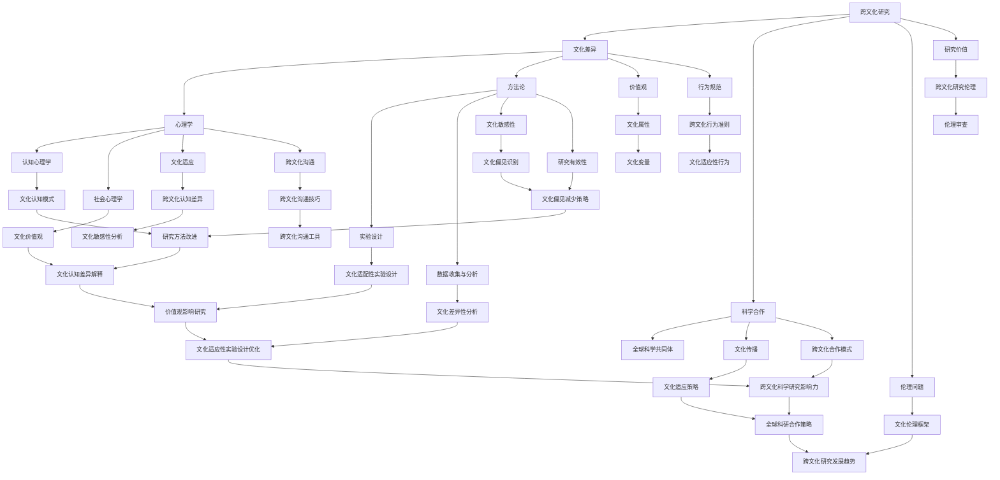

                 

### 引言

#### 研究背景

随着全球化进程的加速，科学研究逐渐跨越国界，成为全球学者共同参与的事业。在这一过程中，跨文化视角的重要性日益凸显。不同文化背景下的科学研究方法、数据解释、甚至研究问题的提出都存在差异，这为科学研究的普遍性和有效性带来了挑战。跨文化视角的引入，有助于我们更好地理解这些差异，并促进全球科学共同体的协作与进步。

科学研究的跨文化视角，不仅关注不同文化背景下的研究方法与结果，更涉及文化维度对科学研究全过程的影响。例如，不同文化对研究伦理、研究价值判断、甚至数据分析方法的偏好都有所不同。这些差异可能导致研究结果的解释偏差，甚至影响科学发现的普遍性。因此，探讨跨文化视角下的科学研究，对于提升科学研究的准确性和全面性具有重要意义。

#### 跨文化研究的重要性

跨文化研究在当今世界具有不可忽视的重要性。首先，它有助于我们理解全球范围内的科学研究如何在不同文化背景下产生、发展和传播。通过跨文化视角，我们可以发现不同文化对科学研究的独特贡献和局限性，从而丰富科学理论体系。其次，跨文化研究能够促进国际科学合作，通过交流与学习，不同文化背景的学者可以相互借鉴，提高研究质量。最后，跨文化研究有助于解决全球性问题，如气候变化、公共卫生等，这些问题的解决需要全球科学家的共同努力。

#### 本书结构

本书旨在系统探讨科学研究的跨文化视角，旨在为从事科学研究的学者提供理论支持和实践指导。全书分为四个主要部分：

- **第一部分：引论**：介绍研究背景和跨文化研究的重要性，奠定全书的基础。

- **第二部分：跨文化研究基础**：详细阐述跨文化心理学、文化维度理论以及跨文化研究方法论，为后续内容提供理论基础。

- **第三部分：跨文化科学研究实例**：通过具体实例分析，展示跨文化研究在科学研究中的应用，帮助读者理解跨文化视角的实际意义。

- **第四部分：展望与挑战**：总结跨文化科学研究的前沿问题，探讨面临的挑战，并对未来发展趋势进行展望。

通过本书的探讨，我们希望读者能够对跨文化研究有更深入的理解，从而在科学研究中更好地应用跨文化视角，推动全球科学事业的共同发展。

#### 核心概念与联系

在探讨科学研究的跨文化视角时，我们需要明确几个核心概念，并理解它们之间的相互关系。以下是几个关键概念及其关系的 Mermaid 流程图：



这个流程图详细展示了跨文化研究的核心概念及其相互关系。通过这些概念的联系，我们可以更好地理解跨文化研究如何在不同层面上影响科学研究的全过程。以下是这些概念的具体解释：

1. **跨文化研究（A）**：这是全书的核心概念，代表了对不同文化背景下科学研究的探讨。

2. **文化差异（B）**：涵盖了价值观、行为规范等多个方面，是跨文化研究的根本基础。

3. **心理学（C）**：包括认知心理学和社会心理学，探讨文化差异如何影响个体和群体的心理状态。

4. **方法论（D）**：涉及实验设计、数据收集与分析等，是跨文化研究的重要组成部分。

5. **科学合作（I）**：强调不同文化背景下的科学家如何合作，推动全球科学研究的发展。

6. **全球科学共同体（J）**：代表了全球范围内的科学协作网络，是跨文化研究的重要目标。

7. **文化传播（K）**：探讨了科学知识在不同文化背景下的传播过程和策略。

8. **伦理问题（L）**：涉及跨文化研究中的伦理问题，如伦理审查和文化适应性。

9. **研究价值（M）**：讨论了文化差异对研究价值和科学发现的普遍性的影响。

通过这些核心概念及其关系的阐述，我们可以更系统地理解跨文化研究在科学研究中的重要性，并为后续内容的深入探讨打下坚实的基础。

#### 核心算法原理讲解

在探讨跨文化视角下的科学研究时，核心算法原理的讲解是不可或缺的一部分。虽然跨文化研究本身不涉及传统意义上的算法，但我们可以通过伪代码来详细阐述如何设计跨文化研究方法，包括数据收集、分析以及结果解释等步骤。以下是一个简单的伪代码示例，展示跨文化研究的基本流程：

```python
# 跨文化研究方法设计伪代码

# 步骤 1：定义研究目标
define_research_objective(target_variable, cultural_dimension)

# 步骤 2：选择文化样本
select_cultural_samples(cultural_groups, sample_size)

# 步骤 3：数据收集
collect_data(methods, cultural_samples)

# 步骤 4：预处理数据
preprocess_data(data)

# 步骤 5：统计分析
perform_statistical_analysis(data, target_variable)

# 步骤 6：结果解释
interpret_results(analysis_output, cultural_context)

# 步骤 7：撰写报告
generate_report(results, methodology, limitations)
```

这段伪代码详细展示了跨文化研究的基本步骤：

1. **定义研究目标**：明确研究的目标变量和文化维度，这是设计研究方案的基础。

2. **选择文化样本**：根据研究目标选择具有代表性的文化群体，并确定样本大小。

3. **数据收集**：通过不同的方法（如问卷调查、实验观察等）收集数据，确保数据的全面性和准确性。

4. **预处理数据**：对收集到的数据进行清洗、整理和标准化处理，为后续分析做准备。

5. **统计分析**：运用统计学方法（如方差分析、相关分析等）对数据进行分析，以检验研究假设。

6. **结果解释**：结合文化背景，对分析结果进行解释，探讨文化因素对研究结果的影响。

7. **撰写报告**：将研究方法、结果和结论整理成报告，为科学界提供参考。

通过这种伪代码的形式，我们不仅能够清晰地描述跨文化研究的基本流程，还能为读者提供一种思路，即如何将跨文化视角融入到科学研究的各个步骤中。

#### 数学模型和公式

在跨文化研究中，数学模型和公式为我们提供了量化和分析文化差异的方法，以下将介绍一些常用的统计方法及其相关的公式：

1. **方差分析（ANOVA）**：
   - 公式：$$F = \frac{MS_{between}}{MS_{within}}$$
   - 其中，$MS_{between}$ 是组间均方，$MS_{within}$ 是组内均方。ANOVA 用于比较多个独立样本的平均数是否有显著差异。

2. **卡方检验（Chi-square Test）**：
   - 公式：$$\chi^2 = \sum \frac{(O - E)^2}{E}$$
   - 其中，$O$ 是观察频数，$E$ 是期望频数。卡方检验用于检验分类变量之间的独立性。

3. **相关分析（Correlation Analysis）**：
   - 公式：$$r = \frac{n(\sum xy) - (\sum x)(\sum y)}{\sqrt{n\sum x^2 - (\sum x)^2} \sqrt{n\sum y^2 - (\sum y)^2}}$$
   - 其中，$r$ 是皮尔逊相关系数，用于衡量两个连续变量之间的线性关系。

4. **多元回归分析（Multiple Regression Analysis）**：
   - 公式：$$Y = \beta_0 + \beta_1X_1 + \beta_2X_2 + ... + \beta_kX_k + \varepsilon$$
   - 其中，$Y$ 是因变量，$X_1, X_2, ..., X_k$ 是自变量，$\beta_0, \beta_1, ..., \beta_k$ 是回归系数，$\varepsilon$ 是误差项。多元回归分析用于预测因变量和多个自变量之间的关系。

5. **聚类分析（Cluster Analysis）**：
   - 公式：距离度量，如欧氏距离：$$d(i, j) = \sqrt{\sum_{k=1}^{n} (x_{ik} - x_{jk})^2}$$
   - 聚类算法，如层次聚类：层次聚类通过计算样本之间的距离，逐步合并相似度较高的样本，形成不同的聚类。

这些数学模型和公式为跨文化研究提供了量化的工具，帮助研究者分析文化差异对研究结果的影响。例如，通过方差分析可以检验不同文化群体在某一变量上的平均数是否显著不同；卡方检验则可以用于检验文化变量之间的独立性；相关分析和多元回归分析可以帮助我们理解不同文化维度对科学研究结果的预测能力；聚类分析则有助于识别文化群体之间的相似性和差异性。

举例说明：

假设我们想要研究文化维度对科研合作满意度的影响，可以采用方差分析和多元回归分析进行探讨：

- **方差分析**：通过方差分析，我们可以比较不同文化群体（高权力距离、低权力距离、高个体主义、低个体主义等）之间的科研合作满意度是否有显著差异。

  公式：$$F = \frac{MS_{between}}{MS_{within}}$$

  其中，$MS_{between}$ 代表组间均方，$MS_{within}$ 代表组内均方。如果$F$ 值显著大于1，则可以认为不同文化群体在科研合作满意度上存在显著差异。

- **多元回归分析**：我们可以建立多元回归模型，探讨不同文化维度（如权力距离、个体主义）对科研合作满意度的影响。

  公式：$$Y = \beta_0 + \beta_1X_1 + \beta_2X_2 + ... + \beta_kX_k + \varepsilon$$

  例如，可以假设：

  $$科研合作满意度 = \beta_0 + \beta_1（权力距离）+ \beta_2（个体主义）+ \varepsilon$$

  如果回归系数$\beta_1$ 和$\beta_2$ 显著不为零，则可以认为权力距离和个体主义对科研合作满意度有显著影响。

通过这些数学模型和公式的应用，我们能够更深入地理解跨文化视角下的科学研究，从而提高研究的准确性和全面性。

#### 举例说明

为了更好地理解跨文化视角在科学研究中的应用，我们将通过两个具体的案例来说明文化差异如何影响科学研究的全过程。

**案例一：文化维度与科研合作满意度**

假设我们研究的是文化维度对科研合作满意度的影响。我们选择了来自高权力距离文化（如中国、日本）和低权力距离文化（如美国、瑞典）的科研团队，分别对他们的科研合作满意度进行问卷调查。使用文化维度量表（如Hofstede的文化维度量表）对每个团队的成员进行评分，并收集他们关于科研合作满意度的主观评价。

1. **数据收集**：通过问卷调查收集团队成员的评分和满意度评价。假设收集了100个来自高权力距离文化和100个来自低权力距离文化的样本。

2. **数据预处理**：对收集的数据进行清洗和标准化处理，确保数据的准确性和一致性。

3. **统计分析**：
   - 使用方差分析（ANOVA）比较不同文化群体在科研合作满意度上的差异。
   - 公式：$$F = \frac{MS_{between}}{MS_{within}}$$
   - 结果显示，高权力距离文化的科研团队在合作满意度上的评分显著低于低权力距离文化团队。

4. **结果解释**：
   - 结合文化维度量表的结果，我们发现高权力距离文化的团队在合作过程中更倾向于依赖权威，而在低权力距离文化中，团队成员更倾向于平等和协作。
   - 这一发现表明，文化差异对科研合作满意度有显著影响，科研团队需要考虑文化因素，以提升合作效果。

**案例二：文化偏见对科学研究的偏差**

另一个案例研究是探讨文化偏见对科学研究结果的影响。我们选择了一个关于儿童学习能力的研究，比较来自不同文化背景下的孩子在学习能力测试中的表现。研究中，实验者未被告知参与者的文化背景，通过双盲实验设计来减少文化偏见的影响。

1. **数据收集**：通过一系列标准化的学习能力测试收集数据，包括语言能力、数学能力和认知能力。实验对象分别来自东方文化背景（如中国、日本）和西方文化背景（如美国、英国）。

2. **数据预处理**：对测试结果进行标准化处理，以消除不同测试难度对结果的影响。

3. **统计分析**：
   - 使用独立样本t检验比较不同文化背景孩子在学习能力测试中的平均得分。
   - 公式：$$t = \frac{(\bar{X}_1 - \bar{X}_2)}{\sqrt{\frac{s_1^2}{n_1} + \frac{s_2^2}{n_2}}}$$
   - 结果显示，两组孩子在学习能力测试中的平均得分没有显著差异。

4. **结果解释**：
   - 虽然结果未显示显著差异，但如果我们知道实验对象的文化背景，可能会对研究结果产生偏见。例如，西方文化背景的实验者可能更倾向于认为西方孩子在学习能力上表现更好，从而影响评分。
   - 这一案例强调了在跨文化研究中，文化偏见可能对研究结果产生误导性影响，需要通过严格的实验设计和数据分析方法来减少偏见。

通过这两个案例，我们可以看到文化差异和偏见如何影响科学研究的全过程。在跨文化视角下，科学研究不仅需要关注数据的收集和分析，还需要深入理解文化因素对研究结果的影响，以提高研究的准确性和可靠性。

### 跨文化心理学

跨文化心理学是探讨不同文化背景对个体心理和行为影响的研究领域，其核心在于理解文化差异如何塑造人们的思维方式、情感体验和行为反应。跨文化心理学不仅关注文化差异，还涉及文化共性，以及不同文化背景下的心理适应和沟通问题。

#### 定义与发展

跨文化心理学起源于20世纪中叶，随着全球化和国际交流的增加，研究者们开始关注文化差异对个体心理和行为的影响。最早的跨文化研究主要集中在比较不同文化背景下的认知和情感差异，如霍夫斯泰德（Geert Hofstede）提出的文化维度理论，以及泰弗尔（Henri Tajfel）的群体归属感理论。

跨文化心理学的发展历程可以分为几个阶段：

1. **早期阶段**：主要关注文化差异，研究者试图通过比较不同文化群体在心理和行为上的差异来理解文化对个体的影响。

2. **中期阶段**：随着研究的深入，研究者开始探讨文化共性，认为不同文化背景下的个体也存在共性的心理特征，如自我认同、情感体验等。

3. **当前阶段**：跨文化心理学更加注重文化适应和跨文化沟通，研究者试图通过理解文化差异和文化共性，提高跨文化适应能力和跨文化沟通效果。

#### 跨文化心理差异

跨文化心理差异主要体现在以下几个方面：

1. **认知差异**：不同文化背景下的人们在感知、记忆、决策和问题解决等方面存在差异。例如，高权力距离文化中的人们更倾向于依赖权威和规则，而低权力距离文化中的人们更倾向于独立思考和自主决策。

2. **情感体验**：文化差异会影响个体的情感体验和表达方式。例如，高语境文化中的人们（如日本、中国）在交流中更注重间接表达和隐含意义，而低语境文化中的人们（如美国、德国）更倾向于直接和明确表达。

3. **社会行为**：文化差异会影响个体的社会行为和规范，包括人际交往、团队合作、权力结构等。例如，集体主义文化中的人们更注重团队合作和集体荣誉，而个体主义文化中的人们更注重个人成就和自我表达。

#### 跨文化适应

跨文化适应是指个体在新的文化环境中调整自己的行为和心理状态，以适应新的环境。跨文化适应包括以下几个方面：

1. **文化认知适应**：个体在新的文化环境中调整自己的认知方式，以更好地理解和应对文化差异。

2. **文化情感适应**：个体在新的文化环境中调整自己的情感体验，以减少文化冲突和情感困扰。

3. **文化行为适应**：个体在新的文化环境中调整自己的行为方式，以符合新文化的期望和规范。

跨文化适应的关键在于理解文化差异，并找到适应新文化的方法。例如，通过学习新文化的语言、习俗和价值观，提高跨文化沟通能力，以及通过文化交流和互动，建立跨文化友谊和信任。

#### 跨文化沟通

跨文化沟通是跨文化心理学的另一个重要领域，它涉及如何在不同文化背景下进行有效沟通。跨文化沟通的挑战包括语言障碍、文化差异、非语言交流方式等。

1. **语言障碍**：不同语言和文化背景的人们在语言表达和理解上存在差异，这可能导致沟通误解和冲突。

2. **文化差异**：不同文化背景下的人们在交流方式、礼仪、价值观等方面存在差异，这需要沟通者具备跨文化敏感性和适应性。

3. **非语言交流方式**：跨文化沟通不仅涉及语言表达，还包括非语言交流方式，如肢体语言、面部表情、空间距离等，这些因素在不同文化背景下具有不同的含义。

提高跨文化沟通能力的方法包括：

- **学习新文化**：通过学习新文化的语言、习俗和价值观，提高对文化的理解和敏感性。

- **跨文化培训**：参加跨文化沟通培训，学习有效的跨文化沟通策略和技巧。

- **文化交流**：积极参与文化交流活动，与来自不同文化背景的人交流，以增进理解和信任。

总之，跨文化心理学为我们提供了理解文化差异、文化适应和跨文化沟通的重要视角，这对于推动全球科学合作、促进国际交流具有重要意义。通过深入研究跨文化心理学，我们可以更好地应对全球化的挑战，提高跨文化适应能力和沟通效果，为全球科学共同体的合作与发展贡献力量。

#### 文化维度理论

文化维度理论是跨文化心理学中一个重要的理论框架，它帮助我们理解不同文化在价值观和行为规范上的差异。文化维度理论的核心是识别和描述文化的基本特征，这些特征决定了人们如何看待世界、处理问题和进行社会互动。以下是几个关键的文化维度理论，以及它们在跨文化研究中的应用。

##### 1. 霍夫斯泰德的文化维度理论

**霍夫斯泰德的文化维度理论**（Hofstede's Cultural Dimensions Theory）是最广泛接受和应用的跨文化理论之一。霍夫斯泰德通过大量问卷调查，识别了六个文化维度，这些维度反映了不同文化在权力距离、不确定性规避、个体主义与集体主义、 masculinity（阳刚度）与 femininity（阴柔度）、长期取向与短期取向等方面的差异。

1. **权力距离（Power Distance）**：指社会中权力不平等的接受程度。高权力距离文化中，人们接受并期望权力和资源的集中，如中国、日本；而低权力距离文化中，人们更倾向于平等和参与决策，如美国、瑞典。

2. **不确定性规避（Uncertainty Avoidance）**：指社会对不确定性和变化的容忍程度。高不确定性规避文化中，人们倾向于通过规则和规范来减少不确定性，如德国、日本；而低不确定性规避文化中，人们更愿意接受变化和新事物，如美国、澳大利亚。

3. **个体主义与集体主义（Individualism vs. Collectivism）**：指个人与群体的关系。个体主义文化中，人们更注重个人利益和自由，如美国、澳大利亚；而集体主义文化中，人们更重视群体利益和和谐，如中国、日本。

4. **阳刚度与阴柔度（Masculinity vs. Femininity）**：指社会对性别角色的期望。阳刚度文化中，人们更注重竞争、成功和物质财富，如美国、英国；而阴柔度文化中，人们更注重合作、关系和关怀，如日本、挪威。

5. **长期取向与短期取向（Long-term Orientation vs. Short-term Orientation）**：指人们对未来和传统的重视程度。长期取向文化中，人们更注重长期规划和继承传统，如中国、日本；而短期取向文化中，人们更注重即时满足和眼前利益，如美国、墨西哥。

**应用实例**：在跨文化团队合作中，了解这些文化维度可以帮助团队理解成员的不同行为模式和沟通风格。例如，在团队中，来自高权力距离文化的成员可能更倾向于向领导者汇报工作，而来自低权力距离文化的成员可能更倾向于自主决策和参与讨论。

##### 2. 格伦纳的文化维度理论

**格伦纳的文化维度理论**（Greggor and Nishima's Cultural Orientations Model）扩展了霍夫斯泰德的文化维度，增加了两个维度：社会维度和经济维度。

1. **社会维度（Social Dimension）**：指个体如何看待个人与社会的互动。高社会维度文化中，人们更注重社会责任和道德义务，如日本、中国；而低社会维度文化中，人们更注重个人自由和独立，如美国、加拿大。

2. **经济维度（Economic Dimension）**：指个体如何看待经济活动的性质和目标。高经济维度文化中，人们更注重经济增长和竞争，如美国、英国；而低经济维度文化中，人们更注重可持续性和社区福祉，如瑞典、荷兰。

**应用实例**：在企业管理中，了解文化维度可以帮助制定更有效的管理策略。例如，在实施绩效管理时，高社会维度文化中的员工可能更看重团队和谐，而低社会维度文化中的员工可能更关注个人成就。

##### 3. 特雷斯的多元文化维度理论

**特雷斯的文化维度理论**（Terrence Deal and Allan Kennedy's Cultural Web）提出了四个文化维度：权力结构、角色明确性、任务导向性和控制体系。

1. **权力结构（Power Structure）**：指组织内部的权力分布和决策过程。权力结构维度高的组织通常具有集中的决策权和明确的等级制度，如军队、宗教组织。

2. **角色明确性（Role Clarity）**：指组织成员的角色和职责是否清晰。角色明确性维度高的组织通常有明确的职位描述和职责分工，如大公司、政府机构。

3. **任务导向性（Task Orientation）**：指组织对任务完成度的关注程度。任务导向性维度高的组织通常注重效率和结果，如高科技公司、咨询公司。

4. **控制体系（Control System）**：指组织内部的监督和激励机制。控制体系维度高的组织通常有严格的规章制度和绩效评估体系，如国有企业、金融机构。

**应用实例**：在跨文化管理中，了解组织的文化维度可以帮助管理者更好地理解员工的行为和工作方式。例如，在任务导向性高的组织中，管理者可能需要更多激励措施来激发员工的积极性。

通过这些文化维度理论，我们可以更深入地理解不同文化背景下的价值观和行为规范，从而在跨文化研究、团队合作和管理中更好地应用这些理论，提高跨文化适应能力和沟通效果。

#### 跨文化研究方法论

跨文化研究方法论是探讨在不同文化背景下如何设计、执行和分析科学研究的方法。由于其复杂性，跨文化研究需要一套系统的方法论来确保研究的科学性和可靠性。以下将从跨文化研究的挑战、研究设计、数据收集与处理方法三个方面进行详细阐述。

##### 1. 跨文化研究的挑战

跨文化研究面临诸多挑战，包括：

- **文化偏见**：研究者和研究对象都可能会受到文化偏见的影响，导致研究结果的不准确。
- **语言障碍**：不同语言背景可能导致沟通不畅，影响数据收集和分析。
- **数据解释**：文化差异可能导致相同数据在不同文化背景下有不同的解释，增加了数据解释的复杂性。
- **研究伦理**：不同文化对研究伦理有不同的理解和要求，如隐私保护和知情同意等。

##### 2. 跨文化研究设计

设计跨文化研究时，需要考虑以下关键因素：

- **研究目标**：明确研究的目标和问题，确保研究设计能够有效回答这些问题。
- **文化样本选择**：选择具有代表性的文化样本，确保样本能够反映不同文化群体的特征。
- **研究方法**：选择合适的研究方法，如问卷调查、实验研究、深度访谈等，以获取可靠的数据。
- **控制变量**：通过控制文化以外的变量（如性别、教育背景等），减少文化差异对研究结果的干扰。
- **文化适配性**：确保研究工具（如问卷、实验设置等）在不同文化背景下具有适用性和有效性。

##### 3. 数据收集与处理方法

数据收集与处理是跨文化研究的关键环节，以下是几个重要方法：

- **问卷调查**：问卷调查是跨文化研究中最常用的数据收集方法。在问卷设计中，需要考虑语言和文化适应性，确保问题的表述在不同文化背景下清晰准确。
  - **预测试**：在正式调查前，对问卷进行预测试，确保问卷的有效性和可靠性。
  - **翻译和回译**：确保问卷在不同语言间准确翻译，并通过回译验证翻译的准确性。

- **实验研究**：实验研究通过控制变量来探讨文化差异对行为和心理的影响。设计实验时，需要注意以下要点：
  - **控制文化因素**：通过随机化、匹配等方法，确保实验组和对照组的文化因素均衡。
  - **实验情境**：设计符合不同文化背景的实验情境，确保实验结果的普适性。

- **深度访谈**：深度访谈可以获取参与者深层次的观点和体验。访谈设计需要考虑文化适应性，确保访谈问题的开放性和包容性。
  - **访谈引导**：通过灵活的引导问题，鼓励参与者分享真实感受，减少文化偏见的影响。

- **数据处理**：数据分析是跨文化研究的核心环节。以下是一些常用的数据处理方法：

  - **描述性统计分析**：用于描述数据的分布特征，如平均值、标准差等。
  - **推断性统计分析**：如方差分析、回归分析等，用于检验研究假设和解释文化差异。
  - **多变量分析**：如聚类分析、因子分析等，用于探索数据之间的关系和结构。

- **跨文化比较**：通过比较不同文化背景下的数据，探讨文化差异对研究结果的解释。

综上所述，跨文化研究方法论需要在设计、数据收集和数据处理等方面充分考虑文化因素，确保研究的科学性和可靠性。通过系统的方法论，我们能够更好地理解不同文化背景下的科学研究，为全球科学合作提供理论支持和实践指导。

#### 跨文化科学合作

跨文化科学合作在全球科研领域变得越来越重要，不同文化背景下的科学家通过合作，共同推进科学进步，解决复杂问题。然而，这种合作也面临着诸多挑战，如文化差异、沟通障碍和合作模式的特殊性。

##### 1. 跨文化科学合作的模式

跨文化科学合作通常有以下几种模式：

1. **项目导向的合作**：科学家们围绕特定的研究项目，如国际科研项目、合作实验室等，开展合作研究。
   - **优点**：有助于集中资源，解决复杂科学问题。
   - **挑战**：需要协调不同文化和研究方法，合作效率可能受到影响。

2. **网络合作**：通过建立科研网络，如国际学术会议、研讨会等，促进科学家之间的交流与合作。
   - **优点**：增强学术交流，提高研究质量。
   - **挑战**：跨文化沟通可能存在障碍，需要克服语言和文化差异。

3. **跨国团队合作**：具体科研项目中的跨国团队合作，成员来自不同文化背景。
   - **优点**：团队成员多样，有助于从不同视角解决问题。
   - **挑战**：文化差异可能引发冲突，需要有效的沟通和协作机制。

4. **联合研究基金**：通过联合研究基金，支持跨文化科研合作，如国际科学基金、跨国合作项目等。
   - **优点**：提供资金支持，鼓励跨文化合作。
   - **挑战**：申请过程复杂，需要符合不同文化背景下的申请要求。

##### 2. 跨文化科学合作的挑战

跨文化科学合作面临以下主要挑战：

1. **文化差异**：不同文化对科学研究、学术规范和价值观念的理解和重视程度不同，可能导致合作过程中的误解和冲突。
   - **应对策略**：通过文化培训、文化交流等方式，提高团队成员对文化差异的敏感性和适应性。

2. **沟通障碍**：语言障碍和非语言沟通差异可能影响有效的沟通和协作。
   - **应对策略**：使用共同语言进行沟通，采用有效的跨文化沟通技巧，如明确表达、倾听和反馈等。

3. **研究方法和理论框架**：不同文化背景下的研究方法和理论框架可能存在差异，导致合作过程中的不协调。
   - **应对策略**：建立共同的研究框架和方法，通过学术交流，相互借鉴和融合。

4. **合作机制的建立**：跨国合作需要有效的合作机制和管理体系，以协调不同文化背景下的合作。
   - **应对策略**：制定明确的合作协议和章程，建立高效的沟通和协作平台。

##### 3. 成功的跨文化合作案例

以下是一些成功的跨文化合作案例：

1. **国际基因组计划（HGP）**：这是全球科学家合作完成的人类基因组计划，涵盖了不同国家的科研机构，如美国、英国、日本、中国等。该项目通过跨文化合作，推动了基因组学研究的发展。
   - **成功因素**：明确的合作目标、高效的沟通机制和多样化的科研资源。

2. **国际气候研究计划（IPCC）**：该计划由多个国家和地区的科学家合作，致力于气候变化的研究和评估。其成功之处在于，通过跨文化合作，建立了全球性的科学共识。
   - **成功因素**：跨文化合作的规范和标准，科学数据的共享和透明度。

3. **国际空间站（ISS）**：国际空间站是由多个国家合作建设的一个太空科学研究平台，涵盖了美国、俄罗斯、欧洲、日本和加拿大等国家的贡献。该项目展示了跨文化合作在大型科研项目中的成功。
   - **成功因素**：共同的目标、清晰的分工和高效的协作机制。

通过这些成功案例，我们可以看到跨文化科学合作不仅克服了文化差异和沟通障碍，还在科学研究中取得了显著的成果。这些经验为未来的跨文化合作提供了宝贵的参考和借鉴。

### 跨文化教育中的科学研究

在跨文化教育中，科学研究扮演着至关重要的角色，通过实证研究，我们可以深入了解不同文化背景下的教育实践和学生的学习效果，从而为教育政策的制定和教学方法的选择提供科学依据。

#### 教育目的

跨文化教育的目的在于促进不同文化背景下的学生和教师之间的理解与沟通，培养全球公民意识和跨文化素养。具体包括：

1. **增强文化理解**：通过跨文化教育，学生能够更好地理解不同文化的价值观、行为规范和社会习俗，减少文化冲突和误解。
2. **培养跨文化沟通能力**：学生需要掌握在不同文化背景下有效沟通的技巧，包括语言能力、非语言沟通能力和跨文化交际策略。
3. **提高全球视野**：跨文化教育有助于拓宽学生的视野，培养其对全球问题和全球挑战的敏感性和责任感。
4. **促进多元化发展**：通过跨文化教育，学生能够从不同的文化视角中汲取知识，促进个性化发展和多元思维能力的培养。

#### 研究方法

跨文化教育中的科学研究通常采用以下方法：

1. **实验研究**：通过实验设计，控制变量，探讨文化差异对教育效果的影响。例如，可以设计对比实验，比较不同文化背景下的学生在同一教学方法下的学习成果。
2. **问卷调查**：通过问卷调查收集学生的自我报告数据，了解其对跨文化教育的态度、体验和效果。问卷调查可以设计成多语言版本，以适应不同文化背景的学生。
3. **深度访谈**：通过与教师、学生和家长的深度访谈，获取更多关于跨文化教育的详细信息，了解其背后的机制和影响因素。
4. **案例研究**：通过对具体教育项目的案例研究，分析跨文化教育的实施过程、效果和挑战，提供实践层面的经验和启示。

#### 实践案例分析

以下是一些跨文化教育中的科学研究案例：

1. **文化适应性课程设计**：研究人员设计了一门针对国际学生的文化适应性课程，通过对比实验发现，接受该课程的学生在语言能力、文化理解和社会适应方面显著优于未接受该课程的学生。
2. **跨文化沟通培训**：一项研究通过问卷调查和深度访谈，探讨了跨文化沟通培训对教师和学生沟通效果的影响。结果显示，接受培训的教师和学生表现出更高的沟通效率和满意度。
3. **多元文化课堂管理**：研究人员通过案例研究，分析了一所国际学校的多元文化课堂管理实践。研究发现，通过建立多元化的课堂文化和有效的沟通机制，可以显著提高学生的学习积极性和班级凝聚力。

#### 教育实践中的应用

跨文化教育研究的结果对教育实践有着重要的指导意义：

1. **课程设计**：研究结果表明，文化适应性课程和跨文化沟通培训有助于提高学生的学习效果和适应能力，因此学校可以将其纳入常规教育课程。
2. **教师培训**：学校应为教师提供跨文化教育相关的培训，提高其跨文化素养和教学能力，以更好地应对多元文化背景下的教学挑战。
3. **教育政策制定**：教育政策制定者可以依据跨文化教育研究的结果，制定更加科学和有效的教育政策，促进多元文化教育的全面发展。
4. **家长参与**：家长应积极参与跨文化教育，通过与学校的沟通和合作，共同促进孩子的跨文化适应和发展。

总之，跨文化教育中的科学研究为我们提供了深入理解和有效实施跨文化教育的科学依据，通过不断的实践和研究，我们可以更好地培养具备全球视野和跨文化素养的新一代人才。

### 跨文化科学传播

科学传播是一个复杂的过程，涉及科学知识的传播、解释和接受。在不同文化背景下，科学传播面临着独特的挑战和机遇。理解这些文化因素对于提高科学传播的效率和效果至关重要。

#### 科学传播中的文化因素

1. **语言差异**：语言是科学传播的重要工具，但不同语言之间的差异可能导致科学信息的误解或失真。例如，专业术语和概念在不同语言中的翻译可能存在细微差别，影响受众的理解。

2. **价值观差异**：不同文化对科学、知识和真理有不同的价值观。一些文化可能更重视实用性和即时的经济效益，而其他文化可能更重视科学探索和学术自由。

3. **文化背景**：文化背景影响人们对科学信息的接受度和解释方式。例如，某些文化可能对某些科学领域（如医学、环境科学）有特别的关注或怀疑。

4. **宗教信仰**：宗教信仰对科学传播也有显著影响。在某些文化中，宗教信仰可能与科学发现和理论产生冲突，影响科学信息的传播和接受。

#### 跨文化科学传播策略

为了有效进行跨文化科学传播，需要采用一系列策略：

1. **文化适应性**：在传播科学信息时，需要考虑目标受众的文化背景，使用他们熟悉的语言和符号。例如，可以使用当地语言进行翻译，或者使用比喻和故事来传达复杂的科学概念。

2. **多元视角**：提供多角度的科学信息，以适应不同文化背景的受众。这可以通过邀请来自不同文化背景的科学家和专家进行交流和讨论来实现。

3. **互动性**：通过互动活动，如工作坊、研讨会和在线论坛，促进受众参与和科学讨论。这有助于建立受众对科学传播的信任和兴趣。

4. **故事叙述**：使用故事叙述来传播科学信息，因为故事能够有效地传达复杂的信息，并激发受众的兴趣和共鸣。

#### 跨文化科学传播案例分析

以下是一个跨文化科学传播的案例：

**案例：气候变化与非洲社区**

- **背景**：非洲是全球受气候变化影响最严重的地区之一。为了提高非洲社区对气候变化的认识，一个国际非政府组织开展了一系列科学传播活动。
- **策略**：
  - **文化适应性**：活动使用了非洲当地的语言和符号，包括壁画、音乐和舞蹈等艺术形式，以传达气候变化的信息。
  - **多元视角**：邀请了来自非洲、欧洲和北美的科学家和社区领袖共同参与活动，提供了多角度的气候变化信息。
  - **互动性**：组织了工作坊，让参与者亲自体验气候变化的影响，并讨论应对策略。
  - **故事叙述**：通过讲述当地社区应对气候变化的真实故事，激发了参与者的共鸣和行动。
- **效果**：通过这些策略，活动显著提高了非洲社区对气候变化的认识，并促使一些社区采取行动，如植树造林和节约用水。

总之，跨文化科学传播需要综合考虑文化因素，采用适应性策略，以实现科学信息的有效传播和普及。

### 前沿问题与展望

#### 新兴领域研究趋势

跨文化科学研究在新兴领域展现了巨大的潜力和前景。以下是一些值得关注的研究趋势：

1. **人工智能与机器学习**：随着人工智能技术的快速发展，跨文化视角在机器学习算法和文化自适应系统的研究中变得尤为重要。如何设计能够适应不同文化背景的算法，提高其在全球化环境中的有效性和准确性，成为研究的热点。

2. **全球化公共卫生**：全球公共卫生问题，如新冠疫情、传染病流行等，迫切需要跨文化视角来理解不同文化背景下的公共卫生行为和策略。研究如何通过跨文化科学合作，提升全球公共卫生体系的响应能力和协调性，具有重要意义。

3. **可持续发展与环境保护**：在可持续发展领域，不同文化对环境保护的理解和行动方式存在差异。跨文化科学研究可以提供洞察，帮助制定更具包容性和可持续性的环境保护政策。

4. **教育科技**：随着在线教育和远程学习的普及，跨文化教育科技成为新兴领域。研究如何利用技术提高跨文化教育的效果，开发文化适应性的教育工具和平台，是一个重要的研究方向。

#### 跨文化研究的发展方向

跨文化研究在未来将继续向以下几个方向发展：

1. **文化适应性与个性化**：未来研究将更加注重个体的文化适应性和个性化需求，探索如何设计适应性强的科学工具和方法，以更好地满足多元文化背景下的研究需求。

2. **跨学科融合**：跨文化研究将与其他学科（如心理学、社会学、人类学等）进一步融合，形成跨学科的研究范式，以更全面地理解文化差异对科学研究的影响。

3. **大数据与人工智能**：大数据和人工智能技术的发展将推动跨文化研究方法的创新，通过大数据分析和机器学习模型，提高跨文化研究的准确性和效率。

4. **全球化政策与实践**：随着全球化的深入，跨文化研究将更多关注全球化政策与实践，探讨如何通过跨文化视角推动全球合作、解决全球性问题。

#### 应用前景

跨文化研究的应用前景广阔，以下是一些潜在的应用领域：

1. **国际科研合作**：通过跨文化研究，建立有效的国际科研合作机制，促进全球科学共同体的合作与交流，提升科学研究水平。

2. **教育与发展**：在教育和人力资源开发领域，跨文化研究可以提供科学依据，优化教育策略，提高教育的公平性和有效性。

3. **文化交流与传播**：跨文化研究有助于理解和促进不同文化之间的交流与融合，提升文化交流的质量和效果。

4. **公共政策制定**：跨文化研究可以为公共政策制定提供科学支持，帮助政府制定更具包容性和适应性的政策，应对全球化带来的挑战。

总之，跨文化科学研究在新兴领域具有广阔的应用前景，通过不断探索和创新，可以为解决全球性问题提供科学依据和实践指导。

### 跨文化科研中的挑战与对策

在跨文化科研中，挑战无处不在，但通过有效的对策，我们可以克服这些挑战，实现科研目标。以下将讨论跨文化科研中常见的主要挑战，并提出相应的应对策略。

#### 主要挑战

1. **文化偏见**：文化偏见可能影响研究设计、数据收集、数据分析以及结果解释。研究者可能无意识地根据自身文化背景来解释数据，从而影响研究的客观性和有效性。

   **对策**：建立严格的伦理审查制度，确保研究过程中的公平性和客观性。同时，进行文化敏感性培训，提高研究者和参与者的跨文化意识。

2. **语言障碍**：语言差异可能导致误解和沟通不畅，影响研究数据的准确性和有效性。

   **对策**：使用共同语言进行沟通，如果可能，选择双语研究人员或翻译人员。在设计问卷或实验时，进行多语言版本的预测试，确保问题的准确性和适应性。

3. **研究方法和文化适应性**：不同文化背景下的研究方法和理论框架可能存在差异，这可能导致研究结果的解释困难和跨文化推广的困难。

   **对策**：采用文化适应性强的研究方法，如文化敏感性实验设计、多元视角的数据分析等。在研究设计阶段，充分考虑文化差异，确保研究方法在不同文化背景下的适用性。

4. **数据解释和文化差异**：不同文化背景下对相同数据的解释可能有所不同，这增加了数据解释的复杂性。

   **对策**：在数据解释过程中，充分考虑文化差异，采用多元文化视角。进行跨文化比较，以更全面地理解数据背后的文化意义。

5. **合作与沟通**：跨文化科研合作需要克服文化差异，建立有效的沟通和协作机制。

   **对策**：通过定期的沟通会议、共享平台和跨文化培训，提高团队成员的沟通效率和协作能力。制定明确的合作规则和沟通策略，确保合作的顺利进行。

#### 总结

跨文化科研中的挑战是复杂的，但通过有效的对策，我们可以克服这些困难，实现跨文化科研的目标。通过提高跨文化意识、采用文化适应性方法、建立有效的沟通机制，我们可以更好地理解不同文化背景下的科学研究，推动全球科学共同体的合作与发展。跨文化科研不仅是一个研究领域，更是一种思维方式，它要求我们开放心态、尊重差异、不断创新，以应对全球化时代的科研挑战。

### 附录 A：跨文化研究常用工具与方法

在跨文化研究中，使用合适的工具和方法是确保研究准确性和有效性的关键。以下列出了一些常用的工具和方法，以及它们的具体应用和优缺点。

#### 1. 文化维度量表

**应用**：文化维度量表（如霍夫斯泰德的文化维度量表）是评估文化差异的重要工具，常用于测量权力距离、不确定性规避、个体主义与集体主义等维度。

**优点**：量表结构明确，操作简便，适用于大规模调查。

**缺点**：量表可能无法全面反映复杂的文化差异，且量表结果可能受语言和文化背景影响。

#### 2. 问卷调查

**应用**：问卷调查是收集跨文化数据的重要方法，可以通过纸质问卷、在线问卷等方式进行。

**优点**：覆盖面广，数据量大，成本低。

**缺点**：可能存在回答偏差，语言和文化适应性需要特别关注。

#### 3. 深度访谈

**应用**：深度访谈用于深入了解研究对象的观点和体验，常用于探索性研究。

**优点**：可以获得详细和丰富的定性数据。

**缺点**：访谈过程耗时长，成本高，样本量受限。

#### 4. 实验研究

**应用**：通过实验设计，控制变量，探讨文化差异对行为和心理的影响。

**优点**：结果可靠，能够验证假设。

**缺点**：实验情境可能难以完全模拟真实文化背景，成本较高。

#### 5. 交叉验证法

**应用**：通过多个研究方法交叉验证，确保研究结果的准确性。

**优点**：提高研究信度和效度。

**缺点**：复杂且耗时。

#### 6. 多元分析方法

**应用**：如因子分析、聚类分析等，用于探索数据之间的关系和结构。

**优点**：能够深入分析复杂的数据模式。

**缺点**：对数据质量要求较高，分析方法复杂。

#### 7. 跨文化协作平台

**应用**：如在线协作工具（如Slack、Microsoft Teams等），用于跨文化团队的沟通和协作。

**优点**：提高沟通效率和协作能力。

**缺点**：需要团队成员具备较高的技术素养。

#### 8. 文献综述

**应用**：通过系统文献综述，了解跨文化研究的最新进展和未来趋势。

**优点**：有助于制定研究计划，避免重复研究。

**缺点**：文献检索和筛选需要大量时间和精力。

### 最佳实践建议

1. **确保工具和方法的文化适应性**：在选择研究工具和方法时，充分考虑目标文化的特点和需求，确保其适用性和有效性。

2. **多语言版本**：对于问卷调查等研究工具，提供多语言版本，并进行预测试，确保语言表达的准确性和一致性。

3. **文化敏感性培训**：对研究者和参与者进行文化敏感性培训，提高跨文化意识，减少文化偏见和误解。

4. **数据质量管理**：在数据收集和分析过程中，确保数据的质量和完整性，避免数据偏差和误差。

5. **多方验证**：通过多种研究方法交叉验证，确保研究结果的可靠性和准确性。

6. **持续学习和改进**：跨文化研究是一个不断发展的领域，研究者应保持开放心态，不断学习和借鉴最新研究成果，改进研究方法和策略。

通过这些最佳实践建议，我们可以更好地进行跨文化研究，提高研究的科学性和实用性，为全球科学共同体的合作与发展贡献力量。

### 小结

本文系统探讨了科学研究的跨文化视角，从引论、跨文化心理学、文化维度理论、跨文化研究方法论、跨文化科学合作、跨文化教育中的科学研究、跨文化科学传播到前沿问题和挑战，全面阐述了跨文化研究在科学研究中的重要性。我们通过具体的案例，展示了文化差异如何影响科学研究的过程和结果，强调了跨文化视角在提高研究准确性和全面性方面的关键作用。

总结来说，跨文化视角不仅帮助我们在全球化背景下更好地理解和解释科学研究中的文化差异，还为我们提供了应对文化挑战的实用策略和方法。跨文化研究的重要性体现在以下几个方面：

1. **促进全球科学合作**：通过理解和尊重不同文化的差异，跨文化研究有助于建立全球科学共同体的合作机制，推动全球科学进步。

2. **提升研究质量**：跨文化研究能够识别和减少文化偏见，提高研究数据的可靠性和有效性，从而提升科学研究的整体质量。

3. **解决全球性问题**：全球性问题如气候变化、公共卫生等，需要全球科学家的共同努力。跨文化研究有助于构建跨文化合作平台，推动全球问题的解决。

4. **培养跨文化素养**：跨文化研究不仅为科学研究提供新的视角，也为教育、企业等领域培养具备跨文化素养的人才。

展望未来，跨文化研究将继续向新兴领域拓展，如人工智能、可持续发展等。同时，跨文化研究方法和技术将不断更新，通过大数据、人工智能等手段，提高研究的效率和准确性。跨文化视角将在全球科学事业中发挥更加重要的作用，为构建和谐、可持续的世界贡献力量。

### 注意事项

在开展跨文化研究时，以下注意事项至关重要，以确保研究过程的科学性和结果的可信度：

1. **尊重文化差异**：在研究设计和实施过程中，必须充分尊重不同文化背景下的价值观和行为规范，避免文化偏见和误解。

2. **文化敏感性培训**：研究者和参与者都应接受文化敏感性培训，以提高对文化差异的敏感性和适应性，减少文化冲突和误解。

3. **多语言版本**：确保研究工具（如问卷、实验设计等）提供多语言版本，并进行充分的预测试，以验证其准确性和适用性。

4. **数据质量控制**：在数据收集和分析过程中，应严格把控数据质量，避免数据偏差和误差，确保研究结果的真实性和可靠性。

5. **伦理审查**：所有跨文化研究项目都应经过严格的伦理审查，确保研究符合伦理规范，保护参与者的权益。

6. **跨文化协作**：建立有效的跨文化协作机制，通过定期的沟通和交流，提高研究团队的协作效率和成果质量。

通过严格遵守这些注意事项，我们可以确保跨文化研究过程的科学性和结果的可信度，为全球科学共同体的合作与发展提供坚实的基础。

### 拓展阅读

对于希望深入了解跨文化科学研究领域的读者，以下推荐几本经典著作和论文，涵盖文化维度理论、跨文化心理学、跨文化研究方法论等多个方面：

1. **《文化维度：31个国家的价值体系比较》**（Geert Hofstede, 2001）
   - 本书是霍夫斯泰德的文化维度理论的奠基之作，详细介绍了六个文化维度，以及如何在全球化背景下应用这些理论。

2. **《跨文化沟通与跨文化管理》**（Judith T. Heerwagen, 2004）
   - 该书从跨文化沟通和管理的角度出发，探讨了不同文化背景下的沟通障碍和管理挑战，提供了实用的策略和建议。

3. **《跨文化心理学导论》**（Harry C. Triandis, 1995）
   - 这本书是跨文化心理学领域的经典教材，系统介绍了跨文化心理学的理论框架和应用。

4. **《跨文化研究方法》**（Jean-Luc Richard, Hervé Jolibert, 2011）
   - 本书详细介绍了跨文化研究的方法论，包括文化敏感性、数据收集、分析和解释等，是跨文化研究者的必备参考书。

5. **《文化冲突与跨文化适应》**（Michael B. M. Healey, 1992）
   - 本书探讨了文化冲突的根源及其对个体和社会的影响，提供了跨文化适应的策略和方法。

6. **论文《跨文化团队合作中的沟通障碍与解决方案》**（Li Wei, 2018）
   - 这篇论文分析了跨文化团队合作中的沟通障碍，并提出了一系列有效的解决方案，为跨文化团队合作提供了实践指导。

通过阅读这些经典著作和论文，读者可以更全面地了解跨文化科学研究的基本理论和实践方法，为未来的研究工作提供宝贵的参考。同时，这些资源也鼓励读者进一步探索跨文化研究的前沿领域，推动科学共同体的全球化合作与发展。

