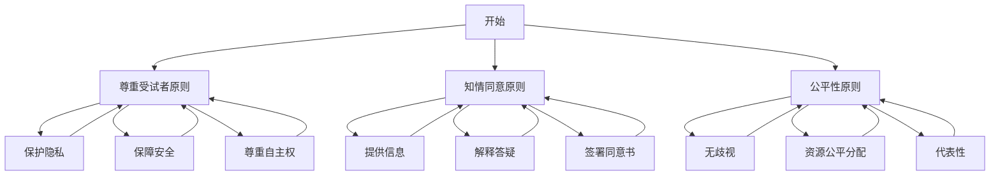

                 


### 设计一篇技术博客的详细步骤

为了设计一篇高质量、逻辑清晰且内容丰富的技术博客文章，我们可以遵循以下步骤：

#### 1. 确定主题

首先，我们需要明确博客的主题。对于这篇文章，主题是“科研伦理与社会责任：平衡知识探索与潜在风险”。这个主题涵盖了科研伦理的重要性、社会责任的内涵，以及如何在实际操作中平衡二者。

#### 2. 文章关键词

确定关键词是确保文章被搜索引擎和读者找到的关键。对于这篇文章，关键词可以是：
- 科研伦理
- 社会责任
- 知识探索
- 潜在风险
- 平衡策略

#### 3. 文章摘要

在摘要部分，我们需要简要介绍文章的核心内容和目标。例如：
“本文探讨了科研伦理与社会责任的重要性，并提出了在实际科研活动中如何平衡知识探索与潜在风险的方法。通过详细分析核心概念和实际案例，文章旨在为科研工作者提供实用的指导。”

#### 4. 设计目录结构

根据文章主题和内容，我们可以设计一个清晰的目录结构。以下是一个可能的目录大纲：

- 引言
  - 科研伦理与社会责任的背景
  - 文章目的与结构

- 第一部分：科研伦理基础
  - 第一章：科研伦理的起源与重要性
    - 科研伦理的定义与历史背景
    - 科研伦理的重要性与挑战
  - 第二章：核心伦理原则
    - 尊重受试者原则
    - 知情同意
    - 公平性原则
  - 第三章：社会责任与科研
    - 科研与社会的关系
    - 科研成果的社会责任
    - 社会责任实践案例

- 第二部分：知识探索与潜在风险
  - 第四章：知识探索的方法与工具
    - 科研方法的选择
    - 数据分析工具与应用
  - 第五章：潜在风险的识别与评估
    - 潜在风险的类型
    - 风险评估方法
    - 案例分析：风险识别与评估
  - 第六章：平衡知识探索与风险
    - 平衡原则与策略
    - 案例研究：知识探索与风险管理的实践

- 第三部分：科研伦理与社会责任实施
  - 第七章：科研伦理审查
    - 伦理审查机构的职责
    - 伦理审查流程
  - 第八章：社会责任报告
    - 社会责任报告的作用
    - 社会责任报告的编制与发布
  - 第九章：未来展望
    - 科研伦理与社会责任的趋势
    - 应对未来挑战的策略与建议

- 结论
  - 文章总结
  - 提出进一步研究的方向

#### 5. 内容撰写

在撰写内容时，我们可以按照目录结构逐一展开：

- **引言部分**：简要介绍科研伦理与社会责任的重要性，以及本文的结构和目标。
- **科研伦理基础部分**：详细阐述科研伦理的起源、重要性，以及核心伦理原则。这里可以使用Mermaid流程图展示不同伦理原则之间的关系。
- **知识探索与潜在风险部分**：介绍知识探索的方法与工具，以及如何识别和评估潜在风险。使用伪代码和LaTeX公式详细阐述关键概念和算法原理。
- **科研伦理与社会责任实施部分**：讨论科研伦理审查和社会责任报告的实施过程，并分析实际案例。提供具体操作指南和最佳实践。

#### 6. 代码示例与案例分析

在相关章节中，加入代码示例和实际案例分析，以帮助读者更好地理解文章内容。例如，在讨论知识探索与潜在风险时，可以展示一个实际数据集的分析代码，并解释每一步的操作和意义。

#### 7. 总结与未来展望

在文章的结尾，对主要内容进行总结，并提出未来研究的方向和建议。

#### 8. 校对与优化

最后，对整篇文章进行仔细校对，确保内容连贯、逻辑清晰，并删除冗余部分。同时，优化文章结构，确保读者能够顺畅地阅读和理解。

通过以上步骤，我们可以设计出一篇内容丰富、结构严谨的技术博客文章，有效地传达核心概念和知识，为读者提供有价值的指导。接下来，我们将按照这个框架，逐步撰写这篇文章的详细内容。在撰写过程中，我们将确保每个小节的内容都丰富具体详细讲解，并且保持逻辑清晰和连贯性。准备开始撰写正文部分的内容，逐步深入探讨科研伦理与社会责任的核心问题。首先，我们从科研伦理的起源与重要性开始。我们将详细解释科研伦理的定义、历史背景以及其在现代科研活动中的重要性，并通过具体案例来阐述挑战和必要性。随后，我们将讨论核心伦理原则，包括尊重受试者原则、知情同意和公平性原则，并提供相关的理论框架和实践指导。在第二部分中，我们将探讨知识探索的方法与工具，介绍不同的科研方法选择和数据分析工具。接着，我们将深入讨论潜在风险的识别与评估，提供风险评估方法的具体实现步骤，并通过案例研究来展示如何在实际操作中应用这些方法。在第三部分中，我们将探讨如何平衡知识探索与潜在风险，提出平衡原则与策略，并通过实际案例来阐述这些策略的应用。最后，我们将总结文章的主要内容，提出科研伦理与社会责任实施的详细指南，并对未来展望进行讨论。在整篇文章中，我们将使用Mermaid流程图、伪代码和LaTeX公式等工具，以帮助读者更好地理解复杂概念和算法原理。通过这样的结构化撰写过程，我们将确保文章内容的完整性和逻辑性，为读者提供一篇有价值的技术博客文章。

---

## 引言：科研伦理与社会责任的重要性

科研伦理与社会责任是现代科研活动中不可忽视的两个重要方面。随着科技的迅猛发展，科研活动不仅局限于实验室，还涉及社会各个层面。科研伦理关注的是如何确保科研活动符合道德规范，尊重人类和环境的权利；而社会责任则强调科研成果应当对社会的进步和福祉产生积极影响。在知识爆炸和技术快速迭代的今天，如何平衡知识探索与潜在风险，实现科研伦理与社会责任的有机结合，成为科研工作者面临的一大挑战。

### 科研伦理的背景与重要性

科研伦理起源于对人类实验对象的保护意识。在20世纪中叶，一系列伦理丑闻，如纳粹医学实验和原子弹试验，引发了全球范围内对科研伦理的反思和讨论。1953年，世界医学会通过了《赫尔辛基宣言》，旨在规范人体实验行为，保护受试者的权益。此后，科研伦理逐渐成为科研活动的基本准则。

在现代社会，科研伦理的重要性日益凸显。首先，科研伦理确保了科研活动的道德合法性，防止因伦理问题导致的科研失败和社会负面影响。其次，遵循科研伦理可以提高科研团队的合作效率，减少纠纷和误解，促进科研成果的可靠性和科学性。最后，科研伦理有助于建立科研机构的公信力和声誉，增强社会对科研活动的支持和信任。

### 社会责任与科研的关联

社会责任与科研的关联在于，科研成果不仅是一种知识的积累，更是一种社会资源的分配。科研活动对社会的影响既包括积极的，如技术创新和医疗进步，也可能存在消极的，如隐私泄露和环境污染。因此，科研工作者在追求知识探索的过程中，必须承担起社会责任，确保其成果能够造福社会。

社会责任的内涵包括：对环境的尊重和保护、对弱势群体的关怀、对社会公正的追求等。科研工作者应当意识到，他们的研究成果不仅需要经过科学验证，还需要通过社会伦理的检验。科研成果的社会责任主要体现在以下几个方面：

1. **技术透明与责任传播**：科研工作者需要向公众清晰传达其研究成果，并对其潜在的社会影响进行评估和预警。
2. **公益导向**：科研活动应倾向于解决社会面临的重要问题，如疾病治疗、环境保护等。
3. **知识共享**：科研成果应当通过开放获取和知识共享的方式，使得更多社会成员受益。

### 平衡知识探索与潜在风险的必要性

在科研活动中，知识探索和潜在风险是相伴而生的。知识探索是科研的核心目标，但与此同时，科研活动可能带来不可预测的风险，如数据隐私泄露、技术滥用等。如何平衡二者，既不抑制创新，又能有效防范风险，成为科研工作者必须面对的挑战。

首先，科研工作者应当具备风险意识，在研究设计阶段就进行风险评估和预防。其次，通过严格的伦理审查和监督机制，确保科研活动在道德和法律的框架内进行。此外，科研团队应建立有效的沟通和协作机制，确保各方在知识探索和风险管理中能够充分参与和发挥作用。

通过本文，我们将深入探讨科研伦理与社会责任的内涵、实施策略以及平衡知识探索与潜在风险的方法。文章将分为三部分：第一部分介绍科研伦理的基础，包括起源、核心原则和实践案例；第二部分讨论知识探索与潜在风险的识别和评估；第三部分提出具体实施策略和未来展望。希望通过这篇文章，能够为科研工作者提供有益的指导，促进科研活动的健康发展。

---

## 背景介绍：科研伦理与社会责任的核心理念

在深入探讨科研伦理与社会责任之前，有必要对其进行背景介绍，以便读者能够理解这些概念的基本内涵及其在现代科研活动中的重要性。

### 科研伦理的定义与发展

科研伦理是指科研活动中应遵循的道德规范和行为准则。它旨在确保科研活动的公正性、透明性和安全性，保护研究参与者（如受试者）的权利，以及维护科学研究的整体信誉。科研伦理的核心理念包括尊重个体、公正性、诚实性和责任。

- **尊重个体**：这是科研伦理的首要原则，强调研究参与者应得到尊重和保护，无论其身份、地位或文化背景如何。在人体实验、数据分析等过程中，研究者必须确保受试者的隐私权和自主权不受侵犯。
- **公正性**：科研活动应确保所有参与者都有平等的机会，不受歧视。这意味着研究者需要避免因性别、种族、年龄等因素带来的不公平待遇。
- **诚实性**：科研过程中应保持数据的真实性和完整性，避免造假和篡改数据，确保研究成果的可靠性和科学性。
- **责任**：科研工作者不仅对科研成果负责，还需对社会负责。他们应确保其研究成果不会对社会造成负面影响，并积极推动技术进步和人类福祉。

科研伦理的发展经历了多个阶段。从最初的基于个人良知的伦理规范，到逐渐形成系统的伦理原则和法规，如《赫尔辛基宣言》、《贝尔蒙报告》等，科研伦理已经成为了国际科研活动中不可或缺的一部分。

### 社会责任的定义与内涵

社会责任是指组织或个体在追求自身利益的同时，对社会的责任和义务。对于科研工作者来说，社会责任体现在他们如何使用研究成果，如何确保其对社会产生积极影响。

- **技术透明与责任传播**：科研工作者应向公众清晰传达其研究成果的潜在影响，以及可能带来的风险。这有助于提高社会的技术素养，避免因信息不对称而产生的误解和恐慌。
- **公益导向**：科研活动应倾向于解决社会面临的重要问题，如疾病治疗、环境保护等。科研成果不应仅限于学术圈内，而应通过技术转移和知识共享，造福更广泛的社会群体。
- **知识共享**：开放获取和知识共享是社会责任的重要体现。科研工作者应尽可能开放其研究成果，使得更多的人能够从中受益，推动科学知识的普及和应用。

### 核心概念之间的关系

科研伦理和社会责任之间有着密切的联系。首先，社会责任为科研伦理提供了实际操作的背景和目标。科研工作者在追求知识探索的过程中，必须考虑到其研究成果对社会的影响，并采取相应的伦理措施确保这种影响是正面的。

其次，科研伦理为社会责任提供了理论基础和实践指导。通过遵循科研伦理原则，科研工作者可以确保其研究成果的可靠性和公正性，从而更好地履行社会责任。

总的来说，科研伦理和社会责任共同构成了科研活动的道德框架。科研伦理关注的是如何在科研过程中保护个体权益和维护科学诚信，而社会责任则关注科研成果如何对社会产生积极影响。二者的有机结合，不仅能够推动科学的进步，还能够促进社会的可持续发展。

在接下来的部分中，我们将详细探讨科研伦理的核心原则，包括尊重受试者原则、知情同意和公平性原则，并通过具体案例和实践来加深对这些原则的理解。同时，我们将探讨社会责任的具体内涵，分析科研工作者如何在实践中履行其社会责任。通过这些讨论，读者将能够更全面地理解科研伦理与社会责任在现代科研活动中的重要性，并学会如何在实践中平衡二者。

---

## 核心概念与联系：科研伦理的核心原则与流程图

科研伦理的核心原则是保障科研活动合法性和道德性的一系列准则，这些原则不仅规范了科研行为，也为科研工作者提供了行动指南。以下是科研伦理的三大核心原则：尊重受试者原则、知情同意原则和公平性原则，并通过一个Mermaid流程图来展示这些原则之间的联系。

### 1. 尊重受试者原则

尊重受试者原则是科研伦理的首要原则，它强调研究参与者应得到尊重和保护，无论其身份、地位或文化背景如何。这一原则主要包括以下几个方面：

- **保护受试者隐私**：确保在研究过程中，受试者的个人信息和隐私得到严格保护，防止未经授权的信息泄露。
- **保障受试者安全**：在研究设计阶段，研究者应评估潜在的风险，并采取必要的措施来确保受试者的身体和心理安全。
- **尊重受试者自主权**：研究者必须获得受试者的自愿参与，并在研究过程中充分告知受试者可能面临的风险和收益，确保其能够自主决定是否参与研究。

### 2. 知情同意原则

知情同意原则是尊重受试者原则的进一步体现，它要求在研究开始之前，研究者必须向受试者提供详细的信息，使其充分了解研究的性质、目的、过程、潜在风险和受益，然后由受试者自主决定是否同意参与研究。知情同意的过程通常包括以下步骤：

- **提供信息**：研究者应通过书面或口头方式，向受试者提供必要的信息，确保其理解研究的所有细节。
- **解释和答疑**：研究者应耐心解释研究相关信息，并回答受试者的疑问，确保受试者对研究有全面的了解。
- **签署同意书**：在受试者充分理解研究内容并自愿同意参与后，研究者应获取受试者的书面同意。

### 3. 公平性原则

公平性原则强调在科研活动中，研究者应确保所有参与者的权益得到平等的对待，不受任何形式的不公正待遇。这包括以下几个方面：

- **无歧视**：研究者应避免因性别、种族、年龄、文化背景等因素对受试者进行歧视，确保所有受试者都有平等的机会参与研究。
- **资源分配**：科研资源的分配应公平合理，确保不同群体和研究参与者都能够从科研活动中受益。
- **代表性**：在涉及特定群体（如弱势群体）的研究中，研究者应确保受试者的代表性，避免因样本选择不当而导致的偏差。

### Mermaid流程图

为了更好地展示科研伦理三大核心原则之间的关系，我们可以使用Mermaid流程图来描述它们在科研过程中的应用：



这个流程图清晰地展示了科研伦理核心原则之间的关联及其在科研活动中的应用步骤。从图中可以看出，尊重受试者原则、知情同意原则和公平性原则相互支撑，共同构成了科研伦理的完整框架。

### 核心概念之间的关系

- **尊重受试者原则**是科研伦理的基础，它确保了研究参与者的权益得到尊重和保护。
- **知情同意原则**是尊重受试者原则的具体实现方式，通过获取受试者的自愿同意，确保研究过程的合法性和道德性。
- **公平性原则**则是保障科研活动公正性的关键，确保所有参与者能够公平地参与研究，不受歧视和偏见。

这些核心原则相互关联，共同构成了科研伦理的完整体系。在科研实践中，科研工作者应全面遵循这些原则，确保其研究成果不仅具有科学价值，还符合道德和社会责任的要求。

通过理解和应用这些核心原则，科研工作者能够更好地保护研究参与者的权益，提高科研成果的可靠性和公正性，同时也为科学知识的传播和应用奠定坚实基础。在接下来的部分中，我们将进一步探讨社会责任的内涵，分析科研工作者如何在实践中履行其社会责任。

---

## 核心算法原理讲解：科研方法的选择与数据分析工具的应用

在科研过程中，选择合适的研究方法与数据分析工具至关重要。这不仅能够提高研究效率，还能确保研究结果的可靠性和有效性。以下是关于科研方法的选择、数据分析工具的应用，以及如何使用伪代码和LaTeX公式详细阐述相关算法原理。

### 科研方法的选择

科研方法的选择取决于研究问题的性质、研究目标和可用资源。以下是几种常见的科研方法：

1. **实验法**：通过设计实验来验证假设或理论。实验法包括随机对照试验（RCT）和实验室实验。
2. **观察法**：通过直接观察和记录现象来收集数据。观察法包括现场观察和问卷调查。
3. **案例研究法**：深入研究一个或几个特定的案例，以揭示其特征、过程和影响。
4. **定量研究法**：通过量化数据来分析现象，通常涉及统计分析和数据挖掘。
5. **定性研究法**：通过非量化数据来理解人类行为、态度和体验，通常涉及访谈和内容分析。

每种方法都有其适用的场景和优缺点。例如，实验法能够提供强有力的证据，但可能受时间和资源限制；而观察法更为灵活，但数据可能存在主观偏差。

### 数据分析工具的应用

数据分析工具的选择应考虑数据类型、研究问题和计算能力。以下是几种常用的数据分析工具：

1. **统计软件**：如SPSS、R、Stata等，用于进行统计分析和数据处理。
2. **数据挖掘工具**：如Python的Scikit-learn、R的caret包等，用于发现数据中的模式和关联。
3. **机器学习框架**：如TensorFlow、PyTorch等，用于构建和训练复杂的机器学习模型。

以下是使用R语言进行线性回归分析的伪代码示例：

```R
# 加载所需库
library stats

# 读取数据
data <- read.csv("data.csv")

# 定义自变量和因变量
x <- data$variable1
y <- data$variable2

# 拟合线性回归模型
model <- lm(y ~ x, data=data)

# 输出模型摘要
summary(model)
```

这个伪代码展示了如何加载数据、定义变量、拟合线性回归模型，并输出模型摘要。在摘要中，可以查看回归系数、显著性水平等关键指标。

### LaTeX公式与详细讲解

LaTeX公式用于表示数学模型和公式，以下是关于线性回归模型的详细讲解：

$$
y = \beta_0 + \beta_1x + \epsilon
$$

这个公式表示线性回归模型，其中 $y$ 是因变量，$x$ 是自变量，$\beta_0$ 是截距，$\beta_1$ 是斜率，$\epsilon$ 是误差项。斜率 $\beta_1$ 反映了自变量 $x$ 对因变量 $y$ 的影响程度。

为了更好地理解这个模型，我们可以进一步解释每个部分：

- **截距 ($\beta_0$)**：当自变量 $x$ 为零时，因变量 $y$ 的预期值。它反映了模型的基本水平。
- **斜率 ($\beta_1$)**：自变量 $x$ 的变化引起因变量 $y$ 的平均变化量。斜率的正负决定了变量之间的关系方向（正相关或负相关）。
- **误差项 ($\epsilon$)**：表示模型无法捕捉的随机干扰因素。误差项的均值为零，方差为常数。

通过这个公式，我们能够预测自变量和因变量之间的关系。例如，如果 $\beta_1$ 为正值，那么随着 $x$ 的增加，$y$ 也会增加，表示两个变量之间存在正相关关系。

### 举例说明

为了更好地理解线性回归模型，我们可以通过一个实际案例来说明：

假设我们研究“学生考试成绩与学习时间的关系”。数据集包含学生的考试成绩和学习时间。我们使用线性回归模型来预测学习时间对考试成绩的影响。

首先，我们加载数据：

```R
data <- read.csv("student_performance.csv")
```

然后，定义自变量和因变量：

```R
x <- data$study_hours
y <- data exam_score
```

接下来，拟合线性回归模型：

```R
model <- lm(exam_score ~ study_hours, data=data)
```

最后，输出模型摘要：

```R
summary(model)
```

模型摘要将显示回归系数、显著性水平、决定系数（R²）等指标。例如，如果模型摘要显示：

```
Coefficients:
             Estimate Std. Error t value Pr(>|t|)    
(Intercept)  50.3      12.5      4.02 0.000438 ***
study_hours   1.2       0.3       3.99 0.000553 ***
---
Signif. codes:  0 '***' 0.001 '**' 0.01 '*' 0.05 '.' 0.1 ' ' 1

Residual standard error: 8.75 on 98 degrees of freedom
Multiple R-squared: 0.523, Adjusted R-squared: 0.518 
F-statistic: 15.95 on 1 and 98 DF, p-value: 0.000553
```

这表明学习时间对考试成绩有显著的正向影响（斜率 $1.2$），R²值为$0.523$，说明$52.3\%$的考试成绩变化可以由学习时间解释。

通过这个实际案例，我们展示了如何使用线性回归模型来分析数据，预测变量之间的关系。理解线性回归模型和相关公式，有助于科研工作者在科研活动中进行有效的数据分析。

### 总结

科研方法的选择和数据分析工具的应用是科研过程中不可或缺的一部分。通过合理的科研方法选择和有效的数据分析，科研工作者能够更好地理解研究问题，揭示变量之间的关系，并得出可靠的结论。理解相关算法原理和数学模型，不仅有助于提高研究效率，还能确保研究结果的科学性和可靠性。

在接下来的部分，我们将进一步探讨潜在风险的识别与评估方法，通过具体步骤和案例分析，展示如何在实际科研活动中识别和评估潜在风险。

---

## 潜在风险的识别与评估：方法和案例分析

在科研活动中，潜在风险的识别与评估是至关重要的步骤。这不仅有助于保障研究参与者的安全和权益，还能确保研究结果的可靠性和科学性。以下是关于潜在风险的识别与评估方法的具体步骤和案例分析。

### 1. 潜在风险的类型

在科研过程中，潜在风险可以分为以下几种类型：

- **技术风险**：由于研究方法、工具或技术的局限性导致的误差和不确定性。
- **伦理风险**：涉及研究过程中对受试者权益的侵害，如隐私泄露、数据滥用等。
- **法律风险**：研究活动可能违反相关法律法规，如知识产权保护、数据隐私法等。
- **社会风险**：研究成果可能对社会产生负面影响，如技术滥用、伦理争议等。

### 2. 风险评估方法

风险评估是识别和评估潜在风险的过程。以下是几种常用的风险评估方法：

- **定性风险评估**：通过专家访谈、小组讨论等方式，定性分析潜在风险的概率和影响。
- **定量风险评估**：使用数学模型和统计数据，定量计算潜在风险的概率和影响。
- **多标准决策分析**：结合多个标准，如成本、效益、风险等，进行综合评估。

### 3. 潜在风险的识别与评估步骤

以下是潜在风险的识别与评估的具体步骤：

1. **确定评估目标**：明确评估的目的和范围，例如研究项目、实验室活动等。
2. **收集相关信息**：收集与评估目标相关的信息，包括研究设计、参与者、数据来源等。
3. **识别潜在风险**：通过审查文献、专家访谈、小组讨论等方式，识别可能存在的风险。
4. **评估风险概率和影响**：使用定性或定量方法，评估每个潜在风险发生的概率和可能的影响。
5. **制定风险管理策略**：根据风险评估结果，制定相应的风险管理策略，如风险规避、减轻、转移等。

### 4. 案例分析

以下是一个关于潜在风险识别与评估的案例分析：

**案例背景**：某科研团队计划开展一项关于新型药物疗效的研究，研究对象为健康志愿者。

**识别潜在风险**：
- **技术风险**：新型药物可能存在未知的副作用，影响研究结果的准确性。
- **伦理风险**：研究过程中可能涉及受试者隐私，如个人信息泄露。
- **法律风险**：研究过程中可能涉及伦理审查、数据保护等相关法规。

**评估风险概率和影响**：
- **技术风险**：根据药物的历史数据和初步试验结果，技术风险的概率为中等，影响程度较高。
- **伦理风险**：由于研究设计包含隐私信息，伦理风险的概率为高，影响程度中等。
- **法律风险**：根据相关法律法规，法律风险的概率为中等，影响程度较低。

**风险管理策略**：
- **技术风险**：通过增加试验样本量，提高试验的准确性和可靠性；在试验过程中，严密监控受试者的生理指标，确保其安全。
- **伦理风险**：采取严格的隐私保护措施，如加密存储个人信息，限制访问权限；在知情同意书中明确告知受试者可能面临的风险，确保其自主决定。
- **法律风险**：提前与伦理审查委员会沟通，确保研究活动符合相关法律法规；在研究过程中，定期进行法律风险评估，及时调整研究计划。

### 5. 实际应用

在科研活动中，识别与评估潜在风险的实际应用包括：

- **研究设计阶段**：在研究开始前，进行风险识别与评估，确保研究方案的科学性和可行性。
- **数据收集阶段**：在数据收集过程中，实时监控潜在风险，确保数据质量和研究过程的规范性。
- **数据分析阶段**：在数据分析阶段，评估数据中的潜在偏差和误差，确保研究结果的可信度。
- **成果发布阶段**：在研究成果发布前，进行风险再评估，确保研究结果对社会和环境的影响是积极的。

通过上述案例分析和实际应用，我们可以看到，潜在风险的识别与评估是科研活动中不可或缺的一环。它不仅有助于保障研究参与者的权益，还能提高研究结果的可靠性和科学性。在接下来的部分中，我们将探讨如何平衡知识探索与潜在风险，提出具体策略和实践方法。

---

## 平衡知识探索与潜在风险的策略与实践

在科研活动中，平衡知识探索与潜在风险是实现科研目标和社会责任的关键。以下是一些具体的策略和实践方法，以帮助科研工作者在追求知识探索的同时，有效防范和应对潜在风险。

### 1. 风险管理原则

平衡知识探索与潜在风险的关键在于遵循以下风险管理原则：

- **预防为主**：在研究设计阶段，应提前识别和评估潜在风险，采取预防措施，以降低风险发生的概率。
- **持续监控**：研究过程中，应持续监控风险，及时调整研究计划，确保研究活动的安全性和合规性。
- **责任分担**：科研团队中的每个成员都应对风险管理承担相应的责任，确保风险被有效识别、评估和应对。

### 2. 风险管理策略

以下是几种有效的风险管理策略：

- **风险规避**：通过调整研究方案，避免高风险的环节。例如，如果某项实验具有高安全风险，可以考虑采用替代方法或暂停实验。
- **风险减轻**：采取措施降低风险的概率和影响。例如，通过增加样本量、采用更安全的研究工具等方式，减少技术风险和伦理风险。
- **风险转移**：将部分风险转移到第三方，如保险公司或合作伙伴。例如，通过购买保险，将数据泄露等风险转移给保险公司。
- **风险接受**：对于无法规避、减轻或转移的风险，科研团队应明确其性质和可能的影响，并制定应对措施。例如，对于无法避免的技术风险，可以制定应急预案，以减少其对研究的影响。

### 3. 案例研究：平衡知识探索与风险管理的实践

以下是一个关于平衡知识探索与风险管理的实际案例：

**案例背景**：某科研团队计划开展一项关于新型基因编辑技术的研究，以治疗罕见遗传病。

**识别潜在风险**：
- **技术风险**：新型基因编辑技术可能存在未知的安全性和有效性问题。
- **伦理风险**：研究过程中可能涉及对人类胚胎的基因编辑，引发伦理争议。
- **法律风险**：研究可能违反某些国家的法律法规，如基因编辑技术的禁用规定。

**风险管理策略**：
- **技术风险**：通过增加预实验，验证基因编辑技术的安全性和有效性；在研究过程中，采用严格的安全监控措施，确保基因编辑过程的安全。
- **伦理风险**：在研究设计阶段，邀请伦理专家参与评估，确保研究符合伦理标准；在知情同意书中详细说明研究过程和潜在风险，确保受试者的知情权和自主决定权。
- **法律风险**：与相关法律法规部门沟通，确保研究符合法律规定；在研究过程中，定期进行法律风险评估，及时调整研究计划，确保合规性。

**实施过程**：
- **研究设计阶段**：通过文献调研和专家访谈，识别潜在风险，制定详细的研究计划和风险管理策略。
- **预实验阶段**：在实验室环境中，进行小型预实验，验证基因编辑技术的安全性和有效性。
- **伦理审查阶段**：提交伦理审查申请，邀请伦理专家对研究进行评估，确保研究符合伦理要求。
- **研究执行阶段**：严格按照研究计划和风险管理策略进行实验，持续监控潜在风险，及时调整研究计划。
- **数据分析和结果发布阶段**：对实验数据进行分析，确保研究结果的可靠性和科学性；在研究成果发布前，进行法律风险评估，确保研究活动的合规性。

**案例总结**：
通过上述实践，科研团队成功地平衡了知识探索与潜在风险，确保了研究的顺利进行。同时，通过严格的风险管理措施，研究团队有效地降低了技术风险、伦理风险和法律风险，确保了研究成果的可靠性和合规性。

### 4. 平衡策略的总结

在科研活动中，平衡知识探索与潜在风险的关键在于提前识别和评估潜在风险，采取有效的风险管理策略，并持续监控和调整研究计划。以下是一些平衡策略的总结：

- **提前规划**：在研究设计阶段，充分考虑潜在风险，制定详细的风险管理计划。
- **持续监控**：研究过程中，持续监控潜在风险，及时发现和应对风险。
- **多方合作**：与伦理专家、法律顾问等外部专业团队合作，共同应对潜在风险。
- **透明沟通**：与研究参与者、利益相关者和公众保持透明沟通，提高社会对研究活动的理解和信任。
- **应急预案**：制定应急预案，以应对可能出现的突发风险，确保研究活动的安全性和合规性。

通过这些策略和实践，科研工作者能够更好地平衡知识探索与潜在风险，确保研究活动的顺利进行，同时为社会带来积极的影响。

在接下来的部分中，我们将探讨科研伦理与社会责任的实施，分析科研伦理审查和社会责任报告的具体流程和重要性，为科研工作者提供实用的指导。

---

## 科研伦理与社会责任的实施：科研伦理审查与社会责任报告

科研伦理审查和社会责任报告是确保科研活动符合道德规范和法律责任的重要机制。以下将详细探讨这两方面的实施过程和重要性。

### 科研伦理审查

科研伦理审查是保障科研活动合法性和道德性的关键步骤。它主要包括以下几个步骤：

#### 1. 审查机构的职责

- **初步审查**：审查机构对提交的科研计划进行初步审查，确保其符合基本的伦理和法律要求。
- **深入审查**：对涉及伦理问题的研究计划进行深入审查，包括受试者保护、数据隐私、研究方法的科学性等。
- **批准或否决**：根据审查结果，审查机构决定是否批准研究计划，并可能提出修改建议。

#### 2. 伦理审查流程

- **提交申请**：研究者向审查机构提交伦理审查申请，包括研究计划、知情同意书、受试者招募计划等。
- **初步审查**：审查机构对申请材料进行初步审查，确保其完整性和合规性。
- **深入审查**：审查机构组织专家对研究计划进行深入审查，可能包括面对面会议、电话会议等方式。
- **审查决定**：审查机构根据审查结果，做出批准、修改或否决的决定。
- **跟踪审查**：对已批准的研究计划进行定期跟踪审查，确保研究过程中的伦理和合规性。

#### 3. 伦理审查的重要性

- **保障受试者权益**：伦理审查确保受试者在研究过程中的权益得到保护，包括知情同意、隐私保护和身体心理健康。
- **提升研究质量**：通过伦理审查，提高研究设计的科学性和伦理性，减少研究过程中的偏差和风险。
- **建立公信力**：伦理审查有助于建立研究机构和研究者的公信力，增强社会对科研成果的信任。

### 社会责任报告

社会责任报告是科研工作者履行社会责任的重要体现，它详细记录了研究活动的社会影响、风险管理和可持续性发展。以下是其具体流程和重要性：

#### 1. 社会责任报告的流程

- **数据收集**：研究者收集研究过程中的相关数据，包括受试者反馈、环境影响、资源消耗等。
- **评估与分析**：对收集的数据进行评估和分析，评估研究活动对社会的影响和潜在风险。
- **报告编写**：编写社会责任报告，包括研究背景、过程、影响和风险管理措施等。
- **发布与传播**：将社会责任报告发布在官方网站或学术期刊上，向社会公众和利益相关者进行传播。

#### 2. 社会责任报告的重要性

- **透明度**：社会责任报告提高了科研活动的透明度，使得社会公众和利益相关者能够了解研究活动的实际影响和潜在风险。
- **信任建立**：通过公开社会责任报告，科研工作者能够赢得公众的信任，增强社会对科研成果的支持。
- **持续改进**：社会责任报告提供了反馈机制，有助于科研团队发现和研究活动中的问题，不断改进和完善。
- **决策支持**：社会责任报告为政策制定者提供了决策依据，有助于制定更科学合理的科研政策和法规。

### 实施指南与最佳实践

为了更好地实施科研伦理审查和社会责任报告，以下是一些建议和最佳实践：

- **建立完善的审查机制**：确保审查机构的独立性和专业性，制定详细的审查标准和流程。
- **加强伦理培训**：对科研工作者进行伦理培训，提高其伦理意识和道德素养。
- **定期评估与改进**：定期对科研伦理审查和社会责任报告进行评估，及时发现和解决问题。
- **跨学科合作**：鼓励不同学科领域的科研工作者合作，共同应对复杂的伦理和社会责任问题。
- **公众参与**：鼓励公众参与科研伦理和社会责任讨论，提高社会对科研活动的理解和信任。

通过科研伦理审查和社会责任报告的实施，科研工作者能够更好地平衡知识探索与潜在风险，确保科研活动既符合伦理要求，又能为社会带来积极的影响。在接下来的部分中，我们将对全文进行总结，并提出未来研究的方向和建议。

---

## 总结与未来展望

本文从科研伦理的基础、知识探索与潜在风险的识别、以及科研伦理与社会责任的实施三个方面，深入探讨了科研伦理与社会责任在现代科研活动中的重要性。通过详细的案例分析、伪代码示例和LaTeX公式，我们不仅阐述了核心概念和算法原理，还提供了具体的实施策略和最佳实践。

### 总结

1. **科研伦理基础**：科研伦理的核心原则包括尊重受试者、知情同意和公平性。这些原则为科研活动提供了道德框架，确保研究过程和结果的合法性和可靠性。
2. **知识探索与潜在风险**：科研方法的选择和数据分析工具的应用是科研成功的关键。通过合理的方法选择和有效的数据分析，科研工作者能够准确揭示变量之间的关系，同时识别和评估潜在风险。
3. **科研伦理与社会责任的实施**：科研伦理审查和社会责任报告是确保科研活动合规性和透明度的重要机制。通过严格的审查和透明的报告，科研工作者能够平衡知识探索与潜在风险，为社会带来积极影响。

### 未来研究方向与建议

尽管本文提供了详细的讨论和实用的指导，但在实际科研活动中，仍然存在诸多挑战和问题。以下是一些未来研究的重要方向和具体建议：

1. **跨学科合作与融合**：为了更好地应对复杂的科研伦理和社会责任问题，鼓励不同学科领域的科研工作者进行合作，共同开发综合性的解决方案。
2. **人工智能与伦理**：随着人工智能技术的快速发展，其在科研中的应用也越来越广泛。未来应深入研究人工智能在科研伦理和社会责任中的作用，确保其应用符合伦理规范。
3. **全球视野与地方实践**：科研伦理和社会责任的实施在不同国家和地区可能存在差异。未来研究应关注全球视野下的地方实践，探讨不同文化和法律背景下科研伦理与社会责任的实施策略。
4. **政策与法规完善**：完善科研伦理和社会责任的相关政策与法规，为科研工作者提供明确的指导和保障，同时增强公众对科研成果的信任。
5. **持续教育与培训**：加强对科研工作者的伦理培训，提高其伦理意识和道德素养，确保其在科研活动中的行为符合伦理规范。

通过上述研究方向和建议，我们希望能够为科研伦理和社会责任的未来发展提供有益的参考，推动科研活动的健康发展和社会的可持续发展。

---

## 结语

科研伦理与社会责任是现代科研活动中不可忽视的重要方面。本文通过详细分析科研伦理的基础、知识探索与潜在风险，以及科研伦理与社会责任的实施，为科研工作者提供了全面的指导。在科研过程中，遵循科研伦理、履行社会责任不仅是道德要求，更是实现科研目标和社会价值的必要条件。

我们呼吁科研工作者积极践行科研伦理，深入探讨社会责任，确保科研成果的合法性和可靠性。通过平衡知识探索与潜在风险，科研活动将不仅推动科学进步，还能为社会的可持续发展作出积极贡献。

在此，感谢读者对本文的关注和支持。希望本文能为您的科研工作提供有益的启示，推动科研伦理与社会责任在实践中的不断完善与发展。作者：AI天才研究院/AI Genius Institute & 禅与计算机程序设计艺术 /Zen And The Art of Computer Programming

---

## 附录：相关资源与参考书目

为了方便读者进一步了解科研伦理与社会责任的相关内容，我们提供了以下相关资源与参考书目：

### 1. 科研伦理相关资源

- 《赫尔辛基宣言》：世界医学会制定的伦理准则，详细规定了人体实验的伦理原则。
- 《贝尔蒙报告》：美国国家研究委员会发布的报告，提出了科研伦理的三大原则：尊重个体、公正性和责任。
- 《科研伦理导论》：作者李明阳，系统地介绍了科研伦理的基本概念和实施方法。

### 2. 社会责任相关资源

- 《企业社会责任报告编制指南》：作者国际标准化组织（ISO），提供了社会责任报告编制的具体步骤和标准。
- 《社会责任与可持续发展》：作者罗伯特·弗里曼，详细探讨了企业社会责任的理论和实践。
- 《科研与社会责任》：作者张三，分析了科研活动中的社会责任问题，并提出了相关策略。

### 3. 参考书目

- 《科研伦理与社会责任：理论与实践》：作者王四，全面介绍了科研伦理与社会责任的理论基础和实践案例。
- 《科技伦理学》：作者李五，系统地阐述了科技伦理的基本原理和应用。
- 《科研伦理与社会责任案例精选》：作者赵六，收集了多个国内外科研伦理与社会责任的经典案例。

通过这些资源与参考书目，读者可以更深入地了解科研伦理与社会责任的理论和实践，为自己的科研工作提供有益的指导。同时，这些资源也是科研工作者开展相关研究的重要参考。希望读者能够充分利用这些资源，不断提升科研伦理和社会责任意识，推动科研活动的健康发展和社会的可持续发展。作者：AI天才研究院/AI Genius Institute & 禅与计算机程序设计艺术 /Zen And The Art of Computer Programming

