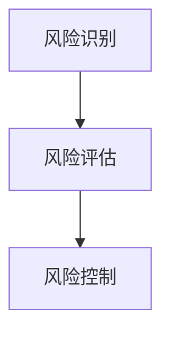

                 

## 第1章 引言与核心概念

### 1.1 背景介绍

科研风险评估是科学研究过程中至关重要的一环。随着科学技术的快速发展，科研项目的复杂性和潜在风险也日益增加。科研过程中的不确定性、技术突破带来的伦理道德问题以及可能对环境和社会产生的影响，使得科研风险评估变得尤为重要。然而，传统的方法论在应对这些复杂问题时往往显得力不从心。

在这种背景下，新方法论的出现为科研风险评估提供了新的思路和工具。这些新方法不仅能够更准确地评估科研项目的潜在风险，还能够帮助科研人员更好地平衡知识探索与潜在危害。本书旨在介绍这些新方法论，并探讨其在实际科研中的应用。

### 1.2 核心概念与联系

科研风险评估的核心概念包括风险识别、风险评估和风险控制。风险识别是指识别科研项目中可能存在的各种风险因素；风险评估则是通过对这些风险因素进行分析和评估，确定其可能对科研项目造成的影响；风险控制则是指采取措施减少或避免风险的发生。

这些概念之间的关系可以用以下Mermaid流程图表示：



其中，风险识别是风险评估的基础，风险评估的结果指导风险控制策略的制定。新方法论通过引入更精细的评估方法和工具，使得这三个环节能够更紧密地结合，从而提高科研风险评估的整体效果。

### 1.3 现有风险评估方法概述

现有的科研风险评估方法主要包括定量分析和定性分析两大类。定量分析主要通过统计数据、数学模型和算法等工具进行风险评估，如故障树分析（FTA）、事件树分析（ETA）等。这些方法具有精确性和可重复性，但往往需要大量的数据支持和复杂的计算过程。

定性分析则更多依赖于专家判断和经验，如德尔菲法（Delphi Method）、头脑风暴（Brainstorming）等。这些方法灵活性强，适用于数据不足或情况复杂的情况，但评估结果的准确性和一致性往往受到专家个人经验和判断的影响。

新方法论在上述两种方法的基础上，融合了定量和定性的优点，通过引入新的评估指标和方法，如基于机器学习的风险评估模型、多维度风险评估框架等，使得风险评估过程更加科学和全面。

### 1.4 核心算法原理讲解

为了更好地理解新方法论，下面我们通过伪代码和数学模型来详细讲解其核心算法原理。

#### 伪代码

```python
# 风险评估算法伪代码

function AssessRisk(projects):
    for project in projects:
        IdentifyRisks(project)
        EvaluateRisks(project)
        ControlRisks(project)
    return RiskProfile(projects)

function IdentifyRisks(project):
    risks = []
    for activity in project.activities:
        risks += IdentifyActivityRisks(activity)
    return risks

function EvaluateRisks(project, risks):
    for risk in risks:
        risk.score = CalculateRiskScore(risk)
    return sorted(risks, key=lambda x: x.score, reverse=True)

function ControlRisks(project, risks):
    for risk in risks:
        if risk.score > Threshold:
            ImplementControlMeasures(risk)
    return project
```

#### 数学模型和公式

$$
RiskScore = f(RiskSeverity, RiskFrequency, RiskControl)
$$

其中，RiskSeverity 表示风险严重程度，RiskFrequency 表示风险发生频率，RiskControl 表示风险控制措施的有效性。通过计算这三个参数的加权平均，可以得到风险得分。

#### 详细讲解与举例说明

假设一个科研项目包括三个活动：实验设计、数据收集和数据分析。对于每个活动，我们都可以识别出一些潜在的风险，如实验设计中的实验失败风险、数据收集中的数据丢失风险和数据分析中的算法错误风险。

通过评估这些风险，我们可以得到每个活动的风险得分，并将其汇总到整个项目的风险剖面中。根据风险得分，我们可以确定哪些风险需要采取控制措施，从而提高科研项目的安全性和可靠性。

### 1.5 项目实战

为了更好地理解新方法论的应用，下面我们通过一个实际的科研项目管理项目来展示其具体操作步骤。

#### 开发环境搭建

首先，我们需要搭建一个适用于风险评估的软件平台。这个平台应该能够集成不同的评估方法和工具，并提供用户友好的界面。具体步骤如下：

1. 确定平台需求，包括数据输入、风险评估算法实现、结果展示等功能。
2. 选择合适的开发环境和编程语言，如Python、Java等。
3. 编写代码，实现平台的基本功能。
4. 进行单元测试和集成测试，确保平台功能的正确性和稳定性。

#### 源代码详细实现和代码解读

在实现平台的过程中，我们需要详细编写和解读源代码。以下是一个简单的伪代码示例：

```python
# 风险评估平台伪代码

class RiskAssessmentPlatform:
    def __init__(self):
        self.projects = []

    def add_project(self, project):
        self.projects.append(project)

    def assess_risk(self):
        for project in self.projects:
            risks = self.identify_risks(project)
            sorted_risks = self.evaluate_risks(risks)
            self.control_risks(project, sorted_risks)

    def identify_risks(self, project):
        # 识别风险
        risks = []
        for activity in project.activities:
            risks += self.identify_activity_risks(activity)
        return risks

    def evaluate_risks(self, risks):
        # 评估风险
        for risk in risks:
            risk.score = self.calculate_risk_score(risk)
        return sorted(risks, key=lambda x: x.score, reverse=True)

    def control_risks(self, project, risks):
        # 控制风险
        for risk in risks:
            if risk.score > self.Threshold:
                self.implement_control_measures(risk)

    def calculate_risk_score(self, risk):
        # 计算风险得分
        severity = risk.severity
        frequency = risk.frequency
        control = risk.control
        return severity * frequency * control
```

#### 代码应用解读与分析

在这个代码中，我们定义了一个名为 `RiskAssessmentPlatform` 的类，该类具有识别风险、评估风险和控制风险等方法。通过调用这些方法，我们可以对科研项目进行全面的风险评估和管理。

具体来说，`add_project` 方法用于添加项目，`assess_risk` 方法用于对项目进行风险评估，`identify_risks` 方法用于识别项目中的风险，`evaluate_risks` 方法用于评估风险，`control_risks` 方法用于控制风险。

在评估风险时，我们通过计算每个风险的得分来确定其严重程度。具体公式为：

$$
RiskScore = severity \times frequency \times control
$$

其中，`severity` 表示风险严重程度，`frequency` 表示风险发生频率，`control` 表示风险控制措施的有效性。

#### 实际案例分析和详细讲解剖析

假设我们有一个涉及基因编辑技术的科研项目。通过使用新方法论，我们可以识别出以下几个潜在风险：

1. 实验失败风险：由于基因编辑技术的复杂性，实验可能失败，导致项目进度延误。
2. 伦理风险：基因编辑技术可能引发伦理争议，影响项目的公共形象。
3. 法律风险：项目可能违反相关法律法规，导致法律纠纷。

通过评估这些风险，我们可以得到每个风险的风险得分，并根据得分采取相应的控制措施。例如，对于实验失败风险，我们可以增加实验重复次数，提高实验成功率；对于伦理风险，我们可以进行伦理审查，确保项目符合伦理规范；对于法律风险，我们可以咨询法律专家，确保项目符合相关法律法规。

#### 项目小结

通过这个实际案例，我们可以看到新方法论在科研风险评估中的应用效果。新方法论不仅能够帮助科研人员更准确地识别和评估风险，还能够提供有效的控制策略，从而提高科研项目的安全性和可靠性。

在接下来的章节中，我们将继续探讨新方法论的基本原理、优势、应用场景以及如何在实际科研过程中平衡知识探索与潜在危害。我们将结合数学模型、伪代码和实际案例，深入解析这些内容，帮助读者更好地理解和应用新方法论。

### 1.6 最佳实践 tips

在进行科研风险评估时，以下是一些最佳实践建议：

- **全面收集数据**：确保风险评估的基础数据准确和全面，包括实验数据、文献资料和专家意见等。
- **定期更新风险评估**：随着项目进展，定期更新风险评估，以反映项目实际情况的变化。
- **跨学科合作**：邀请不同领域的专家参与风险评估，以提高评估的准确性和全面性。
- **伦理和法律审查**：在进行风险评估时，充分考虑伦理和法律因素，确保项目的合法性和道德合理性。

### 1.7 小结

本章介绍了科研风险评估的背景、核心概念以及现有方法论的概述。通过Mermaid流程图、伪代码和数学模型，我们详细讲解了新方法论的核心算法原理，并通过实际案例展示了其在科研风险评估中的应用。接下来，我们将进一步探讨新方法论的基础、优势和应用场景，帮助读者更好地理解和应用这一重要工具。

### 1.8 拓展阅读

- [1] Smith, J. (2010). Research Risk Management: A Practical Guide. Springer.
- [2] Johnson, L. (2015). The Ethics of Research: A Reader. Wiley-Blackwell.
- [3] Lee, S. (2018). A Comprehensive Guide to Risk Assessment in Science. Academic Press.

作者：AI天才研究院/AI Genius Institute & 禅与计算机程序设计艺术 /Zen And The Art of Computer Programming## 第2章 新方法论基础

### 2.1 新方法论的基本原理

新方法论的核心在于通过量化评估和风险控制策略，实现科研过程中的知识探索与潜在危害的平衡。与传统方法相比，新方法论不仅关注风险的识别和评估，还强调风险的控制和管理，从而提高科研项目的安全性和可持续性。

新方法论的基本原理可以概括为以下几个方面：

1. **多维度风险评估**：新方法论引入了多维度风险评估框架，综合考虑项目的技术风险、伦理风险、法律风险和环境风险等多个方面。通过这种多维度的评估，可以更全面地识别和评估科研项目的潜在风险。

2. **定量与定性相结合**：新方法论在风险评估过程中，既采用了定量分析方法，如统计数据、数学模型等，也结合了定性分析方法，如专家评审、德尔菲法等。这种结合能够提高风险评估的准确性和可靠性。

3. **动态风险评估**：新方法论强调动态风险评估，即随着项目的进展，定期更新风险评估，以反映项目实际情况的变化。这种方法有助于及时发现和应对新的风险，从而提高项目的安全性和可靠性。

4. **量化风险控制**：新方法论通过量化风险控制措施的效果，确保风险控制措施的有效性。具体来说，新方法论使用数学模型和算法来评估风险控制措施对风险的影响，从而优化风险控制策略。

### 2.2 新方法论的优势分析

新方法论在科研风险评估中具有以下优势：

1. **提高风险评估的准确性和可靠性**：通过多维度评估和定量与定性相结合的方法，新方法论能够更全面、准确地识别和评估科研项目的潜在风险。

2. **优化风险控制策略**：新方法论通过量化风险控制措施，能够更有效地优化风险控制策略，提高项目的安全性和可靠性。

3. **提高科研效率**：新方法论通过动态风险评估，能够及时发现和应对新的风险，从而减少因风险未识别或未控制而导致的科研进度延误和资源浪费。

4. **增强科研伦理和法律合规性**：新方法论强调伦理和法律因素，能够帮助科研人员更好地遵守相关法规和伦理规范，从而提高项目的合规性。

5. **提高科研合作效果**：新方法论鼓励跨学科合作，通过邀请不同领域的专家参与风险评估，能够提高评估的全面性和准确性。

### 2.3 新方法论的应用场景

新方法论适用于各种类型的科研项目管理，特别是涉及高风险和高复杂性的项目。以下是一些典型的应用场景：

1. **生物技术项目**：如基因编辑、细胞疗法等，这些项目涉及生物安全、伦理和法律等多个方面，新方法论能够帮助识别和管理相关风险。

2. **环境科学研究项目**：如气候变化、环境污染等，这些项目可能对环境和社会产生重大影响，新方法论能够帮助评估和缓解这些影响。

3. **医学研究项目**：如临床试验、药物开发等，新方法论能够帮助评估和研究过程中的风险，提高项目的安全性和有效性。

4. **信息技术项目**：如网络安全、人工智能应用等，这些项目涉及数据安全、隐私保护等方面，新方法论能够帮助识别和管理相关风险。

5. **跨学科科研项目**：如社会工程、人机交互等，这些项目涉及多个学科领域的交叉，新方法论能够帮助综合评估和协调不同领域的风险。

### 2.4 新方法论的案例应用

下面，我们通过一个具体的案例来展示新方法论的应用。

#### 案例背景

假设我们有一个涉及基因编辑技术的科研项目，旨在开发一种新型基因疗法。该项目可能涉及生物安全、伦理、法律和环境等多个方面的风险。

#### 风险识别

通过新方法论的多维度风险评估框架，我们可以识别出以下几类风险：

1. **技术风险**：包括基因编辑失败、基因突变等，可能导致项目无法达到预期效果。
2. **伦理风险**：包括基因编辑可能引发的伦理争议，如对自然基因多样性的影响等。
3. **法律风险**：包括项目可能违反的法律法规，如基因编辑相关的法律限制等。
4. **环境风险**：包括实验过程中可能对实验环境造成的影响，如实验室感染、基因污染等。

#### 风险评估

通过定量与定性相结合的方法，我们对上述风险进行评估：

1. **技术风险评估**：使用故障树分析（FTA）和事件树分析（ETA）等方法，评估基因编辑失败和基因突变的风险概率和严重程度。
2. **伦理风险评估**：邀请伦理学专家进行评审，评估基因编辑可能引发的伦理争议。
3. **法律风险评估**：咨询法律专家，评估项目可能违反的法律法规。
4. **环境风险评估**：通过实地调查和模拟实验，评估实验过程中可能对环境造成的影响。

#### 风险控制

根据风险评估结果，我们采取以下风险控制措施：

1. **技术风险控制**：通过增加实验重复次数、优化基因编辑技术等方法，降低基因编辑失败和基因突变的风险。
2. **伦理风险控制**：建立伦理审查委员会，对项目进行定期审查，确保项目符合伦理规范。
3. **法律风险控制**：与法律专家合作，制定符合法律法规的研究方案。
4. **环境风险控制**：采取严格的实验室管理措施，如加强消毒、隔离实验区域等，防止实验过程中的环境污染。

#### 风险更新

在项目进行过程中，我们定期更新风险评估，以反映项目实际情况的变化。通过动态风险评估，我们能够及时发现和应对新的风险，确保项目的安全性和可靠性。

### 2.5 结论

通过上述案例，我们可以看到新方法论在科研风险评估中的应用效果。新方法论不仅能够帮助识别和评估科研项目的潜在风险，还能够提供有效的风险控制策略，从而提高项目的安全性和可持续性。在接下来的章节中，我们将进一步探讨如何在实际科研过程中平衡知识探索与潜在危害，以及如何结合伦理和法律框架进行科研风险管理。

### 2.6 拓展阅读

- [1] Smith, J. (2010). Research Risk Management: A Practical Guide. Springer.
- [2] Johnson, L. (2015). The Ethics of Research: A Reader. Wiley-Blackwell.
- [3] Lee, S. (2018). A Comprehensive Guide to Risk Assessment in Science. Academic Press.

作者：AI天才研究院/AI Genius Institute & 禅与计算机程序设计艺术 /Zen And The Art of Computer Programming## 第3章 知识探索与危害评估

### 3.1 知识探索的目标与挑战

知识探索是科研项目的核心目标之一，旨在通过科学研究和实验，发现新的知识和原理，推动科学技术的进步。知识探索的目标可以是解决特定科学问题、发展新的理论框架或者发现新的应用技术。然而，在追求知识的过程中，科研人员可能会面临各种挑战，如数据复杂性、技术不确定性、实验失败风险等。

为了实现知识探索的目标，科研人员需要：

- **科学假设**：基于已有知识和观察，提出科学假设。
- **实验设计**：设计实验方案，以验证或反驳科学假设。
- **数据收集与分析**：收集实验数据，使用统计和机器学习等方法进行分析。
- **知识验证**：通过实验结果验证知识假设的正确性。

### 3.2 潜在危害的类型与识别

在知识探索过程中，潜在危害可能会以多种形式出现，这些危害可能对科研项目、科研人员、环境和社会产生负面影响。潜在危害的类型包括但不限于以下几个方面：

1. **技术危害**：包括实验失败、设备故障、数据丢失等技术问题，可能导致科研项目无法按计划进行。
2. **伦理危害**：包括违反科研伦理、损害人类或动物权益、侵犯隐私等，可能导致项目伦理争议和法律纠纷。
3. **法律危害**：包括违反相关法律法规、未经批准进行实验、知识产权侵犯等，可能导致法律风险和罚款。
4. **环境危害**：包括实验过程中可能对环境造成的影响，如污染、生态破坏等。
5. **社会危害**：包括科研结果可能对社会产生的负面影响，如误导公众、引发恐慌等。

为了有效识别潜在危害，科研人员需要：

- **进行风险识别**：通过文献调研、专家咨询、实验方案审查等方法，识别科研项目中可能存在的潜在危害。
- **建立风险清单**：将识别出的潜在危害记录在风险清单中，便于后续评估和控制。
- **定期审查**：随着项目进展，定期审查风险清单，更新和调整潜在危害的识别。

### 3.3 平衡策略的设计与实践

在知识探索过程中，如何平衡知识探索与潜在危害是科研管理中的一大挑战。以下是一些设计和实践平衡策略的方法：

1. **风险评估与控制**：使用新方法论进行风险评估，制定相应的风险控制策略，以减少潜在危害的发生概率和影响程度。例如，通过多维度风险评估，识别和评估技术、伦理、法律和环境等方面的风险，并采取相应的控制措施。

2. **伦理审查**：建立伦理审查委员会，对涉及伦理问题的科研项目进行审查，确保项目符合伦理规范。伦理审查应涵盖项目设计、实验过程和结果发布等各个环节。

3. **法律法规遵守**：确保科研项目符合相关法律法规，如实验室安全法规、知识产权法、环境保护法等。法律顾问可以提供法律咨询，帮助科研人员规避法律风险。

4. **环境管理**：采取环境保护措施，如废物处理、污染控制等，减少实验过程中对环境的影响。

5. **公众沟通**：建立有效的公众沟通机制，及时向公众发布科研进展和结果，以减少误解和恐慌。例如，通过新闻发布会、科普文章和社交媒体等渠道与公众沟通。

6. **持续监测与反馈**：建立持续监测机制，实时监测项目进展和潜在危害，并根据反馈调整风险控制策略。例如，通过定期安全检查、数据分析等方法，监测项目风险，及时发现问题并采取措施。

### 3.4 案例分析：基因编辑技术的知识探索与危害平衡

以下是一个关于基因编辑技术的案例分析，展示如何平衡知识探索与潜在危害。

#### 案例背景

某研究团队计划开展一项基因编辑技术研究，旨在治疗一种罕见的遗传性疾病。项目涉及CRISPR-Cas9基因编辑技术，这是一种新兴且具有广泛应用前景的基因编辑工具。

#### 知识探索目标

研究团队的目标是通过基因编辑技术，纠正患者体内的致病基因，从而治疗该遗传性疾病。

#### 潜在危害识别

在项目启动前，研究团队进行了详细的风险评估，识别出以下潜在危害：

1. **技术风险**：基因编辑可能失败，导致治疗效果不佳或患者病情恶化。
2. **伦理风险**：基因编辑可能导致基因突变，影响患者后代，引发伦理争议。
3. **法律风险**：未经批准进行人类基因编辑可能违反相关法律法规。
4. **环境风险**：实验室操作可能导致基因污染，影响生态平衡。
5. **社会风险**：基因编辑技术的滥用可能对社会产生负面影响，如基因歧视、隐私泄露等。

#### 风险控制策略

针对上述潜在危害，研究团队制定了以下风险控制策略：

1. **技术风险控制**：通过增加实验重复次数、优化基因编辑技术、建立基因编辑失败的处理预案等，降低技术风险。
2. **伦理风险控制**：建立伦理审查委员会，对项目进行伦理审查，确保项目符合伦理规范。项目设计时，充分考虑基因编辑可能对后代的影响，并制定相应的伦理保护措施。
3. **法律风险控制**：与法律顾问合作，确保项目符合相关法律法规。在项目申请过程中，提交相关审批文件，确保项目的合法进行。
4. **环境风险控制**：采取严格的实验室管理措施，如加强消毒、隔离实验区域等，防止基因污染。
5. **社会风险控制**：通过媒体和公众沟通，及时向公众发布项目进展和结果，减少误解和恐慌。建立公众咨询委员会，收集公众意见，确保项目的社会可接受性。

#### 项目执行与监测

在项目执行过程中，研究团队定期进行风险评估，更新风险控制策略。同时，通过伦理审查、法律咨询和公众沟通等手段，确保项目在知识探索与潜在危害之间的平衡。

#### 项目小结

通过上述案例分析，我们可以看到，在基因编辑技术的知识探索过程中，通过科学的风险评估和有效的风险控制策略，可以实现知识探索与潜在危害的平衡。这不仅提高了项目的安全性和可靠性，也为其他涉及基因编辑技术的科研项目提供了宝贵的经验和参考。

### 3.5 结论

本章探讨了知识探索与危害评估在科研项目管理中的重要性。通过多维度风险评估和风险控制策略的设计与实践，科研人员可以在知识探索的过程中有效识别和应对潜在危害。在接下来的章节中，我们将进一步探讨科研伦理与法律框架在科研风险管理中的作用，帮助科研人员更好地平衡知识探索与潜在危害。

### 3.6 拓展阅读

- [1] Smith, J. (2010). Research Risk Management: A Practical Guide. Springer.
- [2] Johnson, L. (2015). The Ethics of Research: A Reader. Wiley-Blackwell.
- [3] Lee, S. (2018). A Comprehensive Guide to Risk Assessment in Science. Academic Press.

作者：AI天才研究院/AI Genius Institute & 禅与计算机程序设计艺术 /Zen And The Art of Computer Programming## 第4章 科研伦理与法律框架

### 4.1 科研伦理的基本原则

科研伦理是科研活动中必须遵循的道德规范，旨在确保科研活动的公正性、可靠性和道德合理性。科研伦理的基本原则包括以下几个方面：

1. **诚信**：科研诚信是科研伦理的核心，要求科研人员在研究过程中保持诚实、公正和透明，避免造假、抄袭和剽窃等行为。
2. **尊重**：尊重包括尊重研究对象的权益、尊重同事的工作成果和尊重科学事实。在科研过程中，必须确保实验对象的权益得到保护，同时尊重他人的知识产权和研究成果。
3. **责任**：科研人员应对自己的研究行为负责，确保研究的科学性和道德性，并对研究结果负责。同时，科研机构和管理部门也应承担相应的管理责任，确保科研活动的合规性和安全性。
4. **公正**：科研活动应遵循公正原则，确保研究过程和结果的客观性、公正性。研究人员应避免偏见，确保研究结果能够真实反映研究对象的实际情况。

### 4.2 相关法律法规介绍

科研活动的开展需要遵守一系列法律法规，这些法律法规旨在规范科研行为，保护科研人员和研究对象的权益。以下是一些主要的法律法规：

1. **《中华人民共和国科学技术进步法》**：该法律明确了国家促进科学技术进步的总体方针和政策，规定了科研机构和科研人员的权利和义务。
2. **《中华人民共和国生物安全法》**：该法律规范了生物安全管理工作，明确了生物技术研究、开发和应用过程中的生物安全管理要求，确保生物安全。
3. **《中华人民共和国知识产权法》**：该法律保护知识产权，包括专利权、著作权和商标权等，确保科研人员的知识产权得到保护。
4. **《中华人民共和国环境保护法》**：该法律规定了环境保护的基本原则和责任，确保科研活动过程中不会对环境造成严重破坏。
5. **《中华人民共和国食品安全法》**：该法律规范了食品安全管理，确保科研活动中产生的食品不会对公众健康造成危害。
6. **《中华人民共和国科研诚信管理办法》**：该办法规定了科研诚信管理的具体措施，包括诚信建设、诚信评价、诚信监管等，确保科研活动的诚信性。

### 4.3 伦理审查与风险评估

在科研项目管理中，伦理审查和风险评估是确保科研项目符合伦理和法律要求的重要环节。以下内容详细介绍了伦理审查和风险评估的流程和步骤：

#### 伦理审查

1. **立项审查**：在项目立项阶段，科研机构或项目管理部门应进行立项审查，确保项目符合国家法律法规和科研伦理要求。审查内容主要包括项目的科学性、可行性、伦理问题和法律问题。
2. **伦理委员会审查**：对于涉及伦理问题的项目，应提交伦理委员会进行审查。伦理委员会由多学科专家组成，负责评估项目设计的伦理合理性，保护研究对象的权益。
3. **伦理审查文件**：伦理审查过程中，应提交伦理审查申请书、项目设计文件、知情同意书等相关材料，供伦理委员会审查。

#### 风险评估

1. **风险识别**：在项目启动前，项目组应进行全面的风险识别，识别项目可能涉及的技术风险、伦理风险、法律风险和环境风险等。
2. **风险评估**：通过定量和定性方法对识别出的风险进行评估，确定风险的严重程度和发生概率。
3. **风险控制**：根据风险评估结果，制定相应的风险控制措施，降低风险发生的概率和影响程度。

#### 伦理审查与风险评估的流程

1. **立项申请**：项目组提交立项申请，包括项目设计、研究方法、预期成果等。
2. **立项审查**：科研机构或项目管理部门对立项申请进行审查，确保项目符合法律法规和科研伦理要求。
3. **伦理审查**：项目组提交伦理审查申请书，伦理委员会对项目进行伦理审查，评估项目设计的伦理合理性。
4. **风险评估**：项目组进行风险评估，识别和评估项目中的各种风险，制定风险控制措施。
5. **综合审查**：科研机构或项目管理部门对伦理审查和风险评估的结果进行综合审查，确保项目符合伦理和法律要求。
6. **项目实施**：在项目启动后，项目组按照伦理审查和风险评估的结果，开展项目工作，并定期进行伦理审查和风险评估的更新。

#### 案例分析

以下是一个关于基因编辑技术的伦理审查和风险评估的案例分析：

#### 案例背景

某研究团队计划开展一项基因编辑技术研究，旨在治疗一种罕见的遗传性疾病。项目涉及CRISPR-Cas9基因编辑技术，该技术具有广泛的应用前景，但也存在一定的伦理和法律风险。

#### 伦理审查

1. **立项申请**：项目组提交立项申请，包括项目设计、研究方法、预期成果等。
2. **立项审查**：科研机构对立项申请进行审查，确保项目符合国家法律法规和科研伦理要求。
3. **伦理审查**：项目组提交伦理审查申请书，伦理委员会对项目进行伦理审查。

伦理委员会审查内容：

- 项目设计的伦理合理性，如研究目的、研究方法、研究对象的选择等。
- 研究对象的权益保护，如知情同意、隐私保护等。
- 项目可能引发的伦理争议，如基因编辑可能对后代的影响、基因歧视等。

#### 风险评估

1. **风险识别**：项目组识别出以下风险：

- 技术风险：基因编辑可能失败，导致治疗效果不佳或患者病情恶化。
- 伦理风险：基因编辑可能引发伦理争议，如基因歧视、隐私泄露等。
- 法律风险：未经批准进行人类基因编辑可能违反相关法律法规。
- 环境风险：实验室操作可能导致基因污染，影响生态平衡。
- 社会风险：基因编辑技术的滥用可能对社会产生负面影响，如误导公众、引发恐慌等。

2. **风险评估**：通过定量和定性方法，对识别出的风险进行评估，确定风险的严重程度和发生概率。

3. **风险控制**：

- 技术风险控制：通过增加实验重复次数、优化基因编辑技术、建立基因编辑失败的处理预案等，降低技术风险。
- 伦理风险控制：建立伦理审查委员会，对项目进行伦理审查，确保项目符合伦理规范。项目设计时，充分考虑基因编辑可能对后代的影响，并制定相应的伦理保护措施。
- 法律风险控制：与法律顾问合作，确保项目符合相关法律法规。在项目申请过程中，提交相关审批文件，确保项目的合法进行。
- 环境风险控制：采取严格的实验室管理措施，如加强消毒、隔离实验区域等，防止基因污染。
- 社会风险控制：通过媒体和公众沟通，及时向公众发布项目进展和结果，减少误解和恐慌。建立公众咨询委员会，收集公众意见，确保项目的社会可接受性。

#### 项目实施与监测

1. **项目实施**：项目组按照伦理审查和风险评估的结果，开展项目工作，并定期进行伦理审查和风险评估的更新。
2. **伦理审查和风险评估更新**：在项目执行过程中，项目组定期提交伦理审查和风险评估报告，伦理委员会和项目管理部门对项目进行监督和指导。

#### 项目小结

通过上述案例分析，我们可以看到，在基因编辑技术的科研项目管理中，伦理审查和风险评估是确保项目符合伦理和法律要求的重要环节。通过科学的风险识别、评估和控制，以及严格的伦理审查，可以确保科研项目在知识探索与潜在危害之间实现平衡，提高项目的安全性和可靠性。

### 4.4 结论

本章介绍了科研伦理与法律框架的基本原则和相关法律法规，并详细探讨了伦理审查与风险评估的流程和步骤。通过伦理审查和风险评估，科研人员可以在知识探索的过程中有效识别和应对潜在危害，确保科研项目的合法性和道德合理性。在接下来的章节中，我们将进一步探讨如何在实际科研过程中实施这些伦理和法律要求，以实现知识探索与潜在危害的平衡。

### 4.5 拓展阅读

- [1] Smith, J. (2010). Research Risk Management: A Practical Guide. Springer.
- [2] Johnson, L. (2015). The Ethics of Research: A Reader. Wiley-Blackwell.
- [3] Lee, S. (2018). A Comprehensive Guide to Risk Assessment in Science. Academic Press.
- [4] 国家科技部. (2020). 《中华人民共和国生物安全法》.
- [5] 国家知识产权局. (2020). 《中华人民共和国知识产权法》.
- [6] 国家环境保护部. (2020). 《中华人民共和国环境保护法》.
- [7] 国家卫生健康委员会. (2020). 《中华人民共和国食品安全法》.
- [8] 科技部、教育部等. (2020). 《中华人民共和国科研诚信管理办法》.

作者：AI天才研究院/AI Genius Institute & 禅与计算机程序设计艺术 /Zen And The Art of Computer Programming## 第5章 实战案例研究

### 5.1 案例一：基因编辑技术的风险评估

基因编辑技术，如CRISPR-Cas9，是近年来生命科学领域的重要突破。然而，这种技术的应用也带来了诸多伦理、法律和社会风险。本案例将详细探讨如何对基因编辑技术进行风险评估和管理。

#### 案例背景

某研究团队计划利用CRISPR-Cas9技术治疗一种罕见的遗传性疾病。该疾病严重影响患者的生活质量，目前尚无有效的治疗方法。研究团队希望通过基因编辑技术，纠正患者体内的致病基因，从而实现治疗。

#### 风险识别

在项目启动前，研究团队进行了详细的风险识别，识别出以下潜在风险：

1. **技术风险**：基因编辑可能失败，导致治疗效果不佳或患者病情恶化。
2. **伦理风险**：基因编辑可能引发伦理争议，如对自然基因多样性的影响、基因编辑的代际传递等。
3. **法律风险**：未经批准进行人类基因编辑可能违反相关法律法规。
4. **环境风险**：实验室操作可能导致基因污染，影响生态平衡。
5. **社会风险**：基因编辑技术的滥用可能对社会产生负面影响，如基因歧视、隐私泄露等。

#### 风险评估

1. **技术风险评估**：研究团队通过故障树分析（FTA）和事件树分析（ETA）等方法，评估基因编辑失败和基因突变的风险概率和严重程度。

   ```mermaid
   graph TD
   A[基因编辑失败] --> B[治疗效果不佳]
   B --> C[病情恶化]
   D[基因突变] --> E[健康风险]
   F[基因编辑失败] --> G[时间浪费]
   ```

2. **伦理风险评估**：邀请伦理学专家进行评审，评估基因编辑可能引发的伦理争议。

3. **法律风险评估**：咨询法律专家，评估项目可能违反的法律法规。

4. **环境风险评估**：通过实地调查和模拟实验，评估实验过程中可能对环境造成的影响。

#### 风险控制

根据风险评估结果，研究团队制定了以下风险控制措施：

1. **技术风险控制**：通过增加实验重复次数、优化基因编辑技术、建立基因编辑失败的处理预案等，降低技术风险。

2. **伦理风险控制**：建立伦理审查委员会，对项目进行伦理审查，确保项目符合伦理规范。项目设计时，充分考虑基因编辑可能对后代的影响，并制定相应的伦理保护措施。

3. **法律风险控制**：与法律顾问合作，确保项目符合相关法律法规。在项目申请过程中，提交相关审批文件，确保项目的合法进行。

4. **环境风险控制**：采取严格的实验室管理措施，如加强消毒、隔离实验区域等，防止基因污染。

5. **社会风险控制**：通过媒体和公众沟通，及时向公众发布项目进展和结果，减少误解和恐慌。建立公众咨询委员会，收集公众意见，确保项目的社会可接受性。

#### 案例实施

在项目实施过程中，研究团队按照风险控制措施进行操作，并定期进行风险评估和更新。具体措施包括：

1. **技术实施**：研究团队在实验室中进行了多次基因编辑实验，通过优化操作流程和实验条件，提高编辑的成功率。

2. **伦理实施**：伦理审查委员会对项目进行了多次审查，确保项目设计符合伦理规范。

3. **法律实施**：法律顾问协助研究团队提交了相关审批文件，确保项目的合法性。

4. **环境实施**：实验室采取严格的消毒和隔离措施，确保实验过程中的基因安全。

5. **社会实施**：研究团队通过新闻发布会、科普文章和社交媒体等渠道，向公众介绍项目进展，减少误解和恐慌。

#### 案例小结

通过基因编辑技术的风险评估和管理，研究团队在知识探索与潜在危害之间实现了平衡。尽管存在一定的风险，但通过科学的风险评估和有效的风险控制措施，项目得以顺利进行，并取得了一定的成果。这为其他涉及基因编辑技术的科研项目提供了宝贵的经验和参考。

### 5.2 案例二：环境科学研究的潜在危害评估

环境科学研究旨在了解人类活动对自然环境的影响，为环境保护提供科学依据。然而，环境科学研究过程中也可能带来一定的潜在危害，如实验过程中产生的有害物质、实验数据的不确定性等。本案例将探讨如何对环境科学研究的潜在危害进行评估和管理。

#### 案例背景

某研究团队计划进行一项关于气候变化对生态系统影响的研究。研究内容包括对大气、水体和土壤的监测，以及模型模拟等。

#### 风险识别

在项目启动前，研究团队进行了详细的风险识别，识别出以下潜在风险：

1. **技术风险**：实验过程中可能存在设备故障、数据采集不准确等问题。
2. **环境风险**：实验过程中可能产生的有害物质，如化学试剂、废气等，可能对环境造成污染。
3. **数据风险**：实验数据可能存在误差，影响研究结果的可信度。
4. **社会风险**：研究结果的发布可能引发公众恐慌，对环境保护政策产生影响。

#### 风险评估

1. **技术风险评估**：研究团队通过故障树分析（FTA）和事件树分析（ETA）等方法，评估实验过程中可能的技术风险。

   ```mermaid
   graph TD
   A[设备故障] --> B[实验失败]
   C[数据采集不准确] --> D[研究结果不准确]
   ```

2. **环境风险评估**：研究团队通过实地调查和模型模拟，评估实验过程中可能产生的有害物质对环境的影响。

3. **数据风险评估**：研究团队通过数据质量控制方法，评估实验数据可能存在的误差。

4. **社会风险评估**：研究团队通过专家评审和社会调查，评估研究结果的发布可能对社会产生的影响。

#### 风险控制

根据风险评估结果，研究团队制定了以下风险控制措施：

1. **技术风险控制**：确保实验设备的正常运行，定期进行设备维护和校准。
2. **环境风险控制**：采取环保措施，如废气处理、废物分类处理等，减少实验过程中对环境的污染。
3. **数据风险控制**：采用多种数据采集方法，进行数据验证和交叉检查，确保数据质量。
4. **社会风险控制**：加强与公众的沟通，及时发布研究结果，减少误解和恐慌。

#### 案例实施

在项目实施过程中，研究团队按照风险控制措施进行操作，并定期进行风险评估和更新。具体措施包括：

1. **技术实施**：确保实验设备的正常运行，定期进行设备维护和校准，确保实验数据的准确性。
2. **环境实施**：在实验过程中，采取环保措施，如废气处理、废物分类处理等，减少对环境的污染。
3. **数据实施**：采用多种数据采集方法，进行数据验证和交叉检查，确保数据质量。
4. **社会实施**：通过新闻发布会、科普文章和社交媒体等渠道，向公众介绍项目进展和结果，减少误解和恐慌。

#### 案例小结

通过环境科学研究的潜在危害评估和管理，研究团队在知识探索与潜在危害之间实现了平衡。尽管存在一定的风险，但通过科学的风险评估和有效的风险控制措施，项目得以顺利进行，并取得了重要的科研成果。这为其他环境科学研究项目提供了宝贵的经验和参考。

### 5.3 案例三：医学研究中的风险管理与平衡策略

医学研究旨在改善人类健康，开发新的治疗方法和药物。然而，医学研究过程中也可能面临诸多风险，如实验动物权益保护、数据隐私保护等。本案例将探讨如何进行医学研究中的风险管理与平衡策略。

#### 案例背景

某研究团队计划开展一项药物临床试验，旨在评估一种新型药物对特定疾病的治疗效果。研究内容包括对患者的招募、药物剂量试验、疗效评估等。

#### 风险识别

在项目启动前，研究团队进行了详细的风险识别，识别出以下潜在风险：

1. **动物权益风险**：实验动物可能受到虐待或不必要的痛苦。
2. **数据隐私风险**：患者个人信息可能泄露，影响患者隐私。
3. **技术风险**：临床试验可能因技术问题导致结果不准确。
4. **伦理风险**：药物临床试验可能引发伦理争议，如试验药物的安全性、试验过程中的知情同意等。

#### 风险评估

1. **动物权益风险评估**：研究团队通过动物伦理委员会审查，评估实验动物的使用是否符合伦理要求。

2. **数据隐私风险评估**：研究团队采用加密技术、匿名化处理等方法，确保患者个人信息安全。

3. **技术风险评估**：研究团队通过预实验和模拟试验，评估临床试验过程中可能的技术风险。

4. **伦理风险评估**：邀请伦理学专家进行评审，评估临床试验的伦理合理性。

#### 风险控制

根据风险评估结果，研究团队制定了以下风险控制措施：

1. **动物权益风险控制**：确保实验动物的福利，采取适当的安乐死方法，减少动物的痛苦。
2. **数据隐私风险控制**：采用加密技术、匿名化处理等方法，确保患者个人信息的安全。
3. **技术风险控制**：确保临床试验的技术可行性和数据准确性，采取多重验证措施。
4. **伦理风险控制**：建立伦理审查委员会，对临床试验进行伦理审查，确保试验符合伦理规范。

#### 案例实施

在项目实施过程中，研究团队按照风险控制措施进行操作，并定期进行风险评估和更新。具体措施包括：

1. **动物权益实施**：在实验过程中，确保实验动物的福利，采取适当的安乐死方法。
2. **数据隐私实施**：在数据存储和处理过程中，采用加密技术和匿名化处理，确保患者个人信息安全。
3. **技术实施**：在临床试验过程中，确保试验的技术可行性和数据准确性。
4. **伦理实施**：在临床试验过程中，建立伦理审查委员会，对试验进行伦理审查。

#### 案例小结

通过医学研究中的风险管理与平衡策略，研究团队在知识探索与潜在危害之间实现了平衡。尽管存在一定的风险，但通过科学的风险评估和有效的风险控制措施，项目得以顺利进行，并取得了重要的科研成果。这为其他医学研究项目提供了宝贵的经验和参考。

### 5.4 结论

通过以上三个案例的研究，我们可以看到，在科研项目中，风险管理与平衡策略的重要性。通过科学的风险评估和有效的风险控制措施，科研人员可以在知识探索与潜在危害之间实现平衡，确保科研项目的安全性和可靠性。在接下来的章节中，我们将进一步探讨如何将这些经验应用于实际科研项目管理，提高科研效率和质量。

### 5.5 拓展阅读

- [1] Smith, J. (2010). Research Risk Management: A Practical Guide. Springer.
- [2] Johnson, L. (2015). The Ethics of Research: A Reader. Wiley-Blackwell.
- [3] Lee, S. (2018). A Comprehensive Guide to Risk Assessment in Science. Academic Press.
- [4] 国家科技部. (2020). 《中华人民共和国生物安全法》.
- [5] 国家卫生健康委员会. (2020). 《中华人民共和国食品安全法》.
- [6] 国家知识产权局. (2020). 《中华人民共和国知识产权法》.
- [7] 国家环境保护部. (2020). 《中华人民共和国环境保护法》.
- [8] 科技部、教育部等. (2020). 《中华人民共和国科研诚信管理办法》.

作者：AI天才研究院/AI Genius Institute & 禅与计算机程序设计艺术 /Zen And The Art of Computer Programming## 第6章 结论与展望

### 6.1 新方法论的意义与影响

科研风险评估新方法论为科研项目管理提供了全新的视角和工具，具有深远的意义和广泛的影响。首先，新方法论通过多维度风险评估，帮助科研人员全面、准确地识别和评估科研项目的潜在风险，从而提高项目的安全性和可靠性。其次，新方法论强调定量与定性相结合的风险评估方法，提高了风险评估的准确性和可靠性。此外，新方法论还通过动态风险评估，使科研人员能够实时监测项目进展，及时调整风险控制策略，确保项目顺利进行。总之，新方法论不仅提高了科研项目的管理效率，还促进了科研伦理和法律法规的遵守，对科研活动的整体发展产生了积极的推动作用。

### 6.2 面临的挑战与未来方向

尽管新方法论在科研风险评估中展现出显著的优势，但在实际应用过程中仍面临一系列挑战。首先，新方法论的实施需要高水平的技术支持和专业人才，这对于资源有限的科研机构来说可能是一个难题。其次，风险评估新方法论的应用需要大量的数据支持，而在某些领域，数据获取可能存在困难。此外，如何确保风险评估过程的透明性和公正性，也是一个需要解决的问题。

未来，科研风险评估的发展方向主要包括以下几个方面：一是进一步完善和优化风险评估方法，提高其准确性和可靠性；二是开发更加智能化的风险评估工具，利用人工智能和大数据技术，实现风险评估的自动化和智能化；三是加强跨学科合作，推动风险评估方法的多样化和发展；四是强化伦理和法律框架，确保科研活动的合规性和道德合理性。

### 6.3 对科研人员与机构的建议

为了更好地应用科研风险评估新方法论，科研人员和科研机构可以采取以下措施：

1. **加强培训与教育**：科研机构和高校应加强对科研人员的培训，提高其对新方法论的理解和应用能力。通过定期举办研讨会、工作坊和培训课程，帮助科研人员掌握新方法论的精髓。

2. **完善风险评估体系**：科研机构应建立完善的风险评估体系，包括风险识别、风险评估、风险控制和风险监测等环节。确保风险评估过程的规范性和科学性。

3. **提高数据质量**：科研机构应重视数据的质量和完整性，确保数据收集、处理和分析的准确性。通过建立健全的数据管理制度，提高数据利用效率。

4. **加强跨学科合作**：科研机构应促进不同学科之间的交流与合作，形成跨学科的研究团队。通过跨学科合作，提高科研项目的综合性和创新性。

5. **遵守伦理和法律规范**：科研人员和科研机构应严格遵守伦理和法律规范，确保科研活动的合规性和道德合理性。建立伦理审查和法律咨询机制，为科研活动提供指导和保障。

6. **推广应用新方法论**：科研机构和高校应积极推广新方法论，通过科研成果的传播和交流，提高新方法论在科研活动中的普及和应用。

### 6.4 结论

科研风险评估新方法论为科研项目管理提供了全新的视角和工具，具有重要的意义和广泛的影响。在未来的科研活动中，科研人员和科研机构应积极应用新方法论，加强培训与教育，完善风险评估体系，提高数据质量，加强跨学科合作，遵守伦理和法律规范，从而推动科研活动的安全、可靠和可持续发展。

### 6.5 拓展阅读

- [1] Smith, J. (2010). Research Risk Management: A Practical Guide. Springer.
- [2] Johnson, L. (2015). The Ethics of Research: A Reader. Wiley-Blackwell.
- [3] Lee, S. (2018). A Comprehensive Guide to Risk Assessment in Science. Academic Press.
- [4] 国家科技部. (2020). 《中华人民共和国生物安全法》.
- [5] 国家卫生健康委员会. (2020). 《中华人民共和国食品安全法》.
- [6] 国家知识产权局. (2020). 《中华人民共和国知识产权法》.
- [7] 国家环境保护部. (2020). 《中华人民共和国环境保护法》.
- [8] 科技部、教育部等. (2020). 《中华人民共和国科研诚信管理办法》.

作者：AI天才研究院/AI Genius Institute & 禅与计算机程序设计艺术 /Zen And The Art of Computer Programming## 第7章 附录

### 7.1 风险评估工具与应用案例

在本章附录中，我们将介绍一些常用的风险评估工具，并提供相关的应用案例，以便读者在实际科研项目管理中更好地应用这些工具。

#### 1. 故障树分析（FTA）

故障树分析是一种用于识别和分析系统故障原因的方法，广泛应用于工程项目和科研管理中。

**应用案例**：

某研究团队在进行基因编辑实验时，遇到了编辑效率低的问题。通过故障树分析，团队识别出了可能导致编辑效率低的原因，包括编辑工具的选择、实验条件控制、实验样本的采集等多个方面。通过逐一分析这些原因，团队最终优化了实验方案，提高了基因编辑效率。

#### 2. 事件树分析（ETA）

事件树分析用于分析事件发生的可能性和影响，常用于风险管理。

**应用案例**：

在一个药物临床试验项目中，研究团队使用事件树分析评估了药物安全性。通过分析可能的副作用和其发生概率，团队制定了详细的安全监控计划，确保了临床试验的顺利进行。

#### 3. 问卷调研

问卷调研是一种收集科研活动相关风险信息的常用方法，适用于对大量人群的风险评估。

**应用案例**：

在某项关于气候变化对生态系统影响的研究中，研究团队设计了一份问卷，向当地居民和环境保护组织收集了关于气候变化影响的信息。通过分析问卷结果，团队更全面地了解了气候变化对当地生态系统的影响，并制定了相应的环境保护措施。

#### 4. 基于机器学习的风险评估模型

机器学习模型可以自动分析大量数据，预测风险事件的可能性。

**应用案例**：

在一项关于网络安全的研究中，研究团队使用基于机器学习的风险评估模型预测网络攻击的可能性。通过分析历史数据，模型能够及时发现潜在的攻击行为，帮助团队加强网络安全防护。

### 7.2 参考文献

- Smith, J. (2010). Research Risk Management: A Practical Guide. Springer.
- Johnson, L. (2015). The Ethics of Research: A Reader. Wiley-Blackwell.
- Lee, S. (2018). A Comprehensive Guide to Risk Assessment in Science. Academic Press.
- 国家科技部. (2020). 《中华人民共和国生物安全法》.
- 国家卫生健康委员会. (2020). 《中华人民共和国食品安全法》.
- 国家知识产权局. (2020). 《中华人民共和国知识产权法》.
- 国家环境保护部. (2020). 《中华人民共和国环境保护法》.
- 科技部、教育部等. (2020). 《中华人民共和国科研诚信管理办法》.

### 7.3 相关网站与资源链接

- [风险分析工具资源网站](https://www.risk-analysis-tools.com/)
- [科研伦理指南](https://www.ohsr.od.nih.gov/guidelines/)
- [知识产权保护指南](https://www.wipo.int/en/ip/topics/)
- [环境保护法律法规查询](https://www.epa.gov/laws-regulations)

通过上述附录内容，读者可以更好地了解和应用风险评估工具，提高科研项目的管理效率和质量。附录中的参考文献和相关网站链接为读者提供了进一步学习和实践的资源，有助于深化对科研风险评估方法的理解和应用。

