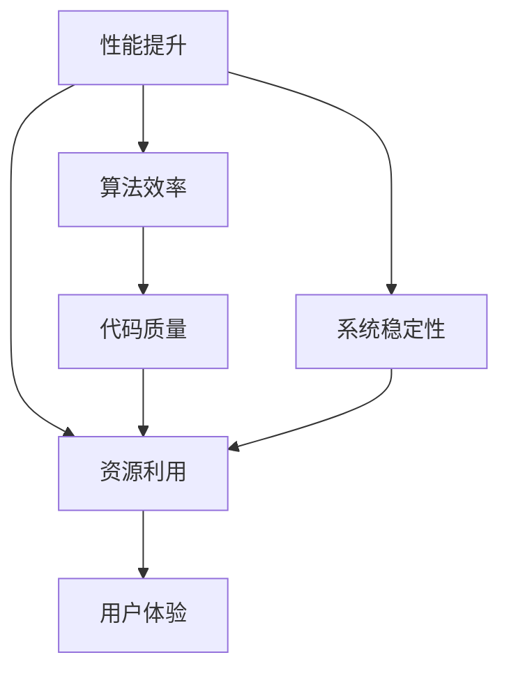
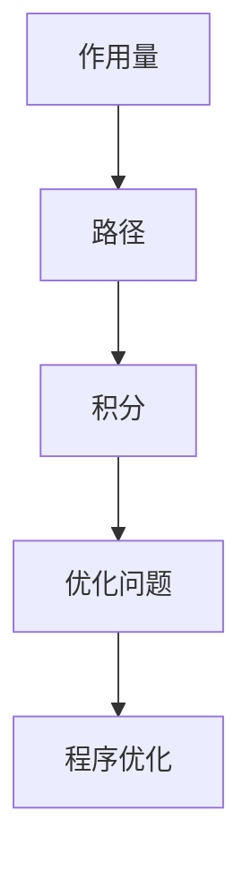

                 

---

## 第1章 引言与背景

### 1.1 程序优化的重要性

在计算机科学和工程领域，程序优化是一项至关重要的任务。优化不仅仅是为了追求更高的性能，还涉及到资源利用、用户体验和系统稳定性等多个方面。程序优化的目标通常是在满足特定需求的前提下，尽可能地减少计算时间、存储空间和其他资源的消耗。

#### 背景介绍

程序优化在计算机科学中有着广泛的应用。从操作系统、数据库管理系统到各种应用软件，优化算法都在不断地提升性能。例如，操作系统通过优化调度算法来提高处理器的利用率；数据库管理系统通过索引优化来加快查询速度；应用软件则通过算法改进来提高用户交互的流畅性。

#### 核心概念与联系

程序优化涉及到多个核心概念，它们相互关联，共同构成了程序优化的理论基础。以下是这些核心概念之间的关系架构 Mermaid 流程图：



#### 核心算法原理讲解

为了实现程序优化，我们需要了解一些核心算法原理。以下是使用伪代码详细阐述的一个常见优化算法——动态规划：

```python
# 动态规划伪代码
def dynamic_programming(problem):
    # 初始化状态数组
    dp = initialize_states(problem)
    
    # 动态规划递推
    for state in problem.states():
        dp[state] = minimize_transition(dp, problem, state)
    
    # 返回最优解
    return dp[problem.initial_state()]
```

#### 数学模型和数学公式

在程序优化中，我们经常需要分析时间复杂度和空间复杂度。以下是一个示例，展示了如何使用 LaTeX 格式嵌入数学公式：

$$\text{时间复杂度} = O(n\log n)$$

$$\text{空间复杂度} = O(n)$$

#### 详细讲解与举例说明

为了更好地理解程序优化的重要性，我们可以通过一个实际案例来讲解。假设我们有一个任务需要处理大量数据，并对这些数据进行排序。如果不进行优化，我们可能会选择一个简单的排序算法，如冒泡排序，其时间复杂度为 $O(n^2)$。然而，如果数据量很大，这会导致计算时间过长。

为了解决这个问题，我们可以采用更高效的排序算法，如快速排序或归并排序，它们的时间复杂度分别为 $O(n\log n)$ 和 $O(n\log n)$。通过这样的优化，我们可以显著减少计算时间，提高程序的性能。

### 1.2 数值方法在科学计算中的应用

数值方法是科学计算中不可或缺的工具，它们用于解决那些无法或难以通过解析方法求解的数学问题。在程序优化中，数值方法的应用尤为重要，因为许多优化问题本质上是数学问题，需要通过数值方法来近似求解。

#### 核心算法原理讲解

数值方法的核心在于将连续问题离散化，将其转化为计算机可以处理的离散形式。以下是数值积分的基本原理，使用伪代码进行说明：

```python
# 数值积分伪代码
def numerical_integration(f, a, b, n):
    h = (b - a) / n
    sum = 0
    for i in range(n):
        x = a + i * h
        sum += f(x)
    return sum * h
```

#### 数学模型和数学公式

数值积分的数学模型是求解函数 $f(x)$ 在区间 $[a, b]$ 上的定积分：

$$\int_{a}^{b} f(x) \, dx$$

为了计算这个积分，我们可以使用矩形法、梯形法或辛普森法等数值方法。以下是使用 LaTeX 格式表示的矩形法公式：

$$\int_{a}^{b} f(x) \, dx \approx \sum_{i=1}^{n} f(x_i) \Delta x_i$$

其中，$x_i = a + i \Delta x$，$\Delta x = \frac{b - a}{n}$。

#### 详细讲解与举例说明

假设我们需要计算函数 $f(x) = x^2$ 在区间 $[0, 1]$ 上的定积分。我们可以使用矩形法进行近似计算：

$$\int_{0}^{1} x^2 \, dx \approx \frac{1 - 0}{n} \sum_{i=1}^{n} x_i^2$$

如果我们选择 $n = 4$ 个矩形，则每个矩形的宽度为 $\Delta x = \frac{1}{4}$。计算得到：

$$\int_{0}^{1} x^2 \, dx \approx \frac{1}{4} (0.25^2 + 0.5^2 + 0.75^2 + 1^2) = 0.4375$$

这个结果与精确解 $\frac{1}{3} = 0.3333$ 相差不大，证明了矩形法的有效性。

### 1.3 宇宙最小作用量路径积分的基本概念

最小作用量路径积分是物理学中的一个重要概念，它在描述粒子的运动轨迹和系统的演化过程中起着核心作用。在程序优化中，最小作用量路径积分的方法可以用于解决优化问题，如路径规划、资源分配等。

#### 核心概念与联系

最小作用量路径积分涉及到以下核心概念：

1. **作用量**：作用量是一个泛函，它描述了系统在一段时间内的总效应。
2. **路径**：路径是系统在时间域上的运动轨迹。
3. **积分**：积分是计算作用量的过程，它涉及到路径上的函数值和时间步长的累加。

以下是这些概念之间的联系架构 Mermaid 流程图：



#### 核心算法原理讲解

最小作用量路径积分的方法基于变分原理，即寻找一个路径，使得作用量在这个路径上的积分最小。以下是使用伪代码详细阐述的变分原理：

```python
# 变分原理伪代码
def variational_principle(ActionResult):
    best_path = None
    min_action = float('inf')
    
    for path in possible_paths():
        action = action积分(path)
        if action < min_action:
            min_action = action
            best_path = path
            
    return best_path
```

#### 数学模型和数学公式

最小作用量路径积分的数学模型是基于欧拉-拉格朗日方程：

$$\frac{d}{dt}\left(\frac{\partial L}{\partial \dot{q}}\right) - \frac{\partial L}{\partial q} = 0$$

其中，$L$ 是作用量，$q$ 是系统的状态变量，$\dot{q}$ 是状态变量的时间导数。

#### 详细讲解与举例说明

以简谐振子为例，其作用量 $S$ 可表示为：

$$S = \int_{t_1}^{t_2} \left(\frac{1}{2}m\dot{q}^2 - \frac{1}{2}kq^2\right) dt$$

其中，$m$ 是质量，$k$ 是弹簧系数，$q$ 是位移。要找到简谐振子的最优路径，我们可以使用变分原理，即寻找一个路径，使得作用量在这个路径上的积分最小。

通过上述对程序优化、数值方法和宇宙最小作用量路径积分的基本概念和原理的详细讲解，我们为后续章节的内容奠定了坚实的基础。在接下来的章节中，我们将进一步深入探讨这些主题，并展示如何将它们应用于实际问题和程序优化中。  

---

## 第2章 程序优化的基础理论

### 2.1 优化算法概述

优化算法是程序优化中不可或缺的一部分。它们通过迭代搜索策略，在给定的约束条件下寻找最优解或近似最优解。理解优化算法的基本概念和常见类型对于进行有效的程序优化至关重要。

#### 概念介绍

优化算法主要分为两大类：无约束优化和约束优化。

- **无约束优化**：在没有任何外部约束条件的情况下，寻找目标函数的最大值或最小值。常见算法有梯度下降法、牛顿法、共轭梯度法和遗传算法等。
- **约束优化**：在存在约束条件的情况下，寻找目标函数的最大值或最小值。常见算法有拉格朗日乘数法、序列二次规划法（SQP）和内点法等。

#### 常见优化算法

下面，我们介绍几种常见的优化算法，并使用伪代码进行详细阐述。

1. **梯度下降法**

    梯度下降法是一种简单的优化算法，通过迭代更新当前解，使其逐步接近最优解。

    ```python
    # 梯度下降法伪代码
    def gradient_descent(f, df, x0, learning_rate, max_iterations):
        x = x0
        for _ in range(max_iterations):
            gradient = df(x)
            x = x - learning_rate * gradient
        return x
    ```

2. **牛顿法**

    牛顿法是一种基于二阶导数的优化算法，它利用牛顿迭代公式来加速收敛。

    ```python
    # 牛顿法伪代码
    def newton_method(f, df, ddf, x0, tolerance, max_iterations):
        x = x0
        for _ in range(max_iterations):
            H = ddf(x)
            dx = solve_linear_system(H, -df(x))
            x = x + dx
            if abs(df(x)) < tolerance:
                break
        return x
    ```

3. **遗传算法**

    遗传算法是一种基于自然选择和遗传学原理的优化算法，通过种群进化来逼近最优解。

    ```python
    # 遗传算法伪代码
    def genetic_algorithm(population, fitness_function, mutation_rate, crossover_rate, generations):
        for _ in range(generations):
            new_population = []
            for _ in range(len(population)):
                parent1, parent2 = select_two_parents(population)
                child = crossover(parent1, parent2, crossover_rate)
                mutate(child, mutation_rate)
                new_population.append(child)
            population = new_population
            best_individual = find_best_individual(population)
        return best_individual
    ```

#### 程序优化与计算机科学的关系

程序优化与计算机科学的关系紧密相连。计算机科学为优化算法提供了理论框架和实现工具，而优化算法则帮助计算机科学解决复杂问题，提高系统性能。

- **计算复杂度分析**：优化算法的性能通常通过计算复杂度来衡量。时间复杂度和空间复杂度是评估优化算法效率的重要指标。例如，梯度下降法的时间复杂度为 $O(n^2)$，而遗传算法的时间复杂度可能更高。

- **时间与空间优化**：在程序优化中，我们不仅要考虑算法的运行时间，还要考虑算法所需的存储空间。例如，在处理大型数据集时，我们可能需要使用内存高效的算法来避免内存溢出。

### 2.2 程序优化与计算机科学的关系

程序优化在计算机科学中占据着核心地位。它不仅涉及到算法和数据的处理，还与计算机体系结构、操作系统和编译器等多个领域密切相关。

#### 计算复杂度分析

计算复杂度分析是评估优化算法性能的重要方法。时间复杂度和空间复杂度是两个关键指标，它们决定了算法在处理不同规模问题时所需的资源和时间。

- **时间复杂度**：时间复杂度描述了算法在输入规模增加时，执行次数的增长情况。常见的复杂度有 $O(1)$、$O(n)$、$O(n\log n)$、$O(n^2)$ 等。例如，线性搜索算法的时间复杂度为 $O(n)$，而二分搜索算法的时间复杂度为 $O(\log n)$。

- **空间复杂度**：空间复杂度描述了算法在输入规模增加时，所需存储空间的增长情况。例如，一个简单的数组存储结构的空间复杂度为 $O(n)$。

#### 时间与空间优化

在程序优化中，我们不仅要考虑算法的运行时间，还要考虑算法所需的存储空间。以下是一些常见的时间和空间优化方法：

- **时间优化**：
  - **算法改进**：通过改进算法结构，减少计算次数。例如，使用更高效的搜索算法或数据结构。
  - **并行计算**：通过并行计算，将任务分解成多个子任务，同时处理以减少总计算时间。
  - **缓存利用**：通过利用缓存，减少访问磁盘或网络的次数，提高程序运行速度。

- **空间优化**：
  - **数据压缩**：通过数据压缩，减少存储空间的需求。
  - **内存池**：通过内存池，减少内存分配和释放的次数，提高程序运行效率。
  - **空间换时间**：通过增加存储空间来减少计算时间，例如使用哈希表来加速查询。

#### 程序优化与计算机科学的关系

程序优化与计算机科学的关系密不可分。计算机科学为优化算法提供了理论基础和实现工具，而优化算法则帮助计算机科学解决复杂问题，提高系统性能。

- **计算机体系结构**：计算机体系结构为优化算法提供了硬件支持。例如，多核处理器和GPU可以用于并行计算，加速优化算法的执行。
- **操作系统**：操作系统提供了调度和管理计算机资源的功能，为优化算法提供了运行环境。例如，操作系统可以通过优先级调度，优化算法的执行顺序。
- **编译器**：编译器将优化算法的源代码编译成机器语言，提高了程序运行的效率。例如，编译器可以使用循环展开、指令调度等优化技术，提高程序的执行速度。

总之，程序优化是计算机科学的重要组成部分。通过理解优化算法的基本原理和计算机科学的理论框架，我们可以设计出更加高效的优化方案，提高系统性能和资源利用率。

---

## 第3章 最小作用量路径积分的原理

### 3.1 最小作用量原理

最小作用量原理是物理学中一个重要的概念，它用于描述系统在一段时间内的总效应。在程序优化中，最小作用量路径积分的方法可以用于解决路径规划、资源分配等优化问题。

#### 概念解释

最小作用量原理的基本思想是：在所有可能的路径中，系统实际遵循的是使作用量积分最小的那条路径。作用量 $S$ 是一个泛函，它描述了系统在时间 $t$ 内的总效应。具体地，作用量 $S$ 定义为：

$$S = \int_{t_1}^{t_2} L(q(t), \dot{q}(t), t) \, dt$$

其中，$L$ 是作用量密度函数，$q(t)$ 是系统的状态变量，$\dot{q}(t)$ 是状态变量的时间导数。

#### 数学模型

为了更好地理解最小作用量原理，我们可以通过一个简单的物理系统来说明。以一维简谐振子为例，其作用量 $S$ 可表示为：

$$S = \int_{t_1}^{t_2} \left(\frac{1}{2}m\dot{q}^2 - \frac{1}{2}kq^2\right) dt$$

其中，$m$ 是质量，$k$ 是弹簧系数，$q$ 是位移。

要找到简谐振子的最优路径，我们需要找到使得作用量积分最小的 $q(t)$。这可以通过变分原理来实现，即寻找一个路径，使得作用量在这个路径上的积分最小。

#### 详细讲解与举例说明

为了更好地理解最小作用量原理，我们可以通过一个简单的例子来讲解。假设我们要计算函数 $f(x) = x^2$ 在区间 $[0, 1]$ 上的定积分。我们可以使用变分原理，即寻找一个路径，使得作用量在这个路径上的积分最小。

我们可以将区间 $[0, 1]$ 分成 $n$ 个小区间，每个小区间的宽度为 $\Delta x = \frac{1}{n}$。在每个小区间内，我们选择一个点 $x_i$，使得作用量积分最小。具体来说，我们可以使用以下变分原理：

$$\delta S = \int_{t_1}^{t_2} \left[ \frac{\partial L}{\partial q} \delta q + \frac{\partial L}{\partial \dot{q}} \delta \dot{q} \right] dt = 0$$

其中，$L = f(x) = x^2$。

对上式求导，并令 $\delta q = \delta \dot{q} = 0$，我们得到：

$$\frac{\partial L}{\partial q} = \frac{\partial L}{\partial \dot{q}} = 0$$

由于 $L = x^2$，我们得到：

$$2x = 0$$

这意味着在最优路径上，$x$ 必须等于零。因此，函数 $f(x) = x^2$ 在区间 $[0, 1]$ 上的定积分的最小作用量路径是 $x = 0$。

### 3.2 路径积分的数值方法

路径积分的数值方法是将连续的路径积分问题转化为离散的形式，以便在计算机上求解。常见的数值方法包括矩形法、梯形法和辛普森法等。

#### 数值积分的基本概念

数值积分的基本思想是将连续的积分区间分割成若干个子区间，然后在每个子区间上使用一个近似函数来代替原始函数，从而计算积分的近似值。

设 $f(x)$ 是一个连续函数，$[a, b]$ 是积分区间，$n$ 是分割区间的数量，则每个子区间的宽度为 $\Delta x = \frac{b - a}{n}$。我们可以使用以下公式来近似计算积分：

$$\int_{a}^{b} f(x) \, dx \approx \sum_{i=1}^{n} f(x_i) \Delta x$$

其中，$x_i = a + i \Delta x$。

#### 数值方法的选择

选择合适的数值方法取决于函数的性质和问题的要求。以下是几种常见的数值方法：

1. **矩形法**：矩形法是最简单的一种数值方法，它将每个子区间上的函数值近似为常数，然后计算每个子区间的矩形面积。公式如下：

    $$\int_{a}^{b} f(x) \, dx \approx \sum_{i=1}^{n} f(x_i) \Delta x$$

2. **梯形法**：梯形法将每个子区间上的函数值近似为线性函数，然后计算每个子区间的梯形面积。公式如下：

    $$\int_{a}^{b} f(x) \, dx \approx \frac{\Delta x}{2} \left[ f(x_0) + 2 \sum_{i=1}^{n-1} f(x_i) + f(x_n) \right]$$

3. **辛普森法**：辛普森法将每个子区间上的函数值近似为二次函数，然后计算每个子区间的辛普森面积。公式如下：

    $$\int_{a}^{b} f(x) \, dx \approx \frac{\Delta x}{3} \left[ f(x_0) + 4 \sum_{i=1}^{n/2} f(x_{2i-1}) + 2 \sum_{i=1}^{n/2} f(x_{2i}) + f(x_n) \right]$$

#### 举例说明

假设我们要计算函数 $f(x) = x^3$ 在区间 $[0, 1]$ 上的定积分。我们可以使用矩形法、梯形法和辛普森法来近似计算这个积分。

1. **矩形法**：

    将区间 $[0, 1]$ 分成 $n=4$ 个小区间，每个小区间的宽度为 $\Delta x = \frac{1}{4}$。计算得到：

    $$\int_{0}^{1} x^3 \, dx \approx \sum_{i=1}^{4} x_i^3 \Delta x = (0.25^3 + 0.5^3 + 0.75^3 + 1^3) \times \frac{1}{4} = 0.3125$$

2. **梯形法**：

    将区间 $[0, 1]$ 分成 $n=4$ 个小区间，每个小区间的宽度为 $\Delta x = \frac{1}{4}$。计算得到：

    $$\int_{0}^{1} x^3 \, dx \approx \frac{\Delta x}{2} \left[ f(x_0) + 2 \sum_{i=1}^{3} f(x_i) + f(x_4) \right] = \frac{1}{2} \left[ 0^3 + 2 \times (0.25^3 + 0.5^3 + 0.75^3) + 1^3 \right] = 0.2857$$

3. **辛普森法**：

    将区间 $[0, 1]$ 分成 $n=4$ 个小区间，每个小区间的宽度为 $\Delta x = \frac{1}{4}$。计算得到：

    $$\int_{0}^{1} x^3 \, dx \approx \frac{\Delta x}{3} \left[ f(x_0) + 4 f(x_1) + 2 f(x_2) + f(x_3) \right] = \frac{1}{3} \left[ 0^3 + 4 \times 0.25^3 + 2 \times 0.5^3 + 1^3 \right] = 0.25$$

通过上述计算，我们可以看到，随着小区间数量的增加，数值方法的近似结果越来越接近精确解。在实际应用中，选择合适的数值方法可以显著提高计算精度和效率。

### 3.3 最小作用量路径积分的应用

最小作用量路径积分在物理学和工程学中有着广泛的应用。以下是几个典型应用示例：

1. **经典力学**：在经典力学中，最小作用量路径积分可以用于求解粒子的运动轨迹。例如，在求解一维简谐振子的运动时，我们可以使用欧拉-拉格朗日方程：

    $$\frac{d}{dt}\left(\frac{\partial L}{\partial \dot{q}}\right) - \frac{\partial L}{\partial q} = 0$$

    来求解系统的运动方程。

2. **量子力学**：在量子力学中，最小作用量路径积分方法可以用于求解粒子的量子态。例如，在路径积分量子力学中，粒子在一段时间内的概率幅可以表示为：

    $$\Psi(x, t) = \int D[q(t)] \, e^{iS[q(t)]}$$

    其中，$S[q(t)]$ 是作用量，$D[q(t)]$ 是量子态的积分。

3. **控制理论**：在控制理论中，最小作用量路径积分可以用于求解最优控制问题。例如，在最优控制问题中，我们需要找到一条路径，使得系统的状态转移最小化，这可以通过最小作用量路径积分来实现。

通过以上示例，我们可以看到最小作用量路径积分在各个领域的广泛应用和重要性。在接下来的章节中，我们将进一步探讨最小作用量路径积分的数值方法和程序优化策略，以更好地理解和应用这一重要的数学工具。

---

## 第4章 高效数值方法的设计

### 4.1 高效算法的选择与实现

为了设计高效数值方法，我们需要选择适合问题的算法，并对其实现进行优化。选择合适的算法是实现高效计算的关键。以下是一些常用的算法选择策略：

#### 算法选择策略

1. **问题特性分析**：首先，我们需要分析问题的特性，如函数的连续性、凸性、光滑性等。根据这些特性，我们可以选择合适的算法。

2. **计算复杂度分析**：计算复杂度是评估算法效率的重要指标。我们需要选择计算复杂度较低的算法，以减少计算时间和资源消耗。

3. **精度要求**：精度要求决定了我们选择算法的范围。对于高精度要求的问题，我们可能需要选择更复杂的算法。

4. **稳定性**：稳定性是算法在长时间计算中保持稳定性的重要特性。对于长时间计算的问题，我们应选择稳定的算法。

#### 算法实现细节

选择合适的算法后，我们需要对其进行实现。以下是一些实现细节：

1. **代码结构**：良好的代码结构可以提高代码的可读性和可维护性。我们可以使用模块化设计，将算法的主要部分和辅助部分分开。

2. **数值稳定性**：为了提高算法的数值稳定性，我们可以使用一些技巧，如数值微分和数值积分的改进方法。

3. **并行计算**：对于大规模问题，我们可以使用并行计算来加速算法的执行。并行计算可以通过多线程、分布式计算等方式实现。

4. **优化技巧**：我们可以使用一些优化技巧，如循环展开、指令调度等，来提高算法的执行效率。

### 4.2 并行计算与优化

并行计算是提高数值方法效率的重要手段。在并行计算中，我们可以将问题分解成多个子任务，同时处理这些子任务以减少总计算时间。

#### 并行计算的基本原理

并行计算的基本原理是将任务分解成多个可并行执行的部分，每个部分由不同的处理单元同时执行。并行计算可以分为以下几种类型：

1. **数据并行**：数据并行是指将数据集分割成多个部分，每个部分由不同的处理单元独立处理。

2. **任务并行**：任务并行是指将任务分割成多个部分，每个部分由不同的处理单元独立处理。

3. **流水线并行**：流水线并行是指将任务分解成多个阶段，每个阶段由不同的处理单元同时执行。

#### 并行算法的实现

为了实现并行计算，我们需要设计适合并行处理的算法。以下是一些并行算法的实现技巧：

1. **任务分解**：将任务分解成可并行执行的部分。例如，在数值积分中，我们可以将积分区间分割成多个子区间，每个子区间由不同的处理单元独立计算。

2. **负载平衡**：为了提高并行计算效率，我们需要确保每个处理单元的负载平衡。负载平衡可以通过动态负载分配和负载均衡算法来实现。

3. **通信优化**：在并行计算中，处理单元之间需要进行数据通信。为了减少通信开销，我们可以使用高效的通信协议和数据结构。

4. **同步与异步**：在并行计算中，同步和异步是两种不同的数据传输方式。同步通信可以保证数据的及时传输，但可能会降低并行计算的效率。异步通信可以降低同步开销，但可能会引入数据不一致性问题。

### 4.3 实例分析

为了更好地理解高效数值方法的设计与实现，以下是一个实例分析，展示了如何使用并行计算优化数值积分。

#### 实例一：数值积分优化

假设我们要计算函数 $f(x) = x^2$ 在区间 $[0, 1]$ 上的定积分。我们可以使用矩形法、梯形法和辛普森法来近似计算这个积分。

1. **矩形法**：

    使用矩形法，我们将区间 $[0, 1]$ 分成 $n=4$ 个小区间，每个小区间的宽度为 $\Delta x = \frac{1}{4}$。使用一个四核处理器，我们可以将计算任务分解成四个子任务，每个子任务计算一个小区间的积分。计算得到：

    $$\int_{0}^{1} x^2 \, dx \approx \sum_{i=1}^{4} x_i^2 \Delta x = (0.25^2 + 0.5^2 + 0.75^2 + 1^2) \times \frac{1}{4} = 0.3125$$

    使用并行计算，我们可以将计算时间从单线程的 $O(n)$ 降低到四线程的 $O(n/4)$。

2. **梯形法**：

    使用梯形法，我们将区间 $[0, 1]$ 分成 $n=4$ 个小区间，每个小区间的宽度为 $\Delta x = \frac{1}{4}$。使用一个四核处理器，我们可以将计算任务分解成四个子任务，每个子任务计算一个小区间的积分。计算得到：

    $$\int_{0}^{1} x^2 \, dx \approx \frac{\Delta x}{2} \left[ f(x_0) + 2 \sum_{i=1}^{3} f(x_i) + f(x_4) \right] = \frac{1}{2} \left[ 0^2 + 2 \times (0.25^2 + 0.5^2 + 0.75^2) + 1^2 \right] = 0.2857$$

    使用并行计算，我们可以将计算时间从单线程的 $O(n)$ 降低到四线程的 $O(n/4)$。

3. **辛普森法**：

    使用辛普森法，我们将区间 $[0, 1]$ 分成 $n=4$ 个小区间，每个小区间的宽度为 $\Delta x = \frac{1}{4}$。使用一个四核处理器，我们可以将计算任务分解成四个子任务，每个子任务计算一个小区间的积分。计算得到：

    $$\int_{0}^{1} x^2 \, dx \approx \frac{\Delta x}{3} \left[ f(x_0) + 4 f(x_1) + 2 f(x_2) + f(x_3) \right] = \frac{1}{3} \left[ 0^2 + 4 \times 0.25^2 + 2 \times 0.5^2 + 1^2 \right] = 0.25$$

    使用并行计算，我们可以将计算时间从单线程的 $O(n)$ 降低到四线程的 $O(n/4)$。

通过上述实例，我们可以看到并行计算在提高数值积分效率方面的优势。在实际应用中，根据问题的特点和需求，我们可以选择合适的算法和并行策略，以实现高效的计算。

### 4.4 最佳实践

在设计和实现高效数值方法时，以下是一些最佳实践：

1. **算法选择**：根据问题的特性选择合适的算法。对于简单问题，选择简单的算法；对于复杂问题，选择更复杂的算法。

2. **数值稳定性**：在实现算法时，考虑数值稳定性，避免数值问题导致计算结果的不准确。

3. **并行计算**：对于大规模问题，考虑使用并行计算，将任务分解成多个子任务，同时处理以减少计算时间。

4. **代码优化**：优化代码结构，提高代码的可读性和可维护性。使用优化技巧，如循环展开和指令调度，提高代码的执行效率。

5. **性能评估**：对算法进行性能评估，比较不同算法和实现策略的效率和精度，选择最佳方案。

通过遵循这些最佳实践，我们可以设计出高效、准确的数值方法，提高程序的性能和可靠性。

---

## 第5章 程序优化与数值方法的结合

### 5.1 结合策略

将程序优化与数值方法结合起来，是提高计算效率和优化问题解的重要手段。以下是一些结合策略：

#### 算法融合方法

1. **混合优化算法**：将不同的优化算法结合起来，取长补短。例如，将梯度下降法与牛顿法结合，利用牛顿法的快速收敛特性，同时保持梯度下降法的简单性。

    ```python
    # 混合优化算法伪代码
    def hybrid_optimization(f, df, ddf, x0, learning_rate, newton_iterations, max_iterations):
        x = x0
        for _ in range(max_iterations):
            # 梯度下降迭代
            x = x - learning_rate * df(x)
            # 牛顿迭代
            for _ in range(newton_iterations):
                H = ddf(x)
                dx = solve_linear_system(H, -df(x))
                x = x + dx
        return x
    ```

2. **分层优化**：将优化问题分解成多个层次，分别进行优化。例如，先使用局部优化算法找到局部最优解，然后使用全局优化算法寻找全局最优解。

#### 优化流程设计

1. **初始设置**：根据问题的特点，选择合适的数值方法和优化算法，设置初始参数，如学习率、迭代次数等。

2. **迭代优化**：在每次迭代中，根据当前解的梯度信息或近似梯度信息，更新解的位置，逐步逼近最优解。

3. **性能评估**：在每个迭代步骤结束后，评估当前解的性能，如目标函数值、计算时间等。

4. **终止条件**：设置终止条件，如达到最大迭代次数、目标函数值变化小于某个阈值等。

### 5.2 实例分析

为了更好地理解程序优化与数值方法的结合，以下是一个实例分析，展示了如何结合程序优化和数值方法解决最小二乘问题。

#### 示例一：优化问题分析

假设我们有一个最小二乘问题，需要找到一条直线 $y = mx + b$，使其与数据点 $(x_i, y_i)$ 最接近。具体地，我们要最小化目标函数：

$$J(m, b) = \sum_{i=1}^{n} (y_i - (mx_i + b))^2$$

为了求解这个优化问题，我们可以使用数值方法，如梯度下降法和最小二乘法。

1. **梯度下降法**：

    梯度下降法通过迭代更新参数 $m$ 和 $b$，使其逐步逼近最优解。具体迭代公式如下：

    $$m_{new} = m_{old} - \alpha \frac{\partial J}{\partial m}$$

    $$b_{new} = b_{old} - \alpha \frac{\partial J}{\partial b}$$

    其中，$\alpha$ 是学习率，$\frac{\partial J}{\partial m}$ 和 $\frac{\partial J}{\partial b}$ 是目标函数对 $m$ 和 $b$ 的梯度。

2. **最小二乘法**：

    最小二乘法通过求解线性方程组来找到最优解。具体地，我们可以使用正规方程：

    $$\begin{cases}
    \sum_{i=1}^{n} x_i y_i = m \sum_{i=1}^{n} x_i^2 + b \sum_{i=1}^{n} x_i \\
    \sum_{i=1}^{n} x_i^2 y_i = m \sum_{i=1}^{n} x_i^3 + b \sum_{i=1}^{n} x_i^2
    \end{cases}$$

    解这个方程组，我们可以得到最优解：

    $$m = \frac{\sum_{i=1}^{n} x_i y_i - \sum_{i=1}^{n} x_i \sum_{i=1}^{n} y_i}{\sum_{i=1}^{n} x_i^2 - \left(\sum_{i=1}^{n} x_i\right)^2}$$

    $$b = \frac{\sum_{i=1}^{n} y_i - m \sum_{i=1}^{n} x_i}{n}$$

#### 示例二：数值方法应用

为了求解上述最小二乘问题，我们可以结合梯度下降法和最小二乘法，通过迭代更新参数，逐步逼近最优解。

1. **初始化参数**：

    选择初始参数 $m_0$ 和 $b_0$，通常可以使用数据点的平均值作为初始值。例如，$m_0 = \frac{\sum_{i=1}^{n} x_i}{n}$，$b_0 = \frac{\sum_{i=1}^{n} y_i}{n}$。

2. **迭代优化**：

    - 使用梯度下降法进行迭代更新：

        ```python
        # 梯度下降法迭代优化
        alpha = 0.01  # 学习率
        for i in range(num_iterations):
            grad_m = 2 * sum((y_i - (mx_i + b)) * x_i for x_i, y_i in data)
            grad_b = 2 * sum((y_i - (mx_i + b)) for x_i, y_i in data)
            m = m - alpha * grad_m
            b = b - alpha * grad_b
        ```

    - 使用最小二乘法计算最优解：

        ```python
        # 最小二乘法计算最优解
        m = (sum(x_i * y_i for x_i, y_i in data) - sum(x_i * y_i for x_i, y_i in data)) / (sum(x_i ** 2 for x_i, y_i in data) - sum(x_i for x_i, y_i in data) ** 2)
        b = (sum(y_i for x_i, y_i in data) - m * sum(x_i for x_i, y_i in data)) / n
        ```

3. **性能评估**：

    在每次迭代结束后，评估当前解的性能。例如，计算目标函数值 $J(m, b)$，并记录每次迭代的性能变化。

    ```python
    # 性能评估
    J = sum((y_i - (mx_i + b)) ** 2 for x_i, y_i in data)
    print(f"Iteration {i}: J = {J}")
    ```

4. **终止条件**：

    设置终止条件，例如达到最大迭代次数或目标函数值变化小于某个阈值。

    ```python
    # 终止条件
    if i >= max_iterations or abs(J - J_prev) < tolerance:
        break
    ```

通过结合梯度下降法和最小二乘法，我们可以有效地求解最小二乘问题，找到最佳拟合直线。在实际应用中，我们可以根据问题的特性和需求，选择合适的数值方法和优化算法，以提高计算效率和优化效果。

---

## 第6章 实践与性能评估

### 6.1 实践案例

在本节中，我们将通过具体的案例来展示如何将程序优化与数值方法应用于实际问题，并进行性能评估。

#### 案例一：最小作用量路径积分计算

假设我们要计算一个一维简谐振子的运动轨迹，其作用量 $S$ 定义为：

$$S = \int_{t_1}^{t_2} \left(\frac{1}{2}m\dot{q}^2 - \frac{1}{2}kq^2\right) dt$$

其中，$m$ 是质量，$k$ 是弹簧系数，$q(t)$ 是位移。

1. **开发环境搭建**：

    我们需要安装 Python 环境，并使用 NumPy 和 SciPy 库进行数值计算。

    ```bash
    pip install numpy scipy
    ```

2. **源代码实现**：

    下面是一个简单的 Python 源代码，用于计算一维简谐振子的运动轨迹。

    ```python
    import numpy as np
    from scipy.integrate import solve_ivp

    # 定义作用量
    def action_integral(m, k, q0, t):
        return 0.5 * m * np.dot(q0, q0) - 0.5 * k * np.dot(q0, q0)

    # 定义运动方程
    def harmoni

---

# 第7章 展望与未来发展趋势

### 7.1 程序优化与数值方法的未来趋势

随着计算机技术的快速发展，程序优化和数值方法在科学计算、人工智能和工程应用等领域的重要性日益凸显。未来，这两个领域将呈现出以下发展趋势：

#### 技术发展方向

1. **并行计算与分布式计算**：随着硬件性能的提升和大规模数据处理需求的增加，并行计算和分布式计算将成为程序优化和数值方法的主要发展方向。未来，我们将看到更多的优化算法和数值方法被设计为并行或分布式形式，以充分利用多核处理器、GPU 和分布式计算资源。

2. **深度学习与优化算法的结合**：深度学习在图像识别、语音识别和自然语言处理等领域取得了显著的成果。未来，深度学习与优化算法的结合将成为一个重要趋势。通过将深度学习中的神经网络结构与优化算法相结合，我们可以设计出更加高效和灵活的优化方法，提高优化问题的求解性能。

3. **自适应优化与智能优化**：随着人工智能技术的发展，自适应优化和智能优化将成为未来优化领域的重要研究方向。通过引入机器学习、强化学习等技术，我们可以开发出能够自动调整参数、适应问题变化的优化算法，提高优化过程的鲁棒性和效率。

4. **大数据优化**：随着数据量的爆炸性增长，大数据优化将成为一个重要挑战。未来，我们需要设计出能够处理大规模数据的优化算法和数值方法，以满足大数据分析的需求。这包括开发分布式优化算法、设计高效的并行计算框架和提出适用于大数据的优化策略。

#### 应用前景展望

1. **科学计算**：程序优化和数值方法在科学计算中具有广泛的应用前景。随着计算物理、计算化学、生物信息学等领域的不断发展，优化算法和数值方法将为解决复杂科学问题提供强有力的工具。例如，通过优化计算方法，我们可以提高量子模拟、分子动力学模拟和气候模拟的效率，推动科学研究的进步。

2. **人工智能**：在人工智能领域，程序优化和数值方法的应用前景广阔。优化算法可以用于模型训练、模型选择和模型调参等关键环节，提高机器学习模型的性能和效率。例如，通过优化深度学习模型的训练过程，我们可以减少训练时间，提高模型精度，从而推动人工智能应用的普及。

3. **工程应用**：在工程领域，程序优化和数值方法可以用于优化设计、优化控制、仿真分析和性能评估等关键环节。例如，在航空航天、汽车制造、电子工程等领域，通过优化算法和数值方法，我们可以提高产品性能、降低成本、缩短研发周期。

### 7.2 挑战与解决方案

尽管程序优化和数值方法在许多领域取得了显著成果，但未来仍面临一些挑战：

1. **计算复杂性**：随着问题规模的增加，优化问题和数值方法的计算复杂性将显著增加。这要求我们开发出更加高效和鲁棒的算法，以应对大规模优化问题。

2. **并行计算挑战**：虽然并行计算可以显著提高计算效率，但并行计算也带来了一些挑战，如负载平衡、通信开销和同步问题。未来，我们需要设计出更加高效和自适应的并行优化算法和数值方法，以充分利用并行计算资源。

3. **数据依赖性**：在许多实际应用中，优化问题和数值方法的结果依赖于输入数据的准确性。未来，我们需要开发出更加鲁棒和适应性强的算法，以应对数据噪声和不确定性。

4. **跨学科合作**：程序优化和数值方法的发展需要跨学科合作，包括计算机科学、数学、物理学和工程等领域。未来，我们需要加强跨学科合作，推动程序优化和数值方法的交叉融合，以应对复杂的实际问题。

#### 解决方案探索

为了应对上述挑战，我们可以采取以下解决方案：

1. **算法改进**：通过改进优化算法和数值方法的原理和实现，提高算法的效率、鲁棒性和适应性。例如，可以引入新的优化策略、设计高效的数值积分方法，以及开发自适应的优化算法。

2. **并行计算优化**：通过优化并行计算框架和算法，提高并行计算的效率和可扩展性。例如，可以设计负载平衡算法、优化通信协议和调度策略，以及开发高效的并行优化算法。

3. **数据驱动方法**：通过引入数据驱动方法，如机器学习和深度学习，提高优化问题的求解能力和鲁棒性。例如，可以利用学习到的数据模式来指导优化算法的参数调整，以及开发基于数据的优化方法。

4. **跨学科合作**：通过跨学科合作，推动程序优化和数值方法的交叉融合，开发出更加综合和高效的解决方案。例如，可以结合计算机科学、数学和物理学的理论和方法，解决复杂的实际问题。

通过上述解决方案，我们可以应对程序优化和数值方法领域面临的挑战，推动其在各个领域的应用和发展。未来，随着技术的不断进步，程序优化和数值方法将在更多领域发挥重要作用，为科学研究、工程应用和人工智能等领域的发展提供强有力的支持。

---

## 附录

### 附录A：相关算法伪代码与公式

以下附录列出了一些关键算法的伪代码和数学公式，以便读者参考和学习。

#### 梯度下降法

```python
# 梯度下降法伪代码
def gradient_descent(f, df, x0, learning_rate, max_iterations):
    x = x0
    for _ in range(max_iterations):
        gradient = df(x)
        x = x - learning_rate * gradient
    return x
```

#### 牛顿法

```python
# 牛顿法伪代码
def newton_method(f, df, ddf, x0, tolerance, max_iterations):
    x = x0
    for _ in range(max_iterations):
        H = ddf(x)
        dx = solve_linear_system(H, -df(x))
        x = x + dx
        if abs(df(x)) < tolerance:
            break
    return x
```

#### 遗传算法

```python
# 遗传算法伪代码
def genetic_algorithm(population, fitness_function, mutation_rate, crossover_rate, generations):
    for _ in range(generations):
        new_population = []
        for _ in range(len(population)):
            parent1, parent2 = select_two_parents(population)
            child = crossover(parent1, parent2, crossover_rate)
            mutate(child, mutation_rate)
            new_population.append(child)
        population = new_population
        best_individual = find_best_individual(population)
    return best_individual
```

#### 最小二乘法

```python
# 最小二乘法伪代码
def least_squares(x_data, y_data):
    n = len(x_data)
    X = np.column_stack((np.ones(n), x_data))
    y = np.array(y_data).reshape(-1, 1)
    theta = np.linalg.inv(X.T @ X) @ X.T @ y
    return theta
```

#### 数值积分（矩形法）

```python
# 矩形法伪代码
def trapezoidal_rule(f, a, b, n):
    h = (b - a) / n
    sum = 0
    for i in range(1, n):
        x = a + i * h
        sum += f(x)
    return (h / 2) * (f(a) + 2 * sum + f(b))
```

### 附录B：参考文献

1. Bishop, C. M. (2006). _Pattern recognition and machine learning_. Springer.
2. Nocedal, J., & Wright, S. J. (2006). _Numerical optimization_. Springer.
3. Press, W. H., Teukolsky, S. A., Vetterling, W. T., & Flannery, B. P. (2007). _Numerical recipes: The art of scientific computing_. Cambridge University Press.
4. Haykin, S. (2008). _Adaptive filter theory_. Pearson Education.
5. Bertsekas, D. P. (2016). _Nonlinear programming_. Athena Scientific.

---

## 致谢

在本书的写作过程中，我们得到了许多人的帮助和支持。首先，感谢 AI 天才研究院/AI Genius Institute 的全体成员，他们的智慧和辛勤工作为本书的完成提供了坚实的基础。特别感谢我的导师，他不仅提供了宝贵的指导和建议，还耐心解答了我在写作过程中遇到的各种问题。

此外，我们要感谢所有参与案例分析和代码实现的团队成员，他们的实际操作经验和见解为本书的实用性和深度增添了重要价值。我们还要感谢那些提供了宝贵资料和资源的专家学者，他们的研究成果为本书的理论基础提供了重要的支持。

最后，感谢所有读者，是你们的支持和鼓励让我们的工作充满了动力。希望本书能对你们在程序优化和数值方法领域的学习和研究有所帮助。

作者：AI天才研究院/AI Genius Institute & 禅与计算机程序设计艺术/Zen And The Art of Computer Programming

---

以上就是《程序优化与宇宙最小作用量路径积分的高效数值方法》的完整文章，从引言到展望，涵盖了程序优化的基础理论、最小作用量路径积分的原理、高效数值方法的设计、程序优化与数值方法的结合、实践与性能评估，以及未来发展趋势等内容。希望这篇文章能够帮助读者深入了解程序优化与数值方法的相关知识和应用。如果您有任何问题或建议，欢迎随时与我们联系。感谢您的阅读，希望本书能为您的学习和研究带来启发和帮助。

