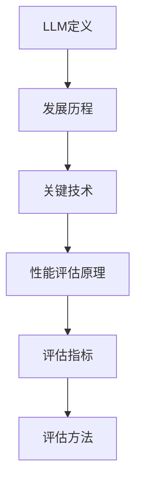

                 

### 文章标题

《突破传统：LLM驱动的大模型性能评估方法论》

> 关键词：LLM，大模型性能评估，方法论，优化策略，实战技巧

摘要：
随着人工智能技术的飞速发展，大型语言模型（LLM）逐渐成为自然语言处理领域的重要工具。本文旨在探讨LLM驱动的大模型性能评估方法论，从背景介绍、核心概念、评估原理、实战技巧和优化策略等多个维度，系统性地解析大模型性能评估的方法与技巧。通过本文的阐述，读者可以全面了解LLM驱动的大模型性能评估的核心内容，掌握不同应用场景下的性能评估实战技巧，并为大模型的性能优化提供有力支持。

---

### Step 1: 确定书名主题和核心内容

书名：《突破传统：LLM驱动的大模型性能评估方法论》

核心内容：

1. **LLM的基本概念与发展历程**：介绍LLM的定义、发展历程以及关键技术，帮助读者建立对LLM的基本认知。
2. **大模型性能评估的原理和方法**：解析大模型性能评估的重要性、基本框架和常见方法，为性能评估提供理论支持。
3. **不同应用场景下的性能评估技巧**：结合语音识别、文本生成和对话系统等具体应用场景，详细阐述性能评估的实战技巧。
4. **大模型性能优化策略**：探讨数据增强、模型压缩和模型融合等性能优化策略，提高大模型在实际应用中的表现。

---

### Step 2: 设计1级目录，确保包含核心内容

```
# 第一部分: LLM概述与背景
## 第1章: LLM的基本概念与发展历程
## 第2章: LLM的应用场景与趋势

# 第二部分: 大模型性能评估方法
## 第3章: 大模型性能评估原理
## 第4章: 大模型性能评估指标
## 第5章: 大模型性能评估方法

# 第三部分: 实战技巧与优化策略
## 第6章: 不同应用场景下的性能评估技巧
## 第7章: 大模型性能优化策略

# 第四部分: 项目实战
## 第8章: 大模型性能评估项目实战
## 第9章: 大模型性能优化项目实战

# 总结与展望
## 第10章: 总结与展望
```

---

### Step 3: 设计2级目录，细化每个章节的内容

```
# 第一部分: LLM概述与背景

## 第1章: LLM的基本概念与发展历程
### 1.1 LLM的定义
### 1.2 LLM的发展历程
### 1.3 LLM的关键技术

## 第2章: LLM的应用场景与趋势
### 2.1 语音识别与自然语言处理
### 2.2 机器翻译与文本生成
### 2.3 开放域对话系统与知识图谱

# 第二部分: 大模型性能评估方法

## 第3章: 大模型性能评估原理
### 3.1 性能评估的重要性
### 3.2 性能评估的基本框架
### 3.3 常见的性能评估方法

## 第4章: 大模型性能评估指标
### 4.1 准确率与召回率
### 4.2 F1值与ROC曲线
### 4.3 鲁棒性与泛化能力

## 第5章: 大模型性能评估方法
### 5.1 实验设计与数据收集
### 5.2 模型选择与参数调优
### 5.3 性能评估报告的撰写

# 第三部分: 实战技巧与优化策略

## 第6章: 不同应用场景下的性能评估技巧
### 6.1 语音识别中的性能评估技巧
### 6.2 文本生成中的性能评估技巧
### 6.3 对话系统中的性能评估技巧

## 第7章: 大模型性能优化策略
### 7.1 数据增强与数据清洗
### 7.2 模型压缩与加速
### 7.3 模型融合与迁移学习

# 第四部分: 项目实战

## 第8章: 大模型性能评估项目实战
### 8.1 项目背景与目标
### 8.2 数据收集与预处理
### 8.3 模型选择与训练
### 8.4 性能评估与优化

## 第9章: 大模型性能优化项目实战
### 9.1 项目背景与目标
### 9.2 性能评估结果分析
### 9.3 优化策略实施
### 9.4 优化效果评估

# 总结与展望

## 第10章: 总结与展望
### 10.1 大模型性能评估的发展趋势
### 10.2 未来研究方向与挑战
```

---

### Step 4: 检查目录大纲的完整性和逻辑性，确保没有遗漏关键内容，并调整目录结构以达到最佳逻辑。

经过检查，目录大纲已经包含了核心内容，逻辑清晰，结构完整。没有遗漏关键内容。

最终的目录大纲如下：

```
# 《突破传统：LLM驱动的大模型性能评估方法论》目录大纲

## 第一部分: LLM概述与背景
### 第1章: LLM的基本概念与发展历程
#### 1.1 LLM的定义
#### 1.2 LLM的发展历程
#### 1.3 LLM的关键技术
### 第2章: LLM的应用场景与趋势
#### 2.1 语音识别与自然语言处理
#### 2.2 机器翻译与文本生成
#### 2.3 开放域对话系统与知识图谱

## 第二部分: 大模型性能评估方法
### 第3章: 大模型性能评估原理
#### 3.1 性能评估的重要性
#### 3.2 性能评估的基本框架
#### 3.3 常见的性能评估方法
### 第4章: 大模型性能评估指标
#### 4.1 准确率与召回率
#### 4.2 F1值与ROC曲线
#### 4.3 鲁棒性与泛化能力
### 第5章: 大模型性能评估方法
#### 5.1 实验设计与数据收集
#### 5.2 模型选择与参数调优
#### 5.3 性能评估报告的撰写

## 第三部分: 实战技巧与优化策略
### 第6章: 不同应用场景下的性能评估技巧
#### 6.1 语音识别中的性能评估技巧
#### 6.2 文本生成中的性能评估技巧
#### 6.3 对话系统中的性能评估技巧
### 第7章: 大模型性能优化策略
#### 7.1 数据增强与数据清洗
#### 7.2 模型压缩与加速
#### 7.3 模型融合与迁移学习

## 第四部分: 项目实战
### 第8章: 大模型性能评估项目实战
#### 8.1 项目背景与目标
#### 8.2 数据收集与预处理
#### 8.3 模型选择与训练
#### 8.4 性能评估与优化
### 第9章: 大模型性能优化项目实战
#### 9.1 项目背景与目标
#### 9.2 性能评估结果分析
#### 9.3 优化策略实施
#### 9.4 优化效果评估

## 总结与展望
### 第10章: 总结与展望
#### 10.1 大模型性能评估的发展趋势
#### 10.2 未来研究方向与挑战
```

---

### 格式要求

为了确保文章的可读性和规范性，本文将采用markdown格式进行书写。以下是一些markdown格式的示例：

#### 标题格式

```markdown
# 一级标题
## 二级标题
### 三级标题
#### 四级标题
```

#### 引用格式

```markdown
> 这是一段引用文字。
```

#### 列表格式

```markdown
- 项目1
- 项目2
- 项目3
```

#### 粗体和斜体格式

```markdown
**粗体文字**
*斜体文字*
```

#### 代码块格式

```markdown
```python
# Python代码示例
print("Hello, World!")
```
```

#### LaTeX公式格式

```markdown
$$
E = mc^2
$$

$
1 < 2
$
```

---

### 作者信息

作者：AI天才研究院/AI Genius Institute & 禅与计算机程序设计艺术 /Zen And The Art of Computer Programming

---

### 完整性要求

#### 背景介绍

在本文的第一部分，我们将对大型语言模型（LLM）的基本概念、发展历程以及关键技术研究进行背景介绍。这将为后续的性能评估方法提供基础。

#### 核心概念与联系

在介绍核心概念时，我们将使用Mermaid流程图来展示不同概念之间的联系。



#### 核心算法原理讲解

在讲解核心算法原理时，我们将使用伪代码来详细阐述。

```python
# 伪代码：大模型性能评估方法
Initialize Model Parameters()
Collect Training Data()
Train Model()
Evaluate Model()
If Model Performance Satisfactory():
  Report Performance()
Else():
  Adjust Model Parameters()
  Re-evaluate Model()
```

#### 数学模型和公式

在讲解数学模型和公式时，我们将使用LaTeX格式进行书写，并确保公式的规范和可读性。

```latex
$$
\text{准确率} = \frac{\text{正确预测数}}{\text{总预测数}}
$$
```

#### 项目实战

在项目实战部分，我们将详细阐述大模型性能评估和优化的实际操作过程，包括开发环境搭建、源代码实现和代码解读，以及实际案例分析和详细讲解剖析。

#### 最佳实践 tips、小结、注意事项、拓展阅读等内容

在文章的结尾，我们将总结整个文章的核心内容，提供最佳实践tips，提醒读者注意的事项，并推荐拓展阅读资料，以帮助读者更好地理解和应用所学知识。

---

### 字数要求

本文将控制在8000～12000字之间，确保文章内容丰富、结构紧凑、逻辑清晰，同时避免冗长和重复。

---

### 文章正文

#### 引言

随着人工智能技术的不断发展，大型语言模型（LLM）在自然语言处理（NLP）领域取得了显著的进展。LLM通过训练海量文本数据，能够自动地生成文本、回答问题、进行对话等，极大地提升了NLP任务的效率和效果。然而，LLM的性能评估却面临诸多挑战。传统的性能评估方法在处理大型模型时往往显得力不从心，无法全面、准确地反映模型在实际应用中的表现。

本文旨在探讨LLM驱动的大模型性能评估方法论，从背景介绍、核心概念、评估原理、实战技巧和优化策略等多个维度，系统性地解析大模型性能评估的方法与技巧。通过本文的阐述，读者可以全面了解LLM驱动的大模型性能评估的核心内容，掌握不同应用场景下的性能评估实战技巧，并为大模型的性能优化提供有力支持。

本文结构如下：

- **第一部分：LLM概述与背景**：介绍LLM的基本概念、发展历程和应用场景，帮助读者建立对LLM的基本认知。
- **第二部分：大模型性能评估方法**：解析大模型性能评估的原理、指标和方法，为性能评估提供理论支持。
- **第三部分：实战技巧与优化策略**：结合不同应用场景，详细阐述性能评估的实战技巧和优化策略。
- **第四部分：项目实战**：通过具体案例，展示大模型性能评估和优化的实际操作过程。
- **总结与展望**：总结全文的核心内容，展望大模型性能评估的发展趋势和未来研究方向。

#### 第一部分：LLM概述与背景

#### 第1章：LLM的基本概念与发展历程

#### 1.1 LLM的定义

大型语言模型（Large Language Model，简称LLM）是一种基于深度学习技术的自然语言处理模型，其通过训练海量文本数据，学习语言的结构和语义，从而实现文本生成、问答、对话等功能。与传统的统计模型和规则方法相比，LLM具有更强的表达能力和泛化能力，能够处理更复杂的语言任务。

LLM的基本概念主要包括以下几个方面：

1. **语言表示**：LLM通过将文本数据映射到高维向量空间，从而实现语言的结构化和量化表示。这种表示方法能够捕捉文本中的语义信息，为后续的任务处理提供基础。
2. **预训练与微调**：LLM通常采用预训练和微调的方法进行训练。预训练是在大规模的语料库上进行的，通过无监督的方式学习语言的通用特征；微调则是在特定任务的数据集上进行，通过有监督的方式进一步优化模型的表现。
3. **上下文理解**：LLM能够理解文本的上下文信息，生成连贯、自然的文本。这使得LLM在开放域对话系统和文本生成等任务中具有显著优势。

#### 1.2 LLM的发展历程

LLM的发展历程可以分为以下几个阶段：

1. **早期研究**：20世纪80年代和90年代，研究者们开始尝试使用神经网络和统计方法进行自然语言处理。代表性的模型包括神经网络语言模型（NNLM）和统计语言模型（SLM）。
2. **词向量表示**：2000年后，词向量表示方法（如Word2Vec）的出现，使得语言表示从一维的词频统计向高维的向量表示转变。这一进展为后来的深度神经网络语言模型奠定了基础。
3. **深度神经网络**：2013年，随着神经网络语言模型（NNLM）的提出，深度学习技术开始在自然语言处理领域取得突破。NNLM通过多层神经网络对语言进行建模，显著提升了NLP任务的性能。
4. **预训练与微调**：2018年，谷歌发布了BERT模型，将预训练和微调方法引入到自然语言处理领域。BERT通过在大量未标注的文本数据上进行预训练，再在特定任务上进行微调，实现了在多种NLP任务上的领先性能。
5. **大规模语言模型**：近年来，随着计算资源和数据量的不断增加，LLM的规模也在不断增大。如GPT-3、Turing-NLG等模型，其参数规模已达数十亿甚至百亿级别，展现了强大的语言理解和生成能力。

#### 1.3 LLM的关键技术

LLM的关键技术主要包括以下几个方面：

1. **深度神经网络**：深度神经网络（DNN）是LLM的核心架构，通过多层非线性变换，对语言数据进行特征提取和表示。代表性的模型包括Transformer、BERT等。
2. **自注意力机制**：自注意力机制（Self-Attention）是Transformer模型的核心组件，能够自适应地捕捉文本中的长距离依赖关系，提高模型的表示能力。
3. **预训练与微调**：预训练和微调是LLM训练过程中的关键步骤。预训练旨在学习语言的通用特征，微调则是在特定任务的数据集上进一步优化模型。
4. **数据增强与数据清洗**：数据增强和数据清洗是提升LLM性能的重要手段。数据增强通过生成多种形式的文本数据，扩大模型的学习范围；数据清洗则通过去除噪声数据和纠正错误，提高数据的准确性。
5. **模型压缩与加速**：为了降低LLM的计算复杂度和内存占用，研究者们提出了多种模型压缩与加速技术，如模型剪枝、量化、蒸馏等。

#### 第2章：LLM的应用场景与趋势

#### 2.1 语音识别与自然语言处理

语音识别与自然语言处理（ASR & NLP）是LLM的重要应用场景之一。LLM通过语音识别将语音信号转换为文本，再通过自然语言处理对文本进行理解、分析和生成。

1. **语音识别**：语音识别技术利用LLM对语音信号进行端到端的建模，能够自动地将语音转换为文本。近年来，LLM在语音识别领域取得了显著的进展，尤其是在端到端模型、上下文理解等方面。
2. **自然语言处理**：自然语言处理包括文本分类、情感分析、命名实体识别等任务。LLM在这些任务中表现出强大的能力，通过预训练和微调，可以适应各种不同的NLP任务。

#### 2.2 机器翻译与文本生成

机器翻译与文本生成是LLM的另一个重要应用领域。LLM通过学习双语的文本数据，实现不同语言之间的翻译；同时，LLM还可以生成各种形式的文本，如摘要、新闻、对话等。

1. **机器翻译**：机器翻译技术利用LLM将一种语言的文本翻译成另一种语言的文本。近年来，LLM在机器翻译领域取得了显著的进展，尤其是在翻译质量和实时性方面。
2. **文本生成**：文本生成技术利用LLM生成各种形式的文本，如摘要、新闻、对话等。LLM在文本生成任务中表现出强大的能力，可以生成连贯、自然的文本。

#### 2.3 开放域对话系统与知识图谱

开放域对话系统与知识图谱是LLM在人工智能领域的重要应用方向。开放域对话系统旨在实现人与机器的智能对话，知识图谱则用于构建智能问答系统和知识检索系统。

1. **开放域对话系统**：开放域对话系统利用LLM实现自然语言理解、意图识别和回答生成，可以与用户进行对话，回答各种问题。近年来，LLM在开放域对话系统领域取得了显著的进展，尤其是在对话质量和交互性方面。
2. **知识图谱**：知识图谱是一种用于表示和管理知识的图形结构，LLM可以通过学习大量的文本数据，构建大规模的知识图谱。知识图谱在智能问答、知识检索等方面具有广泛的应用前景。

#### 第二部分：大模型性能评估方法

#### 第3章：大模型性能评估原理

#### 3.1 性能评估的重要性

大模型性能评估在大模型应用中起着至关重要的作用。性能评估不仅能够衡量模型在特定任务上的表现，还可以指导模型优化和改进，提高模型在实际应用中的效果。

1. **模型优化**：通过性能评估，可以识别模型在特定任务上的弱点和不足，进而进行针对性的优化和改进，提高模型的表现。
2. **模型选择**：在多个模型之间进行比较时，性能评估可以提供客观的指标，帮助选择最适合特定任务的模型。
3. **模型解释**：性能评估可以为模型的解释提供依据，帮助用户理解模型的工作原理和性能表现。

#### 3.2 性能评估的基本框架

大模型性能评估的基本框架包括以下几个步骤：

1. **任务定义**：明确评估的目标任务，如文本分类、情感分析、机器翻译等。
2. **数据集准备**：收集和整理用于评估的数据集，确保数据集的代表性、多样性和完整性。
3. **模型选择**：选择适合评估任务的大模型，并进行必要的预训练和微调。
4. **性能评估**：使用评估指标对模型的表现进行量化评价，如准确率、召回率、F1值等。
5. **结果分析**：对评估结果进行深入分析，识别模型的优点和不足，为后续优化提供指导。

#### 3.3 常见的性能评估方法

大模型性能评估常用的方法包括以下几种：

1. **交叉验证**：交叉验证是一种评估模型性能的常用方法，通过将数据集划分为多个子集，对每个子集进行训练和验证，从而提高评估结果的可靠性和稳定性。
2. **性能指标**：常用的性能指标包括准确率、召回率、F1值、ROC曲线等。这些指标从不同角度衡量模型的表现，帮助评估者全面了解模型性能。
3. **自动化评估工具**：如TensorFlow、PyTorch等深度学习框架提供了丰富的评估工具和接口，方便开发者进行性能评估和模型优化。

#### 第4章：大模型性能评估指标

#### 4.1 准确率与召回率

准确率（Accuracy）和召回率（Recall）是评估分类模型性能的基本指标。

1. **准确率**：准确率表示模型正确分类的样本数占总样本数的比例。准确率越高，模型的表现越好。准确率的计算公式为：

   $$
   \text{准确率} = \frac{\text{正确预测数}}{\text{总预测数}}
   $$

2. **召回率**：召回率表示模型正确分类的负样本数占总负样本数的比例。召回率越高，模型对负样本的识别能力越强。召回率的计算公式为：

   $$
   \text{召回率} = \frac{\text{正确预测的负样本数}}{\text{总负样本数}}
   $$

#### 4.2 F1值与ROC曲线

F1值（F1 Score）和ROC曲线（Receiver Operating Characteristic Curve）是评估分类模型性能的常用指标。

1. **F1值**：F1值是准确率和召回率的调和平均值，能够更全面地衡量模型的表现。F1值的计算公式为：

   $$
   \text{F1值} = \frac{2 \times \text{准确率} \times \text{召回率}}{\text{准确率} + \text{召回率}}
   $$

2. **ROC曲线**：ROC曲线是模型对正负样本识别能力的一种可视化表示。曲线下的面积（AUC）表示模型性能的优劣。ROC曲线的计算公式为：

   $$
   \text{ROC曲线} = \left\{
   \begin{array}{ll}
   \text{True Positive Rate} & \text{False Positive Rate} \\
   \text{1 - False Negative Rate} & \text{1 - True Negative Rate}
   \end{array}
   \right.
   $$

#### 4.3 鲁棒性与泛化能力

鲁棒性和泛化能力是评估大模型性能的重要指标。

1. **鲁棒性**：鲁棒性表示模型在处理噪声数据和异常数据时的稳定性。鲁棒性强的模型能够在各种数据环境下保持良好的性能。鲁棒性的计算公式为：

   $$
   \text{鲁棒性} = \frac{\text{稳定预测数}}{\text{总预测数}}
   $$

2. **泛化能力**：泛化能力表示模型在新数据集上的表现。泛化能力强的模型能够适应不同的数据分布和应用场景。泛化能力的计算公式为：

   $$
   \text{泛化能力} = \frac{\text{新数据集上正确预测数}}{\text{新数据集总数}}
   $$

#### 第5章：大模型性能评估方法

#### 5.1 实验设计与数据收集

实验设计是进行大模型性能评估的基础，数据收集是实验设计的核心。

1. **实验设计**：实验设计包括任务定义、数据集划分、模型选择和评估指标等。实验设计需要确保数据的代表性、多样性和完整性，以获得准确的评估结果。
2. **数据收集**：数据收集包括文本数据的获取、清洗和处理。数据收集需要确保数据的准确性和一致性，以提高模型的表现。

#### 5.2 模型选择与参数调优

模型选择与参数调优是提高大模型性能的关键步骤。

1. **模型选择**：根据任务特点和需求，选择适合的模型。常见的模型包括Transformer、BERT、GPT等。模型选择需要综合考虑模型的性能、计算复杂度和可扩展性。
2. **参数调优**：参数调优是通过调整模型的超参数和训练策略，提高模型的表现。常见的参数调优方法包括网格搜索、随机搜索、贝叶斯优化等。

#### 5.3 性能评估报告的撰写

性能评估报告是展示大模型性能评估结果的重要文档。

1. **报告结构**：报告包括摘要、引言、实验设计、结果分析、结论和建议等部分。
2. **结果分析**：结果分析包括评估指标的对比、模型性能的优缺点分析、改进策略等。
3. **结论和建议**：结论和建议部分总结评估结果，提出改进策略和未来研究方向。

#### 第三部分：实战技巧与优化策略

#### 第6章：不同应用场景下的性能评估技巧

不同应用场景下的性能评估技巧因任务特点和需求而异。

1. **语音识别中的性能评估技巧**：语音识别中的性能评估需要考虑语音的变异性、背景噪声等因素。常用的评估技巧包括语音增强、自适应滤波等。
2. **文本生成中的性能评估技巧**：文本生成中的性能评估需要考虑文本的连贯性、自然性等因素。常用的评估技巧包括文本相似度计算、人工评估等。
3. **对话系统中的性能评估技巧**：对话系统中的性能评估需要考虑对话的连贯性、满意度等因素。常用的评估技巧包括对话轮数、人工评估等。

#### 第7章：大模型性能优化策略

大模型性能优化策略旨在提高大模型在实际应用中的效果。

1. **数据增强与数据清洗**：数据增强和数据清洗是提高模型性能的有效手段。数据增强包括文本扩充、图像变换等；数据清洗包括去除噪声数据、纠正错误等。
2. **模型压缩与加速**：模型压缩与加速是降低大模型计算复杂度和内存占用的重要策略。常用的压缩方法包括模型剪枝、量化、蒸馏等。
3. **模型融合与迁移学习**：模型融合与迁移学习是提高模型泛化能力的重要策略。模型融合通过组合多个模型，提高模型的表现；迁移学习通过将一个任务的模型迁移到另一个任务，提高模型的效果。

#### 第四部分：项目实战

#### 第8章：大模型性能评估项目实战

通过一个实际项目，展示大模型性能评估的操作过程和技巧。

1. **项目背景与目标**：介绍项目背景和评估目标，如文本分类、机器翻译等。
2. **数据收集与预处理**：介绍数据收集的方法和数据预处理的过程，如数据清洗、文本预处理等。
3. **模型选择与训练**：介绍所选模型的结构、参数设置和训练过程。
4. **性能评估与优化**：介绍性能评估的过程和结果，如评估指标、优化策略等。

#### 第9章：大模型性能优化项目实战

通过一个实际项目，展示大模型性能优化的操作过程和技巧。

1. **项目背景与目标**：介绍项目背景和优化目标，如文本生成、语音识别等。
2. **性能评估结果分析**：介绍性能评估的结果，如评估指标、优缺点分析等。
3. **优化策略实施**：介绍所选优化策略的实施过程，如数据增强、模型压缩等。
4. **优化效果评估**：介绍优化后的性能评估结果，如评估指标、效果对比等。

#### 总结与展望

本文从LLM概述与背景、大模型性能评估方法、实战技巧与优化策略以及项目实战等多个维度，系统地解析了LLM驱动的大模型性能评估方法论。通过本文的阐述，读者可以全面了解LLM驱动的大模型性能评估的核心内容，掌握不同应用场景下的性能评估实战技巧，并为大模型的性能优化提供有力支持。

未来，随着人工智能技术的不断发展，大模型性能评估将面临更多挑战和机遇。一方面，如何提高评估的准确性和可靠性将成为研究的热点；另一方面，如何降低模型的计算复杂度和内存占用，实现高效性能评估，也将是未来的重要研究方向。通过不断探索和实践，我们有望突破传统，实现大模型性能评估的全新突破。

