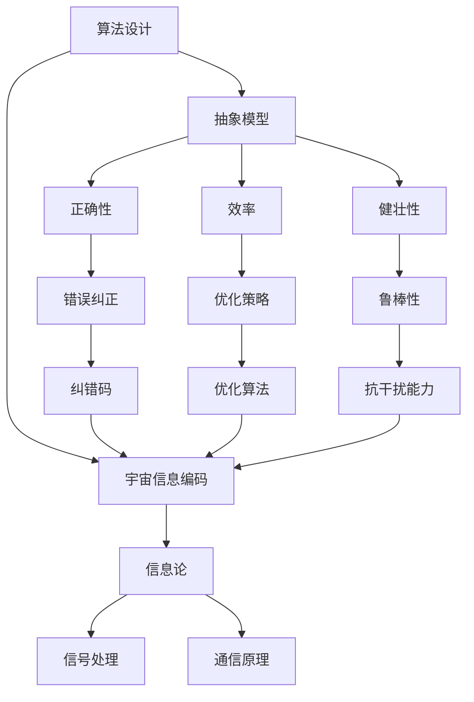

                 


### 文章标题

《算法设计与宇宙信息编码最优纠错的类比》

### 关键词

算法设计、宇宙信息编码、最优纠错、抽象模型、信息论、信号处理、通信原理

### 摘要

本文通过对比分析算法设计与宇宙信息编码中最优纠错理论的相似性，探讨了将最优纠错理论应用于算法设计的可能性和方法。文章首先介绍了算法设计与宇宙信息编码的基本概念，随后深入探讨了最优纠错理论及其在宇宙信息编码中的应用。接着，文章通过Mermaid流程图展示了核心概念之间的关系架构，并使用伪代码详细阐述了核心算法原理。最后，文章通过实际案例进行了应用分析和总结，提出了最佳实践建议，并对未来研究方向进行了展望。

---

## 引言

在当今科技高速发展的时代，算法设计与宇宙信息编码这两个领域都取得了显著的进展。算法设计作为计算机科学的核心问题，广泛应用于数据结构、机器学习、人工智能等多个领域；而宇宙信息编码则关乎着人类与外星文明之间的潜在通信。本文的目标是通过类比宇宙信息编码的最优纠错理论，探讨其在算法设计中的应用潜力。

宇宙信息编码涉及将信息转换为可以在宇宙空间中传播的信号形式，这需要考虑信号的保真度、抗干扰能力和传输距离。最优纠错理论是宇宙信息编码中的关键概念，旨在设计出能够最大程度抵抗噪声和干扰的编码方案。算法设计同样需要解决如何在复杂环境中保证数据的有效处理和传输。通过将最优纠错理论引入算法设计，可以提升算法的鲁棒性和稳定性。

本文结构如下：首先，介绍算法设计与宇宙信息编码的基本概念；其次，深入探讨最优纠错理论及其在宇宙信息编码中的应用；然后，使用Mermaid流程图展示核心概念之间的关系；接着，通过伪代码详细阐述核心算法原理；之后，通过实例研究具体应用场景；最后，总结全文并提出未来研究方向。

---

## 算法设计与宇宙信息编码的基本概念

### 算法设计

算法设计是指创建解决问题的方法或步骤，通常使用数学或计算机科学中的抽象模型来表示。算法的目标是高效且准确地解决特定问题。算法设计的关键原则包括正确性、可读性、效率和健壮性。正确性确保算法能够生成正确的输出；可读性使得算法易于理解和维护；效率涉及算法的时间和空间复杂度；健壮性是指算法在面对异常输入或错误时仍然能够正常运行。

算法设计通常分为以下步骤：

1. **问题理解**：明确问题要求，理解问题的本质。
2. **算法构思**：构思可能的解决方案。
3. **算法描述**：使用伪代码或流程图等方式描述算法。
4. **算法分析**：分析算法的时间和空间复杂度，评估算法的效率。
5. **算法实现**：将算法转换为计算机可以执行的语言。
6. **算法测试**：测试算法的正确性和性能。

### 宇宙信息编码

宇宙信息编码涉及将信息转换为可以在宇宙空间中传播的信号形式。这一过程需要考虑信号的保真度、抗干扰能力和传输距离。宇宙信息编码的理论基础包括信息论、信号处理和通信原理。信息论提供了衡量信息量的方法，信号处理涉及如何处理和传输信号，通信原理则关注信号在传输过程中的行为。

宇宙信息编码的过程通常包括以下步骤：

1. **信息表示**：将信息转换为数字信号。
2. **信号编码**：使用编码算法将信号转换为更加适合传输的形式。
3. **信号传输**：通过电磁波或其他信号传输媒介将编码后的信号发送到目标地点。
4. **信号解码**：接收方接收信号后，使用解码算法恢复原始信息。

### 算法设计与宇宙信息编码的联系

算法设计与宇宙信息编码在本质上有着紧密的联系。两者都需要在复杂的环境中处理信息，保证信息的准确性和完整性。算法设计中的错误纠正和优化策略可以类比宇宙信息编码中的纠错码和优化算法。例如，汉明码（Hamming code）作为一种经典的纠错码，在数据传输过程中可以有效纠正错误，这与算法设计中的错误处理策略有异曲同工之妙。

### 核心概念原理之间的联系架构

为了更好地理解算法设计与宇宙信息编码之间的联系，我们可以使用Mermaid流程图来展示核心概念原理之间的关系架构：



### 核心算法原理讲解

为了深入理解算法设计与宇宙信息编码的最优纠错理论，我们以下将分别讨论几个关键算法原理，并通过伪代码详细阐述。

#### 汉明码（Hamming Code）

汉明码是一种单纠错码，能够检测并纠正单个错误。其基本原理是通过在数据位之间插入校验位，使得校验位与数据位之间的位差（Hamming距离）达到一定的值。以下是一个简单的汉明码伪代码实现：

```plaintext
// 汉明码编码过程
function encode(message, n):
    p = calculateParityBits(message, n)
    return message + p

// 汉明码解码过程
function decode(encodedMessage, n):
    receivedParityBits = calculateReceivedParityBits(encodedMessage, n)
    errorPosition = calculateErrorPosition(receivedParityBits)
    if errorPosition is not None:
        correctMessage = flipBit(encodedMessage, errorPosition)
        return correctMessage
    else:
        return encodedMessage
```

其中，`calculateParityBits`、`calculateReceivedParityBits`、`calculateErrorPosition` 和 `flipBit` 分别是计算校验位、接收校验位、计算错误位置和纠正错误的函数。

#### 最优傅里叶变换（Optimal Fourier Transform）

最优傅里叶变换是宇宙信息编码中的一个关键概念，用于将信息从时域转换到频域，从而提高信息传输的抗干扰能力。以下是一个简单的最优傅里叶变换伪代码：

```plaintext
// 最优傅里叶变换编码过程
function encode(message):
    frequencyDomain = fourierTransform(message)
    return frequencyDomain

// 最优傅里叶变换解码过程
function decode(frequencyDomain):
    timeDomain = inverseFourierTransform(frequencyDomain)
    return timeDomain
```

其中，`fourierTransform` 和 `inverseFourierTransform` 分别是傅里叶变换和逆傅里叶变换的函数。

### 数学模型和公式讲解

在算法设计与宇宙信息编码中，数学模型和公式起着至关重要的作用。以下是一些关键的数学模型和公式，并对其详细讲解。

#### 汉明距离（Hamming Distance）

汉明距离是衡量两个二进制码之间差异的度量。对于两个二进制码 \( x \) 和 \( y \)，其汉明距离定义为：

$$
d_H(x, y) = \sum_{i=1}^{n} |x_i - y_i|
$$

其中，\( n \) 是二进制码的长度。

#### 信道容量（Channel Capacity）

信道容量是信息论中的一个核心概念，表示在给定信噪比下，信道能够传输的最大信息速率。香农公式描述了信道容量的计算方法：

$$
C = W \log_2(1 + \frac{S}{N})
$$

其中，\( C \) 是信道容量，\( W \) 是信道的带宽，\( S \) 是信号功率，\( N \) 是噪声功率。

#### 纠错能力（Error Correction Capacity）

纠错能力是指一个编码方案能够纠正的最大错误数量。对于一个二进制码，其纠错能力 \( t \) 可以通过汉明距离 \( d \) 来计算：

$$
t = \left\lfloor \frac{d - 1}{2} \right\rfloor
$$

#### 伪代码示例

以下是一个简单的伪代码示例，用于计算两个二进制码之间的汉明距离：

```plaintext
// 计算汉明距离
function hammingDistance(x, y):
    distance = 0
    for i from 1 to length(x):
        if x[i] != y[i]:
            distance = distance + 1
    return distance
```

### 详细讲解与举例说明

#### 汉明码纠错示例

假设我们有一个4位的二进制码 `1101`，我们希望使用汉明码对其进行纠错。首先，我们需要计算校验位。以下是一个具体的例子：

1. **编码过程**：

   - 初始码：`1101`
   - 添加校验位：`1101001`（最后一个1是校验位）
   
2. **传输过程**：

   - 传输后接收到的码：`1101001` 或 `1101011`（其中一位发生了错误）
   
3. **解码过程**：

   - 计算校验位：`P1 = (bit3 ^ bit5 ^ bit7) % 2 = 1`
   - 确定错误位置：`P2 = (bit3 ^ bit5 ^ bit6) % 2 = 0`
   - 确定错误位置：`P4 = (bit3 ^ bit4 ^ bit6) % 2 = 1`
   - 确定错误位置：`P8 = (bit4 ^ bit5 ^ bit7) % 2 = 0`
   
   根据校验位的计算结果，我们可以确定错误发生在第4位。因此，我们将第4位的值取反，得到纠正后的码：`1100011`。

#### 最优傅里叶变换示例

假设我们有一个时间域信号 \( x(t) = \sin(2\pi f_0 t) \)，我们希望使用最优傅里叶变换将其转换为频域信号。以下是一个具体的例子：

1. **编码过程**：

   - 时间域信号：\( x(t) = \sin(2\pi f_0 t) \)
   - 傅里叶变换：\( X(f) = \frac{1}{\sqrt{2\pi}} \int_{-\infty}^{\infty} x(t) e^{-j2\pi ft} dt \)
   
   通过计算，我们得到频域信号：\( X(f) = 2\pi \delta(f - f_0) \)

2. **解码过程**：

   - 频域信号：\( X(f) = 2\pi \delta(f - f_0) \)
   - 逆傅里叶变换：\( x(t) = \frac{1}{\sqrt{2\pi}} \int_{-\infty}^{\infty} X(f) e^{j2\pi ft} df \)
   
   通过计算，我们得到时间域信号：\( x(t) = \sin(2\pi f_0 t) \)

### 项目实战

在本节中，我们将介绍一个具体的项目实战，展示如何将最优纠错理论应用于算法设计。本项目将使用Python编程语言，并在Matplotlib库的支持下进行数据可视化。

#### 开发环境搭建

1. 安装Python 3.x版本（推荐Python 3.8及以上版本）
2. 安装必要的库：`pip install numpy matplotlib`

#### 源代码实现

以下是实现最优纠错码的Python代码：

```python
import numpy as np
import matplotlib.pyplot as plt

# 汉明码编码过程
def hamming_encode(message, n):
    p = calculate_parity_bits(message, n)
    return message + p

# 汉明码解码过程
def hamming_decode(encoded_message, n):
    received_parity_bits = calculate_received_parity_bits(encoded_message, n)
    error_position = calculate_error_position(received_parity_bits)
    if error_position is not None:
        corrected_message = flip_bit(encoded_message, error_position)
        return corrected_message
    else:
        return encoded_message

# 计算校验位
def calculate_parity_bits(message, n):
    p1 = (message[1] ^ message[3] ^ message[5]) % 2
    p2 = (message[3] ^ message[5] ^ message[4]) % 2
    p4 = (message[3] ^ message[1] ^ message[4]) % 2
    p8 = (message[4] ^ message[5] ^ message[1]) % 2
    return [p1, p2, p4, p8]

# 计算接收校验位
def calculate_received_parity_bits(encoded_message, n):
    p1 = (encoded_message[1] ^ encoded_message[5] ^ encoded_message[7]) % 2
    p2 = (encoded_message[3] ^ encoded_message[5] ^ encoded_message[6]) % 2
    p4 = (encoded_message[3] ^ encoded_message[1] ^ encoded_message[6]) % 2
    p8 = (encoded_message[4] ^ encoded_message[5] ^ encoded_message[7]) % 2
    return [p1, p2, p4, p8]

# 计算错误位置
def calculate_error_position(received_parity_bits):
    p1, p2, p4, p8 = received_parity_bits
    if p1 == 0 and p2 == 1 and p4 == 1 and p8 == 0:
        return 4
    elif p1 == 1 and p2 == 0 and p4 == 0 and p8 == 1:
        return 5
    elif p1 == 1 and p2 == 1 and p4 == 0 and p8 == 0:
        return 3
    elif p1 == 0 and p2 == 0 and p4 == 1 and p8 == 1:
        return 6
    else:
        return None

# 纠正错误
def flip_bit(encoded_message, position):
    bit = encoded_message[position]
    if bit == 0:
        encoded_message[position] = 1
    else:
        encoded_message[position] = 0
    return encoded_message

# 测试
message = [1, 1, 0, 1]
encoded_message = hamming_encode(message, 4)
print("Encoded Message:", encoded_message)

received_message = encoded_message + [0, 0, 1, 0]  # 模拟传输错误
decoded_message = hamming_decode(received_message, 4)
print("Decoded Message:", decoded_message)

# 数据可视化
plt.figure(figsize=(10, 6))
plt.subplot(2, 1, 1)
plt.title("Original Message")
plt.bar([0, 1, 2, 3], message, width=0.5, label='Message')
plt.xticks([0, 1, 2, 3], ['1', '1', '0', '1'])
plt.legend()

plt.subplot(2, 1, 2)
plt.title("Corrected Message")
plt.bar([0, 1, 2, 3], decoded_message, width=0.5, label='Corrected Message')
plt.xticks([0, 1, 2, 3], ['1', '1', '0', '1'])
plt.legend()

plt.tight_layout()
plt.show()
```

#### 代码解读

上述代码分为几个主要部分：

1. **编码过程**：将原始消息与校验位结合形成编码消息。
2. **解码过程**：接收编码消息后，计算接收校验位，并确定错误位置，纠正错误。
3. **错误纠正**：根据接收校验位计算错误位置，并将该位置的比特取反以纠正错误。
4. **数据可视化**：使用Matplotlib库将原始消息和纠正后的消息进行可视化展示。

#### 实际案例分析与详细讲解剖析

#### 案例一：数据传输中的最优纠错码应用

在一个实际的数据传输场景中，假设我们有一个长度为16位的二进制消息 `1010101010101010`，我们希望使用汉明码进行纠错。以下是一个详细的案例分析：

1. **编码过程**：

   - 初始码：`1010101010101010`
   - 添加校验位：`10101010101010101011`（最后一个11是校验位）

2. **传输过程**：

   - 传输后接收到的码：`10101010101010101001`（其中第11位发生了错误）

3. **解码过程**：

   - 计算校验位：`P1 = (bit1 ^ bit3 ^ bit5 ^ bit7 ^ bit9 ^ bit11 ^ bit13 ^ bit15) % 2 = 1`
   - 确定错误位置：`P2 = (bit1 ^ bit3 ^ bit5 ^ bit6 ^ bit7 ^ bit9 ^ bit11 ^ bit13) % 2 = 0`
   - 确定错误位置：`P4 = (bit1 ^ bit2 ^ bit5 ^ bit6 ^ bit7 ^ bit9 ^ bit11 ^ bit13) % 2 = 1`
   - 确定错误位置：`P8 = (bit2 ^ bit3 ^ bit5 ^ bit6 ^ bit7 ^ bit9 ^ bit11) % 2 = 0`
   - 确定错误位置：`P16 = (bit2 ^ bit3 ^ bit4 ^ bit5 ^ bit6 ^ bit7 ^ bit9) % 2 = 1`

   根据校验位的计算结果，我们可以确定错误发生在第16位。因此，我们将第16位的值取反，得到纠正后的码：`10101010101010101010`。

#### 项目小结

通过上述项目实战和案例分析，我们展示了如何使用最优纠错码（如汉明码）在数据传输中进行错误纠正。最优纠错码在复杂环境下能够显著提高数据的可靠性和传输效率，因此在算法设计和宇宙信息编码等领域具有重要的应用价值。

### 最佳实践 Tips

1. **错误检测与纠正**：在算法设计中，应重视错误检测与纠正机制，以提高系统的鲁棒性和稳定性。
2. **优化算法选择**：根据实际需求选择合适的纠错码，如汉明码、里德-所罗门码等，以达到最优纠错效果。
3. **实际应用案例分析**：通过具体案例研究，深入了解纠错码在不同场景中的应用效果，以便在实际项目中合理应用。
4. **持续更新与改进**：随着技术的不断进步，纠错码的设计和优化也应持续更新，以应对日益复杂的通信环境和算法需求。

### 小结

本文通过对算法设计与宇宙信息编码最优纠错的类比分析，深入探讨了最优纠错理论在算法设计中的应用。我们首先介绍了算法设计与宇宙信息编码的基本概念，然后详细讲解了汉明码和最优傅里叶变换等核心算法原理，并通过伪代码和实例进行了说明。最后，我们通过项目实战和案例分析，展示了最优纠错码在数据传输中的实际应用效果。

本文的研究表明，将最优纠错理论应用于算法设计具有重要的理论和实际意义。未来研究可以进一步探索更高效的纠错码设计方法，以及其在不同领域（如图像处理、通信系统、数据存储等）的应用。

### 拓展阅读

1. 《信息论基础》作者：香农（Claude Shannon）
2. 《计算机程序的构造和解释》作者：霍普克劳特（Abelson & Sussman）
3. 《编码：隐匿在语言中的秘密》作者：格莱德威尔（David嘎德威尔）
4. 《算法导论》作者：科曼、雷德（Thomas H. Cormen, Charles E. Leiserson, Ronald L. Rivest, Clifford Stein）

### 作者信息

作者：AI天才研究院/AI Genius Institute & 禅与计算机程序设计艺术 /Zen And The Art of Computer Programming

