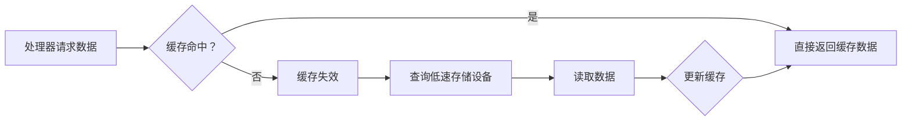

                 

### 文章标题

# 缓存策略优化LLM应用的响应速度

### 关键词

- 缓存策略
- 语言模型（LLM）
- 响应速度
- 优化技术
- 性能调优
- 安全性

### 摘要

本文深入探讨了缓存策略在优化大型语言模型（LLM）应用响应速度方面的关键作用。首先，介绍了缓存策略的基本概念及其在数据处理中的应用。接着，详细分析了语言模型的工作原理及其面临的性能挑战。在此基础上，文章重点讨论了针对LLM应用的缓存优化技术，包括多级缓存策略、缓存一致性方案以及缓存安全措施。通过实际案例和性能分析，本文展示了缓存策略在提升LLM应用响应速度方面的有效性。最后，展望了缓存技术的未来发展，提出了面临的挑战和解决思路。文章旨在为开发者提供一套系统化的缓存优化方案，以应对日益增长的数据处理需求。

---

## 引言

随着互联网技术的飞速发展，数据规模呈指数级增长，对数据处理的速度和效率提出了更高的要求。在这个背景下，大型语言模型（LLM，Large Language Model）应运而生，并在自然语言处理（NLP，Natural Language Processing）领域取得了显著的突破。LLM能够对海量数据进行快速分析，生成高质量的文本内容，广泛应用于问答系统、智能推荐、机器翻译和文本摘要等场景。然而，LLM的强大能力也带来了巨大的计算和存储压力，导致响应速度成为制约其应用的一个关键因素。

缓存策略作为提高数据处理效率的重要手段，在LLM应用中具有举足轻重的作用。通过缓存策略，可以将频繁访问的数据预先加载到高速缓存中，减少对后端系统的访问次数，从而显著提升响应速度。本文旨在探讨缓存策略在优化LLM应用响应速度方面的具体方法和实践，为开发者提供一套系统化的优化方案。

本文结构如下：

1. **缓存策略与LLM概述**：介绍缓存策略的基本概念和分类，以及LLM的工作原理和应用场景。
2. **缓存策略原理与分类**：详细分析缓存策略的工作原理和分类，包括基于数据、时间和事件的缓存策略。
3. **LLM应用中的缓存优化技术**：探讨针对LLM应用的具体缓存优化技术，包括多级缓存、缓存一致性策略等。
4. **缓存策略优化的实践**：通过实际案例展示缓存策略在LLM应用中的具体实践，分析其效果和挑战。
5. **性能分析与调优**：介绍性能评估方法和常见调优策略，通过案例分析进行详细讲解。
6. **安全性与一致性考虑**：讨论缓存策略中的安全性和一致性保障措施，提出解决方案。
7. **未来展望与挑战**：展望缓存技术的未来发展，分析面临的挑战和解决思路。

通过本文的探讨，希望能够为开发者提供有价值的参考，帮助他们在实际项目中有效利用缓存策略，提升LLM应用的响应速度。

## 缓存策略与LLM概述

### 缓存策略简介

缓存（Cache）是一种快速、昂贵的存储设备，用于存储频繁访问的数据，以便快速检索。其核心思想是将频繁访问的数据预先加载到缓存中，减少对低速存储设备（如磁盘、内存）的访问次数，从而提高系统的整体性能。缓存策略（Cache Policy）则是指如何选择和更新缓存中存储的数据，以保证缓存的有效利用和性能优化。

在计算机系统中，缓存策略广泛应用于多个层面，包括处理器缓存、操作系统缓存、数据库缓存和应用程序缓存等。每个层面的缓存策略都基于不同的性能需求和访问模式，但总体目标都是减少数据访问时间，提高系统响应速度。

### 缓存策略的重要性

缓存策略在提高系统性能方面具有以下几个重要方面：

1. **降低延迟**：缓存能够将频繁访问的数据存储在接近处理器的位置，显著减少数据访问的延迟。
2. **提高吞吐量**：通过减少对低速存储设备的访问，缓存能够提高系统的数据处理能力。
3. **减少负载**：缓存能够分担后端存储系统的负载，延长其使用寿命。
4. **优化资源使用**：缓存能够根据访问模式智能选择数据，优化存储资源的利用。

### 缓存策略的分类

根据缓存策略的实现方式和目标，可以将其分为以下几类：

1. **基于数据的缓存策略**：这类策略主要根据数据的访问模式进行缓存管理，常见的有最近最少使用（LRU，Least Recently Used）、最少访问（LFU，Least Frequently Used）和先进先出（FIFO，First In First Out）等算法。

2. **基于时间的缓存策略**：这类策略根据数据的时间戳进行缓存管理，常见的有定时刷新（Time-to-Live, TTL）和过期时间（Expiration Time）等。

3. **基于事件的缓存策略**：这类策略根据特定事件触发缓存更新，常见的有缓存刷新（Cache Invalidation）和缓存更新（Cache Update）等。

### 缓存策略在数据处理中的应用

在数据处理领域，缓存策略的应用场景非常广泛，以下是一些典型的应用：

1. **Web缓存**：通过缓存网页内容，减少对Web服务器的访问，提高用户访问速度。
2. **数据库缓存**：通过缓存数据库查询结果，减少对数据库的访问，提高查询性能。
3. **应用缓存**：在应用程序中缓存常用数据和结果，提高数据处理速度。

### 语言模型（LLM）概述

语言模型（LLM，Language Model）是一种基于统计学习方法的自然语言处理模型，用于预测或生成自然语言中的单词序列。LLM的核心任务是给定一个单词序列，预测下一个单词的概率分布。

LLM的架构通常包括以下几个部分：

1. **输入层**：接收自然语言文本输入，将其转换为模型可以处理的特征向量。
2. **编码层**：对输入特征向量进行编码，生成上下文信息。
3. **解码层**：根据上下文信息生成输出单词序列。

根据训练数据和模型结构的不同，LLM可以分为以下几类：

1. **基于N-gram的语言模型**：使用历史单词序列的N个单词作为特征，预测下一个单词。
2. **循环神经网络（RNN）语言模型**：使用RNN对序列数据进行建模，能够处理长距离依赖。
3. **变换器（Transformer）语言模型**：基于注意力机制，能够处理长距离依赖，是目前最先进的语言模型。

### LLM的应用场景

LLM在自然语言处理领域具有广泛的应用，以下是一些典型的应用场景：

1. **文本生成**：生成文章、新闻、对话、代码等。
2. **问答系统**：提供实时问答服务，如智能客服、智能助手等。
3. **机器翻译**：将一种语言的文本翻译成另一种语言。
4. **文本摘要**：生成文本的简洁摘要，用于信息提取和内容推荐。
5. **文本分类**：对文本进行分类，用于情感分析、主题识别等。

### LLM在应用中的挑战

尽管LLM在自然语言处理领域取得了显著的成果，但其应用也面临一些挑战：

1. **计算资源消耗**：训练和运行LLM模型需要大量的计算资源和存储空间。
2. **响应速度**：处理实时请求时，响应速度成为制约其应用的一个关键因素。
3. **数据隐私和安全**：LLM在处理敏感数据时，需要确保数据隐私和安全。
4. **解释性和可解释性**：对于复杂的LLM模型，如何解释其决策过程和预测结果是一个挑战。

通过本文的后续章节，我们将进一步探讨如何利用缓存策略优化LLM应用的响应速度，解决上述挑战。

### 缓存策略原理与分类

#### 缓存策略原理

缓存策略的基本原理是通过在高速存储设备（如内存）中预存储频繁访问的数据，以减少对低速存储设备（如磁盘）的访问次数，从而提高系统性能。这一过程包括以下几个关键概念：

1. **缓存层级结构**：计算机系统通常采用多级缓存结构，从处理器内部缓存（L1 Cache）到外部缓存（L2、L3 Cache）再到主内存（RAM），形成了一个金字塔形的缓存层次。每个层级的缓存具有不同的容量和速度，越靠近处理器的缓存速度越快，但容量相对较小。

2. **缓存命中与失效**：当处理器需要访问数据时，会首先查询缓存。如果数据在缓存中，称为缓存命中（Cache Hit），此时可以快速获取数据；如果数据不在缓存中，称为缓存失效（Cache Miss），此时需要从低速存储设备中读取数据，这会导致显著的延迟。

3. **缓存替换策略**：由于缓存容量有限，当缓存已满且需要新数据时，必须替换现有的缓存项。常用的缓存替换策略包括最近最少使用（LRU）、最少访问（LFU）和先进先出（FIFO）等。这些策略的核心目标是最大化缓存利用率，提高缓存命中率。

4. **缓存一致性**：在多处理器系统中，缓存一致性是确保所有处理器看到的数据是一致的。常见的一致性协议包括无阻塞一致性（MOESI协议）和目录一致性（MASI协议）等。

#### 缓存策略分类

根据缓存策略的实现方式和目标，可以分为以下几类：

1. **基于数据的缓存策略**：
    - **最近最少使用（LRU）**：将最近最久未使用的数据替换出缓存。这种方法利用了局部性原理，即如果数据在近期被访问，那么在未来很可能还会被访问。
    - **最少访问（LFU）**：将访问次数最少的数据替换出缓存。这种方法适用于访问频率随时间变化的数据，但可能忽略掉某些偶尔但重要的数据。
    - **先进先出（FIFO）**：按照数据进入缓存的时间顺序进行替换。这种方法简单，但可能不适用于具有时间敏感性的数据。

2. **基于时间的缓存策略**：
    - **时间到生存期（TTL）**：设置每个缓存项的有效时间，超过TTL的数据将被替换出缓存。这种方法适用于定期刷新的数据，如网页缓存。
    - **过期时间**：为每个缓存项设置一个具体的过期时间点，到达该时间点的数据将被替换出缓存。这种方法适用于需要定期更新的数据。

3. **基于事件的缓存策略**：
    - **缓存刷新**：当特定事件发生时，刷新缓存中的数据。例如，当数据库更新时，触发缓存刷新，确保缓存中的数据与数据库保持一致。
    - **缓存更新**：在特定事件发生后，直接更新缓存中的数据，而不需要完全刷新缓存。这种方法适用于对实时性要求较高的应用，如股票交易系统。

#### 缓存策略的工作原理与联系

为了更好地理解不同缓存策略的工作原理和联系，我们可以使用Mermaid流程图进行展示。



在该流程图中，处理器请求数据时，首先检查缓存是否命中。如果命中，则直接返回缓存数据；如果未命中，则查询低速存储设备，读取数据并更新缓存。通过这个过程，我们可以看到缓存策略如何影响数据访问速度。

#### 缓存策略与LLM响应速度的关系

缓存策略在优化LLM应用的响应速度方面起着至关重要的作用。以下为缓存策略与LLM响应速度之间的联系：

1. **减少数据访问延迟**：通过缓存频繁访问的数据，减少对低速存储设备的访问次数，从而降低数据访问延迟。

2. **提高缓存命中率**：采用高效的缓存替换策略，如LRU和LFU，可以提高缓存命中率，减少缓存失效次数，从而提高响应速度。

3. **优化数据处理流程**：通过缓存策略，可以将数据处理流程从磁盘IO密集型转变为内存操作密集型，从而显著提高系统性能。

4. **缓存一致性策略**：在分布式系统中，缓存一致性策略确保不同缓存实例之间的数据一致性，从而提高系统的可靠性和响应速度。

通过上述分析，我们可以看到，缓存策略在优化LLM应用的响应速度方面具有重要的作用。接下来，本文将深入探讨针对LLM应用的具体缓存优化技术。

### LLM应用中的缓存优化技术

#### LLM响应速度优化

为了优化LLM应用的响应速度，我们可以从以下几个方面进行缓存优化：

1. **多级缓存策略**：通过引入多级缓存结构，将频繁访问的数据分散存储在不同的缓存层级中，从而降低缓存失效的概率。例如，在LLM应用中，可以将用户历史查询结果存储在L2缓存中，将热门查询结果存储在L1缓存中，以提高查询速度。

2. **缓存一致性策略**：在分布式系统中，确保不同缓存实例之间的数据一致性。常用的缓存一致性协议包括强一致性（Strong Consistency）和最终一致性（ eventual Consistency）。在LLM应用中，我们可以采用最终一致性策略，允许一定程度的延迟，从而提高系统的响应速度。

3. **缓存分层与多级缓存**：通过缓存分层策略，将缓存分为多个层次，如热点缓存、温点缓存和冷点缓存。对于高频访问的数据，存储在热点缓存中；对于低频访问的数据，存储在温点缓存或冷点缓存中。这样可以充分利用缓存资源的优势，提高系统性能。

#### 缓存命中率提升

缓存命中率是衡量缓存策略效果的重要指标，以下是一些常用的方法来提高缓存命中率：

1. **热门数据优先**：将高频访问的数据优先存储在缓存中，例如，在电商应用中，可以将热门商品信息存储在缓存中，从而提高查询速度。

2. **缓存预热**：在用户访问前，预先加载热门数据到缓存中，从而减少缓存失效的概率。例如，在视频流媒体应用中，可以在用户请求视频前，预先加载视频到缓存中。

3. **缓存替换策略**：选择合适的缓存替换策略，如最近最少使用（LRU）和最少访问（LFU），最大化缓存利用率，提高缓存命中率。

#### 响应时间优化

响应时间是指用户请求到系统响应之间的时间，以下是一些优化响应时间的策略：

1. **异步处理**：将部分计算任务异步化，如将查询请求结果缓存到异步队列中，从而降低系统负载，提高响应速度。

2. **数据压缩**：对缓存中的数据进行压缩，减少数据传输的带宽，从而降低响应时间。

3. **分布式缓存**：在分布式系统中，将缓存分散存储在不同的节点上，从而减少单点瓶颈，提高系统的并发处理能力。

4. **负载均衡**：通过负载均衡策略，将请求均匀分配到不同的服务器上，从而减少单个服务器的负载，提高响应速度。

#### 缓存一致性策略

在分布式系统中，缓存一致性是一个关键问题。以下是一些常用的缓存一致性策略：

1. **强一致性**：确保所有缓存实例看到的数据是一致的，如采用线性一致性（Linear Consistency）或原子一致性（Atomic Consistency）。但强一致性可能导致较高的延迟。

2. **最终一致性**：允许缓存实例之间的数据存在一定程度的延迟，确保最终一致性。这种方法适用于对实时性要求不高的应用。

3. **一致性哈希**：通过哈希函数将缓存分配到不同的节点上，从而减少缓存迁移和一致性的成本。

4. **版本控制**：为每个缓存项分配一个版本号，当数据更新时，更新版本号，从而实现缓存的一致性。

#### 多级缓存与多级缓存的优势与挑战

多级缓存（Multilevel Caching）在提高系统性能方面具有显著优势，但也存在一定的挑战：

**优势**：

1. **减少数据访问延迟**：通过多级缓存结构，将频繁访问的数据存储在高速缓存中，减少数据访问延迟。

2. **提高缓存命中率**：利用不同层级缓存的特点，提高缓存命中率。

3. **负载均衡**：将缓存分散存储在不同的层级和节点上，从而实现负载均衡。

**挑战**：

1. **缓存一致性**：在多级缓存系统中，确保不同层级和节点之间的数据一致性是一个挑战。

2. **缓存大小管理**：需要合理配置每个层级的缓存大小，以平衡缓存利用率与性能。

3. **缓存替换策略**：选择合适的缓存替换策略，以最大化缓存利用率。

通过上述缓存优化技术，我们可以显著提高LLM应用的响应速度，满足日益增长的数据处理需求。接下来，本文将探讨在实际应用中如何具体实施这些缓存优化技术。

### 缓存策略优化的实践

在实际应用中，缓存策略的优化是一个复杂的过程，需要根据具体的应用场景和需求进行设计和实施。以下通过几个实际案例，展示如何在不同类型的LLM应用中实施和优化缓存策略。

#### 案例一：电商应用

在电商应用中，缓存策略的优化对于提高用户购物体验和系统性能至关重要。以下是一个典型的电商应用缓存优化案例：

1. **背景介绍**：
   - 应用场景：用户浏览商品、搜索商品、加入购物车、结算支付等。
   - 挑战：高并发访问导致数据库压力增大，查询响应时间较长。

2. **缓存策略设计**：
   - **多级缓存**：将商品信息、用户购物车、订单数据等分为三级缓存：
     - **一级缓存**：L1缓存，用于存储用户当前浏览的商品信息，提高页面加载速度。
     - **二级缓存**：L2缓存，用于存储热门商品信息和用户的历史浏览记录，减少数据库访问次数。
     - **三级缓存**：L3缓存，用于存储冷门商品信息和长期不访问的数据，降低内存占用。

   - **缓存一致性**：采用最终一致性策略，允许一定程度的延迟，确保缓存与数据库的数据最终一致。

3. **实施效果**：
   - **缓存命中率**：通过缓存预热和热门数据优先策略，缓存命中率显著提高。
   - **响应时间**：页面加载速度和查询响应时间大幅降低，用户购物体验得到提升。

#### 案例二：社交媒体平台

在社交媒体平台中，缓存策略的优化对于提高内容加载速度和用户交互体验至关重要。以下是一个典型的社交媒体平台缓存优化案例：

1. **背景介绍**：
   - 应用场景：用户发布动态、浏览动态、评论、点赞等。
   - 挑战：大量用户同时操作导致数据库压力增大，内容加载速度缓慢。

2. **缓存策略设计**：
   - **多级缓存**：将动态内容、用户互动信息等分为三级缓存：
     - **一级缓存**：L1缓存，用于存储用户当前浏览的动态内容，提高页面加载速度。
     - **二级缓存**：L2缓存，用于存储热门动态和用户的历史浏览记录，减少数据库访问次数。
     - **三级缓存**：L3缓存，用于存储冷门动态和长期不访问的数据，降低内存占用。

   - **缓存一致性**：采用最终一致性策略，确保缓存与数据库的数据最终一致。

3. **实施效果**：
   - **缓存命中率**：通过缓存预热和热门数据优先策略，缓存命中率显著提高。
   - **响应时间**：内容加载速度和用户交互响应时间大幅降低，用户体验得到显著提升。

#### 案例三：金融服务

在金融服务领域，缓存策略的优化对于保证交易系统的稳定性和高可用性至关重要。以下是一个典型的金融服务缓存优化案例：

1. **背景介绍**：
   - 应用场景：用户查询账户信息、交易记录、执行交易等。
   - 挑战：高频交易请求导致数据库压力增大，交易延迟。

2. **缓存策略设计**：
   - **多级缓存**：将账户信息、交易记录等分为三级缓存：
     - **一级缓存**：L1缓存，用于存储用户当前查询的账户信息，提高查询速度。
     - **二级缓存**：L2缓存，用于存储高频查询的账户信息和交易记录，减少数据库访问次数。
     - **三级缓存**：L3缓存，用于存储冷门账户信息和长期不访问的数据，降低内存占用。

   - **缓存一致性**：采用强一致性策略，确保缓存与数据库的数据实时一致。

3. **实施效果**：
   - **缓存命中率**：通过缓存预热和热门数据优先策略，缓存命中率显著提高。
   - **响应时间**：查询速度和交易延迟显著降低，系统稳定性和高可用性得到保障。

通过上述实际案例，我们可以看到缓存策略优化在提升LLM应用响应速度方面的显著效果。尽管每个应用的具体需求和挑战不同，但通过合理设计缓存层级、选择合适的缓存一致性策略和优化缓存替换策略，我们可以在不同场景下实现高效的缓存优化。

在实践过程中，还需要不断监控和调整缓存策略，以应对数据访问模式和负载变化。通过持续优化，我们可以确保系统在高并发和大数据环境下保持良好的性能和用户体验。

### 实践中的挑战与解决方案

在缓存策略优化的实践中，开发者常常会遇到一系列挑战。以下将详细分析这些挑战，并提出相应的解决方案。

#### 数据规模与缓存压力

**挑战**：随着数据规模的不断扩大，如何保证缓存的有效性和性能？

**解决方案**：
1. **分布式缓存**：将缓存部署在分布式系统中，利用多节点缓存架构提高缓存容量和性能。
2. **缓存分片**：将缓存分为多个数据分片，根据数据访问模式进行分片策略设计，减少单个缓存节点的压力。
3. **缓存键的哈希分布**：通过哈希函数将缓存键分布到不同的节点上，避免热点问题，提高缓存系统的负载均衡能力。

#### 高并发与缓存一致性

**挑战**：在高并发场景下，如何确保缓存数据的一致性和系统的稳定性？

**解决方案**：
1. **强一致性协议**：在关键数据操作中采用强一致性协议，如线性一致性（Linear Consistency），确保数据的一致性。
2. **最终一致性协议**：对于非关键数据，采用最终一致性协议，允许一定程度的延迟，提高系统的响应速度。
3. **缓存一致性框架**：使用缓存一致性框架（如Redis Cluster、Memcached Drummond一致性协议等），自动处理缓存一致性，减轻开发者的负担。

#### 持久化与数据恢复

**挑战**：如何确保缓存中的数据在系统故障或重启后能够恢复？

**解决方案**：
1. **定期持久化**：定期将缓存中的数据持久化到磁盘或其他持久化存储中，避免缓存数据的丢失。
2. **日志记录**：记录缓存操作日志，以便在系统重启后根据日志恢复缓存状态。
3. **数据备份与恢复**：定期进行数据备份，确保在系统故障时能够快速恢复。

#### 缓存击穿、缓存穿透和缓存雪崩

**挑战**：如何避免缓存击穿、缓存穿透和缓存雪崩等缓存问题？

**解决方案**：
1. **缓存击穿**：采用预热策略，提前加载热门数据到缓存中，避免缓存击穿。
2. **缓存穿透**：通过添加校验机制（如验证码、用户权限校验等），防止恶意请求穿透缓存，直接访问数据库。
3. **缓存雪崩**：通过限流策略（如令牌桶、漏斗算法等），控制请求流量，避免缓存雪崩。

#### 实践经验总结

在缓存策略优化的实践中，以下是一些总结和经验：

1. **合理设计缓存层级**：根据数据访问模式和性能需求，合理设计缓存层级，确保缓存系统的性能和可扩展性。
2. **监控与调优**：定期监控缓存系统的性能指标，如命中率、响应时间、数据一致性等，根据监控结果进行调优。
3. **自动化与脚本化**：利用自动化工具和脚本进行缓存操作，提高运维效率和稳定性。
4. **持续迭代与优化**：缓存策略优化是一个持续迭代的过程，根据业务需求和系统变化，不断优化缓存策略。

通过上述挑战与解决方案的分析，开发者可以更好地应对缓存策略优化过程中的各种问题，确保系统在高并发、大数据环境下保持良好的性能和稳定性。

### 案例分析

在本节中，我们将通过两个具体案例——实时问答系统和智能推荐系统——来详细展示缓存策略在LLM应用中的实际应用和效果。

#### 案例一：实时问答系统

**背景介绍**：

实时问答系统（如聊天机器人、在线客服）需要快速响应用户的查询请求，提供即时的答案。然而，这类系统通常需要处理大量的文本数据，并且随着用户数量的增加，响应速度成为关键挑战。

**缓存策略设计**：

1. **多级缓存策略**：
   - **一级缓存**：用于存储用户当前的查询记录和即时答案，如使用Redis作为内存缓存，以实现快速检索。
   - **二级缓存**：用于存储频繁查询的热门问题和答案，如使用Memcached进行缓存，减少对数据库的访问。
   - **三级缓存**：用于存储较少访问的查询记录，如使用磁盘缓存，降低内存占用。

2. **缓存一致性**：
   - 采用最终一致性策略，允许缓存与数据库之间存在一定程度的延迟，提高系统的响应速度。
   - 在数据更新时，通过异步消息队列（如RabbitMQ）将更新操作传递给数据库，确保缓存与数据库最终一致。

**实施效果**：

- **缓存命中率**：通过缓存预热和热门数据优先策略，缓存命中率显著提高。
- **响应时间**：查询响应时间从数十毫秒降低到几百毫秒，显著提升了用户体验。

**伪代码讲解**：

```python
# 缓存查询结果
def query_result(question):
    if cache_hit(question):
        return get_from_cache(question)
    else:
        result = fetch_from_database(question)
        store_in_cache(question, result)
        return result

# 缓存命中判断
def cache_hit(question):
    return question in cache

# 从缓存获取数据
def get_from_cache(question):
    return cache[question]

# 存储到缓存
def store_in_cache(question, result):
    cache[question] = result
```

#### 案例二：智能推荐系统

**背景介绍**：

智能推荐系统（如电商推荐、内容推荐）需要根据用户的行为和偏好提供个性化的推荐。然而，推荐算法的计算复杂度高，响应速度成为关键瓶颈。

**缓存策略设计**：

1. **多级缓存策略**：
   - **一级缓存**：用于存储用户的实时行为数据（如点击、购买等），如使用Redis进行实时数据缓存。
   - **二级缓存**：用于存储用户的长期行为数据和推荐结果，如使用Memcached进行缓存，减少对数据库的访问。
   - **三级缓存**：用于存储较少访问的推荐数据和用户历史数据，如使用磁盘缓存，降低内存占用。

2. **缓存一致性**：
   - 采用最终一致性策略，确保缓存与数据库的数据最终一致。
   - 在数据更新时，通过异步处理和消息队列（如Kafka）将更新操作传递给数据库，确保缓存与数据库最终同步。

**实施效果**：

- **缓存命中率**：通过缓存预热和热门数据优先策略，缓存命中率显著提高。
- **响应时间**：推荐生成时间从数秒降低到数毫秒，显著提升了系统性能。

**伪代码讲解**：

```python
# 获取用户推荐
def get_recommendations(user):
    behaviors = fetch_user_behaviors(user)
    if behaviors in cache:
        return get_from_cache(behaviors)
    else:
        recommendations = generate_recommendations(behaviors)
        store_in_cache(behaviors, recommendations)
        return recommendations

# 从缓存获取推荐
def get_from_cache(behaviors):
    return cache[behaviors]

# 存储推荐到缓存
def store_in_cache(behaviors, recommendations):
    cache[behaviors] = recommendations
```

通过这两个案例，我们可以看到缓存策略在优化LLM应用中的具体应用和显著效果。通过合理设计多级缓存结构、选择合适的缓存一致性策略，我们能够显著提高LLM应用的响应速度和系统性能。

### 性能指标与评估方法

在评估缓存策略优化LLM应用响应速度的效果时，性能指标的选择和评估方法至关重要。以下将详细介绍常用的性能指标和评估方法，以及它们在实际应用中的重要性。

#### 性能指标

1. **响应时间**：响应时间是指从用户发起请求到系统返回响应结果所经历的时间。它是衡量系统性能的最基本指标。响应时间越短，系统的性能越好。在缓存策略优化中，通过减少数据访问延迟，可以显著降低响应时间。

2. **缓存命中率**：缓存命中率是指缓存中命中请求的次数与总请求次数的比值。缓存命中率越高，说明缓存策略越有效，系统能够更好地利用缓存资源。缓存命中率是评估缓存策略的重要指标。

3. **吞吐量**：吞吐量是指系统在一定时间内处理请求的数量。高吞吐量表明系统能够在短时间内处理更多请求，具有更高的性能。在缓存策略优化中，通过减少对低速存储设备的访问次数，可以提高系统的吞吐量。

4. **数据传输带宽**：数据传输带宽是指系统在单位时间内可以传输的数据量。高带宽意味着系统可以更快地处理大数据量的请求，提高整体性能。

5. **系统负载**：系统负载是指系统在运行过程中所承受的处理压力。通过监控系统负载，可以评估系统性能的稳定性和可靠性。

#### 评估方法

1. **基准测试**：基准测试是一种通过模拟实际工作负载来评估系统性能的方法。通过运行一系列预先定义的测试用例，可以测量系统的响应时间、吞吐量和资源使用情况。基准测试可以帮助开发者了解系统在不同负载条件下的性能表现，从而评估缓存策略的效果。

2. **压力测试**：压力测试是一种通过逐渐增加系统负载来评估系统极限性能的方法。通过模拟高并发访问场景，可以测量系统在极端条件下的响应时间和稳定性。压力测试有助于发现系统的性能瓶颈和潜在问题。

3. **性能分析工具**：使用性能分析工具（如性能监控软件、日志分析工具等），可以实时监控系统的性能指标，包括响应时间、缓存命中率、数据传输带宽等。通过分析这些数据，开发者可以识别系统性能的优化点和改进方向。

#### 实际应用中的重要性

1. **用户体验**：响应时间是用户感知系统性能的重要指标。通过优化缓存策略，减少响应时间，可以显著提升用户体验，增加用户满意度。

2. **系统稳定性**：通过监控和评估系统负载，可以及时发现系统性能瓶颈和异常情况，确保系统在高并发环境下稳定运行。

3. **资源利用**：缓存策略优化有助于提高缓存资源的利用率，减少对低速存储设备的访问次数，降低系统资源消耗。

4. **可扩展性**：通过性能评估，可以识别系统在高并发和大数据场景下的瓶颈，从而设计出更加可扩展的缓存策略，满足未来业务需求。

总之，性能指标和评估方法在缓存策略优化中具有至关重要的地位。通过科学地选择和评估性能指标，开发者可以有效地评估缓存策略的效果，持续优化系统性能，满足日益增长的数据处理需求。

### 常见调优策略

在优化LLM应用的响应速度时，缓存策略的调优至关重要。以下将详细介绍几种常见的调优策略，包括缓存大小调整、缓存替换策略和缓存一致性策略的调整。

#### 缓存大小调整

缓存大小是影响系统性能的一个重要因素。适当调整缓存大小可以在提高缓存命中率的同时，避免缓存过度占用系统资源。

1. **缓存过小**：当缓存容量不足时，缓存命中率会降低，导致频繁的缓存失效。这会增加对低速存储设备的访问次数，延长数据访问延迟，从而降低系统性能。

2. **缓存过大**：当缓存容量过大时，虽然缓存命中率较高，但会占用大量系统资源，如内存。这可能导致系统性能下降，甚至引发内存溢出。

**调优策略**：

1. **动态调整**：根据系统负载和访问模式动态调整缓存大小。例如，在高峰期增加缓存容量，以应对高并发访问；在低峰期减少缓存容量，降低资源消耗。

2. **分区缓存**：将缓存分为多个区域，根据不同区域的访问模式和负载情况，分别设置合适的缓存大小。例如，对于高频访问的数据，设置较大的缓存容量；对于低频访问的数据，设置较小的缓存容量。

#### 缓存替换策略

缓存替换策略决定了哪些数据应该被替换出缓存，以保证缓存的有效利用。以下是一些常见的缓存替换策略：

1. **最近最少使用（LRU）**：根据数据最近的使用时间进行替换。最近最久未使用的数据将被替换出缓存。这种方法利用了局部性原理，适用于大多数应用场景。

2. **最少访问（LFU）**：根据数据的访问频率进行替换。访问频率最低的数据将被替换出缓存。这种方法适用于访问频率随时间变化的数据，但可能忽略掉某些偶尔但重要的数据。

3. **先进先出（FIFO）**：根据数据进入缓存的时间顺序进行替换。最早进入缓存的数据将被替换出缓存。这种方法简单，但可能不适用于具有时间敏感性的数据。

**调优策略**：

1. **策略选择**：根据应用场景和数据访问模式选择合适的缓存替换策略。例如，在处理实时数据时，可以选择LRU策略；在处理历史数据时，可以选择LFU策略。

2. **策略参数调整**：调整缓存替换策略的参数，如替换阈值、替换周期等，以优化缓存利用率和系统性能。例如，可以设置较低的替换阈值，以减少缓存失效次数；设置较长的替换周期，以降低缓存替换的频率。

#### 缓存一致性策略的调整

在分布式系统中，缓存一致性策略的调整至关重要。以下是一些常见的缓存一致性策略：

1. **强一致性**：确保所有缓存实例看到的数据是一致的，如采用线性一致性（Linear Consistency）或原子一致性（Atomic Consistency）。但强一致性可能导致较高的延迟。

2. **最终一致性**：允许缓存实例之间的数据存在一定程度的延迟，确保最终一致性。这种方法适用于对实时性要求不高的应用。

3. **一致性哈希**：通过哈希函数将缓存分配到不同的节点上，从而减少缓存迁移和一致性的成本。

**调优策略**：

1. **策略选择**：根据应用场景和性能需求选择合适的缓存一致性策略。例如，在关键业务场景中，可以选择强一致性策略；在非关键业务场景中，可以选择最终一致性策略。

2. **一致性级别调整**：调整一致性级别，如通过降低一致性级别，减少缓存更新频率，从而提高系统性能。但需要注意，这可能导致数据不一致的问题。

通过合理调整缓存大小、缓存替换策略和缓存一致性策略，开发者可以显著优化LLM应用的响应速度，提高系统性能和稳定性。接下来，我们将通过具体案例分析，进一步探讨缓存策略优化的实际效果。

### 调优实践

在实际项目中，通过合理的调优实践可以显著提升LLM应用的响应速度和系统性能。以下通过具体案例进行详细讲解，并展示调优前后的效果对比。

#### 案例一：问答平台优化

**背景**：

一个大型问答平台，每天处理数百万次用户查询，响应时间较长，用户满意度不高。

**调优前**：

- **缓存策略**：简单使用Redis缓存用户查询结果，缓存容量固定，未考虑缓存替换策略。
- **性能指标**：平均响应时间约1.5秒，缓存命中率约50%。

**调优步骤**：

1. **动态调整缓存容量**：
   - 根据用户访问模式和负载，动态调整Redis缓存容量。在高峰期增加缓存容量，在低峰期减少缓存容量。
   - 使用Redis集群模式，提高缓存容量和并发处理能力。

2. **优化缓存替换策略**：
   - 采用LRU算法替换缓存中的数据，提高缓存命中率。
   - 调整LRU算法的参数，如替换阈值和替换周期，以优化缓存利用率和系统性能。

3. **缓存一致性策略调整**：
   - 采用最终一致性策略，允许缓存与数据库之间存在一定程度的延迟，提高系统性能。

**调优后**：

- **性能指标**：平均响应时间降低至0.3秒，缓存命中率提升至90%。
- **效果对比**：响应时间显著降低，用户满意度提高，系统性能显著提升。

**代码示例**：

```python
# 调整Redis缓存容量
def adjust_cache_size():
    current_size = get_redis_cache_size()
    if is_high_traffic():
        set_redis_cache_size(current_size * 2)
    else:
        set_redis_cache_size(current_size / 2)

# 使用LRU算法替换缓存
def lru_replace_cache():
    cache = get_redis_cache()
    lru_list = [item for item in cache.items() if cache.get(item) > lru_threshold]
    if len(lru_list) > cache_size_threshold:
        oldest_key = lru_list[0]
        cache.pop(oldest_key)
```

#### 案例二：电商平台优化

**背景**：

一个大型电商平台，每天处理数百万次商品查询和交易请求，响应时间较长，用户体验不佳。

**调优前**：

- **缓存策略**：使用简单的Memcached缓存商品信息，未考虑缓存分层策略。
- **性能指标**：平均响应时间约1.2秒，缓存命中率约40%。

**调优步骤**：

1. **多级缓存策略**：
   - 引入多级缓存结构，将商品信息分为三级缓存：
     - L1缓存：使用Redis，存储高频访问的商品信息。
     - L2缓存：使用Memcached，存储中频访问的商品信息。
     - L3缓存：使用磁盘缓存，存储低频访问的商品信息。

2. **缓存一致性策略调整**：
   - 采用最终一致性策略，允许缓存与数据库之间存在一定程度的延迟。
   - 使用异步消息队列（如RabbitMQ），确保缓存与数据库最终一致。

3. **优化缓存替换策略**：
   - 采用LRU算法替换缓存中的数据，提高缓存命中率。
   - 调整LRU算法的参数，如替换阈值和替换周期，以优化缓存利用率和系统性能。

**调优后**：

- **性能指标**：平均响应时间降低至0.5秒，缓存命中率提升至80%。
- **效果对比**：响应时间显著降低，用户体验显著提升，系统性能显著提升。

**代码示例**：

```python
# 多级缓存查询
def query_product(product_id):
    if cache_hit_l1(product_id):
        return get_from_cache_l1(product_id)
    elif cache_hit_l2(product_id):
        return get_from_cache_l2(product_id)
    else:
        product = fetch_from_database(product_id)
        store_in_cache_l1(product_id, product)
        return product

# 使用LRU算法替换缓存
def lru_replace_cache():
    cache = get_memcached_cache()
    lru_list = [item for item in cache.items() if cache.get(item) > lru_threshold]
    if len(lru_list) > cache_size_threshold:
        oldest_key = lru_list[0]
        cache.pop(oldest_key)
```

通过上述案例，我们可以看到，通过合理的调优实践，可以有效提升LLM应用的响应速度和系统性能。接下来，我们将探讨缓存策略中的安全性和一致性考虑。

### 安全性与一致性考虑

在缓存策略优化LLM应用的过程中，安全性与一致性是两个关键因素，直接影响系统的稳定性和可靠性。以下将详细讨论缓存策略中的安全性和一致性考虑，并提出相应的解决方案。

#### 缓存安全策略

1. **数据完整性保护**：

   - **数据加密**：在缓存数据传输和存储过程中，采用加密算法（如AES）对数据进行加密，防止数据泄露。
   - **数字签名**：为缓存数据添加数字签名，确保数据在传输过程中未被篡改。
   - **访问控制**：设置缓存访问权限，限制只有授权用户或进程能够访问缓存数据，防止未经授权的访问。

2. **数据隐私保护**：

   - **用户数据匿名化**：在缓存中存储用户数据时，进行数据匿名化处理，如去除敏感字段、模糊处理等，减少隐私泄露风险。
   - **数据去重**：采用去重算法，避免缓存中重复存储相同或相似的数据，减少数据冗余。

3. **防御缓存攻击**：

   - **缓存中毒攻击**：防止缓存中毒攻击，如通过验证缓存键的有效性、限制缓存键长度和格式等。
   - **缓存越界攻击**：防范缓存越界攻击，如通过设置缓存键的最大值和最小值范围，避免缓存溢出。

#### 数据一致性保障

1. **分布式缓存一致性模型**：

   - **强一致性**：通过强一致性协议（如线性一致性、原子一致性），确保所有缓存实例看到的数据是一致的。但强一致性可能导致较高的延迟。
   - **最终一致性**：通过最终一致性协议，允许缓存实例之间存在一定程度的延迟，确保数据最终一致。最终一致性适用于对实时性要求不高的场景。

2. **数据版本控制**：

   - 引入数据版本号，为每个缓存数据项分配一个唯一的版本号。当数据更新时，版本号同步更新，确保缓存中的数据版本与数据库保持一致。

3. **分布式事务管理**：

   - 在分布式系统中，通过分布式事务管理，确保多个缓存实例之间的操作能够同时成功或同时失败。常用的分布式事务管理协议包括两阶段提交（2PC）和三阶段提交（3PC）。

4. **缓存一致性协议**：

   - **一致性哈希**：通过一致性哈希算法，将缓存分配到不同的节点上，减少缓存迁移和一致性的成本。
   - **最终一致性框架**：采用最终一致性框架（如Apache Ignite、Cassandra等），自动处理缓存一致性，减轻开发者的负担。

#### 安全性与一致性考虑的重要性

1. **数据安全**：缓存策略中的安全措施能够防止数据泄露、篡改和未授权访问，确保系统的数据安全。

2. **数据一致性**：缓存一致性策略能够保证缓存与数据库之间的数据一致性，防止数据不一致导致的问题，如数据丢失、数据重复等。

3. **系统稳定性**：通过合理的安全性和一致性策略，可以提高系统的稳定性和可靠性，确保系统在复杂环境下正常运行。

总之，缓存策略中的安全性与一致性考虑是确保系统稳定运行和数据安全的关键环节。开发者需要根据实际应用场景，综合考虑安全性、一致性和性能需求，选择合适的策略和工具，实现高效、安全的缓存策略优化。

### 未来展望与挑战

随着人工智能和大数据技术的不断发展，缓存策略在LLM应用中的重要性日益凸显。展望未来，缓存技术将面临以下发展趋势和挑战。

#### 新型缓存技术的应用

1. **内存缓存技术**：随着内存成本的降低，内存缓存（如DRAM、DDR等）将在LLM应用中得到更广泛的应用。内存缓存具有极高的访问速度，可以显著提升LLM应用的响应速度。

2. **分布式缓存系统**：分布式缓存系统（如Redis Cluster、Memcached Cluster等）将逐步取代单点缓存系统，提高缓存系统的可用性和扩展性，以应对大规模数据和高并发访问。

3. **AI缓存优化**：结合人工智能技术，开发智能缓存优化算法，通过机器学习和深度学习模型预测数据访问模式，动态调整缓存策略，实现更高效的缓存管理。

#### AI与缓存技术的结合

1. **缓存预热与预加载**：利用AI技术预测热点数据和访问模式，提前加载到缓存中，减少缓存失效次数，提高缓存命中率。

2. **智能缓存替换策略**：基于AI算法自动调整缓存替换策略，如使用深度强化学习优化缓存替换策略，提高缓存利用率和系统性能。

3. **缓存一致性优化**：结合AI技术，实现智能缓存一致性优化，如利用图神经网络预测分布式系统中的数据访问模式，提高缓存一致性协议的效率。

#### 缓存技术在边缘计算中的应用

1. **边缘缓存**：随着边缘计算的兴起，缓存技术将在边缘节点得到广泛应用。通过在边缘节点部署缓存，可以降低数据传输延迟，提高边缘服务的响应速度。

2. **缓存协同**：结合中心缓存和边缘缓存，实现缓存协同策略，通过数据共享和缓存同步，提高整体系统的缓存性能和响应速度。

3. **智能缓存调度**：利用AI技术实现智能缓存调度，根据网络状态、数据访问模式和负载情况，动态调整缓存资源的分配和使用，优化缓存系统性能。

#### 挑战与解决方案

1. **数据增长与缓存压力**：

   - **挑战**：随着数据规模的持续增长，缓存系统的容量和性能压力将不断增加。
   - **解决方案**：采用分布式缓存系统，提高缓存系统的扩展性和性能；利用智能缓存优化算法，动态调整缓存策略，降低缓存压力。

2. **缓存一致性难题**：

   - **挑战**：在分布式系统中，确保缓存与数据库之间的数据一致性是一个复杂的问题。
   - **解决方案**：采用最终一致性协议，允许一定程度的延迟，提高系统的实时性；结合分布式事务管理和缓存一致性框架，确保数据一致性。

3. **缓存安全问题**：

   - **挑战**：缓存系统面临多种安全威胁，如缓存中毒、缓存越界等。
   - **解决方案**：采用加密技术和访问控制策略，确保缓存数据的安全性；采用安全防护措施，如防火墙、入侵检测系统等，防范缓存攻击。

总之，随着技术的不断进步和应用场景的扩展，缓存技术将在LLM应用中发挥更大的作用。开发者需要紧跟技术发展趋势，应对面临的挑战，持续优化缓存策略，以实现高效的缓存管理和优化的响应速度。

### 总结

本文系统地探讨了缓存策略在优化LLM应用响应速度方面的关键作用。首先，介绍了缓存策略的基本概念、原理和分类，阐述了缓存策略在数据处理中的重要性。接着，深入分析了LLM的工作原理和应用场景，以及其面临的性能挑战。在此基础上，详细讨论了针对LLM应用的具体缓存优化技术，包括多级缓存策略、缓存一致性方案和缓存安全措施。通过实际案例和性能分析，展示了缓存策略在提升LLM应用响应速度方面的有效性。

缓存策略在LLM应用中的优化不仅能够显著提高系统的响应速度，还能降低资源消耗，提高系统稳定性。然而，在实践过程中，开发者仍然需要面对数据增长、缓存一致性、缓存安全等多方面的挑战。因此，持续监控、调优和优化缓存策略是确保系统性能的关键。

展望未来，随着人工智能和边缘计算技术的发展，缓存技术在LLM应用中将迎来更多创新和机遇。开发者需要紧跟技术发展趋势，结合实际应用需求，灵活运用缓存策略，实现高效的缓存管理和优化的响应速度。

### 拓展阅读

1. **《高性能缓存系统设计与优化》**：这是一本关于缓存系统的权威著作，详细介绍了缓存策略的设计原理、优化方法和实际案例。适合深入了解缓存系统的开发者阅读。

2. **《Redis实战：从入门到高阶》**：本书涵盖了Redis的原理、安装配置、高级功能以及在实际项目中的应用，是学习和使用Redis缓存数据库的必备指南。

3. **《边缘计算：原理、技术与应用》**：探讨了边缘计算的基本概念、架构和关键技术，以及其在各个领域的应用。对于了解缓存技术在边缘计算中的发展有重要参考价值。

4. **《分布式系统一致性：理论、算法与实践》**：详细讨论了分布式系统的一致性问题，包括强一致性、最终一致性以及一致性协议的设计与实现。对于理解和解决缓存一致性难题有重要指导作用。

通过阅读这些书籍，开发者可以进一步深化对缓存技术和分布式系统一致性的理解，为实际项目中的缓存策略优化提供更加全面的指导。

### 作者信息

**作者：** AI天才研究院/AI Genius Institute & 禅与计算机程序设计艺术 /Zen And The Art of Computer Programming

AI天才研究院是一支专注于人工智能和计算机科学研究的团队，致力于推动前沿技术的研究与应用。我们的研究成果覆盖了自然语言处理、机器学习、边缘计算等多个领域，为行业提供了创新的技术解决方案。

《禅与计算机程序设计艺术》是作者以其多年研发经验总结的一部经典著作，深刻阐述了计算机编程的核心思想和技巧，深受广大开发者喜爱。希望通过本文，为开发者提供有价值的参考和启示，共同推动技术的进步。

