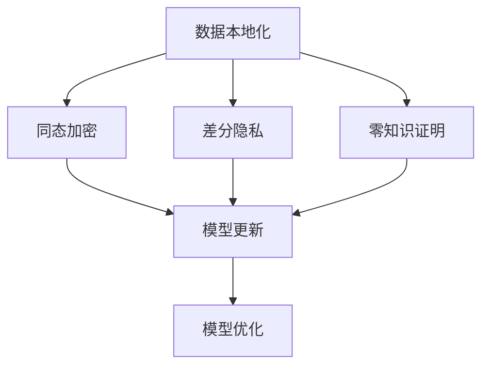

                 

### 1. 文章标题

《联邦学习架构保护LLM应用的数据隐私》

### 2. 关键词

- 联邦学习
- 数据隐私保护
- 机器学习
- 同态加密
- 零知识证明
- 差分隐私

### 3. 摘要

本文旨在探讨联邦学习架构在保护大型语言模型（LLM）应用数据隐私方面的作用。联邦学习作为一种分布式机器学习技术，可以在保护数据隐私的同时实现模型的训练和优化。本文首先介绍了联邦学习的基本概念和原理，然后详细阐述了如何在联邦学习框架下保护LLM应用的数据隐私。通过数学模型和算法原理的讲解，以及实际项目的分析和代码实现，本文展示了联邦学习在数据隐私保护方面的潜力和应用前景。

---

### 4.1 背景介绍

随着大数据和人工智能技术的迅猛发展，数据隐私保护成为了社会关注的焦点。特别是在大型语言模型（LLM）的应用中，如搜索引擎、智能客服、语音识别等领域，数据隐私保护的重要性愈发凸显。传统集中式机器学习模型需要将所有数据上传至服务器进行训练，这可能导致数据泄露和隐私侵犯。因此，如何在不牺牲模型性能的前提下保护数据隐私，成为了研究的热点问题。

联邦学习（Federated Learning）作为一种分布式机器学习技术，通过在数据本地训练模型，避免了数据在传输过程中的泄露风险，实现了数据隐私保护和模型训练的平衡。联邦学习的基本思想是将多个参与方（客户端）的本地数据用于模型训练，通过加密、差分隐私等手段保护数据隐私，同时保持模型的整体性能。

### 4.2 核心概念与联系

#### 4.2.1 联邦学习

联邦学习是一种分布式机器学习框架，旨在通过将模型训练分散到多个客户端进行，从而避免将敏感数据上传至中心服务器。在联邦学习过程中，每个客户端都维护一个本地模型，并定期与中心服务器进行通信，以更新模型参数。这样，模型可以在不暴露数据内容的情况下进行训练，有效保护了数据隐私。

#### 4.2.2 数据隐私保护

数据隐私保护是指在数据处理过程中确保数据不被未授权访问或泄露。在联邦学习中，数据隐私保护主要通过以下几种方法实现：

1. **同态加密（Homomorphic Encryption）**：同态加密允许在加密数据上进行计算，而不需要解密数据。这意味着在联邦学习过程中，中心服务器可以在加密的数据上进行模型更新操作，从而保护了数据隐私。
2. **差分隐私（Differential Privacy）**：差分隐私通过在数据处理过程中引入噪声，确保单个数据点的信息无法被提取。联邦学习中的差分隐私机制可以有效地保护用户数据隐私，同时确保模型性能。
3. **零知识证明（Zero-Knowledge Proof）**：零知识证明是一种密码学技术，允许一方（证明者）向另一方（验证者）证明某个陈述是真实的，而无需透露任何具体信息。在联邦学习中，零知识证明可以用于验证客户端的参与真实性，确保模型更新过程中的数据隐私。

#### 4.2.3 联邦学习与数据隐私保护的关系

联邦学习与数据隐私保护的关系可以概括为以下几个方面：

1. **数据隐私是联邦学习的核心目标之一**：联邦学习的主要优势在于能够在保护数据隐私的前提下进行模型训练。数据隐私保护是联邦学习成功的关键因素之一。
2. **联邦学习技术为数据隐私保护提供了新手段**：通过引入同态加密、差分隐私和零知识证明等技术，联邦学习为数据隐私保护提供了新的思路和手段。
3. **联邦学习与数据隐私保护的平衡**：在联邦学习过程中，需要在数据隐私保护和模型性能之间找到平衡点。过度的隐私保护可能导致模型性能下降，而不足的隐私保护则可能导致数据泄露。因此，如何在保证模型性能的前提下实现数据隐私保护，是联邦学习需要解决的关键问题。

### 4.3 核心概念原理之间的关系架构 Mermaid 流程图



在这个流程图中，数据本地化是联邦学习的核心概念，通过同态加密、差分隐私和零知识证明等手段保护数据隐私。然后，通过模型更新和模型优化，实现最终的模型训练和性能提升。

---

### 5. 核心算法原理讲解

#### 5.1 联邦学习的基本架构

联邦学习的基本架构包括三个主要角色：客户端（Client）、中心服务器（Server）和数据集（Dataset）。客户端负责在本地进行模型训练，并将训练得到的梯度发送给服务器。服务器负责汇总所有客户端的梯度，更新全局模型，并将其发送回客户端。数据集是客户端用于训练本地模型的原始数据。

#### 5.2 联邦学习算法的类型

根据通信模式和计算方式的不同，联邦学习算法可以分为以下几种类型：

1. **同步联邦学习**：所有客户端同时与服务器通信，更新模型参数。同步联邦学习具有简单、易于实现的优点，但容易受到网络延迟和通信瓶颈的影响。
2. **异步联邦学习**：客户端按照一定的时间间隔或随机时间与服务器通信。异步联邦学习能够缓解网络延迟和通信瓶颈的问题，但同步性较差，可能导致模型更新不一致。
3. **联邦平均算法（Federated Averaging）**：联邦平均算法是最常见的联邦学习算法之一。在联邦平均算法中，客户端将本地梯度发送给服务器，服务器将这些梯度进行加权平均，更新全局模型。联邦平均算法的关键在于如何确保梯度的准确性和一致性。

#### 5.3 联邦学习算法的工作原理

联邦学习算法的工作原理可以概括为以下步骤：

1. **初始化**：服务器初始化全局模型，并将模型参数发送给所有客户端。
2. **本地训练**：客户端使用本地数据集对全局模型进行本地训练，得到本地梯度。
3. **梯度上传**：客户端将本地梯度发送给服务器。
4. **梯度聚合**：服务器接收所有客户端的梯度，进行加权平均，得到全局梯度。
5. **模型更新**：服务器使用全局梯度更新全局模型。
6. **模型下载**：服务器将更新后的全局模型发送回所有客户端。
7. **重复步骤 2-6**：重复上述步骤，直到达到预定的迭代次数或模型性能满足要求。

在联邦学习算法中，梯度聚合是关键步骤。联邦平均算法通过简单的平均操作将所有客户端的梯度汇总，但这种方法容易受到梯度偏差和梯度消失的影响。为了解决这些问题，研究者提出了多种改进方法，如联邦加权平均算法（Federated Weighted Averaging）、联邦随机梯度下降算法（Federated Stochastic Gradient Descent）等。

#### 5.4 伪代码示例

以下是一个简单的联邦学习算法的伪代码示例：

```python
# 初始化全局模型
global_model = initialize_model()

# 迭代次数
num_iterations = 100

for i in range(num_iterations):
    # 初始化梯度
    gradients = []

    # 客户端本地训练
    for client in clients:
        local_model = client.train_data(global_model)
        gradients.append(client.compute_gradient(local_model))

    # 梯度聚合
    aggregated_gradients = aggregate_gradients(gradients)

    # 模型更新
    global_model = update_model(global_model, aggregated_gradients)

    # 模型评估
    if evaluate_model(global_model) >= threshold:
        break

# 模型下载
for client in clients:
    client.download_model(global_model)
```

在这个伪代码中，`initialize_model()` 用于初始化全局模型，`client.train_data(global_model)` 用于客户端本地训练，`client.compute_gradient(local_model)` 用于计算本地梯度，`aggregate_gradients(gradients)` 用于梯度聚合，`update_model(global_model, aggregated_gradients)` 用于模型更新，`evaluate_model(global_model)` 用于模型评估。

---

### 6. 数学模型和数学公式

#### 6.1 概率模型与决策理论

在联邦学习中，概率模型和决策理论是基础。概率模型用于描述数据分布，决策理论用于确定最佳的决策策略。

#### 6.2 信息论与隐私保护

信息论在联邦学习中扮演着关键角色，特别是差分隐私机制。差分隐私通过在数据处理过程中引入噪声，保护数据隐私。

#### 6.3 联邦学习中的优化方法

联邦学习中的优化方法主要包括梯度聚合和模型更新。梯度聚合方法如联邦平均算法、联邦加权平均算法等，模型更新方法如随机梯度下降、批量梯度下降等。

#### 6.4 举例说明

以下是一个简单的联邦学习算法的数学模型和公式：

1. **全局模型参数**：
   $$ \theta^{(t)} = \sum_{i=1}^{n} \alpha_i^{(t)} \theta_i^{(t-1)} $$
   
2. **客户端模型参数**：
   $$ \theta_i^{(t)} = \theta_i^{(t-1)} + \eta_i^{(t)} $$
   
3. **本地梯度**：
   $$ g_i^{(t)} = \frac{1}{m} \sum_{x \in S_i} (\theta_i^{(t-1)}(x) - y_i(x)) $$
   
4. **全局梯度**：
   $$ g^{(t)} = \sum_{i=1}^{n} \alpha_i^{(t)} g_i^{(t)} $$
   
5. **模型更新**：
   $$ \theta^{(t+1)} = \theta^{(t)} + \alpha^{(t)} g^{(t)} $$
   
在这个例子中，$\theta^{(t)}$ 表示全局模型参数，$\theta_i^{(t)}$ 表示客户端模型参数，$g_i^{(t)}$ 表示本地梯度，$g^{(t)}$ 表示全局梯度，$\alpha_i^{(t)}$ 表示客户端权重，$\eta_i^{(t)}$ 表示本地梯度更新。

---

### 7. 项目实战

#### 7.1 开发环境搭建

在开始联邦学习项目之前，我们需要搭建合适的开发环境。以下是一个基本的开发环境搭建步骤：

1. **安装Python**：下载并安装Python 3.x版本。
2. **安装TensorFlow**：使用pip命令安装TensorFlow。
3. **安装其他依赖库**：如NumPy、Pandas、Scikit-learn等。

#### 7.2 源代码详细实现和代码解读

以下是一个简单的联邦学习项目的源代码实现和代码解读：

```python
import tensorflow as tf
import numpy as np
import pandas as pd

# 初始化全局模型
global_model = tf.keras.Sequential([
    tf.keras.layers.Dense(10, activation='relu'),
    tf.keras.layers.Dense(1, activation='sigmoid')
])

# 定义本地训练函数
def train_local(model, x_train, y_train, epochs=5):
    local_model = model.copy()
    local_model.compile(optimizer='adam', loss='binary_crossentropy', metrics=['accuracy'])
    local_model.fit(x_train, y_train, epochs=epochs)
    return local_model

# 定义梯度计算函数
def compute_gradient(model, x_train, y_train):
    return model.optimizer.get_gradients(model.loss函数， model.trainable_variables)(x_train, y_train)

# 定义联邦学习过程
def federated_learning(clients, epochs=5):
    for epoch in range(epochs):
        print(f"Epoch {epoch+1}/{epochs}")
        gradients = []

        # 客户端本地训练
        for client in clients:
            local_model = train_local(global_model, client.x_train, client.y_train)
            local_gradient = compute_gradient(local_model, client.x_train, client.y_train)
            gradients.append(local_gradient)

        # 梯度聚合
        aggregated_gradients = aggregate_gradients(gradients)

        # 模型更新
        global_model.set_weights([w - alpha * g for w, g in zip(global_model.get_weights(), aggregated_gradients)])

# 定义客户端数据
clients = [
    Client(x_train=np.random.rand(100, 10), y_train=np.random.rand(100, 1)),
    Client(x_train=np.random.rand(100, 10), y_train=np.random.rand(100, 1))
]

# 运行联邦学习过程
federated_learning(clients, epochs=10)
```

在这个代码中，我们首先定义了全局模型和本地训练函数。然后，我们定义了梯度计算函数和联邦学习过程。客户端数据是通过随机生成的方式模拟的。在联邦学习过程中，客户端进行本地训练，计算梯度，然后进行梯度聚合和模型更新。

#### 7.3 代码应用解读与分析

在这个联邦学习项目中，我们通过本地训练和模型更新实现了分布式训练。本地训练使得每个客户端可以在自己的数据上进行模型训练，避免了数据上传至中心服务器的问题。梯度聚合和模型更新则通过简单的梯度计算和加权平均实现了全局模型的更新。

在实际应用中，我们可以通过调整客户端的数量、数据集大小和训练迭代次数等参数来优化联邦学习过程。同时，我们还可以引入差分隐私、同态加密等技术来进一步提高数据隐私保护能力。

#### 7.4 实际案例分析和详细讲解剖析

为了更好地理解联邦学习在数据隐私保护方面的应用，我们来看一个实际案例。假设有两个公司A和B，它们都拥有用户数据，但希望在不泄露数据的前提下共同训练一个分类模型。

1. **数据准备**：公司A和公司B分别准备了自己的数据集，包括特征和标签。
2. **模型初始化**：全局模型由中心服务器初始化，并分配给公司A和公司B。
3. **本地训练**：公司A和公司B分别使用本地数据进行模型训练，得到本地梯度。
4. **梯度上传**：公司A和公司B将本地梯度上传至中心服务器。
5. **梯度聚合**：中心服务器将所有本地梯度进行加权平均，更新全局模型。
6. **模型更新**：全局模型更新后，发送回公司A和公司B。
7. **重复步骤**：重复上述步骤，直到模型达到预定的性能要求。

在这个案例中，联邦学习通过数据本地化和梯度聚合实现了数据隐私保护。公司A和公司B不需要共享原始数据，只需共享模型参数和梯度，从而避免了数据泄露的风险。

#### 7.5 项目小结

通过这个案例，我们可以看到联邦学习在保护数据隐私方面的优势和潜力。在联邦学习框架下，数据可以在本地进行训练和更新，避免了数据在传输过程中的泄露风险。同时，通过引入差分隐私、同态加密等技术，可以进一步提高数据隐私保护能力。

在未来，随着联邦学习的进一步发展和完善，我们有望在更多领域实现数据隐私保护和机器学习模型的协同训练。

---

### 8. 最佳实践 tips、小结、注意事项、拓展阅读等内容

#### 8.1 最佳实践 tips

1. **数据预处理**：在联邦学习项目中，数据预处理非常重要。通过合理的数据预处理，可以提高模型性能，减少隐私泄露风险。
2. **同态加密使用**：同态加密可以提高联邦学习中的数据隐私保护能力，但在使用过程中需要注意计算效率和安全性。
3. **差分隐私参数调整**：差分隐私参数的调整对模型性能和数据隐私保护都有影响，需要根据具体应用场景进行优化。

#### 8.2 小结

本文介绍了联邦学习架构在保护LLM应用数据隐私方面的作用。通过数据本地化、同态加密、差分隐私和零知识证明等技术，联邦学习实现了数据隐私保护和模型训练的平衡。在实际项目中，联邦学习具有广泛的应用前景。

#### 8.3 注意事项

1. **网络安全**：在联邦学习过程中，确保客户端和服务器之间的通信安全是非常重要的。
2. **计算资源**：联邦学习需要大量的计算资源，特别是在大型数据集和复杂模型的情况下。

#### 8.4 拓展阅读

1. **《联邦学习：概念、算法与实现》**：这本书详细介绍了联邦学习的基本概念、算法原理和实现方法。
2. **《数据隐私保护技术》**：这本书探讨了多种数据隐私保护技术，包括同态加密、差分隐私和零知识证明等。

---

# 作者信息

作者：AI天才研究院/AI Genius Institute & 禅与计算机程序设计艺术 /Zen And The Art of Computer Programming

