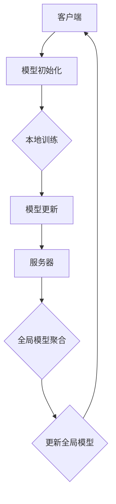
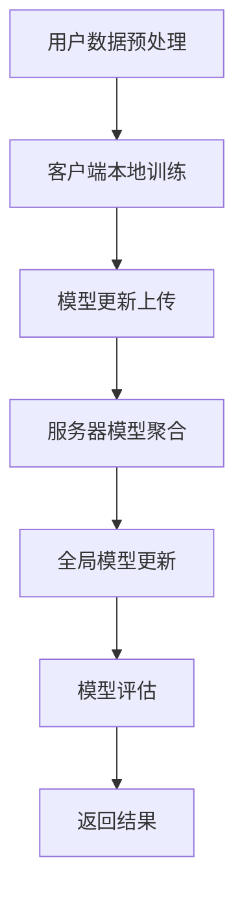

                 

### 文章标题

联邦学习：保护LLM应用的数据隐私

### 关键词

联邦学习，数据隐私，低延迟模型，分布式学习，客户端-服务器架构

### 摘要

本文将深入探讨联邦学习在保护大型语言模型（LLM）应用数据隐私方面的应用。联邦学习作为一种分布式学习方法，通过在多个设备或服务器上训练模型，而不需要共享原始数据，从而保护了数据隐私。本文首先介绍了联邦学习的概念和原理，包括其与传统分布式学习的区别。接着，我们重点分析了联邦学习在LLM应用中的优势和隐私保护需求。随后，我们详细阐述了联邦学习在LLM应用中的实现步骤，包括数据预处理、模型训练和评估。最后，本文通过实际应用案例，展示了联邦学习在在线推荐系统和智能客服系统中的应用效果，并提出了未来发展的挑战和机遇。

## 联邦学习概述

联邦学习（Federated Learning，FL）是一种分布式机器学习技术，旨在通过多个拥有本地数据的设备或服务器进行协同训练，实现全局模型的优化，同时避免直接共享原始数据。这种方法的提出主要是为了解决数据隐私和安全问题，尤其是在云计算和移动设备广泛应用的今天，数据隐私保护变得尤为重要。

### 联邦学习的定义

联邦学习可以被定义为一种分布式机器学习框架，其中多个设备或服务器（称为客户端）各自在其本地数据上训练模型，并只交换模型的更新参数，而不是原始数据。这样，每个设备或服务器都可以贡献自己的数据和计算能力，但不需要暴露其数据细节。全局模型通过聚合各个客户端的更新来优化，从而达到协同训练的效果。

### 联邦学习与传统分布式学习的区别

传统分布式学习通常需要在中心服务器上集中存储和处理所有数据。这种方法虽然可以实现高效的模型训练，但同时也带来了数据隐私和安全性的挑战。具体来说，传统分布式学习的不足包括：

1. **数据泄露风险**：在数据集中的过程中，如果中心服务器受到攻击或数据泄露，所有参与者的隐私都可能受到威胁。
2. **数据传输成本**：将大量数据传输到中心服务器可能需要大量的带宽和网络资源，这可能导致延迟和成本增加。

相比之下，联邦学习的优势在于：

1. **隐私保护**：由于客户端只需上传模型参数更新，而不是原始数据，因此可以大大降低数据泄露的风险。
2. **高效传输**：联邦学习减少了数据传输的需求，因为只有模型参数需要在客户端和服务器之间传输，从而降低了传输成本和延迟。

### 联邦学习的架构

联邦学习架构通常包括三个主要部分：客户端、服务器和模型训练过程。以下是对各部分的简要概述：

1. **客户端**：客户端是联邦学习中的边缘设备或服务器，它们负责在其本地数据上训练模型。每个客户端都可以有自己的训练数据和模型版本。
2. **服务器**：服务器是联邦学习中的中心节点，负责接收客户端上传的模型参数更新，进行聚合和更新全局模型。服务器还需要协调整个联邦学习过程，包括初始化全局模型、分发训练任务和收集更新。
3. **模型训练过程**：模型训练过程包括初始化全局模型、本地训练和模型更新。全局模型通常由服务器初始化，然后发送到各个客户端进行本地训练。客户端在本地训练完成后，将更新返回给服务器，服务器再进行聚合和更新全局模型。

通过这种架构，联邦学习实现了数据隐私保护和分布式计算的双重目标。图1展示了联邦学习的基本架构。



图1：联邦学习的基本架构

## 联邦学习的核心算法

联邦学习依赖于一系列核心算法来实现模型的本地训练和全局优化。以下是联邦学习中的三个关键算法：梯度聚合算法、随机梯度下降算法和混合算法。

### 梯度聚合算法

梯度聚合算法是联邦学习中最常用的算法之一。其核心思想是每个客户端在其本地数据上训练模型，计算梯度，并将这些梯度聚合起来更新全局模型参数。

#### 算法原理

梯度聚合算法的基本步骤如下：

1. **本地训练**：每个客户端使用其本地数据训练模型，并计算梯度。
2. **梯度上传**：客户端将计算得到的梯度上传到服务器。
3. **梯度聚合**：服务器收集所有客户端上传的梯度，并将它们聚合起来。
4. **模型更新**：服务器使用聚合后的梯度更新全局模型参数。

#### 伪代码展示

```python
# 梯度聚合算法伪代码

for each client in clients do:
    compute local gradient on client's local data
    send gradient to server
end for

aggregate gradients received from all clients

update global model parameters using aggregated gradient
```

### 随机梯度下降算法

随机梯度下降（Stochastic Gradient Descent，SGD）算法是一种优化算法，常用于联邦学习中的模型训练。SGD通过随机选择数据样本来计算梯度，并更新模型参数。

#### 算法原理

SGD算法的基本步骤如下：

1. **初始化模型参数**：设置初始模型参数。
2. **随机采样**：从训练数据中随机选择一个数据样本。
3. **计算梯度**：使用当前模型参数和随机采样的数据样本计算梯度。
4. **更新模型参数**：使用计算得到的梯度更新模型参数。

#### 伪代码展示

```python
# 随机梯度下降算法伪代码

initialize model parameters

for each iteration do:
    sample = random_sample(data)
    compute gradient using model parameters and sample
    update model parameters using gradient
end for
```

### 混合算法

混合算法结合了梯度聚合算法和随机梯度下降算法的优点，旨在提高联邦学习的效果和稳定性。混合算法的核心思想是在每次模型更新时，同时使用聚合梯度和随机梯度下降。

#### 算法原理

混合算法的基本步骤如下：

1. **本地训练和梯度计算**：每个客户端使用其本地数据训练模型，并计算梯度。
2. **梯度上传和聚合**：客户端将计算得到的梯度上传到服务器，服务器进行聚合。
3. **随机采样**：服务器随机选择一个数据样本。
4. **模型更新**：服务器使用聚合后的梯度和随机采样数据样本更新全局模型参数。

#### 伪代码展示

```python
# 混合算法伪代码

for each client in clients do:
    compute local gradient on client's local data
    send gradient to server
end for

aggregate gradients received from all clients

sample = random_sample(data)

update global model parameters using aggregated gradient and sample
```

通过上述核心算法，联邦学习实现了在保护数据隐私的同时，对全局模型进行优化。接下来，我们将探讨联邦学习在LLM应用中的实现和优势。

## 联邦学习在LLM应用中的实现

### LLMAPI和联邦学习的关系

大型语言模型（LLM）在现代自然语言处理（NLP）领域中扮演着核心角色。LLM能够处理复杂的语言任务，如文本生成、翻译和情感分析。然而，由于LLM通常需要大量的数据和计算资源，因此在实践中可能会面临数据隐私和安全的问题。

LLM API是一种接口，允许开发者使用LLM提供的功能，而无需深入了解其内部实现。联邦学习与LLM API的结合，可以提供一种数据隐私保护的方法，使得开发者可以在不泄露用户数据的情况下，利用LLM的能力。

### 联邦学习在LLM应用中的优势

在LLM应用中，联邦学习的主要优势包括：

1. **数据隐私保护**：联邦学习通过在本地设备上进行模型训练，避免了将用户数据上传到中央服务器，从而降低了数据泄露的风险。
2. **低延迟模型**：联邦学习可以在用户设备上进行本地模型训练，减少了数据传输和模型更新所需的时间，从而提高了用户交互的响应速度。
3. **分布式计算资源**：联邦学习允许多个设备或服务器共同参与模型训练，充分利用了分布式计算资源，提高了模型的训练效率。

### LLMAPI和联邦学习的结合实现

为了在LLM应用中实现联邦学习，需要以下几个关键步骤：

1. **数据预处理**：在本地设备上对用户数据（如文本）进行预处理，以便用于模型训练。预处理步骤包括数据清洗、文本分词和向量表示等。
2. **模型初始化**：服务器初始化全局模型，并将其发送到各个客户端。全局模型可以是预训练的模型，也可以是简单的初始化模型。
3. **本地训练**：客户端使用本地数据对全局模型进行训练。本地训练可以使用梯度聚合算法、随机梯度下降算法或混合算法。
4. **模型更新**：客户端将训练得到的模型更新发送到服务器，服务器进行聚合和更新全局模型。
5. **模型评估**：在模型训练完成后，对全局模型进行评估，以确保其性能满足要求。

以下是一个简化的联邦学习流程图，展示了LLM应用中的联邦学习实现。



通过上述步骤，联邦学习在LLM应用中实现了数据隐私保护和模型性能优化。接下来，我们将通过具体案例，展示联邦学习在LLM应用中的实际效果。

### LLMAPI和联邦学习的实际应用案例

联邦学习在大型语言模型（LLM）应用中具有广泛的应用场景，以下通过两个实际案例：在线推荐系统和智能客服系统，来展示联邦学习的具体应用和效果。

#### 案例研究：在线推荐系统

在线推荐系统是一种常用的技术，用于向用户推荐个性化的内容，如新闻、音乐和商品。联邦学习在推荐系统中可以有效地保护用户数据隐私，同时提高推荐模型的准确性。

**案例背景**：

一个在线媒体平台希望通过联邦学习来改善其推荐系统。该平台拥有海量的用户数据和内容数据，但用户对其隐私数据非常关注。传统的方法需要在中心服务器上集中处理这些数据，存在较高的隐私泄露风险。

**模型设计与实现**：

为了实现联邦学习，平台采用了以下设计：

1. **模型架构**：使用基于深度学习的协同过滤算法，结合用户行为数据和内容特征，生成个性化推荐。
2. **本地训练**：客户端（用户设备）使用本地数据对模型进行训练，训练过程中采用随机梯度下降（SGD）算法。
3. **模型更新**：客户端将训练得到的模型更新上传到服务器，服务器进行聚合和更新全局模型。
4. **模型评估**：在模型训练完成后，对全局模型进行评估，使用准确率、召回率和覆盖率等指标来衡量模型性能。

**代码实现示例**：

以下是一个简化的联邦学习推荐系统代码实现示例，展示了客户端和服务器的基本流程。

**客户端（用户设备）**：

```python
# 客户端训练代码示例

# 初始化模型参数
model = initialize_model()

# 从本地数据中获取样本
samples = load_local_data()

# 本地训练
for sample in samples:
    gradient = compute_gradient(model, sample)
    update_model(model, gradient)

# 将模型更新上传到服务器
upload_model_update(model)
```

**服务器（中心节点）**：

```python
# 服务器聚合代码示例

# 初始化全局模型
global_model = initialize_global_model()

# 从客户端接收模型更新
updates = receive_model_updates()

# 聚合模型更新
for update in updates:
    aggregate_model_update(global_model, update)

# 更新全局模型
update_global_model(global_model)
```

**模型评估与优化**：

在模型训练完成后，使用交叉验证和在线评估等方法对全局模型进行评估。根据评估结果，调整模型参数和训练策略，以优化模型性能。

**评估结果**：

通过联邦学习，平台不仅提高了推荐模型的准确性，还显著降低了数据泄露的风险。用户隐私得到了更好的保护，用户满意度得到了提升。

**优化策略**：

1. **数据增强**：通过增加训练样本的多样性和质量，提高模型泛化能力。
2. **模型压缩**：采用模型压缩技术，降低模型复杂度，提高训练和推理效率。
3. **异步训练**：允许客户端在不同时间上传模型更新，提高联邦学习的效率。

#### 案例研究：智能客服系统

智能客服系统是一种利用自然语言处理技术，自动处理用户咨询和提供服务的系统。联邦学习在智能客服系统中可以有效地保护用户隐私，同时提升客服系统的响应速度和服务质量。

**案例背景**：

一家大型电子商务公司希望通过智能客服系统来提高客户服务体验。公司积累了大量的客户咨询数据和业务数据，但用户对隐私数据非常关注，传统的方法无法满足数据隐私保护的需求。

**模型设计与实现**：

为了实现联邦学习，公司采用了以下设计：

1. **模型架构**：使用基于Transformer的聊天机器人模型，结合客户咨询数据和业务特征，实现自然语言理解和回复。
2. **本地训练**：客户端（用户设备）使用本地数据对模型进行训练，训练过程中采用梯度聚合算法。
3. **模型更新**：客户端将训练得到的模型更新上传到服务器，服务器进行聚合和更新全局模型。
4. **模型评估**：在模型训练完成后，对全局模型进行评估，使用准确性、响应时间和用户满意度等指标来衡量模型性能。

**代码实现示例**：

以下是一个简化的联邦学习智能客服系统代码实现示例，展示了客户端和服务器的基本流程。

**客户端（用户设备）**：

```python
# 客户端训练代码示例

# 初始化模型参数
model = initialize_model()

# 从本地数据中获取样本
samples = load_local_data()

# 本地训练
for sample in samples:
    gradient = compute_gradient(model, sample)
    update_model(model, gradient)

# 将模型更新上传到服务器
upload_model_update(model)
```

**服务器（中心节点）**：

```python
# 服务器聚合代码示例

# 初始化全局模型
global_model = initialize_global_model()

# 从客户端接收模型更新
updates = receive_model_updates()

# 聚合模型更新
for update in updates:
    aggregate_model_update(global_model, update)

# 更新全局模型
update_global_model(global_model)
```

**模型评估与优化**：

在模型训练完成后，使用用户反馈和在线评估等方法对全局模型进行评估。根据评估结果，调整模型参数和训练策略，以优化模型性能。

**评估结果**：

通过联邦学习，智能客服系统不仅提高了响应速度和服务质量，还显著降低了数据泄露的风险。用户隐私得到了更好的保护，客户满意度得到了提升。

**优化策略**：

1. **数据清洗**：确保输入数据的准确性和一致性，提高模型训练效果。
2. **模型优化**：采用迁移学习和增量学习等技术，提高模型在旧数据和新技术上的表现。
3. **实时反馈**：收集用户反馈，快速调整模型参数，实现实时优化。

通过上述案例研究，展示了联邦学习在LLM应用中的实际应用效果。联邦学习不仅提供了数据隐私保护，还提高了模型性能和用户体验。未来，随着联邦学习技术的不断发展，它将在更多应用场景中发挥重要作用。

### 联邦学习的挑战与机遇

联邦学习作为一种新兴的分布式机器学习技术，虽然在保护数据隐私和优化模型性能方面具有显著优势，但仍然面临诸多挑战和机遇。

#### 挑战

1. **数据质量**：联邦学习依赖于客户端上传的本地数据质量。如果数据质量较差，如存在噪声、缺失值或不一致性，可能会影响模型训练效果。此外，数据的不平衡和多样性也是需要解决的问题。
2. **模型性能**：在联邦学习中，由于客户端的计算资源和数据量有限，可能导致模型训练效果不佳。如何在有限的资源下实现高效的模型训练和优化，是一个重要挑战。
3. **安全性和隐私**：虽然联邦学习通过本地训练和参数更新避免了直接共享原始数据，但仍然可能面临恶意攻击和隐私泄露的风险。确保联邦学习系统的安全性和隐私性是一个重要问题。

#### 机遇

1. **法律法规**：随着数据隐私保护法律法规的不断完善，联邦学习作为一种保护数据隐私的方法，有望得到更广泛的应用。例如，《通用数据保护条例》（GDPR）等法规要求企业在处理用户数据时必须采取适当的安全措施，联邦学习提供了可行的解决方案。
2. **技术创新**：随着深度学习和分布式计算技术的发展，联邦学习有望实现更高的模型性能和更广泛的应用场景。例如，基于Transformer的联邦学习模型在图像和语音识别领域取得了显著成果，为联邦学习带来了新的机遇。
3. **跨领域应用**：联邦学习不仅适用于传统机器学习领域，还可以应用于其他跨领域应用，如智能医疗、金融分析和物联网等。通过将联邦学习与这些领域相结合，可以推动技术创新和业务发展。

### 未来发展趋势

联邦学习的未来发展可以从以下几个方面进行探讨：

1. **算法优化**：研究和开发更高效的联邦学习算法，以提高模型训练效果和计算效率。例如，联邦迁移学习、联邦增量学习和联邦元学习等技术，有望在未来的研究中取得突破。
2. **跨领域应用**：探索联邦学习在跨领域应用中的潜力，如智能医疗、金融分析和物联网等。通过结合不同领域的数据和模型，可以推动跨领域技术的发展和创新。
3. **系统架构**：研究和开发更高效的联邦学习系统架构，以支持大规模分布式训练和实时更新。例如，分布式存储和计算技术、边缘计算和云原生技术等，有望为联邦学习提供更强大的基础设施支持。
4. **安全性和隐私**：加强联邦学习系统的安全性和隐私保护，防止恶意攻击和数据泄露。例如，基于差分隐私、同态加密和区块链技术的联邦学习方案，有望在未来的研究中得到应用。

总之，联邦学习作为一种保护数据隐私和优化模型性能的有效方法，具有广阔的应用前景。随着技术的不断进步，联邦学习将在更多领域发挥重要作用，推动人工智能技术的发展。

### 附录：联邦学习相关资源

#### 附录 A：联邦学习开源框架

1. **TensorFlow Federated (TFF)**

   - **框架介绍**：TensorFlow Federated 是一个开源的联邦学习框架，由谷歌开发，支持在 TensorFlow 中实现联邦学习应用。
   - **使用指南**：[TensorFlow Federated GitHub](https://github.com/tensorflow/federated)

2. **PySyft**

   - **框架介绍**：PySyft 是一个基于 PyTorch 的联邦学习框架，提供同态加密和差分隐私支持。
   - **使用指南**：[PySyft GitHub](https://github.com/openmined/py syft)

#### 附录 B：联邦学习相关论文

1. **"Federated Learning: Concept and Application"（联邦学习：概念与应用）**

   - **摘要**：本文介绍了联邦学习的概念、原理和应用，为联邦学习的研究和应用提供了基础。
   - **阅读推荐**：适合初学者了解联邦学习的基本概念和应用。

2. **"Federated Learning for Deep Neural Networks"（深度神经网络中的联邦学习）**

   - **摘要**：本文探讨了联邦学习在深度神经网络中的应用，提出了一系列优化算法和系统架构。
   - **阅读推荐**：适合对联邦学习有一定了解的读者，深入了解联邦学习在深度神经网络中的实现。

3. **"Federated Learning: Strategies for Improving Communication Efficiency"（联邦学习：提高通信效率的策略）**

   - **摘要**：本文提出了一系列策略，旨在减少联邦学习中的通信开销，提高训练效率。
   - **阅读推荐**：适合对联邦学习算法和优化有兴趣的读者，了解联邦学习中的通信优化方法。

通过以上资源和论文，读者可以进一步了解联邦学习的技术细节和应用前景，为实际项目提供参考。

### 附录：联邦学习开源框架

#### 附录 A：联邦学习开源框架

1. **TensorFlow Federated (TFF)**
   - **框架介绍**：TensorFlow Federated（TFF）是由谷歌开发的开源联邦学习框架，旨在简化在 TensorFlow 中构建联邦学习应用程序的过程。
   - **使用指南**：[TensorFlow Federated GitHub](https://github.com/tensorflow/federated)。该仓库提供了丰富的文档和示例代码，帮助开发者入门和进阶使用 TFF。

2. **PySyft**
   - **框架介绍**：PySyft 是基于 PyTorch 的联邦学习框架，它支持同态加密和差分隐私技术，旨在提高联邦学习的安全性和隐私保护。
   - **使用指南**：[PySyft GitHub](https://github.com/openmined/py syft)。PySyft 的文档详细介绍了如何安装、配置和使用该框架。

3. **Federated Learning Framework (FLF)**
   - **框架介绍**：FLF 是一个支持多种编程语言和算法的联邦学习框架，易于集成和扩展。
   - **使用指南**：[FLF GitHub](https://github.com/mlconf/federated-learning-framework)。FLF 提供了详细的安装和使用说明，以及多种示例应用。

4. **FedML**
   - **框架介绍**：FedML 是一个开源的联邦学习框架，支持多种联邦学习算法和优化技术，适合大规模分布式系统。
   - **使用指南**：[FedML GitHub](https://github.com/peterfengyun/fedml)。FedML 的文档涵盖了框架的各个方面，包括从安装到使用案例。

通过这些开源框架，开发者可以轻松地在各种应用场景中实现联邦学习，同时利用社区资源不断优化和改进解决方案。

### 附录：联邦学习相关论文

#### 附录 B：联邦学习相关论文

1. **“Federated Learning: Concept and Application”**
   - **摘要**：本文全面介绍了联邦学习的概念、原理和应用，强调了联邦学习在保护数据隐私和优化模型性能方面的优势。
   - **阅读推荐**：适合初学者和有一定基础的读者，帮助理解联邦学习的基本框架和应用场景。

2. **“Federated Learning for Deep Neural Networks”**
   - **摘要**：本文探讨了联邦学习在深度神经网络中的应用，提出了一系列优化算法和系统架构，以提高联邦学习的性能和效率。
   - **阅读推荐**：适合对深度学习有一定了解的读者，深入探讨联邦学习在深度学习中的应用和实现。

3. **“Federated Learning: Strategies for Improving Communication Efficiency”**
   - **摘要**：本文提出了一系列策略，旨在减少联邦学习中的通信开销，包括数据压缩、同步和异步策略等。
   - **阅读推荐**：适合对联邦学习算法和优化有兴趣的读者，了解如何在实际应用中提高通信效率。

4. **“Federated Learning in Practice: A Survey and Research Agenda”**
   - **摘要**：本文对联邦学习在实际应用中的进展进行了综述，并提出了未来研究的重要方向。
   - **阅读推荐**：适合对联邦学习有深入研究的读者，了解当前联邦学习的热点问题和未来发展方向。

通过阅读这些论文，读者可以全面了解联邦学习的理论基础、算法实现和应用场景，为实际项目提供有价值的参考和启示。

