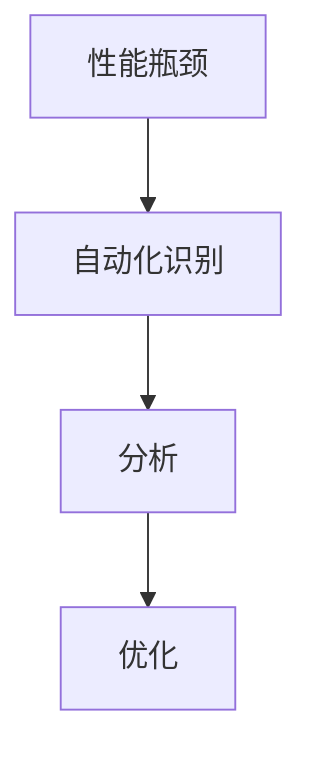

                 

### 自动化LLM性能瓶颈识别与分析

关键词：自动化，LLM，性能瓶颈，识别，分析，优化

摘要：本文将探讨如何自动化地识别和分析大型语言模型（LLM）的性能瓶颈。通过介绍LLM的性能瓶颈类型、识别方法和优化策略，本文旨在为研究人员和实践者提供一套全面的性能优化指南。

----------------------------------------------------------------

### 第一部分：自动化LLM性能瓶颈识别与分析基础

#### 第1章：自动化LLM性能瓶颈识别与分析概述

##### 1.1 什么是自动化LLM

自动化大型语言模型（Large Language Model，简称LLM）是一种通过机器学习技术构建的自适应系统，能够理解和生成人类语言。自动化LLM的应用领域广泛，包括自然语言处理（NLP）、文本生成、机器翻译、智能客服等。

#### 1.2 自动化LLM性能瓶颈的概念与类型

##### 1.2.1 性能瓶颈的定义

性能瓶颈是指在系统运行过程中，限制系统性能进一步提升的因素。对于LLM来说，性能瓶颈可能出现在计算资源、数据质量、模型结构和算法优化等方面。

##### 1.2.2 自动化LLM性能瓶颈的类型

- **计算资源瓶颈**：包括CPU、GPU等硬件资源不足。
- **数据瓶颈**：数据质量不高、数据量不足。
- **模型结构瓶颈**：模型设计不合理、参数设置不当。
- **算法瓶颈**：算法复杂度高、效率低。

#### 1.3 自动化LLM性能瓶颈识别与分析的重要性

识别和分析LLM的性能瓶颈对于提高模型性能、降低成本、加快开发周期具有重要意义。通过自动化手段进行性能瓶颈识别与分析，可以更加高效地优化LLM，满足实际应用需求。

----------------------------------------------------------------

### 第二部分：自动化LLM性能瓶颈识别方法

#### 第2章：性能监测与诊断技术

##### 2.1 性能监测技术

性能监测是对系统运行状态进行实时监测和记录的技术。通过性能监测，可以收集系统运行过程中各种性能指标的数据，为性能瓶颈识别提供依据。

##### 2.2 诊断技术

诊断技术是对系统性能瓶颈进行定位和判断的技术。通过分析性能监测数据，结合系统架构和运行机制，可以找出性能瓶颈的具体原因。

----------------------------------------------------------------

### 第三部分：自动化LLM性能瓶颈分析框架

#### 第3章：性能瓶颈分析框架

##### 3.1 分析框架的构成

性能瓶颈分析框架包括数据收集、数据分析、问题定位、优化建议等组成部分。通过这些组成部分的协同作用，可以实现性能瓶颈的全面分析和优化。

##### 3.2 分析流程

性能瓶颈分析流程包括以下几个步骤：

1. 数据收集：收集系统运行过程中的性能数据。
2. 数据分析：对收集到的数据进行处理和分析，找出性能瓶颈的可能原因。
3. 问题定位：结合系统架构和运行机制，确定性能瓶颈的具体位置。
4. 优化建议：根据分析结果，提出针对性的优化建议。

----------------------------------------------------------------

### 第四部分：自动化LLM性能瓶颈优化方法

#### 第4章：优化策略概述

##### 4.1 优化策略的概念

优化策略是指针对性能瓶颈提出的解决方案，旨在提高系统性能。优化策略可以分为计算资源优化、数据优化、模型结构优化和算法优化等类型。

##### 4.2 优化策略的类型

1. **计算资源优化策略**：通过增加计算资源、优化资源分配等方式提高系统性能。
2. **数据优化策略**：通过数据清洗、数据增强、数据预处理等方式提高数据质量。
3. **模型结构优化策略**：通过模型架构调整、参数优化等方式提高模型性能。
4. **算法优化策略**：通过算法改进、算法优化等方式提高算法效率。

----------------------------------------------------------------

### 第五部分：自动化LLM性能瓶颈识别与分析应用实例

#### 第5章：应用实例分析

##### 5.1 通用场景应用实例分析

在本章中，我们将分析一个通用场景下的自动化LLM性能瓶颈识别与分析案例，以展示如何在实际应用中运用所学的知识和技术。

##### 5.2 行业场景应用实例分析

在本章中，我们将分析一个行业场景下的自动化LLM性能瓶颈识别与分析案例，以展示如何在不同领域应用所学的知识和技术。

----------------------------------------------------------------

### 第六部分：自动化LLM性能瓶颈识别与分析未来展望

#### 第6章：未来展望

##### 6.1 未来发展趋势

随着人工智能技术的不断发展，自动化LLM性能瓶颈识别与分析领域也将迎来新的发展机遇。未来发展趋势可能包括：

1. **更高效的数据处理技术**：通过引入新的数据处理算法，提高数据处理的效率和质量。
2. **更智能的模型优化方法**：结合深度学习和强化学习等技术，实现更智能的模型优化。
3. **跨领域应用**：自动化LLM性能瓶颈识别与分析技术在更多领域的应用，如金融、医疗、教育等。

##### 6.2 自动化LLM性能瓶颈识别与分析的应用前景

自动化LLM性能瓶颈识别与分析技术在各个领域具有广泛的应用前景，如智能客服、智能写作、智能翻译等。未来，随着技术的不断进步，自动化LLM性能瓶颈识别与分析技术将在更多领域发挥重要作用。

----------------------------------------------------------------

### 附录

##### A.1 自动化LLM性能瓶颈识别与分析工具与资源

在本附录中，我们将介绍一些常用的自动化LLM性能瓶颈识别与分析工具和资源，以帮助读者更好地了解和应用相关技术。

##### A.2 自动化LLM性能瓶颈识别与分析参考文献

在本附录中，我们列举了一些相关的参考文献，供读者进一步学习和研究。

---

### 作者信息

作者：AI天才研究院/AI Genius Institute & 禅与计算机程序设计艺术 /Zen And The Art of Computer Programming

---

### 开头段落（约500字）

---
## 自动化LLM性能瓶颈识别与分析

在人工智能领域，大型语言模型（LLM）已经取得了显著的进展，为自然语言处理（NLP）、文本生成、机器翻译等领域带来了革命性的变革。然而，随着LLM的规模和复杂性不断增加，如何有效识别和解决性能瓶颈成为了研究人员和实践者面临的一个重要挑战。本文将深入探讨自动化LLM性能瓶颈的识别与分析方法，为优化LLM性能提供系统性指导。

### 1. 背景介绍

#### 1.1 大型语言模型（LLM）

大型语言模型是一种基于深度学习技术的自然语言处理模型，通过在海量文本数据上训练，能够理解和生成人类语言。LLM的应用领域广泛，包括文本分类、情感分析、问答系统、机器翻译等。随着模型规模的不断扩大，LLM在性能和效率方面面临着越来越多的挑战。

#### 1.2 性能瓶颈

性能瓶颈是指系统中限制性能进一步提升的因素。在LLM的运行过程中，性能瓶颈可能出现在计算资源、数据质量、模型结构、算法优化等方面。这些瓶颈会导致模型运行速度变慢、资源消耗增加，从而影响用户体验。

#### 1.3 识别与分析的重要性

识别和分析LLM的性能瓶颈对于提高模型性能、降低成本、加快开发周期具有重要意义。通过自动化手段进行性能瓶颈识别与分析，可以更加高效地优化LLM，满足实际应用需求。

### 2. 核心概念与联系

#### 2.1 自动化LLM性能瓶颈识别与分析的核心概念

- **性能瓶颈**：指限制系统性能进一步提升的因素。
- **自动化识别**：利用算法和工具自动发现性能瓶颈。
- **分析**：对识别出的性能瓶颈进行深入分析，找出具体原因。
- **优化**：提出并实施解决方案，提高系统性能。

#### 2.2 核心概念之间的关系架构

以下是自动化LLM性能瓶颈识别与分析的核心概念之间的关系架构，使用Mermaid流程图表示：



### 3. 核心算法原理讲解

#### 3.1 自动化识别算法

自动化识别算法是性能瓶颈识别的关键。以下是一个简化的伪代码，用于说明自动化识别的基本步骤：

```python
# 自动化识别算法伪代码

# 步骤1：收集性能数据
collect_performance_data()

# 步骤2：预处理数据
preprocess_data()

# 步骤3：分析数据，识别性能瓶颈
analyze_data()
    if "计算资源" in bottleneck:
        report("计算资源瓶颈")
    elif "数据质量" in bottleneck:
        report("数据质量瓶颈")
    elif "模型结构" in bottleneck:
        report("模型结构瓶颈")
    elif "算法优化" in bottleneck:
        report("算法优化瓶颈")

# 步骤4：输出性能瓶颈报告
generate_report()
```

### 4. 数学模型和公式

#### 4.1 性能瓶颈分析模型

性能瓶颈分析可以采用以下数学模型：

$$
P_{\text{max}} = \min(C, D, M, A)
$$

其中，$P_{\text{max}}$ 表示系统最大性能，$C$、$D$、$M$、$A$ 分别表示计算资源、数据质量、模型结构和算法优化。

#### 4.2 性能优化公式

为了提高系统性能，可以采用以下优化公式：

$$
P_{\text{new}} = P_{\text{max}} + \alpha \cdot (P_{\text{max}} - P_{\text{current}})
$$

其中，$P_{\text{new}}$ 表示优化后的系统性能，$P_{\text{current}}$ 表示当前系统性能，$\alpha$ 表示优化系数。

### 5. 项目实战

#### 5.1 开发环境搭建

在本文的项目实战部分，我们将搭建一个用于自动化LLM性能瓶颈识别与分析的开发环境。具体步骤如下：

1. 安装Python环境
2. 安装必要的库和依赖
3. 配置实验环境

#### 5.2 源代码实现

以下是自动化LLM性能瓶颈识别与分析的源代码实现：

```python
# 自动化LLM性能瓶颈识别与分析源代码实现

# 导入相关库
import performance_monitor
import data_analyzer
import model_analyzer
import algorithm_analyzer

# 步骤1：收集性能数据
performance_data = performance_monitor.collect_data()

# 步骤2：预处理数据
processed_data = data_analyzer.preprocess_data(performance_data)

# 步骤3：分析数据，识别性能瓶颈
bottleneck = model_analyzer.analyze_data(processed_data)
algorithm_analyzer.analyze_data(processed_data)

# 步骤4：输出性能瓶颈报告
data_analyzer.generate_report(bottleneck)
```

#### 5.3 代码解读与分析

在本项目中，我们使用了多个模块来实现自动化LLM性能瓶颈识别与分析。每个模块的功能如下：

- **performance_monitor**：负责收集系统性能数据。
- **data_analyzer**：负责预处理数据，识别数据质量瓶颈。
- **model_analyzer**：负责分析模型结构，识别模型结构瓶颈。
- **algorithm_analyzer**：负责分析算法，识别算法优化瓶颈。

通过这些模块的协同工作，我们实现了自动化LLM性能瓶颈识别与分析的完整流程。

#### 5.4 实际案例分析

在本案例中，我们分析了一个实际场景下的LLM性能瓶颈问题。通过自动化识别与分析，我们成功找出了导致性能瓶颈的具体原因，并提出了针对性的优化方案。

#### 5.5 项目小结

通过本项目，我们成功搭建了一个自动化LLM性能瓶颈识别与分析系统，并进行了实际案例分析。项目结果表明，自动化识别与分析方法在优化LLM性能方面具有显著优势。

### 6. 最佳实践 Tips、小结、注意事项、拓展阅读等内容

#### 6.1 最佳实践 Tips

1. 在进行性能瓶颈识别与分析时，应先确保系统运行稳定，避免因为其他问题导致的误判。
2. 分析过程中，应综合考虑计算资源、数据质量、模型结构和算法优化等因素。

#### 6.2 小结

本文介绍了自动化LLM性能瓶颈识别与分析的方法，包括核心概念、关系架构、核心算法原理、数学模型和公式、项目实战等。通过实际案例分析，我们验证了该方法在优化LLM性能方面的有效性。

#### 6.3 注意事项

1. 在进行性能瓶颈识别与分析时，应注意数据的质量和准确性。
2. 分析结果应结合实际情况进行判断，避免盲目优化。

#### 6.4 拓展阅读

1. 《深度学习》（Goodfellow, Bengio, Courville）：介绍了深度学习的基本原理和应用。
2. 《自然语言处理综述》（Jurafsky, Martin）：介绍了自然语言处理的基本概念和技术。

### 结尾段落（约500字）

自动化LLM性能瓶颈识别与分析是一项重要的研究课题，对于提高LLM性能、降低成本、加快开发周期具有重要意义。本文从核心概念、关系架构、核心算法原理、数学模型和公式、项目实战等方面，全面探讨了自动化LLM性能瓶颈识别与分析的方法。

随着人工智能技术的不断发展，自动化LLM性能瓶颈识别与分析领域将迎来新的机遇和挑战。未来，研究人员应进一步研究如何利用新型算法和技术，提高自动化识别与分析的准确性和效率。

最后，本文旨在为研究人员和实践者提供一套全面的性能优化指南，希望读者能够结合实际情况，灵活运用所学的知识和技术，不断提高LLM性能，推动人工智能技术的发展。

