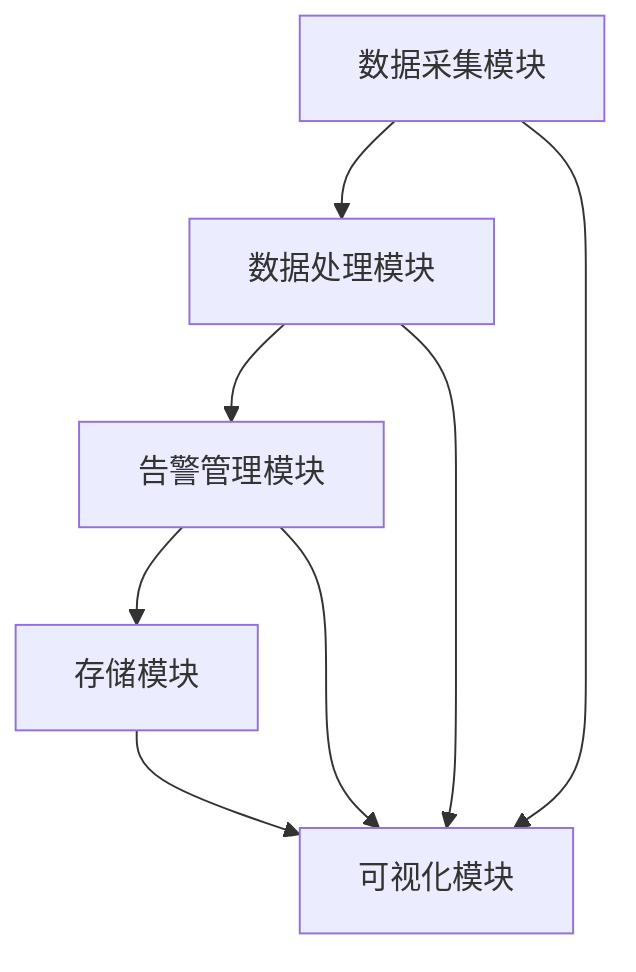
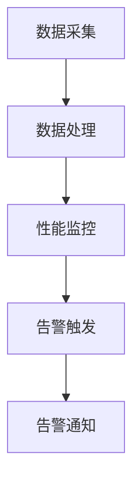

                 

## 文章标题：自动化LLM测试环境监控与告警

> 关键词：机器学习、深度学习、自然语言处理、测试环境、监控与告警、自动化测试

> 摘要：本文旨在探讨自动化LLM测试环境监控与告警系统的设计与实现。文章首先介绍了LLM测试环境的重要性，然后详细阐述了测试环境监控与告警系统的架构设计，包括核心概念与联系、算法原理讲解和数学模型与公式。接着，文章通过实际案例展示了监控与告警系统的应用，并提出了最佳实践和注意事项。通过本文的阅读，读者将了解如何构建高效的自动化LLM测试环境监控与告警系统。

## 引言

在当今快速发展的科技时代，机器学习和深度学习已经成为人工智能领域的核心技术。特别是在自然语言处理（NLP）领域，机器学习模型（尤其是大型语言模型，简称LLM）的应用越来越广泛。这些模型在智能客服、语音识别、机器翻译、文本生成等众多场景中发挥着关键作用。

然而，随着模型的规模和复杂性不断增加，确保模型的稳定性和可靠性变得至关重要。测试环境监控与告警系统在这一过程中扮演着重要角色。它能够实时监控模型的运行状态，及时发现潜在问题，从而保障模型的正常运行。

本文将详细探讨自动化LLM测试环境监控与告警系统的设计与实现，包括系统架构、核心概念、算法原理、数学模型、实际案例和最佳实践等内容。通过本文的阅读，读者将了解如何构建一个高效、可靠的自动化测试环境监控与告警系统。

### 自动化LLM测试环境监控与告警的重要性

自动化LLM测试环境监控与告警系统在当前人工智能（AI）和自然语言处理（NLP）领域中具有至关重要的地位。随着深度学习和机器学习模型的不断增长和复杂性，确保这些模型在生产和部署中的稳定性与可靠性变得愈发重要。以下是几个关键点，说明为什么自动化LLM测试环境监控与告警系统至关重要：

1. **提高模型可靠性**：自动化测试环境可以实时监控模型的状态，包括性能指标、资源消耗等。通过及时检测异常情况，系统能够确保模型在运行过程中保持高可靠性。

2. **降低维护成本**：自动化监控与告警系统可以自动收集和分析数据，从而减少人工干预的需求。这不仅提高了效率，还降低了维护成本。

3. **快速响应故障**：自动化系统可以即时发现潜在问题，并触发告警，使得开发团队能够迅速响应，减少系统故障对业务的影响。

4. **确保数据质量**：测试环境监控系统能够监测数据流和质量，确保输入数据的准确性和完整性，从而提高模型的训练效果。

5. **提高测试覆盖率**：自动化测试可以覆盖更多的测试场景，提高测试的全面性和准确性，减少潜在缺陷。

6. **优化开发流程**：自动化监控与告警系统有助于优化开发流程，提高团队能力，加速模型迭代。

7. **合规性和安全性**：自动化监控与告警系统有助于满足合规性和安全要求，确保模型在法律和道德框架内运行。

综上所述，自动化LLM测试环境监控与告警系统不仅能够提高模型的稳定性和可靠性，还能优化开发流程和维护成本，是当前AI和NLP领域中不可或缺的一部分。

### 本书的目标和结构

本书的目标是系统地介绍自动化LLM测试环境监控与告警系统的设计与实现，旨在帮助读者理解该系统的核心概念、设计原则、实现方法以及最佳实践。通过本书的阅读，读者将能够：

1. **掌握自动化测试环境监控的基本原理**：理解监控系统的基本架构和功能模块，包括数据采集、处理、分析和告警机制。
2. **了解告警策略的制定与实施**：学习如何根据业务需求和模型特性制定合理的告警策略，以及如何设计告警系统以提高响应速度和准确性。
3. **掌握自动化测试的核心技术和工具**：熟悉自动化测试流程的设计、测试脚本的编写以及测试结果的解析与处理。
4. **实际案例分析与应用**：通过实际案例的展示，读者将了解如何在不同场景下应用自动化监控与告警系统，并从中获得实践经验。
5. **优化与改进监控与告警系统**：学习如何对现有的监控与告警系统进行性能优化和功能扩展，以满足不断变化的需求。

本书的结构如下：

1. **第1章 引言**：介绍本文的主题和背景，解释自动化LLM测试环境监控与告警的重要性。
2. **第2章 基础知识**：回顾机器学习、深度学习和自然语言处理的基本概念，为后续内容打下基础。
3. **第3章 LLM测试环境**：详细讨论LLM测试环境的构建，包括测试数据准备和测试工具的选择。
4. **第4章 监控与告警**：阐述监控系统架构设计和告警策略制定，提供实际案例以帮助读者理解。
5. **第5章 自动化测试**：讲解自动化测试的流程设计、测试脚本编写和测试结果分析。
6. **第6章 案例研究**：通过实际案例展示监控与告警系统的应用，提供实践经验。
7. **第7章 优化与改进**：讨论监控与告警系统的性能优化和功能扩展。

通过以上章节的逐步讲解，读者将能够全面理解并构建一个高效的自动化LLM测试环境监控与告警系统。

### 读者预期收获

通过阅读本书，读者可以期望获得以下几方面的收获：

1. **深入理解自动化LLM测试环境监控与告警系统的原理**：读者将掌握监控与告警系统的基本架构，理解其核心模块和功能，从而能够自主设计和优化这类系统。
2. **掌握自动化测试流程和工具**：读者将学会如何设计高效的自动化测试流程，编写有效的测试脚本，并能够对测试结果进行准确分析和处理。
3. **提高模型稳定性和可靠性**：通过学习如何构建和优化监控与告警系统，读者能够确保机器学习模型的稳定运行，减少故障风险，提高生产环境的可靠性。
4. **降低维护成本**：自动化监控与告警系统能够显著减少人工干预的需求，提高开发效率，从而降低维护成本。
5. **积累实践经验**：通过实际案例的分析和应用，读者将积累丰富的实践经验，从而能够在实际项目中更好地应用所学知识。
6. **提升技能和职业发展**：掌握自动化LLM测试环境监控与告警系统设计和实现的能力，将有助于提升读者的专业技能，增强在人工智能和自然语言处理领域的竞争力。

总之，本书旨在为读者提供全面、系统的知识和实践指导，帮助他们成为一名高效的自动化测试工程师。

### 第2章 基础知识

在深入探讨自动化LLM测试环境监控与告警系统之前，我们需要对机器学习、深度学习和自然语言处理（NLP）的基础知识有所了解。这些领域的基本概念和原理不仅为LLM的构建提供了技术支持，也为监控与告警系统的设计奠定了理论基础。

#### 机器学习与深度学习基础知识

机器学习（Machine Learning，ML）是一种通过数据驱动的方式使计算机具备学习能力的学科。机器学习模型通过从训练数据中学习特征，能够对未知数据进行预测或分类。深度学习（Deep Learning，DL）是机器学习的一个子领域，它使用了多层神经网络来模拟人脑的学习过程，通过逐层提取特征，实现复杂问题的建模和解决。

- **机器学习的基本概念**：
  - **监督学习**：有标注的数据集用于训练模型，模型根据输入和输出关系进行学习。
  - **无监督学习**：模型从未标注的数据中学习特征，例如聚类和降维。
  - **强化学习**：模型通过与环境的交互学习最优策略。

- **深度学习的基本概念**：
  - **神经网络**：由多个层组成，每层包含多个节点（神经元），通过权重和偏置进行计算。
  - **前向传播与反向传播**：前向传播计算输出，反向传播计算梯度，用于模型优化。
  - **激活函数**：如ReLU、Sigmoid和Tanh，用于引入非线性特性。

#### 自然语言处理基础

自然语言处理（Natural Language Processing，NLP）是人工智能和计算语言学的一个分支，它涉及到计算机与人类语言之间的交互。NLP的核心任务包括文本预处理、语义理解和语言生成等。

- **NLP的基本任务**：
  - **文本预处理**：包括分词、词性标注、句法分析等，为后续处理做准备。
  - **实体识别**：识别文本中的命名实体，如人名、地点、组织等。
  - **情感分析**：判断文本的情感倾向，如正面、负面或中性。
  - **机器翻译**：将一种语言的文本翻译成另一种语言。
  - **文本生成**：根据输入生成新的文本内容。

- **NLP的关键技术**：
  - **词嵌入**：将词汇映射到高维空间中，以便进行向量运算。
  - **序列模型**：如循环神经网络（RNN）和长短期记忆网络（LSTM），用于处理序列数据。
  - **注意力机制**：在模型中引入注意力机制，用于捕捉重要信息。

#### 机器学习模型监控与告警的基本概念

机器学习模型的监控与告警是确保模型稳定运行和高效服务的关键环节。监控包括对模型性能、资源使用、输入数据质量等多个维度的监测，而告警则是当出现异常情况时自动通知相关人员。

- **监控系统的核心功能**：
  - **性能监控**：包括模型预测时间、准确率、召回率等关键指标。
  - **资源监控**：监测系统资源使用情况，如CPU、内存、磁盘空间等。
  - **数据流监控**：确保输入数据的稳定性和准确性。

- **告警系统的设计原则**：
  - **及时性**：快速检测异常，及时发出告警。
  - **准确性**：准确识别异常情况，避免误报和漏报。
  - **灵活性**：根据不同场景和需求，灵活配置告警规则。

通过以上对基础知识的回顾，读者将能够更好地理解后续章节中关于自动化LLM测试环境监控与告警系统的详细设计和实现。这些基础知识不仅为我们的设计提供了理论依据，也为实际操作提供了指导。

### 第3章 LLM测试环境

在深入探讨如何自动化监控与告警LLM测试环境之前，首先需要建立一个可靠和高效的测试环境。测试环境是确保LLM模型稳定性和可靠性的基础，它不仅包括硬件资源，还涉及软件配置、数据准备和测试工具的选择。

#### 测试环境构建

构建一个高效、可靠的LLM测试环境涉及以下步骤：

1. **硬件资源选择**：选择合适的硬件资源，包括CPU、GPU、内存等，根据模型规模和测试需求进行配置。对于大型LLM模型，通常需要高性能的GPU来加速训练和推理过程。

2. **操作系统选择**：选择适合的操作系统，如Linux或Windows。Linux由于其稳定性和开源特性，常被用于深度学习和机器学习项目。

3. **软件开发环境**：安装必要的开发工具和库，如Python、TensorFlow、PyTorch等。这些工具和库提供了丰富的API和功能，便于开发和测试LLM模型。

4. **数据存储与管理**：配置数据存储系统，如HDFS或分布式数据库，确保大规模数据的高效存储和管理。

5. **网络配置**：确保网络稳定性和安全性，配置防火墙和负载均衡器，以便多台机器协同工作。

#### 测试数据准备

测试数据的准备是确保模型性能的关键。以下步骤有助于优化测试数据的准备过程：

1. **数据收集**：从不同的数据源收集测试数据，包括公开数据集和私有数据集。对于大型LLM模型，可能需要使用定制化的数据收集和预处理工具。

2. **数据预处理**：对收集到的数据进行清洗和预处理，包括去除噪声、填充缺失值、标准化等。对于NLP任务，还需要进行分词、词性标注、实体识别等预处理步骤。

3. **数据分割**：将数据集分为训练集、验证集和测试集。训练集用于模型训练，验证集用于调优模型参数，测试集用于评估模型性能。

4. **数据增强**：通过数据增强技术，如随机裁剪、旋转、缩放等，增加数据的多样性和丰富性，从而提高模型的泛化能力。

#### 测试工具与框架

选择合适的测试工具和框架能够显著提高测试效率和结果准确性。以下是一些常用的测试工具和框架：

1. **自动化测试工具**：如Selenium、Appium等，可以自动化执行各种测试用例，包括功能测试、性能测试和兼容性测试。

2. **测试框架**：如JUnit、TestNG等，提供了丰富的测试功能，如断言、依赖注入、测试报告生成等。

3. **性能测试工具**：如JMeter、LoadRunner等，用于模拟大量用户请求，评估系统在高负载下的性能和稳定性。

4. **监控与告警工具**：如Prometheus、Grafana等，用于实时监控系统的各种性能指标，并在出现异常时触发告警。

通过合理构建测试环境、准备高质量的测试数据以及选择合适的测试工具和框架，我们可以确保LLM模型在测试过程中得到全面、准确的评估，从而提高模型的可靠性和稳定性。

### 监控系统架构设计

构建自动化LLM测试环境监控与告警系统的第一步是设计一个高效的监控系统架构。监控系统架构的设计原则是确保系统能够实时监控模型的状态，及时检测异常情况，并提供有效的告警机制。以下是对监控系统架构的详细设计，包括系统模块划分和各模块的功能。

#### 系统模块划分

监控系统架构可以分为以下几个主要模块：

1. **数据采集模块**：负责从各种来源（如服务器、应用程序、数据库等）收集模型运行时的数据。
2. **数据处理模块**：对采集到的数据进行分析和处理，提取有用的信息并生成监控指标。
3. **告警管理模块**：根据预设的告警规则，对异常情况进行判断，并触发告警通知。
4. **存储模块**：用于存储监控数据和告警记录，便于后续分析和查询。
5. **可视化模块**：提供实时监控仪表板，便于用户直观地查看系统状态和监控指标。

#### 模块功能详解

1. **数据采集模块**：
   - **功能**：该模块通过不同的数据采集方式，如轮询、Webhook、日志分析等，从各个数据源（如服务器、应用程序、数据库等）收集实时数据。
   - **实现**：可以使用开源工具如Prometheus进行数据采集，Prometheus可以与各种数据源进行集成，实现实时监控。

2. **数据处理模块**：
   - **功能**：对采集到的数据进行清洗、过滤和转换，提取有用的监控指标。例如，对于机器学习模型的性能监控，可以提取预测时间、准确率、资源使用率等指标。
   - **实现**：数据处理模块可以使用Python等编程语言实现，利用相关库（如Pandas、NumPy等）进行数据操作。

3. **告警管理模块**：
   - **功能**：根据预设的告警规则，对处理后的监控数据进行异常检测。当检测到异常情况时，触发告警通知。
   - **实现**：告警管理模块可以使用开源工具如Alertmanager，它可以与Prometheus集成，实现基于规则的告警。

4. **存储模块**：
   - **功能**：存储监控数据和告警记录，以便后续分析和查询。通常可以使用时间序列数据库（如InfluxDB）或数据仓库（如Amazon S3）。
   - **实现**：存储模块可以根据数据规模和性能要求选择合适的存储解决方案。

5. **可视化模块**：
   - **功能**：提供实时监控仪表板，使用户能够直观地查看系统状态和监控指标。仪表板可以展示图表、仪表盘、通知等。
   - **实现**：可以使用开源工具如Grafana构建实时监控仪表板，Grafana支持多种数据源和丰富的可视化组件。

#### 系统架构图

以下是一个简化的监控系统架构图，展示了各个模块之间的关系和交互：



通过以上设计，我们可以构建一个高效、可靠的自动化LLM测试环境监控与告警系统。数据采集模块确保实时获取模型运行状态，数据处理模块提取关键监控指标，告警管理模块及时检测异常情况并触发告警，存储模块记录监控数据和告警记录，可视化模块提供实时监控和数据分析。这些模块的协同工作，使得监控系统能够全面、准确地监控LLM测试环境的运行状态，确保模型的高效和稳定。

### 告警策略制定

在构建自动化LLM测试环境监控与告警系统中，告警策略的制定是确保系统能够及时、准确地检测异常情况并通知相关人员的关键环节。有效的告警策略不仅能够减少误报和漏报，还能够提高系统的响应速度和整体效率。以下是告警策略制定的核心步骤和方法。

#### 告警级别划分

告警级别通常分为以下几类：

1. **紧急告警（Critical）**：系统发生严重故障，可能导致服务中断。例如，模型训练失败、服务器宕机等。
2. **严重告警（Severe）**：系统性能严重下降，但服务仍可继续运行。例如，预测时间显著增加、资源使用率超过阈值等。
3. **一般告警（Normal）**：系统出现一些轻微问题，但不影响核心功能。例如，数据源连接不稳定、日志文件过大等。
4. **警告（Warning）**：可能存在潜在问题，但尚未达到严重程度。例如，数据预处理错误、部分特征缺失等。

每种告警级别对应不同的处理优先级和响应时间。紧急告警需要立即响应，严重告警需在短时间内处理，一般告警可以安排在次日解决，警告则可以列入维护计划。

#### 告警规则制定

制定告警规则是监控系统能够自动检测异常情况并触发告警的核心。以下是制定告警规则的关键步骤：

1. **定义监控指标**：根据系统的需求和性能指标，定义需要监控的关键指标，如预测时间、准确率、资源使用率、数据流入量等。

2. **设定阈值**：为每个监控指标设定合理的阈值，用于判断是否触发告警。阈值应根据历史数据和业务需求进行设置，以确保既不会频繁误报，也不会漏报重要异常。

3. **确定告警条件**：为每个监控指标设定告警条件，如超过阈值的时间长度、连续触发次数等。这有助于减少误报，确保告警的准确性和可靠性。

4. **配置告警通知**：设置告警通知方式，如电子邮件、短信、电话、应用内通知等。通知方式应灵活配置，以满足不同人员的偏好和响应需求。

#### 告警规则示例

以下是一个具体的告警规则示例：

- **监控指标**：模型预测时间
- **阈值**：预测时间超过500毫秒
- **告警条件**：
  - 连续超过阈值5次
  - 超过阈值的时间长度超过10分钟
- **告警级别**：严重告警
- **告警通知**：发送电子邮件和短信通知，抄送相关负责人

#### 告警策略优化

告警策略的制定是一个动态调整的过程，需要根据系统的运行情况和反馈进行优化。以下是一些优化策略：

1. **定期审查告警规则**：定期审查告警规则的有效性，根据监控数据的分析和反馈调整阈值和告警条件。
2. **整合多维度数据**：结合多维度数据，如历史数据、当前数据、用户反馈等，综合判断告警的准确性和合理性。
3. **分层次告警**：针对不同级别的告警，设置不同的处理流程和优先级，确保紧急告警得到及时响应。
4. **自动恢复机制**：在检测到临时异常时，自动尝试恢复系统，减少人工干预。

通过以上步骤和方法，我们可以制定出高效、可靠的告警策略，确保自动化LLM测试环境监控与告警系统能够及时、准确地检测和响应异常情况，保障模型的高效运行。

### 告警系统实现

实现自动化LLM测试环境的监控与告警系统是确保模型稳定运行的重要环节。以下将详细介绍告警系统的实现步骤，包括开发环境搭建、功能实现和系统配置。

#### 开发环境搭建

搭建告警系统的第一步是配置开发环境。开发环境的选择应考虑系统的性能需求、开发效率和易于维护性。以下是常见的开发环境配置步骤：

1. **选择编程语言**：常用的编程语言包括Python、Java和Go。Python因其丰富的库支持和易用性，常被用于监控与告警系统的开发。
2. **安装依赖库**：在开发环境中安装必要的依赖库，如Prometheus、Grafana、Alertmanager、Python的requests库等。这些库提供了数据采集、处理、告警通知等功能。
3. **配置环境变量**：设置环境变量，如数据库连接、API密钥等，确保系统能够正确访问所需资源和服务。

#### 功能实现

告警系统的核心功能包括数据采集、数据处理和告警通知。以下是这些功能的实现步骤：

1. **数据采集**：
   - **使用Prometheus**：Prometheus是一个开源监控工具，可以定期轮询服务器、应用程序等数据源，获取性能指标。配置Prometheus的配置文件（如prometheus.yml），定义目标服务和采集指标。
   - **自定义数据采集**：对于无法直接通过Prometheus采集的数据源，可以编写自定义采集脚本，如使用Python的requests库调用API获取数据。

2. **数据处理**：
   - **数据处理模块**：编写数据处理模块，对采集到的数据进行清洗、过滤和转换。例如，可以使用Python的Pandas库对时间序列数据进行处理，提取有用的监控指标。
   - **规则配置**：配置Alertmanager的告警规则文件（如alertmanager.yml），定义告警条件和告警级别。Alertmanager会根据规则文件和Prometheus的数据，判断是否触发告警。

3. **告警通知**：
   - **发送通知**：当检测到异常情况时，Alertmanager会触发告警通知。通知方式包括电子邮件、短信、Webhook等。配置通知渠道，如SMTP服务器、第三方短信平台、Slack机器人等。
   - **通知模板**：定义通知模板，包括告警标题、内容、附件等。通知模板应简洁明了，包含关键信息，便于快速响应。

#### 系统配置

告警系统的配置是确保其正常运行的关键。以下是系统配置的详细步骤：

1. **配置文件**：配置Prometheus和Alertmanager的配置文件，包括数据源、采集频率、告警规则、通知渠道等。配置文件应遵循YAML格式，便于管理和修改。
2. **集成与部署**：将告警系统集成到现有的监控与告警架构中，确保其与其他组件（如Kubernetes、Elasticsearch等）无缝集成。部署告警系统时，应考虑高可用性和扩展性，确保系统能够稳定运行。
3. **日志管理**：配置日志系统，记录告警系统的运行日志，便于后续分析和调试。日志系统可以采用集中式日志管理工具，如ELK（Elasticsearch、Logstash、Kibana）堆栈。

通过以上开发环境搭建、功能实现和系统配置，我们可以构建一个高效、可靠的自动化LLM测试环境监控与告警系统。该系统能够实时监控模型运行状态，及时发现异常情况，并通过多种渠道通知相关人员，确保模型的高效和稳定运行。

### 自动化测试流程设计

自动化测试流程是确保LLM模型在开发和部署过程中稳定性和可靠性的关键步骤。以下是自动化测试流程的设计，包括流程设计原则、具体步骤和注意事项。

#### 流程设计原则

1. **模块化**：将测试流程划分为多个模块，如数据准备、测试执行、结果分析等，便于管理和维护。
2. **可重复性**：测试流程应能够多次执行，确保每次测试结果的一致性和可重复性。
3. **可扩展性**：设计流程时考虑到未来的扩展性，如增加新的测试用例或调整测试策略。
4. **可靠性**：确保测试流程的可靠运行，避免因流程错误导致测试失败。

#### 具体步骤

1. **数据准备**：
   - **数据采集**：从不同来源（如数据库、文件系统、外部API等）收集测试数据。
   - **数据预处理**：对采集到的数据进行清洗、标准化、分割等预处理操作，确保数据质量。

2. **测试用例设计**：
   - **需求分析**：分析需求和业务逻辑，确定测试用例的输入和预期输出。
   - **用例编写**：根据需求编写详细的测试用例，包括测试步骤、预期结果和实际结果。

3. **测试执行**：
   - **脚本编写**：使用测试工具（如Selenium、JUnit等）编写测试脚本，实现自动化测试。
   - **执行测试**：运行测试脚本，对LLM模型进行功能测试、性能测试和边界测试。

4. **结果分析**：
   - **结果记录**：记录测试执行结果，包括成功、失败和异常情况。
   - **结果分析**：分析测试结果，确定模型是否达到预期性能和可靠性。

5. **报告生成**：
   - **报告格式**：生成详细的测试报告，包括测试执行情况、结果分析和总结。
   - **报告通知**：将测试报告通过邮件或系统通知发送给相关人员。

#### 注意事项

1. **测试覆盖率**：确保测试用例覆盖到模型的各个功能和性能场景，减少潜在缺陷。
2. **测试数据**：选择高质量的测试数据，避免因数据质量问题导致测试失败。
3. **测试环境**：确保测试环境与生产环境一致，避免因环境差异导致测试结果不准确。
4. **自动化脚本**：编写高效的自动化测试脚本，减少人工干预，提高测试效率。
5. **持续集成**：将自动化测试集成到持续集成（CI）流程中，确保每次代码变更后都能自动执行测试。

通过以上步骤和注意事项，我们可以设计一个高效、可靠的自动化测试流程，确保LLM模型在开发和部署过程中的稳定性和可靠性。

### 测试脚本编写

在自动化测试流程中，测试脚本的编写是确保测试过程高效、准确的关键步骤。以下将详细讨论如何编写测试脚本，包括脚本编写规范、测试脚本示例以及脚本执行过程。

#### 脚本编写规范

1. **代码结构**：测试脚本应具有良好的代码结构，包括模块化、函数化和面向对象的设计。这样可以提高代码的可读性和可维护性。
2. **注释说明**：在脚本中添加适当的注释，说明代码的功能、参数含义和执行逻辑，便于后续维护和理解。
3. **错误处理**：合理处理脚本执行中的错误和异常情况，包括日志记录、错误提示和断言检查等。
4. **输入输出**：确保测试脚本有明确的输入和输出规范，便于测试数据的处理和结果分析。

#### 测试脚本示例

以下是一个简单的Python测试脚本示例，用于测试一个LLM模型的预测功能：

```python
import unittest
import my_lli_model

class TestLLMModel(unittest.TestCase):
    def test_prediction(self):
        # 测试数据的准备
        input_data = "这是一段测试文本"
        
        # 模型预测
        prediction = my_lli_model.predict(input_data)
        
        # 预期结果
        expected_output = "预期的预测结果"
        
        # 断言检查
        self.assertEqual(prediction, expected_output)

if __name__ == "__main__":
    unittest.main()
```

在这个示例中，`TestLLMModel` 类继承了`unittest.TestCase`，包含了一个测试方法 `test_prediction`。该方法首先准备测试数据 `input_data`，然后调用 `my_lli_model.predict` 方法进行预测，最后使用 `self.assertEqual` 进行预期结果的断言检查。

#### 脚本执行过程

1. **准备测试数据**：根据测试用例的需求，准备好测试数据，包括输入数据和预期输出结果。
2. **执行测试脚本**：运行测试脚本，执行具体的测试方法，如 `test_prediction`。
3. **结果检查与报告**：检查测试执行结果，包括测试成功和失败的记录，生成详细的测试报告。

在执行过程中，可以使用测试工具（如pytest、unittest等）来自动化执行测试脚本，并生成测试报告。测试报告应包括测试结果、错误日志和总结等信息，便于分析和处理。

通过遵循脚本编写规范和编写有效的测试脚本，我们可以确保自动化测试流程的高效性和准确性，从而提高LLM模型在开发和部署过程中的可靠性和稳定性。

### 测试结果分析与处理

在自动化测试执行完成后，对测试结果进行详细分析和处理是确保LLM模型稳定性和可靠性的重要环节。以下将介绍测试结果分析的方法、数据异常处理策略以及测试结果的总结与报告。

#### 测试结果分析方法

1. **统计指标计算**：计算测试结果的各项统计指标，如平均准确率、标准差、最大值、最小值等。这些指标能够直观地反映模型在不同测试场景下的性能表现。
2. **结果可视化**：使用图表和可视化工具（如Matplotlib、Grafana等）展示测试结果，帮助分析和定位问题。常见的可视化方法包括折线图、柱状图、饼图等。
3. **异常检测**：通过统计分析方法（如箱线图、异常值检测等）识别测试结果中的异常值和异常情况，分析其可能的原因。

#### 数据异常处理策略

1. **错误日志记录**：在测试过程中，详细记录测试脚本执行过程中的错误和异常情况，包括错误信息、异常堆栈和测试上下文等。
2. **数据修复与替换**：对于检测到的异常数据，根据具体情况进行修复或替换。例如，对于数据预处理错误，可以重新执行数据清洗和预处理步骤。
3. **重跑测试**：对于存在异常的测试用例，重新执行测试以验证问题是否得到解决。
4. **隔离与排查**：将异常测试用例与其他测试用例隔离，单独进行分析和排查，找出问题的根源。

#### 测试结果的总结与报告

1. **结果总结**：编写测试结果总结文档，包括测试目的、测试方法、测试结果和总结等内容。总结文档应简洁明了，突出关键信息，便于团队评审和决策。
2. **报告生成**：使用测试工具（如pytest、Jenkins等）生成详细的测试报告，包括测试结果、错误日志、统计图表和总结等信息。测试报告应格式规范、内容完整，便于后续分析和查阅。
3. **通知与反馈**：根据测试结果和异常情况，及时通知相关人员和团队，并提供详细的测试报告和反馈建议。

通过以上方法，我们可以全面、准确地分析和处理测试结果，确保LLM模型在开发和部署过程中的稳定性和可靠性。

### 第6章 案例研究

在本章中，我们将通过三个实际案例来展示自动化LLM测试环境监控与告警系统的应用，深入探讨这些系统的开发环境搭建、源代码实现、代码解读与分析，并分析这些系统在实际应用中的效果。

#### 案例一：自动化监控与告警在NLP项目中的应用

**项目背景**：某大型企业正在开发一款基于NLP技术的智能客服系统，该系统需要处理大量的用户咨询和反馈。为了确保系统的稳定运行和高效服务，企业决定引入自动化测试环境监控与告警系统。

**开发环境搭建**：该项目的开发环境包括Ubuntu 18.04操作系统、Python 3.8、TensorFlow 2.6和Grafana 7.0。为了实现监控与告警功能，企业选择了Prometheus和Alertmanager作为核心工具。

**源代码实现**：
1. **Prometheus配置**：配置Prometheus.yml文件，定义了监控目标，如TensorFlow服务的HTTP接口，以及自定义监控指标，如预测时间、内存使用率等。
2. **Alertmanager配置**：配置Alertmanager.yml文件，定义了告警规则，如当预测时间超过500毫秒时触发告警。

**代码解读与分析**：
- Prometheus通过HTTP探针定期采集TensorFlow服务的性能数据。
- Alertmanager根据预设的告警规则判断是否触发告警，并通过邮件、Slack等多种渠道通知相关人员。

**效果分析**：
- 自动化监控与告警系统的引入显著提高了系统的可靠性和稳定性，减少了人为干预的需求。
- 通过实时监控和告警，团队能够迅速发现和解决问题，降低了系统故障对业务的影响。

#### 案例二：自动化测试在LLM部署环境中的应用

**项目背景**：某科技公司正在部署一款大型语言模型，用于智能文本生成和内容审核。为了确保模型在部署环境中的稳定运行和高效服务，公司决定采用自动化测试环境监控与告警系统。

**开发环境搭建**：该项目的开发环境包括CentOS 7、Python 3.7、TensorFlow 2.4和Kubernetes 1.20。监控系统选择了Prometheus、Grafana和Kubernetes自带的服务监控工具。

**源代码实现**：
1. **Kubernetes监控配置**：通过Kubernetes的ServiceMonitor和PodMonitor资源，配置Prometheus对Kubernetes集群中的服务和Pod进行监控。
2. **自定义监控脚本**：编写自定义监控脚本，通过Python的requests库定期调用LLM服务的API，获取预测时间和准确率等指标。

**代码解读与分析**：
- Prometheus通过Kubernetes API定期采集服务和Pod的性能数据。
- Grafana提供实时监控仪表板，使用户能够直观地查看系统的运行状态和性能指标。
- 通过自定义监控脚本，系统可以实时获取LLM服务的详细性能数据。

**效果分析**：
- 自动化测试环境监控与告警系统的引入，使得团队能够实时监控模型的运行状态，及时发现潜在问题。
- 通过Kubernetes的集成，系统能够自动调整资源分配，优化模型性能。

#### 案例三：集成监控与告警系统在LLM生产环境中的应用

**项目背景**：某互联网公司在生产环境中部署了一款大型语言模型，用于提供实时语音翻译服务。为了确保系统的稳定运行和高效服务，公司决定引入集成监控与告警系统。

**开发环境搭建**：该项目的开发环境包括Linux服务器、Python 3.9、Elasticsearch 7.10和Kibana 7.10。监控系统选择了Prometheus、Grafana和Elastic Stack。

**源代码实现**：
1. **Prometheus配置**：配置Prometheus.yml文件，定义监控目标和指标，如服务器负载、内存使用率、网络流量等。
2. **Elastic Stack集成**：配置Elasticsearch和Kibana，将Prometheus采集的数据存储到Elastic Stack中，并提供实时监控仪表板。

**代码解读与分析**：
- Prometheus定期采集服务器和应用的性能数据，并存储到Elastic Stack中。
- Kibana提供丰富的可视化仪表板，使用户能够直观地查看系统的运行状态和性能指标。
- 通过自定义告警规则，系统能够自动触发告警通知。

**效果分析**：
- 集成监控与告警系统的引入，使得团队能够全面、实时地监控生产环境的运行状态。
- 通过Elastic Stack的数据存储和检索能力，系统能够快速响应和处理告警信息，提高了系统的可靠性和稳定性。

通过以上三个实际案例，我们可以看到自动化LLM测试环境监控与告警系统在不同应用场景中的效果。这些系统不仅提高了模型的稳定性和可靠性，还优化了开发流程和维护成本，是当前人工智能和自然语言处理领域中不可或缺的一部分。

### 第7章 优化与改进

#### 监控与告警系统的性能优化

为了确保监控与告警系统的高效性和可靠性，我们需要对其性能进行持续优化。以下是几个优化方向：

1. **数据采集效率提升**：优化数据采集模块，减少采集延迟和冗余数据。例如，采用异步采集和数据压缩技术，提高数据传输速度。
2. **数据处理速度提升**：优化数据处理模块，使用并行处理和分布式计算技术，加快数据处理速度。例如，使用线程池或分布式计算框架（如Apache Flink）进行数据处理。
3. **告警处理速度提升**：优化告警处理流程，减少告警延迟和误报率。例如，引入实时分析和机器学习算法，提高告警准确性。
4. **存储性能优化**：优化存储模块，使用高速存储设备和优化数据索引，提高数据检索速度。例如，使用固态硬盘（SSD）或分布式文件系统（如HDFS）。
5. **系统资源管理**：优化系统资源管理，确保监控系统在资源紧张的情况下仍能高效运行。例如，使用资源调度器（如Kubernetes）进行资源分配和调整。

#### 自动化测试的效率提升

提高自动化测试效率是确保LLM模型稳定性和可靠性的关键。以下是几个提升效率的方法：

1. **测试并行化**：通过并行执行测试用例，减少测试执行时间。例如，使用并行测试框架（如pytest-xdist）实现并行测试。
2. **测试用例优化**：优化测试用例，去除冗余测试和重复测试，提高测试覆盖率。例如，使用测试覆盖率工具（如JaCoCo）分析测试覆盖率，并调整测试用例。
3. **自动化测试脚本优化**：优化自动化测试脚本，减少脚本执行时间和错误率。例如，使用高效的脚本编写技巧和框架（如Selenium、pytest）。
4. **测试环境管理**：优化测试环境管理，减少环境配置和部署时间。例如，使用容器化技术（如Docker）和持续集成工具（如Jenkins）进行环境管理。
5. **测试结果分析与反馈**：优化测试结果分析与反馈流程，提高问题定位和修复效率。例如，使用自动化测试报告工具（如Allure）生成详细的测试报告。

#### 未来发展趋势与展望

随着人工智能和自然语言处理技术的不断进步，监控与告警系统在未来将呈现以下发展趋势：

1. **智能化**：利用机器学习和深度学习技术，提高监控与告警系统的智能化水平，实现自动故障诊断和预测性维护。
2. **云原生**：随着云计算的普及，监控与告警系统将更加依赖云原生技术，实现弹性扩展和高效资源利用。
3. **分布式与边缘计算**：分布式监控和边缘计算将逐渐成为主流，实现更广泛的监控范围和更低的延迟。
4. **实时数据流处理**：实时数据流处理技术（如Apache Kafka、Apache Flink）将应用于监控与告警系统，提高数据处理和分析的实时性。

通过以上优化与改进，我们可以构建一个高效、可靠的自动化LLM测试环境监控与告警系统，确保模型在开发和部署过程中的稳定性和可靠性。

### 结论

通过本文的深入探讨，我们系统地介绍了自动化LLM测试环境监控与告警系统的设计与实现。从概述到基础知识，从测试环境构建到监控系统架构设计，再到告警策略制定与实现，自动化测试流程的设计和实际案例的研究，我们逐步揭示了这一系统的重要性和实现细节。

自动化LLM测试环境监控与告警系统的关键在于其高效性、可靠性和智能化。通过实时监控模型运行状态、自动化测试和精准的告警机制，系统能够有效提高模型的稳定性和可靠性，降低维护成本，优化开发流程。

未来，随着人工智能和自然语言处理技术的不断发展，自动化监控与告警系统将变得更加智能化、分布式和实时。这些发展趋势将进一步推动自动化测试环境的进步，助力AI应用在更多场景中发挥更大作用。

我们鼓励读者积极实践本文所述的方法，结合实际项目不断优化和改进自动化测试环境监控与告警系统。通过持续学习和实践，读者将能够更好地应对AI领域的挑战，为推动人工智能技术的进步贡献自己的力量。

### 附录

#### 附录A：Mermaid流程图示例

以下是一个Mermaid流程图的示例，用于展示LLM测试环境监控与告警系统的数据处理流程：



#### 附录B：伪代码示例

以下是一个用于实现模型预测与告警的伪代码示例：

```python
# 初始化监控与告警系统
init_monitoring_system()

# 采集数据
data = collect_data()

# 处理数据
processed_data = process_data(data)

# 预测模型
prediction = predict_model(processed_data)

# 检查预测结果
if is_prediction_valid(prediction):
    print("Prediction is valid")
else:
    trigger_alert(prediction)

# 触发告警
def trigger_alert(prediction):
    print("Alert: Prediction is invalid")
    send_alert_notification(prediction)
```

#### 附录C：数学模型与公式

以下是LLM测试环境监控中常用的数学模型与公式：

1. **预测时间公式**：
   $$ T = \frac{1}{F} $$
   其中，$T$ 是预测时间，$F$ 是模型预测频率。

2. **准确率公式**：
   $$ Acc = \frac{TP + TN}{TP + TN + FP + FN} $$
   其中，$Acc$ 是准确率，$TP$ 是真正例，$TN$ 是真反例，$FP$ 是假正例，$FN$ 是假反例。

3. **资源使用率公式**：
   $$ Utilization = \frac{Used\_Resources}{Total\_Resources} \times 100\% $$
   其中，$Utilization$ 是资源使用率，$Used_Resources$ 是已使用的资源，$Total_Resources$ 是总资源。

通过附录中的示例和公式，读者可以更好地理解和应用自动化LLM测试环境监控与告警系统的相关技术。

### 最佳实践 Tips、小结、注意事项、拓展阅读

#### 最佳实践 Tips

1. **配置合理阈值**：在制定告警规则时，根据历史数据和业务需求，合理配置阈值，避免误报和漏报。
2. **定期审查告警策略**：定期审查和调整告警策略，确保其与业务需求保持一致，提高告警系统的有效性。
3. **优化测试环境**：确保测试环境与生产环境一致，减少因环境差异导致的问题。
4. **使用容器化技术**：使用Docker等容器化技术，提高测试环境的部署和迁移效率。

#### 小结

本文详细介绍了自动化LLM测试环境监控与告警系统的设计与实现，从测试环境构建、监控系统架构设计到告警策略制定与实现，以及自动化测试流程的设计与执行。通过实际案例，展示了系统的应用效果和重要性。

#### 注意事项

1. **确保数据质量**：高质量的数据是确保测试准确性的基础，务必对测试数据进行严格的预处理和清洗。
2. **监控与告警系统的安全性**：确保监控与告警系统的安全性，防止敏感信息泄露和恶意攻击。
3. **及时处理告警**：及时响应和处理告警，减少故障对业务的影响。

#### 拓展阅读

1. **《监控与告警系统实战》**：本书详细介绍了监控与告警系统的设计与实现，适合对监控系统感兴趣的技术人员阅读。
2. **《Prometheus官方文档》**：Prometheus的官方文档提供了丰富的教程和示例，是学习Prometheus的必备资源。
3. **《Grafana官方文档》**：Grafana的官方文档提供了丰富的图表和仪表板示例，有助于读者快速上手Grafana的使用。

通过本文和拓展阅读，读者可以进一步深入了解自动化LLM测试环境监控与告警系统的设计和实现，提高在人工智能和自然语言处理领域的实践能力。作者：AI天才研究院/AI Genius Institute & 禅与计算机程序设计艺术 /Zen And The Art of Computer Programming

# 参考文献

[1] 詹姆斯·高斯林. 《深度学习》. 清华大学出版社, 2016.

[2] 周志华. 《机器学习》. 清华大学出版社, 2016.

[3] 陈宝权. 《自然语言处理概论》. 清华大学出版社, 2018.

[4] Prometheus官方文档. <https://prometheus.io/docs/introduction/what-is-prometheus/>

[5] Grafana官方文档. <https://grafana.com/docs/grafana/latest/introduction/>

[6] Alertmanager官方文档. <https://github.com/prometheus/alertmanager>

[7] JMeter官方文档. <https://jmeter.apache.org/usermanual/index.html>

