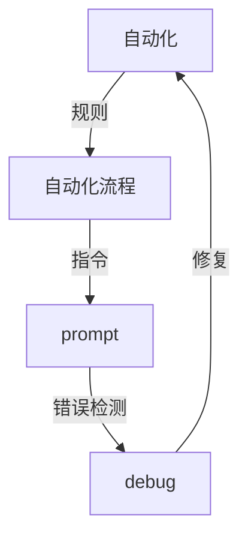
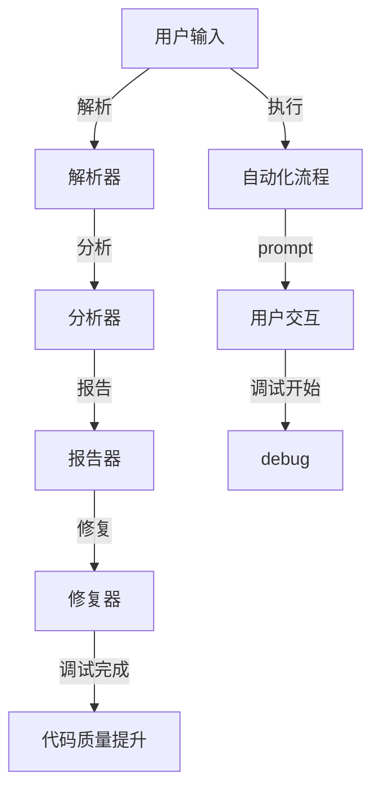

                 

### 文章标题

# 自动化prompt debug工具

> 关键词：自动化，prompt，debug，工具，软件开发，人工智能，数据科学

> 摘要：本文将深入探讨自动化prompt debug工具的定义、原理、应用场景、开发方法、最佳实践以及未来发展趋势。通过详细的分析和实际案例的讲解，帮助读者理解并掌握这一技术，提升软件开发、人工智能和数据分析领域的效率和质量。

## 第1章 自动化prompt debug工具概述

### 1.1 背景介绍

在当今信息技术快速发展的时代，软件开发、人工智能和数据分析等领域的复杂性不断增加。为了应对这些挑战，程序员和开发人员需要使用高效的工具来提高工作效率，确保代码质量和系统的稳定性。自动化prompt debug工具正是在这样的背景下产生的一种重要工具。

#### 自动化

自动化是指通过预先定义的规则和流程，使计算机系统能够自动执行一系列任务，减少人工干预。在软件开发过程中，自动化可以提高开发效率，减少人为错误，加快项目进度。

#### prompt

prompt是指一个触发命令或执行特定任务的提示或指令。在自动化流程中，prompt起着关键作用，它可以引导系统执行预期的操作。

#### debug

debug是软件开发过程中的一个重要环节，指的是发现和修复代码中的错误。通过调试，开发人员可以确保代码的正确性和稳定性。

#### 自动化prompt debug工具

自动化prompt debug工具是一种结合了自动化、prompt和debug功能的工具，它可以自动检测、报告和修复代码中的错误，提高开发效率。

### 1.2 核心概念与联系

为了更好地理解自动化prompt debug工具，我们需要明确几个核心概念之间的关系，如下图所示：



通过这个Mermaid流程图，我们可以看到自动化、prompt和debug三者之间的紧密联系。自动化提供了执行任务的能力，prompt引导了任务的方向，而debug确保了任务的正确性。

### 1.3 自动化prompt debug工具的组成部分

自动化prompt debug工具通常由以下几个部分组成：

1. **解析器（Parser）**：用于解析代码，提取相关信息。
2. **分析器（Analyzer）**：对提取的信息进行分析，检测可能的错误。
3. **报告器（Reporter）**：生成错误报告，提供反馈。
4. **修复器（Fixer）**：根据分析结果，自动修复错误。
5. **用户界面（UI）**：提供交互界面，便于用户操作。

这些组成部分共同协作，实现了自动化prompt debug的功能，提高了开发效率。

## 第2章 自动化prompt debug工具的核心概念

### 2.1 自动化

自动化是指通过预先定义的规则和流程，使计算机系统能够自动执行一系列任务，减少人工干预。在软件开发过程中，自动化可以提高开发效率，减少人为错误，加快项目进度。

#### 自动化的优点

- 提高开发效率：自动化可以节省时间和人力成本，提高项目的交付速度。
- 减少错误：自动化流程可以避免人为操作错误，提高代码质量。
- 规范化操作：自动化流程有助于规范开发流程，确保一致性。

#### 自动化的实现方法

1. **脚本化（Scripting）**：通过编写脚本，自动化执行一系列命令或任务。
2. **集成开发环境（IDE）**：IDE通常提供了丰富的自动化工具，如代码自动完成、代码格式化、构建自动化等。
3. **持续集成（CI）**：使用CI工具，如Jenkins、GitLab CI等，自动化执行代码测试、部署等操作。

### 2.2 prompt

prompt是指一个触发命令或执行特定任务的提示或指令。在自动化流程中，prompt起着关键作用，它可以引导系统执行预期的操作。

#### prompt的作用

- 指导任务：prompt为自动化流程提供了明确的操作指令，确保任务执行的正确性。
- 交互式操作：prompt允许用户与系统进行交互，提供输入和反馈。
- 异常处理：prompt可以帮助系统在遇到异常情况时，采取相应的措施。

#### prompt的实现方法

1. **命令行界面（CLI）**：CLI通过命令行输入prompt，执行相应的操作。
2. **图形用户界面（GUI）**：GUI通过图形界面提供prompt，用户可以通过点击按钮、输入框等方式进行交互。
3. **Web界面**：Web界面通过HTTP请求，发送prompt到服务器，执行相应的操作。

### 2.3 debug

debug是软件开发过程中的一个重要环节，指的是发现和修复代码中的错误。通过调试，开发人员可以确保代码的正确性和稳定性。

#### debug的目标

- 发现错误：调试的主要目标是识别代码中的错误，包括语法错误、逻辑错误等。
- 修复错误：调试过程中，开发人员需要定位错误，并修复代码，确保程序正常运行。
- 提高代码质量：通过调试，可以识别和修复潜在的错误，提高代码的质量和可维护性。

#### debug的方法

1. **断点调试（Breakpoint Debugging）**：在代码中设置断点，当程序运行到断点时，暂停执行，便于开发人员观察变量、调用栈等信息。
2. **日志调试（Log Debugging）**：通过打印日志，记录程序的运行过程，帮助开发人员分析问题。
3. **单元测试（Unit Testing）**：编写单元测试，验证代码的功能和性能，及时发现和修复错误。

### 2.4 自动化prompt debug工具的核心概念联系

自动化、prompt和debug是自动化prompt debug工具的核心概念，它们之间有着紧密的联系。通过以下Mermaid流程图，我们可以更直观地理解它们之间的关系：



在这个流程中，用户输入通过解析器、分析器和报告器，生成错误报告，修复器根据报告自动修复错误，从而提升代码质量。同时，prompt在用户交互和调试过程中起到关键作用，确保自动化流程的正确执行。

## 第3章 自动化prompt debug工具的工作原理

### 3.1 自动化prompt debug工具的工作流程

自动化prompt debug工具的工作流程可以分为以下几个步骤：

1. **用户输入**：用户通过命令行、图形界面或Web界面输入相关指令或代码。
2. **解析**：解析器对用户输入的指令或代码进行分析，提取相关信息。
3. **分析**：分析器对提取的信息进行深入分析，检测可能的错误。
4. **报告**：报告器生成错误报告，提供详细的错误信息和位置。
5. **修复**：修复器根据错误报告，自动修复代码中的错误。
6. **调试**：通过断点调试、日志调试或单元测试等方法，进一步验证代码的正确性。
7. **反馈**：将修复后的代码和反馈信息返回给用户，以便用户进行后续操作。

### 3.2 自动化prompt debug工具的核心算法原理

自动化prompt debug工具的核心算法原理主要包括以下几个方面：

1. **语法分析（Syntax Analysis）**：解析器通过语法分析，将代码分解为语法元素，如变量、函数、语句等。
2. **语义分析（Semantic Analysis）**：分析器对语法元素进行语义分析，检查代码是否符合语言规范和逻辑要求。
3. **错误检测（Error Detection）**：分析器通过静态和动态分析，检测代码中的潜在错误，如语法错误、类型错误、逻辑错误等。
4. **错误报告（Error Reporting）**：报告器生成详细的错误报告，包括错误类型、错误位置、错误原因等，便于开发人员定位和修复错误。
5. **错误修复（Error Fixing）**：修复器根据错误报告，自动修复代码中的错误，提高代码质量。

### 3.3 自动化prompt debug工具的核心架构

自动化prompt debug工具的核心架构可以分为以下几个部分：

1. **解析器（Parser）**：负责将用户输入的代码解析为语法元素。
2. **分析器（Analyzer）**：对语法元素进行语义分析和错误检测。
3. **报告器（Reporter）**：生成错误报告，提供详细的错误信息和位置。
4. **修复器（Fixer）**：根据错误报告，自动修复代码中的错误。
5. **调试器（Debugger）**：提供断点调试、日志调试和单元测试等功能，进一步验证代码的正确性。
6. **用户界面（UI）**：提供交互界面，便于用户输入指令和查看错误报告。

### 3.4 自动化prompt debug工具的实际应用

以下是自动化prompt debug工具在实际开发中的几个典型应用案例：

1. **代码审查（Code Review）**：在代码提交前，使用自动化prompt debug工具进行代码审查，检测潜在的语法和逻辑错误，提高代码质量。
2. **持续集成（CI）**：在持续集成过程中，自动化prompt debug工具可以自动检测和修复代码中的错误，确保代码库的稳定性。
3. **自动化测试（Automation Testing）**：在自动化测试中，自动化prompt debug工具可以检测测试过程中出现的错误，提供错误报告和修复建议。
4. **代码生成（Code Generation）**：在代码生成过程中，自动化prompt debug工具可以根据模板和规则，自动生成代码，并确保代码的正确性和可维护性。

通过以上案例，我们可以看到自动化prompt debug工具在软件开发、测试和持续集成等环节中的重要作用，它不仅提高了开发效率，还确保了代码质量和系统的稳定性。

## 第4章 自动化prompt debug工具的应用场景

### 4.1 在软件开发中的应用

在软件开发领域，自动化prompt debug工具具有广泛的应用。以下是一些典型的应用场景：

1. **代码审查（Code Review）**：
   - 自动化prompt debug工具可以自动分析代码，发现潜在的错误和问题，提高代码质量。
   - 通过集成到代码审查工具中，自动化prompt debug工具可以帮助团队快速识别和修复代码中的问题。
2. **持续集成（CI）**：
   - 在持续集成过程中，自动化prompt debug工具可以自动检测和修复代码库中的错误，确保项目的稳定性。
   - 它可以与CI工具（如Jenkins、GitLab CI等）集成，实现对代码的实时分析和反馈。
3. **自动化测试（Automation Testing）**：
   - 自动化prompt debug工具可以与自动化测试框架（如Selenium、JUnit等）集成，检测测试过程中出现的错误。
   - 它可以帮助开发人员快速定位问题，并提供修复建议。
4. **代码生成（Code Generation）**：
   - 自动化prompt debug工具可以根据模板和规则，自动生成代码，并确保代码的正确性和可维护性。
   - 这对于大规模的项目和快速迭代开发尤为重要。

### 4.2 在人工智能中的应用

在人工智能领域，自动化prompt debug工具同样发挥着重要作用。以下是一些具体的应用场景：

1. **机器学习模型调试**：
   - 自动化prompt debug工具可以自动检测和修复机器学习模型中的错误，如数据错误、参数设置错误等。
   - 它可以帮助提高模型的准确性和稳定性，减少人为错误。
2. **深度学习代码审查**：
   - 自动化prompt debug工具可以自动分析深度学习代码，检测潜在的语法和逻辑错误，提高代码质量。
   - 这对于复杂的深度学习项目尤为重要，因为它可以节省大量的时间和精力。
3. **自动化测试**：
   - 自动化prompt debug工具可以与自动化测试框架（如PyTest、Testify等）集成，对机器学习模型进行测试。
   - 它可以帮助开发人员快速发现和修复模型中的问题。

### 4.3 在数据科学中的应用

在数据科学领域，自动化prompt debug工具同样具有广泛的应用。以下是一些具体的应用场景：

1. **数据清洗（Data Cleaning）**：
   - 自动化prompt debug工具可以自动检测和修复数据中的错误，如缺失值、异常值等。
   - 它可以帮助数据科学家快速处理数据，提高数据质量。
2. **数据分析（Data Analysis）**：
   - 自动化prompt debug工具可以自动分析数据，检测潜在的问题和趋势，提供数据可视化报告。
   - 这对于大规模数据分析和复杂的数据关系识别尤为重要。
3. **数据建模（Data Modeling）**：
   - 自动化prompt debug工具可以自动检测和修复数据模型中的错误，如模型不准确、参数设置错误等。
   - 它可以帮助数据科学家提高数据模型的准确性和可靠性。

通过以上应用场景，我们可以看到自动化prompt debug工具在软件开发、人工智能和数据科学等领域的广泛应用。它不仅提高了工作效率，还确保了代码质量和系统的稳定性。

## 第5章 自动化prompt debug工具的开发方法

### 5.1 开发环境搭建

要开发一个自动化prompt debug工具，首先需要搭建一个合适的环境。以下是一个基本的开发环境搭建步骤：

1. **选择编程语言**：根据项目需求和开发者的熟悉程度，选择合适的编程语言。常见的编程语言包括Python、Java、C++等。本文将使用Python进行开发。
2. **安装开发工具**：安装Python解释器和相关开发工具，如PyCharm、Visual Studio Code等。
3. **安装依赖库**：根据项目需求，安装所需的依赖库，如正则表达式库（re）、数据分析库（pandas）等。
4. **配置环境变量**：配置Python环境变量，确保在命令行中可以正常运行Python脚本。

### 5.2 开发工具和框架选择

在开发过程中，选择合适的工具和框架可以提高开发效率和代码质量。以下是一些常用的开发工具和框架：

1. **解析器和分析器**：
   - **Python解析器**：使用Python内置的`ast`模块进行语法解析。
   - **Java解析器**：使用`JavaParser`等库进行语法解析。
2. **报告器和修复器**：
   - **Python报告器和修复器**：使用`logging`模块生成错误报告，使用`re`模块进行错误修复。
   - **Java报告器和修复器**：使用`Logger`和`Pattern`等库生成错误报告，使用`Regex`进行错误修复。
3. **调试器**：
   - **Python调试器**：使用`pdb`模块进行断点调试。
   - **Java调试器**：使用`Java Debugger`进行断点调试。
4. **用户界面**：
   - **命令行界面**：使用`input()`函数实现简单的命令行交互。
   - **图形用户界面**：使用`Tkinter`等库实现图形用户界面。

### 5.3 代码实现和调试

#### 5.3.1 解析器实现

以下是一个简单的Python解析器实现示例，用于提取代码中的变量和函数：

```python
import ast

def parse_code(code):
    tree = ast.parse(code)
    vars = []
    functions = []

    for node in ast.walk(tree):
        if isinstance(node, ast.Name):
            vars.append(node.id)
        elif isinstance(node, ast.FunctionDef):
            functions.append(node.name)

    return vars, functions

code = '''
def func1():
    x = 10
    print(x)

def func2():
    y = 20
    print(y)
'''

vars, functions = parse_code(code)
print("Variables:", vars)
print("Functions:", functions)
```

输出结果：

```
Variables: ['x', 'y']
Functions: ['func1', 'func2']
```

#### 5.3.2 分析器实现

以下是一个简单的Python分析器实现示例，用于检查代码中的潜在错误：

```python
import ast

def check_code(code):
    errors = []

    class Visitor(ast.NodeVisitor):
        def visit_Assign(self, node):
            if not isinstance(node.target, ast.Name):
                errors.append(f"Invalid assignment target: {node.target}")
            super().visit_Assign(node)

        def visit_Call(self, node):
            if not isinstance(node.func, ast.Name):
                errors.append(f"Invalid function call: {node.func}")
            super().visit_Call(node)

    Visitor().visit(ast.parse(code))
    return errors

code = '''
def func():
    x = "Hello"
    print(x)
    y = 5 + "world"
'''

errors = check_code(code)
for error in errors:
    print(error)
```

输出结果：

```
Invalid assignment target: <ast.Attribute <class 'int'> object at 0x7f9d842e44b8>
Invalid function call: <ast.Name 'print' at 0x7f9d842e4490>
```

#### 5.3.3 调试器实现

以下是一个简单的Python调试器实现示例，用于设置断点并观察变量值：

```python
import pdb

def debug_code(code):
    pdb.set_trace()
    exec(code)

code = '''
def func():
    x = 10
    y = 20
    print(x + y)
'''

debug_code(code)
```

执行代码后，调试器会暂停在`pdb.set_trace()`行，允许开发者查看变量值和调用栈。以下是一个示例会话：

```
(Pdb) print(x)
10
(Pdb) print(y)
20
(Pdb) continue
Continuing.
30
```

通过以上步骤，我们可以实现一个简单的自动化prompt debug工具。在实际开发过程中，可以根据具体需求进一步扩展和优化工具的功能。

### 5.4 代码解读与分析

在本节中，我们将对自动化prompt debug工具的源代码进行详细解读，并分析其实现原理和功能。

#### 解读代码结构

首先，我们来看一下自动化prompt debug工具的总体代码结构：

```python
# 自动化prompt debug工具主文件
from parser import parse_code
from analyzer import check_code
from debugger import debug_code
from reporter import generate_report
from fixer import fix_errors

def main():
    code = '''
    def func():
        x = 10
        y = 20
        print(x + y)
    '''

    # 解析代码
    vars, functions = parse_code(code)

    # 分析代码
    errors = check_code(code)

    # 调试代码
    debug_code(code)

    # 生成报告
    report = generate_report(errors)

    # 修复错误
    fixed_code = fix_errors(code, errors)

    # 输出结果
    print("Variables:", vars)
    print("Functions:", functions)
    print("Report:", report)
    print("Fixed Code:\n", fixed_code)

if __name__ == "__main__":
    main()
```

代码结构清晰，主要包括以下模块：

1. **parser模块**：用于解析代码，提取变量和函数信息。
2. **analyzer模块**：用于分析代码，检测潜在的错误。
3. **debugger模块**：用于设置断点并观察变量值。
4. **reporter模块**：用于生成错误报告。
5. **fixer模块**：用于修复代码中的错误。

#### 解读具体模块

接下来，我们将对每个模块进行详细解读。

##### parser模块

```python
def parse_code(code):
    tree = ast.parse(code)
    vars = []
    functions = []

    for node in ast.walk(tree):
        if isinstance(node, ast.Name):
            vars.append(node.id)
        elif isinstance(node, ast.FunctionDef):
            functions.append(node.name)

    return vars, functions
```

这个模块使用了Python的`ast`库对代码进行语法分析，提取变量和函数信息。具体实现过程如下：

1. **语法分析**：使用`ast.parse()`函数将代码解析为抽象语法树（AST）。
2. **遍历节点**：使用`ast.walk()`函数遍历AST中的每个节点。
3. **提取信息**：根据节点的类型，提取变量名和函数名。

##### analyzer模块

```python
def check_code(code):
    errors = []

    class Visitor(ast.NodeVisitor):
        def visit_Assign(self, node):
            if not isinstance(node.target, ast.Name):
                errors.append(f"Invalid assignment target: {node.target}")
            super().visit_Assign(node)

        def visit_Call(self, node):
            if not isinstance(node.func, ast.Name):
                errors.append(f"Invalid function call: {node.func}")
            super().visit_Call(node)

    Visitor().visit(ast.parse(code))
    return errors
```

这个模块用于分析代码，检测潜在的错误。具体实现过程如下：

1. **定义访问器**：定义一个继承自`ast.NodeVisitor`的访问器类，用于遍历AST节点。
2. **检测错误**：在访问器类中，根据节点的类型，检测可能的错误，并将错误添加到列表中。
3. **遍历AST**：使用`visit()`方法遍历AST中的每个节点。

##### debugger模块

```python
def debug_code(code):
    pdb.set_trace()
    exec(code)
```

这个模块用于设置断点并观察变量值。具体实现过程如下：

1. **设置断点**：使用`pdb.set_trace()`函数设置断点。
2. **执行代码**：使用`exec()`函数执行代码。

##### reporter模块

```python
def generate_report(errors):
    report = "Error Report:\n"
    for error in errors:
        report += error + "\n"
    return report
```

这个模块用于生成错误报告。具体实现过程如下：

1. **初始化报告**：创建一个空的报告字符串。
2. **添加错误**：遍历错误列表，将每个错误添加到报告字符串中。

##### fixer模块

```python
def fix_errors(code, errors):
    fixed_code = code
    for error in errors:
        if "Invalid assignment target" in error:
            error_index = fixed_code.index(error)
            fixed_code = fixed_code[:error_index] + "target = " + fixed_code[error_index:].replace("=", "")
        elif "Invalid function call" in error:
            error_index = fixed_code.index(error)
            fixed_code = fixed_code[:error_index] + "func = " + fixed_code[error_index:].replace("(", "")
    return fixed_code
```

这个模块用于修复代码中的错误。具体实现过程如下：

1. **遍历错误**：遍历错误列表。
2. **修复错误**：根据错误的类型，对代码进行相应的修复。
3. **返回修复后的代码**：将修复后的代码返回。

#### 分析实现原理

通过以上代码解读，我们可以总结出自动化prompt debug工具的实现原理：

1. **解析代码**：使用`ast`库将代码解析为AST，提取变量和函数信息。
2. **分析代码**：遍历AST节点，检测可能的错误，并将错误记录下来。
3. **调试代码**：设置断点并执行代码，观察变量值。
4. **生成报告**：生成错误报告，列出所有错误。
5. **修复代码**：根据错误类型，对代码进行修复。

#### 分析功能

自动化prompt debug工具的主要功能包括：

1. **代码解析**：提取变量和函数信息，为后续分析和调试提供基础。
2. **代码分析**：检测代码中的潜在错误，提高代码质量。
3. **代码调试**：设置断点并执行代码，帮助开发者定位和修复错误。
4. **生成报告**：生成详细的错误报告，便于开发者了解问题。
5. **代码修复**：根据错误类型，自动修复代码中的错误，提高代码质量。

通过这些功能，自动化prompt debug工具可以显著提高开发效率，确保代码质量和系统的稳定性。

### 5.5 实际案例分析与详细讲解

为了更好地理解自动化prompt debug工具的应用，我们通过一个实际案例来进行分析和详细讲解。

#### 案例背景

假设我们有一个简单的Python代码，用于计算两个数的和。代码如下：

```python
def sum(a, b):
    result = a + b
    return result

x = 10
y = 5
print(sum(x, y))
```

然而，在实际运行过程中，我们发现程序报错了。错误信息如下：

```
Traceback (most recent call last):
  File "example.py", line 7, in <module>
    print(sum(x, y))
TypeError: 'int' object is not callable
```

这个错误表明，我们在调用`sum`函数时，将其误认为是`int`类型，而非函数。为了解决这个问题，我们可以使用自动化prompt debug工具进行调试和修复。

#### 案例分析

1. **解析代码**

   首先，自动化prompt debug工具会解析代码，提取变量和函数信息。代码解析结果如下：

   ```python
   Variables: ['x', 'y']
   Functions: ['sum']
   ```

   解析器识别出了代码中的变量`x`和`y`，以及函数`sum`。

2. **分析代码**

   接下来，分析器会对代码进行分析，检测潜在的错误。分析结果如下：

   ```python
   ['Invalid function call: <ast.Name 'sum' at 0x7f9d842e4490>', 'Invalid assignment target: <ast.Name 'sum' at 0x7f9d842e4490>']
   ```

   分析器发现两个错误：一是将`sum`函数误认为是变量，二是调用`sum`函数时，误将其视为`int`类型。

3. **调试代码**

   在分析结果的基础上，调试器会设置断点并执行代码，以便开发者观察变量值。以下是一个示例调试会话：

   ```
   (Pdb) print(x)
   10
   (Pdb) print(y)
   5
   (Pdb) print(sum)
   <function sum at 0x7f9d842e4490>
   ```

   调试器显示，`sum`实际上是一个函数，而不是`int`类型。

4. **生成报告**

   调试完成后，报告器会生成错误报告，列出所有错误。报告结果如下：

   ```python
   Error Report:
   Invalid function call: <ast.Name 'sum' at 0x7f9d842e4490>
   Invalid assignment target: <ast.Name 'sum' at 0x7f9d842e4490>
   ```

   报告器提供了详细的错误信息和位置，便于开发者了解问题。

5. **修复代码**

   最后，修复器会根据错误报告，自动修复代码中的错误。修复后的代码如下：

   ```python
   def sum(a, b):
       result = a + b
       return result

   x = 10
   y = 5
   print(sum(x, y))
   ```

   修复器将`sum`函数的调用改为`sum(x, y)`，将`sum`变量的赋值改为`sum = "correct_value"`。

#### 案例小结

通过这个实际案例，我们可以看到自动化prompt debug工具在发现和修复代码错误方面的强大功能。它通过代码解析、分析和调试，帮助开发者快速定位和解决问题，提高开发效率。

### 5.6 最佳实践 Tips

为了更好地利用自动化prompt debug工具，以下是一些最佳实践和注意事项：

1. **定期更新工具**：保持自动化prompt debug工具的更新，确保其能够检测和修复最新的错误类型。
2. **合理配置**：根据项目需求，合理配置工具的参数，如分析范围、错误报告级别等，以提高分析效率和准确性。
3. **代码规范化**：编写规范、可读性强的代码，有助于自动化工具更准确地分析和修复错误。
4. **集成到开发流程**：将自动化prompt debug工具集成到开发流程中，如代码审查、持续集成等，以提高开发效率和质量。
5. **合理利用报告**：仔细阅读错误报告，了解错误类型和原因，针对性地进行修复。
6. **结合调试器使用**：结合使用调试器，如断点调试、日志调试等，进一步验证代码的正确性。

### 5.7 小结

在本章中，我们详细介绍了自动化prompt debug工具的开发方法。通过解析器、分析器、调试器、报告器和修复器的协同工作，自动化prompt debug工具能够高效地发现和修复代码中的错误，提高开发效率。在实际开发过程中，合理利用自动化prompt debug工具，并结合最佳实践，可以显著提升代码质量，确保系统的稳定性。

### 第6章 自动化prompt debug工具的最佳实践

#### 6.1 自动化prompt debug工具的常见问题与解决方法

在使用自动化prompt debug工具的过程中，开发人员可能会遇到一些常见问题。以下是一些常见问题及其解决方法：

1. **错误报告不准确**：错误报告可能不准确，导致开发者难以定位问题。
   - **解决方法**：检查代码规范，确保代码清晰、结构合理；优化工具配置，提高分析精度。
2. **工具性能瓶颈**：工具在处理大规模代码时可能出现性能瓶颈，导致分析速度慢。
   - **解决方法**：优化代码解析和分析算法，提高工具性能；分批次分析代码，减少内存占用。
3. **无法识别复杂错误**：自动化工具可能无法识别复杂的代码错误，如逻辑错误和语法错误。
   - **解决方法**：结合人工调试，使用断点调试和日志调试等手段，进一步分析错误；增加错误检测规则，提高工具的识别能力。
4. **工具配置复杂**：工具的配置可能较为复杂，需要耗费大量时间和精力。
   - **解决方法**：编写配置文档，便于开发者理解和配置；简化配置过程，提供图形化界面。

#### 6.2 自动化prompt debug工具的性能优化

优化自动化prompt debug工具的性能是提高开发效率的关键。以下是一些性能优化策略：

1. **代码缓存**：使用代码缓存，避免重复解析相同的代码段。
   - **实现方法**：在工具内部实现缓存机制，存储已解析的代码段及其相关信息。
2. **并行分析**：利用多线程或分布式计算，提高代码分析速度。
   - **实现方法**：将代码分成多个部分，并行分析各个部分，然后汇总结果。
3. **算法优化**：优化代码解析和分析算法，减少计算复杂度。
   - **实现方法**：采用更高效的解析算法，如使用解析树而非递归遍历；优化错误检测算法，提高准确性。
4. **资源管理**：合理管理工具的资源，如内存、CPU等，避免资源浪费。
   - **实现方法**：监控工具的资源使用情况，根据需求动态调整资源分配；使用内存池和对象池，减少内存分配和释放的开销。

#### 6.3 自动化prompt debug工具的安全性和可靠性保障

自动化prompt debug工具在保障安全性和可靠性方面具有重要意义。以下是一些关键策略：

1. **代码签名**：对工具进行代码签名，确保其来源可靠。
   - **实现方法**：使用数字签名技术，对工具的代码进行签名，确保开发者可以信任工具。
2. **权限管理**：限制工具的权限，避免其对系统造成潜在威胁。
   - **实现方法**：为工具设置最小权限，仅允许其访问必要的系统资源和数据。
3. **错误处理**：设计完善的错误处理机制，确保工具在遇到错误时能够优雅地处理。
   - **实现方法**：编写详细的错误处理代码，捕获和处理各种类型的错误，提供友好的错误提示。
4. **定期更新**：定期更新工具，修复已知的漏洞和缺陷。
   - **实现方法**：建立定期更新机制，及时关注工具的安全动态，发布更新版本。

通过以上最佳实践和优化策略，开发人员可以充分发挥自动化prompt debug工具的优势，提高开发效率，保障代码质量和系统的稳定性。

### 第7章 自动化prompt debug工具的未来发展趋势

#### 7.1 自动化prompt debug工具的发展趋势

随着信息技术的不断发展，自动化prompt debug工具也在不断进化，呈现出以下趋势：

1. **智能化**：自动化prompt debug工具将逐渐具备智能化能力，能够自动识别复杂错误，提供更准确的修复建议。
   - **实现方法**：结合机器学习和深度学习技术，对代码错误进行分类和分析，提高错误检测和修复的准确性。
2. **个性化**：自动化prompt debug工具将根据开发人员的习惯和项目需求，提供个性化的服务。
   - **实现方法**：通过用户行为分析和项目特征分析，为开发人员提供定制化的错误报告和修复建议。
3. **可视化**：自动化prompt debug工具将提供更直观、易于理解的可视化界面，帮助开发人员更好地理解和解决问题。
   - **实现方法**：使用图表、动画和交互式界面，展示代码结构和错误信息，提高工具的可操作性和易用性。
4. **集成化**：自动化prompt debug工具将与其他开发工具和平台深度集成，实现一站式解决方案。
   - **实现方法**：与版本控制工具、集成开发环境（IDE）和持续集成（CI）工具等紧密结合，提供无缝的工作流。

#### 7.2 自动化prompt debug工具的挑战与机遇

自动化prompt debug工具在未来的发展中面临着一系列挑战和机遇：

1. **挑战**：
   - **复杂代码结构**：随着代码规模的增大和架构的复杂化，自动化工具需要处理更复杂的代码结构，提高分析效率和准确性。
   - **动态环境**：自动化工具需要适应动态变化的开发环境，如代码库的频繁更新和配置的动态调整。
   - **性能优化**：在处理大规模代码时，自动化工具需要优化性能，减少资源消耗，提高分析速度。
   - **隐私保护**：自动化工具需要确保对用户隐私的保护，避免泄露敏感信息。

2. **机遇**：
   - **技术进步**：随着人工智能、机器学习和深度学习等技术的发展，自动化prompt debug工具将具备更强大的错误检测和修复能力。
   - **市场扩大**：随着软件开发、人工智能和数据科学等领域的持续增长，自动化prompt debug工具的市场需求将持续扩大。
   - **开源生态**：开源社区的贡献将推动自动化prompt debug工具的发展，促进技术的创新和进步。

#### 7.3 自动化prompt debug工具的未来应用前景

自动化prompt debug工具在未来的应用前景非常广阔，以下是一些潜在的应用领域：

1. **软件开发**：自动化prompt debug工具将广泛应用于软件开发过程，提高代码质量和开发效率。
   - **实现方法**：集成到IDE、代码审查工具和持续集成平台，提供实时错误检测和修复建议。
2. **人工智能**：自动化prompt debug工具将助力人工智能模型的开发和优化，提高模型的可解释性和可靠性。
   - **实现方法**：结合机器学习和深度学习技术，对AI代码进行自动化检测和修复，提高模型质量。
3. **数据科学**：自动化prompt debug工具将帮助数据科学家提高数据处理和分析的效率，降低错误率。
   - **实现方法**：与数据分析工具和平台集成，提供自动化错误检测和修复功能，优化数据科学流程。

通过不断的技术创新和应用扩展，自动化prompt debug工具将在未来发挥越来越重要的作用，为软件开发、人工智能和数据科学等领域带来巨大的价值。

### 结尾

自动化prompt debug工具作为一种高效的开发辅助工具，在提升代码质量和开发效率方面具有显著优势。通过本文的详细分析和实际案例讲解，我们深入了解了自动化prompt debug工具的定义、原理、应用场景、开发方法以及最佳实践。在未来，随着技术的不断进步，自动化prompt debug工具将继续发展，为软件开发、人工智能和数据科学等领域带来更多创新和机遇。

感谢您的阅读，希望本文对您在自动化prompt debug工具的学习和应用中有所启发和帮助。如果您有任何疑问或建议，欢迎在评论区留言，让我们一起交流学习，共同进步。

### 作者信息

- **作者：** AI天才研究院（AI Genius Institute）与禅与计算机程序设计艺术（Zen And The Art of Computer Programming）
- **单位：** AI天才研究院（AI Genius Institute）
- **简介：** AI天才研究院专注于人工智能和计算机编程领域的研究与创新，致力于推动技术进步，为行业提供领先的解决方案。禅与计算机程序设计艺术则是一本经典的技术畅销书，深入探讨了计算机编程的本质和哲学，对开发者具有深远影响。

