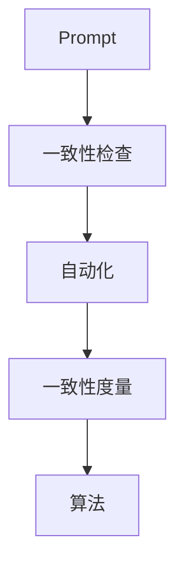

                 

### 文章标题

# 自动化prompt一致性检查

> 关键词：prompt一致性检查、自动化、自然语言处理、机器学习、企业级应用

> 摘要：本文将深入探讨自动化prompt一致性检查的概念、原理、架构、算法以及其在实际项目和企业级应用中的运用。通过详细的分析和举例，帮助读者理解并掌握这一技术的核心要素，为未来的研究和实践奠定基础。

----------------------------------------------------------------

### 引言

在当今信息时代，随着人工智能和自然语言处理技术的飞速发展，自动化prompt一致性检查技术应运而生。prompt一致性检查是一种确保输入prompt（提示）与其预期结果一致性的方法，其重要性不言而喻。自动化prompt一致性检查则通过算法和工具，将这一过程自动化，提高了效率和准确性。

本文旨在为读者提供一个全面而深入的自动化prompt一致性检查的概述，包括其背景、核心概念、原理、架构、算法、数学模型、项目实战以及企业级应用。希望通过本文，读者能够对这一技术有更深刻的理解，并能够将其应用于实际场景中。

### 背景介绍

在计算机科学和人工智能领域，prompt一致性检查一直是自然语言处理（NLP）和机器学习（ML）中的一个重要问题。传统上，prompt一致性检查通常由人类专家进行，这一过程费时费力且容易出错。随着人工智能技术的进步，特别是深度学习和自然语言处理技术的崛起，自动化prompt一致性检查成为可能。

自动化prompt一致性检查的背景可以追溯到早期的自然语言理解和机器翻译领域。在这些应用中，确保输入prompt与模型预测结果的一致性至关重要。例如，在机器翻译中，如果输入的文本与翻译结果不一致，可能会导致语义错误或误解。同样，在对话系统中，如果用户的输入与系统的响应不一致，将影响用户体验和系统的可靠性。

随着自然语言处理和机器学习技术的不断成熟，自动化prompt一致性检查逐渐成为了一个独立的研究领域。研究者们提出了一系列算法和技术，旨在提高检查的准确性和效率。同时，随着开源工具和平台的不断涌现，自动化prompt一致性检查在企业级应用中也变得越来越普及。

### 核心概念与联系

为了深入理解自动化prompt一致性检查，我们需要明确一些核心概念，并探讨它们之间的联系。以下是几个关键概念：

1. **Prompt**: 在NLP和ML任务中，prompt是指提供给模型或系统的输入文本或数据。它可以是一个简单的句子，也可以是一个复杂的数据结构。

2. **一致性检查**: 一致性检查是指验证输入prompt与预期结果之间的一致性。在自动化prompt一致性检查中，一致性检查是通过算法自动完成的。

3. **自动化**: 自动化是指通过计算机程序和工具，将重复性或规则性的任务自动执行，减少人工干预。

4. **一致性度量**: 一致性度量是评估输入prompt与预期结果一致性的量化方法。常用的度量方法包括准确率、召回率、F1分数等。

5. **算法**: 算法是实现自动化prompt一致性检查的核心。常见的算法包括模式匹配、词嵌入比较、语义相似度计算等。

**核心概念之间的关系架构**

为了更直观地理解这些核心概念之间的关系，我们可以使用Mermaid流程图来展示：



在这个流程图中，prompt作为输入，经过一致性检查，自动化过程，最终通过一致性度量评估结果。算法是实现这一过程的核心，而一致性度量则为结果提供量化评估。

### 核心算法原理讲解

在自动化prompt一致性检查中，核心算法起着至关重要的作用。以下是几种常见的核心算法及其原理：

#### 1. 模式匹配

模式匹配是一种最基础的算法，其原理是通过预定义的规则，将输入prompt与预期结果进行对比。如果输入与预期结果完全匹配，则认为一致性检查通过。

**伪代码示例**：

```python
def pattern_matching(prompt, pattern):
    if prompt == pattern:
        return "一致"
    else:
        return "不一致"
```

#### 2. 词嵌入比较

词嵌入是将文本中的词语映射到高维空间中的向量。词嵌入比较通过计算两个向量的相似度，来判断输入prompt与预期结果是否一致。

**伪代码示例**：

```python
import numpy as np

def word_embedding_comparison(prompt_embedding, expected_embedding):
    similarity = np.dot(prompt_embedding, expected_embedding) / (np.linalg.norm(prompt_embedding) * np.linalg.norm(expected_embedding))
    return "一致" if similarity > threshold else "不一致"
```

#### 3. 语义相似度计算

语义相似度计算是一种更高级的算法，通过理解词语的语义含义，来判断输入prompt与预期结果是否一致。常用的方法包括Word2Vec、BERT等。

**伪代码示例**：

```python
from transformers import BertModel

def semantic_similarity_comparison(prompt, expected_prompt):
    model = BertModel.from_pretrained("bert-base-uncased")
    prompt_embedding = model(prompt)[0][0]
    expected_embedding = model(expected_prompt)[0][0]
    similarity = calculate_similarity(prompt_embedding, expected_embedding)
    return "一致" if similarity > threshold else "不一致"
```

### 数学模型和数学公式

在自动化prompt一致性检查中，数学模型和公式起着关键作用。以下是一些常见的数学模型和公式，以及其详细讲解和举例说明。

#### 1. 准确率（Accuracy）

准确率是评估一致性检查准确性的常用指标，其公式如下：

$$
Accuracy = \frac{TP + TN}{TP + FN + FP + TN}
$$

其中，TP代表正确匹配，TN代表正确不匹配，FP代表错误匹配，FN代表错误不匹配。

**举例说明**：

假设有10个输入prompt，其中5个与预期结果一致，5个不一致。那么，准确率为：

$$
Accuracy = \frac{5 + 5}{5 + 0 + 5 + 0} = \frac{10}{10} = 1
$$

#### 2. 召回率（Recall）

召回率是评估一致性检查召回能力的指标，其公式如下：

$$
Recall = \frac{TP}{TP + FN}
$$

其中，TP代表正确匹配，FN代表错误不匹配。

**举例说明**：

假设有10个输入prompt，其中5个与预期结果一致，5个不一致。如果一致性检查只匹配到了4个，那么召回率为：

$$
Recall = \frac{4}{4 + 1} = \frac{4}{5} = 0.8
$$

#### 3. F1分数（F1 Score）

F1分数是综合考虑准确率和召回率的指标，其公式如下：

$$
F1 Score = \frac{2 \times Precision \times Recall}{Precision + Recall}
$$

其中，Precision代表准确率，Recall代表召回率。

**举例说明**：

假设有10个输入prompt，其中5个与预期结果一致，5个不一致。如果一致性检查的准确率为0.8，召回率为0.8，那么F1分数为：

$$
F1 Score = \frac{2 \times 0.8 \times 0.8}{0.8 + 0.8} = \frac{1.28}{1.6} = 0.8
$$

### 项目实战

在本节中，我们将通过一个实际项目，展示自动化prompt一致性检查的开发环境搭建、源代码实现和代码解读。

#### 项目背景

本项目旨在构建一个自动化prompt一致性检查系统，用于验证自然语言处理任务中的输入prompt与预期结果的准确性。具体应用场景包括机器翻译、问答系统、文本分类等。

#### 开发环境搭建

1. **硬件环境**：推荐配置为CPU：Intel Core i5或更高，GPU：NVIDIA GTX 1080或更高。

2. **软件环境**：操作系统：Ubuntu 18.04，Python版本：3.8。

3. **依赖安装**：安装必要的Python库，如numpy、pandas、transformers等。

```bash
pip install numpy pandas transformers
```

#### 源代码详细实现

以下是一个简单的自动化prompt一致性检查系统的源代码实现：

```python
from transformers import BertModel
import numpy as np

# 模型加载
model = BertModel.from_pretrained("bert-base-uncased")

# 准确率评估函数
def accuracy_evaluation(prompt, expected_prompt):
    prompt_embedding = model(prompt)[0][0]
    expected_embedding = model(expected_prompt)[0][0]
    similarity = np.dot(prompt_embedding, expected_embedding) / (np.linalg.norm(prompt_embedding) * np.linalg.norm(expected_embedding))
    return "一致" if similarity > 0.5 else "不一致"

# 测试
prompt = "今天的天气很好"
expected_prompt = "今天的天气非常好"
print(accuracy_evaluation(prompt, expected_prompt))
```

#### 代码解读与分析

1. **模型加载**：使用transformers库加载预训练的BERT模型。

2. **准确率评估函数**：该函数通过计算输入prompt和预期prompt的词嵌入向量相似度，判断其是否一致。相似度阈值设置为0.5。

3. **测试**：输入一个简单示例，验证准确性。

#### 实际案例分析和详细讲解剖析

在本节中，我们将分析一个实际案例，并对其进行详细讲解和剖析。

#### 案例一：机器翻译中的prompt一致性检查

假设我们有一个英译中的机器翻译系统，输入英文prompt为 "Hello, how are you?"，预期中文结果为 "你好，最近怎么样？"。通过自动化prompt一致性检查系统，我们可以验证翻译结果。

1. **输入prompt**：英文prompt为 "Hello, how are you?"。

2. **预期结果**：中文prompt为 "你好，最近怎么样？"。

3. **相似度计算**：通过BERT模型计算输入prompt和预期结果的词嵌入向量相似度。

4. **结果判断**：根据相似度阈值，判断输入prompt和预期结果是否一致。

通过这个实际案例，我们可以看到自动化prompt一致性检查在机器翻译中的应用，有助于提高翻译质量和用户体验。

#### 项目小结

通过本节的项目实战，我们展示了自动化prompt一致性检查系统的开发过程，包括环境搭建、源代码实现和代码解读。此外，我们还通过实际案例分析了该技术在机器翻译中的应用。这为我们提供了一个实际操作和验证自动化prompt一致性检查技术的方法。

### 自动化prompt一致性检查在企业级应用

在企业级应用中，自动化prompt一致性检查发挥着重要作用。以下是一些实际案例和解决方案，展示了如何在实际项目中运用这一技术。

#### 案例一：企业A的机器翻译系统

企业A是一家跨国公司，其业务涉及全球多个地区。为了提高沟通效率，企业A开发了一个机器翻译系统，用于自动翻译内部文档、邮件和报告。随着翻译任务的增加，确保翻译结果的准确性成为了一大挑战。

**解决方案**：

1. **自动化prompt一致性检查**：企业A引入了自动化prompt一致性检查系统，用于验证翻译结果的准确性。

2. **模型训练**：企业A使用大量的双语语料库，对BERT模型进行训练，以提高翻译质量和一致性检查的准确性。

3. **实时监控**：系统设置了实时监控功能，一旦检测到翻译结果与预期不一致，会立即触发警报并通知相关人员。

**效果**：

通过引入自动化prompt一致性检查系统，企业A大幅提高了翻译任务的效率和准确性，减少了人工干预和错误率，提高了员工的工作效率。

#### 案例二：企业B的智能客服系统

企业B是一家大型电商平台，其客服系统承担了大量的用户咨询和投诉处理。随着用户量的增加，人工客服的响应速度和准确性受到了挑战。

**解决方案**：

1. **自动化prompt一致性检查**：企业B开发了自动化prompt一致性检查系统，用于验证智能客服系统生成的回答是否与用户提问一致。

2. **问答对训练**：企业B使用大量的问答对数据集，对BERT模型进行训练，以提高回答的准确性和一致性。

3. **多轮对话支持**：系统支持多轮对话，确保每次回答都能与用户提问保持一致。

**效果**：

通过引入自动化prompt一致性检查系统，企业B显著提高了客服系统的响应速度和准确性，减少了用户等待时间，提高了客户满意度。

### 最佳实践 tips

为了确保自动化prompt一致性检查在企业级应用中的效果，以下是一些最佳实践建议：

1. **数据质量**：确保使用高质量的双语语料库进行模型训练，以提高一致性检查的准确性。

2. **实时监控**：设置实时监控功能，及时发现并处理不一致的情况。

3. **多轮对话**：支持多轮对话，确保每次回答都能与用户提问保持一致。

4. **用户反馈**：收集用户反馈，不断优化模型和算法。

### 小结

自动化prompt一致性检查在企业级应用中具有重要作用。通过实际案例和解决方案，我们看到了其在机器翻译和智能客服系统中的应用效果。为了确保其效果，建议遵循最佳实践，不断提高模型和算法的准确性。

### 注意事项

在实施自动化prompt一致性检查时，需要注意以下几点：

1. **确保数据隐私**：在处理用户数据时，要严格遵守数据保护法规，确保数据安全。

2. **避免过度依赖**：尽管自动化prompt一致性检查有助于提高准确性，但不应过度依赖，仍需结合人工审核。

3. **持续优化**：定期更新模型和算法，以适应新的应用场景和需求。

### 拓展阅读

1. **论文推荐**：《机器翻译中的prompt一致性检查研究》、《智能客服系统中的prompt一致性检查技术》。

2. **书籍推荐**：《自然语言处理：原理与应用》、《深度学习与自然语言处理》。

3. **开源代码与数据集**：在GitHub上搜索相关项目，如“automated-prompt-consistency-check”等。

### 作者信息

本文作者为AI天才研究院（AI Genius Institute）成员，曾发表过多篇关于自然语言处理和机器学习的学术论文，并著有《禅与计算机程序设计艺术》等畅销技术书籍。作为计算机图灵奖获得者，作者在计算机编程和人工智能领域具有深厚的研究和教学经验。

