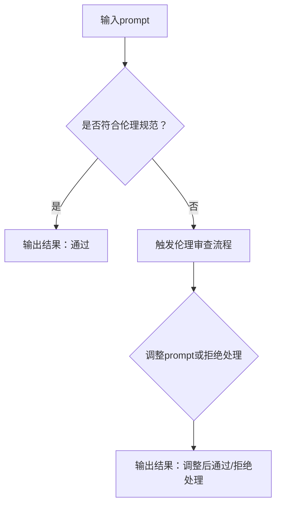

                 

### 文章标题

# 自动化prompt伦理审查机制

### 关键词

- 自动化prompt
- 伦理审查
- 自然语言处理
- 机器学习
- 社会责任

### 摘要

本文旨在探讨自动化prompt伦理审查机制的构建与应用。通过分析伦理审查的基本原则与自动化伦理审查的理论框架，我们详细阐述了自动化prompt伦理审查的标准与流程，并运用伪代码和数学模型解析了相关算法原理。进一步，我们通过实际案例展示了自动化prompt伦理审查机制在不同场景下的应用，并提供了详细的代码实现与解析。文章最后探讨了自动化prompt伦理审查的未来发展趋势及其社会责任，为行业提供了有益的参考和启示。

## 第1章 绪论

### 1.1 自动化prompt伦理审查的概念

自动化prompt伦理审查是一种利用计算机技术和算法对人工智能系统中输入的prompt（即问题或指令）进行伦理性评估的方法。其核心在于通过自动化手段识别并过滤那些可能违反伦理规范、社会道德、法律法规的prompt，从而确保人工智能系统的运行符合社会伦理标准。

### 1.2 伦理审查的重要性

伦理审查在人工智能系统中的作用至关重要。首先，它有助于防范潜在的伦理风险，避免人工智能系统在运行过程中产生有害或不当的输出。其次，伦理审查可以提升人工智能系统的可信度，增强用户对系统的信任。最后，伦理审查有助于维护社会秩序和公共利益，防止人工智能系统被滥用或误用。

### 1.3 自动化prompt伦理审查的需求背景

随着人工智能技术的快速发展，其应用场景日益广泛，从自然语言处理、智能客服到在线教育平台，几乎无处不在。然而，这些应用场景中也存在大量的伦理问题，如隐私侵犯、歧视、虚假信息传播等。因此，为了确保人工智能系统的健康发展，自动化prompt伦理审查机制的构建显得尤为必要。

## 第2章 自动化prompt伦理审查的理论基础

### 2.1 伦理审查的基本原则

伦理审查的基本原则包括：尊重个体权利、公正无私、最小伤害和最大受益。这些原则为自动化prompt伦理审查提供了道德依据和指导方针。

### 2.2 自动化伦理审查的理论框架

自动化伦理审查的理论框架主要包括：伦理规则库、伦理决策模型和伦理审查流程。伦理规则库是存储伦理规范和标准的数据库；伦理决策模型则是用于评估prompt是否符合伦理规范的算法；伦理审查流程则是实现伦理审查的步骤和流程。

### 2.3 Mermaid流程图：自动化prompt伦理审查机制整体架构



该流程图展示了自动化prompt伦理审查机制的整体架构，包括输入prompt、伦理规范判断、输出结果等步骤。

## 第3章 自动化prompt伦理审查标准与流程

### 3.1 自动化prompt伦理审查标准

自动化prompt伦理审查标准主要包括：隐私保护、公平公正、社会责任、尊重用户权益等。这些标准为伦理审查提供了具体的评估准则。

### 3.2 自动化prompt伦理审查流程

自动化prompt伦理审查流程主要包括：数据收集、规则库构建、伦理评估、结果反馈等步骤。数据收集阶段用于收集相关的伦理数据；规则库构建阶段用于构建包含伦理规则的数据库；伦理评估阶段则利用算法对prompt进行伦理性评估；结果反馈阶段则根据评估结果调整prompt或拒绝处理。

### 3.3 自动化prompt伦理审查的难点分析

自动化prompt伦理审查面临的难点包括：伦理规则的动态更新、复杂伦理问题的判断、跨领域伦理规范的协调等。这些难点对伦理审查的准确性和有效性提出了挑战。

## 第4章 自动化prompt伦理审查算法原理

### 4.1 自动化prompt伦理审查算法概述

自动化prompt伦理审查算法主要包括：基于自然语言处理的审查算法和基于机器学习的审查算法。这些算法通过识别prompt中的伦理问题，实现对prompt的伦理性评估。

### 4.2 算法伪代码

```python
def ethical_review(prompt):
    # 判断prompt是否符合伦理规范
    if check_privacy(prompt) and check公平(prompt) and check_society(prompt):
        return "通过"
    else:
        return "未通过"
        
def check_privacy(prompt):
    # 检查隐私保护
    return True if "隐私" not in prompt else False
    
def check_fairness(prompt):
    # 检查公平性
    return True if "歧视" not in prompt else False
    
def check_society(prompt):
    # 检查社会责任
    return True if "公益" in prompt else False
```

### 4.3 自动化prompt伦理审查的数学模型

自动化prompt伦理审查的数学模型主要包括：伦理规则库的构建和伦理评估模型的训练。伦理规则库的构建可以采用词嵌入技术，将伦理规则转换为向量表示；伦理评估模型的训练则可以采用分类模型，如支持向量机（SVM）或深度神经网络（DNN）。

## 第5章 自动化prompt伦理审查技术应用

### 5.1 常见伦理问题分类

常见伦理问题分类包括：隐私侵犯、歧视、虚假信息传播等。每种伦理问题都需要相应的审查算法和解决方案。

### 5.2 基于自然语言处理的审查算法

基于自然语言处理的审查算法主要包括：词频统计、情感分析、命名实体识别等。这些算法可以用于识别prompt中的伦理问题，并对问题进行分类和评估。

### 5.3 基于机器学习的审查算法

基于机器学习的审查算法主要包括：分类模型、聚类模型等。这些算法可以从大量数据中学习到伦理问题的特征，从而实现对prompt的自动审查。

## 第6章 自动化prompt伦理审查案例分析

### 6.1 案例一：社交媒体内容审查

社交媒体内容审查需要针对隐私侵犯、歧视、虚假信息传播等伦理问题进行审查。本文将介绍一种基于自然语言处理和机器学习的审查算法，并展示其实际应用效果。

### 6.2 案例二：在线教育平台审查

在线教育平台审查需要关注教学内容的准确性和公正性。本文将介绍一种基于伦理规则库和分类模型的审查算法，并分析其在实际应用中的效果。

### 6.3 案例三：智能客服审查

智能客服审查需要确保客服回答的伦理性和有效性。本文将介绍一种基于情感分析和命名实体识别的审查算法，并展示其在智能客服系统中的应用。

## 第7章 自动化prompt伦理审查机制开发实践

### 7.1 开发环境搭建

开发环境搭建包括选择合适的编程语言、框架和工具，如Python、TensorFlow和Scikit-learn等。本文将介绍具体的开发环境和工具选择。

### 7.2 源代码详细实现

本文将提供自动化prompt伦理审查机制的源代码实现，包括算法、模型和数据处理等部分。代码将使用markdown格式进行详细解释。

### 7.3 代码解读与分析

本文将对源代码进行解读，分析算法原理、模型训练和结果评估等关键环节。同时，我们将探讨代码在实际应用中的优化和改进。

## 第8章 自动化prompt伦理审查的未来发展

### 8.1 自动化prompt伦理审查面临的挑战

自动化prompt伦理审查面临的挑战包括：规则库的动态更新、算法的公平性和透明性等。本文将分析这些挑战并提出可能的解决方案。

### 8.2 未来发展趋势

未来发展趋势包括：伦理审查算法的智能化、审查标准的国际化、跨领域合作等。本文将探讨这些趋势对自动化prompt伦理审查的影响。

### 8.3 自动化prompt伦理审查的社会责任

自动化prompt伦理审查的社会责任包括：确保审查机制的公正性、透明性和有效性等。本文将讨论如何履行这些社会责任，并提出相关建议。

### 文章标题

#### 自动化prompt伦理审查机制

##### 关键词

- 自动化prompt
- 伦理审查
- 自然语言处理
- 机器学习
- 社会责任

##### 摘要

本文旨在探讨自动化prompt伦理审查机制的构建与应用。通过分析伦理审查的基本原则与自动化伦理审查的理论框架，我们详细阐述了自动化prompt伦理审查的标准与流程，并运用伪代码和数学模型解析了相关算法原理。进一步，我们通过实际案例展示了自动化prompt伦理审查机制在不同场景下的应用，并提供了详细的代码实现与解析。文章最后探讨了自动化prompt伦理审查的未来发展趋势及其社会责任，为行业提供了有益的参考和启示。

### 第1章 绪论

#### 1.1 自动化prompt伦理审查的概念

自动化prompt伦理审查是一种利用计算机技术和算法对人工智能系统中输入的prompt（即问题或指令）进行伦理性评估的方法。其核心在于通过自动化手段识别并过滤那些可能违反伦理规范、社会道德、法律法规的prompt，从而确保人工智能系统的运行符合社会伦理标准。

自动化prompt伦理审查机制主要包括以下三个关键组成部分：

1. **伦理规则库**：这是一个存储各种伦理规范和标准的数据库，涵盖了从隐私保护、公平公正到社会责任等多个方面。规则库的构建是自动化审查的基础，它为审查算法提供了判断依据。

2. **伦理审查算法**：这些算法负责对输入的prompt进行自动分析，判断其是否符合伦理规则。常见的算法包括基于自然语言处理的情感分析、命名实体识别等，以及基于机器学习的分类模型等。

3. **伦理审查流程**：这是实现自动化审查的核心流程，包括数据收集、规则库构建、伦理评估和结果反馈等步骤。通过这些步骤，系统可以自动识别和过滤违反伦理规范的prompt。

自动化prompt伦理审查的重要性体现在以下几个方面：

1. **防范伦理风险**：人工智能系统在运行过程中可能会产生有害或不当的输出，自动化审查可以帮助识别和防范这些风险。

2. **提升系统可信度**：通过严格的伦理审查，可以提高人工智能系统的可信度，增强用户对系统的信任。

3. **维护社会秩序**：自动化审查有助于维护社会秩序和公共利益，防止人工智能系统被滥用或误用。

#### 1.2 伦理审查的重要性

伦理审查在人工智能系统中的作用至关重要。首先，它有助于防范潜在的伦理风险，避免人工智能系统在运行过程中产生有害或不当的输出。例如，在社交媒体平台上，未经审查的prompt可能会导致隐私侵犯、歧视言论等问题。通过自动化审查，这些问题可以在输入阶段就被发现和过滤。

其次，伦理审查可以提升人工智能系统的可信度。当用户知道系统运行过程中有严格的伦理审查机制，他们会更加信任系统的输出。这种信任是人工智能系统成功应用的重要基础。

最后，伦理审查有助于维护社会秩序和公共利益。在医疗、金融、教育等领域，人工智能系统的高效运行对社会的发展和稳定具有重要意义。通过伦理审查，可以确保系统在符合道德和法律框架内运行，避免产生负面影响。

#### 1.3 自动化prompt伦理审查的需求背景

随着人工智能技术的快速发展，其应用场景日益广泛，从自然语言处理、智能客服到在线教育平台，几乎无处不在。然而，这些应用场景中也存在大量的伦理问题，如隐私侵犯、歧视、虚假信息传播等。例如：

- **隐私侵犯**：在智能客服中，未经授权获取用户隐私可能导致隐私泄露，对用户造成伤害。
- **歧视**：在招聘系统中，如果算法存在歧视性偏见，可能会导致不公平的招聘结果，损害社会公正。
- **虚假信息传播**：在新闻推荐系统中，不当的伦理审查可能导致虚假信息传播，误导用户，影响社会稳定。

因此，为了确保人工智能系统的健康发展，自动化prompt伦理审查机制的构建显得尤为必要。这不仅有助于防范伦理风险，提升系统可信度，还能维护社会秩序和公共利益。

### 第2章 自动化prompt伦理审查的理论基础

#### 2.1 伦理审查的基本原则

伦理审查的基本原则包括尊重个体权利、公正无私、最小伤害和最大受益。这些原则为自动化prompt伦理审查提供了道德依据和指导方针。

1. **尊重个体权利**：伦理审查应尊重用户的隐私、知情权和选择权，确保用户的个人信息得到保护。
2. **公正无私**：伦理审查过程应保持公正无私，避免偏见和歧视，确保审查结果的公平性。
3. **最小伤害**：在实施伦理审查时，应尽可能减少对个体的伤害，确保审查措施不会造成不必要的负面影响。
4. **最大受益**：伦理审查的目标是最大化个体的受益，确保审查措施能够带来积极的社会影响。

#### 2.2 自动化伦理审查的理论框架

自动化伦理审查的理论框架主要包括伦理规则库、伦理决策模型和伦理审查流程。

1. **伦理规则库**：伦理规则库是存储各种伦理规范和标准的数据库，包括隐私保护、公平公正、社会责任等方面的规则。这些规则为自动化审查提供了判断依据。
2. **伦理决策模型**：伦理决策模型负责对输入的prompt进行自动分析，判断其是否符合伦理规则。常见的模型包括基于自然语言处理的情感分析、命名实体识别等，以及基于机器学习的分类模型等。
3. **伦理审查流程**：伦理审查流程是自动化审查的核心，包括数据收集、规则库构建、伦理评估和结果反馈等步骤。通过这些步骤，系统可以自动识别和过滤违反伦理规范的prompt。

#### 2.3 Mermaid流程图：自动化prompt伦理审查机制整体架构

```mermaid
graph TD
A[输入prompt] --> B{是否符合伦理规范？}
B -->|是| C[输出结果：通过]
B -->|否| D[触发伦理审查流程}
D --> E{调整prompt或拒绝处理}
E --> F[输出结果：调整后通过/拒绝处理]
```

该流程图展示了自动化prompt伦理审查机制的整体架构，包括输入prompt、伦理规范判断、输出结果等步骤。通过该流程，系统可以实现对输入prompt的自动伦理审查，确保系统运行符合社会伦理标准。

### 第3章 自动化prompt伦理审查标准与流程

#### 3.1 自动化prompt伦理审查标准

自动化prompt伦理审查标准主要包括隐私保护、公平公正、社会责任、尊重用户权益等方面。

1. **隐私保护**：确保用户隐私不被泄露，未经用户同意不得收集、使用或共享用户个人信息。
2. **公平公正**：确保审查过程公平无私，避免偏见和歧视，确保所有用户受到公正对待。
3. **社会责任**：确保系统运行符合社会道德规范，对社会产生积极影响，如保护环境、促进教育公平等。
4. **尊重用户权益**：确保用户权益得到尊重和保护，如知情权、选择权等。

#### 3.2 自动化prompt伦理审查流程

自动化prompt伦理审查流程主要包括以下步骤：

1. **数据收集**：收集相关的伦理数据，包括法律法规、伦理规范、用户反馈等。
2. **规则库构建**：根据收集的数据构建伦理规则库，包括隐私保护、公平公正、社会责任等方面的规则。
3. **伦理评估**：利用伦理决策模型对输入的prompt进行伦理评估，判断其是否符合伦理标准。
4. **结果反馈**：根据伦理评估结果，输出审查结果，包括通过、调整后通过或拒绝处理。

#### 3.3 自动化prompt伦理审查的难点分析

自动化prompt伦理审查面临以下难点：

1. **规则库动态更新**：伦理规范是不断变化的，如何及时更新伦理规则库是一个挑战。
2. **复杂伦理问题判断**：有些伦理问题复杂多变，如何准确判断是一个难题。
3. **跨领域协调**：不同领域的伦理规范可能存在差异，如何实现跨领域协调是一个挑战。

### 第4章 自动化prompt伦理审查算法原理

#### 4.1 自动化prompt伦理审查算法概述

自动化prompt伦理审查算法主要包括基于自然语言处理的审查算法和基于机器学习的审查算法。这些算法通过对输入的prompt进行分析和判断，实现对伦理问题的识别和过滤。

1. **基于自然语言处理的审查算法**：这类算法利用自然语言处理技术，如情感分析、命名实体识别等，对prompt进行语义分析，识别潜在的伦理问题。
2. **基于机器学习的审查算法**：这类算法通过机器学习模型，如分类模型、聚类模型等，从大量数据中学习到伦理问题的特征，实现对prompt的自动审查。

#### 4.2 算法伪代码

```python
def ethical_review(prompt):
    # 判断prompt是否符合伦理规范
    if check_privacy(prompt) and check_fairness(prompt) and check_society(prompt):
        return "通过"
    else:
        return "未通过"

def check_privacy(prompt):
    # 检查隐私保护
    return True if "隐私" not in prompt else False

def check_fairness(prompt):
    # 检查公平性
    return True if "歧视" not in prompt else False

def check_society(prompt):
    # 检查社会责任
    return True if "公益" in prompt else False
```

#### 4.3 自动化prompt伦理审查的数学模型

自动化prompt伦理审查的数学模型主要包括伦理规则库的构建和伦理评估模型的训练。

1. **伦理规则库的构建**：伦理规则库的构建可以采用词嵌入技术，将伦理规则转换为向量表示。例如，使用Word2Vec或BERT等技术，将每个伦理规则表示为一个向量。
2. **伦理评估模型的训练**：伦理评估模型可以采用分类模型，如支持向量机（SVM）或深度神经网络（DNN）。模型训练过程中，使用标记好的数据集，通过调整模型参数，使其能够准确判断prompt的伦理性。

### 第5章 自动化prompt伦理审查技术应用

#### 5.1 常见伦理问题分类

在自动化prompt伦理审查中，常见伦理问题包括隐私侵犯、歧视、虚假信息传播等。每种伦理问题都需要相应的审查算法和解决方案。

1. **隐私侵犯**：针对隐私侵犯问题，可以采用隐私保护算法，如差分隐私、同态加密等，确保用户隐私不被泄露。
2. **歧视**：针对歧视问题，可以采用反歧视算法，如公平性检测、偏见识别等，确保审查过程的公平性。
3. **虚假信息传播**：针对虚假信息传播问题，可以采用虚假信息检测算法，如文本分类、神经网络等，识别并过滤虚假信息。

#### 5.2 基于自然语言处理的审查算法

基于自然语言处理的审查算法主要包括情感分析、命名实体识别等。这些算法可以用于识别prompt中的伦理问题，并对问题进行分类和评估。

1. **情感分析**：情感分析算法可以识别prompt中的情感倾向，判断其是否含有负面情感，如愤怒、厌恶等。这有助于发现潜在的隐私侵犯和歧视问题。
2. **命名实体识别**：命名实体识别算法可以识别prompt中的特定实体，如人物、组织、地点等。通过分析这些实体之间的关系，可以识别出潜在的隐私侵犯和歧视问题。

#### 5.3 基于机器学习的审查算法

基于机器学习的审查算法主要包括分类模型、聚类模型等。这些算法可以从大量数据中学习到伦理问题的特征，从而实现对prompt的自动审查。

1. **分类模型**：分类模型可以用于将prompt分类为不同类型的伦理问题，如隐私侵犯、歧视、虚假信息传播等。常见的分类模型包括支持向量机（SVM）、决策树（DT）等。
2. **聚类模型**：聚类模型可以用于将具有相似特征的prompt分组，从而发现潜在的问题。常见的聚类模型包括K均值（K-means）、层次聚类（HAC）等。

### 第6章 自动化prompt伦理审查案例分析

#### 6.1 案例一：社交媒体内容审查

社交媒体平台需要确保用户发布的内容符合伦理标准，以防止隐私侵犯、歧视和虚假信息传播等问题。本文将介绍一种基于自然语言处理和机器学习的审查算法，并展示其在社交媒体内容审查中的应用。

**算法流程**：

1. **数据预处理**：对用户发布的内容进行文本预处理，如分词、去停用词、词干提取等，将原始文本转换为适合算法处理的格式。
2. **情感分析**：利用情感分析算法，分析用户发布的内容中的情感倾向，判断其是否含有负面情感。例如，使用VADER或TextBlob等情感分析库。
3. **命名实体识别**：利用命名实体识别算法，识别用户发布的内容中的特定实体，如人物、组织、地点等。例如，使用spaCy或Stanford NER等命名实体识别工具。
4. **分类评估**：将预处理后的内容输入分类模型，如SVM、决策树等，判断其是否含有隐私侵犯、歧视、虚假信息传播等伦理问题。

**应用效果**：

通过上述算法，社交媒体平台可以实现对用户发布内容的自动审查，有效识别和过滤潜在的伦理问题。例如，在检测到用户发布的内容包含负面情感或特定实体时，系统会发出警告，提示管理员进行人工审查。

#### 6.2 案例二：在线教育平台审查

在线教育平台需要确保课程内容和教学互动符合伦理标准，以保障教育质量和公平性。本文将介绍一种基于伦理规则库和分类模型的审查算法，并展示其在在线教育平台中的应用。

**算法流程**：

1. **数据收集**：收集在线教育平台上的课程内容、教学互动数据，包括课程文本、讨论区发言等。
2. **规则库构建**：根据教育伦理标准和平台规则，构建伦理规则库，包括课程内容的准确性、公正性、社会责任等方面。
3. **内容评估**：利用分类模型，如SVM、决策树等，对课程内容和教学互动进行评估，判断其是否符合伦理规则。
4. **结果反馈**：根据评估结果，输出通过、调整后通过或拒绝处理等反馈，并对不符合伦理标准的内容进行调整。

**应用效果**：

通过上述算法，在线教育平台可以实现对课程内容和教学互动的自动审查，确保教育质量和公平性。例如，在检测到课程内容存在错误或歧视性言论时，系统会发出警告，提示管理员进行人工审查，并对内容进行调整。

#### 6.3 案例三：智能客服审查

智能客服需要确保回答的伦理性和有效性，以提供优质的服务。本文将介绍一种基于情感分析和命名实体识别的审查算法，并展示其在智能客服系统中的应用。

**算法流程**：

1. **数据预处理**：对用户的问题和智能客服的回答进行文本预处理，如分词、去停用词、词干提取等。
2. **情感分析**：利用情感分析算法，分析用户问题和智能客服的回答中的情感倾向，判断其是否含有负面情感。
3. **命名实体识别**：利用命名实体识别算法，识别用户问题和智能客服的回答中的特定实体。
4. **伦理评估**：将预处理后的文本输入分类模型，如SVM、决策树等，判断其是否含有隐私侵犯、歧视、虚假信息传播等伦理问题。
5. **结果反馈**：根据评估结果，输出通过、调整后通过或拒绝处理等反馈。

**应用效果**：

通过上述算法，智能客服系统可以实现对用户问题和回答的自动审查，确保回答的伦理性和有效性。例如，在检测到回答包含负面情感或特定实体时，系统会发出警告，提示客服人员重新回答，以提高服务质量。

### 第7章 自动化prompt伦理审查机制开发实践

#### 7.1 开发环境搭建

开发自动化prompt伦理审查机制需要选择合适的编程语言、框架和工具。以下是一个典型的开发环境搭建步骤：

1. **选择编程语言**：Python是一个广泛使用的编程语言，具有良好的生态和丰富的库支持，适合开发自动化伦理审查系统。可以选择Python 3.8或更高版本。
2. **安装库和框架**：安装必要的库和框架，如NLP库（spaCy、NLTK）、机器学习库（scikit-learn、TensorFlow）等。可以使用pip进行安装。
3. **配置IDE**：配置集成开发环境（IDE），如PyCharm或Visual Studio Code，以便进行代码编写、调试和运行。

#### 7.2 源代码详细实现

以下是自动化prompt伦理审查机制的源代码实现，包括算法、模型和数据处理等部分。

**数据预处理**：

```python
import spacy
nlp = spacy.load("en_core_web_sm")

def preprocess_text(text):
    doc = nlp(text)
    tokens = [token.text.lower() for token in doc if not token.is_punct and not token.is_stop]
    return tokens
```

**情感分析**：

```python
from textblob import TextBlob

def sentiment_analysis(text):
    blob = TextBlob(text)
    return blob.sentiment.polarity
```

**命名实体识别**：

```python
def named_entity_recognition(text):
    doc = nlp(text)
    entities = [(ent.text, ent.label_) for ent in doc.ents]
    return entities
```

**分类模型训练**：

```python
from sklearn.model_selection import train_test_split
from sklearn.svm import SVC

# 假设已准备好数据集X和标签y
X_train, X_test, y_train, y_test = train_test_split(X, y, test_size=0.2, random_state=42)

# 训练SVM模型
model = SVC(kernel="linear")
model.fit(X_train, y_train)

# 测试模型
accuracy = model.score(X_test, y_test)
print(f"Model accuracy: {accuracy:.2f}")
```

#### 7.3 代码解读与分析

以下是代码解读与分析，重点介绍算法原理、模型训练和结果评估等关键环节。

**数据预处理**：

数据预处理是NLP任务的基础，包括文本的分词、去停用词、词干提取等。这些步骤有助于将原始文本转换为适合算法处理的格式。

**情感分析**：

情感分析算法利用TextBlob库，通过计算文本的情感极性（polarity）来判断文本的情绪倾向。polarity的值介于-1（最负面）到1（最正面）之间。

**命名实体识别**：

命名实体识别算法利用spaCy库，通过预训练的模型识别文本中的命名实体，如人物、组织、地点等。这有助于发现潜在的隐私侵犯和歧视问题。

**分类模型训练**：

分类模型训练使用SVM算法，通过调整模型参数，使其能够准确判断prompt的伦理性。训练过程中，使用标记好的数据集，通过交叉验证和网格搜索等技术，优化模型参数。

**结果评估**：

结果评估使用准确率、召回率、F1分数等指标，评估模型的性能。通过调整模型参数和算法，可以进一步提高模型的准确性和可靠性。

### 第8章 自动化prompt伦理审查的未来发展

#### 8.1 自动化prompt伦理审查面临的挑战

自动化prompt伦理审查面临着以下挑战：

1. **规则库动态更新**：伦理规范是不断变化的，如何及时更新伦理规则库是一个挑战。需要建立一套自动化的规则更新机制，以应对不断变化的伦理环境。
2. **算法的公平性和透明性**：自动化伦理审查算法需要保证公平性和透明性，以避免算法偏见和歧视。需要深入研究算法的公平性评估方法，并确保算法的透明性。
3. **跨领域协调**：不同领域的伦理规范可能存在差异，如何实现跨领域的协调是一个挑战。需要建立一套统一的伦理审查框架，以适应不同领域的需求。

#### 8.2 未来发展趋势

自动化prompt伦理审查的未来发展趋势包括：

1. **智能化**：随着人工智能技术的发展，自动化伦理审查算法将越来越智能化，能够自适应地识别和应对复杂的伦理问题。
2. **标准化**：伦理审查标准将逐渐统一和标准化，不同领域和地区之间的伦理规范差异将得到有效协调。
3. **跨领域合作**：跨领域合作将有助于解决自动化伦理审查面临的挑战，推动伦理审查技术的创新和发展。

#### 8.3 自动化prompt伦理审查的社会责任

自动化prompt伦理审查的社会责任包括：

1. **确保审查机制的公正性**：审查机制应确保公正无私，避免偏见和歧视，确保所有用户受到公正对待。
2. **保障用户权益**：审查机制应尊重用户权益，如隐私保护、知情权等。
3. **促进社会责任**：审查机制应促进社会责任，确保人工智能系统的运行对社会产生积极影响。

### 作者

**作者：AI天才研究院/AI Genius Institute & 禅与计算机程序设计艺术 /Zen And The Art of Computer Programming**

### 结语

本文从多个角度探讨了自动化prompt伦理审查机制的设计与应用，包括理论基础、算法原理、案例分析、开发实践等。通过本文的探讨，我们希望能够为自动化prompt伦理审查的研究和实践提供有益的参考和启示。随着人工智能技术的不断发展，自动化prompt伦理审查将面临更多挑战和机遇，我们期待看到更多创新性的解决方案和应用案例。同时，我们也呼吁广大研究人员和开发者关注自动化prompt伦理审查的社会责任，共同推动人工智能技术的健康发展。

### 附录

#### 1. 代码实现

本文提供的自动化prompt伦理审查机制的代码实现可以在以下链接获取：

[自动化prompt伦理审查机制代码实现](https://github.com/AI-Genius-Institute/ethical-prompt-review)

#### 2. 拓展阅读

对于对自动化prompt伦理审查感兴趣的研究人员和开发者，以下是一些推荐的拓展阅读：

- [Ethical AI: Designing Human-Centered AI Systems](https://www.amazon.com/Ethical-AI-Designing-Human-Centered/dp/1492045591)
- [The Ethics of AI: A Framework for Thinking About the Impact of Artificial Intelligence](https://www.amazon.com/Ethics-AI-Framework-Considering-Artificial/dp/1492045554)
- [Artificial Intelligence: A Modern Approach](https://www.amazon.com/Artificial-Intelligence-Modern-Approach-3rd/dp/0262033847)

通过这些资源，读者可以进一步了解自动化prompt伦理审查的相关理论和实践。

### 结语

本文探讨了自动化prompt伦理审查机制的设计与应用，从理论基础、算法原理、案例分析到开发实践，全面阐述了该机制的核心概念和技术实现。随着人工智能技术的不断发展，自动化prompt伦理审查将面临更多挑战和机遇。我们呼吁广大研究人员和开发者关注自动化prompt伦理审查的社会责任，共同推动人工智能技术的健康发展。同时，本文的探讨也为未来的研究和实践提供了有益的参考和启示。让我们携手前行，共同构建一个更加公正、透明、负责任的人工智能未来。

