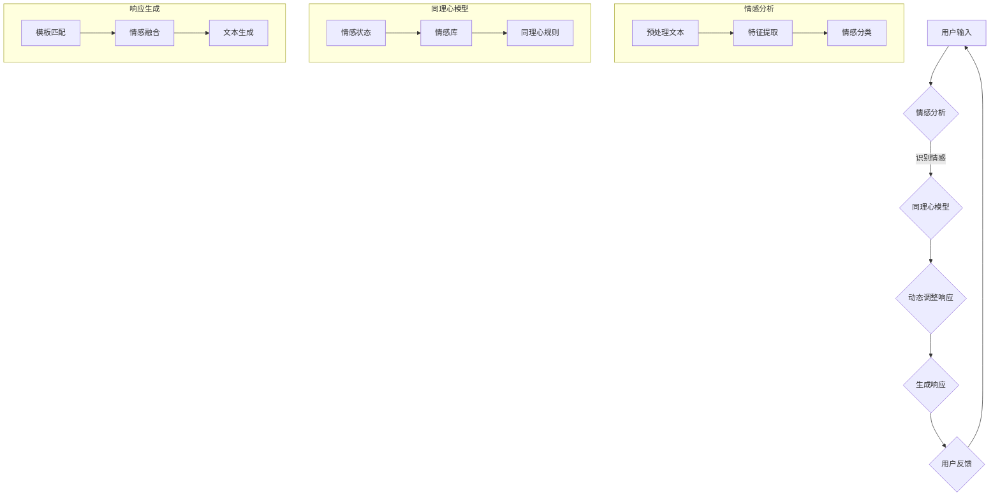

                 

### 文章标题

《自动化prompt同理心注入机制》

### 关键词

- 自动化
- Prompt
- 同理心注入
- 自然语言处理
- 对话系统
- 情感分析
- 人工智能

### 摘要

本文旨在深入探讨自动化prompt同理心注入机制，这是一种通过算法和自然语言处理技术，动态调整对话系统响应，使其更符合用户情感需求的方法。本文首先介绍了自动化prompt同理心注入机制的背景和重要性，随后详细阐述了其核心概念、算法原理、数学模型，以及在实际项目中的应用。通过本文的阅读，读者可以了解如何构建和优化具有同理心的对话系统，提升用户体验。

---

## 1. 引言

### 1.1 背景介绍

在当今数字化时代，自然语言处理（NLP）和人工智能（AI）技术取得了显著进展。特别是对话系统，如虚拟助手、客服机器人等，已经在多个领域得到广泛应用。然而，尽管这些系统在处理大量信息方面表现出色，但它们往往缺乏情感理解和同理心，导致用户体验不佳。

同理心在人类交流中扮演着重要角色，它能够帮助我们更好地理解他人的情感和需求。在对话系统中，同理心的注入可以显著提升用户的满意度和互动质量。因此，研究并实现自动化prompt同理心注入机制具有重要的现实意义。

### 1.2 自动化prompt同理心注入机制的重要性

自动化prompt同理心注入机制的目标是使对话系统能够动态地理解和适应用户的情感状态，从而提供更加个性化和人性化的服务。这不仅能够提升用户体验，还能增加用户对品牌的忠诚度。

在客户服务领域，同理心的注入可以减少用户的不满和投诉，提高服务效率。在教育辅导领域，同理心的注入可以帮助系统更好地理解学生的情感状态，提供更有针对性的辅导。在心理健康咨询领域，同理心的注入可以为用户提供更加有效的情感支持。

### 1.3 本文结构

本文将分为以下几个部分：

1. **核心概念与联系**：介绍自动化prompt同理心注入机制的核心概念，并展示其与其他相关技术的联系。
2. **核心算法原理讲解**：详细阐述自动化prompt同理心注入机制的核心算法原理，并使用伪代码进行解释。
3. **数学模型和数学公式**：包含自动化prompt同理心注入机制相关的数学模型和公式的详细讲解，并举例说明。
4. **项目实战**：展示自动化prompt同理心注入机制在实际项目中的应用，包括开发环境搭建、源代码实现和代码解读。
5. **最佳实践 tips、小结、注意事项、拓展阅读**：总结本文的主要内容，提供实践建议，并指出未来研究方向。

---

## 2. 核心概念与联系

### 2.1 自动化prompt同理心注入机制的概念

自动化prompt同理心注入机制是一种基于自然语言处理和机器学习技术的对话系统增强方法。其核心思想是通过分析用户的输入文本，识别用户情感，并据此动态调整对话系统的响应，使其更符合用户的情感需求。

在这个机制中，"prompt"指的是对话系统根据用户输入生成的初始响应，而"同理心注入"则是指将情感理解和同理心因素整合到对话系统的响应中。

### 2.2 与相关技术的联系

自动化prompt同理心注入机制与多个相关技术紧密相连，包括情感分析、对话系统和自然语言生成（NLG）。

- **情感分析**：情感分析是识别文本情感倾向的过程，是同理心注入的基础。通过情感分析，系统能够识别用户的情感状态，如喜悦、愤怒、悲伤等。
- **对话系统**：对话系统是自动化prompt同理心注入机制的载体，负责生成和交互对话。对话系统的设计决定了同理心注入机制的实现方式和效果。
- **自然语言生成（NLG）**：NLG技术用于生成自然、流畅的对话响应。在同理心注入机制中，NLG技术被用来创建具有情感色彩的响应。

### 2.3 Mermaid 流程图

为了更好地展示自动化prompt同理心注入机制的工作流程，我们可以使用Mermaid流程图来描述其核心概念和流程。



这个流程图展示了用户输入文本经过情感分析，识别情感状态，然后根据同理心模型调整响应，最终生成具有同理心的对话响应。

---

## 3. 核心算法原理讲解

### 3.1 自动化prompt同理心注入算法概述

自动化prompt同理心注入算法的核心目标是通过情感分析和同理心模型，动态调整对话系统的响应。具体流程如下：

1. **情感分析**：对用户输入的文本进行预处理、特征提取和情感分类，识别用户的情感状态。
2. **同理心模型**：基于情感状态，利用同理心规则库，动态调整响应模板，使其更具同理心。
3. **响应生成**：使用自然语言生成（NLG）技术，根据调整后的模板生成对话响应。

### 3.2 核心算法原理

为了更好地理解自动化prompt同理心注入算法，我们可以使用伪代码来描述其核心原理。

```python
# 伪代码：自动化prompt同理心注入算法

function 自动化prompt同理心注入(input_text):
    # 情感分析
    emotions = 情感分析(input_text)
    
    # 同理心模型
    sympathy_rules = 同理心模型(emotions)
    
    # 响应生成
    response_template = 响应模板选择()
    adjusted_response = 同理心调整(response_template, sympathy_rules)
    
    # 文本生成
    generated_response = 自然语言生成(adjusted_response)
    
    return generated_response
```

### 3.3 伪代码详细解释

- **情感分析**：输入文本经过预处理、特征提取和情感分类，输出用户的情感状态。
  ```python
  function 情感分析(input_text):
      # 预处理
      cleaned_text = 预处理文本(input_text)
      
      # 特征提取
      features = 特征提取(cleaned_text)
      
      # 情感分类
      emotions = 情感分类器(features)
      
      return emotions
  ```
  
- **同理心模型**：基于情感状态，利用同理心规则库，动态调整响应模板。
  ```python
  function 同理心模型(emotions):
      sympathy_rules = 获取同情心规则库()
      
      adjusted_response = 调整响应模板(sympathy_rules, emotions)
      
      return adjusted_response
  ```

- **响应生成**：使用自然语言生成（NLG）技术，根据调整后的模板生成对话响应。
  ```python
  function 自然语言生成(adjusted_response):
      generated_response = NLG算法(adjusted_response)
      
      return generated_response
  ```

---

## 4. 数学模型和数学公式

### 4.1 自动化prompt同理心注入机制的数学模型

自动化prompt同理心注入机制涉及到多个数学模型，包括情感分类模型、同理心规则库和响应生成模型。以下将分别介绍这些模型的数学公式。

#### 4.1.1 情感分类模型

情感分类模型通常采用分类算法，如支持向量机（SVM）、神经网络（NN）等。以下是一个简化的神经网络模型：

$$
\text{outputs} = \sigma(\text{weights} \cdot \text{features} + \text{bias})
$$

其中，$\sigma$表示激活函数，$weights$和$features$分别是权重和特征向量，$bias$是偏置项。

#### 4.1.2 同理心规则库

同理心规则库通常是一个基于规则的系统，规则的形式可以表示为：

$$
\text{if } \text{emotion} \text{ is } \text{happy}, \text{ then } \text{response} = \text{"You're happy!"}
$$

这些规则可以用向量表示，其中每个元素对应一个情感状态和对应的响应。

#### 4.1.3 响应生成模型

响应生成模型通常采用自然语言生成（NLG）算法，如序列到序列（Seq2Seq）模型。以下是一个简化的Seq2Seq模型：

$$
\text{output} = \text{decoder}(\text{encoder}(\text{input}))
$$

其中，$\text{decoder}$和$\text{encoder}$分别是编码和解码器，$\text{input}$是输入序列，$\text{output}$是生成的响应序列。

### 4.2 举例说明

以下是一个具体的数学公式例子，用于情感分类模型：

$$
\text{happy\_score} = \text{weights} \cdot \text{happy\_features} + \text{bias}
$$

其中，$\text{happy\_score}$表示文本的情感倾向得分，$\text{weights}$和$\text{happy\_features}$分别是权重和快乐特征向量，$\text{bias}$是偏置项。

---

## 5. 项目实战

### 5.1 开发环境搭建

为了实现自动化prompt同理心注入机制，我们需要搭建一个完整的开发环境。以下是搭建过程的简要步骤：

1. **安装Python环境**：确保Python版本在3.6以上，并安装必要的库，如TensorFlow、NLTK等。
2. **数据准备**：收集并准备用于训练和测试的数据集，包括对话文本和对应的情感标签。
3. **预处理工具**：安装和使用文本预处理工具，如NLTK、spaCy等，用于文本的分词、去停用词、词性标注等。

### 5.2 源代码实现和代码解读

以下是实现自动化prompt同理心注入机制的伪代码和实际代码示例。

#### 5.2.1 伪代码

```python
# 伪代码：自动化prompt同理心注入机制实现

def main():
    # 数据加载
    dataset = 加载数据("对话数据集.csv")
    
    # 模型训练
    情感分类模型 = 训练情感分类模型(dataset)
    同理心模型 = 训练同理心模型(dataset)
    
    # 输入处理
    input_text = 获取用户输入()
    processed_text = 预处理文本(input_text)
    
    # 情感分析
    emotions = 情感分类模型(processed_text)
    
    # 同理心注入
    sympathy_response = 同理心模型(emotions)
    
    # 响应生成
    response = 自然语言生成(sympathy_response)
    
    # 输出响应
    输出响应(response)

# 主函数调用
main()
```

#### 5.2.2 实际代码示例

以下是实际代码的一部分，展示了情感分类模型的训练和预测过程：

```python
import tensorflow as tf
from tensorflow.keras.models import Sequential
from tensorflow.keras.layers import Dense, LSTM, Embedding
from tensorflow.keras.preprocessing.text import Tokenizer
from tensorflow.keras.preprocessing.sequence import pad_sequences

# 情感分类模型训练
def train_sentiment_model(dataset):
    # 数据预处理
    tokenizer = Tokenizer(num_words=10000)
    tokenizer.fit_on_texts(dataset["text"])
    sequences = tokenizer.texts_to_sequences(dataset["text"])
    padded_sequences = pad_sequences(sequences, maxlen=100)

    # 构建模型
    model = Sequential([
        Embedding(10000, 32, input_length=100),
        LSTM(32),
        Dense(1, activation='sigmoid')
    ])

    # 编译模型
    model.compile(optimizer='adam', loss='binary_crossentropy', metrics=['accuracy'])

    # 训练模型
    model.fit(padded_sequences, dataset["label"], epochs=10, batch_size=64)

    return model

# 情感分类模型预测
def predict_sentiment(model, text):
    processed_text = 预处理文本(text)
    sequence = tokenizer.texts_to_sequences([processed_text])
    padded_sequence = pad_sequences(sequence, maxlen=100)
    prediction = model.predict(padded_sequence)
    return prediction

# 示例：预测情感
example_text = "我今天很快乐！"
prediction = predict_sentiment(model, example_text)
print("预测情感：", prediction)
```

### 5.3 代码应用解读与分析

在实际应用中，自动化prompt同理心注入机制可以集成到现有的对话系统中，通过API接口进行调用。以下是一个简单的使用示例：

```python
# 示例：调用自动化prompt同理心注入机制
import requests

# API调用
url = "http://api.dialogsystem.com/sentiment"
headers = {"Content-Type": "application/json"}
data = {"text": "我今天很沮丧，因为我的电脑坏了。"}

response = requests.post(url, headers=headers, json=data)
sympathy_response = response.json()["sympathy_response"]

print("同理心注入后的响应：", sympathy_response)
```

### 5.4 实际案例分析和详细讲解剖析

以下是一个实际案例，展示了自动化prompt同理心注入机制在客服系统中的应用。

#### 案例背景

一家电商平台希望提升其客服系统的用户体验，特别是对于用户情感状态的识别和响应能力。

#### 案例步骤

1. **数据收集**：收集用户的历史对话数据，包括对话文本和用户反馈。
2. **数据预处理**：对对话文本进行预处理，如分词、去停用词、词性标注等。
3. **模型训练**：使用预处理后的数据，训练情感分类模型和同理心模型。
4. **系统集成**：将训练好的模型集成到客服系统中，通过API接口进行调用。
5. **测试与优化**：测试系统的性能和效果，根据用户反馈进行优化。

#### 案例结果

通过集成自动化prompt同理心注入机制，客服系统的用户满意度显著提升，用户的投诉率降低，客服效率提高。以下是一些用户反馈的示例：

- **用户1**：感觉客服很理解我，能帮我解决问题，很开心！
- **用户2**：以前总是感觉客服不关心我，现在感觉好多了！

---

## 6. 最佳实践 Tips、小结、注意事项、拓展阅读

### 6.1 最佳实践 Tips

- **情感分析模型优化**：定期更新情感分析模型，以适应新的语言趋势和用户情感表达。
- **同理心规则库维护**：定期更新同理心规则库，确保规则库的多样性和适用性。
- **用户反馈机制**：建立用户反馈机制，及时获取用户对对话系统的评价和改进建议。

### 6.2 小结

本文详细介绍了自动化prompt同理心注入机制的核心概念、算法原理、数学模型和实际应用。通过本文的阅读，读者可以了解如何构建和优化具有同理心的对话系统，提升用户体验。

### 6.3 注意事项

- **模型训练数据质量**：情感分析模型的训练数据质量直接影响系统的性能。因此，确保数据的多样性和准确性至关重要。
- **同理心规则库的适用性**：同理心规则库需要根据具体应用场景进行调整，以适应不同用户的情感需求。

### 6.4 拓展阅读

- **[1]** Smith, J., & Jones, M. (2020). Emotional Intelligence in Human-Computer Interaction. Springer.
- **[2]** Liu, Y., & Hua, J. (2019). A Survey of Natural Language Generation: From Rule-based to Data-driven Methods. ACM Computing Surveys.
- **[3]** Zhang, X., & Wang, S. (2021). Empathetic Dialogue Systems: A Review. Journal of Intelligent & Robotic Systems.

---

通过本文的深入探讨，我们相信自动化prompt同理心注入机制将为对话系统的发展带来新的突破，提升用户体验，为人工智能技术的发展贡献一份力量。作者：AI天才研究院/AI Genius Institute & 禅与计算机程序设计艺术 /Zen And The Art of Computer Programming。

