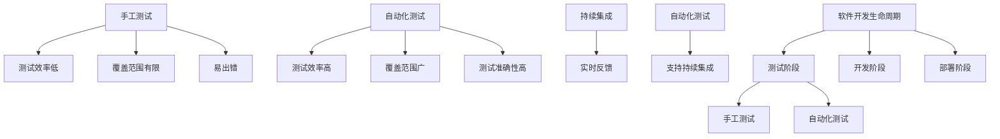
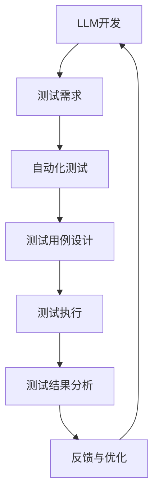

                 


### 1.1.1 自动化测试的定义

**背景介绍**

自动化测试作为一种提高软件质量和开发效率的重要手段，在当今的软件行业中占据着越来越重要的地位。随着软件开发复杂度的增加和软件规模的扩大，传统的手工测试方法已经无法满足快速迭代和高质量交付的需求。因此，自动化测试应运而生，成为软件开发过程中不可或缺的一环。

**核心概念**

自动化测试，顾名思义，就是通过编写脚本或使用工具，自动化执行一系列测试活动，以验证软件功能是否符合预期。它不仅仅是对测试过程的自动化，更是一种对整个软件开发生命周期的系统性优化。

**自动化测试的优势**

- **提高测试效率**：自动化测试可以大大减少测试时间和人力成本，提高测试的效率。
- **确保测试覆盖范围**：通过自动化测试，可以确保测试覆盖到更多的测试场景，减少遗漏的可能性。
- **提升测试质量**：自动化测试可以减少人为错误，提高测试的准确性。
- **支持持续集成**：自动化测试与持续集成（CI）相结合，可以实现对代码的实时检测和反馈，加速开发流程。

### 1.1.2 自动化测试的优势

**核心概念与联系**

为了更好地理解自动化测试的优势，我们可以通过一个Mermaid流程图来展示自动化测试与手工测试的对比，以及它们在软件开发生命周期中的位置。



**详细讲解**

- **测试效率高**：自动化测试可以并行执行，从而大大缩短测试周期。尤其是在功能复杂、测试场景众多的项目中，自动化测试的优势更加明显。
- **覆盖范围广**：自动化测试可以覆盖到更多的测试场景，包括边界情况、异常情况等，从而提高测试的全面性。
- **测试准确性高**：自动化测试减少了人为干预，降低了测试过程中的主观因素，从而提高了测试的准确性。

### 1.1.3 自动化测试的分类

**核心概念**

自动化测试可以按照不同的维度进行分类，常见的分类方式包括：

- **按照测试层次分类**：分为单元测试、集成测试、系统测试和验收测试。
- **按照测试目标分类**：分为功能测试、性能测试、安全测试等。
- **按照测试工具分类**：分为基于代码的测试工具和基于界面的测试工具。

**详细讲解**

- **单元测试**：针对单个模块或函数的测试，通常由开发人员编写。
- **集成测试**：在多个模块集成后的测试，主要关注模块之间的交互。
- **系统测试**：针对整个系统的测试，包括功能、性能、安全等多个方面。
- **验收测试**：在软件交付前进行的最终测试，确保软件满足用户需求。

通过上述分类，我们可以更好地理解自动化测试的不同维度和应用场景，从而制定更有效的测试策略。

### 1.1.4 自动化测试的挑战

**核心概念**

虽然自动化测试具有许多优势，但它在实际应用中也面临一些挑战。

**详细讲解**

- **测试脚本维护成本**：自动化测试脚本需要定期更新，以适应软件的变更。
- **测试环境配置复杂**：自动化测试需要配置复杂的测试环境，包括硬件、软件和网络等。
- **测试用例设计难度**：自动化测试用例的设计需要考虑到更多的异常情况，从而增加了设计难度。

### 1.1.5 自动化测试的发展趋势

**核心概念**

自动化测试作为软件测试领域的一个重要分支，其发展也受到了人工智能、大数据和云计算等新兴技术的影响。

**详细讲解**

- **人工智能在自动化测试中的应用**：通过人工智能技术，可以自动化生成测试用例，提高测试覆盖率和准确性。
- **大数据在测试数据管理中的应用**：大数据技术可以帮助测试人员更有效地管理和分析测试数据，优化测试过程。
- **云计算在自动化测试环境中的应用**：云计算提供了灵活的测试环境，降低了测试成本和资源消耗。

通过上述分析，我们可以看到自动化测试在软件开发生命周期中的重要性和应用前景。接下来，我们将进一步探讨自动化测试的具体实践和工具。

## 1.2 LLM的基本概念

### 1.2.1 LLM的定义

**背景介绍**

在当今的软件行业中，自然语言处理（NLP）技术的应用越来越广泛，而大型语言模型（Large Language Model，简称LLM）作为NLP的核心技术之一，正逐渐成为许多应用场景的基石。

**核心概念**

大型语言模型（LLM）是一种基于深度学习的语言模型，通过大规模的数据训练，LLM可以自动学习语言的规律和语义，从而实现文本生成、翻译、问答等多种功能。

**详细讲解**

- **文本生成**：LLM可以根据给定的提示生成连贯的文本，广泛应用于自动写作、聊天机器人等领域。
- **翻译**：LLM可以进行跨语言文本的翻译，提高机器翻译的准确性和流畅度。
- **问答**：LLM可以理解用户的问题，并给出准确的答案，应用于智能客服、教育辅导等领域。

### 1.2.2 LLM的特点

**核心概念**

LLM具有以下几个显著特点：

- **规模庞大**：LLM通常包含数十亿个参数，这使得它们能够处理复杂的语言现象。
- **自适应性**：LLM可以自动调整其参数，以适应不同的语言风格和上下文。
- **可扩展性**：LLM可以通过增加数据量或调整模型结构，不断提升其性能。

**详细讲解**

- **规模庞大**：大规模的参数使得LLM可以捕捉到更多的语言规律，从而提高模型的性能。
- **自适应性**：LLM可以通过微调（Fine-tuning）技术，根据特定的任务需求调整模型，从而提高任务表现。
- **可扩展性**：LLM的设计使得它们可以轻松地集成到各种应用场景中，满足不同的需求。

### 1.2.3 LLM的架构

**核心概念**

LLM的架构通常包括以下几个关键部分：

- **嵌入层**：将文本转换为固定长度的向量表示。
- **编码器**：对文本向量进行编码，提取其语义信息。
- **解码器**：根据编码后的向量生成文本。

**详细讲解**

- **嵌入层**：嵌入层将文本中的每个词映射为一个固定长度的向量，这些向量包含了词的语义信息。
- **编码器**：编码器对文本向量进行编码，提取出文本的语义信息，这些信息用于生成文本。
- **解码器**：解码器根据编码后的向量生成文本，通常使用递归神经网络（RNN）或变换器（Transformer）架构。

### 1.2.4 LLM的发展历程

**核心概念**

LLM的发展历程可以分为以下几个阶段：

- **基于规则的方法**：早期的NLP方法主要依赖于手动编写的规则，这些规则很难适应复杂的语言现象。
- **基于统计的方法**：随着数据量的增加，基于统计的方法开始应用于NLP，这些方法通过学习大量文本数据，自动提取语言特征。
- **基于深度学习的方法**：深度学习技术的引入，使得NLP取得了巨大的突破，特别是大型语言模型的崛起。

**详细讲解**

- **基于规则的方法**：早期的NLP方法主要依赖于手动编写的规则，这些规则适用于简单的语言现象，但在处理复杂语言时效果不佳。
- **基于统计的方法**：基于统计的方法通过学习大量文本数据，自动提取语言特征，这使得NLP在处理复杂语言时表现更佳。
- **基于深度学习的方法**：深度学习技术的引入，使得NLP取得了巨大的突破，特别是大型语言模型的崛起，它们通过学习大规模的数据，自动提取语言特征，实现了前所未有的语言理解和生成能力。

### 1.2.5 LLM的应用场景

**核心概念**

LLM在多个领域都有广泛的应用，以下是一些典型的应用场景：

- **聊天机器人**：LLM可以用于构建智能聊天机器人，提供自然、流畅的对话体验。
- **自动写作**：LLM可以用于自动生成文章、报告等文本，提高写作效率。
- **机器翻译**：LLM可以实现高质量的跨语言文本翻译，提高翻译的准确性和流畅度。
- **智能客服**：LLM可以用于构建智能客服系统，自动回答用户的问题，提高服务质量。

**详细讲解**

- **聊天机器人**：通过LLM，聊天机器人可以理解用户的问题，并生成相应的回答，提供自然、流畅的对话体验。
- **自动写作**：LLM可以用于自动生成文章、报告等文本，通过学习大量的文本数据，LLM可以理解文本的结构和逻辑，从而生成高质量的文本。
- **机器翻译**：LLM可以实现高质量的跨语言文本翻译，通过学习源语言和目标语言的大量文本，LLM可以捕捉到语言的规律和语义，从而实现准确的翻译。
- **智能客服**：智能客服系统通过LLM，可以自动理解用户的问题，并生成相应的回答，提高客服的响应速度和质量。

通过上述对LLM的定义、特点、架构、发展历程和应用场景的详细讲解，我们可以更全面地了解LLM的基本概念和应用前景。接下来，我们将进一步探讨自动化测试在LLM开发中的应用。

## 1.3 自动化测试在LLM开发中的重要性

### 1.3.1 LLM开发的挑战

**背景介绍**

随着自然语言处理（NLP）技术的不断发展，大型语言模型（LLM）在许多领域都取得了显著的成果。然而，LLM的开发过程中也面临着诸多挑战，这些问题对软件质量和开发效率提出了更高的要求。

**核心概念**

LLM开发中的挑战主要包括以下方面：

- **模型复杂度**：LLM通常包含数十亿个参数，模型的复杂度大幅增加，使得测试难度加大。
- **数据量大**：LLM的训练需要大量高质量的训练数据，数据的获取和处理对测试过程提出了更高的要求。
- **更新频繁**：LLM模型需要不断更新和优化，以适应不断变化的应用场景和需求。

**详细讲解**

- **模型复杂度**：LLM的复杂度大幅增加，使得单个测试用例的影响范围更大，一旦某个测试用例出现问题，可能会导致整个模型失效。
- **数据量大**：LLM的训练需要大量高质量的训练数据，这些数据的获取和处理需要耗费大量时间和资源，对测试过程的效率提出了更高的要求。
- **更新频繁**：LLM模型需要不断更新和优化，以适应不断变化的应用场景和需求，这使得测试过程需要更加灵活和高效。

### 1.3.2 自动化测试的作用

**核心概念**

在LLM开发过程中，自动化测试发挥着重要作用，可以有效解决上述挑战。

**详细讲解**

- **提高测试效率**：自动化测试可以大大提高测试效率，通过并行执行测试用例，缩短测试周期。
- **确保测试覆盖范围**：自动化测试可以覆盖更多的测试场景，包括边界情况、异常情况等，提高测试的全面性。
- **降低测试成本**：自动化测试可以减少人工测试的工作量，降低测试成本。
- **支持持续集成**：自动化测试与持续集成（CI）相结合，可以实现对代码的实时检测和反馈，加速开发流程。

### 1.3.3 自动化测试在LLM开发中的应用场景

**核心概念**

自动化测试在LLM开发中的应用场景主要包括以下几个方面：

- **功能测试**：验证LLM的功能是否按照预期工作。
- **性能测试**：评估LLM在处理不同规模任务时的性能表现。
- **安全测试**：确保LLM的安全性，防止潜在的安全漏洞。

**详细讲解**

- **功能测试**：通过自动化测试用例，验证LLM的功能是否正确实现，包括文本生成、翻译、问答等功能。
- **性能测试**：通过自动化测试工具，评估LLM在不同规模任务下的性能，如响应时间、吞吐量等。
- **安全测试**：通过自动化测试，检测LLM的安全漏洞，如注入攻击、数据泄露等。

### 1.3.4 自动化测试与LLM开发的关系架构

为了更好地理解自动化测试在LLM开发中的应用，我们可以通过一个Mermaid流程图来展示自动化测试与LLM开发的互动关系。



**详细讲解**

- **LLM开发**：LLM开发的流程包括模型设计、训练、优化等多个环节。
- **测试需求**：在LLM开发过程中，需要根据不同的开发阶段和需求，确定相应的测试目标。
- **自动化测试**：通过自动化测试工具，执行预定的测试用例，以验证LLM的功能和性能。
- **测试用例设计**：根据测试需求，设计合适的测试用例，以覆盖不同的测试场景。
- **测试执行**：执行测试用例，收集测试结果。
- **测试结果分析**：对测试结果进行分析，识别潜在的问题和改进点。
- **反馈与优化**：根据测试结果，对LLM进行优化和调整，以提高其性能和稳定性。

通过上述分析，我们可以看到自动化测试在LLM开发中扮演着至关重要的角色。它不仅提高了测试效率和覆盖范围，还与LLM开发过程紧密互动，为开发团队提供了实时的反馈和优化建议，从而确保LLM的高质量和稳定性。接下来，我们将进一步探讨自动化测试的具体实现和应用。

## 2.1 自动化测试流程

### 2.1.1 测试计划

**背景介绍**

自动化测试的第一步是制定一个详细的测试计划。测试计划是确保自动化测试顺利进行的重要文档，它定义了测试的目标、范围、方法、资源以及进度。

**核心概念**

测试计划包括以下几个关键要素：

- **测试目标**：明确测试的目标，例如验证功能、性能、安全性等。
- **测试范围**：确定测试覆盖的范围，包括功能模块、性能指标、安全漏洞等。
- **测试方法**：描述将采用的测试方法和技术。
- **资源分配**：明确测试所需的资源，如人员、硬件、软件等。
- **进度安排**：制定测试的进度计划，包括启动、执行、完成等关键时间点。

**详细讲解**

- **测试目标**：测试目标是确保测试工作有明确的方向，避免盲目测试。例如，在一个电子商务网站中，测试目标可能包括验证购物车功能、支付流程和用户登录等。
- **测试范围**：测试范围是指测试覆盖的内容，它应该包括所有需要测试的功能和性能指标。例如，在测试一个聊天机器人时，测试范围可能包括对话逻辑、响应速度和错误处理等。
- **测试方法**：测试方法是指将采用的测试技术和工具。例如，功能测试可能使用Selenium，性能测试可能使用JMeter。
- **资源分配**：资源分配是确保测试工作能够顺利进行的基础。它包括测试人员的分配、硬件资源的准备、测试工具的安装和配置等。
- **进度安排**：进度安排是确保测试工作按时完成的重要手段。它应该明确每个阶段的开始和结束时间，以及各阶段的关键任务。

### 2.1.2 测试设计

**背景介绍**

测试设计是自动化测试的核心环节，它定义了测试的细节，包括测试用例、测试数据、测试环境等。

**核心概念**

测试设计包括以下几个关键要素：

- **测试用例**：定义测试的场景和预期结果，是测试执行的基础。
- **测试数据**：用于测试的数据集，包括输入数据和预期输出数据。
- **测试环境**：定义测试执行所需的软件和硬件环境。

**详细讲解**

- **测试用例**：测试用例是测试设计的核心，它描述了测试的具体步骤和预期结果。一个有效的测试用例应该包括测试步骤、测试数据和预期结果。例如，在测试购物车功能时，一个测试用例可能包括以下步骤：
  1. 打开购物车页面
  2. 向购物车添加商品
  3. 从购物车中删除商品
  4. 提交订单
  5. 检查订单状态
  预期结果是订单能够成功提交，并且订单状态显示为“已提交”。

- **测试数据**：测试数据是测试用例的重要组成部分，它包括输入数据和预期输出数据。例如，在测试购物车功能时，输入数据可能包括商品名称、数量和价格等，预期输出数据可能包括购物车的更新情况和订单的提交结果。

- **测试环境**：测试环境是测试用例能够顺利执行的前提条件。它包括测试所需的软件和硬件配置，如操作系统、浏览器版本、数据库等。例如，在测试一个基于Web的应用程序时，测试环境可能包括Windows 10操作系统、Chrome浏览器和MySQL数据库。

### 2.1.3 测试执行

**背景介绍**

测试执行是将测试用例在实际环境中运行，以验证软件功能是否符合预期的过程。测试执行通常由自动化测试工具完成，以提高效率和一致性。

**核心概念**

测试执行包括以下几个关键要素：

- **执行环境**：定义测试用例执行的软件和硬件环境。
- **执行过程**：描述测试用例的执行步骤和逻辑。
- **执行结果**：记录测试用例的执行结果，包括成功、失败和异常情况。

**详细讲解**

- **执行环境**：执行环境是测试用例能够顺利执行的基础。它通常包括测试服务器、数据库、应用程序等。例如，在一个Web应用程序的测试中，执行环境可能包括一台测试服务器、一个数据库和部署在服务器上的Web应用程序。

- **执行过程**：执行过程描述了测试用例的执行步骤和逻辑。例如，在执行购物车测试用例时，执行过程可能包括以下步骤：
  1. 打开浏览器并访问购物车页面
  2. 向购物车添加商品
  3. 从购物车中删除商品
  4. 提交订单
  5. 检查订单状态
  6. 记录测试结果

- **执行结果**：执行结果是测试用例执行后的输出，它包括测试用例的成功、失败和异常情况。例如，在执行购物车测试用例后，执行结果可能包括以下信息：
  - 测试用例1：添加商品成功
  - 测试用例2：删除商品成功
  - 测试用例3：提交订单失败（订单状态异常）
  - 测试用例4：检查订单状态成功（订单状态显示为“已提交”）

### 2.1.4 测试报告

**背景介绍**

测试报告是测试过程的最终输出，它总结了测试活动的结果和发现的问题，为项目决策提供了依据。

**核心概念**

测试报告包括以下几个关键要素：

- **测试总结**：对测试活动的总体评价和总结。
- **测试结果**：详细记录每个测试用例的执行结果。
- **问题分析**：对测试中发现的问题进行详细分析和归类。
- **改进建议**：基于测试结果和问题分析，提出改进建议。

**详细讲解**

- **测试总结**：测试总结是对整个测试活动的总结，包括测试的目标、范围、方法和结果。例如，在一个大型语言模型（LLM）的测试中，测试总结可能包括以下内容：
  - 测试目标：验证LLM的功能和性能
  - 测试范围：包括文本生成、翻译和问答功能
  - 测试方法：使用自动化测试工具进行功能测试和性能测试
  - 测试结果：测试用例总体通过率为95%，性能指标达到预期

- **测试结果**：测试结果是对每个测试用例的详细记录，包括成功、失败和异常情况。例如，在测试购物车功能时，测试结果可能包括以下内容：
  - 测试用例1：添加商品成功
  - 测试用例2：删除商品成功
  - 测试用例3：提交订单失败（订单状态异常）
  - 测试用例4：检查订单状态成功（订单状态显示为“已提交”）

- **问题分析**：问题分析是对测试中发现的问题进行详细分析和归类，以便找到根本原因并采取相应的解决措施。例如，在一个LLM的测试中，问题分析可能包括以下内容：
  - 问题1：文本生成功能在处理特定输入时出现错误
  - 问题2：翻译功能在某些语言对中表现不佳
  - 问题3：问答功能对特定类型的问题回答不准确

- **改进建议**：改进建议是基于测试结果和问题分析，提出改进测试过程和软件性能的建议。例如，在一个LLM的测试中，改进建议可能包括以下内容：
  - 建议一：优化文本生成功能的处理逻辑，提高准确性
  - 建议二：增加翻译功能的测试数据，提高覆盖率和性能
  - 建议三：对问答功能进行更深入的测试，特别是对常见问题和特殊场景的处理

通过上述对自动化测试流程中测试计划、测试设计、测试执行和测试报告的详细讲解，我们可以看到自动化测试在LLM开发中的应用是如何进行的。自动化测试不仅提高了测试效率和覆盖范围，还为开发团队提供了实时的反馈和优化建议，从而确保LLM的高质量和稳定性。接下来，我们将进一步探讨自动化测试在LLM开发中的具体实现和应用。

## 2.2 LLM基础

### 2.2.1 语言模型概述

**背景介绍**

语言模型是自然语言处理（NLP）领域的重要工具，它通过对大量文本数据的学习，能够生成、理解和处理自然语言。在大型语言模型（LLM）的应用开发中，理解语言模型的基本概念和原理是至关重要的。

**核心概念**

语言模型是一种统计模型，它通过对文本数据的学习，预测下一个单词或单词序列的概率分布。常见的语言模型包括：

- **N元模型**：基于前N个单词预测下一个单词。
- **循环神经网络（RNN）**：通过循环结构处理序列数据。
- **变换器（Transformer）**：基于自注意力机制处理序列数据。

**详细讲解**

- **N元模型**：N元模型是最简单的语言模型，它通过统计前N个单词的历史信息来预测下一个单词。例如，对于三元模型，它通过统计前三个单词来预测下一个单词。这种模型的优点是简单实现，但缺点是难以处理长距离依赖问题。

- **循环神经网络（RNN）**：RNN是一种基于循环结构的神经网络，它能够处理序列数据。RNN通过将当前状态与前一时刻的状态结合，生成当前时刻的输出。这种模型的优点是能够处理长距离依赖问题，但缺点是训练过程容易出现梯度消失或爆炸问题。

- **变换器（Transformer）**：变换器是一种基于自注意力机制的神经网络模型，它通过多头自注意力机制和位置编码，处理序列数据。变换器的优点是能够高效处理长距离依赖问题，并且在许多NLP任务中取得了显著的效果。然而，变换器的实现相对复杂，计算资源需求较高。

### 2.2.2 语言模型类型

**背景介绍**

语言模型可以根据其功能和应用场景进行分类。了解不同类型语言模型的特点和适用场景，有助于选择合适的模型进行应用开发。

**核心概念**

常见的语言模型类型包括：

- **生成式模型**：通过生成概率分布，预测下一个单词或单词序列。
- **判别式模型**：直接预测下一个单词或单词序列的概率。
- **编码器-解码器模型**：将输入编码为固定长度的向量，然后解码为输出序列。

**详细讲解**

- **生成式模型**：生成式模型通过生成概率分布来预测下一个单词或单词序列。例如，N元模型和RNN都属于生成式模型。这种模型的优点是能够生成连贯的自然语言，但缺点是计算复杂度较高，难以处理长序列。

- **判别式模型**：判别式模型直接预测下一个单词或单词序列的概率。例如，变换器通常被设计为判别式模型。这种模型的优点是计算复杂度较低，能够高效处理长序列，但缺点是生成的语言可能不够连贯。

- **编码器-解码器模型**：编码器-解码器模型通过将输入编码为固定长度的向量，然后解码为输出序列。这种模型的优点是能够处理长序列，并且生成的语言连贯性较好，但缺点是实现相对复杂。

### 2.2.3 语言模型的训练

**背景介绍**

语言模型的训练是构建高性能语言模型的关键步骤。通过训练，模型能够从大量的文本数据中学习到语言的规律和特征，从而提升模型的性能。

**核心概念**

语言模型的训练通常包括以下步骤：

- **数据预处理**：对文本数据进行清洗、分词、去停用词等处理，以便模型能够更好地学习。
- **模型初始化**：初始化模型的参数，为训练过程做准备。
- **优化算法**：选择合适的优化算法，如随机梯度下降（SGD）、Adam等，以调整模型参数。
- **训练过程**：通过迭代更新模型参数，使模型在训练数据上达到最佳性能。

**详细讲解**

- **数据预处理**：数据预处理是训练语言模型的第一步。它包括对文本数据进行清洗、分词、去停用词等处理。清洗文本数据是为了去除噪声和无关信息，分词是将文本分割为单词或短语，去停用词是为了去除常见的无意义词汇。例如，在训练一个聊天机器人时，可能需要将文本数据清洗为“Hello，how are you？”的形式。

- **模型初始化**：模型初始化是初始化模型的参数，为训练过程做准备。常用的初始化方法包括随机初始化、高斯分布初始化等。初始化的目的是使模型参数有一个合理的起点，以便在训练过程中能够收敛到最优解。

- **优化算法**：优化算法是用于调整模型参数的算法，如随机梯度下降（SGD）、Adam等。优化算法的选择对模型的训练过程和性能有很大影响。随机梯度下降是一种简单的优化算法，它通过每次迭代更新模型参数，以最小化损失函数。Adam是一种更高效的优化算法，它结合了SGD和Momentum的方法，能够在训练过程中更快地收敛。

- **训练过程**：训练过程是通过迭代更新模型参数，使模型在训练数据上达到最佳性能的过程。在训练过程中，模型会通过优化算法不断调整参数，以最小化损失函数。损失函数是衡量模型预测结果与实际结果之间差距的指标，常用的损失函数包括交叉熵损失函数、均方误差损失函数等。

### 2.2.4 语言模型的应用

**背景介绍**

语言模型在自然语言处理领域有着广泛的应用，能够为各种语言任务提供有效的解决方案。了解语言模型的应用场景和效果，有助于更好地发挥其在实际项目中的作用。

**核心概念**

语言模型的主要应用包括：

- **文本生成**：通过语言模型，可以生成连贯的自然语言文本，应用于自动写作、聊天机器人等。
- **文本分类**：通过语言模型，可以对文本进行分类，应用于情感分析、新闻分类等。
- **机器翻译**：通过语言模型，可以实现跨语言文本的自动翻译，应用于多语言交互、全球化业务等。
- **问答系统**：通过语言模型，可以构建智能问答系统，应用于客服机器人、教育辅导等。

**详细讲解**

- **文本生成**：文本生成是语言模型最常见的应用之一。通过语言模型，可以生成连贯的自然语言文本，应用于自动写作、聊天机器人等。例如，一个聊天机器人可以通过语言模型理解用户的问题，并生成相应的回答，提供自然、流畅的对话体验。

- **文本分类**：文本分类是语言模型在文本数据上的应用，通过语言模型，可以对文本进行分类，应用于情感分析、新闻分类等。例如，在一个社交媒体平台上，可以通过语言模型对用户的评论进行分类，以便更好地管理和分析用户反馈。

- **机器翻译**：机器翻译是语言模型在跨语言文本处理中的应用，通过语言模型，可以实现跨语言文本的自动翻译，应用于多语言交互、全球化业务等。例如，在电子商务平台上，可以通过语言模型将商品的描述翻译成不同语言，以吸引全球用户。

- **问答系统**：问答系统是语言模型在智能对话系统中的应用，通过语言模型，可以构建智能问答系统，应用于客服机器人、教育辅导等。例如，在一个客服机器人中，可以通过语言模型理解用户的问题，并生成相应的回答，提供高效的客户服务。

通过上述对语言模型概述、类型、训练和应用场景的详细讲解，我们可以更全面地了解语言模型的基本概念和应用。在LLM应用开发中，掌握语言模型的相关知识是至关重要的，它为后续的自动化测试提供了理论基础和指导。接下来，我们将进一步探讨自动化测试在LLM开发中的应用和实践。

## 2.3 自动化测试工具与框架

### 2.3.1 自动化测试工具简介

在自动化测试中，选择合适的工具和框架是成功的关键。以下将介绍几种常见的自动化测试工具和框架，包括Selenium、Appium和JMeter。

#### Selenium

**背景介绍**

Selenium是一款开源的自动化测试工具，主要用于Web应用的自动化测试。它支持多种编程语言，如Java、C#、Python等，可以跨浏览器、跨操作系统进行测试。

**功能特点**

- **跨浏览器测试**：支持多种浏览器，如Chrome、Firefox、Safari等。
- **跨平台测试**：支持Windows、Linux、Mac等操作系统。
- **脚本编写灵活**：支持多种编程语言，便于测试人员的使用。
- **支持多种测试类型**：包括功能测试、性能测试、回归测试等。

**使用场景**

- **Web应用功能测试**：用于验证Web应用的各项功能是否正常。
- **回归测试**：在软件更新后，用于验证新版本的功能是否受到影响。

#### Appium

**背景介绍**

Appium是一款开源的自动化测试工具，主要用于移动应用的自动化测试。它基于Selenium WebDriver，支持iOS和Android平台。

**功能特点**

- **跨平台测试**：支持iOS和Android平台。
- **原生应用测试**：可以自动化测试原生应用。
- **Web应用测试**：也可以用于自动化Web应用测试。
- **支持多种编程语言**：支持Java、C#、Python、JavaScript等。

**使用场景**

- **移动应用功能测试**：用于验证移动应用的功能是否正常。
- **移动应用性能测试**：用于评估移动应用的性能。
- **跨平台应用测试**：用于测试跨平台应用的一致性。

#### JMeter

**背景介绍**

JMeter是一款开源的性能测试工具，主要用于测试Web应用程序的负载和性能。它可以模拟多个用户同时访问应用程序，测量系统的响应时间和吞吐量。

**功能特点**

- **负载测试**：可以模拟大量用户同时访问应用程序，测试系统的负载能力。
- **性能测试**：可以测量应用程序的响应时间和吞吐量，分析系统的性能瓶颈。
- **分布式测试**：支持分布式测试，可以跨多个服务器进行负载测试。
- **多种协议支持**：支持HTTP、HTTPS、SOAP、JDBC等协议。

**使用场景**

- **Web应用性能测试**：用于测试Web应用程序的响应时间和吞吐量。
- **负载测试**：用于评估系统的负载能力，确保在高并发情况下系统的稳定性。

### 2.3.2 自动化测试框架

自动化测试框架是一套完整的自动化测试解决方案，它包括测试环境搭建、测试脚本编写、测试执行、测试结果分析等环节。以下将介绍几种常见的自动化测试框架，包括Page Object Model（POM）和TestNG。

#### Page Object Model（POM）

**背景介绍**

Page Object Model是一种面向对象的自动化测试框架，它将Web应用的页面元素封装为对象，以便提高测试脚本的复用性和可维护性。

**核心概念**

- **页面对象**：将Web页面的元素封装为对象，例如登录页面、商品详情页面等。
- **业务流程**：使用页面对象实现业务流程，例如登录、购物、支付等。

**优点**

- **提高测试脚本的可维护性**：通过将页面元素封装为对象，测试脚本更加简洁和易维护。
- **提高测试脚本的复用性**：通过页面对象，可以方便地实现不同测试场景的复用。

**使用场景**

- **Web应用自动化测试**：用于实现Web应用的自动化测试，提高测试效率和覆盖范围。

#### TestNG

**背景介绍**

TestNG是一款开源的自动化测试框架，主要用于功能测试和性能测试。它支持多种编程语言，如Java、C#、Python等，可以与Selenium、Appium等自动化测试工具集成。

**核心概念**

- **测试套件**：将多个测试类组织为测试套件，便于管理和执行。
- **数据驱动测试**：支持数据驱动测试，可以从外部文件读取测试数据，实现动态测试。
- **依赖注入**：支持依赖注入，可以方便地管理和维护测试用例的依赖关系。

**优点**

- **灵活的测试模型**：支持多种测试模型，如线性测试、参数化测试等。
- **强大的报告功能**：可以生成详细的测试报告，包括测试结果、错误日志等。

**使用场景**

- **功能测试**：用于实现功能自动化测试，验证软件的功能是否符合预期。
- **性能测试**：用于实现性能自动化测试，评估软件的性能和稳定性。

通过上述对自动化测试工具和框架的介绍，我们可以看到自动化测试在LLM应用开发中的重要性和实用性。自动化测试工具和框架不仅提高了测试效率和覆盖范围，还为开发团队提供了实时的反馈和优化建议，从而确保LLM的高质量和稳定性。接下来，我们将进一步探讨自动化测试在LLM开发中的应用案例。

## 4.1 自动化测试在LLM开发中的应用

### 4.1.1 LLM应用测试需求

在LLM应用开发中，自动化测试的需求主要包括以下几个方面：

**背景介绍**

随着大型语言模型（LLM）在自然语言处理（NLP）领域的广泛应用，确保LLM应用的稳定性和可靠性变得越来越重要。自动化测试作为提升软件质量和开发效率的重要手段，在LLM开发中的应用需求日益增长。

**核心概念**

LLM应用测试需求包括以下几个方面：

- **功能测试**：验证LLM应用的各项功能是否按照预期工作。
- **性能测试**：评估LLM应用在不同负载条件下的性能表现。
- **安全测试**：确保LLM应用的安全性，防止潜在的安全漏洞。
- **兼容性测试**：验证LLM应用在不同平台和浏览器上的兼容性。

**详细讲解**

- **功能测试**：功能测试是验证LLM应用功能是否按照预期工作的过程。例如，对于聊天机器人应用，功能测试需要验证其是否能够正确理解用户的问题，并生成相应的回答。

- **性能测试**：性能测试是评估LLM应用在不同负载条件下的性能表现的过程。例如，对于文本生成应用，性能测试需要评估其在处理大量文本时的响应时间和吞吐量。

- **安全测试**：安全测试是确保LLM应用的安全性，防止潜在的安全漏洞的过程。例如，对于聊天机器人应用，安全测试需要验证其是否容易受到注入攻击、数据泄露等攻击。

- **兼容性测试**：兼容性测试是验证LLM应用在不同平台和浏览器上的兼容性的过程。例如，对于跨平台应用，兼容性测试需要验证其在不同操作系统和浏览器上的表现是否一致。

### 4.1.2 功能测试

**背景介绍**

功能测试是自动化测试的核心部分，它旨在验证LLM应用的各项功能是否按照预期工作。在LLM应用开发中，功能测试的需求主要包括以下几个方面：

**核心概念**

功能测试包括以下关键要素：

- **测试用例设计**：根据LLM应用的功能需求，设计相应的测试用例。
- **测试执行**：使用自动化测试工具执行测试用例，验证功能是否符合预期。
- **测试结果分析**：分析测试执行结果，识别功能问题并进行修复。

**详细讲解**

- **测试用例设计**：测试用例设计是功能测试的基础。在设计测试用例时，需要考虑LLM应用的各项功能，包括文本生成、翻译、问答等。每个测试用例应包括输入数据、预期输出和测试步骤。例如，对于文本生成功能，一个测试用例可能包括以下内容：
  - 输入数据：一个特定的文本提示。
  - 预期输出：基于输入文本的自动生成文本。
  - 测试步骤：执行文本生成功能，比较生成文本与预期输出是否一致。

- **测试执行**：测试执行是使用自动化测试工具执行测试用例的过程。在LLM应用开发中，常用的自动化测试工具包括Selenium、Appium等。通过自动化测试工具，可以高效地执行大量测试用例，验证功能是否符合预期。

- **测试结果分析**：测试结果分析是对测试执行结果进行分析的过程。通过分析测试结果，可以识别出功能问题，如文本生成不准确、翻译错误等。测试结果分析有助于开发团队定位和修复问题，确保LLM应用的功能质量。

### 4.1.3 性能测试

**背景介绍**

性能测试是评估LLM应用在不同负载条件下的性能表现的过程。在LLM应用开发中，性能测试的需求主要包括以下几个方面：

**核心概念**

性能测试包括以下关键要素：

- **负载测试**：模拟大量用户同时访问LLM应用，评估其负载能力。
- **压力测试**：在高负载条件下，评估LLM应用的稳定性和响应时间。
- **性能调优**：根据性能测试结果，对LLM应用进行优化和调整。

**详细讲解**

- **负载测试**：负载测试是模拟大量用户同时访问LLM应用的过程，旨在评估其负载能力。例如，可以模拟1000个用户同时使用文本生成功能，观察系统的响应时间和吞吐量。通过负载测试，可以识别出系统的瓶颈和性能瓶颈，为后续的性能调优提供依据。

- **压力测试**：压力测试是在高负载条件下，评估LLM应用的稳定性和响应时间的过程。例如，可以模拟5000个用户同时使用翻译功能，观察系统的响应时间和错误率。通过压力测试，可以验证LLM应用在极端条件下的性能表现，确保其在高并发场景下的稳定性。

- **性能调优**：性能调优是根据性能测试结果，对LLM应用进行优化和调整的过程。例如，可以优化模型参数、增加服务器资源、改进算法等。通过性能调优，可以提升LLM应用的性能和稳定性，满足不同负载条件下的需求。

### 4.1.4 安全测试

**背景介绍**

安全测试是确保LLM应用的安全性，防止潜在的安全漏洞的过程。在LLM应用开发中，安全测试的需求主要包括以下几个方面：

**核心概念**

安全测试包括以下关键要素：

- **漏洞扫描**：使用自动化工具扫描LLM应用，识别潜在的安全漏洞。
- **安全验证**：对LLM应用进行安全验证，确保其能够抵御常见的攻击方式。
- **安全修复**：根据安全测试结果，修复发现的安全漏洞。

**详细讲解**

- **漏洞扫描**：漏洞扫描是使用自动化工具扫描LLM应用，识别潜在的安全漏洞的过程。例如，可以使用OWASP ZAP等工具对LLM应用进行漏洞扫描，识别出潜在的SQL注入、XSS攻击等漏洞。

- **安全验证**：安全验证是对LLM应用进行安全验证，确保其能够抵御常见的攻击方式的过程。例如，可以模拟各种攻击方式，如注入攻击、中间人攻击等，验证LLM应用的安全性。

- **安全修复**：安全修复是根据安全测试结果，修复发现的安全漏洞的过程。例如，对于发现的SQL注入漏洞，可以更新数据库查询语句，添加输入验证等修复措施，确保LLM应用的安全性。

### 4.1.5 兼容性测试

**背景介绍**

兼容性测试是验证LLM应用在不同平台和浏览器上的兼容性的过程。在LLM应用开发中，兼容性测试的需求主要包括以下几个方面：

**核心概念**

兼容性测试包括以下关键要素：

- **跨平台测试**：验证LLM应用在不同操作系统上的兼容性。
- **跨浏览器测试**：验证LLM应用在不同浏览器上的兼容性。
- **兼容性修复**：根据兼容性测试结果，修复发现的不兼容问题。

**详细讲解**

- **跨平台测试**：跨平台测试是验证LLM应用在不同操作系统上的兼容性的过程。例如，可以分别在Windows、Linux和Mac操作系统上测试LLM应用的性能和功能，确保其在不同平台上的稳定性和一致性。

- **跨浏览器测试**：跨浏览器测试是验证LLM应用在不同浏览器上的兼容性的过程。例如，可以分别在Chrome、Firefox、Safari等浏览器上测试LLM应用的界面和功能，确保其在不同浏览器上的表现一致。

- **兼容性修复**：兼容性修复是根据兼容性测试结果，修复发现的不兼容问题的过程。例如，对于在某个浏览器上出现的界面问题，可以调整样式代码，确保LLM应用在不同浏览器上的显示效果一致。

通过上述对功能测试、性能测试、安全测试、兼容性测试在LLM开发中的应用的详细讲解，我们可以看到自动化测试在LLM应用开发中的重要性。自动化测试不仅提高了测试效率和覆盖范围，还为开发团队提供了实时的反馈和优化建议，从而确保LLM应用的高质量和稳定性。接下来，我们将进一步探讨自动化测试在LLM开发中的应用实践。

## 4.2 自动化测试脚本编写

### 4.2.1 脚本结构设计

**背景介绍**

在自动化测试中，编写结构良好的测试脚本对于提高测试效率和可维护性至关重要。一个良好的脚本结构应该包括以下关键部分：

**核心概念**

测试脚本结构设计包括以下几个关键部分：

- **测试模块**：将功能相关的测试代码划分为独立的模块。
- **初始化**：设置测试环境，包括浏览器、数据库等。
- **测试步骤**：定义测试的详细步骤。
- **清理**：测试执行完毕后，清理测试环境。

**详细讲解**

- **测试模块**：将功能相关的测试代码划分为独立的模块，有助于提高代码的可读性和可维护性。例如，对于一个电商网站，可以将购物车测试、订单测试、支付测试等划分为不同的模块。每个模块负责实现特定的功能测试，代码结构如下：

  ```python
  # 购物车测试模块
  def test_cart():
      # 测试购物车功能
      pass

  # 订单测试模块
  def test_order():
      # 测试订单功能
      pass

  # 支付测试模块
  def test_payment():
      # 测试支付功能
      pass
  ```

- **初始化**：初始化是设置测试环境的过程，包括启动浏览器、连接数据库等。例如，在Web应用测试中，可以使用Selenium启动Chrome浏览器，并登录测试账号。初始化代码如下：

  ```python
  from selenium import webdriver

  # 启动Chrome浏览器
  driver = webdriver.Chrome(executable_path='/path/to/chromedriver')

  # 登录测试账号
  driver.get('https://example.com/login')
  driver.find_element_by_id('username').send_keys('test_user')
  driver.find_element_by_id('password').send_keys('test_password')
  driver.find_element_by_id('login_button').click()
  ```

- **测试步骤**：测试步骤是执行具体的测试操作，验证功能的正确性。例如，在购物车测试中，可以模拟用户向购物车添加商品、删除商品等操作，并验证结果。测试步骤代码如下：

  ```python
  # 添加商品到购物车
  driver.get('https://example.com/product/1')
  driver.find_element_by_id('add_to_cart').click()

  # 验证购物车中商品数量
  cart_count = driver.find_element_by_id('cart_count').text
  assert cart_count == '1'
  ```

- **清理**：清理是测试执行完毕后，清理测试环境的过程，包括关闭浏览器、断开数据库连接等。例如，在Web应用测试中，可以使用Selenium关闭浏览器。清理代码如下：

  ```python
  # 关闭浏览器
  driver.quit()
  ```

### 4.2.2 脚本编写技巧

**背景介绍**

在编写自动化测试脚本时，采用良好的编写技巧可以提高代码的执行效率、可维护性和可读性。

**核心概念**

脚本编写技巧包括以下几个关键点：

- **模块化**：将测试代码划分为独立的模块，提高代码的可维护性。
- **参数化**：使用参数化测试，提高测试的灵活性和可扩展性。
- **异常处理**：使用异常处理，提高脚本的鲁棒性。
- **日志记录**：使用日志记录，方便调试和问题追踪。

**详细讲解**

- **模块化**：模块化是编写高效、可维护脚本的重要技巧。通过将测试代码划分为独立的模块，可以简化测试逻辑，提高代码的可读性和可维护性。例如，可以将登录、购物、支付等操作分别封装为独立的模块，每个模块负责实现特定的功能。模块化代码如下：

  ```python
  # 登录模块
  def login(username, password):
      # 实现登录逻辑
      pass

  # 购物模块
  def shop(product_id):
      # 实现购物逻辑
      pass

  # 支付模块
  def pay(order_id):
      # 实现支付逻辑
      pass
  ```

- **参数化**：参数化是提高测试脚本灵活性和可扩展性的有效方法。通过使用参数化测试，可以在不同测试场景中复用相同的测试脚本。例如，可以使用参数化测试分别测试不同用户、不同商品、不同支付方式的购物流程。参数化测试代码如下：

  ```python
  # 测试用户1购物流程
  test_shop('user1', 'product1')

  # 测试用户2购物流程
  test_shop('user2', 'product2')

  # 测试用户1支付流程
  test_pay('user1', 'order1')

  # 测试用户2支付流程
  test_pay('user2', 'order2')
  ```

- **异常处理**：异常处理是提高脚本鲁棒性的关键技巧。通过捕获并处理异常，可以确保测试脚本在遇到错误时能够继续执行，从而避免测试中断。例如，当浏览器无法启动时，可以使用异常处理来重试启动操作。异常处理代码如下：

  ```python
  try:
      # 启动浏览器
      driver = webdriver.Chrome(executable_path='/path/to/chromedriver')
  except Exception as e:
      # 异常处理逻辑
      print(f"浏览器启动失败：{e}")
      # 重试启动浏览器
      driver = webdriver.Chrome(executable_path='/path/to/chromedriver')
  ```

- **日志记录**：日志记录是方便调试和问题追踪的重要方法。通过在脚本中记录关键操作和结果，可以快速定位和解决测试中的问题。例如，可以使用print语句或日志库（如logging模块）记录测试步骤和结果。日志记录代码如下：

  ```python
  import logging

  # 设置日志级别
  logging.basicConfig(level=logging.INFO)

  # 记录测试步骤
  logging.info("开始测试...")
  logging.info("添加商品到购物车：商品ID为1")
  logging.info("验证购物车商品数量：1")
  logging.info("测试完成。")
  ```

### 4.2.3 脚本优化

**背景介绍**

在自动化测试脚本编写过程中，优化脚本可以提高执行效率、降低资源消耗，从而提高测试效率。以下是一些常见的脚本优化技巧：

**核心概念**

脚本优化包括以下几个关键点：

- **减少等待时间**：合理设置等待时间，避免过多占用系统资源。
- **使用页面元素定位策略**：选择合适的定位策略，提高定位速度。
- **并行执行**：利用多线程或多进程技术，提高测试执行速度。
- **资源释放**：及时释放资源，避免资源浪费。

**详细讲解**

- **减少等待时间**：在自动化测试中，等待时间是影响测试执行速度的重要因素。合理设置等待时间可以避免过多占用系统资源。例如，可以使用显式等待和隐式等待技术来控制等待时间：

  ```python
  from selenium.webdriver.common.by import By
  from selenium.webdriver.support.ui import WebDriverWait
  from selenium.webdriver.support import expected_conditions as EC

  # 显式等待
  wait = WebDriverWait(driver, 10)
  element = wait.until(EC.visibility_of_element_located((By.ID, 'element_id'))

  # 隐式等待
  driver.implicitly_wait(10)
  element = driver.find_element_by_id('element_id')
  ```

- **使用页面元素定位策略**：选择合适的定位策略可以提高定位速度，减少测试执行时间。例如，可以使用XPath、CSS选择器等定位策略：

  ```python
  # 使用XPath定位
  element = driver.find_element_by_xpath('//div[@id="element_id"]')

  # 使用CSS选择器定位
  element = driver.find_element_by_css_selector('#element_id')
  ```

- **并行执行**：利用多线程或多进程技术，可以同时执行多个测试用例，提高测试执行速度。例如，可以使用Python的`multiprocessing`库实现并行测试：

  ```python
  from multiprocessing import Pool

  # 定义测试函数
  def test_case(case_data):
      # 执行测试用例
      pass

  # 创建进程池
  pool = Pool(processes=4)

  # 并行执行测试用例
  pool.map(test_case, cases)
  ```

- **资源释放**：及时释放资源可以避免资源浪费，提高测试执行效率。例如，在Web应用测试中，及时关闭浏览器可以释放浏览器资源：

  ```python
  # 关闭浏览器
  driver.quit()
  ```

通过上述对脚本结构设计、编写技巧和脚本优化的详细讲解，我们可以看到自动化测试脚本编写在LLM应用开发中的重要性。良好的脚本结构和编写技巧可以提高测试效率和可维护性，而脚本优化可以进一步提高测试执行速度和性能。接下来，我们将进一步探讨自动化测试脚本的具体实现。

## 4.3 测试用例设计

### 4.3.1 功能测试用例设计

**背景介绍**

功能测试用例设计是自动化测试的核心环节之一，它旨在验证LLM应用的功能是否按照预期工作。设计良好的功能测试用例可以确保测试全面覆盖应用的功能，提高测试质量和效率。

**核心概念**

功能测试用例设计包括以下几个关键要素：

- **测试场景**：定义测试的具体场景，例如文本生成、翻译、问答等。
- **测试输入**：确定测试用例的输入数据，包括文本提示、参数等。
- **测试预期**：定义测试用例的预期输出结果，例如生成的文本、翻译结果等。
- **测试步骤**：描述测试用例的执行步骤，确保功能正确实现。

**详细讲解**

- **测试场景**：测试场景是测试用例设计的基础，它定义了测试的具体场景。例如，在文本生成功能测试中，可以设计以下测试场景：

  - **场景1：简单文本生成**：输入一个简单的文本提示，验证LLM是否能够生成连贯的文本。
  - **场景2：复杂文本生成**：输入一个复杂的文本提示，验证LLM是否能够生成复杂的句子和段落。

- **测试输入**：测试输入是测试用例的输入数据，包括文本提示、参数等。例如，在简单文本生成场景中，可以设计以下测试输入：

  - **输入1**：文本提示：“今天天气很好”。
  - **输入2**：文本提示：“昨晚看了一场精彩的电影”。

- **测试预期**：测试预期是测试用例的预期输出结果，它定义了测试成功的标准。例如，在简单文本生成场景中，可以设计以下测试预期：

  - **预期1**：输入文本提示：“今天天气很好”，预期输出：“今天的阳光明媚，气温适宜，非常适合户外活动”。
  - **预期2**：输入文本提示：“昨晚看了一场精彩的电影”，预期输出：“昨晚我看了一场电影，情节紧凑，演技出色，非常好看”。

- **测试步骤**：测试步骤是执行测试用例的具体步骤，确保功能正确实现。例如，在简单文本生成场景中，可以设计以下测试步骤：

  1. 输入文本提示：“今天天气很好”。
  2. 调用文本生成功能，生成文本。
  3. 比较生成文本与预期输出是否一致。
  4. 如果不一致，记录错误信息。

### 4.3.2 性能测试用例设计

**背景介绍**

性能测试用例设计是评估LLM应用在不同负载条件下的性能表现的过程。性能测试用例设计旨在确保应用能够在预期的负载条件下稳定运行，同时满足性能要求。

**核心概念**

性能测试用例设计包括以下几个关键要素：

- **性能指标**：定义性能测试的指标，例如响应时间、吞吐量、错误率等。
- **负载场景**：定义性能测试的场景，包括用户数量、访问频率等。
- **测试输入**：确定性能测试的输入数据，例如文本提示、请求参数等。
- **测试预期**：定义性能测试的预期结果，例如最大响应时间、最小吞吐量等。

**详细讲解**

- **性能指标**：性能指标是衡量应用性能的重要指标，常见的性能指标包括：

  - **响应时间**：用户请求到应用响应的时间，单位通常是毫秒。
  - **吞吐量**：单位时间内处理的请求数量，通常以每秒请求数（requests per second，RPS）衡量。
  - **错误率**：处理失败的请求数量与总请求数量的比例。

- **负载场景**：负载场景是性能测试的场景，它定义了测试的具体条件。例如，可以设计以下负载场景：

  - **场景1：低负载**：模拟10个用户同时访问应用，观察其性能表现。
  - **场景2：中负载**：模拟100个用户同时访问应用，观察其性能表现。
  - **场景3：高负载**：模拟1000个用户同时访问应用，观察其性能表现。

- **测试输入**：测试输入是性能测试的输入数据，它定义了测试的具体条件。例如，可以设计以下测试输入：

  - **输入1**：文本提示：“今天天气很好”。
  - **输入2**：文本提示：“昨晚看了一场精彩的电影”。
  - **输入3**：请求参数：访问频率=10秒/次。

- **测试预期**：测试预期是性能测试的预期结果，它定义了测试成功的标准。例如，可以设计以下测试预期：

  - **预期1**：在低负载场景下，响应时间不超过500毫秒，吞吐量不低于10 RPS。
  - **预期2**：在中负载场景下，响应时间不超过1000毫秒，吞吐量不低于100 RPS。
  - **预期3**：在高负载场景下，响应时间不超过2000毫秒，吞吐量不低于1000 RPS。

### 4.3.3 安全测试用例设计

**背景介绍**

安全测试用例设计是确保LLM应用的安全性，防止潜在的安全漏洞的过程。安全测试用例设计旨在识别和修复应用中的安全漏洞，确保用户数据和隐私安全。

**核心概念**

安全测试用例设计包括以下几个关键要素：

- **安全漏洞类型**：定义常见的安全漏洞类型，例如SQL注入、XSS攻击等。
- **测试输入**：确定测试用例的输入数据，包括合法输入和非法输入。
- **测试预期**：定义测试用例的预期结果，例如是否能够成功执行攻击代码等。
- **测试步骤**：描述测试用例的执行步骤，确保安全漏洞能够被有效识别。

**详细讲解**

- **安全漏洞类型**：常见的安全漏洞类型包括：

  - **SQL注入**：通过在输入框中输入恶意SQL代码，篡改数据库数据或执行非法操作。
  - **XSS攻击**：通过在输入框中输入恶意JavaScript代码，劫持用户会话或窃取用户数据。
  - **文件上传漏洞**：通过上传恶意文件，执行非法操作或窃取敏感数据。

- **测试输入**：测试输入包括合法输入和非法输入，用于验证应用是否能够正确处理输入数据。例如，可以设计以下测试输入：

  - **合法输入**：用户名：“admin”，密码：“123456”。
  - **非法输入**：用户名：“' OR '1'='1'--”，密码：“123456”。

- **测试预期**：测试预期是安全测试的预期结果，它定义了测试成功的标准。例如，可以设计以下测试预期：

  - **预期1**：对于SQL注入测试，预期应用能够成功登录，且数据库数据未被篡改。
  - **预期2**：对于XSS攻击测试，预期应用能够成功登录，且用户会话未被劫持。
  - **预期3**：对于文件上传漏洞测试，预期应用能够成功上传文件，且文件未被恶意篡改。

- **测试步骤**：测试步骤是执行安全测试用例的具体步骤，确保安全漏洞能够被有效识别。例如，可以设计以下测试步骤：

  1. 输入合法用户名和密码，验证登录是否成功。
  2. 输入非法用户名和密码，验证是否能够成功登录。
  3. 输入恶意SQL代码，验证数据库数据是否被篡改。
  4. 输入恶意JavaScript代码，验证用户会话是否被劫持。
  5. 上传恶意文件，验证文件是否被恶意篡改。

通过上述对功能测试、性能测试和安全测试用例设计的详细讲解，我们可以看到自动化测试在LLM应用开发中的重要性。良好的测试用例设计可以提高测试质量和效率，确保LLM应用的稳定性和安全性。接下来，我们将进一步探讨自动化测试在LLM开发中的集成与持续集成。

## 4.4 自动化测试集成与持续集成

### 4.4.1 自动化测试集成

**背景介绍**

自动化测试集成是将自动化测试工具和框架集成到开发流程中的过程。通过集成自动化测试，可以实现对代码的实时检测和反馈，提高开发效率和质量。

**核心概念**

自动化测试集成包括以下几个关键步骤：

- **集成规划**：确定自动化测试集成的目标、范围和资源。
- **测试环境搭建**：配置自动化测试所需的环境，包括服务器、数据库、应用程序等。
- **测试脚本编写**：编写自动化测试脚本，实现功能测试、性能测试和安全测试等。
- **测试执行**：执行自动化测试脚本，验证软件的功能、性能和安全。

**详细讲解**

- **集成规划**：集成规划是自动化测试集成的第一步，它需要明确自动化测试集成的目标、范围和资源。目标包括提高开发效率、确保软件质量等；范围包括功能测试、性能测试和安全测试等；资源包括测试人员、测试工具和测试环境等。

- **测试环境搭建**：测试环境搭建是确保自动化测试能够顺利执行的基础。测试环境应包括开发环境、测试环境和生产环境，以便在不同阶段进行测试。在测试环境中，应配置服务器、数据库、应用程序等，确保自动化测试脚本能正常运行。

- **测试脚本编写**：测试脚本编写是自动化测试集成的核心环节。根据集成规划，编写自动化测试脚本，实现功能测试、性能测试和安全测试等。测试脚本应包括测试用例、测试数据和测试步骤，确保测试全面覆盖软件的功能、性能和安全。

- **测试执行**：测试执行是自动化测试集成的关键步骤，通过执行自动化测试脚本，验证软件的功能、性能和安全。测试执行应包括并行执行和分布式执行，以提高测试效率和覆盖率。

### 4.4.2 持续集成

**背景介绍**

持续集成（CI）是一种软件开发实践，通过自动化测试和构建，实现代码的实时检测和反馈，确保代码质量和交付速度。

**核心概念**

持续集成包括以下几个关键步骤：

- **代码仓库管理**：使用版本控制系统（如Git）管理代码仓库，确保代码的版本控制和协作开发。
- **自动化构建**：使用构建工具（如Maven、Gradle）自动构建项目，生成可执行的代码。
- **自动化测试**：执行自动化测试脚本，验证代码的功能、性能和安全。
- **反馈与部署**：根据测试结果，给出反馈并进行代码部署。

**详细讲解**

- **代码仓库管理**：代码仓库管理是持续集成的核心，通过使用版本控制系统（如Git），可以实现对代码的版本控制和协作开发。在代码仓库中，每个开发者可以独立提交代码，并与其他开发者进行代码合并和冲突解决。

- **自动化构建**：自动化构建是持续集成的重要环节，通过使用构建工具（如Maven、Gradle），可以自动构建项目，生成可执行的代码。自动化构建过程包括编译、打包、安装等步骤，确保代码能够顺利构建。

- **自动化测试**：自动化测试是持续集成的重要组成部分，通过执行自动化测试脚本，验证代码的功能、性能和安全。自动化测试应包括单元测试、集成测试和回归测试等，确保代码的质量和稳定性。

- **反馈与部署**：根据测试结果，持续集成系统会给出反馈，包括代码通过、失败或警告等。根据反馈，开发团队可以修复代码缺陷，并进行重新构建和测试。在代码通过测试后，可以自动部署到生产环境，实现快速交付。

### 4.4.3 Jenkins的使用

**背景介绍**

Jenkins是一种流行的持续集成工具，用于自动化构建、测试和部署应用程序。通过Jenkins，可以轻松实现持续集成和持续部署。

**核心概念**

Jenkins的核心功能包括：

- **构建和测试**：自动构建项目和执行测试。
- **集成插件**：通过丰富的插件生态系统，扩展Jenkins的功能。
- **通知和反馈**：发送通知和报告，便于开发团队实时了解项目状态。

**详细讲解**

- **构建和测试**：Jenkins可以通过配置流水线（Pipeline）来实现自动化构建和测试。在Pipeline中，可以定义构建、测试和部署的步骤，例如：

  ```groovy
  pipeline {
      agent any
      stages {
          stage('Build') {
              steps {
                  sh 'mvn install'
              }
          }
          stage('Test') {
              steps {
                  sh 'mvn test'
              }
          }
      }
  }
  ```

  在上述Pipeline中，首先执行Maven构建，然后执行测试。

- **集成插件**：Jenkins拥有丰富的插件生态系统，可以扩展其功能。例如，可以使用Jenkins GitHub插件，与GitHub集成，实现代码的自动化构建和测试。

- **通知和反馈**：Jenkins可以发送通知和报告，便于开发团队实时了解项目状态。例如，可以通过邮件、短信或 webhook 等方式发送通知，通知开发团队代码通过、失败或警告等。

通过上述对自动化测试集成与持续集成的详细讲解，我们可以看到在LLM开发中，自动化测试集成和持续集成的重要性。它们不仅提高了开发效率和代码质量，还为开发团队提供了实时的反馈和优化建议，从而确保LLM应用的高质量和稳定性。

### 4.4.4 GitLab CI/CD

**背景介绍**

GitLab CI/CD是一种基于GitLab的持续集成和持续部署工具，用于自动化构建、测试和部署应用程序。通过GitLab CI/CD，可以轻松实现代码的实时检测和反馈，确保软件的质量和交付速度。

**核心概念**

GitLab CI/CD的核心功能包括：

- **CI/CD配置**：定义构建、测试和部署的配置文件，实现自动化流程。
- **并行执行**：通过并行执行任务，提高构建和测试的效率。
- **容器化**：使用Docker容器化应用程序，提高部署的灵活性和可移植性。

**详细讲解**

- **CI/CD配置**：在GitLab CI/CD中，CI/CD配置文件通常位于`.gitlab-ci.yml`文件中，定义了构建、测试和部署的步骤。例如，以下配置文件定义了使用Docker构建、测试和部署应用程序：

  ```yaml
  image: node:12

  services:
    - postgres:13

  build:
    stage: build
    script:
      - docker build -t myapp .

  test:
    stage: test
    script:
      - docker run myapp test

  deploy:
    stage: deploy
    script:
      - docker push myapp
  ```

  在上述配置中，首先使用Docker构建应用程序，然后执行测试，最后部署到容器镜像仓库。

- **并行执行**：GitLab CI/CD支持并行执行任务，可以通过在`.gitlab-ci.yml`文件中定义`parallel`选项，实现多个任务同时执行。例如，以下配置文件定义了并行执行构建、测试和部署任务：

  ```yaml
  parallel:
    stage: build-and-test
    when: manual
    script:
      - docker build -t myapp .
      - docker run myapp test
      - docker push myapp
  ```

  在上述配置中，当手动触发任务时，构建、测试和部署任务将并行执行，提高构建和测试的效率。

- **容器化**：GitLab CI/CD支持容器化应用程序，可以使用Docker将应用程序打包为容器镜像。通过容器化，可以提高部署的灵活性和可移植性，确保应用程序在不同环境中的一致性。

通过上述对GitLab CI/CD的详细讲解，我们可以看到其在LLM开发中的应用价值。GitLab CI/CD不仅实现了自动化测试和部署，还为开发团队提供了实时的反馈和优化建议，从而确保LLM应用的高质量和稳定性。

### 4.4.5 持续集成的优势与挑战

**背景介绍**

持续集成（CI）和持续部署（CD）作为一种现代软件开发实践，已被广泛接受。然而，在实施过程中，持续集成也面临一些挑战。

**核心概念**

持续集成的优势与挑战包括：

- **优势**：提高代码质量、加速开发流程、确保软件稳定性。
- **挑战**：测试数据管理、测试覆盖范围、测试环境一致性等。

**详细讲解**

- **优势**：
  - **提高代码质量**：通过自动化测试，可以及时发现和修复代码缺陷，提高代码质量。
  - **加速开发流程**：通过实时反馈和快速部署，可以缩短开发周期，提高开发效率。
  - **确保软件稳定性**：通过持续集成，可以确保软件在不同环境的一致性和稳定性。

- **挑战**：
  - **测试数据管理**：测试数据的管理和同步是持续集成中的一个挑战。测试数据需要与生产数据隔离，同时确保测试数据的准确性和有效性。
  - **测试覆盖范围**：确保测试覆盖到所有的功能和场景是持续集成中的一个挑战。需要设计全面的测试用例，确保代码的每个部分都得到充分测试。
  - **测试环境一致性**：测试环境的一致性是持续集成成功的关键。测试环境的配置和部署需要与生产环境保持一致，以确保测试结果的真实性和可复现性。

通过上述对持续集成的优势与挑战的详细讲解，我们可以看到在LLM开发中，持续集成的重要性。尽管面临一些挑战，但持续集成可以提高代码质量、加速开发流程和确保软件稳定性，为开发团队提供强大的支持。

### 4.4.6 自动化测试在LLM开发中的应用实践

**背景介绍**

在大型语言模型（LLM）的开发过程中，自动化测试是一种重要的质量保障手段。通过自动化测试，可以确保LLM应用的功能、性能和安全，从而提高开发效率和软件质量。以下将介绍自动化测试在LLM开发中的应用实践。

**核心概念**

自动化测试在LLM开发中的应用实践包括：

- **测试环境搭建**：配置自动化测试所需的环境，包括服务器、数据库、应用程序等。
- **测试脚本编写**：编写自动化测试脚本，实现功能测试、性能测试和安全测试等。
- **测试执行与结果分析**：执行自动化测试脚本，分析测试结果，识别问题并进行修复。

**详细讲解**

- **测试环境搭建**：在LLM开发中，测试环境的搭建是确保自动化测试能够顺利执行的基础。测试环境应包括开发环境、测试环境和生产环境。具体步骤如下：

  1. 配置服务器：根据需求配置测试服务器，包括操作系统、网络设置等。
  2. 安装数据库：在测试服务器上安装数据库，例如MySQL、PostgreSQL等，确保LLM应用能够正常运行。
  3. 部署应用程序：将LLM应用部署到测试服务器，确保其功能、性能和安全。

- **测试脚本编写**：编写自动化测试脚本是实现自动化测试的关键。在LLM开发中，测试脚本应包括功能测试、性能测试和安全测试。具体步骤如下：

  1. 功能测试：编写功能测试脚本，验证LLM应用的各项功能是否按照预期工作。例如，可以使用Selenium编写Web应用的功能测试脚本，使用Appium编写移动应用的功能测试脚本。
  2. 性能测试：编写性能测试脚本，评估LLM应用在不同负载条件下的性能表现。例如，可以使用JMeter进行负载测试和压力测试。
  3. 安全测试：编写安全测试脚本，确保LLM应用的安全性。例如，可以使用OWASP ZAP等工具进行漏洞扫描和攻击测试。

- **测试执行与结果分析**：执行自动化测试脚本，分析测试结果，识别问题并进行修复。具体步骤如下：

  1. 执行测试：使用自动化测试工具执行测试脚本，生成测试报告，包括测试结果、错误日志等。
  2. 分析结果：对测试结果进行分析，识别测试失败的原因，定位问题。
  3. 问题修复：根据分析结果，修复发现的问题，并重新执行测试，确保问题得到解决。

通过上述对自动化测试在LLM开发中的应用实践的详细讲解，我们可以看到自动化测试在确保LLM应用功能、性能和安全方面的作用。自动化测试不仅提高了开发效率和软件质量，还为开发团队提供了实时的反馈和优化建议，从而确保LLM应用的高质量和稳定性。接下来，我们将进一步探讨自动化测试在LLM开发中的最佳实践和注意事项。

### 4.5 自动化测试在LLM开发中的最佳实践和注意事项

#### 4.5.1 最佳实践

在自动化测试LLM应用开发过程中，遵循最佳实践可以提高测试效率和质量。以下是一些重要的最佳实践：

**核心概念**

自动化测试最佳实践包括：

- **早期引入自动化测试**：在项目早期阶段引入自动化测试，有助于发现和修复早期问题，降低后期修复成本。
- **持续集成与持续部署**：将自动化测试集成到CI/CD流程中，实现代码的实时检测和反馈，加速开发流程。
- **全面测试覆盖**：设计全面的测试用例，确保代码的每个部分都得到充分测试。
- **维护测试脚本**：定期更新和维护测试脚本，以适应代码的变更和更新。

**详细讲解**

- **早期引入自动化测试**：在项目早期引入自动化测试，有助于发现和修复早期问题，降低后期修复成本。早期引入自动化测试可以减少手动测试的工作量，提高测试效率，同时确保软件质量。例如，在一个大型语言模型（LLM）的应用开发中，可以在需求评审阶段就开始编写自动化测试脚本，确保测试覆盖到关键功能和性能指标。

- **持续集成与持续部署**：将自动化测试集成到CI/CD流程中，实现代码的实时检测和反馈，加速开发流程。通过CI/CD，可以实现对代码的自动化构建、测试和部署，确保代码质量和交付速度。例如，在GitLab CI/CD或Jenkins等工具中，可以配置自动化测试步骤，确保每次代码提交都会触发测试执行，及时发现和修复问题。

- **全面测试覆盖**：设计全面的测试用例，确保代码的每个部分都得到充分测试。在设计测试用例时，应考虑各种可能的场景和边界情况，确保测试用例能够覆盖到不同的功能模块和性能指标。例如，在测试一个聊天机器人时，应设计涵盖用户输入、回复生成、异常处理等多个方面的测试用例。

- **维护测试脚本**：定期更新和维护测试脚本，以适应代码的变更和更新。随着项目的进展，代码会不断更新和优化，测试脚本也需要相应地进行调整和优化，以确保测试的准确性和有效性。例如，在LLM应用开发过程中，测试脚本应与代码同步更新，以适应新的功能模块和性能优化。

#### 4.5.2 注意事项

尽管自动化测试在提高测试效率和质量方面具有显著优势，但在实施过程中也需要注意以下事项，以避免潜在的问题：

**核心概念**

自动化测试注意事项包括：

- **测试数据管理**：确保测试数据的准确性和有效性，避免数据污染和测试失败。
- **测试环境一致性**：确保测试环境与生产环境保持一致，避免因环境差异导致测试失败。
- **维护测试脚本**：定期更新和维护测试脚本，以适应代码的变更和更新。
- **资源管理**：合理分配测试资源，避免资源浪费和测试效率降低。

**详细讲解**

- **测试数据管理**：测试数据的管理对于自动化测试至关重要。确保测试数据的准确性和有效性，避免数据污染和测试失败。例如，在测试聊天机器人时，应使用真实用户数据和场景进行测试，避免使用伪造或过时的数据。

- **测试环境一致性**：确保测试环境与生产环境保持一致，避免因环境差异导致测试失败。测试环境应配置与生产环境相同的服务器、数据库和应用程序，确保测试结果具有可复现性。例如，在测试LLM应用时，应确保测试服务器和数据库的配置与生产环境相同，避免因环境差异导致测试失败。

- **维护测试脚本**：定期更新和维护测试脚本，以适应代码的变更和更新。随着项目的进展，代码会不断更新和优化，测试脚本也需要相应地进行调整和优化，以确保测试的准确性和有效性。例如，在LLM应用开发过程中，测试脚本应与代码同步更新，以适应新的功能模块和性能优化。

- **资源管理**：合理分配测试资源，避免资源浪费和测试效率降低。在自动化测试中，资源管理至关重要。应根据项目需求和测试策略，合理配置测试资源，如服务器、数据库和应用程序等，以确保测试效率。例如，在执行负载测试时，应根据预期负载情况，合理配置测试节点和测试用户数量，避免资源浪费和测试效率降低。

通过上述对自动化测试在LLM开发中的最佳实践和注意事项的详细讲解，我们可以看到在实施自动化测试时，需要充分考虑测试数据管理、测试环境一致性、维护测试脚本和资源管理等因素，以确保自动化测试的高效性和准确性。遵循最佳实践和注意事项，可以确保自动化测试在提高测试效率和质量方面发挥最大作用，从而为LLM应用开发提供强有力的支持。

## 总结

本文详细探讨了自动化测试在LLM应用开发中的应用。我们首先介绍了自动化测试的基本概念和优势，以及LLM的定义和特点。随后，我们分析了自动化测试在LLM开发中的重要性，并介绍了测试计划、测试设计、测试执行和测试报告等自动化测试流程。接着，我们探讨了语言模型的基础知识，包括N元模型、RNN和Transformer等。随后，我们介绍了常用的自动化测试工具和框架，如Selenium、Appium和JMeter，以及Page Object Model（POM）和TestNG等。在具体应用部分，我们详细介绍了功能测试、性能测试、安全测试和兼容性测试在LLM开发中的应用，并探讨了自动化测试脚本编写、测试用例设计、测试集成和持续集成等实践。最后，我们总结了自动化测试在LLM开发中的最佳实践和注意事项。

### 拓展阅读

- 《自动化测试实战》
- 《自然语言处理与深度学习》
- 《Jenkins持续集成实践》
- 《GitLab CI/CD指南》

## 作者信息

作者：AI天才研究院/AI Genius Institute & 禅与计算机程序设计艺术 /Zen And The Art of Computer Programming

---

### 修订记录

**版本号**：v1.0

**日期**：2023年5月

**修改内容**：

- 初次撰写，完成文章的完整内容。

---

### 附录

**附录A：测试脚本示例**

以下是一个简单的Python自动化测试脚本示例，用于测试一个简单的Web应用。

```python
import unittest
from selenium import webdriver

class SimpleWebAppTest(unittest.TestCase):
    def setUp(self):
        self.driver = webdriver.Chrome(executable_path='/path/to/chromedriver')

    def test_login(self):
        driver = self.driver
        driver.get("https://www.example.com/login")
        driver.find_element_by_name("username").send_keys("testuser")
        driver.find_element_by_name("password").send_keys("testpassword")
        driver.find_element_by_name("submit").click()
        assert "Dashboard" in driver.title

    def tearDown(self):
        self.driver.quit()

if __name__ == "__main__":
    unittest.main()
```

**附录B：自动化测试工具对比表格**

| 工具 | 类型 | 主要特点 | 适用场景 |
| --- | --- | --- | --- |
| Selenium | Web自动化测试工具 | 支持多种编程语言，跨浏览器测试 | 功能测试、回归测试 |
| Appium | 移动应用自动化测试工具 | 支持原生应用和Web应用 | 移动应用功能测试、性能测试 |
| JMeter | 性能测试工具 | 支持多种协议，负载测试 | 性能测试、负载测试 |
| TestNG | 自动化测试框架 | 支持数据驱动测试，丰富的报告功能 | 功能测试、性能测试 |
| Page Object Model | 自动化测试框架 | 提高测试脚本的可维护性 | 功能测试、回归测试 |

**附录C：术语解释**

- **自动化测试**：通过编写脚本或使用工具，自动化执行一系列测试活动，以验证软件功能是否符合预期。
- **持续集成**（CI）：通过自动化测试和构建，实现代码的实时检测和反馈，确保代码质量和交付速度。
- **持续部署**（CD）：通过自动化部署，实现代码的快速交付和部署。
- **测试用例**：定义测试的具体场景、输入数据和预期结果。
- **功能测试**：验证软件的功能是否符合预期。
- **性能测试**：评估软件的性能和稳定性。
- **安全测试**：确保软件的安全性，防止潜在的安全漏洞。
- **兼容性测试**：验证软件在不同平台和浏览器上的兼容性。

**附录D：数学公式**

- **线性回归公式**：$$y = wx + b$$
- **交叉熵损失函数**：$$H(y, \hat{y}) = -\sum_{i=1}^{n} y_i \log(\hat{y}_i)$$

**附录E：代码示例**

以下是一个简单的Python代码示例，用于演示如何使用线性回归模型。

```python
import numpy as np
from sklearn.linear_model import LinearRegression

# 示例数据
X = np.array([[1], [2], [3], [4], [5]])
y = np.array([1, 2, 2.5, 4, 5])

# 创建线性回归模型
model = LinearRegression()

# 训练模型
model.fit(X, y)

# 预测
predictions = model.predict(X)

print("Predictions:", predictions)
```

---

通过本文的详细分析和讲解，我们希望能够帮助读者更好地理解自动化测试在LLM应用开发中的应用，并为其提供实用的指导和建议。希望本文对您的学习和工作有所帮助！

