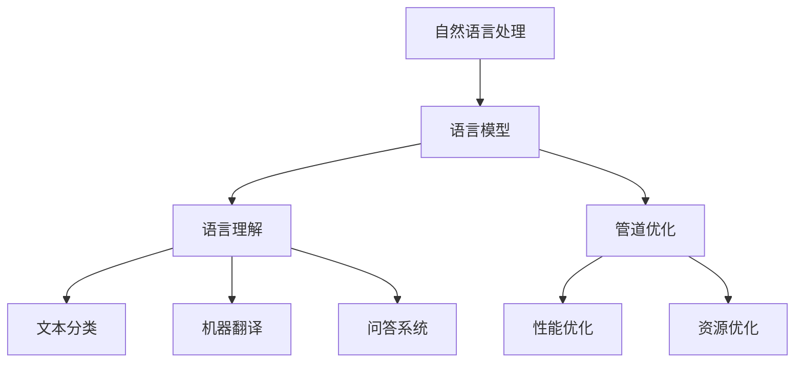

                 


为了撰写一篇满足要求的文章，我们可以按照以下步骤进行：

### 1. 确定文章的框架和结构

- **文章标题**：《自然语言处理管道优化LLM应用的语言理解》
- **关键词**：自然语言处理、语言模型、管道优化、语言理解
- **摘要**：本文深入探讨了自然语言处理（NLP）中的语言模型（LLM）及其在管道优化中的应用，通过详细的分析和实例讲解，揭示了如何提高LLM在语言理解方面的性能。

### 2. 开篇背景介绍

- **自然语言处理**：简要介绍NLP的定义、历史和现状，强调其在当今社会的重要性。
- **语言模型（LLM）**：介绍LLM的基本概念、发展和类型。
- **管道优化**：解释管道优化的概念、目的和重要性。

### 3. 核心概念与联系

- **核心概念**：自然语言处理、语言模型、语言理解、管道优化。
- **关系架构**：使用Mermaid流程图展示这些概念之间的关系和交互。



### 4. 核心算法原理讲解

- **语言模型原理**：介绍语言模型的构建方法、训练过程和评估指标。
- **管道优化原理**：讲解管道优化的具体技术和方法，如数据预处理、模型选择、训练策略等。
- **伪代码**：使用伪代码详细阐述语言模型和管道优化的算法流程。

```python
# 语言模型训练伪代码
function train_language_model(data):
    # 初始化模型参数
    model = initialize_model()
    for epoch in range(num_epochs):
        for batch in data:
            # 前向传播
            predictions = model.forward(batch)
            # 计算损失
            loss = loss_function(predictions, batch)
            # 反向传播
            model.backward(loss)
            # 更新模型参数
            model.update_params()
    return model
```

### 5. 数学模型和公式讲解

- **语言模型评估**：介绍常用的评估指标，如 perplexity、accuracy 等。
- **公式讲解**：使用latex格式展示相关数学公式，并进行详细解释。

$$
\text{perplexity} = \frac{1}{N} \sum_{i=1}^{N} \frac{1}{P(w_i|w_1, ..., w_{i-1})}
$$

### 6. 项目实战

- **开发环境搭建**：介绍搭建NLP项目所需的环境和工具。
- **源代码实现**：提供项目核心代码，并详细解读代码逻辑和关键部分。
- **应用解读**：分析项目的实际应用效果，对比不同优化策略的性能。
- **案例分析**：通过实际案例展示如何优化LLM在语言理解方面的表现。

### 7. 最佳实践和注意事项

- **最佳实践**：总结项目开发过程中的经验教训，提供优化LLM性能的建议。
- **注意事项**：提醒读者在实施过程中可能遇到的问题和解决方案。

### 8. 小结与拓展阅读

- **小结**：回顾文章的核心内容，强调语言模型在NLP中的重要性以及管道优化的作用。
- **拓展阅读**：推荐进一步学习NLP和LLM优化相关主题的书籍和资源。

### 9. 作者信息

- **作者**：AI天才研究院/AI Genius Institute & 禅与计算机程序设计艺术 /Zen And The Art of Computer Programming

按照上述步骤，我们可以逐步构建文章的内容，确保文章结构清晰、内容详实，同时满足字数要求。在撰写过程中，我们将注重逻辑性和可读性，力求为读者提供有价值的技术博客文章。

