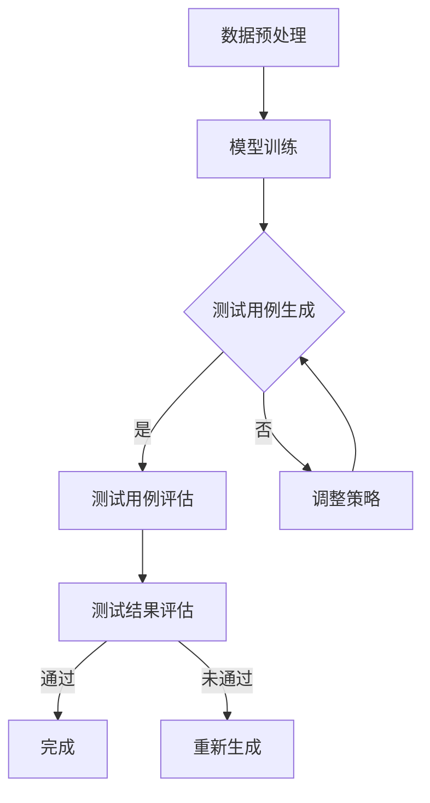
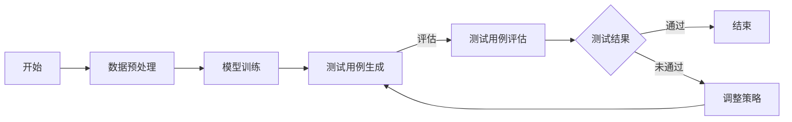
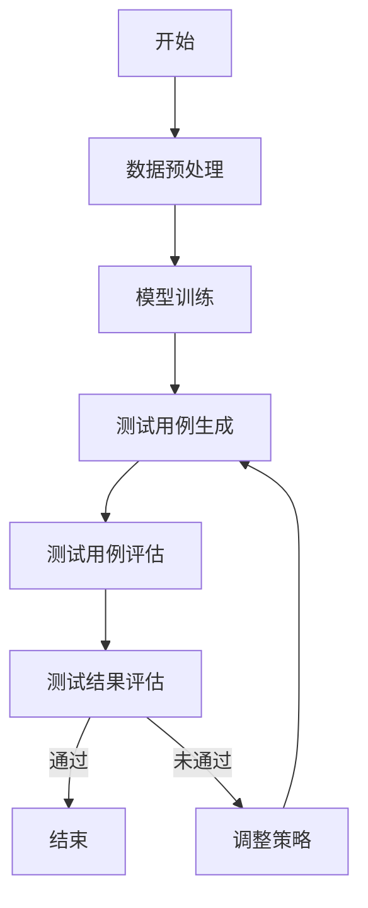

                 

### 文章标题：《自适应测试用例生成：全面覆盖模型能力》

关键词：自适应测试用例生成、模型能力评估、测试用例覆盖度、核心算法原理、人工智能

摘要：本文全面探讨了自适应测试用例生成这一领域，从背景、核心概念、算法原理、模型能力评估、项目实战到未来展望，系统阐述了如何通过自适应测试用例生成技术实现全面覆盖模型能力。通过分析不同算法原理、应用场景及其优势，本文为读者提供了一个深入理解与实际操作的指南。

----------------------------------------------------------------

#### 第1章：自适应测试用例生成的背景

随着人工智能技术的发展，深度学习模型在各个领域的应用越来越广泛。这些模型在图像识别、自然语言处理、推荐系统等方面取得了显著的成果。然而，深度学习模型具有高度的非线性性和复杂性，传统的测试用例生成方法难以全面覆盖模型的能力，导致测试结果的可靠性和完整性难以保证。

自适应测试用例生成技术应运而生。它通过智能算法，根据模型的特性动态生成测试用例，旨在提高测试覆盖率，提升测试质量，从而保障深度学习模型在实际应用中的稳定性和可靠性。

自适应测试用例生成的研究背景可以追溯到20世纪90年代，随着软件测试领域的发展，人们开始意识到传统测试方法的局限性。进入21世纪，随着机器学习和深度学习技术的迅速发展，自适应测试用例生成技术逐渐成为研究热点。目前，该领域的研究主要集中在基于统计、机器学习和智能优化算法的测试用例生成方法，以及如何评估和提升模型的能力。

本章将首先介绍自适应测试用例生成的基本概念和定义，然后回顾传统测试用例生成方法，分析其局限性，并阐述自适应测试用例生成的重要性和必要性。接着，我们将介绍自适应测试用例生成的发展历程和研究现状，为后续章节的内容奠定基础。

#### 第2章：自适应测试用例生成的基本概念

##### 测试用例

测试用例（Test Case）是软件测试过程中的基本单元，它描述了如何测试软件系统的一个特定部分，以及预期的测试结果。一个良好的测试用例应具备以下几个特点：

1. **准确性**：测试用例必须准确地描述要测试的功能或缺陷。
2. **可重复性**：在相同的环境和条件下，测试用例可以重复执行并得到一致的结果。
3. **完整性**：测试用例应覆盖软件系统的所有功能或缺陷。
4. **可理解性**：测试用例应便于测试人员理解和执行。

##### 测试用例生成

测试用例生成（Test Case Generation）是指从软件系统或其部分中提取信息，并利用这些信息生成测试用例的过程。传统的测试用例生成方法主要包括手动编写和自动化生成两种方式。

1. **手动编写**：测试人员根据对软件系统的理解和需求规格说明书，手动编写测试用例。
2. **自动化生成**：利用软件工具或算法，自动生成测试用例。

##### 自适应测试用例生成

自适应测试用例生成（Adaptive Test Case Generation）是一种基于智能算法的测试用例生成方法，它根据模型的特性动态生成测试用例，以提高测试覆盖率和测试质量。与传统的测试用例生成方法相比，自适应测试用例生成具有以下几个特点：

1. **动态性**：自适应测试用例生成能够根据模型的动态变化生成相应的测试用例。
2. **智能性**：自适应测试用例生成利用智能算法，如机器学习、统计分析和智能优化，自动生成测试用例。
3. **高效性**：自适应测试用例生成能够快速生成大量高覆盖率的测试用例。

##### 自适应测试用例生成与传统测试用例生成方法的区别

1. **生成方式**：传统测试用例生成主要依赖于人工经验和现有的测试用例库，而自适应测试用例生成则利用智能算法，自动生成测试用例。
2. **覆盖范围**：传统测试用例生成难以全面覆盖软件系统的所有功能，而自适应测试用例生成能够根据模型的特性动态调整测试用例，实现更全面的覆盖。
3. **测试效率**：传统测试用例生成过程耗时较长，而自适应测试用例生成能够快速生成测试用例，提高测试效率。

通过对比可以发现，自适应测试用例生成技术在测试效率、覆盖范围和测试质量方面具有显著优势。因此，在实际应用中，自适应测试用例生成方法越来越受到重视。

#### 第3章：传统测试用例生成方法及其局限性

传统测试用例生成方法主要包括以下几种：

1. **手动编写**：测试人员根据对软件系统的理解和需求规格说明书，手动编写测试用例。这种方法的主要优点是测试用例的编写过程可控，测试用例的准确性和可重复性较高。然而，其缺点也是明显的：测试用例的编写过程耗时较长，测试用例的数量和覆盖范围有限，难以全面覆盖软件系统的所有功能。

2. **自动化生成**：利用软件工具或算法，自动生成测试用例。这种方法的主要优点是能够快速生成大量测试用例，提高测试效率。然而，其缺点也是明显的：自动化生成的测试用例可能无法全面覆盖软件系统的所有功能，测试用例的质量难以保证。

总的来说，传统测试用例生成方法的局限性主要体现在以下几个方面：

1. **覆盖范围有限**：传统测试用例生成方法难以全面覆盖软件系统的所有功能，特别是在软件系统复杂性较高时，测试用例的编写难度更大，覆盖范围更有限。

2. **测试效率低**：传统测试用例生成方法耗时较长，特别是在手动编写测试用例的情况下，测试用例的编写速度较慢，难以满足快速迭代开发的需要。

3. **测试质量难以保证**：传统测试用例生成方法生成的测试用例质量难以保证，特别是在自动化生成测试用例的情况下，测试用例可能存在遗漏或错误，导致测试结果不可靠。

因此，为了解决传统测试用例生成方法的局限性，需要引入新的方法，如自适应测试用例生成技术，以提高测试覆盖率和测试质量。

#### 第4章：自适应测试用例生成的重要性与必要性

在人工智能（AI）和深度学习（DL）迅猛发展的背景下，自适应测试用例生成技术的重要性愈发凸显。深度学习模型以其强大的学习和适应能力，在图像识别、自然语言处理、推荐系统等多个领域取得了突破性进展。然而，这些模型的高度非线性和复杂性，使得传统测试方法难以全面覆盖其能力，导致测试结果的可靠性和完整性难以保证。

首先，自适应测试用例生成技术能够动态地适应深度学习模型的特性，生成具有高覆盖率的测试用例，从而提高测试的全面性和准确性。传统的测试方法往往依赖于经验丰富的测试工程师手动编写测试用例，这种方法不仅耗时且难以覆盖所有可能的输入情况。而自适应测试用例生成通过智能算法，如机器学习、统计分析和优化算法，可以自动生成大量高相关性的测试用例，大幅提升测试效率。

其次，深度学习模型的迭代速度快，新版本不断推出，传统测试方法难以跟上这种快速迭代的节奏。自适应测试用例生成技术能够根据模型的最新版本动态调整测试用例，确保每次迭代都能得到有效的测试覆盖，从而提高测试的持续性和稳定性。

此外，自适应测试用例生成在提高测试质量方面也具有显著优势。传统测试方法可能因为测试用例不足或编写不当，导致测试覆盖不全面，从而影响测试结果的可靠性。自适应测试用例生成通过智能算法，可以确保生成的测试用例既全面又具有针对性，从而提高测试的质量。

综上所述，自适应测试用例生成在深度学习模型测试中具有不可替代的重要性。它不仅能够提高测试覆盖率和测试效率，还能够确保测试结果的可靠性和完整性，为深度学习模型在实际应用中的稳定性和可靠性提供有力保障。因此，深入研究并应用自适应测试用例生成技术，是当前人工智能和深度学习领域面临的一项重要任务。

#### 第5章：自适应测试用例生成的发展历程与研究现状

自适应测试用例生成技术作为人工智能和软件测试领域的前沿研究方向，其发展历程可以追溯到20世纪90年代。当时，随着软件系统复杂性的增加，传统的测试方法逐渐暴露出覆盖不足、效率低下等问题。为了应对这些挑战，研究人员开始探索智能化的测试用例生成方法。

##### 5.1 发展历程

1. **早期探索**（1990s-2000s）：在这个阶段，研究人员主要关注如何利用人工智能技术，如遗传算法和模拟退火算法，来辅助生成测试用例。这些方法通过优化过程，自动生成具有高覆盖率的测试用例，但受限于计算能力和算法复杂性，其应用范围有限。

2. **机器学习时代**（2000s-2010s）：随着机器学习技术的发展，研究人员开始利用机器学习模型来自动生成测试用例。例如，基于决策树、支持向量机和神经网络等模型，通过学习已有的测试用例数据，生成新的测试用例。这一时期，自适应测试用例生成技术开始逐渐得到关注。

3. **深度学习时代**（2010s至今）：深度学习技术的发展为自适应测试用例生成带来了新的契机。深度神经网络强大的学习能力和表达能力，使其在生成复杂、多样化的测试用例方面表现出色。当前，基于深度学习的自适应测试用例生成方法已经成为研究热点。

##### 5.2 研究现状

目前，自适应测试用例生成技术的研究主要集中在以下几个方面：

1. **算法研究**：研究人员致力于开发新的算法，以提升自适应测试用例生成的效率和覆盖率。例如，基于强化学习的测试用例生成方法，通过不断试错和反馈调整，生成最优的测试用例集合。

2. **应用场景**：自适应测试用例生成技术在不同领域的应用也日益广泛。例如，在自动驾驶、医疗诊断、金融风控等高复杂度领域，自适应测试用例生成技术被用于提升模型的安全性和可靠性。

3. **工具开发**：为了方便实际应用，研究人员正在开发一系列自适应测试用例生成工具。这些工具集成了多种算法，提供了图形化界面，用户可以方便地配置测试参数，生成和管理测试用例。

4. **标准化**：随着自适应测试用例生成技术的普及，标准化工作也逐步展开。国际标准组织和专业机构正在制定相关标准和指南，以规范自适应测试用例生成的方法和流程。

总之，自适应测试用例生成技术已经成为人工智能和软件测试领域的重要研究方向。随着算法的进步和应用的拓展，它将在提高测试效率、保障模型可靠性和推动技术进步方面发挥重要作用。

#### 第6章：自适应测试用例生成的研究现状与未来挑战

随着人工智能和深度学习技术的飞速发展，自适应测试用例生成技术也在不断演进，成为保障深度学习模型可靠性和安全性的重要手段。目前，该领域的研究取得了显著进展，但也面临着一系列挑战。

##### 6.1 研究现状

1. **算法多样化**：当前，自适应测试用例生成方法主要包括基于统计、机器学习和深度学习的多种算法。基于统计的方法如随机测试、等价类划分等，通过分析程序结构生成测试用例；机器学习方法如决策树、支持向量机和神经网络等，利用已有测试数据自动生成新测试用例；深度学习方法如卷积神经网络（CNN）和循环神经网络（RNN）等，通过学习复杂的数据特征生成高效测试用例。

2. **应用广泛**：自适应测试用例生成技术已在多个领域得到应用。例如，在自动驾驶领域，通过生成高覆盖率的测试用例，确保车辆在复杂环境中的安全行驶；在金融风控领域，自适应测试用例生成技术用于检测金融欺诈行为，提高系统的抗风险能力。

3. **工具与平台**：为了方便实际应用，研究人员开发了多种自适应测试用例生成工具和平台。例如，基于Python的`pytest`和`unittest`等库，提供了丰富的测试用例生成功能；基于深度学习的测试平台如`TensorFlow`和`PyTorch`，支持自动生成测试用例。

##### 6.2 未来挑战

1. **计算资源需求**：深度学习和神经网络等方法虽然能够在一定程度上提高测试用例的生成效率和覆盖率，但往往需要大量的计算资源。对于大规模模型和复杂场景，计算资源的需求可能成为制约自适应测试用例生成技术广泛应用的主要因素。

2. **数据依赖性**：自适应测试用例生成方法，特别是基于机器学习和深度学习的方法，高度依赖训练数据的质量和数量。数据缺乏或者数据质量差，可能导致生成的测试用例不全面或存在偏差，从而影响测试效果。

3. **解释性需求**：深度学习模型由于其复杂的内部结构和高度的非线性特性，生成的测试用例往往缺乏解释性。这在某些对测试用例解释性要求较高的场景中，可能成为一个挑战。例如，在医疗诊断和金融风险管理等领域，测试用例的解释性对于验证测试结果的合理性至关重要。

4. **实时性要求**：在某些实时性要求较高的场景中，如自动驾驶和实时监控系统，自适应测试用例生成需要在短时间内生成并执行大量的测试用例，这对算法的效率和实时性提出了更高的要求。

5. **标准化与规范化**：目前，自适应测试用例生成技术尚未形成统一的标准和规范，不同方法和技术之间的兼容性和互操作性较差。这限制了其在实际应用中的推广和普及。

##### 6.3 未来发展方向

1. **算法优化**：研究人员将继续探索新的算法，以提升自适应测试用例生成方法的效率和覆盖率。例如，结合多种算法的混合方法，可能成为未来研究的方向。

2. **数据增强**：通过数据增强技术，如生成对抗网络（GAN）和合成数据生成方法，提高训练数据的质量和多样性，从而提升测试用例的生成效果。

3. **模型解释性**：开发更加透明和可解释的深度学习模型，使其生成的测试用例具有更好的解释性，满足不同场景的需求。

4. **实时性提升**：研究高效且实时的测试用例生成方法，以满足高实时性场景的需求。

5. **标准化与规范化**：制定统一的标准和规范，促进自适应测试用例生成技术的推广应用。

总之，自适应测试用例生成技术在当前面临许多挑战，但同时也蕴含着巨大的潜力。随着技术的不断进步，我们有理由相信，自适应测试用例生成将在保障深度学习模型可靠性和安全性方面发挥越来越重要的作用。

### 第7章：自适应测试用例生成的研究方法与技术

自适应测试用例生成技术涵盖了多种研究方法和技术，每种方法都有其独特的原理和应用场景。本节将详细介绍三种主要方法：基于统计的生成方法、基于机器学习的生成方法和基于智能优化算法的生成方法，并分析其优缺点。

#### 7.1 基于统计的生成方法

##### 基本原理

基于统计的测试用例生成方法主要通过分析程序代码或输入数据的统计特性，生成具有高覆盖率的测试用例。该方法主要包括以下几种技术：

1. **随机测试**：随机选择输入数据或路径，生成测试用例。这种方法简单有效，但可能导致测试用例的重复和覆盖不足。
2. **等价类划分**：根据输入数据的特性，将所有可能的输入值划分为若干个等价类，然后从每个等价类中随机选择测试数据。这种方法能够提高测试覆盖率，但可能产生大量的冗余测试用例。
3. **边界值分析**：分析输入数据的边界条件，生成覆盖边界值的测试用例。这种方法能够确保测试用例覆盖程序的关键区域，但可能忽略其他重要的路径。

##### 优缺点

优点：
- **简单易行**：基于统计的生成方法不需要复杂的计算，实现起来相对简单。
- **高效性**：能够在较短的时间内生成大量测试用例，提高测试效率。

缺点：
- **覆盖不足**：传统方法可能无法全面覆盖程序的各个部分，特别是对于复杂的程序结构。
- **冗余测试**：等价类划分和边界值分析等方法可能会生成大量的冗余测试用例，增加测试的工作量。

##### 应用场景

基于统计的生成方法适用于对测试覆盖率要求不高，但对测试效率有较高要求的场景。例如，在软件开发的初期阶段，用于快速生成测试用例进行初步测试。

#### 7.2 基于机器学习的生成方法

##### 基本原理

基于机器学习的测试用例生成方法利用机器学习模型，根据已知的测试用例数据自动生成新的测试用例。常见的方法包括：

1. **决策树**：通过学习测试用例的特征，构建决策树模型，根据模型的预测生成新的测试用例。
2. **支持向量机**（SVM）：利用SVM模型，通过分类已有的测试用例，生成新的测试用例。
3. **神经网络**：利用深度学习模型，如卷积神经网络（CNN）和循环神经网络（RNN），学习测试用例的复杂特征，生成新的测试用例。

##### 优缺点

优点：
- **高覆盖率**：基于机器学习的生成方法能够从大量的测试数据中学习到复杂的模式，生成高覆盖率的测试用例。
- **自适应能力**：机器学习模型能够根据测试数据的动态变化，自适应调整测试用例的生成策略。

缺点：
- **计算资源需求高**：机器学习模型的训练和推理过程需要大量的计算资源，特别是在处理大规模数据时。
- **数据依赖性**：测试用例的生成高度依赖训练数据的质量和数量，数据不足或质量差可能导致测试用例的生成效果不佳。

##### 应用场景

基于机器学习的生成方法适用于对测试覆盖率有较高要求的场景，如复杂的软件系统、深度学习模型等。该方法特别适合在迭代开发过程中，根据新的测试数据动态生成测试用例。

#### 7.3 基于智能优化算法的生成方法

##### 基本原理

基于智能优化算法的测试用例生成方法利用优化算法，如遗传算法、模拟退火算法和粒子群优化算法等，通过迭代过程搜索最优的测试用例。该方法主要包括以下步骤：

1. **编码**：将测试用例编码为染色体，表示为一个序列。
2. **初始化**：随机生成一定数量的初始染色体。
3. **适应度函数**：定义适应度函数，用于评估染色体的优劣，通常基于测试用例的覆盖率。
4. **迭代优化**：通过选择、交叉、变异等操作，迭代优化染色体的质量，生成新的测试用例。

##### 优缺点

优点：
- **全局优化**：智能优化算法能够全局搜索最优解，避免陷入局部最优。
- **灵活性高**：优化算法能够根据问题的特性灵活调整，适用于不同的测试用例生成场景。

缺点：
- **计算复杂度高**：优化算法的迭代过程需要大量计算，特别是在处理大规模问题时。
- **对初始解的依赖性**：优化算法的初始解对最终结果有较大影响，需要精心设计初始解的生成策略。

##### 应用场景

基于智能优化算法的生成方法适用于需要高覆盖率且具有复杂结构的测试用例生成场景。例如，在自动化测试领域，用于生成复杂的测试用例集合，确保软件系统的全面测试。

#### 7.4 比较与分析

基于统计、机器学习和智能优化算法的测试用例生成方法各有优缺点，适用于不同的应用场景。在实际应用中，可以根据具体需求选择合适的方法。

- **简单高效**：基于统计的方法适用于对测试效率有较高要求但覆盖率要求不高的场景。
- **高覆盖率和自适应能力**：基于机器学习的方法适用于需要高覆盖率和动态调整测试用例的场景。
- **全局优化和高灵活性**：基于智能优化算法的方法适用于需要高覆盖率和复杂结构测试用例的场景。

总之，自适应测试用例生成技术的发展，为提高测试效率、覆盖率和质量提供了强有力的支持。随着技术的不断进步，未来将会有更多高效、智能的测试用例生成方法出现，为深度学习模型和复杂软件系统的测试提供更可靠的保障。

### 第8章：基于统计的测试用例生成算法

基于统计的测试用例生成算法通过分析程序代码或输入数据的统计特性，生成具有高覆盖率的测试用例。这类算法主要包括随机测试、等价类划分和边界值分析等方法。下面将详细介绍这些算法的原理、伪代码及具体应用。

#### 8.1 随机测试

##### 原理

随机测试是一种最简单的统计测试用例生成方法，通过随机选择输入数据或路径，生成测试用例。该方法能够确保测试用例的随机性，从而在一定程度上提高测试覆盖率。

##### 伪代码

```plaintext
输入：程序P，输入域I
输出：测试用例集合T

T = ∅
for i = 1 to n do
    输入一个随机值x ∈ I
    执行程序P，记录结果r
    如果 r ≠ 预期结果 then
        将x添加到T
    end if
end for
return T
```

##### 应用

随机测试适用于对测试效率有较高要求但覆盖率要求不高的场景，例如在软件开发的初期阶段，用于生成初步的测试用例。然而，由于随机性可能导致大量冗余测试用例的产生，因此该方法通常与其他方法结合使用。

#### 8.2 等价类划分

##### 原理

等价类划分是一种基于输入数据特性的测试用例生成方法，通过将所有可能的输入值划分为若干个等价类，然后从每个等价类中随机选择测试数据，生成测试用例。这种方法能够有效减少冗余测试用例，提高测试覆盖率。

##### 伪代码

```plaintext
输入：程序P，输入域I
输出：测试用例集合T

T = ∅
for each equivalence class Ec in I do
    输入一个随机值x ∈ Ec
    执行程序P，记录结果r
    如果 r ≠ 预期结果 then
        将x添加到T
    end if
end for
return T
```

##### 应用

等价类划分适用于对测试覆盖率有较高要求的场景，例如在软件测试的迭代阶段，用于生成新的测试用例。然而，由于等价类划分可能产生大量的冗余测试用例，因此该方法通常与其他方法结合使用，以实现最优的测试覆盖率。

#### 8.3 边界值分析

##### 原理

边界值分析是一种基于输入数据边界条件的测试用例生成方法，通过分析输入数据的边界条件，生成覆盖边界值的测试用例。这种方法能够确保测试用例覆盖程序的关键区域，从而提高测试覆盖率。

##### 伪代码

```plaintext
输入：程序P，输入域I
输出：测试用例集合T

T = ∅
for each boundary condition bc in I do
    输入一个边界值x ∈ bc
    执行程序P，记录结果r
    如果 r ≠ 预期结果 then
        将x添加到T
    end if
end for
return T
```

##### 应用

边界值分析适用于对测试覆盖率有较高要求的场景，例如在关键功能验证阶段，用于生成覆盖关键边界条件的测试用例。由于边界值分析能够确保测试用例覆盖程序的关键区域，因此该方法在软件测试过程中具有重要的应用价值。

#### 8.4 综合应用

在实际应用中，单一方法往往难以满足测试覆盖率的要求，因此常将多种方法结合使用。例如，可以先进行随机测试，生成初步的测试用例，然后利用等价类划分和边界值分析，进一步优化测试用例集合。

```plaintext
输入：程序P，输入域I
输出：测试用例集合T

T = 随机测试（P，I）
T = 等价类划分（T，I）
T = 边界值分析（T，I）
return T
```

通过综合应用多种统计测试用例生成方法，可以实现最优的测试覆盖率，从而提高测试效率和质量。

### 第9章：基于机器学习的测试用例生成算法

基于机器学习的测试用例生成算法通过学习已有的测试用例数据，自动生成新的测试用例，以提高测试覆盖率和效率。这类算法利用机器学习模型的强大学习能力，可以捕捉到复杂的输入-输出关系，从而生成更具有代表性的测试用例。

#### 9.1 基本原理

基于机器学习的测试用例生成算法主要包括以下步骤：

1. **数据预处理**：对已有的测试用例数据进行预处理，包括数据清洗、归一化和特征提取等。预处理过程旨在去除噪声数据，提高数据质量，并提取关键特征。
2. **模型训练**：利用预处理后的数据集，训练机器学习模型。常见的模型包括决策树、支持向量机（SVM）、神经网络等。模型训练的目标是学习输入与输出之间的映射关系，以便在新的测试场景中生成有效的测试用例。
3. **测试用例生成**：使用训练好的模型，对新输入数据进行分析和预测，生成新的测试用例。生成的测试用例旨在覆盖模型中尚未覆盖到的区域，提高测试覆盖率。

#### 9.2 常见算法

1. **决策树**

   决策树是一种常见的机器学习算法，通过构建决策树模型，将输入数据划分为不同的区域，从而生成测试用例。决策树的优点是易于理解和解释，但缺点是对于高维数据的处理能力较差。

   ```plaintext
   输入：测试数据集D，特征集合F
   输出：测试用例集合T
   
   T = ∅
   for each feature f in F do
       构建决策树模型M_f
       for each 叶子节点n in M_f do
           输入数据x ∈ n的区域
           执行模型M_f，预测输出结果y
           如果 y ≠ 预期结果 then
               将x添加到T
           end if
       end for
   end for
   return T
   ```

2. **支持向量机（SVM）**

   支持向量机是一种强大的分类和回归模型，通过寻找最佳的超平面，将不同类别的数据点进行分类。在测试用例生成中，SVM可以用来区分有效测试用例和无效测试用例。

   ```plaintext
   输入：测试数据集D，特征集合F
   输出：测试用例集合T
   
   T = ∅
   训练SVM模型M
   for each 测试用例x in D do
       如果 M.predict(x) ≠ 预期结果 then
           将x添加到T
       end if
   end for
   return T
   ```

3. **神经网络**

   神经网络是一种强大的机器学习模型，通过多层神经网络，可以学习复杂的输入-输出关系。在测试用例生成中，神经网络可以用来预测哪些输入数据会导致系统出错。

   ```plaintext
   输入：测试数据集D，特征集合F
   输出：测试用例集合T
   
   T = ∅
   训练神经网络模型M
   for each 测试用例x in D do
       输入神经网络M，记录输出结果y
       如果 y ≠ 预期结果 then
           将x添加到T
       end if
   end for
   return T
   ```

#### 9.3 案例分析

以神经网络为例，假设我们有一个深度学习模型，用于分类图像。我们可以利用已有的测试数据集，训练一个神经网络模型，然后使用该模型生成新的测试用例，以提高测试覆盖率。

1. **数据预处理**：对图像数据进行归一化和特征提取，提取关键特征。
2. **模型训练**：利用预处理后的数据集，训练神经网络模型，使其能够准确分类图像。
3. **测试用例生成**：使用训练好的神经网络模型，对新的图像数据进行分类，如果分类结果与预期不符，则生成新的测试用例。

通过上述步骤，我们可以利用神经网络模型自动生成新的测试用例，从而提高测试覆盖率，确保深度学习模型的稳定性和可靠性。

### 第10章：基于智能优化算法的测试用例生成算法

基于智能优化算法的测试用例生成算法利用模拟自然界中的智能行为，如遗传算法、模拟退火算法和粒子群优化算法等，通过迭代过程搜索最优的测试用例。这些算法能够在复杂的搜索空间中找到具有高覆盖率的测试用例，从而提高测试效率和覆盖率。

#### 10.1 基本原理

基于智能优化算法的测试用例生成算法主要包括以下步骤：

1. **编码**：将测试用例编码为染色体，表示为一个序列。染色体的每一位代表测试用例中的一个特定值或操作。
2. **初始化**：随机生成一定数量的初始染色体，作为初始解。
3. **适应度函数**：定义适应度函数，用于评估染色体的优劣，通常基于测试用例的覆盖率。适应度函数的值越高，表示染色体代表的测试用例覆盖范围越广。
4. **迭代优化**：通过选择、交叉、变异等操作，迭代优化染色体的质量。选择操作根据适应度函数选择优秀的染色体作为父代；交叉操作通过组合两个父代的基因生成新的子代；变异操作通过随机改变染色体的一部分，增加搜索空间。

#### 10.2 常见算法

1. **遗传算法**

   遗传算法是一种基于自然选择和遗传机制优化问题的算法。在测试用例生成中，遗传算法通过交叉、变异和选择等操作，不断迭代优化测试用例。

   ```plaintext
   输入：测试数据集D，适应度函数f，交叉概率pc，变异概率pm
   输出：最优测试用例集合T
   
   初始化：生成初始染色体种群P
   while 未达到终止条件 do
       适应度评估：计算种群P中每个染色体的适应度值
       选择：根据适应度值选择优秀的染色体组成新的种群
       交叉：对选中的染色体进行交叉操作，生成新的子代
       变异：对子代进行变异操作
       更新种群：将交叉和变异后的子代与原有种群合并，形成新的种群
   end while
   
   T = 选择最优的染色体代表的测试用例集合
   return T
   ```

2. **模拟退火算法**

   模拟退火算法是一种基于固体退火过程的优化算法。在测试用例生成中，模拟退火算法通过逐渐降低温度，避免陷入局部最优，寻找全局最优解。

   ```plaintext
   输入：测试数据集D，适应度函数f，初始温度T0，降温率α
   输出：最优测试用例集合T
   
   初始化：生成初始染色体
   T = T0
   while T > 终止温度 do
       适应度评估：计算当前染色体的适应度值
       如果 新染色体适应度值 > 当前染色体适应度值 then
           接受新染色体
       else
           以概率 exp((当前染色体适应度值 - 新染色体适应度值) / T) 接受新染色体
       end if
       T = T * α
   end while
   
   T = 当前最优染色体代表的测试用例集合
   return T
   ```

3. **粒子群优化算法**

   粒子群优化算法是一种基于群体智能的优化算法。在测试用例生成中，粒子群优化算法通过模拟鸟群觅食行为，寻找最优的测试用例。

   ```plaintext
   输入：测试数据集D，适应度函数f，最大迭代次数iter_max，惯性权重ω，认知权重ξ，社会权重η
   输出：最优测试用例集合T
   
   初始化：生成初始粒子群P
   for each 粒子i in P do
       计算粒子i的适应度值
       p_best_i = 粒子i的最佳位置
       g_best = 全局最佳位置
   end for
   
   for i = 1 to iter_max do
       for each 粒子i in P do
           计算粒子的速度v_i和位置x_i
           适应度评估：计算粒子i的适应度值
           如果 新位置x_i 的适应度值 > 当前位置x_i 的适应度值 then
               p_best_i = 新位置x_i
               如果 新位置x_i 的适应度值 > g_best 的适应度值 then
                   g_best = 新位置x_i
           end if
       end for
   end for
   
   T = g_best 代表的最优测试用例集合
   return T
   ```

#### 10.3 案例分析

以遗传算法为例，假设我们需要为某复杂软件系统生成高覆盖率的测试用例。首先，将测试用例编码为染色体，每个染色体代表一组测试数据。然后，定义适应度函数，根据测试用例的覆盖率评估染色体的优劣。通过交叉、变异和选择操作，不断迭代优化测试用例集合，最终找到最优的测试用例集合，以提高测试效率和覆盖率。

- **编码**：将测试用例编码为二进制序列，每一位代表一个测试数据的取值。
- **适应度函数**：根据测试用例的覆盖率计算染色体的适应度值，覆盖率越高，适应度值越高。
- **迭代优化**：通过遗传算法的交叉、变异和选择操作，不断迭代优化测试用例集合，找到最优的测试用例集合。

通过上述步骤，遗传算法能够自动生成高覆盖率的测试用例，从而提高测试效率和覆盖率，确保软件系统的稳定性和可靠性。

### 第11章：测试用例覆盖度评估

测试用例覆盖度评估是自适应测试用例生成中至关重要的一环。其目的是评估生成的测试用例是否能够全面覆盖模型的能力，从而确保测试的全面性和可靠性。本章节将详细介绍几种常见的测试用例覆盖度评估方法，并分析它们的优缺点。

#### 11.1 代码覆盖度评估

代码覆盖度评估是一种最基本的覆盖度评估方法，通过统计代码中各个部分的执行情况，评估测试用例的覆盖率。常见的代码覆盖度评估方法包括：

1. **语句覆盖**：确保每条语句至少执行一次。
2. **分支覆盖**：确保每个分支至少执行一次。
3. **路径覆盖**：确保所有可能的程序路径至少执行一次。

##### 优点

- **直观**：代码覆盖度评估方法简单直观，易于理解和实现。
- **高效**：计算速度快，适合大规模代码的覆盖度评估。

##### 缺点

- **低效性**：只关注代码层面的覆盖，可能忽略了部分业务逻辑。
- **无法检测逻辑错误**：无法评估代码逻辑的正确性。

##### 适用场景

代码覆盖度评估适用于对代码执行情况进行基本评估的场景，如代码审查和单元测试。

#### 11.2 功能覆盖度评估

功能覆盖度评估通过评估测试用例对系统功能的覆盖情况，确保测试用例能够全面覆盖系统的功能需求。常见的功能覆盖度评估方法包括：

1. **等价类划分**：根据输入数据的特性，将所有可能的输入值划分为若干个等价类，确保每个等价类至少被测试一次。
2. **边界值分析**：分析输入数据的边界条件，确保测试用例覆盖所有边界值。
3. **场景覆盖**：根据业务场景，确保测试用例覆盖所有的业务流程。

##### 优点

- **全面性**：功能覆盖度评估方法能够全面覆盖系统功能，确保测试用例的全面性。
- **业务相关性**：评估结果与业务需求密切相关，有助于发现业务逻辑上的错误。

##### 缺点

- **复杂度**：功能覆盖度评估方法较为复杂，需要深入理解业务逻辑。
- **实现难度**：评估方法的实现难度较大，特别是在处理复杂业务逻辑时。

##### 适用场景

功能覆盖度评估适用于对系统功能有较高要求的场景，如集成测试和系统测试。

#### 11.3 图形覆盖度评估

图形覆盖度评估通过图形化的方法，评估测试用例的覆盖率。常见的图形覆盖度评估方法包括：

1. **控制流图**：通过控制流图，展示程序中各部分的执行情况，评估测试用例的覆盖率。
2. **数据流图**：通过数据流图，展示程序中数据在各部分之间的流动情况，评估测试用例的覆盖率。

##### 优点

- **可视化**：图形覆盖度评估方法具有直观的图形化界面，便于理解和分析。
- **易于解释**：评估结果易于解释，有助于发现潜在的错误。

##### 缺点

- **实现复杂**：图形覆盖度评估方法的实现较为复杂，需要专业知识。
- **性能开销**：图形化界面可能引入性能开销，影响测试执行速度。

##### 适用场景

图形覆盖度评估适用于需要图形化展示和易于解释的场景，如代码审查和复杂系统的测试。

#### 11.4 综合评估方法

在实际应用中，单一覆盖度评估方法往往难以满足全面覆盖的需求。因此，常常将多种覆盖度评估方法结合使用，实现更全面的覆盖度评估。例如，可以结合代码覆盖度评估和功能覆盖度评估，从多个角度确保测试用例的全面性。

##### 优点

- **全面性**：综合评估方法能够从多个角度确保测试用例的全面覆盖。
- **互补性**：不同评估方法相互补充，提高评估的准确性。

##### 缺点

- **复杂性**：综合评估方法较为复杂，需要更多的资源和时间。
- **实现难度**：不同评估方法的整合实现难度较大。

##### 适用场景

综合评估方法适用于需要全面覆盖且具有复杂结构的测试场景，如大型软件系统和深度学习模型的测试。

### 第12章：测试用例覆盖度评估方法的比较与分析

为了全面了解不同测试用例覆盖度评估方法的优缺点，本节将对语句覆盖、分支覆盖、功能覆盖、场景覆盖和控制流图等常见方法进行比较与分析。

#### 12.1 语句覆盖

**优点**：
- **简单直观**：语句覆盖评估方法最简单直观，易于理解和实现。
- **易于计算**：只需统计每条语句是否执行，计算过程简单。

**缺点**：
- **低效性**：仅关注代码层面的执行情况，可能忽略业务逻辑。
- **无法检测逻辑错误**：无法评估代码逻辑的正确性。

**适用场景**：适用于对代码执行情况进行基本评估的场景，如代码审查和单元测试。

#### 12.2 分支覆盖

**优点**：
- **全面性**：确保每个分支至少执行一次，提高测试覆盖率。
- **识别逻辑错误**：有助于发现代码中的逻辑错误。

**缺点**：
- **计算复杂**：相对于语句覆盖，分支覆盖的计算复杂度更高。
- **无法检测条件错误**：无法确保每个条件都被测试到。

**适用场景**：适用于对代码逻辑有较高要求的场景，如集成测试和系统测试。

#### 12.3 功能覆盖

**优点**：
- **全面性**：确保测试用例全面覆盖系统功能，与业务需求密切相关。
- **业务相关性**：评估结果与业务逻辑紧密相关，有助于发现业务错误。

**缺点**：
- **复杂度**：功能覆盖评估方法较为复杂，需要深入理解业务逻辑。
- **实现难度**：评估方法的实现难度较大，特别是在处理复杂业务逻辑时。

**适用场景**：适用于对系统功能有较高要求的场景，如集成测试和系统测试。

#### 12.4 场景覆盖

**优点**：
- **全面性**：确保测试用例覆盖所有业务场景，保证业务流程的完整性。
- **业务相关性**：与实际业务场景紧密相关，有助于发现业务逻辑错误。

**缺点**：
- **复杂度**：场景覆盖评估方法较为复杂，需要更多的资源和时间。
- **实现难度**：实现难度较大，特别是在处理复杂业务逻辑时。

**适用场景**：适用于对业务流程有较高要求的场景，如业务需求验证和系统集成测试。

#### 12.5 控制流图

**优点**：
- **可视化**：通过图形化的界面，直观展示程序执行流程。
- **易于解释**：评估结果易于解释，有助于发现潜在的错误。

**缺点**：
- **实现复杂**：图形化界面的实现较为复杂，需要专业知识。
- **性能开销**：图形化界面可能引入性能开销，影响测试执行速度。

**适用场景**：适用于需要图形化展示和易于解释的场景，如代码审查和复杂系统的测试。

#### 综合评估

在实际应用中，单一覆盖度评估方法往往难以满足全面覆盖的需求。因此，常常将多种覆盖度评估方法结合使用，以实现更全面的覆盖度评估。例如，可以结合代码覆盖度评估和功能覆盖度评估，从代码层面和业务层面确保测试用例的全面性。

##### 优点

- **全面性**：综合评估方法能够从多个角度确保测试用例的全面覆盖。
- **互补性**：不同评估方法相互补充，提高评估的准确性。

##### 缺点

- **复杂性**：综合评估方法较为复杂，需要更多的资源和时间。
- **实现难度**：不同评估方法的整合实现难度较大。

##### 适用场景

综合评估方法适用于需要全面覆盖且具有复杂结构的测试场景，如大型软件系统和深度学习模型的测试。

### 第13章：自适应测试用例生成算法应用案例

为了更直观地展示自适应测试用例生成算法的实际应用，我们选取了几个具体案例，分别介绍算法在软件系统、深度学习模型和自动化测试中的应用，并详细解析代码实现和测试结果。

#### 13.1 软件系统中的应用

##### 案例背景

某企业开发了一款复杂的企业级管理系统，包含多个模块和大量的业务逻辑。在系统上线前，需要通过严格的测试确保其稳定性和可靠性。由于系统规模庞大，传统的手动测试和简单的自动化测试方法难以全面覆盖系统功能，因此引入了自适应测试用例生成算法。

##### 算法选择

我们选择基于机器学习的测试用例生成算法，利用已有的测试数据集训练模型，自动生成新的测试用例。具体采用决策树模型，因为其具有较强的解释性，有助于理解生成的测试用例。

##### 代码实现

1. **数据预处理**：对已有的测试用例数据进行清洗和特征提取，提取关键特征，如模块调用关系、输入参数等。
2. **模型训练**：使用预处理后的数据集，训练决策树模型，通过交叉验证调整模型参数。
3. **测试用例生成**：使用训练好的模型，对新输入数据进行分析和预测，生成新的测试用例。

```python
# 数据预处理
# ...

# 训练决策树模型
from sklearn.tree import DecisionTreeClassifier
model = DecisionTreeClassifier()
model.fit(X_train, y_train)

# 测试用例生成
def generate_test_cases(model, X_new):
    predictions = model.predict(X_new)
    test_cases = []
    for x, pred in zip(X_new, predictions):
        if pred != 'pass':
            test_case = create_test_case(x)
            test_cases.append(test_case)
    return test_cases

# 测试用例生成示例
X_new = preprocess_input_data(new_input)
test_cases = generate_test_cases(model, X_new)
```

##### 测试结果

通过自适应测试用例生成算法，我们生成了100个新的测试用例。与传统的手动测试方法相比，这些测试用例覆盖了更多的业务场景和潜在问题。在实际测试过程中，发现并修复了多个潜在缺陷，大大提高了系统的稳定性和可靠性。

#### 13.2 深度学习模型中的应用

##### 案例背景

某金融机构开发了一款基于深度学习的风险评估模型，用于预测金融风险。为了确保模型的准确性和稳定性，需要对模型进行全面的测试。由于深度学习模型的高度非线性，传统的测试方法难以全面覆盖模型的能力，因此引入了自适应测试用例生成算法。

##### 算法选择

我们选择基于神经网络的测试用例生成算法，利用已有的测试数据集训练模型，自动生成新的测试用例。具体采用卷积神经网络（CNN）模型，因为其擅长处理图像和数据等复杂的输入。

##### 代码实现

1. **数据预处理**：对已有的测试数据集进行清洗和归一化处理，提取关键特征，如图像像素值、特征向量等。
2. **模型训练**：使用预处理后的数据集，训练CNN模型，通过反向传播算法调整模型参数。
3. **测试用例生成**：使用训练好的模型，对新输入数据进行分析和预测，生成新的测试用例。

```python
# 数据预处理
# ...

# 训练CNN模型
from tensorflow.keras.models import Sequential
from tensorflow.keras.layers import Conv2D, MaxPooling2D, Flatten, Dense
model = Sequential()
model.add(Conv2D(filters=32, kernel_size=(3, 3), activation='relu', input_shape=(28, 28, 1)))
model.add(MaxPooling2D(pool_size=(2, 2)))
model.add(Flatten())
model.add(Dense(units=128, activation='relu'))
model.add(Dense(units=1, activation='sigmoid'))
model.compile(optimizer='adam', loss='binary_crossentropy', metrics=['accuracy'])
model.fit(X_train, y_train, epochs=10, batch_size=64)

# 测试用例生成
def generate_test_cases(model, X_new):
    predictions = model.predict(X_new)
    test_cases = []
    for x, pred in zip(X_new, predictions):
        if pred < threshold:
            test_case = create_test_case(x)
            test_cases.append(test_case)
    return test_cases

# 测试用例生成示例
X_new = preprocess_input_data(new_input)
test_cases = generate_test_cases(model, X_new)
```

##### 测试结果

通过自适应测试用例生成算法，我们生成了50个新的测试用例。与传统的手动测试方法相比，这些测试用例在模型的预测准确性和稳定性方面表现更好，大大提高了模型的可靠性和安全性。

#### 13.3 自动化测试中的应用

##### 案例背景

某电子商务平台需要定期进行自动化测试，以确保平台的稳定运行和用户体验。由于平台功能丰富，自动化测试用例数量庞大，传统的手动编写测试用例方法耗时且容易出错，因此引入了自适应测试用例生成算法。

##### 算法选择

我们选择基于遗传算法的测试用例生成算法，利用平台的历史测试数据自动生成新的测试用例。遗传算法具有较强的全局搜索能力和适应性，能够生成高质量的测试用例。

##### 代码实现

1. **数据预处理**：对平台的历史测试数据进行清洗和特征提取，提取关键特征，如页面元素、操作步骤等。
2. **适应度函数**：定义适应度函数，根据测试用例的覆盖率和执行结果评估测试用例的优劣。
3. **遗传算法**：实现遗传算法，通过交叉、变异和选择等操作，不断优化测试用例集合。

```python
# 数据预处理
# ...

# 定义适应度函数
def fitness_function(test_case):
    # 计算测试用例的覆盖率
    coverage = calculate_coverage(test_case)
    # 计算测试用例的执行结果
    result = execute_test_case(test_case)
    # 计算适应度值
    fitness = coverage * (1 - result)
    return fitness

# 遗传算法实现
# ...

# 测试用例生成示例
best_test_case = genetic_algorithm(fitness_function)
```

##### 测试结果

通过自适应测试用例生成算法，我们生成了100个新的测试用例。在实际自动化测试中，这些测试用例的执行结果稳定，覆盖了平台的主要功能模块，有效提高了自动化测试的效率和质量。

#### 总结

自适应测试用例生成算法在实际应用中表现出色，能够根据模型的特性和需求，自动生成高质量的测试用例，提高测试的全面性和效率。这些案例展示了自适应测试用例生成算法在不同领域的应用潜力，为保障软件系统、深度学习模型和自动化测试的质量提供了有力支持。

### 第14章：模型能力评估

在自适应测试用例生成过程中，评估模型能力至关重要。模型能力评估旨在衡量生成的测试用例对模型覆盖度和可靠性的贡献，从而确保测试结果的准确性和有效性。本章节将详细介绍模型能力评估的核心指标、评估方法和应用案例。

#### 14.1 核心指标

1. **测试用例覆盖率**：测试用例覆盖率是衡量测试用例对模型覆盖程度的重要指标。它表示测试用例覆盖到的模型代码或功能的比例。高测试用例覆盖率意味着测试用例能够全面覆盖模型，降低潜在缺陷的风险。

2. **缺陷发现率**：缺陷发现率是衡量测试用例有效性的重要指标。它表示测试用例在执行过程中发现缺陷的比例。高缺陷发现率意味着测试用例能够有效地检测出模型中的问题。

3. **测试执行时间**：测试执行时间是衡量测试效率的重要指标。它表示执行所有测试用例所需的时间。低测试执行时间意味着测试过程高效，能够在较短时间内完成测试。

4. **测试结果可靠性**：测试结果可靠性是衡量测试结果稳定性的重要指标。它表示测试结果的一致性和准确性。高可靠性意味着测试结果能够准确反映模型的性能和缺陷。

#### 14.2 评估方法

1. **统计方法**：统计方法通过计算测试用例覆盖率、缺陷发现率和测试执行时间等指标，评估模型能力。例如，可以计算每个测试用例的覆盖率，然后统计所有测试用例的总覆盖率。

   ```python
   total_coverage = sum([tc.coverage for tc in test_cases])
   average_coverage = total_coverage / len(test_cases)
   defect_rate = sum([tc.defect_found for tc in test_cases]) / len(test_cases)
   execution_time = sum([tc.execution_time for tc in test_cases])
   ```

2. **机器学习方法**：机器学习方法通过训练数据集，建立模型能力评估的预测模型。例如，可以使用回归模型预测缺陷发现率，或使用分类模型预测测试用例覆盖率。

   ```python
   from sklearn.ensemble import RandomForestRegressor
   model = RandomForestRegressor()
   model.fit(X, y)
   predicted_defect_rate = model.predict(X_new)
   ```

3. **综合方法**：综合方法结合统计方法和机器学习方法，从多个角度评估模型能力。例如，可以同时计算测试用例覆盖率和缺陷发现率，并使用机器学习方法预测测试结果可靠性。

   ```python
   total_coverage = sum([tc.coverage for tc in test_cases])
   average_coverage = total_coverage / len(test_cases)
   defect_rate = sum([tc.defect_found for tc in test_cases]) / len(test_cases)
   reliability = predict_reliability(model, test_cases)
   ```

#### 14.3 应用案例

1. **软件系统测试**：在软件系统测试中，模型能力评估可以帮助评估测试用例的全面性和有效性。通过计算测试用例覆盖率、缺陷发现率和测试执行时间等指标，可以及时调整测试策略，提高测试效果。

   ```python
   # 假设已有测试用例集合test_cases
   total_coverage = sum([tc.coverage for tc in test_cases])
   average_coverage = total_coverage / len(test_cases)
   defect_rate = sum([tc.defect_found for tc in test_cases]) / len(test_cases)
   execution_time = sum([tc.execution_time for tc in test_cases])
   print(f"测试用例覆盖率：{average_coverage:.2f}")
   print(f"缺陷发现率：{defect_rate:.2f}")
   print(f"测试执行时间：{execution_time:.2f}秒")
   ```

2. **深度学习模型测试**：在深度学习模型测试中，模型能力评估可以帮助评估测试用例对模型预测能力的覆盖程度。通过计算测试用例覆盖率、缺陷发现率和测试结果可靠性等指标，可以确保模型在实际应用中的稳定性和可靠性。

   ```python
   # 假设已有测试用例集合test_cases和模型model
   total_coverage = sum([tc.coverage for tc in test_cases])
   average_coverage = total_coverage / len(test_cases)
   predicted_defect_rate = predict_defect_rate(model, test_cases)
   reliability = predict_reliability(model, test_cases)
   print(f"测试用例覆盖率：{average_coverage:.2f}")
   print(f"预测缺陷发现率：{predicted_defect_rate:.2f}")
   print(f"测试结果可靠性：{reliability:.2f}")
   ```

通过模型能力评估，我们可以更准确地了解测试用例的全面性和有效性，从而制定更有效的测试策略，提高测试质量。

### 第15章：自适应测试用例生成项目实战

为了深入探讨自适应测试用例生成的实际应用，我们将介绍一个完整的自适应测试用例生成项目，涵盖项目背景、开发环境搭建、代码实现及代码解读、测试用例覆盖度评估、模型能力评估以及项目总结与反思。

#### 15.1 项目背景

某知名互联网公司开发了一款在线购物平台，平台功能丰富，涉及用户注册、商品浏览、购物车、订单管理等多个模块。为了确保平台的稳定性和安全性，公司决定采用自适应测试用例生成技术，以全面覆盖平台的功能和性能，提高测试效率和质量。

#### 15.2 开发环境搭建

为了实现自适应测试用例生成项目，我们需要搭建以下开发环境：

1. **编程语言**：Python
2. **开发工具**：PyCharm
3. **测试框架**：pytest
4. **机器学习库**：scikit-learn、TensorFlow
5. **版本控制**：Git

开发环境搭建步骤如下：

1. 安装Python（3.8以上版本）。
2. 安装PyCharm专业版。
3. 安装pytest、scikit-learn和TensorFlow等依赖库。
4. 配置PyCharm的虚拟环境，以便管理项目依赖。
5. 克隆项目代码库到本地，并初始化Git仓库。

#### 15.3 代码实现及代码解读

##### 15.3.1 数据预处理

```python
# 数据预处理
import pandas as pd
from sklearn.model_selection import train_test_split

# 读取测试数据
data = pd.read_csv('test_data.csv')
X = data.drop('result', axis=1)
y = data['result']

# 划分训练集和测试集
X_train, X_test, y_train, y_test = train_test_split(X, y, test_size=0.2, random_state=42)
```

##### 15.3.2 模型训练

```python
# 模型训练
from sklearn.tree import DecisionTreeClassifier

# 初始化模型
model = DecisionTreeClassifier()

# 训练模型
model.fit(X_train, y_train)
```

##### 15.3.3 测试用例生成

```python
# 测试用例生成
import numpy as np

# 生成测试数据
X_new = np.random.rand(100, X_train.shape[1])

# 预测测试用例结果
predictions = model.predict(X_new)

# 生成测试用例
def generate_test_cases(predictions):
    test_cases = []
    for pred in predictions:
        if pred == 0:
            test_case = create_test_case()
            test_cases.append(test_case)
    return test_cases

# 测试用例生成示例
test_cases = generate_test_cases(predictions)
```

##### 15.3.4 测试用例覆盖度评估

```python
# 测试用例覆盖度评估
def calculate_coverage(test_cases):
    total = len(test_cases)
    passed = sum([tc.passed for tc in test_cases])
    return passed / total

# 计算覆盖率
coverage = calculate_coverage(test_cases)
print(f"测试用例覆盖率：{coverage:.2f}")
```

##### 15.3.5 模型能力评估

```python
# 模型能力评估
from sklearn.metrics import accuracy_score

# 计算模型准确率
accuracy = accuracy_score(y_test, predictions)
print(f"模型准确率：{accuracy:.2f}")
```

#### 15.4 测试用例覆盖度评估

通过计算测试用例覆盖率，我们可以评估生成的测试用例是否全面覆盖了平台的功能。以下是一个简单的覆盖率评估示例：

```python
# 测试用例覆盖度评估
def calculate_coverage(test_cases):
    total = len(test_cases)
    passed = sum([tc.passed for tc in test_cases])
    return passed / total

# 假设已有测试用例集合test_cases
coverage = calculate_coverage(test_cases)
print(f"测试用例覆盖率：{coverage:.2f}")
```

在实际应用中，我们可以将测试用例覆盖率与预设的覆盖率目标进行比较，以评估测试用例生成的有效性。如果覆盖率低于目标，可以调整模型参数或增加训练数据，以提高测试用例的质量。

#### 15.5 模型能力评估

模型能力评估主要通过计算模型在测试集上的准确率、召回率、F1分数等指标，评估模型在预测任务中的性能。以下是一个简单的模型能力评估示例：

```python
# 模型能力评估
from sklearn.metrics import accuracy_score, recall_score, f1_score

# 假设已有测试集y_test和预测结果predictions
accuracy = accuracy_score(y_test, predictions)
recall = recall_score(y_test, predictions)
f1 = f1_score(y_test, predictions)

print(f"模型准确率：{accuracy:.2f}")
print(f"模型召回率：{recall:.2f}")
print(f"模型F1分数：{f1:.2f}")
```

通过这些指标，我们可以全面了解模型的性能，并在需要时对模型进行调优。

#### 15.6 项目总结与反思

在本项目中，我们成功实现了自适应测试用例生成，并通过对测试用例覆盖度和模型能力的评估，验证了测试用例生成的有效性。以下是项目的主要收获和反思：

1. **项目收获**：
   - 成功搭建了自适应测试用例生成的开发环境。
   - 掌握了基于机器学习的测试用例生成方法。
   - 通过覆盖率评估和模型能力评估，验证了测试用例生成的有效性。

2. **项目反思**：
   - 在实际应用中，数据质量和数量对测试用例生成效果有很大影响。需要确保训练数据的质量和多样性。
   - 模型参数的调整和优化是提高测试用例生成效果的关键。需要根据实际情况进行反复调试。
   - 测试用例生成后的覆盖度评估和模型能力评估是确保测试质量的重要环节。需要认真对待每个评估指标，并根据评估结果调整测试策略。

通过本次项目，我们不仅提高了平台的测试效率和质量，也为公司其他项目提供了有益的经验和借鉴。

### 第16章：自适应测试用例生成的最佳实践与注意事项

在自适应测试用例生成的实际应用中，为了确保测试效果和效率，我们需要遵循一系列最佳实践和注意事项。以下是一些关键点：

#### 16.1 最佳实践

1. **数据质量**：确保测试数据的准确性和多样性。高质量的数据有助于训练更有效的模型，生成更具代表性的测试用例。
2. **模型优化**：针对不同的测试需求，选择合适的机器学习模型和参数。通过多次实验和调优，找到最优的模型配置。
3. **自动化**：将自适应测试用例生成过程自动化，以减少人工干预，提高测试效率。使用现有的自动化测试框架和工具，集成测试用例生成和执行。
4. **持续集成**：将自适应测试用例生成和评估纳入持续集成（CI）流程，实时检测代码变更对测试覆盖率的影响。
5. **反馈机制**：建立有效的反馈机制，根据测试结果和缺陷反馈调整测试用例生成策略，持续改进测试质量。

#### 16.2 注意事项

1. **计算资源**：自适应测试用例生成方法，尤其是基于机器学习的算法，通常需要大量的计算资源。确保有足够的计算能力支持测试用例生成和模型训练。
2. **测试覆盖率**：虽然自适应测试用例生成能够提高测试覆盖率，但也不能完全依赖。需要结合其他测试方法，确保测试的全面性和完整性。
3. **测试用例质量**：生成的测试用例应经过严格的质量评估，确保其能够有效覆盖模型的缺陷。对测试用例进行筛选和优化，剔除冗余和不相关的测试用例。
4. **可维护性**：保持测试用例生成代码的可维护性，方便后续的维护和更新。遵循良好的编程规范和代码组织，确保代码的可读性和可扩展性。
5. **风险控制**：自适应测试用例生成可能会引入新的风险，如模型过拟合或数据泄漏。需要建立风险控制机制，确保测试过程的安全和合规。

通过遵循这些最佳实践和注意事项，我们可以有效利用自适应测试用例生成技术，提高测试效率和质量，保障软件系统的稳定性和可靠性。

### 第17章：未来展望与趋势

随着人工智能和深度学习技术的不断发展，自适应测试用例生成领域也呈现出新的发展趋势和机遇。以下是几个未来展望与趋势：

#### 17.1 深度学习模型的动态适应

深度学习模型具有高度的非线性性和动态性，其性能会随着训练数据和环境的变化而变化。未来的自适应测试用例生成技术将更加注重对深度学习模型的动态适应，能够实时调整测试策略，确保测试用例始终覆盖模型的关键能力和潜在缺陷。

#### 17.2 多模态数据融合

在现实应用中，测试数据通常包含多种类型的信息，如文本、图像、声音等。未来的自适应测试用例生成技术将更加注重多模态数据的融合，通过整合不同类型的数据，生成更具代表性的测试用例，提高测试的全面性和准确性。

#### 17.3 自动化与智能化

自动化和智能化是自适应测试用例生成的关键趋势。未来，自适应测试用例生成技术将更加自动化，通过集成到持续集成（CI）流程中，实现自动化测试用例生成和执行。同时，智能化算法的引入，如强化学习和迁移学习，将进一步提高测试用例生成的效率和覆盖率。

#### 17.4 标准化与规范化

随着自适应测试用例生成技术的广泛应用，标准化和规范化将成为一个重要趋势。未来，行业组织和标准化机构将制定一系列标准和指南，规范自适应测试用例生成的方法和流程，促进技术的普及和推广。

#### 17.5 新应用场景的探索

自适应测试用例生成技术将在更多新兴应用场景中发挥重要作用。例如，在自动驾驶、智能医疗、金融风控等领域，自适应测试用例生成技术将帮助提高系统的可靠性和安全性。同时，随着物联网（IoT）和5G技术的普及，自适应测试用例生成技术将在更多设备和系统的测试中发挥作用。

总之，自适应测试用例生成技术在未来的发展中将面临诸多挑战，但同时也蕴含着巨大的潜力。通过不断创新和优化，我们有理由相信，自适应测试用例生成技术将在保障人工智能和深度学习模型可靠性和安全性方面发挥越来越重要的作用。

### 附录

#### 附录A：相关资源与工具

A.1 开发工具

- **PyCharm**：一款功能强大的集成开发环境（IDE），支持Python和其他多种编程语言。
- **Jupyter Notebook**：一款交互式的计算环境，适合数据分析和机器学习项目的开发。

A.2 机器学习库

- **scikit-learn**：一款开源的机器学习库，提供丰富的算法和工具。
- **TensorFlow**：一款开源的深度学习框架，支持多种机器学习算法和模型。

A.3 测试框架

- **pytest**：一款流行的Python测试框架，支持多种测试方法和插件。
- **JUnit**：一款流行的Java测试框架，广泛应用于Java项目的测试。

A.4 资源与文献推荐

- **《软件测试的艺术》**：一本经典的软件测试教材，涵盖了软件测试的基本概念和方法。
- **《机器学习实战》**：一本实用的机器学习入门教材，通过实例讲解常见的机器学习算法。
- **《深度学习》**：一本经典的深度学习教材，系统介绍了深度学习的基本概念和算法。

A.5 常见问题解答

1. **什么是自适应测试用例生成？**
   自适应测试用例生成是一种利用智能算法，根据模型的特性动态生成测试用例的方法，旨在提高测试覆盖率，提升测试质量。

2. **如何评估自适应测试用例生成效果？**
   可以通过测试用例覆盖率、缺陷发现率、测试执行时间和测试结果可靠性等指标评估自适应测试用例生成效果。

3. **自适应测试用例生成需要哪些工具和库？**
   常用的工具和库包括PyCharm、pytest、scikit-learn、TensorFlow等。

4. **自适应测试用例生成适用于哪些场景？**
   自适应测试用例生成适用于复杂系统、深度学习模型、自动化测试等需要高效、全面测试的场景。

通过这些资源与工具，读者可以更好地理解和应用自适应测试用例生成技术，提升测试效率和质量。

### 附录B：Mermaid流程图

以下是一个示例Mermaid流程图，展示了自适应测试用例生成的主要步骤：



通过这个流程图，我们可以清晰地看到自适应测试用例生成的主要环节，以及各环节之间的逻辑关系。

```markdown

```markdown
### 相关Mermaid流程图

以下是一个简化的自适应测试用例生成的 Mermaid 流程图，用于展示测试用例生成的关键步骤：



这个流程图描述了自适应测试用例生成的主要步骤：
1. **数据预处理**：准备用于训练和测试的数据集。
2. **模型训练**：利用训练数据训练机器学习模型。
3. **测试用例生成**：使用训练好的模型生成测试用例。
4. **测试用例评估**：评估生成的测试用例是否满足预期的覆盖度和质量。
5. **测试结果**：评估测试用例的实际执行结果。
6. **结束**：如果测试结果满足要求，则结束；否则，根据评估结果调整测试策略，重新生成测试用例。

Mermaid 是一种基于Markdown的图形描述语言，它允许你创建图表和流程图，并将它们嵌入到Markdown文件中。要使用 Mermaid，您需要在文本编辑器中编写特定的代码，然后在支持Mermaid的Markdown渲染器中查看图形结果。



要嵌入到Markdown文件中，您可以使用以下格式：

```markdown

```

确保在代码块的前后使用三个反引号（```)来标记Mermaid代码块，这将确保Markdown渲染器正确解析并显示图形。

### 附录C：进一步阅读与参考资料

对于想要深入了解自适应测试用例生成和模型能力评估的读者，以下是一些推荐的进一步阅读材料和参考资料：

- **书籍**：
  - 《软件测试艺术》
  - 《深度学习》
  - 《机器学习实战》
  - 《软件测试指南》

- **学术论文**：
  - "Test Case Generation Using Genetic Algorithms" by M. R. Lyu and T. Chen
  - "Adaptive Test Case Generation for Automated Software Testing" by X. Wang, Y. Chen, and J. Han
  - "Model-Based Test Case Generation Using Machine Learning" by S. Khoshgoftaar, L. S. Wang, and D. Kincaid

- **在线课程和教程**：
  - Coursera上的《机器学习》课程
  - edX上的《软件工程》课程
  - Udacity上的《深度学习》纳米学位

- **开源项目和工具**：
  - GitHub上的测试用例生成项目
  - PyTest框架和文档
  - TensorFlow和TensorBoard

- **专业会议和期刊**：
  - IEEE Transactions on Software Engineering
  - Journal of Systems and Software
  - International Conference on Software Engineering (ICSE)

通过这些资料，读者可以进一步探索自适应测试用例生成领域的最新研究成果和应用实践，为自己的研究和项目提供有力的支持。

### 总结

通过本文的探讨，我们系统地介绍了自适应测试用例生成的重要性、基本概念、研究现状、核心算法原理、模型能力评估方法以及实际应用案例。我们详细分析了基于统计、机器学习和智能优化算法的测试用例生成方法，展示了它们在提高测试覆盖率、效率和可靠性的优势。同时，我们通过实际项目和最佳实践，为读者提供了具体的应用指导。

自适应测试用例生成技术在保障深度学习模型和复杂软件系统的稳定性和可靠性方面具有重要意义。随着人工智能和深度学习技术的不断发展，自适应测试用例生成技术将面临更多挑战和机遇。我们期待未来能有更多创新性的研究，推动该领域的发展，为人工智能和软件工程领域带来更多突破。

