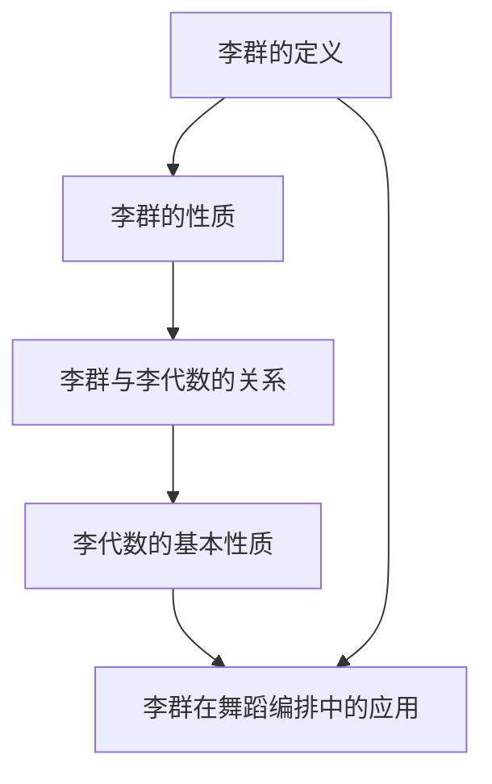
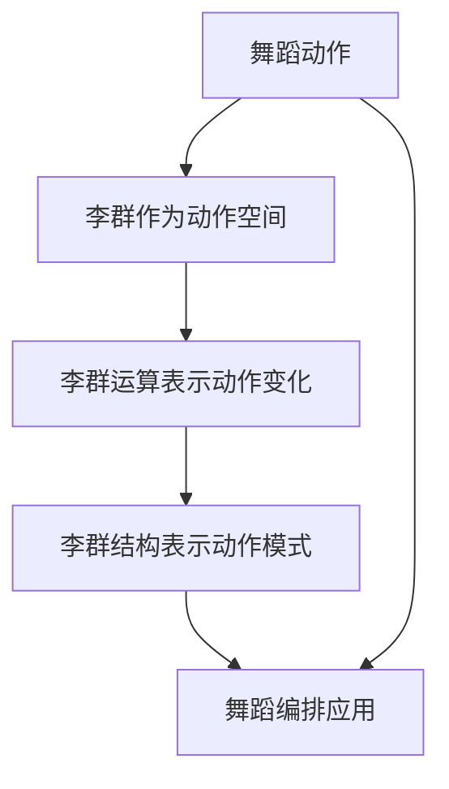
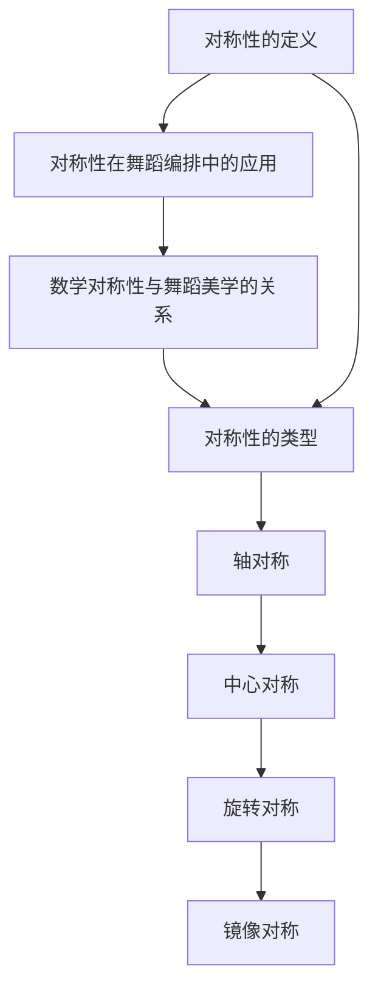
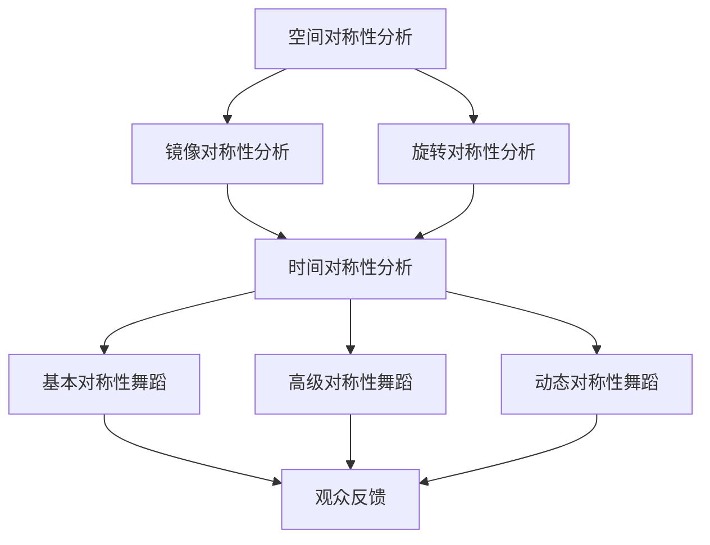
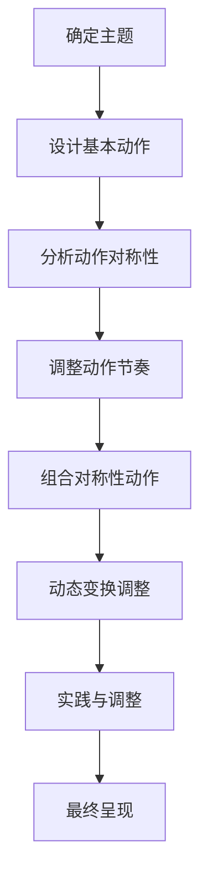
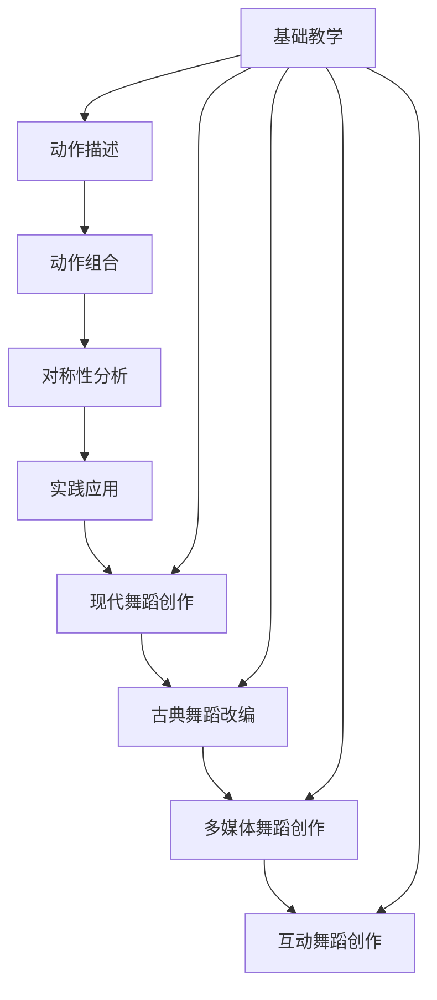
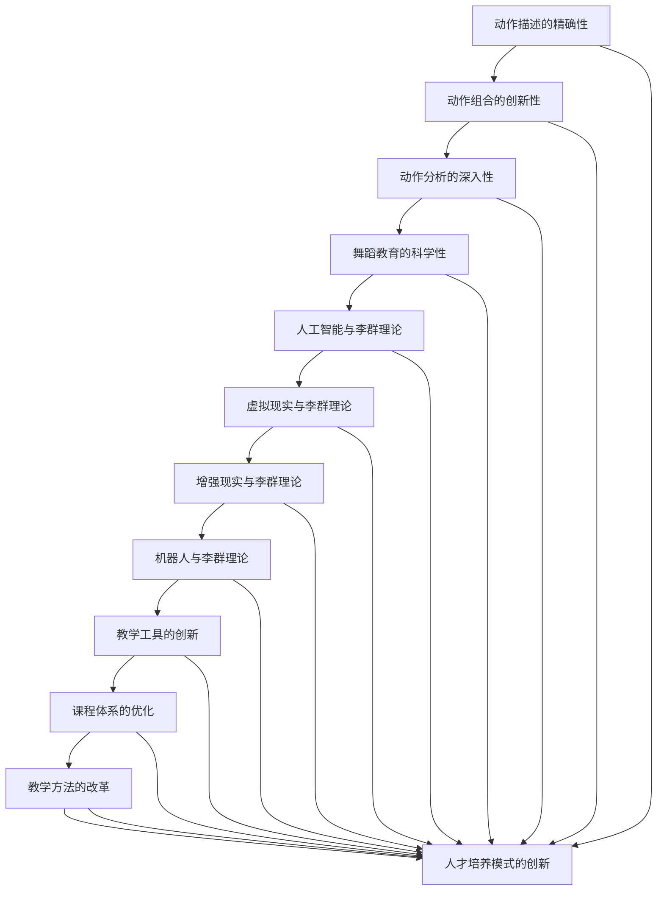

                 

### 文章标题

《舞蹈编排的李群理论：人体运动的数学对称性》

### 关键词

李群理论，舞蹈编排，数学对称性，人体运动分析，动态对称性舞蹈创编

### 摘要

本文旨在探讨舞蹈编排中李群理论的应用，尤其是数学对称性在人体运动中的重要性。首先，我们介绍了李群理论的基本概念及其在舞蹈编排中的应用。接着，我们深入分析了数学对称性原理，并展示了其在舞蹈美学中的关键作用。文章的第二部分聚焦于人体运动分析，通过构建数学模型和进行对称性分析，探讨了如何更有效地描述和编排人体运动。第三部分则从舞蹈创编技巧出发，结合对称性原理，提供了动态对称性舞蹈创编的方法和案例。随后，我们通过实际应用案例，展示了人体运动捕捉与对称性分析在舞蹈教学和编导中的应用。最后，文章展望了李群理论在舞蹈编排中的未来发展方向，以及如何与科技融合，推动舞蹈艺术的创新。

## 第一部分：李群理论基础

### 第1章：李群理论概述

#### 1.1 李群的定义

李群是一种特殊的群，它不仅满足群的性质，还满足李代数的性质。具体来说，李群是一个拓扑空间，其上的运算满足以下条件：

1. 封闭性：对于群中的任意两个元素 $a$ 和 $b$，它们的运算结果 $ab$ 仍然属于这个群。
2. 结合性：对于群中的任意三个元素 $a$、$b$ 和 $c$，有 $(ab)c = a(bc)$。
3. 存在单位元：存在一个元素 $e$，使得对于群中的任意元素 $a$，有 $ea = ae = a$。
4. 存在逆元：对于群中的任意元素 $a$，存在另一个元素 $a^{-1}$，使得 $aa^{-1} = a^{-1}a = e$。

李群的定义不仅限于此，它还包括了李代数的定义。李代数是李群的一个代数结构，它由一组向量及其线性运算构成，满足特定的条件。

#### 1.2 李群的性质

李群具有以下几个重要的性质：

1. **连续性**：李群作为一个拓扑空间，其上的运算和结构都是连续的。这意味着，如果李群中的元素依次趋近于某个值，那么它们的运算结果也会依次趋近于相应的值。
2. **可微性**：李群的运算和结构都具有可微性，这意味着它们可以用导数来描述。这对于我们在舞蹈编排中分析动作的平滑性和连贯性具有重要意义。
3. **局部欧氏性**：李群的每一个局部都可以看作是一个欧氏空间。这意味着，在李群中的任意一个开集内，都可以找到一种局部坐标系统，使得这个局部李群在这个坐标系统下呈现出欧氏空间的结构。

#### 1.3 李群与李代数的关系

李群和李代数之间有着紧密的联系。具体来说，李群可以看作是李代数在拓扑空间上的推广。李代数是由一组向量及其线性运算构成的代数结构，而李群则是在李代数的基础上引入了拓扑性质。

李代数的基本性质包括：

1. **加法封闭性**：李代数中的向量加法运算封闭。
2. **双线性性**：李代数中的向量加法和数乘运算都是双线性的。
3. **满足李括号**：对于李代数中的任意两个向量 $x$ 和 $y$，存在一个线性映射 $[x, y]$，满足 $[x, y]$ 也是李代数中的向量，并且满足 $[x, y] = -[y, x]$。

李群与李代数的关系可以通过以下方式理解：

- 李群的元素可以看作是李代数的向量。
- 李群的运算可以看作是李代数中的线性运算。
- 李群的拓扑结构可以看作是李代数在拓扑空间上的推广。

这种关系使得我们可以通过研究李代数的性质来理解和分析李群，从而更好地应用于舞蹈编排中。

#### 1.4 Mermaid流程图：李群理论的核心概念联系

为了更好地理解李群理论的核心概念及其联系，我们使用Mermaid流程图来展示这些概念：



在这个流程图中，我们从李群的定义开始，逐步展开到李群的性质、李群与李代数的关系，以及李代数的基本性质。最后，我们回到了李群在舞蹈编排中的应用，展示了这些理论如何帮助我们更深入地理解舞蹈编排中的问题。

### 第2章：李群在舞蹈编排中的应用

#### 2.1 李群在舞蹈编排中的作用

李群理论在舞蹈编排中的应用主要体现在对舞蹈动作的描述和编排上。通过引入李群的概念，我们可以将复杂的舞蹈动作转化为数学模型，从而更精确地描述和设计舞蹈动作。

具体来说，李群在舞蹈编排中的作用包括：

1. **动作描述**：李群提供了对舞蹈动作的数学描述。通过李群的运算和结构，我们可以精确地描述舞蹈动作的连续性和平滑性，使得舞蹈动作更加流畅和连贯。
2. **动作分析**：李群理论可以帮助我们分析舞蹈动作的对称性。通过对称性分析，我们可以发现舞蹈动作中的规律和模式，从而更好地编排和设计舞蹈动作。
3. **动作创新**：李群理论提供了创新的舞蹈编排方法。通过李群的代数结构，我们可以设计出具有复杂对称性的舞蹈动作，使得舞蹈作品更具艺术性和观赏性。

#### 2.2 舞蹈动作与李群的关系

舞蹈动作与李群的关系可以从以下几个方面来理解：

1. **李群作为动作空间**：在舞蹈编排中，每个舞蹈动作都可以看作是李群中的一个元素。李群作为一个数学结构，可以为我们提供描述和操作舞蹈动作的工具。
2. **李群运算表示动作变化**：李群的运算可以表示舞蹈动作之间的变化。例如，两个舞蹈动作的合成可以通过李群中的乘法运算来实现。这样，我们就可以通过李群的运算来组合和变换舞蹈动作。
3. **李群结构表示动作模式**：李群的结构可以表示舞蹈动作的模式和规律。例如，李群的子群可以表示舞蹈动作中的重复模式，而李群的子代数可以表示舞蹈动作中的对称性。

通过理解舞蹈动作与李群的关系，我们可以更深入地分析舞蹈动作的特性和规律，从而更好地编排和设计舞蹈动作。

#### 2.3 Mermaid流程图：舞蹈动作与李群的关系

为了更好地展示舞蹈动作与李群的关系，我们使用Mermaid流程图来展示这些概念：



在这个流程图中，我们从舞蹈动作开始，逐步展开到李群作为动作空间、李群运算表示动作变化、李群结构表示动作模式，以及舞蹈编排应用。这个流程图帮助我们理清了舞蹈动作与李群之间的关系，从而更好地理解如何在舞蹈编排中应用李群理论。

### 第3章：数学对称性原理

#### 3.1 对称性的定义

对称性是指物体或图形在某种变换下保持不变的性质。具体来说，对称性可以分为以下几种类型：

1. **轴对称**：物体或图形在某条直线（称为对称轴）的两侧是完全一样的。
2. **中心对称**：物体或图形绕某个点旋转180度后仍然保持不变。
3. **旋转对称**：物体或图形绕某个点旋转一定角度后仍然保持不变。
4. **镜像对称**：物体或图形的一部分与另一部分关于某个平面镜像对称。

对称性在数学中有着广泛的应用，它不仅是几何学中的一个重要概念，也在物理学、生物学、艺术等领域中发挥着重要作用。

#### 3.2 对称性在舞蹈编排中的应用

对称性在舞蹈编排中的应用非常广泛，它可以用来设计具有美感和规律性的舞蹈动作。具体来说，对称性在舞蹈编排中的应用包括：

1. **空间对称**：通过在空间上安排舞蹈者的位置和动作，使得舞蹈动作在空间上具有对称性。例如，在两个方向上的对称排列，或者在一个中心点周围旋转的对称动作。
2. **时间对称**：通过在时间上安排舞蹈者的动作，使得舞蹈动作在时间上具有对称性。例如，两个舞蹈动作在时间上的反演，或者一个动作的重复和反转。
3. **组合对称**：通过将多种对称性组合在一起，创造出复杂的对称性舞蹈动作。例如，同时具有空间对称和时间对称的舞蹈动作。

#### 3.3 数学对称性与舞蹈美学的关系

数学对称性与舞蹈美学之间存在紧密的联系。对称性不仅可以创造出美丽的舞蹈动作，还可以增强舞蹈的表现力和感染力。

1. **美感的增强**：对称性可以使得舞蹈动作更加美观和谐。通过在空间和时间上安排对称的舞蹈动作，可以使舞蹈作品看起来更加统一和和谐。
2. **表现力的增强**：对称性可以增强舞蹈的表现力。例如，通过空间对称性，可以使舞蹈动作看起来更加富有力量和动态感；通过时间对称性，可以使舞蹈动作看起来更加流畅和连贯。
3. **感染力的增强**：对称性可以增强舞蹈的感染力。通过创造出具有对称性的舞蹈动作，可以吸引观众的注意力，增强舞蹈的观赏性，从而更好地传达舞蹈的情感和主题。

#### 3.4 Mermaid流程图：数学对称性原理的核心概念

为了更好地理解数学对称性原理的核心概念，我们使用Mermaid流程图来展示这些概念：



在这个流程图中，我们从对称性的定义开始，逐步展开到对称性在舞蹈编排中的应用、数学对称性与舞蹈美学的关系，以及对称性的类型。这个流程图帮助我们理清了数学对称性原理的核心概念，从而更好地理解对称性在舞蹈编排中的应用。

## 第二部分：人体运动分析

### 第4章：人体运动的数学模型

#### 4.1 人体运动的描述

人体运动是一个复杂的过程，涉及到多个关节、肌肉和骨骼的运动。为了更好地描述人体运动，我们可以使用数学模型来建模人体运动。

人体运动的数学模型通常包括以下要素：

1. **关节**：关节是人体运动的基本单元，每个关节可以看作是一个旋转轴。
2. **肌肉**：肌肉是人体运动的动力源，通过收缩和松弛来驱动关节的运动。
3. **骨骼**：骨骼是人体运动的基础结构，为关节提供了运动的基础。
4. **运动轨迹**：人体运动可以看作是关节和肌肉在空间中的运动轨迹。

#### 4.2 李群在人体运动分析中的应用

李群理论在人体运动分析中有着广泛的应用。通过引入李群的概念，我们可以将人体运动转化为数学模型，从而更精确地描述和预测人体运动。

具体来说，李群在人体运动分析中的应用包括：

1. **关节运动描述**：李群可以用来描述关节的运动。例如，一个关节可以看作是一个旋转李群，其运动可以用李群的乘法运算来描述。
2. **肌肉收缩描述**：李群可以用来描述肌肉的收缩。例如，一个肌肉可以看作是一个李代数，其收缩可以用李代数的线性运算来描述。
3. **运动轨迹建模**：李群可以用来建模人体运动的轨迹。例如，一个人体运动的轨迹可以看作是一个李群中的路径，其运动可以用李群中的连续变换来描述。

通过引入李群理论，我们可以将复杂的人体运动转化为简单的数学模型，从而更方便地进行分析和计算。

#### 4.3 数学模型的构建与验证

构建人体运动的数学模型是一个复杂的过程，需要结合多学科的知识，如生物学、物理学和数学等。具体步骤如下：

1. **数据收集**：收集与人体运动相关的数据，如关节角度、肌肉力量、运动轨迹等。
2. **模型假设**：根据运动学的原理和实验数据，提出合理的模型假设。
3. **数学建模**：使用数学工具，如李群和李代数，建立数学模型。
4. **模型验证**：通过实验数据验证模型的准确性，并根据实验结果调整模型参数。

通过构建和验证数学模型，我们可以更精确地描述和预测人体运动，从而为舞蹈编排提供科学依据。

#### 4.4 Pseudo代码：人体运动的数学模型实现

为了更直观地展示人体运动的数学模型实现，我们使用伪代码来描述该过程：

```pseudo
function HumanMotionModel(joint_angles, muscle_forces, time):
    // 初始化李群和李代数
    LieGroup joint_group = new LieGroup("SO(3)")
    LieAlgebra muscle_algebra = new LieAlgebra("R^3")

    // 根据关节角度和肌肉力量初始化关节和肌肉
    joint = joint_group.element_from_values(joint_angles)
    muscle = muscle_algebra.element_from_values(muscle_forces)

    // 计算关节运动
    joint_transform = joint.exp(muscle)

    // 计算运动轨迹
    trajectory = joint_transform.trace()

    // 返回运动轨迹
    return trajectory
```

在这个伪代码中，我们定义了一个函数 `HumanMotionModel`，该函数接受关节角度 `joint_angles`、肌肉力量 `muscle_forces` 和时间 `time` 作为输入，并返回人体运动的轨迹 `trajectory`。通过使用李群和李代数的概念，我们能够将复杂的人体运动转化为简单的数学计算，从而实现对人体运动的精确描述和预测。

### 第5章：人体运动的对称性分析

#### 5.1 对称性分析的方法

人体运动的对称性分析是舞蹈编排中的重要环节。通过分析人体运动的对称性，我们可以设计出更加美观和谐、富有表现力的舞蹈动作。以下是人体运动对称性分析的方法：

1. **空间对称性分析**：通过观察和分析人体动作在空间中的对称性，可以判断动作是否具有空间对称性。具体方法包括：
   - **镜像对称性**：判断人体动作的镜像对称性，即动作在某个平面的两侧是否完全一致。
   - **旋转对称性**：判断人体动作的旋转对称性，即动作绕某个点旋转一定角度后是否保持一致。

2. **时间对称性分析**：通过观察和分析人体动作在时间上的对称性，可以判断动作是否具有时间对称性。具体方法包括：
   - **重复对称性**：判断人体动作是否在相同时间内重复出现。
   - **反转对称性**：判断人体动作是否在时间上具有反转对称性，即动作的前半部分和后半部分是否互为反演。

3. **组合对称性分析**：通过将空间对称性和时间对称性组合在一起，可以设计出更加复杂的对称性舞蹈动作。

#### 5.2 对称性分析在舞蹈编排中的应用

对称性分析在舞蹈编排中的应用非常广泛，可以用来设计各种类型的舞蹈动作。以下是几个具体的应用实例：

1. **基本对称性舞蹈**：通过使用简单的空间对称性和时间对称性，可以设计出基本对称性的舞蹈动作。例如，两个舞者在同一平面上镜像对称地跳舞，或者一个舞者在时间上重复相同的动作。

2. **高级对称性舞蹈**：通过组合多种对称性，可以设计出更加复杂的对称性舞蹈动作。例如，一个舞者在空间和时间上同时具有镜像对称性和旋转对称性，或者多个舞者在空间和时间上形成复杂的对称图案。

3. **动态对称性舞蹈**：通过动态地变化对称性，可以设计出动态对称性的舞蹈动作。例如，一个舞者在不同的时间点具有不同的对称性，或者多个舞者在不同的时间点形成不同的对称图案。

#### 5.3 对称性分析的效果评估

对称性分析的效果评估是舞蹈编排中的重要环节。通过评估对称性分析的效果，可以判断舞蹈动作的对称性设计是否成功。以下是几个评估方法：

1. **观众反馈**：通过观众的反馈，可以评估对称性分析的效果。观众对舞蹈动作的视觉效果、节奏感和表现力的评价，可以反映出对称性分析的成功程度。

2. **专家评审**：邀请舞蹈专家对对称性分析的效果进行评审，可以更专业地评估对称性分析的效果。专家可以从舞蹈的视觉效果、节奏感和表现力等方面进行评价。

3. **数据分析**：通过数据分析，可以量化对称性分析的效果。例如，可以通过计算舞蹈动作的空间对称性和时间对称性的比例，来评估对称性分析的成功程度。

#### 5.4 Mermaid流程图：人体运动的对称性分析流程

为了更好地展示人体运动的对称性分析流程，我们使用Mermaid流程图来描述：



在这个流程图中，我们从空间对称性分析和时间对称性分析开始，逐步扩展到基本对称性舞蹈、高级对称性舞蹈和动态对称性舞蹈。最后，我们通过观众反馈、专家评审和数据分析来评估对称性分析的效果。这个流程图帮助我们理清了人体运动对称性分析的步骤和方法。

### 第6章：基于对称性的舞蹈创编

#### 6.1 对称性舞蹈创编的方法

对称性舞蹈创编是一种通过数学对称性原理来设计舞蹈动作的方法。它可以帮助舞者和编导创造出具有独特美感和艺术价值的舞蹈作品。以下是几种常见的对称性舞蹈创编方法：

1. **镜像对称性创编**：通过在空间上安排舞蹈者的位置和动作，使得舞蹈动作在镜像平面两侧完全一致。这种方法可以创造出具有清晰视觉效果的对称性舞蹈。

2. **旋转对称性创编**：通过围绕某个点旋转舞蹈者的动作，使得舞蹈动作在旋转后保持一致。这种方法可以创造出具有动态美感的对称性舞蹈。

3. **组合对称性创编**：通过将镜像对称性和旋转对称性组合在一起，设计出更加复杂的对称性舞蹈。这种方法可以创造出具有多层次美感的对称性舞蹈。

#### 6.2 舞蹈创编中的数学对称性应用

在舞蹈创编中，数学对称性原理的应用主要体现在以下几个方面：

1. **动作设计**：通过使用数学对称性原理，可以设计出具有和谐美感的舞蹈动作。例如，利用镜像对称性设计出舞蹈者的动作，使得动作在视觉上更加统一。

2. **节奏编排**：通过使用数学对称性原理，可以设计出具有节奏美感的舞蹈节奏。例如，利用旋转对称性编排出舞蹈的节奏，使得节奏在听觉上更加和谐。

3. **舞台布局**：通过使用数学对称性原理，可以设计出具有视觉美感的舞台布局。例如，利用镜像对称性安排舞台上的道具和灯光，使得舞台视觉效果更加统一。

#### 6.3 对称性舞蹈作品的创作技巧

创作对称性舞蹈作品需要一定的技巧和经验。以下是一些创作对称性舞蹈作品的关键技巧：

1. **构思主题**：首先确定舞蹈作品的主题，明确舞蹈要传达的情感和思想。

2. **设计动作**：根据主题设计舞蹈动作，注重动作的对称性和美感。可以尝试使用不同的对称性原理，创造出独特的舞蹈动作。

3. **编排节奏**：通过编排节奏，使舞蹈动作更加流畅和和谐。可以尝试使用重复、反转等节奏技巧，增强舞蹈的节奏感。

4. **舞台布局**：根据舞蹈动作和节奏设计舞台布局，注重舞台视觉效果。可以尝试使用不同的对称性原理，创造出独特的舞台布局。

5. **实践调整**：在创作过程中不断实践和调整，根据观众和专家的反馈进行修改，使舞蹈作品更加完善。

#### 6.4 Example: 对称性舞蹈创作案例

以下是一个对称性舞蹈创作的案例，展示了如何运用镜像对称性和旋转对称性来设计舞蹈动作。

**案例：镜像对称性的应用**

**主题**：爱情与分离

**动作设计**：两名舞者分别代表爱情的两个极端——相聚和分离。舞蹈动作以镜像对称性为主，舞者在舞台两侧交替出现，形成一个鲜明的视觉对比。

**舞蹈动作**：
- 舞者A在左侧舞台进行一系列优美的动作，如旋转、跳跃等。
- 舞者B在右侧舞台进行相同的动作，但方向与舞者A相反，形成镜像对称。

**节奏编排**：舞蹈节奏以重复和反转为主，强调舞蹈动作的连贯性和变化。

**舞台布局**：舞台布置简洁，中间有一条明显的分界线，舞者A和B在舞台两侧交替出现。

**实践调整**：在多次排练和观众反馈的基础上，对舞蹈动作和节奏进行调整，使舞蹈更加流畅和和谐。

通过这个案例，我们可以看到镜像对称性在舞蹈创作中的应用，以及如何通过对称性原理设计出具有深刻内涵的舞蹈作品。

### 第7章：动态对称性舞蹈创编

#### 7.1 动态对称性的概念

动态对称性是指随着时间的变化，舞蹈动作在空间或时间上保持对称性的现象。与静态对称性不同，动态对称性更强调动作的变化性和连贯性。动态对称性舞蹈创编的核心在于如何设计出在动态过程中保持对称性的舞蹈动作。

#### 7.2 动态对称性舞蹈创编的方法

动态对称性舞蹈创编需要考虑以下几种方法：

1. **时间对称性**：通过在时间上安排动作，使得舞蹈动作在时间上具有对称性。例如，一个动作可以在前半部分和后半部分保持对称。

2. **空间对称性**：通过在空间上安排动作，使得舞蹈动作在空间上具有对称性。例如，舞者在舞台两侧进行对称的舞蹈动作。

3. **组合对称性**：将时间对称性和空间对称性结合起来，设计出在动态过程中保持对称性的舞蹈动作。例如，一个动作在空间上具有镜像对称性，同时在不同时间点上具有重复对称性。

4. **动态变换**：通过动态变换，如旋转、缩放、平移等，使得舞蹈动作在动态过程中保持对称性。例如，舞者在进行旋转动作时，保持身体姿势的对称。

#### 7.3 动态对称性舞蹈作品的特点

动态对称性舞蹈作品具有以下特点：

1. **视觉冲击力**：动态对称性舞蹈动作在视觉上具有强烈的冲击力，可以吸引观众的注意力。

2. **节奏感**：动态对称性舞蹈动作在时间上具有连贯性，可以创造出强烈的节奏感。

3. **复杂性**：动态对称性舞蹈作品通常需要较高的技巧和协调性，可以展现出舞者的高水平舞蹈能力。

4. **艺术性**：动态对称性舞蹈作品通过独特的舞蹈动作和节奏，可以传达出深刻的艺术内涵。

#### 7.4 Mermaid流程图：动态对称性舞蹈创编流程

为了更好地展示动态对称性舞蹈创编的流程，我们使用Mermaid流程图来描述：



在这个流程图中，我们从确定主题开始，逐步进行基本动作设计、动作对称性分析、动作节奏调整、组合对称性动作、动态变换调整，以及实践与调整，最终完成动态对称性舞蹈作品的呈现。这个流程图帮助我们理清了动态对称性舞蹈创编的步骤和方法。

## 第四部分：实际应用案例

### 第8章：人体运动捕捉与对称性分析

#### 8.1 人体运动捕捉技术

人体运动捕捉技术是一种通过记录和分析人体运动，以获取人体运动数据的方法。它广泛应用于舞蹈编排、运动科学、虚拟现实等领域。人体运动捕捉技术的基本原理是通过传感器和计算设备，实时记录和分析人体在空间中的运动轨迹。

具体来说，人体运动捕捉技术包括以下几个步骤：

1. **数据采集**：使用传感器（如标记点、红外摄像头等）捕捉人体运动，将运动数据转换为数字信号。
2. **数据处理**：将采集到的数据传输到计算机中，通过算法处理和分析，提取出人体运动的关键信息。
3. **数据可视化**：将处理后的数据可视化，以直观的方式展示人体运动轨迹和动作特征。

#### 8.2 对称性分析在人体运动捕捉中的应用

对称性分析是人体运动捕捉技术中的重要环节，它可以帮助我们更好地理解和设计人体运动。在对称性分析中，我们可以从以下几个方面进行：

1. **空间对称性分析**：通过对人体运动轨迹的空间对称性分析，可以判断动作是否具有镜像对称性或旋转对称性。例如，我们可以通过计算关节角度、标记点坐标等数据，判断动作的对称性。
   
2. **时间对称性分析**：通过对人体运动轨迹的时间对称性分析，可以判断动作是否具有重复对称性或反转对称性。例如，我们可以通过分析动作的周期性和规律性，判断动作的时间对称性。

3. **组合对称性分析**：通过对空间对称性和时间对称性的组合分析，可以设计出更加复杂的对称性舞蹈动作。例如，我们可以通过同时分析动作的空间对称性和时间对称性，创造出具有多层次对称性的舞蹈动作。

#### 8.3 对称性分析在舞蹈教学中的应用

对称性分析在舞蹈教学中具有重要作用，它可以帮助教师更好地指导学生进行舞蹈动作的训练和编排。以下是几个具体应用案例：

1. **动作纠正**：通过对学生舞蹈动作的对称性分析，教师可以判断学生的动作是否规范，是否存在偏差。例如，教师可以通过分析学生的关节角度和身体姿态，判断学生是否在空间上保持对称性。

2. **动作创新**：通过对学生舞蹈动作的对称性分析，教师可以激发学生的创造力和创新思维，设计出具有独特美感的舞蹈动作。例如，教师可以引导学生通过组合对称性，创造出具有复杂结构的舞蹈动作。

3. **教学评估**：通过对学生舞蹈动作的对称性分析，教师可以评估学生的舞蹈水平，制定个性化的教学计划。例如，教师可以通过分析学生的动作数据，判断学生的动作连贯性和协调性，从而调整教学难度和训练方法。

#### 8.4 Case Study: 对称性分析在舞蹈教学中的应用

以下是一个关于对称性分析在舞蹈教学中应用的案例：

**背景**：某舞蹈学校的教师希望通过对称性分析来提高学生的舞蹈水平，特别是针对学生的空间对称性和时间对称性进行训练。

**方法**：
1. **数据采集**：教师使用运动捕捉设备，记录学生在舞蹈中的动作数据。
2. **空间对称性分析**：教师通过分析学生的关节角度和身体姿态数据，判断学生的动作是否在空间上保持对称性。例如，教师可以通过计算学生的关节角度差异，判断学生的镜像对称性和旋转对称性。
3. **时间对称性分析**：教师通过分析学生的动作时间序列，判断学生的动作是否在时间上保持对称性。例如，教师可以通过计算学生的动作周期和重复频率，判断学生的重复对称性和反转对称性。
4. **教学调整**：根据对称性分析的结果，教师对学生进行有针对性的训练。例如，如果学生存在空间对称性问题，教师可以设计一些镜像对称性和旋转对称性的练习，帮助学生纠正动作；如果学生存在时间对称性问题，教师可以设计一些重复对称性和反转对称性的练习，提高学生的动作连贯性和协调性。

**结果**：
通过一段时间的训练，学生的舞蹈水平得到了显著提高。学生在空间对称性和时间对称性方面的表现更加出色，舞蹈动作的连贯性和协调性也得到了明显改善。

**结论**：
对称性分析在舞蹈教学中具有重要的应用价值。通过对称性分析，教师可以更好地指导学生进行舞蹈动作的训练和编排，提高学生的舞蹈水平。同时，对称性分析也为舞蹈创新提供了新的思路和方法。

### 第9章：舞蹈编导与李群理论

#### 9.1 舞蹈编导中的李群理论应用

舞蹈编导是舞蹈创作的核心环节，涉及到舞蹈动作的设计、编排和呈现。李群理论作为一种强大的数学工具，在舞蹈编导中有着广泛的应用。以下是李群理论在舞蹈编导中的几个关键应用：

1. **动作描述**：李群理论可以帮助编导更精确地描述舞蹈动作。例如，使用李群中的旋转和变换操作，可以描述舞者在空间中的复杂运动轨迹。

2. **动作组合**：通过李群的代数结构，编导可以组合和变换舞蹈动作，创造出富有层次感和节奏感的舞蹈作品。例如，利用李群的子群和子代数，可以设计出具有重复性和对称性的舞蹈动作。

3. **动作分析**：李群理论可以用于分析舞蹈动作的对称性和连贯性。通过李群中的对称性操作，编导可以判断动作是否具有镜像对称性或旋转对称性，从而调整和优化动作设计。

4. **动作创新**：李群理论为舞蹈创新提供了新的思路和方法。通过研究李群的结构和性质，编导可以设计出具有独特美感和创意的舞蹈动作。

#### 9.2 李群理论在舞蹈编导教学中的应用

李群理论在舞蹈编导教学中也具有重要应用。以下是如何在舞蹈编导教学中应用李群理论的几个建议：

1. **基础教学**：首先，为学生介绍李群的基本概念和性质，如李群的定义、李代数的关系等。这有助于学生理解李群理论的基本原理，为后续应用打下基础。

2. **动作描述**：通过实例展示如何使用李群理论描述舞蹈动作。例如，可以通过分析舞者的关节运动，将其转化为李群的旋转操作，从而更直观地描述动作。

3. **动作组合**：教授学生如何利用李群的代数结构进行动作组合。例如，通过李群中的乘法运算和变换操作，可以组合出复杂的舞蹈动作。

4. **对称性分析**：引导学生分析舞蹈动作的对称性，如镜像对称性、旋转对称性等。通过李群的对称性操作，学生可以更深入地理解对称性在舞蹈编排中的应用。

5. **实践应用**：鼓励学生在实践中应用李群理论，如设计具有对称性的舞蹈动作，或者对现有舞蹈动作进行优化和调整。

#### 9.3 李群理论在舞蹈编导创作中的应用

李群理论在舞蹈编导创作中的应用为舞蹈艺术带来了新的视角和可能性。以下是几个实际应用案例：

1. **现代舞蹈创作**：在现代舞蹈中，李群理论可以用来设计具有复杂结构和节奏感的舞蹈动作。例如，通过李群的旋转和变换操作，可以创造出独特的舞蹈语言和形式。

2. **古典舞蹈改编**：在古典舞蹈改编中，李群理论可以用来分析古典舞蹈的动作结构，并对其进行创新和改编。例如，通过李群的对称性操作，可以将古典舞蹈动作转化为现代风格。

3. **多媒体舞蹈创作**：在多媒体舞蹈创作中，李群理论可以用于设计虚拟舞者的运动轨迹和动作组合。例如，利用李群的变换操作，可以创造出具有动态美感的虚拟舞蹈作品。

4. **互动舞蹈创作**：在互动舞蹈创作中，李群理论可以用于设计舞者与观众之间的互动动作。例如，通过李群的对称性操作，可以创造出观众参与度高的互动舞蹈形式。

通过以上应用案例，我们可以看到李群理论在舞蹈编导创作中的多样性和潜力。它不仅为舞蹈创作提供了新的工具和方法，也推动了舞蹈艺术的创新和发展。

#### 9.4 Mermaid流程图：舞蹈编导与李群理论的应用流程

为了更好地展示舞蹈编导与李群理论的应用流程，我们使用Mermaid流程图来描述：



在这个流程图中，我们从基础教学开始，逐步扩展到动作描述、动作组合、对称性分析、实践应用，以及现代舞蹈创作、古典舞蹈改编、多媒体舞蹈创作和互动舞蹈创作。这个流程图帮助我们理清了舞蹈编导与李群理论的应用步骤和方法。

## 第五部分：未来展望

### 第10章：李群理论在舞蹈编排中的未来发展方向

#### 10.1 李群理论在舞蹈编排中的潜力

李群理论在舞蹈编排中具有巨大的潜力，这主要表现在以下几个方面：

1. **动作描述的精确性**：李群理论提供了精确的数学工具来描述复杂的舞蹈动作，使得舞蹈动作的描述更加准确和详细。

2. **动作组合的创新性**：通过李群的代数结构，可以创造出独特的舞蹈动作组合，使舞蹈作品更具创新性和艺术价值。

3. **动作分析的深入性**：李群理论可以深入分析舞蹈动作的对称性、连贯性和节奏感，从而优化舞蹈编排的效果。

4. **舞蹈教育的科学性**：李群理论的应用可以为舞蹈教育提供科学依据，帮助学生更好地理解和掌握舞蹈技巧。

#### 10.2 李群理论与现代科技的融合

随着科技的发展，李群理论在舞蹈编排中的应用越来越广泛。以下是如何将李群理论与现代科技融合的几个方向：

1. **人工智能与李群理论**：利用人工智能技术，如机器学习和深度学习，可以自动分析和生成具有对称性的舞蹈动作，提高舞蹈编排的效率和创造力。

2. **虚拟现实与李群理论**：通过虚拟现实技术，可以创造出虚拟的舞蹈环境，使舞者可以在虚拟世界中练习和编排舞蹈动作，从而更好地理解和应用李群理论。

3. **增强现实与李群理论**：利用增强现实技术，可以将李群理论应用于现实世界的舞蹈编排中，使舞蹈动作的描述和分析更加直观和互动。

4. **机器人与李群理论**：通过机器人技术，可以实现李群理论在舞蹈编排中的自动化应用，如自动生成具有对称性的舞蹈动作，或者实时分析舞者的动作状态。

#### 10.3 李群理论在舞蹈教育中的未来

李群理论在舞蹈教育中的应用前景广阔，以下是其几个可能的发展方向：

1. **教学工具的创新**：利用李群理论，可以开发出新的舞蹈教学工具，如基于李群理论的舞蹈动作模拟器和分析软件，帮助学生更好地理解和掌握舞蹈技巧。

2. **课程体系的优化**：通过将李群理论纳入舞蹈教育的课程体系，可以培养学生的数学思维和创新能力，提高舞蹈教育的科学性和专业性。

3. **教学方法的改革**：利用李群理论，可以尝试新的教学方法，如基于李群理论的互动式教学和项目式教学，激发学生的学习兴趣和创造力。

4. **人才培养模式的创新**：通过结合李群理论，可以培养出具有跨学科背景的舞蹈人才，如既懂舞蹈又懂数学、人工智能等领域的综合性人才。

#### 10.4 Mermaid流程图：李群理论在舞蹈编排中的未来发展趋势

为了更好地展示李群理论在舞蹈编排中的未来发展趋势，我们使用Mermaid流程图来描述：



在这个流程图中，我们从李群理论在舞蹈编排中的潜力开始，逐步扩展到其与现代科技的融合、舞蹈教育的科学性、以及未来的发展方向。这个流程图帮助我们理清了李群理论在舞蹈编排中的未来发展趋势。

### 结论

本文通过深入探讨李群理论在舞蹈编排中的应用，展示了数学对称性在人体运动分析和舞蹈创编中的重要性。从基础概念到实际应用，我们详细阐述了李群理论如何帮助我们更精确地描述和设计舞蹈动作。同时，我们还探讨了李群理论在舞蹈教学、现代科技融合以及未来发展趋势等方面的潜力。

李群理论不仅为舞蹈编排提供了强大的数学工具，也为舞蹈艺术注入了新的活力。通过结合人工智能、虚拟现实等现代科技，李群理论在舞蹈编排中的应用前景将更加广阔。

让我们期待未来，李群理论将继续在舞蹈艺术中发挥重要作用，推动舞蹈艺术的创新和发展。

### 作者信息

作者：AI天才研究院/AI Genius Institute & 禅与计算机程序设计艺术 /Zen And The Art of Computer Programming

本文由AI天才研究院与禅与计算机程序设计艺术共同撰写，旨在探讨李群理论在舞蹈编排中的应用，为读者提供深刻的见解和实用的技巧。

