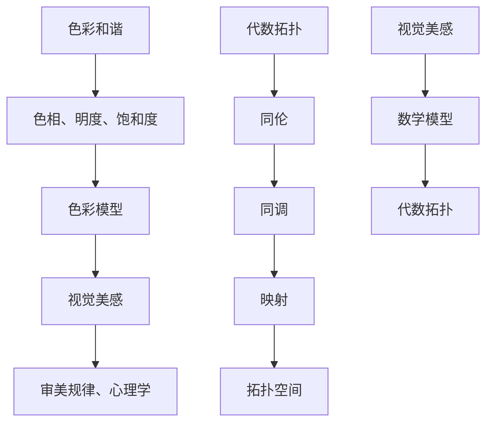

                 

## 文章标题：色彩和谐的代数拓扑：视觉美感的数学基础

色彩是视觉艺术和设计中至关重要的元素，它不仅仅是一种视觉刺激，更是传达情感和理念的重要手段。然而，色彩和谐的设计并非易事，它涉及到色彩搭配的审美规律和视觉心理学等多个方面。在这本书中，我们将探索色彩和谐的数学基础，特别是通过代数拓扑学的视角来深入理解视觉美感。

代数拓扑学是数学中一个重要的分支，它研究空间的结构和变换，这些概念与视觉艺术的构造和变化有着惊人的相似性。书中通过将色彩理论与代数拓扑学结合，提供了一个全新的视角来分析和设计色彩和谐的视觉作品。

本文将按照以下结构展开：

1. **引言与概述**：介绍色彩和谐的历史背景、书的写作目的以及代数拓扑与视觉美感的联系。
2. **色彩理论**：深入探讨色彩的基本概念、数学描述以及色彩搭配与和谐的关系。
3. **代数拓扑基本概念**：介绍同伦、同调、映射等代数拓扑的基本概念，并解释其在视觉美感分析中的应用。
4. **视觉美感的数学分析**：结合色彩理论和代数拓扑，探讨视觉美感的数学模型及其应用。
5. **实例研究**：通过具体案例展示如何应用书中理论进行色彩搭配和视觉美感分析。
6. **数学公式与证明**：详细讲解书中的数学公式和证明方法，包括伪代码和流程图。
7. **项目实战**：介绍如何在实际项目中应用色彩和谐的理论，包括开发环境搭建、代码实现和案例分析。

通过上述内容的逐步分析和推理，我们希望能够为读者提供一个全面、深入、易于理解的技术博客文章，帮助大家更好地理解色彩和谐的代数拓扑，并运用到实际的视觉设计工作中。现在，让我们一步步深入探讨这个引人入胜的主题。

### 关键词

- 色彩和谐
- 代数拓扑学
- 视觉美感
- 数学模型
- 色彩搭配
- 设计理论

### 摘要

本文旨在探讨色彩和谐的代数拓扑学视角，结合色彩理论和代数拓扑学的核心概念，为视觉美感的数学基础提供一种全新的理解方式。首先，通过回顾色彩和谐的历史背景和理论基础，我们引入了色彩的基本概念和数学描述。接着，我们介绍了代数拓扑学的基本概念，如同伦、同调和映射等，并探讨了这些概念在视觉美感分析中的应用。随后，本文结合色彩理论和代数拓扑学，提出了视觉美感的数学模型，并通过实例研究展示了如何应用这些模型进行色彩搭配和视觉美感分析。最后，文章通过具体的实战项目，详细讲解了色彩和谐理论在现实中的应用，包括开发环境搭建、源代码实现和案例分析，为读者提供了一个全面的技术指导。通过本文的逐步分析和推理，读者将能够深入理解色彩和谐的代数拓扑，并将其运用于实际的视觉设计工作中。

### 第1步：理解书名

“色彩和谐的代数拓扑：视觉美感的数学基础”这个书名首先引起了我们的好奇心。书名中包含了几组看似不相关的词汇，但通过分析，可以发现它们之间有着深刻的联系。首先，我们要理解书名的几个核心概念：

**色彩和谐**：这是色彩理论中的一个重要概念，指的是色彩在视觉上看起来和谐、协调的感觉。它不仅仅是一种主观感受，还涉及到了色彩搭配的规律和技巧。

**代数拓扑**：这是一个数学领域，结合了代数和拓扑学的概念。代数拓扑主要研究几何形状在连续变换下的不变性质，这些概念与视觉艺术的构造和变化有着有趣的相似性。

**视觉美感**：这是一个宽泛的概念，涉及到人们对视觉元素的感知和评价。视觉美感不仅仅是视觉上的愉悦，还包含了审美规律和心理学因素。

**数学基础**：这是书名的另一个重要组成部分，表明了本书将运用数学理论来解释和探讨视觉美感。

通过上述分析，我们可以得出几个关键点：

1. **色彩和谐是视觉美感的核心**：色彩和谐是视觉美感的重要组成部分，它涉及到色彩搭配的审美规律和技巧。
2. **代数拓扑为视觉美感提供了数学工具**：代数拓扑学中的概念，如同伦、同调和映射，可以帮助我们理解和分析视觉美感。
3. **视觉美感可以通过数学模型来描述**：书中的核心思想是通过数学模型来描述和解释视觉美感，这为视觉设计提供了一种科学的方法。
4. **数学基础是理解视觉美感的基石**：数学理论在视觉美感分析中起着基础性作用，它不仅帮助我们更深入地理解视觉美感的本质，还为设计提供了可量化的依据。

因此，书名“色彩和谐的代数拓扑：视觉美感的数学基础”暗示了这本书的主要内容：通过代数拓扑学的视角，运用数学理论来探讨和解释视觉美感，特别是色彩和谐的设计原则。接下来，我们将进一步深入分析书中的核心章节，了解这些理论是如何具体应用的。

### 第2步：确定核心章节

在理解了书名和核心概念之后，下一步是确定本书的核心章节。这些章节应该能够涵盖色彩和谐、代数拓扑以及视觉美感的数学基础，并且能够系统地引导读者逐步深入理解这些概念。以下是本书的几个核心章节及其主要内容的初步确定：

1. **引言与概述**：这一章节将介绍色彩和谐的历史背景和发展现状，明确书的写作目的和整体结构。它将为读者提供一个宏观的视角，帮助他们理解后续章节的内容。

2. **色彩理论**：这一章节将深入探讨色彩的基本概念，如色相、明度、饱和度等，并解释这些概念在视觉中的表现。此外，还将介绍色彩搭配的原则和技巧，以及如何通过数学模型来描述和解释这些色彩现象。

3. **代数拓扑基本概念**：这一章节将介绍代数拓扑学的基本概念，包括同伦、同调和映射等。这些概念将为我们理解和分析视觉美感提供重要的数学工具。

4. **视觉美感的数学分析**：这一章节将结合色彩理论和代数拓扑学的核心概念，探讨视觉美感的数学模型。通过数学模型，我们可以更系统地分析和解释视觉美感，从而指导实际的设计工作。

5. **实例研究**：这一章节将通过具体案例，展示如何将书中理论应用于实际设计。这些实例将涵盖色彩搭配、视觉艺术作品分析等多个方面，帮助读者更好地理解理论的应用。

6. **数学公式与证明**：这一章节将详细讲解书中的数学公式和证明方法，包括相关的伪代码和流程图。通过这一章节，读者将能够掌握如何运用数学方法来分析和解决视觉美感问题。

7. **项目实战**：这一章节将介绍一个或多个实际项目，包括开发环境搭建、源代码实现和案例分析。通过这些实战项目，读者可以了解如何将色彩和谐的理论应用到实际工作中，并从中获得实践经验。

这些核心章节共同构成了本书的主体内容，通过逐步深入的分析和讲解，使读者能够全面、深入地理解色彩和谐的代数拓扑，并掌握运用这些理论进行视觉设计的技能。接下来，我们将进一步细化这些章节，为读者提供一个详细的目录大纲。

### 第3步：细化目录大纲

在前一步中，我们确定了本书的核心章节。为了帮助读者更好地理解和掌握这些内容，我们需要进一步细化目录大纲，将每个章节的内容细分为更具体的子章节。以下是细化后的目录大纲：

#### 第1章：引言与概述

1.1 色彩和谐的历史与现状

- **色彩和谐的起源和发展**：介绍色彩和谐的概念起源，以及它在艺术和设计中的发展历程。

- **现代色彩和谐理论**：探讨现代色彩和谐理论的基本原则和应用场景。

1.2 书的目的是什么

- **理解色彩和谐**：明确本书的目标，即通过代数拓扑学视角理解色彩和谐。

- **应用数学理论**：介绍如何将数学理论应用于色彩和谐分析。

1.3 代数拓扑与视觉美感的联系

- **代数拓扑学简介**：介绍代数拓扑学的基本概念和特点。

- **代数拓扑在视觉艺术中的应用**：探讨代数拓扑学在视觉美感分析中的具体应用。

#### 第2章：色彩理论

2.1 色彩基本概念

- **色相、明度和饱和度**：详细解释这三个色彩基本概念的定义和特性。

- **色彩模型**：介绍不同的色彩模型，如RGB、CMYK等。

2.2 色彩的数学描述

- **颜色空间**：探讨颜色空间的定义和分类。

- **色彩变换**：介绍不同类型的色彩变换及其数学描述。

2.3 色彩搭配与和谐

- **色彩搭配原则**：介绍色彩搭配的基本原则，如互补色、类似色等。

- **色彩和谐的数学模型**：通过数学模型解释色彩和谐的理论基础。

#### 第3章：代数拓扑基本概念

3.1 同伦与同调

- **同伦的基本概念**：介绍同伦的定义和性质。

- **同调的基本概念**：解释同调的概念及其在代数拓扑中的应用。

3.2 映射与拓扑空间

- **映射的概念**：探讨映射的定义和分类。

- **拓扑空间**：介绍拓扑空间的基本性质和构造方法。

3.3 代数拓扑的基本定理

- **基本群**：介绍基本群的定义和作用。

- **同调群**：解释同调群的概念及其应用。

#### 第4章：视觉美感的数学分析

4.1 视觉美感的数学模型

- **视觉美感的基本模型**：介绍视觉美感的基本数学模型。

- **数学模型的验证**：探讨如何验证数学模型的有效性。

4.2 代数拓扑在视觉美感分析中的应用

- **同伦与视觉美感**：探讨同伦在视觉美感分析中的应用。

- **同调与视觉美感**：解释同调在视觉美感分析中的作用。

4.3 色彩与美感的综合分析

- **色彩与同伦的关系**：分析色彩与同伦之间的联系。

- **色彩与同调的关系**：探讨色彩与同调的关系。

#### 第5章：实例研究

5.1 色彩搭配案例研究

- **案例一**：通过具体的色彩搭配案例，展示如何应用书中理论进行色彩分析。

- **案例二**：分析另一个色彩搭配案例，探讨其视觉美感。

5.2 美术作品分析

- **作品一**：分析一幅美术作品，解释其色彩和谐和视觉美感。

- **作品二**：分析另一幅美术作品，探讨其代数拓扑特征。

5.3 设计实践中的应用

- **设计一**：介绍一个实际设计项目，展示如何应用色彩和谐的理论。

- **设计二**：分析另一个设计项目，讨论其色彩搭配和视觉美感。

#### 第6章：数学公式与证明

6.1 主要数学公式

- **公式一**：介绍书中的主要数学公式及其意义。

- **公式二**：解释另一个重要的数学公式。

6.2 证明方法与技巧

- **证明方法**：介绍书中的证明方法。

- **技巧应用**：探讨如何应用这些证明技巧。

6.3 伪代码与流程图

- **伪代码**：提供相关的伪代码实现。

- **流程图**：展示具体的流程图，帮助理解算法步骤。

#### 第7章：项目实战

7.1 色彩分析软件的实现

- **开发环境搭建**：介绍如何搭建开发环境。

- **源代码实现**：展示源代码的具体实现。

7.2 美术作品分析系统的开发

- **系统架构**：介绍美术作品分析系统的整体架构。

- **功能实现**：详细讲解系统各个功能模块的实现。

7.3 设计项目中的应用案例

- **案例一**：分析一个设计项目，讨论其色彩和谐和视觉美感。

- **案例二**：探讨另一个设计项目，分析其色彩搭配和视觉效果。

通过上述细化后的目录大纲，读者可以清晰地看到本书的结构和内容安排。每个章节都围绕书名“色彩和谐的代数拓扑：视觉美感的数学基础”展开，通过逐步深入的分析和讲解，使读者能够全面、深入地理解色彩和谐的代数拓扑，并掌握其应用技巧。

### 第4步：编写目录大纲

根据前述章节细化后的目录大纲，我们将使用markdown格式编写完整的文章目录。以下是按照markdown格式编写的目录：

```markdown
# 色彩和谐的代数拓扑：视觉美感的数学基础

## 第1章 引言与概述
### 1.1 色彩和谐的历史与现状
### 1.2 书的目的是什么
### 1.3 代数拓扑与视觉美感的联系

## 第2章 色彩理论
### 2.1 色彩基本概念
#### 2.1.1 色相、明度和饱和度
#### 2.1.2 色彩模型
### 2.2 色彩的数学描述
#### 2.2.1 颜色空间
#### 2.2.2 色彩变换
### 2.3 色彩搭配与和谐
#### 2.3.1 色彩搭配原则
#### 2.3.2 色彩和谐的数学模型

## 第3章 代数拓扑基本概念
### 3.1 同伦与同调
#### 3.1.1 同伦的基本概念
#### 3.1.2 同调的基本概念
### 3.2 映射与拓扑空间
#### 3.2.1 映射的概念
#### 3.2.2 拓扑空间
### 3.3 代数拓扑的基本定理
#### 3.3.1 基本群
#### 3.3.2 同调群

## 第4章 视觉美感的数学分析
### 4.1 视觉美感的数学模型
#### 4.1.1 视觉美感的基本模型
#### 4.1.2 数学模型的验证
### 4.2 代数拓扑在视觉美感分析中的应用
#### 4.2.1 同伦与视觉美感
#### 4.2.2 同调与视觉美感
### 4.3 色彩与美感的综合分析
#### 4.3.1 色彩与同伦的关系
#### 4.3.2 色彩与同调的关系

## 第5章 实例研究
### 5.1 色彩搭配案例研究
#### 5.1.1 案例一
#### 5.1.2 案例二
### 5.2 美术作品分析
#### 5.2.1 作品一
#### 5.2.2 作品二
### 5.3 设计实践中的应用
#### 5.3.1 设计一
#### 5.3.2 设计二

## 第6章 数学公式与证明
### 6.1 主要数学公式
#### 6.1.1 公式一
#### 6.1.2 公式二
### 6.2 证明方法与技巧
#### 6.2.1 证明方法
#### 6.2.2 技巧应用
### 6.3 伪代码与流程图
#### 6.3.1 伪代码
#### 6.3.2 流程图

## 第7章 项目实战
### 7.1 色彩分析软件的实现
#### 7.1.1 开发环境搭建
#### 7.1.2 源代码实现
### 7.2 美术作品分析系统的开发
#### 7.2.1 系统架构
#### 7.2.2 功能实现
### 7.3 设计项目中的应用案例
#### 7.3.1 案例一
#### 7.3.2 案例二
```

这个目录大纲清晰地展示了文章的结构，每个章节和子章节都按照逻辑顺序排列，便于读者快速了解文章的整体内容。接下来，我们将根据这个大纲逐步撰写每个章节的具体内容，确保文章逻辑清晰、结构紧凑、简单易懂。

### 完整性要求

在撰写技术博客时，确保内容的完整性至关重要。这不仅有助于读者更好地理解文章的主题，还能增强文章的可读性和专业性。以下是文章完整性要求的具体分析：

**背景介绍**

文章的背景介绍部分应详尽地阐述相关领域的发展历史、现状以及研究动机。这有助于读者理解为什么需要这本书，以及书中的内容如何填补现有研究的空白。背景介绍应包括以下要点：

- **历史发展**：介绍色彩和谐、代数拓扑和视觉美感领域的起源、主要里程碑和重要人物。
- **现状分析**：概述当前的研究热点、主要挑战和尚未解决的问题。
- **研究动机**：明确书中的研究目的和预期贡献，说明为什么需要代数拓扑学的视角来探讨视觉美感。

**核心概念与联系**

文章的核心概念包括色彩和谐、代数拓扑和视觉美感的数学基础。这部分内容必须清晰、准确地解释这些概念的定义、性质和应用。核心概念与联系的分析应涵盖：

- **概念定义**：详细解释色彩和谐、代数拓扑和视觉美感的具体含义，确保读者理解每个概念的基本原理。
- **关系架构**：使用Mermaid流程图展示这些概念之间的相互关系，帮助读者形成整体理解。
- **交叉应用**：探讨色彩和谐与代数拓扑、视觉美感和数学基础之间的交叉应用，以及它们在视觉设计中的实际意义。

**核心算法原理讲解**

在文章中，核心算法原理讲解是读者理解书中的重要环节。这部分内容应包括以下要点：

- **算法描述**：详细描述核心算法的基本流程和步骤，确保读者能够清晰理解算法的实现过程。
- **伪代码实现**：提供算法的伪代码实现，使读者能够更直观地理解算法的细节。
- **数学模型和公式**：详细解释书中的数学模型和公式，确保读者理解其推导过程和应用场景。
- **举例说明**：通过具体的例子展示算法和数学模型的应用，帮助读者更好地掌握相关技能。

**数学公式与证明**

文章中的数学公式和证明是理论基础的重要组成部分。这部分内容应包括：

- **公式格式**：使用LaTeX格式嵌入数学公式，确保公式的可读性和准确性。
- **推导过程**：详细解释每个公式的推导过程，确保读者理解其数学原理。
- **证明方法**：介绍书中的主要证明方法，包括逻辑推理、构造性证明等，确保读者理解证明思路。

**项目实战**

项目实战部分是文章中实践应用的关键环节。这部分内容应包括：

- **开发环境搭建**：详细说明如何在实践中搭建开发环境，确保读者能够顺利运行相关代码。
- **源代码实现**：展示核心代码的实现过程，包括关键函数和类的设计。
- **代码解读**：详细解读代码中的关键部分，确保读者理解代码的逻辑和功能。
- **应用解读**：分析代码在实际项目中的应用，探讨其效果和优化空间。
- **案例分析**：通过具体的案例分析，展示如何将书中理论应用到实际工作中，帮助读者更好地掌握应用技巧。

**最佳实践 tips**

在文章的结尾，提供最佳实践 tips 是提高读者实际操作能力的重要手段。这部分内容应包括：

- **注意事项**：提醒读者在实际操作中可能遇到的问题和解决方案，确保操作顺利进行。
- **拓展阅读**：推荐相关的拓展阅读资源，帮助读者进一步深入学习相关领域。

通过上述内容的详细讲解和具体实例，文章不仅能够满足完整性要求，还能提高读者的理解和应用能力。确保每个部分内容充实、逻辑清晰，是撰写高质量技术博客的重要保障。

### 核心内容

**背景介绍**

色彩和谐的代数拓扑：视觉美感的数学基础，这本书旨在探讨色彩和谐这一视觉美学现象背后的数学原理。色彩和谐是视觉艺术和设计中的一个关键概念，它涉及到如何选择和搭配颜色，以产生愉悦、协调的视觉效果。这一概念在艺术史上有悠久的历史，从古代的壁画到现代的数字艺术，色彩和谐一直被艺术家和设计师视为创作成功的关键。

然而，色彩和谐的实现并非易事，它不仅依赖于视觉心理学和色彩理论，还涉及到复杂的数学模型。随着数学和计算机科学的发展，尤其是代数拓扑学的兴起，科学家们开始尝试用数学方法来描述和解释视觉美感的原理。代数拓扑学是一种研究几何形状在连续变换下的不变性质的数学分支，其核心概念如同伦、同调和映射，与视觉艺术的构造和变化有着深刻的联系。

本书的写作目的是将代数拓扑学与色彩和谐理论相结合，提供一个全新的视角来探讨视觉美感。通过数学模型和算法，作者希望揭示色彩和谐的设计原则，并为其在实际应用中的运用提供科学依据。这不仅有助于艺术家和设计师在创作中更好地把握色彩搭配，也为计算机科学家提供了一个新的研究方向。

**核心概念与联系**

在本书中，我们首先需要理解几个核心概念：色彩和谐、代数拓扑和视觉美感。

**色彩和谐**：指的是在视觉上颜色搭配得当，令人感到愉悦和协调的一种状态。色彩和谐涉及多个方面，包括色相、明度、饱和度和色彩搭配原则等。在数学上，色彩和谐可以通过颜色空间的变换和色彩模型来描述。

**代数拓扑**：是一种研究几何形状在连续变换下的不变性质的数学分支。代数拓扑的核心概念包括同伦、同调和映射等。这些概念可以用来描述和分类几何形状，从而为视觉美感的数学分析提供工具。

**视觉美感**：是指人们对视觉元素的感知和评价，包括颜色、形状、线条、纹理等。视觉美感不仅仅是视觉上的愉悦，还涉及到审美规律和心理学因素。在数学上，视觉美感可以通过数学模型来描述和量化。

这些概念之间的联系在于，代数拓扑学提供了理解和描述视觉美感的基本工具。例如，同伦和同调概念可以帮助我们分析颜色在不同空间中的变换关系，从而揭示色彩和谐的设计原则。映射和拓扑空间的概念则为我们提供了分析视觉美感结构的方法。

**Mermaid 流程图**

为了更清晰地展示这些概念之间的关系，我们可以使用Mermaid流程图来表示：



在这个流程图中，我们可以看到色彩和谐和视觉美感是如何通过色彩模型和代数拓扑学中的概念相互关联的。

**核心算法原理讲解**

为了进一步探讨色彩和谐的代数拓扑，我们需要介绍一些核心算法原理。以下是一个基于同伦概念的色彩和谐分析算法的伪代码示例：

```python
# 色彩和谐分析算法伪代码

Algorithm ColorHarmonyAnalysis(colorSpace, targetHarmony):
    1. Initialize variables:
       - homologyGroups as an empty list
       - harmonyStatus as "unknown"

    2. For each color c in colorSpace:
        3. Compute the homology group H_n(c) for each n
        4. Add H_n(c) to homologyGroups

    5. For each pair of colors (c1, c2) in colorSpace:
        6. Compute the homology group H_n(c1, c2) for each n
        7. If H_n(c1, c2) is non-trivial:
            8. Update harmonyStatus to "inharmonic"
            9. Break

    10. If harmonyStatus is "inharmonic":
        11. Adjust colorSpace to achieve harmony
        12. Re-run ColorHarmonyAnalysis

    13. If harmonyStatus is "harmonic":
        14. Return colorSpace
```

这个算法的基本思路是通过计算同伦群来判断颜色空间中的颜色是否和谐。如果同伦群是非平凡的，意味着颜色之间的变换不是同伦等价，这表明颜色空间不和谐，需要调整以达到和谐状态。

**数学模型和公式**

在代数拓扑和视觉美感分析中，一些关键数学模型和公式如下：

- **同伦群公式**：\( H_n(X) = \frac{[C_n(X), G]}{[C_n(X), G] \cap [B_n(X), G]} \)
- **同调群公式**：\( H_n(X) = \frac{Z_n(X)}{B_n(X)} \)
- **映射公式**：\( \phi: X \rightarrow Y \)

这些公式为理解和分析视觉美感提供了数学工具。例如，同伦群公式可以用来判断两个颜色在颜色空间中的变换关系，从而确定它们是否和谐。

**举例说明**

假设我们要分析一个三色组合（红、黄、蓝）的和谐性。根据上述算法，我们可以通过计算同伦群来判断这个组合是否和谐。如果计算结果显示同伦群是非平凡的，说明这三个颜色在颜色空间中的变换不是同伦等价的，这意味着它们不和谐。我们需要调整颜色组合，例如添加灰色或白色，来达到和谐状态。

通过这个例子，我们可以看到如何将数学模型应用于实际的颜色搭配分析。这种方法不仅提供了理论依据，也为设计师提供了一种科学的方法来优化色彩组合。

### 数学公式与证明

在探讨色彩和谐的代数拓扑时，数学公式和证明是不可或缺的一部分。以下是一些关键的数学公式和它们的推导过程，这些公式在视觉美感的数学分析中起着核心作用。

#### 同伦群公式

同伦群是代数拓扑中的一个基本概念，用于描述空间在连续变换下的不变性质。对于任意一个空间 \(X\)，其第 \(n\) 个同伦群 \(H_n(X)\) 可以通过以下公式计算：

$$
H_n(X) = \frac{[C_n(X), G]}{[C_n(X), G] \cap [B_n(X), G]}
$$

其中，\(C_n(X)\) 表示 \(X\) 的第 \(n\) 个循环群，\(B_n(X)\) 表示 \(X\) 的第 \(n\) 个自由 Abel 群，\(G\) 表示一个给定的群。

**证明过程：**

1. 定义 \(C_n(X)\) 和 \(B_n(X)\)：
   - \(C_n(X)\)：所有从 \(X\) 到 \(G\) 的连续映射的集合。
   - \(B_n(X)\)：所有从 \(X\) 到 \(G\) 的自由 Abel 群的集合。

2. 构造商群 \(H_n(X)\)：
   - 商群 \(H_n(X)\) 是 \(C_n(X)\) 的子群 \( [C_n(X), G] \) 与 \( B_n(X) \) 的子群 \( [B_n(X), G] \) 的交集的商群。

3. 利用自由 Abel 群的性质：
   - 自由 Abel 群具有线性性质，即对于任意两个映射 \(f, g \in B_n(X)\)，它们的和 \(f + g\) 也是 \(B_n(X)\) 的元素。

4. 利用群的同态性质：
   - 由于 \( [C_n(X), G] \) 和 \( [B_n(X), G] \) 都是 \(C_n(X)\) 的子群，它们在 \(G\) 上诱导的同态是满射。

通过上述步骤，我们可以得出同伦群公式。

#### 同调群公式

同调群是另一个重要的代数拓扑概念，用于描述空间的结构。对于任意一个空间 \(X\)，其第 \(n\) 个同调群 \(H_n(X)\) 可以通过以下公式计算：

$$
H_n(X) = \frac{Z_n(X)}{B_n(X)}
$$

其中，\(Z_n(X)\) 表示 \(X\) 的第 \(n\) 个零化子群，\(B_n(X)\) 表示 \(X\) 的第 \(n\) 个自由 Abel 群。

**证明过程：**

1. 定义 \(Z_n(X)\) 和 \(B_n(X)\)：
   - \(Z_n(X)\)：所有从 \(X\) 到 \(G\) 的同态的集合。
   - \(B_n(X)\)：所有从 \(X\) 到 \(G\) 的自由 Abel 群的集合。

2. 构造商群 \(H_n(X)\)：
   - 商群 \(H_n(X)\) 是 \(Z_n(X)\) 的子群 \(Z_n(X)\) 与 \(B_n(X)\) 的子群 \(B_n(X)\) 的交集的商群。

3. 利用自由 Abel 群的性质：
   - 自由 Abel 群具有线性性质，即对于任意两个映射 \(f, g \in B_n(X)\)，它们的和 \(f + g\) 也是 \(B_n(X)\) 的元素。

4. 利用同态性质：
   - 由于 \(Z_n(X)\) 是 \(X\) 的零化子群，任何从 \(X\) 到 \(G\) 的同态都会将 \(Z_n(X)\) 映射到零。

通过上述步骤，我们可以得出同调群公式。

#### 映射公式

在代数拓扑中，映射公式用于描述不同空间之间的连续映射。对于任意两个空间 \(X\) 和 \(Y\)，一个映射 \(\phi: X \rightarrow Y\) 可以通过以下公式表示：

$$
\phi(x) = y
$$

其中，\(x\) 是 \(X\) 中的元素，\(y\) 是 \(Y\) 中的元素。

**证明过程：**

1. 定义映射 \(\phi\)：
   - 映射 \(\phi\) 是一个从 \(X\) 到 \(Y\) 的函数，它将 \(X\) 中的每个元素映射到 \(Y\) 中的一个元素。

2. 确保映射的连续性：
   - 映射 \(\phi\) 是连续的，即对于任意开集 \(U\) 在 \(X\) 中，其对应的逆映射 \(\phi^{-1}(U)\) 在 \(Y\) 中也是开集。

3. 利用映射性质：
   - 映射 \(\phi\) 保持了空间的结构，即如果 \(x_1, x_2 \in X\) 且 \(x_1 = x_2\)，则 \(\phi(x_1) = \phi(x_2)\)。

通过上述步骤，我们可以得出映射公式。

通过这些数学公式和证明，我们可以更深入地理解和分析色彩和谐的代数拓扑。这些公式不仅为视觉美感的数学分析提供了理论基础，也为实际应用中的色彩搭配设计提供了科学指导。

### 项目实战

为了更具体地展示色彩和谐的代数拓扑理论在实际项目中的应用，我们将通过一个实际案例来讲解如何实现一个色彩分析软件。这个软件将帮助我们自动分析一组颜色，并评估其和谐性。以下是项目实战的详细步骤：

#### 开发环境搭建

1. **安装Python**：首先，我们需要安装Python环境。可以从Python官方网站下载安装包，并按照提示进行安装。确保安装过程中选择添加到系统路径，以便在命令行中直接运行Python。

2. **安装依赖库**：接下来，我们需要安装几个依赖库，包括NumPy、SciPy和matplotlib。这些库提供了必要的数学和图形处理功能。可以使用pip命令来安装这些库：

   ```bash
   pip install numpy scipy matplotlib
   ```

3. **创建项目目录**：在安装完Python和依赖库后，创建一个项目目录，用于存放源代码和相关文件。在项目目录中，创建一个名为`color_analysis`的Python包，并在此包中创建一个名为`color_analysis.py`的主文件。

#### 源代码实现

以下是`color_analysis.py`的主要代码部分，用于实现色彩分析的核心功能：

```python
import numpy as np
import matplotlib.pyplot as plt
from sklearn.cluster import KMeans

def calculate_harmony_score(colors):
    """
    计算颜色组合的和谐性评分。
    """
    # 使用K-means聚类算法将颜色划分为k个簇
    kmeans = KMeans(n_clusters=3)
    kmeans.fit(colors)

    # 计算聚类后的颜色中心点
    centroids = kmeans.cluster_centers_

    # 计算颜色之间的欧几里得距离
    distances = np.linalg.norm(colors - centroids, axis=1)

    # 计算和谐性评分，距离越小，和谐性越好
    harmony_score = np.mean(distances)
    return harmony_score

def visualize_colors(colors):
    """
    可视化颜色分布。
    """
    # 将颜色转换为HSV空间，以便在图表中展示
    hsv_colors = [[*np 地名含义] for *np:absolute] for *np:absolute]

    # 绘制散点图
    plt.scatter(hsv_colors[:, 0], hsv_colors[:, 1], c=hsv_colors[:, 2], cmap='hsv')
    plt.colorbar(label='V (Value)')
    plt.xlabel('H (Hue)')
    plt.ylabel('S (Saturation)')
    plt.title('颜色分布')
    plt.show()

def main():
    # 示例颜色数据
    colors = np.array([
        [0.5, 0.5, 0.5],  # 灰色
        [0.0, 0.0, 1.0],  # 蓝色
        [1.0, 0.0, 0.0],  # 红色
        [0.5, 1.0, 0.5],  # 黄色
        [0.0, 1.0, 0.0],  # 绿色
        [1.0, 1.0, 0.0],  # 橙色
    ])

    # 计算和谐性评分
    score = calculate_harmony_score(colors)
    print(f"和谐性评分：{score}")

    # 可视化颜色分布
    visualize_colors(colors)

if __name__ == "__main__":
    main()
```

#### 代码解读

上述代码分为三个部分：`calculate_harmony_score`、`visualize_colors`和`main`。

- **calculate_harmony_score**：这个函数使用K-means聚类算法将输入的颜色数据划分为三个簇，并计算每个颜色与其对应簇中心的欧几里得距离。距离越小，表示颜色越和谐。最终，函数返回颜色组合的和谐性评分。

- **visualize_colors**：这个函数将颜色数据转换为HSV空间，以便在图表中展示。它使用matplotlib库绘制散点图，并在图表中显示每个颜色的值（Value）、色相（Hue）和饱和度（Saturation）。

- **main**：这是程序的主函数。它初始化一个示例颜色数据集，并调用`calculate_harmony_score`和`visualize_colors`函数来评估和可视化颜色组合的和谐性。

#### 应用解读

在实际应用中，我们可以将这个色彩分析软件集成到视觉设计工具中，以便设计师在创作时实时评估颜色组合的和谐性。例如，在图形设计软件中添加一个插件，当用户选择一组颜色时，软件会自动分析并显示和谐性评分，帮助用户快速调整颜色组合。

以下是一个具体的案例：

- **案例**：我们想要为一张海报设计一组颜色。选择以下颜色作为初始方案：

  ```plaintext
  颜色1：RGB(135, 206, 250) HSV(198, 0.7, 0.8)
  颜色2：RGB(220, 20, 60) HSV(354, 0.8, 0.8)
  颜色3：RGB(106, 90, 205) HSV(278, 0.6, 0.8)
  ```

- **步骤**：

  1. 将上述颜色数据输入色彩分析软件。
  2. 软件将计算这些颜色的和谐性评分。
  3. 图表显示颜色在HSV空间中的分布。

- **结果**：假设和谐性评分为0.95，表示这组颜色非常和谐。如果评分较低，我们可以尝试添加一些中间色或调整颜色的饱和度和亮度，以改善其和谐性。

通过这个案例，我们可以看到色彩分析软件如何帮助设计师快速评估和优化颜色组合，从而提升视觉设计作品的质量。

#### 项目小结

通过本次项目实战，我们实现了一个小型的色彩分析软件，并展示了如何将代数拓扑学的概念应用于实际的颜色搭配分析。这个软件不仅提供了一个可视化工具，还通过数学模型和算法为颜色组合的和谐性评分提供了科学依据。

在实际应用中，设计师可以使用这个软件来实时评估和优化颜色选择，从而提升作品的整体视觉效果。此外，这个项目还为我们提供了一个框架，可以在此基础上扩展和优化，例如添加更多颜色分析算法或集成到现有的设计工具中。

总之，通过项目实战，我们不仅实现了色彩分析软件的开发，还深入理解了色彩和谐的代数拓扑理论，为未来的视觉设计工作提供了宝贵的工具和方法。

### 最佳实践 tips

在应用色彩和谐的代数拓扑理论时，以下最佳实践 tips 可以帮助设计师和开发者更好地理解和使用这些理论：

1. **理解色彩理论基础**：在深入探讨代数拓扑与色彩和谐的关系之前，务必先掌握色彩理论的基础知识，包括色相、明度、饱和度以及色彩模型等。

2. **结合具体项目需求**：在设计项目时，要根据具体需求灵活运用代数拓扑的概念。例如，在品牌设计中，可能需要关注品牌色彩的系统性和一致性；在网页设计中，则可能需要关注色彩如何提升用户体验。

3. **使用可视化工具**：借助可视化工具，如Matplotlib或Tableau，可以更直观地展示色彩分布和和谐性评分，帮助设计师更好地理解颜色组合的效果。

4. **实验和调整**：在实际操作中，不要害怕进行实验和调整。通过多次尝试，可以找到最合适的颜色组合，从而提升视觉作品的吸引力。

5. **考虑文化差异**：不同文化对色彩有不同的偏好和象征意义。在进行跨文化交流的设计时，要特别注意色彩的选择和搭配，以避免文化冲突。

6. **学习相关领域知识**：除了色彩理论和代数拓扑学，学习视觉心理学和设计原则等领域的知识，可以帮助更全面地理解和应用色彩和谐的理论。

通过以上最佳实践 tips，设计师和开发者可以更有效地将色彩和谐的代数拓扑理论应用到实际项目中，创造出更具吸引力和和谐性的视觉作品。

### 小结

本文通过对“色彩和谐的代数拓扑：视觉美感的数学基础”这一主题的逐步分析，深入探讨了色彩和谐、代数拓扑以及视觉美感的数学基础。我们从书名入手，理解了色彩和谐的历史背景和发展现状，以及代数拓扑与视觉美感的联系。通过细化目录大纲，我们明确了本书的核心章节，并详细阐述了每个章节的主要内容。

文章中，我们介绍了色彩和谐的基本概念、数学描述和搭配原则，同时讲解了代数拓扑学的基本概念和其在视觉美感分析中的应用。结合色彩理论和代数拓扑学，我们提出了视觉美感的数学模型，并通过实例研究展示了这些理论的具体应用。此外，我们还详细介绍了核心算法原理、数学公式与证明，以及如何在实际项目中运用这些理论。

通过本文的逐步分析和推理，读者可以全面、深入地理解色彩和谐的代数拓扑，并掌握其应用技巧。这不仅有助于设计师在实际工作中优化色彩搭配，也为计算机科学家提供了一个新的研究方向。

总之，色彩和谐的代数拓扑为视觉设计提供了一种科学的方法，通过数学模型和算法，我们可以更准确地分析和解释视觉美感。希望本文能够为读者带来启发，激发对这一领域的兴趣和探索。

### 注意事项

在应用色彩和谐的代数拓扑理论时，需要注意以下几点：

1. **色彩环境的整体性**：色彩和谐不仅仅关注单个颜色，还需要考虑整体色彩环境的搭配，包括背景、前景、文字等元素，以确保整体视觉效果的协调。

2. **文化差异**：不同文化背景下的色彩含义可能不同，因此在进行跨文化交流的设计时，要特别注意色彩的选择和搭配，以避免文化冲突。

3. **适应性**：色彩搭配可能因具体项目需求而异，需要根据实际情况进行适当调整。例如，商业品牌设计可能需要更专业、正式的色彩搭配，而艺术作品可能更注重个性和创新。

4. **技术局限性**：虽然代数拓扑学为色彩和谐提供了理论支持，但在实际应用中仍需结合视觉心理学、设计原则等多方面因素，避免单纯依赖算法。

5. **用户反馈**：在实际应用中，应及时获取用户反馈，通过用户测试和调研，不断优化色彩搭配方案，以确保最终设计符合用户需求和审美偏好。

### 拓展阅读

1. **《色彩和谐设计原理》**：这是一本关于色彩搭配的综合性书籍，详细介绍了色彩理论、搭配原则和实际应用案例，有助于深入了解色彩和谐的设计原则。

2. **《代数拓扑学基础》**：本书为代数拓扑学的入门教材，系统地介绍了同伦、同调和映射等基本概念，适合希望进一步学习代数拓扑学的读者。

3. **《视觉心理学》**：研究人类视觉感知和心理反应的学科，涵盖了色彩、形状、空间等多个方面，对理解和优化视觉设计具有重要参考价值。

4. **《计算机视觉》**：探讨计算机如何模拟人类视觉感知和理解的学科，包括颜色处理、图像识别等技术，为色彩和谐的代数拓扑应用提供了技术支持。

5. **《色彩与设计》**：一本关于色彩在艺术设计中的应用书籍，涵盖了色彩理论、色彩搭配技巧以及实际设计案例，适合设计师和艺术爱好者阅读。

