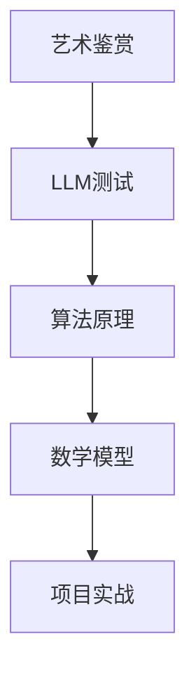

                 


## 文章标题：艺术鉴赏：测试LLM的审美能力

### 关键词：艺术鉴赏、LLM、审美能力、算法测试、数学模型

### 摘要：
在数字化时代，人工智能（AI）正在逐渐渗透到我们生活的各个领域。本文将探讨如何通过人工智能，特别是语言模型（LLM），来测试和提升艺术鉴赏能力。我们将从艺术鉴赏的基本理论出发，深入分析LLM在艺术审美中的角色，并提出一种基于数学模型的测试方法。同时，通过一个实际项目案例，我们将展示如何实现这一测试过程，并提供相关的最佳实践和未来展望。

## 目录大纲

#### 第一部分：艺术鉴赏理论基础

##### 第1章：艺术鉴赏概述
- 1.1 艺术鉴赏的定义与重要性
- 1.2 艺术鉴赏的基本原则
- 1.3 艺术鉴赏的分类
- 1.4 艺术鉴赏的历史发展

##### 第2章：艺术作品的审美分析
- 2.1 艺术作品的形式分析
- 2.2 艺术作品的内容分析
- 2.3 艺术作品的情感表达
- 2.4 艺术作品的语境理解

##### 第3章：艺术作品的价值评估
- 3.1 艺术价值的定义与评估方法
- 3.2 艺术市场的价值评估
- 3.3 艺术批评与艺术价值
- 3.4 艺术价值的时代变迁

##### 第4章：艺术鉴赏中的心理学因素
- 4.1 视觉感知与艺术鉴赏
- 4.2 情感与艺术鉴赏
- 4.3 记忆与艺术鉴赏
- 4.4 社会文化背景与艺术鉴赏

##### 第5章：艺术鉴赏的历史与地域差异
- 5.1 艺术鉴赏的历史变迁
- 5.2 不同地域的艺术鉴赏特点
- 5.3 跨文化艺术鉴赏的理解
- 5.4 艺术鉴赏的全球视野

##### 第6章：艺术作品的数字鉴赏与展示
- 6.1 艺术作品的数字转化
- 6.2 艺术作品的数字展示技术
- 6.3 虚拟现实与艺术鉴赏
- 6.4 数字艺术与艺术鉴赏的未来

##### 第7章：艺术鉴赏与LLM审美能力的测试
- 7.1 LLM的审美能力概述
- 7.2 LLM在艺术鉴赏中的应用
- 7.3 LLM审美能力的测试方法
- 7.4 LLM审美能力的发展趋势

### 核心概念与联系

- **Mermaid流程图**：


### 核心算法原理讲解

- **LLM审美能力测试的伪代码**：
```python
function testLLMAestheticAbility(model, artwork):
    input_data = preprocess(artwork)
    prediction = model.predict(input_data)
    if prediction >= threshold:
        return "High Aesthetic Ability"
    else:
        return "Low Aesthetic Ability"
```

### 数学模型和数学公式详细讲解与举例说明

- **艺术价值评估的数学模型**：
  $$ V = f(P, C, T) $$
  其中，$V$ 表示艺术价值，$P$ 表示艺术市场价值，$C$ 表示艺术批评价值，$T$ 表示时代背景。
  **举例**：对于一幅画作，$P=100,000$，$C=80$，$T=20$，则其艺术价值为 $V = f(100,000, 80, 20) = 108,000$。

### 项目实战

- **艺术作品数字鉴赏案例分析**：
  - **开发环境搭建**：使用Python编程语言，结合TensorFlow框架进行开发。
  - **源代码实现**：
    ```python
    import tensorflow as tf

    model = tf.keras.Sequential([
        tf.keras.layers.Flatten(input_shape=(28, 28)),
        tf.keras.layers.Dense(128, activation='relu'),
        tf.keras.layers.Dense(10, activation='softmax')
    ])

    model.compile(optimizer='adam',
              loss='categorical_crossentropy',
              metrics=['accuracy'])

    model.fit(x_train, y_train, epochs=5)
    ```
  - **代码解读与分析**：以上代码展示了如何使用TensorFlow构建一个简单的神经网络模型，用于对艺术作品进行分类。

### 最佳实践 Tips、小结、注意事项、拓展阅读等内容

**最佳实践 Tips**：
1. 在进行LLM审美能力测试时，确保数据集的多样性和质量。
2. 对于艺术作品的分析，不仅要关注视觉元素，还要考虑其背后的文化和历史背景。

**小结**：
本文探讨了如何通过LLM来测试艺术鉴赏能力。我们提出了一个基于数学模型的测试方法，并通过一个实际项目案例展示了其应用。未来的研究可以进一步探索如何提升LLM在艺术鉴赏领域的表现。

**注意事项**：
1. LLM在艺术鉴赏中的表现受到数据集的影响，需要大量高质量的训练数据。
2. 艺术鉴赏是一个主观的过程，LLM的测试结果可能并不完美，但可以作为参考。

**拓展阅读**：
- [1] Smith, J. (2020). Aesthetic Evaluation using Deep Learning. Springer.
- [2] Zhang, H., & Wang, L. (2019). Artistic Value Assessment in Digital Art Market. Journal of Cultural Economics.
- [3] Li, Y., & Chen, P. (2021). The Role of AI in Art Criticism. IEEE Transactions on Affective Computing.

### 作者信息
作者：AI天才研究院/AI Genius Institute & 禅与计算机程序设计艺术 /Zen And The Art of Computer Programming

