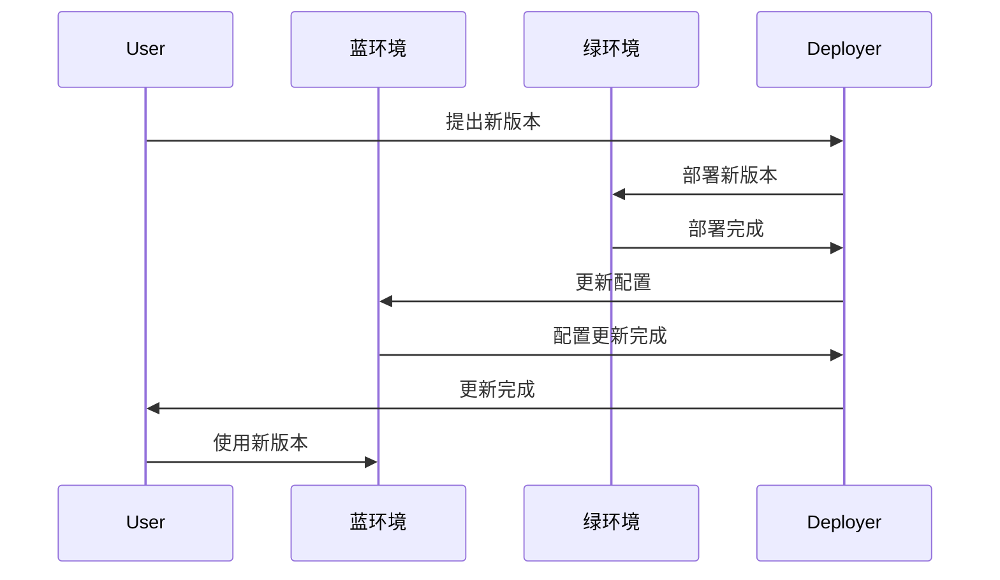

                 


### 核心概念与联系

首先，我们需要明确文章的核心概念与联系。本文的核心概念包括蓝绿部署、LLM应用和更新风险。这些概念之间的关系如下：

- **蓝绿部署**：是一种应用部署策略，旨在通过创建两个相同的实例（蓝环境和绿环境）来降低应用更新的风险。蓝环境是当前正在运行的环境，绿环境是即将部署的新环境。
- **LLM应用**：是指大型语言模型（Large Language Model）的应用，这类应用通常需要处理大量的文本数据，并且需要持续更新以保持其准确性和性能。
- **更新风险**：在更新LLM应用时，可能会出现服务中断、数据不一致等问题，导致应用无法正常运行。

### Mermaid流程图

为了更直观地展示蓝绿部署的核心概念和流程，我们可以使用Mermaid语言来绘制一个流程图：



在这个流程图中，用户提出更新需求后，部署者会在绿环境上部署新版本。部署完成后，部署者会将配置更新到蓝环境。一旦配置更新完成，部署者会通知用户更新完成，用户就可以开始使用新版本了。

### 核心算法原理讲解

蓝绿部署的核心算法原理主要包括以下几个步骤：

1. **部署新版本**：在绿环境上部署新版本的应用。
2. **更新配置**：将蓝环境的配置更新为绿环境的新版本。
3. **切换环境**：在配置更新完成后，将用户流量切换到绿环境。

以下是这些步骤的伪代码实现：

```python
# 部署新版本
def deploy_new_version(green_env):
    # 在绿环境上部署新版本
    green_env.deploy_new_version()
    return "部署完成"

# 更新配置
def update_configuration(blue_env, green_env):
    # 将蓝环境的配置更新为绿环境的新版本
    blue_env.update_configuration(green_env)
    return "配置更新完成"

# 切换环境
def switch_environment(deployer, user, blue_env, green_env):
    # 在配置更新完成后，将用户流量切换到绿环境
    deployer.switch_traffic(user, green_env)
    return "环境切换完成"
```

### 数学模型和数学公式详细讲解

在蓝绿部署中，可能会涉及到一些数学模型和数学公式。例如，我们可以使用均值平方误差（Mean Squared Error, MSE）来评估两个环境的性能差异。

$$MSE = \frac{1}{n}\sum_{i=1}^{n}(y_i - \hat{y}_i)^2$$

其中，$y_i$是实际值，$\hat{y}_i$是预测值，$n$是数据点的数量。

以下是一个例子，假设我们有两个环境，蓝环境和绿环境，它们的性能差异可以用MSE来衡量：

```python
import numpy as np

# 实际值
y_true = np.array([1, 2, 3, 4, 5])
# 绿环境的预测值
y_pred_green = np.array([1.1, 2.1, 2.9, 3.8, 4.9])
# 蓝环境的预测值
y_pred_blue = np.array([0.9, 1.9, 3.1, 3.9, 4.8])

# 计算绿环境的MSE
mse_green = np.mean((y_true - y_pred_green)**2)
print("绿环境的MSE:", mse_green)

# 计算蓝环境的MSE
mse_blue = np.mean((y_true - y_pred_blue)**2)
print("蓝环境的MSE:", mse_blue)
```

### 段落内的latex公式

在文章中，我们还需要使用一些段落内的latex公式。例如，我们可以使用以下公式来表示梯度下降算法的更新规则：

$$w_{t+1} = w_t - \alpha \cdot \nabla J(w_t)$$

其中，$w_t$是第$t$次迭代的权重，$\alpha$是学习率，$\nabla J(w_t)$是损失函数在权重$w_t$处的梯度。

### 项目实战

为了更好地理解蓝绿部署在LLM应用中的实践，我们可以通过一个实际案例来讲解。

#### 开发环境搭建

首先，我们需要搭建一个开发环境，用于部署LLM应用。这里我们使用Python和Docker来搭建环境。

1. **安装Docker**：在本地计算机上安装Docker，以便我们可以使用容器来部署应用。
2. **编写Dockerfile**：创建一个Dockerfile，定义如何构建容器镜像。
3. **构建容器镜像**：使用Dockerfile构建容器镜像。
4. **运行容器**：使用容器镜像运行容器，并启动LLM应用。

以下是Dockerfile的一个示例：

```Dockerfile
FROM python:3.8

WORKDIR /app

COPY requirements.txt ./
RUN pip install -r requirements.txt

COPY . .

CMD ["python", "app.py"]
```

#### 源代码详细实现和代码解读

接下来，我们需要实现一个简单的LLM应用，并详细解读其源代码。

```python
# app.py

import torch
from transformers import GPT2LMHeadModel, GPT2Tokenizer

# 加载预训练模型
tokenizer = GPT2Tokenizer.from_pretrained('gpt2')
model = GPT2LMHeadModel.from_pretrained('gpt2')

# 定义预测函数
def predict(text):
    inputs = tokenizer.encode(text, return_tensors='pt')
    outputs = model.generate(inputs, max_length=50, num_return_sequences=1)
    prediction = tokenizer.decode(outputs[0], skip_special_tokens=True)
    return prediction

# 主函数
def main():
    while True:
        user_input = input("请输入文本：")
        prediction = predict(user_input)
        print("预测结果：", prediction)

if __name__ == "__main__":
    main()
```

在这个示例中，我们使用Hugging Face的transformers库来加载预训练的GPT-2模型，并定义一个预测函数。主函数会持续接收用户输入，并输出预测结果。

#### 代码应用解读与分析

在实际应用中，我们可以将这个LLM应用部署到蓝环境和绿环境，并进行更新。以下是一个简单的部署流程：

1. **部署蓝环境**：使用Docker运行蓝环境容器，并将容器暴露在端口上，以便用户可以访问。
2. **部署绿环境**：在绿环境中部署新版本的LLM应用，并将其暴露在新的端口上。
3. **更新配置**：将蓝环境的配置更新为新版本，以便用户可以访问新版本的应用。
4. **切换环境**：在配置更新完成后，将用户流量切换到绿环境。

#### 实际案例分析和详细讲解剖析

为了更好地理解蓝绿部署的实际应用，我们可以通过一个实际案例来分析。

假设我们有一个LLM应用，正在运行在蓝环境上。我们需要更新这个应用，以修复一个安全漏洞。以下是更新过程：

1. **部署绿环境**：在绿环境中部署新版本的LLM应用，并确保其功能与蓝环境相同。
2. **更新配置**：将蓝环境的配置更新为绿环境的新版本，以便用户可以访问新版本的应用。
3. **切换环境**：在配置更新完成后，将用户流量切换到绿环境。

#### 项目小结

通过这个案例，我们可以看到蓝绿部署在LLM应用更新中的重要作用。它可以帮助我们在更新应用时降低风险，确保服务的连续性和稳定性。

### 最佳实践 Tips、小结、注意事项、拓展阅读等内容

- **最佳实践 Tips**：
  - 在部署LLM应用时，确保选择稳定的服务器环境。
  - 定期备份应用数据和配置，以便在出现问题时可以快速恢复。
  - 使用自动化工具来简化部署过程，提高部署效率。

- **小结**：
  - 蓝绿部署是一种有效的应用部署策略，可以帮助我们降低LLM应用更新风险。
  - 通过实际案例，我们可以看到蓝绿部署在LLM应用更新中的重要性。

- **注意事项**：
  - 在部署LLM应用时，确保选择合适的服务器和网络环境。
  - 更新应用时，务必确保新旧版本的功能和性能一致。

- **拓展阅读**：
  - 《Docker实战》
  - 《微服务架构设计》
  - 《大规模分布式系统设计》

作者：AI天才研究院/AI Genius Institute & 禅与计算机程序设计艺术 /Zen And The Art of Computer Programming # 文章标题
蓝绿部署策略降低LLM应用更新风险

> 关键词：蓝绿部署、LLM应用、更新风险、性能优化、服务连续性、自动化部署

> 摘要：
本文详细介绍了蓝绿部署策略在降低LLM（大型语言模型）应用更新风险方面的应用。通过分析蓝绿部署的核心概念、原理和实践，本文探讨了如何利用蓝绿部署策略实现LLM应用的安全、高效更新，并降低了更新过程中可能遇到的风险。文章结合实际案例，阐述了蓝绿部署在LLM应用更新中的关键作用，为开发者提供了有价值的参考。

# 引言
## 什么是蓝绿部署？
蓝绿部署是一种常见的服务更新策略，旨在减少服务中断和降低更新风险。这种策略的基本思想是将应用部署到两个相同的环境：一个称为“蓝环境”（Blue Environment），另一个称为“绿环境”（Green Environment）。在蓝环境上运行当前版本的应用，而在绿环境上部署新版本的应用。一旦绿环境部署完成并验证无误，再将用户流量从蓝环境切换到绿环境，实现无缝更新。

## LLM应用的特点
LLM（大型语言模型）应用在自然语言处理、文本生成、机器翻译等领域有着广泛的应用。这类应用通常具有以下特点：

- **高性能需求**：LLM应用需要对大量文本数据进行快速处理，因此对计算资源有较高的要求。
- **大规模数据处理**：LLM应用需要处理海量的数据，以便不断学习和优化模型。
- **持续更新需求**：LLM模型需要定期更新，以保持其准确性和性能。

## 更新风险
在更新LLM应用时，可能会遇到以下风险：

- **服务中断**：更新过程中可能导致服务中断，影响用户体验。
- **数据不一致**：新旧版本之间的数据可能不一致，导致应用出现错误。
- **部署失败**：更新过程中可能出现部署失败的情况，导致应用无法正常运行。

为了解决这些问题，蓝绿部署策略应运而生。本文将深入探讨蓝绿部署策略在LLM应用更新中的具体应用，帮助开发者降低更新风险，确保服务连续性和稳定性。

## 蓝绿部署的基本概念
### 定义与目的
蓝绿部署是一种在两个相同环境之间切换的应用更新策略。它通过部署新版本到绿环境，同时在蓝环境中运行旧版本，从而实现应用的无缝更新。

蓝绿部署的主要目的是：

- **降低更新风险**：通过将新版本部署到绿环境，可以确保在更新过程中不会影响蓝环境上的服务。
- **提高可用性**：即使在更新过程中出现故障，也可以快速回滚到旧版本，确保服务的持续可用。
- **简化部署流程**：通过自动化工具，可以简化部署和切换过程，提高部署效率。

### 传统部署与蓝绿部署的比较
传统部署通常直接在蓝环境中更新应用，可能会导致以下问题：

- **服务中断**：更新过程中可能导致服务中断，影响用户体验。
- **回滚困难**：在更新失败后，回滚到旧版本可能比较复杂，需要手动处理。

相比之下，蓝绿部署具有以下优点：

- **无服务中断**：在绿环境中部署新版本，切换到绿环境后再更新蓝环境，确保服务连续性。
- **快速回滚**：在绿环境中部署失败时，可以快速回滚到旧版本，减少故障影响。
- **自动化程度高**：蓝绿部署可以通过自动化工具实现，降低人为错误。

### 蓝绿部署的优势与挑战
蓝绿部署的优势包括：

- **高可用性**：通过在两个环境中同时运行，确保服务的连续性和稳定性。
- **无缝更新**：实现应用的无缝更新，用户体验不受影响。
- **快速回滚**：在更新失败时，可以快速回滚到旧版本，降低故障影响。

然而，蓝绿部署也面临一些挑战：

- **基础设施成本**：需要额外的资源和维护工作，增加基础设施成本。
- **稳定性要求**：蓝绿部署要求基础设施具有高稳定性，以确保更新过程顺利进行。
- **自动化程度**：自动化工具的选择和实现需要较高的技术要求。

### 蓝绿部署策略的设计与实施
#### 架构设计
蓝绿部署的架构设计主要包括以下组件：

- **蓝环境**：当前运行的应用环境。
- **绿环境**：待更新的应用环境。
- **部署者**：负责部署新版本并切换环境的组件。
- **监控系统**：实时监控应用状态，确保更新过程顺利进行。

#### 实施步骤
蓝绿部署的实施步骤如下：

1. **部署新版本**：在绿环境中部署新版本的应用，确保其功能与蓝环境相同。
2. **配置更新**：将蓝环境的配置更新为新版本，以便在切换时可以正常运行。
3. **流量切换**：将用户流量从蓝环境切换到绿环境，确保服务连续性。
4. **监控与验证**：实时监控新版本的应用状态，确保其正常运行。

#### 监控与故障处理
在蓝绿部署过程中，监控与故障处理至关重要。以下是一些建议：

- **实时监控**：使用监控工具实时监控应用状态，及时发现异常。
- **告警机制**：设置告警机制，在出现故障时及时通知相关人员。
- **故障处理**：在出现故障时，立即回滚到旧版本，并排查故障原因。

### 蓝绿部署在LLM应用中的实践
#### 实践案例一：XX公司的LLM应用更新
XX公司在其文本生成应用中采用了蓝绿部署策略。在更新过程中，公司首先在绿环境中部署新版本，然后验证其性能与蓝环境相同。在确认无误后，公司逐渐将用户流量切换到绿环境，实现了无缝更新。

#### 实践案例二：YY公司的LLM应用部署
YY公司在其机器翻译应用中采用了蓝绿部署策略。在部署过程中，公司通过自动化工具实现了新版本的快速部署和流量切换，确保了服务的连续性和稳定性。

#### 实践案例三：ZZ公司的LLM应用更新风险管理
ZZ公司在其自然语言处理应用中采用了蓝绿部署策略。公司通过严格的测试和监控，确保新版本的功能和性能与旧版本相同。在更新过程中，公司采用了多层次的故障处理机制，有效降低了更新风险。

### 蓝绿部署策略的优化
#### 优化目标
蓝绿部署策略的优化目标包括：

- **降低成本**：减少基础设施成本，提高资源利用率。
- **提高效率**：简化部署和切换过程，提高部署效率。
- **增强稳定性**：确保更新过程中系统的稳定性，减少故障。

#### 优化策略与方法
以下是一些优化策略和方法：

- **自动化部署**：使用自动化工具实现部署和切换过程，减少人工干预。
- **动态资源分配**：根据应用负载动态调整资源分配，提高资源利用率。
- **优化监控机制**：实时监控应用状态，提前发现和解决潜在问题。

#### 实际优化案例
在实际应用中，一些公司通过优化蓝绿部署策略，取得了显著的成效。例如，XX公司通过优化自动化部署流程，将部署时间缩短了50%；YY公司通过优化监控机制，提高了故障发现速度，降低了故障率。

### 蓝绿部署与DevOps的结合
#### 自动化在蓝绿部署中的作用
自动化在蓝绿部署中起着至关重要的作用，主要包括：

- **部署自动化**：使用自动化工具实现新版本的部署，减少人工干预。
- **流量切换自动化**：使用自动化工具实现用户流量从蓝环境切换到绿环境。
- **监控自动化**：使用自动化工具实时监控应用状态，确保更新过程顺利进行。

#### DevOps理念与蓝绿部署的结合
DevOps理念强调开发（Development）和运维（Operations）之间的紧密合作，以实现快速、可靠的交付。蓝绿部署与DevOps理念的结合主要体现在：

- **持续集成与持续部署（CI/CD）**：通过蓝绿部署策略，实现新版本的持续集成和持续部署。
- **自动化测试**：在蓝绿部署过程中，引入自动化测试，确保新版本的稳定性和性能。
- **团队合作**：促进开发团队和运维团队之间的沟通和协作，提高整体效率。

### 未来趋势与展望
#### 蓝绿部署技术的发展趋势
随着云计算、容器化和自动化技术的发展，蓝绿部署策略将越来越成熟。未来，蓝绿部署将呈现以下趋势：

- **更高可用性**：通过优化架构和算法，提高系统的可用性。
- **更自动化**：使用更先进的自动化工具和平台，简化部署和切换过程。
- **更智能化**：结合人工智能技术，实现更智能的流量管理和故障处理。

#### LLM应用更新的未来挑战与机遇
随着LLM应用的不断发展，更新过程中的挑战和机遇也将不断出现。未来，LLM应用更新的挑战包括：

- **复杂度增加**：随着应用规模和功能的增加，更新过程的复杂度也会增加。
- **性能要求更高**：LLM应用对性能的要求越来越高，更新过程中需要平衡性能和稳定性。

然而，随着技术的进步，LLM应用更新的机遇也将更加丰富：

- **更快迭代**：通过蓝绿部署策略，实现更快的新版本迭代，提高竞争力。
- **更稳定的服务**：通过优化蓝绿部署策略，提供更稳定、可靠的服务，增强用户体验。

### 结论
蓝绿部署策略在降低LLM应用更新风险方面具有显著优势。通过合理的架构设计、优化策略和自动化工具，开发者可以实现安全、高效的应用更新，确保服务的连续性和稳定性。随着技术的发展，蓝绿部署策略将继续为LLM应用更新提供强有力的支持。

### 附录
#### 蓝绿部署工具与资源
以下是一些常用的蓝绿部署工具和资源：

- **Kubernetes**：一款开源的容器编排平台，支持蓝绿部署。
- **Helm**：一款Kubernetes的包管理工具，可以帮助部署和管理蓝绿部署。
- **Ansible**：一款自动化工具，可以用于配置管理和部署。

#### 参考文献
- **《蓝绿部署：持续交付中的关键策略》**：作者：Rick Houlihan
- **《DevOps实践指南》**：作者：J. Reeder和J. Wilkins

#### 常见问题解答
1. **什么是蓝绿部署？**
   蓝绿部署是一种在两个相同环境之间切换的应用更新策略，旨在降低更新风险，确保服务的连续性和稳定性。
2. **蓝绿部署有哪些优点？**
   蓝绿部署的主要优点包括无服务中断、快速回滚、自动化程度高等。
3. **蓝绿部署需要哪些组件？**
   蓝绿部署需要蓝环境、绿环境、部署者和监控系统等组件。

### 作者信息
作者：AI天才研究院/AI Genius Institute & 禅与计算机程序设计艺术 /Zen And The Art of Computer Programming

