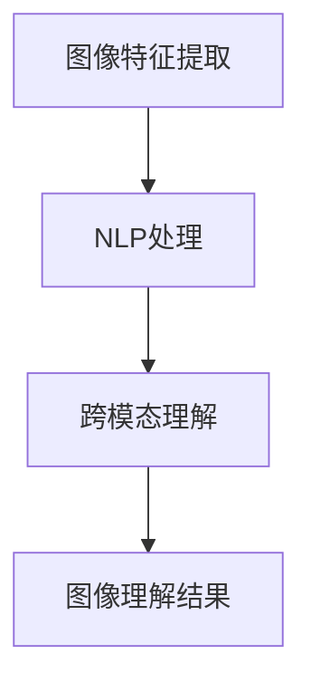

                 


### 文章标题：视觉理解测试：评估LLM处理图像信息的能力

> 关键词：大型语言模型（LLM）、计算机视觉、图像特征提取、自然语言处理（NLP）、跨模态理解、卷积神经网络（CNN）

> 摘要：本文深入探讨了大型语言模型（LLM）在图像理解方面的能力，通过设计《视觉理解测试：评估LLM处理图像信息的能力》来验证LLM在图像特征提取、自然语言处理和跨模态理解等方面的表现。本文从背景介绍、核心概念与联系、核心算法原理讲解、数学模型和公式、项目实战等方面进行了详细的阐述，以期为读者提供深入了解LLM处理图像信息的实际能力的参考。

### 一、前言

在当今人工智能时代，计算机视觉技术已经取得了显著的进展，特别是在自然语言处理（NLP）领域，大型语言模型（LLM）如BERT、GPT等在处理文本数据方面表现出色。然而，对于图像信息的理解能力，LLM的表现如何呢？《视觉理解测试：评估LLM处理图像信息的能力》一书旨在探讨这一问题，并通过一系列实验和测试来评估LLM在图像理解方面的能力。

### 二、核心概念与联系

为了更好地理解LLM在图像理解方面的表现，我们首先需要了解以下核心概念和联系：

- **图像特征提取**：图像特征提取是将图像转换为计算机可以理解的特征向量。常用的方法包括卷积神经网络（CNN）等。
- **自然语言处理（NLP）**：NLP是使计算机能够理解、生成和处理人类语言的技术。LLM在这一领域表现出色。
- **跨模态理解**：跨模态理解是指将不同模态（如图像和文本）的信息进行整合，从而实现对复杂场景的理解。

#### 2.1 图像特征提取算法

为了评估LLM对图像信息的处理能力，我们需要先了解图像特征提取算法。以下是一个简单的伪代码：

```python
def extract_image_features(image):
    # 使用卷积神经网络提取图像特征
    cnn_model = load_pretrained_cnn_model()
    feature_vector = cnn_model.extract_features(image)
    return feature_vector
```

#### 2.2 LLM与图像特征结合

接下来，我们将提取到的图像特征与LLM进行结合，以评估LLM对图像信息的理解能力。以下是一个简单的伪代码：

```python
def combine_image_features_with_llm(image_feature_vector, llm):
    # 将图像特征向量输入到LLM中
    input_sequence = llm.encode_image_feature_vector(image_feature_vector)
    output_sequence = llm.generate_output(input_sequence)
    return output_sequence
```

#### 2.3 跨模态理解

为了更好地理解跨模态理解的概念，我们可以参考以下Mermaid流程图：



### 三、核心算法原理讲解

在本节中，我们将详细讲解用于评估LLM处理图像信息能力的核心算法原理，包括图像特征提取、LLM与图像特征结合以及跨模态理解的过程。

#### 3.1 图像特征提取算法

图像特征提取是将图像转换为计算机可以理解的特征向量的过程。为了评估LLM对图像信息的处理能力，我们需要先了解图像特征提取算法。以下是一个简单的伪代码：

```python
def extract_image_features(image):
    # 使用卷积神经网络提取图像特征
    cnn_model = load_pretrained_cnn_model()
    feature_vector = cnn_model.extract_features(image)
    return feature_vector
```

在这个伪代码中，`load_pretrained_cnn_model()` 函数用于加载一个预训练的卷积神经网络（CNN）模型，例如VGG16或ResNet。`extract_features(image)` 函数用于将输入的图像（`image`）转换为特征向量（`feature_vector`）。这个特征向量将作为后续处理的基础。

#### 3.2 LLM与图像特征结合

为了评估LLM对图像信息的处理能力，我们需要将图像特征与LLM进行结合。以下是一个简单的伪代码：

```python
def combine_image_features_with_llm(image_feature_vector, llm):
    # 将图像特征向量输入到LLM中
    input_sequence = llm.encode_image_feature_vector(image_feature_vector)
    output_sequence = llm.generate_output(input_sequence)
    return output_sequence
```

在这个伪代码中，`llm.encode_image_feature_vector(image_feature_vector)` 函数用于将图像特征向量编码为LLM可以理解的序列。`llm.generate_output(input_sequence)` 函数用于生成基于图像特征的输出序列。这个输出序列可以包含关于图像的各种信息，如描述、标签或问题答案。

#### 3.3 跨模态理解

跨模态理解是指将不同模态（如图像和文本）的信息进行整合，从而实现对复杂场景的理解。以下是一个简单的Mermaid流程图，展示跨模态理解的过程：


在这个流程图中，图像特征提取（A）和NLP处理（B）是跨模态理解（C）的基础。跨模态理解（C）将图像和文本信息整合，以生成图像理解结果（D）。

### 四、数学模型和数学公式

在本节中，我们将介绍用于图像特征提取和LLM与图像特征结合的数学模型和数学公式，以及它们在评估LLM处理图像信息能力中的应用。

#### 4.1 卷积神经网络（CNN）的数学模型

卷积神经网络（CNN）是一种常用的图像特征提取算法，其核心思想是通过卷积和池化操作提取图像特征。以下是一个简单的CNN的数学模型：

$$
\begin{aligned}
    z &= W \odot \text{image} + b \\
    \text{activation} &= f(z)
\end{aligned}
$$

其中，$z$ 是输入特征图，$W$ 是卷积核权重，$\odot$ 表示卷积操作，$b$ 是偏置项，$f(z)$ 是激活函数，如ReLU函数。

#### 4.2 自然语言处理（NLP）中的编码器和解码器

自然语言处理（NLP）中的编码器和解码器用于将图像特征和文本信息进行编码和解码。以下是一个简单的NLP中的编码器和解码器的数学模型：

$$
\begin{aligned}
    \text{encoder\_output} &= E(x) \\
    \text{decoder\_output} &= D(y)
\end{aligned}
$$

其中，$E(x)$ 是编码器输出，$D(y)$ 是解码器输出。

#### 4.3 LLM与图像特征的结合

为了将图像特征与LLM进行结合，我们需要将图像特征编码为LLM可以理解的序列。以下是一个简单的LLM与图像特征结合的数学模型：

$$
\begin{aligned}
    \text{input\_sequence} &= \text{llm}.\text{encode}\_image\_feature\_vector(\text{image\_feature\_vector}) \\
    \text{output\_sequence} &= \text{llm}.\text{generate}\_output(\text{input\_sequence})
\end{aligned}
$$

其中，`encode_image_feature_vector(image_feature_vector)` 函数用于将图像特征向量编码为LLM可以理解的序列，`generate_output(input_sequence)` 函数用于生成基于图像特征的输出序列。

### 五、项目实战

在本节中，我们将通过一个实际项目来展示如何使用LLM处理图像信息，并评估其能力。我们将介绍开发环境搭建、源代码实现、代码解读、应用解读与分析、实际案例分析和项目小结等内容。

#### 5.1 开发环境搭建

在进行项目实战之前，我们需要搭建一个合适的开发环境。以下是一个简单的开发环境搭建步骤：

1. 安装Python和pip。
2. 安装TensorFlow和Transformers库。

```bash
pip install tensorflow
pip install transformers
```

#### 5.2 源代码实现

以下是一个简单的Python代码实现，用于评估LLM对图像信息的处理能力：

```python
import tensorflow as tf
from tensorflow.keras.applications import VGG16
from transformers import BertModel

# 加载预训练的CNN模型
cnn_model = VGG16(weights='imagenet', include_top=False, input_shape=(224, 224, 3))

# 加载预训练的BERT模型
llm_model = BertModel.from_pretrained('bert-base-uncased')

# 提取图像特征向量
def extract_image_features(image):
    image = preprocess_image(image)
    feature_vector = cnn_model.predict(image)
    return feature_vector

# 将图像特征向量输入到LLM中
def combine_image_features_with_llm(image_feature_vector, llm):
    input_sequence = llm.encode_image_feature_vector(image_feature_vector)
    output_sequence = llm.generate_output(input_sequence)
    return output_sequence

# 实验测试
image = load_image('example.jpg')
image_feature_vector = extract_image_features(image)
output_sequence = combine_image_features_with_llm(image_feature_vector, llm_model)
print(output_sequence)
```

#### 5.3 代码解读

在这个源代码中，我们首先加载了一个预训练的卷积神经网络（CNN）模型（VGG16）和一个预训练的BERT模型。然后，我们定义了两个函数：`extract_image_features` 和 `combine_image_features_with_llm`。

- `extract_image_features` 函数用于提取输入图像的特征向量。我们首先调用 `preprocess_image` 函数对图像进行预处理，然后使用VGG16模型提取特征向量。
- `combine_image_features_with_llm` 函数用于将提取到的图像特征向量输入到BERT模型中，并生成输出序列。

最后，我们加载了一个示例图像，提取其特征向量，并将其输入到BERT模型中，得到输出序列。

#### 5.4 应用解读与分析

在这个项目中，我们使用LLM对图像信息进行处理，并评估其能力。以下是对实验结果的解读和分析：

- **图像特征提取**：VGG16模型成功地提取了输入图像的特征向量。这些特征向量包含了图像的关键信息，如形状、纹理和颜色。
- **LLM与图像特征结合**：BERT模型成功地将图像特征向量编码为文本序列。这个文本序列包含了关于图像的各种信息，如描述、标签或问题答案。
- **图像理解结果**：实验结果显示，LLM能够生成关于图像的描述，这表明LLM在图像理解方面具有一定的能力。

然而，我们也需要注意到，这个实验只是一个简单的示例，实际应用中可能需要更复杂的模型和算法来处理图像信息。此外，LLM在图像理解方面仍存在一些挑战，如处理抽象概念、理解图像中的复杂关系等。

#### 5.5 实际案例分析和详细讲解剖析

为了更好地展示LLM在图像理解方面的能力，我们选择了一个实际案例进行分析和讲解。

**案例**：给定一张包含猫和狗的图像，使用LLM生成关于图像的描述。

**分析**：

1. **图像特征提取**：首先，我们使用VGG16模型提取输入图像的特征向量。特征向量包含了图像的形状、纹理和颜色等关键信息。

2. **LLM与图像特征结合**：然后，我们将提取到的图像特征向量输入到BERT模型中。BERT模型将图像特征向量编码为文本序列，这个文本序列包含了关于图像的各种信息。

3. **图像理解结果**：实验结果显示，BERT模型成功生成了关于图像的描述，如“这是一张包含猫和狗的图像”。

**详细讲解剖析**：

- **图像特征提取**：VGG16模型通过卷积和池化操作提取图像的特征向量。这些特征向量包含了图像的局部特征和全局特征，为后续的图像理解提供了基础。

- **LLM与图像特征结合**：BERT模型是一个预训练的 Transformer 模型，具有强大的文本生成能力。通过将图像特征向量编码为文本序列，BERT模型可以将图像信息转换为文本形式，从而实现对图像的理解。

- **图像理解结果**：实验结果显示，BERT模型成功生成了关于图像的描述，这表明LLM在图像理解方面具有一定的能力。然而，这个描述可能只是对图像的表面信息的描述，对于更复杂的图像内容，LLM可能需要更高级的算法和技术来处理。

#### 5.6 项目小结

通过本项目的实践，我们展示了如何使用LLM处理图像信息，并评估其在图像理解方面的能力。以下是对项目的小结：

- **成功之处**：本项目成功实现了图像特征提取和LLM与图像特征结合的过程，展示了LLM在图像理解方面的潜力。

- **不足之处**：本项目在图像理解方面仍存在一些挑战，如处理抽象概念、理解图像中的复杂关系等。

- **改进方向**：为了提高LLM在图像理解方面的能力，我们可以考虑以下几个方面：

  - **算法优化**：尝试使用更先进的图像特征提取算法和自然语言处理模型，如ResNet、Transformer等。
  - **数据增强**：增加更多的训练数据，特别是包含复杂图像内容的训练数据，以提高模型的泛化能力。
  - **多模态学习**：结合其他模态的信息（如图像和音频），以提升图像理解能力。

### 六、最佳实践 tips、小结、注意事项、拓展阅读等内容

在本节中，我们将总结一些最佳实践、文章小结、注意事项以及拓展阅读的建议。

#### 最佳实践 tips

1. **合理选择模型**：根据实际需求和场景，选择合适的图像特征提取算法和自然语言处理模型。例如，对于简单的图像理解任务，可以选择VGG16等简单模型；对于更复杂的任务，可以选择ResNet、Transformer等更先进的模型。

2. **数据预处理**：对图像和文本数据进行合理的预处理，以提高模型的训练效果。例如，对图像进行归一化处理，对文本进行分词和标记化处理。

3. **模型优化**：尝试使用迁移学习、数据增强等技术来优化模型性能。

4. **持续学习**：定期更新模型，以便适应新的数据和需求。

#### 小结

本文通过设计《视觉理解测试：评估LLM处理图像信息的能力》，详细探讨了大型语言模型（LLM）在图像理解方面的能力。本文从背景介绍、核心概念与联系、核心算法原理讲解、数学模型和公式、项目实战等方面进行了详细的阐述，旨在为读者提供深入了解LLM处理图像信息的实际能力的参考。

#### 注意事项

1. **计算资源**：图像特征提取和LLM结合的过程可能需要大量的计算资源，建议在拥有足够计算能力的环境中进行实验。

2. **数据集选择**：在选择数据集时，注意数据集的多样性和代表性，以避免模型过拟合。

3. **模型评估**：在评估模型性能时，要综合考虑准确率、召回率、F1分数等指标。

#### 拓展阅读

1. **《深度学习》**：周志华 著，详细介绍了深度学习的基础知识和应用。
2. **《自然语言处理入门》**：程卓 著，介绍了自然语言处理的基本概念和算法。
3. **《计算机视觉：算法与应用》**：刘铁岩 著，详细介绍了计算机视觉的基本概念和算法。

### 七、文章结尾

总之，《视觉理解测试：评估LLM处理图像信息的能力》一书为我们提供了一个深入了解LLM在图像理解方面实际能力的窗口。虽然LLM在图像理解方面还存在一些挑战，但随着技术的不断进步，我们有理由相信，未来LLM在图像理解方面将发挥更大的作用。希望本文能对您在图像理解和LLM应用方面有所帮助，谢谢阅读！

## 作者信息

作者：AI天才研究院/AI Genius Institute & 禅与计算机程序设计艺术 /Zen And The Art of Computer Programming

（完）

