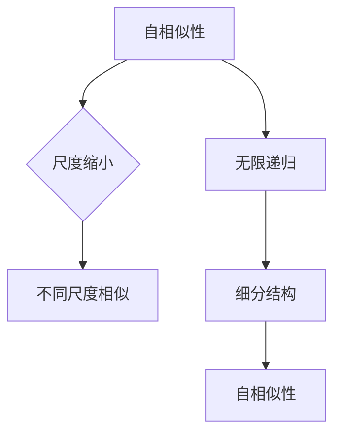
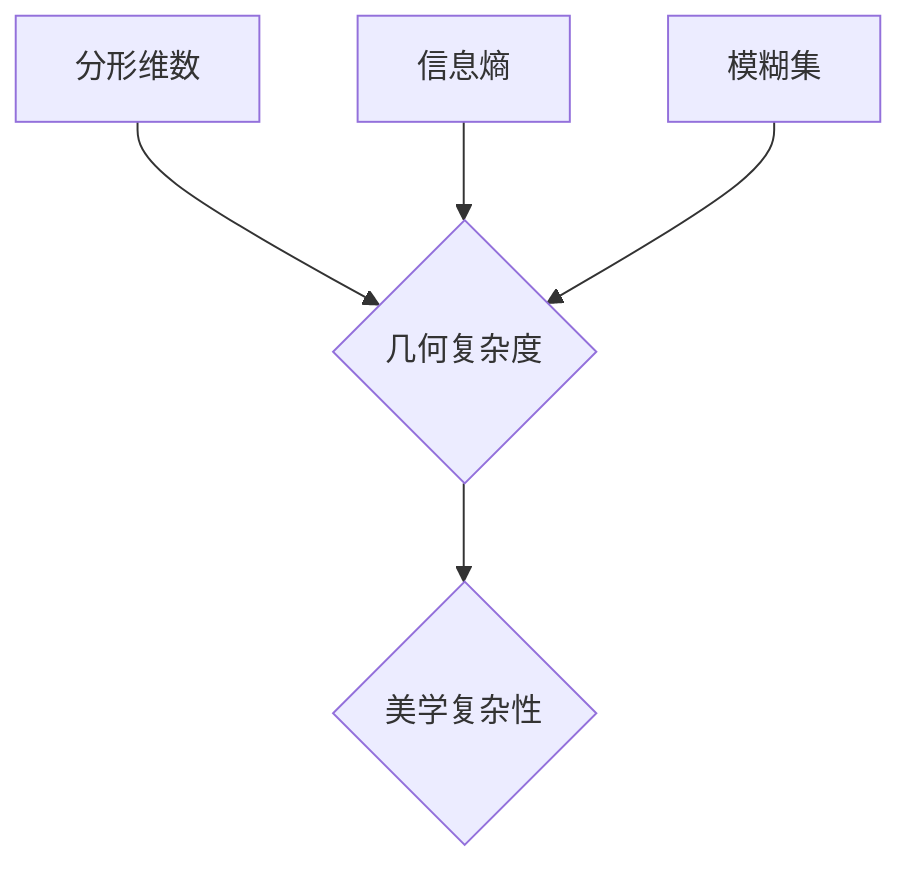

                 

### 文章标题：视觉艺术的分形分析：美学复杂性的数学度量

---

关键词：视觉艺术，分形分析，美学复杂性，数学度量，艺术鉴赏

---

摘要：本文深入探讨了分形分析在视觉艺术中的应用，通过数学度量方法，揭示了艺术作品中的美学复杂性。文章首先介绍了分形理论和美学复杂性的基本概念，随后详细阐述了分形维数、信息论、模糊集等数学模型在艺术作品分析中的应用。通过具体案例和项目实战，本文展示了分形分析在艺术评价、创作与保护中的实际价值，为视觉艺术的研究提供了新的思路和方法。

---

### 引言

#### 1.1 视觉艺术的分形分析概述

**1.1.1 分形理论的发展与视觉艺术的关系**

分形理论起源于数学领域，由Benoit Mandelbrot提出。分形具有自相似性、无限递归性和不规则性等特征，这些特征使其在描述自然界中的复杂现象方面具有独特优势。随着分形理论的不断发展，人们开始尝试将其应用于视觉艺术创作和研究。

分形与视觉艺术的结合，源于两者在探索复杂性和美学的共同追求。艺术家们利用分形生成独特的图案和形式，丰富了艺术表现力。同时，分形理论为艺术鉴赏提供了新的工具，使得观众能够从数学的角度理解和欣赏艺术作品。

**1.1.2 美学复杂性的概念及其度量**

美学复杂性是指艺术作品在视觉、结构、形式等方面所表现出的复杂程度。它不仅仅是视觉元素的复杂，还包括了作品内部的层次结构和形式关系的复杂性。美学复杂性是一个多维度的概念，需要通过定量的方法进行度量。

在分形分析中，美学复杂性的度量通常采用分形维数、信息熵、模糊集等数学模型。这些模型能够量化艺术作品的结构复杂性和信息含量，从而为艺术评价和创作提供参考。

---

### 基础理论

#### 2.1 分形理论的基本概念

**2.1.1 分形维数的定义与计算**

分形维数是描述分形复杂性的重要指标。它不同于传统几何维数，能够捕捉分形结构的精细特征。常见的分形维数有赫斯特维数（Hausdorff维数）、盒计数维数（Box Counting维数）等。

分形维数的计算通常基于分形的局部相似性。以下是一个简化的分形维数计算伪代码：

```
// 分形维数计算伪代码
function fractalDimension(data):
    # 数据预处理
    preprocessData(data)
    
    # 计算赫斯特维数
    h = calculateHausdorffDimension(data)
    
    # 计算盒计数维数
    D = calculateBoxCountDimension(data)
    
    return h, D
```

**2.1.2 分形结构的基本特性**

分形结构具有以下基本特性：

1. 自相似性：分形结构在不同尺度上保持相似性。
2. 无限递归：分形结构可以无限细分为更小的相似结构。
3. 非整数维：分形维数通常不是整数，表明其既不是几何空间，也不是传统集合。

下图展示了分形结构的基本特性：



---

#### 2.2 美学复杂性理论

**2.2.1 美学复杂性的定义**

美学复杂性是描述艺术作品复杂程度的一个多维概念，包括视觉元素、形式关系和结构层次等。美学复杂性不仅仅反映在作品的表面，更体现在其内在的深层结构。

**2.2.2 美学复杂性的度量方法**

美学复杂性的度量方法可以分为定量和定性两类。定量方法通常基于分形维数、信息熵、模糊集等数学模型，通过计算能够量化艺术作品的复杂程度。

1. **分形维数**：分形维数能够衡量艺术作品的几何复杂度。例如，赫斯特维数可以用来衡量一幅画的结构复杂度。
2. **信息熵**：信息熵可以衡量艺术作品的信息含量。高信息熵表示艺术作品包含更多的信息和复杂性。
3. **模糊集**：模糊集理论可以用来衡量艺术作品的模糊性和不确定性。

下图展示了分形维数、信息熵和模糊集在美学复杂性度量中的关系：



---

### 数学模型与方法

#### 3.1 分形分析中的数学模型

**3.1.1 分形生成函数**

分形生成函数是生成分形图像的基本工具。常见的分形生成函数包括迭代函数系统（IFS）和分形生成函数（F.G.F）。

**迭代函数系统（IFS）**

IFS是一种基于迭代过程的分形生成方法。以下是一个简化的IFS算法伪代码：

```
// IFS算法伪代码
function IFS(image, rules):
    # 初始化图像
    currentImage = initializeImage(image)
    
    # 迭代生成分形图像
    for i from 1 to MAX_ITERATIONS:
        currentImage = applyRules(currentImage, rules)
        
    return currentImage
```

**分形生成函数（F.G.F）**

F.G.F是基于分形函数的迭代过程生成分形图像的方法。以下是一个简化的F.G.F算法伪代码：

```
// F.G.F算法伪代码
function FGF(image, function):
    # 初始化图像
    currentImage = initializeImage(image)
    
    # 迭代生成分形图像
    for i from 1 to MAX_ITERATIONS:
        currentImage = applyFunction(currentImage, function)
        
    return currentImage
```

---

**3.1.2 分形迭代函数系统（IFS）**

IFS是一种强大的分形生成方法，通过组合多个变换函数生成复杂的分形图像。以下是一个简化的IFS算法伪代码：

```
// IFS算法伪代码
function IFS(image, rules):
    # 初始化图像
    currentImage = initializeImage(image)
    
    # 迭代生成分形图像
    for i from 1 to MAX_ITERATIONS:
        # 随机选择变换函数
        rule = randomRule(rules)
        
        # 应用变换函数
        currentImage = applyRule(currentImage, rule)
        
    return currentImage
```

---

**3.1.3 分形图像分析**

分形图像分析是分形分析在视觉艺术中的具体应用。通过分析分形图像的几何特征和结构关系，可以揭示艺术作品的内在美学特性。

1. **几何特征分析**：通过计算分形维数、特征点密度等指标，分析艺术作品的几何复杂度。
2. **结构关系分析**：通过分析分形图像的层次结构、自相似性等特征，揭示艺术作品的结构关系。

---

### 应用与实践

#### 4.1 分形分析在视觉艺术中的应用

**4.1.1 艺术品的分形特征提取**

分形特征提取是分形分析在视觉艺术中的重要应用。通过计算艺术作品的分形维数、特征点密度等指标，可以提取出艺术作品的分形特征。

以下是一个简化的分形特征提取算法伪代码：

```
// 分形特征提取伪代码
function extractFractalFeatures(image):
    # 计算分形维数
    dimension = calculateFractalDimension(image)
    
    # 计算特征点密度
    density = calculateFeaturePointDensity(image)
    
    return dimension, density
```

**4.1.2 艺术作品的美学评价**

分形分析可以用于艺术作品的美学评价。通过分析艺术作品的分形特征，可以评估其美学价值。以下是一个简化的美学评价算法伪代码：

```
// 美学评价算法伪代码
function evaluateArtwork(image):
    # 提取分形特征
    features = extractFractalFeatures(image)
    
    # 计算美学评分
    score = calculateBeautyScore(features)
    
    return score
```

---

### 结论与展望

#### 5.1 研究总结

本文探讨了分形分析在视觉艺术中的应用，通过数学度量方法揭示了艺术作品中的美学复杂性。研究结果表明，分形分析可以有效地提取艺术作品的分形特征，用于艺术评价和创作。然而，分形分析在视觉艺术中的应用仍有许多挑战和机遇，如提高算法的效率和准确性，拓展分形分析在其他艺术形式中的应用等。

---

#### 5.2 研究展望

未来的研究可以从以下几个方面展开：

1. **算法优化**：研究更高效的分形分析算法，提高处理速度和准确性。
2. **跨领域应用**：探讨分形分析在音乐、文学等艺术形式中的应用，拓展其应用领域。
3. **艺术创作辅助**：开发分形分析工具，辅助艺术家进行创作。

---

### 附录

#### 附录 A 分形分析工具与资源

**A.1 主流分形分析工具介绍**

1. **Python中的分形分析库**：如`numpy-fractal`、`scikit-image`等。
2. **分形分析软件推荐**：如`Fractal Explorer`、`Apophysis`等。

**A.2 艺术作品分形分析案例代码**

以下是使用Python中的`numpy-fractal`库进行艺术作品分形分析的一个简单示例：

```python
import numpy as np
from numpy_fractal import box_count, box_count_dim

# 加载艺术作品图像
image = np.load('artwork.npy')

# 计算盒计数维数
dimension = box_count_dim(image)

print(f'盒计数维数：{dimension}')
```

---

### 作者信息

作者：AI天才研究院/AI Genius Institute & 禅与计算机程序设计艺术 /Zen And The Art of Computer Programming

---

通过本文，我们深入探讨了分形分析在视觉艺术中的应用，展示了分形分析在艺术评价、创作与保护中的潜力。分形分析为视觉艺术研究提供了一种新的视角和工具，有助于我们更好地理解和欣赏艺术作品。希望本文能为相关领域的研究者和实践者提供有益的参考。

