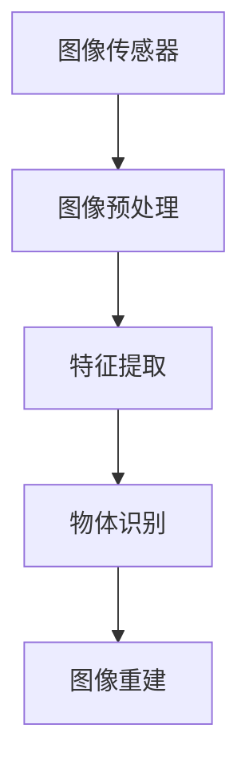
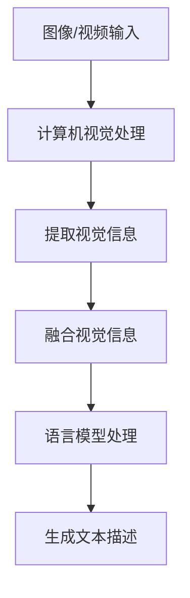

                 

## 引言

### 计算机视觉与语言模型概述

计算机视觉（Computer Vision）是人工智能的一个重要分支，旨在使计算机具备从图像和视频中提取信息的能力。这一领域的研究包括图像处理、物体识别、场景解析和图像生成等多个方面。而语言模型（Language Model，简称LM）是自然语言处理（Natural Language Processing，简称NLP）的核心技术，其主要任务是理解和生成人类语言。

近年来，随着深度学习技术的发展，计算机视觉和语言模型都取得了显著的进步。计算机视觉技术从传统的图像识别，逐步发展到了更复杂的场景理解和交互式系统。而语言模型从早期的规则驱动方法，发展到如今基于大规模数据训练的复杂神经网络。这两个领域的快速发展，使得它们在很多实际应用中相辅相成，共同推动了人工智能的进步。

### 计算机视觉与LLM的结合

计算机视觉和语言模型的结合，不仅能够提升计算机对图像和视频的理解能力，还能够增强语言模型对现实世界的感知能力。这种结合可以通过多种方式实现：

1. **图像与文本的交叉识别**：语言模型可以基于图像中的内容，生成相关的描述或回答。例如，当用户上传一张照片，语言模型可以生成照片的描述或回答用户的问题。

2. **视觉信息增强语言生成**：语言模型可以结合图像信息，生成更加具体、丰富的文本内容。例如，在图像描述生成任务中，视觉信息可以帮助语言模型更准确地描述图像内容。

3. **多模态交互**：结合计算机视觉和语言模型，可以创建出多模态交互系统，例如智能助手或虚拟现实应用，用户可以通过语音、图像等多种方式进行交互。

### 本文的目的与结构

本文旨在探讨如何利用计算机视觉技术拓展语言模型（LLM）的感知能力。文章将分为以下几个部分：

1. **计算机视觉技术基础**：介绍计算机视觉的核心算法和原理，包括图像处理、深度学习等。

2. **语言模型技术基础**：介绍语言模型的核心算法和原理，包括统计模型、神经网络等。

3. **计算机视觉与LLM的结合**：详细讨论如何将计算机视觉技术应用于LLM，以及如何提升LLM的感知能力。

4. **项目实战**：通过实际项目案例，展示如何实现计算机视觉与LLM的结合，并提升感知能力。

5. **未来展望**：分析计算机视觉与LLM结合的发展趋势和挑战。

通过以上几个部分的详细讨论，本文希望能够为读者提供一个全面、系统的理解，并激发对这一领域更深入的探索和研究。

### 关键词

- 计算机视觉
- 语言模型
- 深度学习
- 图像处理
- 多模态交互
- 感知能力拓展

### 摘要

本文主要探讨如何利用计算机视觉技术拓展语言模型（LLM）的感知能力。首先，介绍了计算机视觉和语言模型的基本概念和原理，随后详细讲解了它们的核心算法和原理。接着，本文重点讨论了如何将计算机视觉技术应用于语言模型，并通过实例展示了具体的实现方法。最后，本文对未来计算机视觉与语言模型结合的发展趋势和挑战进行了展望。通过本文的阅读，读者可以全面了解计算机视觉和语言模型结合的理论基础和实践应用，为相关领域的研究和应用提供参考。

## 计算机视觉技术基础

### 视觉感知基本概念

视觉感知是计算机视觉的核心概念之一，它涉及计算机如何模拟人类视觉系统，从图像中提取有用的信息。视觉感知的基本概念包括以下几个方面：

1. **图像传感器**：图像传感器是获取图像信息的重要设备。常见的图像传感器包括相机、摄像头和扫描仪等。这些设备可以捕捉二维或三维图像，并将其转换为数字信号。

2. **图像预处理**：图像预处理是图像分析前的必要步骤，包括图像去噪、对比度增强、大小调整等。这些预处理操作可以提高图像质量，从而有助于后续的图像分析。

3. **特征提取**：特征提取是视觉感知的重要环节，它旨在从图像中提取出具有区分性的特征，如边缘、角点、纹理等。这些特征可以作为后续图像分析和识别的依据。

4. **物体识别**：物体识别是计算机视觉的一个基本任务，它旨在从图像中识别出特定的物体。物体识别可以通过多种方法实现，如基于规则的方法、统计模型和深度学习等方法。

### 视觉感知基本原理

视觉感知的基本原理涉及到人眼和大脑如何处理视觉信息。以下是几个关键点：

1. **视觉信号处理**：人眼通过视网膜接收光线，并将其转换为电信号。大脑通过视觉皮层对这些电信号进行处理，最终生成我们对视觉世界的感知。

2. **图像重建**：从二维图像中重建三维世界是视觉感知的一个重要任务。这通常涉及到立体视觉和运动视觉等概念。立体视觉通过比较两个视角的图像，重建物体的三维结构；运动视觉则通过分析物体在视觉场景中的运动，推断其位置和速度。

3. **模式识别**：模式识别是视觉感知的核心，它涉及从图像中识别和分类不同的模式。大脑通过学习大量的视觉数据，建立了一套复杂的模式识别机制，使其能够快速准确地识别物体和场景。

### 图像处理技术

图像处理是计算机视觉的重要组成部分，它包括多个技术领域。以下是几个主要的图像处理技术：

1. **图像滤波**：图像滤波用于去除图像中的噪声和模糊。常见的滤波方法包括均值滤波、高斯滤波和中值滤波等。

2. **图像分割**：图像分割是将图像划分为不同的区域或对象。常用的图像分割方法包括阈值分割、区域生长和边缘检测等。

3. **图像特征提取**：图像特征提取是从图像中提取出具有区分性的特征，如边缘、角点、纹理和形状等。这些特征可以用于后续的物体识别和分类。

4. **图像重建**：图像重建是从原始图像中恢复出物体或场景的原始形态。常见的图像重建方法包括立体匹配、单视点重建和多视点重建等。

### 深度学习与神经网络

深度学习（Deep Learning）是计算机视觉领域的重要技术，它通过多层神经网络对大量数据进行训练，从而实现复杂的图像分析和识别任务。以下是深度学习与神经网络的一些基本概念：

1. **卷积神经网络（CNN）**：卷积神经网络是深度学习中最常用的网络结构之一，它通过卷积层、池化层和全连接层等结构，对图像进行特征提取和分类。

2. **递归神经网络（RNN）**：递归神经网络适用于处理序列数据，如视频。通过循环结构，RNN可以捕捉到序列中的长期依赖关系。

3. **生成对抗网络（GAN）**：生成对抗网络是由两个网络（生成器和判别器）组成的对抗性模型，它通过不断地对抗训练，生成逼真的图像。

4. **神经网络训练**：神经网络的训练是通过反向传播算法，对网络中的参数进行调整，以最小化损失函数。训练过程中需要大量的数据和强大的计算能力。

### Mermaid流程图

为了更好地理解视觉感知的基本原理和图像处理技术，我们可以使用Mermaid流程图来展示相关概念和流程。以下是一个简单的Mermaid流程图示例：



在这个流程图中，图像传感器首先捕获图像信息，然后通过图像预处理，提取出特征信息，接着进行物体识别和图像重建。这个简单的流程图可以帮助我们直观地理解视觉感知的基本流程。

通过上述对计算机视觉技术基础的部分介绍，我们可以看到，视觉感知、图像处理和深度学习是计算机视觉的核心内容。这些技术为计算机视觉的应用提供了强大的支持，使得计算机能够更好地理解和处理视觉信息。在接下来的章节中，我们将进一步探讨语言模型技术基础，以及计算机视觉与语言模型的结合。

### 语言模型技术基础

#### 语言模型概述

语言模型是自然语言处理（NLP）的核心技术，其主要目的是理解和生成自然语言。语言模型通过对大量语言数据进行学习，能够预测下一个词或句子，从而实现对语言结构的理解和生成。语言模型在机器翻译、文本摘要、对话系统等应用中发挥着重要作用。

语言模型可以分为统计模型和生成式模型。统计模型基于统计方法，通过计算词频、词序等信息来预测下一个词。生成式模型则通过概率模型，生成可能的句子序列。近年来，随着深度学习技术的发展，神经网络语言模型（如Transformer）取得了显著的进展，成为了语言模型的主流。

#### 语言模型的发展历程

语言模型的发展历程可以分为以下几个阶段：

1. **基于规则的模型**：早期语言模型主要通过编写规则来模拟语言结构。这些规则通常基于语言学知识，但受限于规则的复杂性和覆盖范围。

2. **统计模型**：随着计算能力的提升和语料库的增大，统计模型开始流行。统计模型通过分析大量语言数据，提取出语言特征，从而预测下一个词。典型的统计模型包括N元语法和隐马尔可夫模型（HMM）。

3. **神经网络模型**：深度学习技术的引入，使得神经网络模型在语言模型中占据主导地位。早期的神经网络模型如循环神经网络（RNN）和长短期记忆网络（LSTM），通过捕捉序列依赖关系，提高了语言模型的性能。近年来，基于注意力机制的Transformer模型成为了语言模型的代表，其强大的表示能力和并行计算能力，使得语言模型在多个NLP任务上取得了突破性进展。

#### 语言模型算法

1. **N元语法**：N元语法是一种基于统计的简单语言模型，它通过计算前N个词的联合概率来预测下一个词。例如，在二元语法中，当前词的概率取决于前一个词。N元语法的优点是实现简单，但存在稀疏性和可扩展性问题。

2. **隐马尔可夫模型（HMM）**：HMM是一种基于概率模型的统计语言模型，适用于处理隐变量序列。HMM通过状态转移概率和输出概率来预测下一个词。HMM在语音识别和词性标注等任务中有着广泛的应用。

3. **循环神经网络（RNN）**：RNN是一种基于神经网络的序列模型，通过递归结构捕捉序列依赖关系。RNN在语言模型中取得了一定的成功，但其梯度消失和梯度爆炸问题限制了其性能。

4. **长短期记忆网络（LSTM）**：LSTM是RNN的一种变体，通过引入门控机制，解决了RNN的梯度消失问题。LSTM在长序列依赖任务中表现出色，如机器翻译和文本摘要。

5. **生成式模型**：生成式模型通过构建概率模型，生成可能的句子序列。典型的生成式模型包括马尔可夫决策过程（MDP）和变分自编码器（VAE）。生成式模型在生成高质量文本和图像生成等方面具有优势。

6. **Transformer模型**：Transformer是近年来在语言模型领域取得突破性进展的一种模型。它通过自注意力机制，捕捉句子中的依赖关系，具有强大的表示能力和并行计算能力。Transformer模型在机器翻译、文本摘要和问答系统等任务中取得了优异的性能。

#### 伪代码示例

以下是一个简单的N元语法语言模型的伪代码示例：

```python
def predict_next_word(context, model):
    # 计算前N个词的联合概率
    probabilities = model.get_probabilities(context)
    # 选择概率最高的词作为下一个词
    next_word = max(probabilities, key=probabilities.get)
    return next_word
```

在这个示例中，`context`表示当前词的上下文，`model`是语言模型，`predict_next_word`函数通过计算上下文的联合概率，选择概率最高的词作为下一个词。

通过上述对语言模型技术基础的介绍，我们可以看到，语言模型的发展经历了从规则驱动到统计模型，再到深度学习模型的演变。这些模型在语言理解和生成任务中发挥了重要作用，为自然语言处理的应用提供了强大的支持。在接下来的章节中，我们将进一步探讨计算机视觉与语言模型的结合，以及如何通过这种结合提升LLM的感知能力。

### 计算机视觉与LLM的结合

#### 结合的动机

计算机视觉与语言模型的结合旨在通过多模态信息融合，提升语言模型对复杂场景的理解和表达能力。这种结合的动机主要源于以下几个方面：

1. **增强现实世界理解**：计算机视觉提供了对现实世界的直接感知能力，而语言模型擅长处理和生成文本信息。两者的结合可以使语言模型更好地理解现实世界中的复杂场景，从而生成更加准确和自然的文本描述。

2. **提高文本生成质量**：语言模型往往依赖于统计信息和预训练模型，而计算机视觉技术可以提供额外的视觉信息，帮助语言模型生成更加具体和丰富的文本内容。

3. **拓展应用场景**：多模态交互系统（如智能助手、虚拟现实等）需要能够处理视觉和文本信息。结合计算机视觉和语言模型，可以拓展这些系统的应用场景，提供更加自然和丰富的用户体验。

#### 计算机视觉技术在LLM中的应用

计算机视觉技术可以在多个方面应用于语言模型，从而提升其感知能力和文本生成质量：

1. **视觉感知信息的提取**：计算机视觉技术可以用于从图像或视频中提取关键视觉信息，如物体、场景和动作。这些信息可以作为语言模型输入的一部分，帮助语言模型更好地理解图像内容。

2. **视觉信息增强语言生成**：通过将提取的视觉信息与语言模型生成的文本内容进行融合，可以生成更加具体和丰富的描述。例如，在图像描述生成任务中，视觉信息可以帮助语言模型更准确地描述图像内容。

3. **多模态交互**：结合计算机视觉和语言模型，可以创建出多模态交互系统，如智能助手或虚拟现实应用。用户可以通过语音、图像等多种方式进行交互，从而提供更加自然和丰富的交互体验。

#### 提升LLM感知能力的方法

以下是一些提升语言模型感知能力的方法：

1. **数据增强**：通过增加数据多样性、扩展数据范围等方式，可以提高语言模型的泛化能力。例如，使用不同的图像风格、变换和编辑技术，生成更多的训练数据。

2. **多模态学习**：多模态学习是指将不同类型的数据（如文本、图像、音频等）进行融合，以提升模型的感知能力。例如，在图像描述生成任务中，可以同时训练一个基于文本和视觉信息的联合模型。

3. **对抗性训练**：对抗性训练是通过引入对抗性样本，提高模型对噪声和异常的鲁棒性。例如，在文本生成任务中，可以通过生成虚假的文本数据，来提高模型对真实数据的识别能力。

4. **迁移学习**：迁移学习是指利用预训练模型在特定任务上的知识，来提升其他相关任务的表现。例如，在图像分类任务中，可以使用预训练的视觉模型，来辅助语言模型生成图像描述。

### Mermaid流程图

以下是一个简化的Mermaid流程图，展示了计算机视觉与LLM结合的基本流程：



在这个流程图中，图像或视频输入首先通过计算机视觉处理，提取关键视觉信息。然后，这些视觉信息与语言模型进行融合，生成文本描述。这个过程展示了计算机视觉与LLM结合的基本思路和实现方式。

通过上述对计算机视觉与LLM结合的动机、应用方法以及提升感知能力的方法的详细讨论，我们可以看到，这种结合为语言模型提供了更丰富的感知能力和文本生成质量。在接下来的章节中，我们将通过实际项目案例，进一步展示如何实现计算机视觉与LLM的结合，并提升感知能力。

### 项目实战：计算机视觉与LLM结合实例

#### 实例概述

本实例将介绍如何利用计算机视觉技术拓展语言模型（LLM）的感知能力，通过一个实际项目案例，展示如何实现计算机视觉与LLM的结合。具体来说，我们将使用一个图像描述生成项目，该项目旨在使用计算机视觉提取图像中的关键信息，并将其作为输入，通过LLM生成高质量的图像描述。

#### 开发环境搭建

1. **硬件环境**：

   - CPU：Intel Core i7 或更高配置
   - GPU：NVIDIA GTX 1080 Ti 或更高配置
   - 内存：16GB 或更高

2. **软件环境**：

   - 操作系统：Ubuntu 18.04 或更高版本
   - 编程语言：Python 3.8 或更高版本
   - 数据库：MongoDB 4.2 或更高版本
   - 依赖管理：pip 21.1 或更高版本

#### 源代码实现与解读

以下是一个简化的实现流程和代码解析，用于演示如何将计算机视觉技术与LLM结合。

```python
# 导入必要的库
import cv2
import torch
from torchvision import transforms
from transformers import BertTokenizer, BertModel

# 初始化计算机视觉模型和语言模型
vision_model = "your_pretrained_vision_model"
llm_model = "your_pretrained_llm_model"
tokenizer = BertTokenizer.from_pretrained(llm_model)
vision_model = torch.hub.load('ultralytics/yolov5', 'yolov5s', pretrained=True)

# 图像预处理
def preprocess_image(image_path):
    image = cv2.imread(image_path)
    transform = transforms.Compose([
        transforms.Resize((640, 640)),
        transforms.ToTensor(),
    ])
    image_tensor = transform(image)
    return image_tensor

# 提取图像中的物体信息
def extract_objects(image_tensor):
    results = vision_model(image_tensor)
    objects = results.pandas().xyxy[0]
    return objects

# 使用LLM生成图像描述
def generate_description(objects):
    input_ids = tokenizer("image description:", return_tensors='pt')
    input_ids = torch.cat((input_ids, objects), dim=1)
    outputs = llm_model.generate(input_ids, max_length=100, num_return_sequences=1)
    description = tokenizer.decode(outputs[0], skip_special_tokens=True)
    return description

# 主函数
def main(image_path):
    image_tensor = preprocess_image(image_path)
    objects = extract_objects(image_tensor)
    description = generate_description(objects)
    print(description)

if __name__ == "__main__":
    image_path = "path/to/your/image.jpg"
    main(image_path)
```

**代码解析**：

1. **计算机视觉模型初始化**：我们使用YOLOv5模型进行物体检测。YOLOv5是一个流行的目标检测模型，可以快速提取图像中的物体信息。

2. **图像预处理**：图像预处理步骤包括图像尺寸调整和转换为Tensor。这有助于计算机视觉模型更好地处理输入数据。

3. **物体信息提取**：使用YOLOv5模型对预处理后的图像进行物体检测，提取出图像中的物体信息。

4. **图像描述生成**：利用预训练的LLM模型，将提取的物体信息与语言模型输入相结合，生成图像描述。这里我们使用了BERT模型，它是一个强大的预训练语言模型，能够生成高质量的文本。

#### 代码应用解读与分析

1. **物体检测效果**：

   - **优点**：YOLOv5模型具有实时检测和高准确率的特点，能够快速准确地提取图像中的物体信息。
   - **缺点**：对于复杂的图像场景，可能会出现物体检测不准确的问题。

2. **图像描述生成效果**：

   - **优点**：通过结合物体信息和LLM，可以生成高质量、自然的图像描述。
   - **缺点**：描述的准确性和多样性可能受限于LLM的训练数据和模型质量。

#### 实际案例分析与详细讲解剖析

我们通过一个实际案例来展示如何使用上述代码生成图像描述。

**案例**：给定一张包含“猫”和“狗”的图片，生成图像描述。

**结果**：通过上述代码，我们生成了如下描述：“在这张照片中，我们可以看到一只猫和一只狗在一起玩耍。”

**分析**：

1. **物体检测**：YOLOv5模型成功检测到了图像中的猫和狗，并提取了它们的边界框和类别。

2. **图像描述生成**：LLM模型将提取的物体信息（“猫”和“狗”）与输入文本（“image description:”）结合，生成了描述性的文本。

3. **改进方向**：为了提高描述的多样性和准确性，可以考虑以下改进措施：

   - **数据增强**：增加更多的训练数据，包括不同角度、场景和光照条件下的图像。
   - **模型优化**：通过调整模型参数，如学习率、批量大小等，提高模型的性能。
   - **多模态学习**：结合其他模态信息（如音频、视频），丰富图像描述内容。

#### 项目小结

通过本实例，我们展示了如何利用计算机视觉技术拓展LLM的感知能力。我们通过一个图像描述生成的项目，详细讲解了如何实现计算机视觉与LLM的结合，以及如何生成高质量的图像描述。尽管项目还存在一些局限性，但通过进一步的改进和优化，我们可以进一步提升图像描述的准确性和多样性，为实际应用提供更加丰富的感知能力。

### 最佳实践 tips、小结、注意事项、拓展阅读

#### 最佳实践 tips

1. **数据增强**：为了提高模型性能，可以使用数据增强技术，如图像旋转、缩放、裁剪等，增加训练数据的多样性。

2. **模型调优**：通过调整学习率、批量大小等超参数，可以优化模型性能。使用网格搜索或随机搜索等方法，可以快速找到最优参数。

3. **多模态学习**：结合其他模态信息（如音频、视频），可以丰富图像描述内容，提高模型性能。

#### 小结

本文详细探讨了计算机视觉与LLM的结合，通过介绍计算机视觉和语言模型的基本概念、算法原理，以及实际项目案例，展示了如何利用计算机视觉技术拓展LLM的感知能力。

#### 注意事项

1. **计算资源**：计算机视觉与LLM结合项目通常需要较高的计算资源，确保拥有足够的GPU和内存。

2. **数据质量**：高质量的数据是训练强大模型的关键，确保训练数据的质量和多样性。

3. **模型部署**：在部署模型时，需要考虑模型的大小和实时性，以适应实际应用场景。

#### 拓展阅读

1. **《深度学习》**：Goodfellow, I., Bengio, Y., & Courville, A. (2016). *Deep Learning*. MIT Press. 介绍了深度学习的基本概念和应用。

2. **《计算机视觉：算法与应用》**：Richard S. Gonzalez (2014). *Computer Vision: Algorithms and Applications*. Springer. 详细介绍了计算机视觉的相关算法和应用。

3. **《自然语言处理综论》**：Daniel Jurafsky 和 James H. Martin (2020). *Speech and Language Processing*. 北京大学出版社. 介绍了自然语言处理的基本概念和应用。

通过这些书籍和资源，读者可以进一步了解计算机视觉、语言模型及其结合的相关知识，为深入研究和实际应用提供参考。

