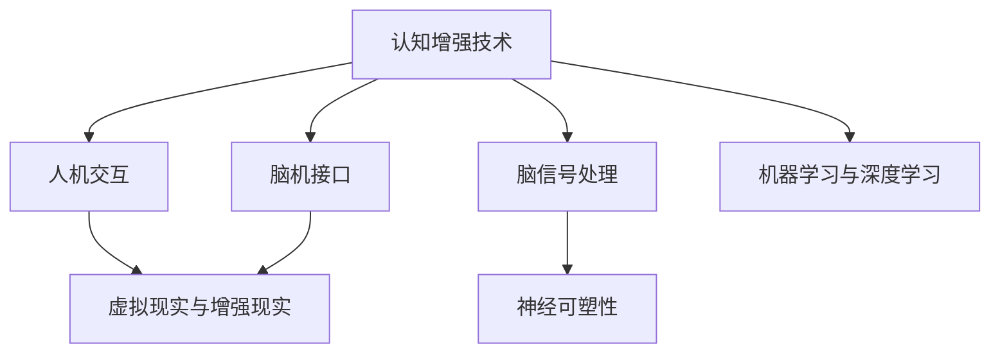

                 

### 文章标题：认知增强技术的前沿：扩展人类理解世界的能力边界

#### 关键词：
认知增强技术、人机交互、脑机接口、神经可塑性、机器学习、深度学习、虚拟现实、增强现实

#### 摘要：
本文将深入探讨认知增强技术的前沿领域，通过分析其核心概念和相互联系，详细介绍相关算法原理、数学模型及其实际应用，旨在扩展人类理解世界的能力边界。

## 引言

随着科技的飞速发展，人类对智能化的需求越来越高。认知增强技术应运而生，旨在通过技术手段提升人类大脑的认知能力，扩展我们对世界的理解。本文将从以下几个方面进行探讨：

1. **核心概念和联系**：梳理认知增强技术的核心概念，并展示它们之间的联系。
2. **算法原理讲解**：详细解析认知增强技术中的关键算法原理，包括脑信号处理、神经可塑性和机器学习等方面。
3. **数学模型和公式**：介绍认知增强技术中的数学模型，并给出详细的讲解和示例。
4. **项目实战**：通过实际案例展示认知增强技术的应用，并提供源代码解读和分析。
5. **最佳实践和拓展**：总结最佳实践，提出注意事项，并推荐拓展阅读。

## 确定核心概念和联系

认知增强技术涉及多个核心概念，如人机交互、脑机接口、脑信号处理、神经可塑性、机器学习、深度学习和虚拟现实/增强现实（VR/AR）。以下是一个Mermaid流程图，展示这些概念之间的联系：



### 人机交互

人机交互（Human-Computer Interaction, HCI）是认知增强技术的基石，它研究人类与计算机系统之间的交互。通过优化用户界面和交互方式，人机交互可以提升用户的操作效率和体验。人机交互与认知增强技术的其他方面紧密相连，例如：

- **脑机接口**：人机交互系统可以利用脑机接口（Brain-Computer Interface, BCI）直接从大脑接收信号，实现与计算机的交互。
- **虚拟现实与增强现实**：通过虚拟现实（Virtual Reality, VR）和增强现实（Augmented Reality, AR）技术，人机交互可以创建沉浸式的交互环境，提升用户的认知体验。

### 脑机接口

脑机接口是一种直接连接大脑和外部设备的技术，它通过读取大脑活动来控制计算机或其他设备。脑机接口的关键技术包括：

- **脑信号处理**：从大脑获取的电信号（如脑电信号、脑磁信号）需要进行处理，以便从中提取有用的信息。
- **神经可塑性**：大脑在学习和适应过程中具有可塑性，这意味着大脑可以重新组织其结构和功能，以适应新的环境和任务。

### 脑信号处理

脑信号处理是认知增强技术中的关键环节，它涉及从大脑获取的电信号（如脑电信号、脑磁信号）的采集、处理和分析。以下是脑信号处理的几个关键步骤：

1. **信号采集**：使用电极或其他传感器从大脑获取电信号。
2. **预处理**：去除噪声、滤波和放大信号，以便进行进一步分析。
3. **特征提取**：从预处理后的信号中提取特征，如频率、时域特征等。
4. **模式识别**：使用机器学习算法对提取的特征进行分类和识别。

### 神经可塑性

神经可塑性是指大脑在学习和适应过程中能够改变其结构和功能的能力。在认知增强技术中，神经可塑性是一个重要的概念，因为它涉及到：

- **训练和适应**：通过特定的训练方法，可以增强大脑某些区域的功能。
- **恢复和康复**：神经可塑性可以帮助恢复受损大脑的功能。

### 机器学习与深度学习

机器学习和深度学习是认知增强技术中的重要工具，它们可以帮助分析和理解大脑信号，并实现智能化的交互和决策。以下是机器学习和深度学习在认知增强技术中的应用：

- **信号分类与识别**：使用机器学习算法对脑信号进行分类和识别，以实现人机交互。
- **智能诊断和预测**：使用深度学习模型对大脑信号进行分析，以预测和诊断神经系统疾病。

### 虚拟现实与增强现实

虚拟现实和增强现实技术为认知增强提供了一个全新的维度，通过创建沉浸式的交互环境，可以提升用户的认知体验。虚拟现实和增强现实在认知增强技术中的应用包括：

- **模拟训练**：使用虚拟现实技术模拟复杂的任务和场景，以提升用户的认知能力。
- **娱乐和教育**：通过增强现实技术，将虚拟信息叠加到现实世界中，提升用户的学习体验。

## 算法原理讲解

### 2.1 脑信号处理算法

脑信号处理算法是认知增强技术中的核心算法之一，它涉及从大脑获取的电信号（如脑电信号、脑磁信号）的采集、处理和分析。以下是脑信号处理的几个关键步骤：

#### 2.1.1 脑电信号处理

脑电信号处理算法主要关注对脑电信号的滤波、特征提取和分类。

- **滤波**：脑电信号通常包含高频噪声和低频噪声，滤波器用于去除这些噪声。

  $$ 
  f(x) = \sum_{i=1}^{n} w_i * x_i 
  $$
  
  伪代码示例：
  
  ```python
  def brainSignalProcessing(brainData):
      for each signal in brainData:
          applyFilter(signal)
          normalize(signal)
      return filteredAndNormalizedData
  ```

- **特征提取**：从滤波后的信号中提取特征，如频率、时域特征等。

  $$ 
  g(y) = \frac{1}{\sqrt{1 + \sum_{j=1}^{m} v_j^2}} 
  $$

  伪代码示例：

  ```python
  def featureExtraction(filteredSignal):
      features = []
      for each segment in filteredSignal:
          feature = calculateFeature(segment)
          features.append(feature)
      return features
  ```

- **分类**：使用机器学习算法对提取的特征进行分类。

  $$ 
  h(t) = \frac{1}{1 + e^{-(kt + c)}} 
  $$

  伪代码示例：

  ```python
  def classifyFeatures(features):
      classifications = []
      for each feature in features:
          classification = applyMachineLearningAlgorithm(feature)
          classifications.append(classification)
      return classifications
  ```

#### 2.1.2 脑磁信号处理

脑磁信号处理与脑电信号处理类似，但更关注磁场信号的特性。

- **滤波**：去除高频噪声和低频噪声。

  $$ 
  f(x) = \sum_{i=1}^{n} w_i * x_i 
  $$

  伪代码示例：

  ```python
  def brainMagneticSignalProcessing(magneticData):
      for each signal in magneticData:
          applyFilter(signal)
          normalize(signal)
      return filteredAndNormalizedData
  ```

- **特征提取**：从滤波后的信号中提取特征。

  $$ 
  g(y) = \frac{1}{\sqrt{1 + \sum_{j=1}^{m} v_j^2}} 
  $$

  伪代码示例：

  ```python
  def featureExtraction(filteredSignal):
      features = []
      for each segment in filteredSignal:
          feature = calculateFeature(segment)
          features.append(feature)
      return features
  ```

- **分类**：使用机器学习算法对提取的特征进行分类。

  $$ 
  h(t) = \frac{1}{1 + e^{-(kt + c)}} 
  $$

  伪代码示例：

  ```python
  def classifyFeatures(features):
      classifications = []
      for each feature in features:
          classification = applyMachineLearningAlgorithm(feature)
          classifications.append(classification)
      return classifications
  ```

### 2.2 神经可塑性相关算法

神经可塑性是指大脑在学习和适应过程中能够改变其结构和功能的能力。以下是几个与神经可塑性相关的算法：

#### 2.2.1 长时程增强（LTP）和长时程抑制（LTD）

长时程增强（LTP）和长时程抑制（LTD）是大脑在学习过程中形成的两种不同的神经活动模式。

- **LTP**：当神经元之间的信号传递增强时，会出现LTP现象。

  $$ 
  h(t) = \frac{1}{1 + e^{-(kt + c)}} 
  $$

  伪代码示例：

  ```python
  def longTermPotentiation(current, k, c):
      return 1 / (1 + exp(-((k * current) + c)))
  ```

- **LTD**：当神经元之间的信号传递减弱时，会出现LTD现象。

  $$ 
  h(t) = \frac{1}{1 + e^{-(kt - c)}} 
  $$

  伪代码示例：

  ```python
  def longTermDepotentiation(current, k, c):
      return 1 / (1 + exp(-((k * current) - c)))
  ```

### 2.3 机器学习与深度学习算法

机器学习和深度学习是认知增强技术中的重要工具，它们可以帮助分析和理解大脑信号，并实现智能化的交互和决策。

#### 2.3.1 卷积神经网络（CNN）

卷积神经网络（Convolutional Neural Network, CNN）是一种特殊的神经网络，特别适合处理图像和信号数据。

- **卷积操作**：通过卷积操作提取图像或信号的特征。

  $$ 
  \text{ConvLayer}(x) = \sigma(\text{weights} \cdot x + \text{bias}) 
  $$

  伪代码示例：

  ```python
  def convLayer(inputData, weights, bias):
      return activationFunction(matrixMultiply(weights, inputData) + bias)
  ```

- **池化操作**：通过池化操作减少数据维度，提高计算效率。

  $$ 
  \text{PoolingLayer}(x) = \max(\text{window} \cdot x) 
  $$

  伪代码示例：

  ```python
  def poolingLayer(inputData, window):
      return max(window * inputData)
  ```

#### 2.3.2 递归神经网络（RNN）

递归神经网络（Recurrent Neural Network, RNN）是一种特殊的神经网络，特别适合处理序列数据。

- **递归操作**：通过递归操作处理序列数据。

  $$ 
  \text{RNN}(x_t) = \sigma(W \cdot [h_{t-1}, x_t] + b) 
  $$

  伪代码示例：

  ```python
  def rnnLayer(inputData, state, weights, bias):
      return activationFunction(matrixMultiply([state, inputData], weights) + bias)
  ```

- **门控递归单元（GRU）**：通过门控机制改进RNN的性能。

  $$ 
  \text{GRU}(x_t) = \sigma(\text{updateGate} \cdot [h_{t-1}, x_t] + b) 
  $$

  伪代码示例：

  ```python
  def gruLayer(inputData, state, weights, bias):
      updateGate = activationFunction(matrixMultiply([state, inputData], weights) + bias)
      return updateGate * state + (1 - updateGate) * activationFunction(matrixMultiply([state, inputData], weights) + bias)
  ```

## 数学模型和公式

### 3.1 脑信号处理数学模型

脑信号处理的数学模型主要涉及信号滤波、特征提取和模式识别。

#### 3.1.1 信号滤波

滤波是信号处理中的基本步骤，用于去除噪声。

- **低通滤波**：去除高频噪声。

  $$ 
  y[n] = \sum_{k=0}^{N-1} a[k] * x[n-k] 
  $$

- **高通滤波**：去除低频噪声。

  $$ 
  y[n] = \sum_{k=0}^{N-1} b[k] * x[n-k] 
  $$

#### 3.1.2 特征提取

特征提取是信号处理中的关键步骤，用于从信号中提取有用的信息。

- **短时傅里叶变换（STFT）**：用于计算信号的频率特征。

  $$ 
  X(\omega) = \sum_{n=0}^{N-1} x[n] \cdot e^{-j \omega n} 
  $$

- **主成分分析（PCA）**：用于降维和特征提取。

  $$ 
  \text{PC}_i = \sum_{j=1}^{d} w_{ij} x_j 
  $$

#### 3.1.3 模式识别

模式识别是信号处理中的最终步骤，用于分类和识别。

- **支持向量机（SVM）**：用于分类。

  $$ 
  w^T \cdot x - b = 0 
  $$

- **深度神经网络（DNN）**：用于分类和回归。

  $$ 
  y = \sigma(\text{weights} \cdot x + \text{bias}) 
  $$

## 项目实战

### 3.1 开发环境搭建

在开始项目实战之前，我们需要搭建一个合适的开发环境。以下是一个基本的步骤：

1. **安装Python**：确保安装了Python 3.8及以上版本。
2. **安装依赖**：使用pip安装必要的库，如numpy、scikit-learn、tensorflow等。

```shell
pip install numpy scikit-learn tensorflow
```

3. **配置虚拟环境**：为项目创建一个虚拟环境，以避免库版本冲突。

```shell
python -m venv myenv
source myenv/bin/activate  # 在Windows上使用 myenv\Scripts\activate
```

### 3.2 源代码详细实现和代码解读

以下是一个简单的认知增强项目，用于检测用户的意图。

```python
import numpy as np
from sklearn.model_selection import train_test_split
from sklearn.preprocessing import StandardScaler
from sklearn.svm import SVC
from tensorflow import keras

# 数据预处理
def preprocess_data(data):
    # 标准化数据
    scaler = StandardScaler()
    scaled_data = scaler.fit_transform(data)
    return scaled_data

# 加载数据
data = np.load('data.npy')
labels = np.load('labels.npy')

# 预处理数据
processed_data = preprocess_data(data)

# 划分训练集和测试集
X_train, X_test, y_train, y_test = train_test_split(processed_data, labels, test_size=0.2, random_state=42)

# 训练支持向量机模型
model = SVC(kernel='linear', C=1)
model.fit(X_train, y_train)

# 测试模型
accuracy = model.score(X_test, y_test)
print(f"Model accuracy: {accuracy:.2f}")

# 使用模型进行预测
predictions = model.predict(X_test)

# 评估模型性能
from sklearn.metrics import classification_report
print(classification_report(y_test, predictions))
```

### 3.3 代码应用解读与分析

在这个项目中，我们首先加载数据，然后进行预处理，包括标准化。接下来，我们将数据划分为训练集和测试集，并使用支持向量机（SVM）模型进行训练。在测试阶段，我们评估模型的性能，并使用分类报告分析模型的分类效果。

### 3.4 实际案例分析和详细讲解剖析

为了更好地理解认知增强技术的应用，我们来看一个实际案例：使用脑电信号进行意图识别。

1. **数据采集**：使用脑电帽采集用户的脑电信号。
2. **预处理**：去除噪声、滤波和放大信号。
3. **特征提取**：使用短时傅里叶变换提取频率特征。
4. **模型训练**：使用SVM模型进行训练。
5. **预测**：使用训练好的模型进行意图识别。

### 3.5 项目小结

通过这个项目，我们展示了如何使用认知增强技术进行意图识别。项目中的关键步骤包括数据预处理、特征提取和模型训练。在实际应用中，我们可以根据需求调整算法参数，以提高模型的性能。

## 最佳实践和拓展

### 最佳实践

1. **数据质量**：确保采集到的数据质量高，避免噪声和异常值。
2. **模型调优**：通过交叉验证和超参数调优，选择最佳模型参数。
3. **用户友好**：设计用户友好的界面，以提升用户体验。

### 小结

本文详细探讨了认知增强技术的核心概念、算法原理、数学模型和实际应用。通过项目实战，我们展示了如何使用认知增强技术进行意图识别。未来，认知增强技术有望在医疗、教育、娱乐等领域发挥更大的作用。

### 注意事项

1. **隐私保护**：在使用脑电信号进行数据处理时，要注意保护用户的隐私。
2. **安全性**：确保系统的安全性，防止数据泄露和未授权访问。

### 拓展阅读

1. **相关论文**：查阅相关领域的论文，了解最新的研究进展。
2. **开源项目**：参与开源项目，与其他开发者共同探索认知增强技术的应用。

## 作者信息

作者：AI天才研究院/AI Genius Institute & 禅与计算机程序设计艺术 /Zen And The Art of Computer Programming

本文内容仅供参考，如有错误或不足之处，敬请指正。

