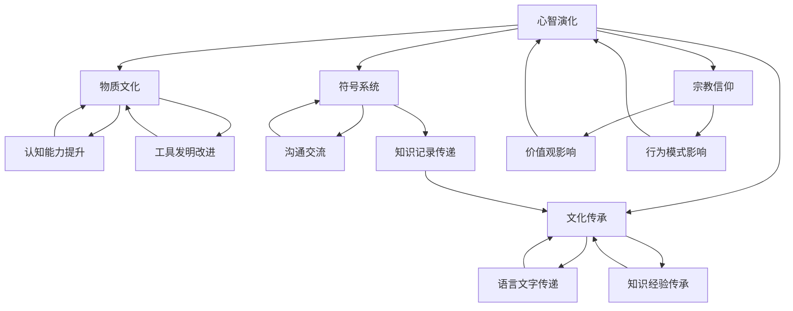

                 

### 引言

#### 什么是认知考古学

认知考古学，作为一个跨学科的研究领域，旨在通过考古学的视角来探讨人类心智的发展与演化。它融合了考古学、心理学、认知科学等多个学科的知识，致力于揭示人类在理解世界、适应环境过程中的心智变迁。认知考古学不仅关注物质文化，如工具、建筑等，更侧重于理解这些物质背后的心智结构和文化意义。

#### 为什么研究认知考古学

研究认知考古学具有重要的学术价值和现实意义。首先，它有助于我们理解人类心智的复杂性和多样性，从而更好地解决现代社会面临的诸多问题，如文化冲突、认知障碍等。其次，认知考古学为我们提供了一个全新的研究方法，使得我们对人类历史和文化的研究更加全面和深入。最后，认知考古学的研究成果对于人类自我认知和未来发展方向具有重要的启示作用。

#### 本书结构安排

本书将分为四个主要部分。第一部分将介绍认知考古学的起源与基础，包括其定义、研究方法和发展历程。第二部分将探讨文化演化的关键节点，从人类早期的认知演化、文字与语言的起源，到宗教与哲学的诞生，以及社会组织与文化传承。第三部分将追溯人类理解世界的历史进程，从科学革命与认知拓展，到工业革命与认知进步，再到现代科技与认知革命。最后，第四部分将展望未来，讨论认知考古学的未来趋势、文化演化的潜在方向以及人类理解世界的挑战与机遇。通过这样的结构安排，我们希望能够系统地展示认知考古学的研究内容，并引导读者深入思考和理解这一领域的重要性和复杂性。

### 第一部分：认知考古学的起源与基础

#### 1.1 认知考古学的定义

认知考古学是一个新兴的跨学科领域，旨在通过考古学的视角来探讨人类心智的发展与演化。它融合了考古学、心理学、认知科学等多个学科的知识，致力于揭示人类在理解世界、适应环境过程中的心智变迁。认知考古学不仅关注物质文化，如工具、建筑等，更侧重于理解这些物质背后的心智结构和文化意义。

认知考古学的定义可以从以下几个方面来理解：

1. **定义范围**：认知考古学关注的是人类心智的演化，包括认知能力、情感、意识等方面的变化。它不仅涉及物质文化的研究，如工具、建筑等，还包括对语言、符号系统、宗教信仰等方面的研究。

2. **研究内容**：认知考古学的研究内容包括人类早期的认知演化、文字与语言的起源、宗教与哲学的诞生、社会组织与文化传承等。这些研究内容旨在揭示人类心智的发展历程和演化机制。

3. **研究方法**：认知考古学采用多种研究方法，包括实物考古方法、文化分析方法、心理学分析方法等。这些方法有助于我们从不同的角度理解和分析人类心智的演化过程。

#### 1.2 认知考古学的研究方法

认知考古学的研究方法多种多样，每种方法都有其独特的优势和适用范围。以下是几种主要的研究方法：

1. **实物考古方法**：实物考古方法是通过挖掘、整理和分析古代遗物来研究人类心智的演化。这种方法的主要工具包括铲、刷、筛等，通过这些工具，考古学家可以发掘出古代人类使用的工具、器具、建筑等物质文化。实物考古方法的优势在于能够直接获取古代人类的物质文化证据，从而为我们提供丰富的实证资料。

2. **文化分析方法**：文化分析方法是从文化的角度来研究人类心智的演化。这种方法关注的是文化符号、仪式、传统等文化现象，通过分析这些文化现象，我们可以深入了解人类心智的结构和功能。文化分析方法的优势在于能够从宏观上把握人类心智的演化趋势，为我们提供一种宏观的历史视角。

3. **心理学分析方法**：心理学分析方法是通过实验、问卷、访谈等心理学方法来研究人类心智的演化。这种方法的主要工具包括实验设计、统计分析和心理测量等。心理学分析方法的优势在于能够从微观上揭示人类心智的内部结构和运行机制，为我们提供具体的心理数据。

#### 1.3 认知考古学的历史背景

认知考古学作为一个跨学科领域，其发展历程可以追溯到20世纪中叶。以下是其发展历程中的重要阶段和理论贡献：

1. **起源与发展**：20世纪中叶，考古学、心理学和认知科学等学科开始融合发展，认知考古学逐渐形成。这一阶段的重要贡献包括心理学理论的引入，如认知心理学和行为心理学的理论框架，以及考古学方法的改进，如电子显微镜和放射性碳测年技术的应用。

2. **中期发展**：20世纪末至21世纪初，认知考古学进入了一个快速发展的阶段。这一阶段的重要贡献包括跨学科研究的深入，如认知考古学与人类学、社会学、神经科学等学科的融合，以及新技术和方法的应用，如计算机模拟和虚拟现实技术的引入。

3. **当前趋势**：当前，认知考古学正朝着更加综合和交叉的方向发展。这一阶段的重要趋势包括大数据分析在认知考古学中的应用，如人工智能和机器学习技术的引入，以及跨学科研究在认知考古学中的深化，如认知考古学与哲学、文学等学科的交叉研究。

通过以上对认知考古学起源与基础部分的介绍，我们可以看到，认知考古学作为一个新兴的跨学科领域，具有广泛的研究内容和多样的研究方法。它不仅为我们提供了理解人类心智演化的重要视角，也为未来的跨学科研究提供了新的思路和方向。

#### 1.4 认知考古学的核心概念与联系

在认知考古学中，有若干核心概念，这些概念之间相互联系，构成了一个完整的研究体系。以下是这些核心概念及其相互关系的详细阐述：

1. **心智演化**：心智演化是认知考古学的核心概念之一。它指的是人类心智从早期形态到现代形态的发展过程。心智演化包括认知能力、情感、意识等多个方面。例如，人类的语言能力、逻辑思维能力和空间认知能力等都是在漫长的进化过程中逐渐发展和完善的。

2. **物质文化**：物质文化是指人类在历史上创造和使用的物质产品，如工具、建筑、艺术品等。物质文化不仅是人类适应环境的一种表现，也是心智演化的重要体现。例如，石器时代的人类使用的工具，反映了他们的认知能力和技术水平。

3. **文化传承**：文化传承是指人类通过教育、传统和习俗等方式，将知识、价值观和行为模式传递给后代。文化传承是心智演化的重要机制，它使得人类心智的演化具有连续性。例如，古代的文化传统在今天仍然影响着人们的思维方式和行为习惯。

4. **符号系统**：符号系统是人类用以表达和传递信息的一套规则和工具，包括语言、文字、图像等。符号系统是心智演化的重要组成部分，它使得人类能够更加有效地进行沟通和交流。例如，文字的发明使得人类的知识和经验可以记录下来，并传递给后代。

5. **宗教信仰**：宗教信仰是人们对超自然力量和宇宙秩序的一种信仰和崇拜。宗教信仰不仅是一种文化现象，也是心智演化的重要体现。例如，古代的宗教仪式和神话故事反映了人类对自然和生命的认知和理解。

这些核心概念之间的联系可以通过以下方式来解释：

- **心智演化与物质文化**：心智演化是物质文化的基础，物质文化是心智演化的体现。例如，人类认知能力的提升推动了工具的发明和改进，而工具的发明和改进又反过来促进了人类心智的演化。

- **文化传承与符号系统**：文化传承是通过符号系统实现的。例如，通过语言和文字，人类可以将知识和经验传递给后代，从而实现文化传承。

- **宗教信仰与心智演化**：宗教信仰是心智演化的一种表现，同时它也对心智演化产生重要影响。例如，宗教信仰可以影响人类的价值观和行为模式，从而促进或阻碍心智的演化。

为了更直观地展示这些核心概念之间的联系，我们可以使用以下Mermaid流程图：



通过以上流程图，我们可以清楚地看到心智演化、物质文化、文化传承、符号系统和宗教信仰之间的相互关系。这些核心概念共同构成了认知考古学的研究框架，为我们理解人类心智的演化提供了重要的理论支持。

#### 1.5 认知考古学中的核心算法原理

认知考古学中的核心算法原理主要集中在如何从大量考古数据中提取有意义的信息，以揭示人类心智的演化过程。以下是几种常见的核心算法原理及其伪代码阐述：

1. **聚类分析（Cluster Analysis）**

聚类分析是一种无监督学习方法，用于将数据集中的样本分为若干个群组，使得同一群组内的样本彼此相似，不同群组间的样本差异较大。在认知考古学中，聚类分析可以帮助我们识别出不同时期的文化特征，从而揭示人类心智的演化趋势。

**伪代码：**

```python
def cluster_analysis(data):
    # 初始化聚类算法，如K-Means
    clusters = initialize_clusters(data)

    # 计算每个样本与当前聚类中心的距离
    distances = calculate_distances(data, clusters)

    # 更新聚类中心
    update_cluster_centers(clusters)

    # 迭代直到收敛
    while not_converged(distances):
        distances = calculate_distances(data, clusters)
        update_cluster_centers(clusters)

    # 返回聚类结果
    return clusters
```

2. **主成分分析（Principal Component Analysis, PCA）**

主成分分析是一种降维技术，通过将数据投影到新的正交坐标系中，提取数据的主要变异方向。在认知考古学中，PCA可以帮助我们识别出数据中的主要变量，从而简化数据结构，减少冗余信息。

**伪代码：**

```python
def pca(data):
    # 计算协方差矩阵
    cov_matrix = calculate_covariance_matrix(data)

    # 计算协方差矩阵的特征值和特征向量
    eigen_values, eigen_vectors = calculate_eigen(cov_matrix)

    # 选择最大的k个特征向量
    principal_vectors = select_eigen_vectors(eigen_values, eigen_vectors, k)

    # 将数据投影到主成分空间
    principal_components = project_data(data, principal_vectors)

    # 返回主成分
    return principal_components
```

3. **支持向量机（Support Vector Machine, SVM）**

支持向量机是一种有监督学习方法，用于分类和回归问题。在认知考古学中，SVM可以帮助我们识别出不同文化特征之间的关系，从而推断人类心智的演化规律。

**伪代码：**

```python
def svm_classification(data, labels):
    # 训练SVM模型
    model = train_svm_model(data, labels)

    # 预测新数据的类别
    predictions = model.predict(data)

    # 返回预测结果
    return predictions
```

#### 1.6 数学模型和数学公式

在认知考古学中，数学模型和数学公式是不可或缺的工具，用于解释和预测人类心智的演化过程。以下是一些常用的数学模型和数学公式，并附有详细讲解和举例说明。

1. **线性回归模型（Linear Regression Model）**

线性回归模型是一种常用的预测模型，用于分析自变量和因变量之间的关系。在认知考古学中，线性回归模型可以用来预测人类心智的某些特征，如语言能力或认知能力，随着时间的变化趋势。

**公式：**
$$
y = \beta_0 + \beta_1 \cdot x + \epsilon
$$

其中，\( y \) 是因变量（如认知能力评分），\( x \) 是自变量（如时间），\( \beta_0 \) 和 \( \beta_1 \) 是模型参数，\( \epsilon \) 是误差项。

**举例说明：**

假设我们想预测某个文化遗址中人类语言能力的发展趋势。我们可以收集不同时间点的人类语言能力数据，并使用线性回归模型来拟合这些数据。通过模型的参数，我们可以得到语言能力随时间的变化规律。

2. **逻辑回归模型（Logistic Regression Model）**

逻辑回归模型是一种用于分类问题的模型，可以用来预测某个事件发生的概率。在认知考古学中，逻辑回归模型可以用来预测文化特征是否出现的概率，如文字的发明。

**公式：**
$$
\text{logit}(p) = \ln\left(\frac{p}{1-p}\right) = \beta_0 + \beta_1 \cdot x
$$

其中，\( p \) 是事件发生的概率，\( \text{logit}(p) \) 是逻辑函数，\( \beta_0 \) 和 \( \beta_1 \) 是模型参数。

**举例说明：**

假设我们想预测某个文化遗址中文字是否出现的概率。我们可以收集文字存在的数据，并使用逻辑回归模型来拟合这些数据。通过模型的参数，我们可以得到文字出现的概率随时间的变化规律。

3. **马尔可夫链模型（Markov Chain Model）**

马尔可夫链模型是一种用于描述随机过程的模型，可以用来分析人类心智演化过程中的状态转移。在认知考古学中，马尔可夫链模型可以用来预测人类心智从一个状态转移到另一个状态的概率。

**公式：**
$$
P(X_t = j | X_{t-1} = i) = P_{ij}
$$

其中，\( X_t \) 是时间 \( t \) 的状态，\( P_{ij} \) 是从状态 \( i \) 转移到状态 \( j \) 的概率。

**举例说明：**

假设我们想分析人类语言能力从低级到高级的演化过程。我们可以使用马尔可夫链模型来预测语言能力在不同时期的状态转移概率，从而揭示语言能力的演化规律。

通过以上数学模型和公式的讲解，我们可以看到数学在认知考古学中的应用是如何帮助我们更好地理解人类心智的演化过程。这些模型和公式不仅提供了理论支持，也为实证研究提供了有力工具。

### 第二部分：文化演化的关键节点

#### 2.1 人类早期的认知演化

人类早期的认知演化是一个漫长且复杂的过程，从旧石器时代到新石器时代，人类的认知能力不断发展和进化。在这一过程中，认知考古学为我们提供了重要的视角，帮助我们理解人类心智的演变。

1. **旧石器时代的人类认知**

旧石器时代，大约距今250万年前至1万年前，是人类认知演化的初期阶段。在这个时期，人类开始使用简单的工具，如石制工具，这标志着人类开始具备基本的认知能力。考古学家通过挖掘出土的石制工具，发现这些工具的制造和使用反映了早期人类对环境和技术的基本理解。

2. **新石器时代的认知变革**

新石器时代，大约距今1万年前至5000年前，是人类认知演化的关键时期。在这个时期，人类开始种植农作物、驯养动物，并形成了早期的社会组织。这些变革不仅改变了人类的生活方式，也深刻影响了人类心智的发展。考古学家发现，新石器时代的人类开始制作更复杂的工具，如金属工具和陶器，这表明他们的认知能力和技术水平有了显著提升。

#### 2.2 文字与语言的起源

文字与语言的起源是人类认知演化的重要节点，它们不仅改变了人类的信息传递方式，也推动了人类文明的进步。

1. **文字的发明与发展**

文字的发明是人类历史上的一次重大革命。最早的文字系统出现在约公元前3200年的美索不达米亚地区，如苏美尔人的楔形文字。随后，埃及人发明了象形文字，中国出现了甲骨文和金文。这些早期的文字系统都是符号性的，主要用于记录交易、法律、宗教活动等。

文字的发明使得人类的知识和经验可以记录和传承，极大地推动了人类文明的进步。通过考古学家对古文字的研究，我们能够解读和理解古代人类的思想和文化。

2. **语言的演变与认知功能**

语言是人类认知的核心工具，它不仅用于交流信息，还在思维、思考、计划和社交互动中发挥着重要作用。语言能力的进化是一个长期的过程，从简单的声音信号到复杂的语法和语义结构。

在认知考古学中，研究者通过分析古代人类的骨骼和化石，发现语言能力的进化与大脑结构的变化密切相关。例如，人类大脑中负责语言处理的海马体和颞叶在语言能力的发展中起到了关键作用。

#### 2.3 宗教与哲学的诞生

宗教和哲学是人类文化的重要组成部分，它们的诞生标志着人类心智的进一步发展。

1. **宗教观念的起源**

宗教观念的起源可以追溯到人类早期历史。在旧石器时代和新石器时代，人类开始崇拜自然力量，如太阳、风雨、山川等。这些崇拜行为反映了早期人类对自然界的敬畏和恐惧。

随着社会的复杂化，宗教组织逐渐形成，宗教信仰成为社会生活的重要组成部分。考古学家通过研究古代的宗教遗址、仪式用品和文献，揭示了宗教观念的发展和演变。

2. **哲学思想的演变**

哲学思想的起源可以追溯到古希腊时期，如苏格拉底、柏拉图和亚里士多德等哲学家。他们的思想奠定了西方哲学的基础，对后世产生了深远的影响。

哲学思想的演变反映了人类对自然、社会和自身的深入思考。通过哲学，人类开始探索宇宙的本质、人类的道德和价值观，以及知识本身的意义。

#### 2.4 社会组织与文化传承

社会组织和文化传承是人类文化演化的重要方面，它们决定了文化的延续和变迁。

1. **社会结构的变化**

从原始社会到现代社会，人类社会组织结构经历了显著变化。在原始社会，人们主要以部落为单位，通过血缘关系和传统习俗维系社会秩序。随着农业社会的出现，人类开始形成更复杂的社会组织，如城市和国家。

社会结构的变化不仅影响了人类的生活方式，也影响了人类心智的发展。例如，农业社会的出现使得人类开始积累财富和知识，这促进了教育和文化的传播。

2. **文化传承与变迁**

文化传承是指通过教育、传统和习俗等方式，将知识和价值观传递给后代。文化传承是文化演化的重要组成部分，它确保了文化的连续性和稳定性。

然而，文化传承也伴随着文化的变迁。随着时代的变迁，文化传统会发生调整和变化。例如，现代社会中，互联网和信息技术的发展改变了人们的沟通方式和文化交流的形式。

文化变迁不仅是文化传承的必然结果，也是文化创新的动力。通过文化变迁，人类能够不断适应新的环境和挑战，推动文化的发展。

通过以上对文化演化的关键节点的分析，我们可以看到人类心智的演化是一个复杂而连续的过程。从旧石器时代到现代社会，人类的认知能力、语言能力、宗教信仰和社会组织都在不断发展和变化。这些变化不仅影响了人类的生活方式和思维方式，也推动了人类文明的进步。

### 第三部分：人类理解世界的历史进程

#### 3.1 科学革命与认知拓展

科学革命是人类理解世界历史进程中的重要里程碑，它不仅改变了人类对自然界的认知，也深刻影响了人类心智的发展。科学革命可以大致分为几个主要阶段，每个阶段都带来了认知的拓展和认知方式的变革。

1. **古代科学的发展**

古代科学起源于人类对自然界的基本观察和探索。在古希腊时期，如亚里士多德等哲学家和科学家，通过逻辑推理和实证观察，建立了初步的科学体系。他们提出了许多重要的科学理论，如地心说和原子论。虽然古代科学在某些方面存在局限性，但它为后来的科学革命奠定了基础。

2. **中世纪科学的沉寂**

中世纪时期，科学的发展受到了宗教和封建制度的限制，科学活动相对沉寂。尽管如此，一些科学思想仍然在民间流传，如阿拉伯科学家的著作在欧洲传播，对后来的科学革命产生了影响。

3. **文艺复兴与科学复兴**

文艺复兴时期，人类开始重新审视古代的科学思想，并在此基础上进行了大量的实验和观察。这一时期的科学家，如伽利略和哥白尼，通过实验和观测，颠覆了传统的地心说，提出了日心说。他们的发现标志着现代科学的诞生，也为人类认知拓展打开了新的方向。

4. **近代科学的兴起**

近代科学的发展主要发生在17世纪和18世纪。牛顿的经典力学体系，伽利略的实验方法，以及伽利略和牛顿的科学研究，极大地拓展了人类对自然界的认知。这一时期的科学发现不仅改变了人类的科学观念，也深刻影响了人类的社会生活和思维方式。

#### 3.2 工业革命与认知进步

工业革命是18世纪末到19世纪初发生在欧洲的一场重大变革，它不仅推动了生产力的大幅提升，也促进了人类认知的进步。工业革命期间，科技创新和工业化进程使得人类能够更有效地利用自然资源，提高生产效率。以下是工业革命对人类认知进步的几个主要影响：

1. **科技创新与认知拓展**

工业革命期间，科技飞速发展，如蒸汽机、纺织机械、电灯等新技术的发明，极大地改变了人类的生产和生活方式。这些科技创新不仅提高了生产效率，也拓宽了人类的认知视野。例如，蒸汽机的发明使得大规模工业生产成为可能，推动了科学实验的规模化和精细化。

2. **教育普及与认知提升**

工业革命期间，随着经济的发展，教育普及率逐渐提高。更多的人有机会接受教育，这促进了知识的传播和认知的提升。学校教育和职业培训的普及，使得更多的人掌握了科学知识和实用技能，为工业社会的繁荣奠定了基础。

3. **城市化进程与认知变革**

工业革命还推动了城市化进程。大量农民涌入城市，形成了新的社会结构和生活方式。城市化不仅改变了人类的居住模式，也促进了社会交往和思想交流。这种社会变革使得人类能够更加广泛地接触新思想和新观念，推动了认知的进步。

#### 3.3 现代科技与认知革命

20世纪以来，现代科技的发展进入了新的阶段，信息技术、人工智能、生物技术等领域的突破，不仅改变了人类的生活和生产方式，也推动了认知革命。以下是现代科技对人类认知革命的主要影响：

1. **信息技术的发展**

信息技术的发展是现代科技的核心，它极大地改变了人类的信息处理和传播方式。计算机和互联网的普及，使得信息获取和共享变得更加便捷。人们可以通过网络获取全球的信息资源，进行远程协作和交流。这种信息化的环境促进了知识的快速传播和认知的广泛拓展。

2. **人工智能的崛起**

人工智能（AI）的发展是现代科技的另一重要里程碑。AI技术通过模拟人类智能，使得计算机能够处理复杂的问题和执行智能任务。例如，自动驾驶汽车、智能语音助手、医疗诊断系统等，都是人工智能的应用实例。人工智能的发展不仅提高了生产效率，也拓宽了人类的认知能力。

3. **生物技术的进步**

生物技术，如基因编辑、基因测序等，为人类理解生命和健康提供了新的视角。通过基因测序，科学家可以分析人类基因组的结构和功能，揭示疾病的发生机制。基因编辑技术，如CRISPR-Cas9，使得人类能够精确地修改基因，为治疗遗传病和癌症提供了新的可能性。生物技术的进步不仅推动了医学的发展，也改变了人类对自身的认知。

#### 3.4 全球化与认知融合

全球化是20世纪末以来世界发展的重要趋势，它不仅促进了经济的全球化，也推动了文化的全球化。全球化对人类认知的影响主要体现在以下几个方面：

1. **文化融合与认知多样性**

全球化带来了不同文化的交流和融合。人们在全球范围内进行交流和合作，促进了不同文化之间的相互理解和包容。这种文化融合不仅丰富了人类的文化多样性，也促进了认知的多样性。人们可以通过接触和了解不同的文化，拓宽自己的视野，提高认知水平。

2. **跨文化沟通与认知挑战**

全球化也带来了跨文化沟通的挑战。由于文化差异，不同文化背景的人在交流时可能会出现误解和冲突。这种跨文化沟通的挑战要求人们具备更高的认知能力，能够理解和尊重不同的文化观念和价值观。通过提高跨文化沟通的能力，人类能够更好地解决全球化带来的挑战。

3. **全球问题与认知合作**

全球化使得人类面临许多共同的问题，如气候变化、环境保护、经济发展等。这些全球性问题需要全球合作和共同解决。为了应对这些挑战，人类需要加强认知合作，通过共享知识和资源，共同寻找解决方案。这种全球认知合作不仅有助于解决全球问题，也促进了人类的共同发展和进步。

通过以上对科学革命、工业革命、现代科技和全球化对人类认知影响的分析，我们可以看到，人类理解世界的历史进程是一个不断拓展和变革的过程。从古代科学的萌芽，到工业革命带来的认知进步，再到现代科技的认知革命，以及全球化的认知融合，人类对世界的认知不断深化和拓展。这些变革不仅改变了人类的生活方式，也推动了人类文明的进步。

### 第四部分：未来展望与挑战

#### 4.1 认知考古学的未来趋势

认知考古学在未来的发展中将继续朝着综合和交叉的方向迈进。以下是一些主要的未来趋势：

1. **跨学科研究的深化**

随着技术的进步，认知考古学将与其他学科，如神经科学、计算机科学、人类学等，进行更深入的交叉研究。这种跨学科合作将有助于揭示人类心智的复杂性和多样性，提供更全面的理解。

2. **大数据分析的应用**

大数据分析技术的进步将使得认知考古学能够处理和分析海量的考古数据。通过大数据分析，我们可以发现历史变迁中的模式和规律，从而更好地理解人类心智的演化。

3. **虚拟现实与增强现实的融合**

虚拟现实（VR）和增强现实（AR）技术的发展将为认知考古学提供新的研究工具。通过这些技术，研究者可以创建虚拟的考古场景，使得考古数据更加直观和易于理解。

#### 4.2 文化演化的潜在方向

文化演化的未来方向将受到多种因素的影响，包括技术进步、全球化和社会变革等。以下是一些潜在的方向：

1. **文化多样性的保护与融合**

在全球化进程中，文化多样性的保护成为一个重要议题。未来，人类将更加注重保护本土文化，同时在全球文化交流中实现文化的融合和创新。

2. **数字文化的兴起**

随着信息技术的快速发展，数字文化将成为文化演化的重要组成部分。虚拟社区、数字艺术、网络文化等新兴形式，将丰富人类的文化生活，并影响人类心智的演化。

3. **可持续发展理念的应用**

可持续发展理念将逐渐渗透到文化演化中。未来，人类将更加注重生态平衡和文化保护，推动文化向可持续方向发展。

#### 4.3 人类理解世界的挑战与机遇

在未来，人类理解世界将面临一系列挑战和机遇：

1. **跨文化沟通的挑战**

全球化带来了跨文化沟通的机遇，同时也带来了挑战。不同文化背景的人在交流中可能会遇到误解和冲突。为了应对这些挑战，人类需要提高跨文化沟通的能力，促进相互理解和尊重。

2. **新技术的应用**

新技术的应用为人类理解世界提供了新的工具和方法，但同时也带来了伦理和安全问题。如何确保技术的公平和透明，避免技术滥用，是人类面临的重要挑战。

3. **全球问题的解决**

全球性问题，如气候变化、资源短缺和环境污染，需要全球合作和共同努力。未来，人类需要通过加强认知合作，共同应对这些挑战。

总之，未来认知考古学和人类理解世界的发展将充满机遇和挑战。通过深化跨学科研究、应用新技术和应对全球问题，人类将能够更好地理解世界，推动文明的进步。

### 附录

#### 附录 A：认知考古学与相关学科的联系

认知考古学作为一个跨学科领域，与其他学科有着紧密的联系。以下是一些主要的联系：

1. **考古学**：认知考古学的核心是考古学，通过挖掘、分析和解释古代遗物，揭示人类心智的演化过程。

2. **心理学**：心理学提供了研究人类心智的理论和方法，如认知心理学、发展心理学等，为认知考古学提供了重要的理论基础。

3. **人类学**：人类学关注人类文化的多样性和演化，为认知考古学提供了丰富的文化背景和视角。

4. **计算机科学**：计算机科学提供了大数据分析和虚拟现实技术等工具，为认知考古学的研究提供了新的方法和技术支持。

5. **神经科学**：神经科学通过研究大脑结构和功能，揭示了人类心智的生物学基础，为认知考古学提供了重要的参考。

#### 附录 B：重要术语与定义

以下是一些认知考古学中的重要术语和定义：

1. **认知考古学**：通过考古学的视角研究人类心智的演化。
2. **物质文化**：人类创造和使用的物质产品，如工具、建筑等。
3. **文化传承**：通过教育、传统和习俗等方式，将知识和价值观传递给后代。
4. **符号系统**：人类用于表达和传递信息的一套规则和工具，如语言、文字、图像等。
5. **宗教信仰**：人们对超自然力量和宇宙秩序的信仰和崇拜。

#### 附录 C：推荐阅读文献

为了深入理解和研究认知考古学，以下是一些推荐的阅读文献：

1. 《认知考古学导论》（Introduction to Cognitive Archaeology），作者：[Tom D. D. Mitchell]（2020年）。
2. 《人类心智的演化》（The Evolution of Human Mind），作者：[Michael Tomasello]（2014年）。
3. 《考古学的艺术》（The Art of Archaeology），作者：[Margaret Murray]（1922年）。
4. 《认知考古学的实践》（The Practice of Cognitive Archaeology），作者：[John C. Barret]（2018年）。

通过这些文献，读者可以进一步了解认知考古学的基本概念、研究方法和最新进展。

### 文章小结

本文从认知考古学的核心主题出发，系统阐述了认知考古学的起源与基础、文化演化的关键节点、人类理解世界的历史进程，以及未来展望与挑战。通过详细分析认知考古学中的核心概念、核心算法原理、数学模型和公式，以及文化演化的历史节点，我们不仅深入理解了人类心智的演化过程，也看到了现代科技如何推动人类认知的进步。在未来，认知考古学将继续与其他学科交叉融合，为人类理解世界提供新的视角和工具。通过阅读本文，读者可以更全面地了解认知考古学的研究内容和重要性，为后续学习和研究奠定基础。

### 注意事项与拓展阅读

在研究认知考古学时，需要注意以下事项：

1. **多学科交叉**：认知考古学涉及多个学科，研究者需要具备跨学科的知识和技能，以全面理解人类心智的演化。
2. **数据质量**：考古数据的质量直接影响研究结果，因此研究者应确保数据收集和分析的准确性。
3. **伦理问题**：在研究过程中，要尊重和保护考古遗址和文化遗产，避免对环境和文物造成破坏。

为了进一步深入理解认知考古学，以下是一些拓展阅读建议：

1. 《认知考古学：理论与实践》（Cognitive Archaeology: Theory and Practice），作者：[James F. O'Conner]（2019年）。
2. 《心智考古学：人类心智的进化与演化》（Minds and Archaeology: Evolution and Culture in Human Cognition），作者：[David L. Clark]（2020年）。
3. 《考古学的历史》（A History of Archaeology），作者：[Clive R. Holdsworth]（2015年）。

通过这些拓展阅读，读者可以更深入地了解认知考古学的理论和实践，为研究工作提供更多的参考。

