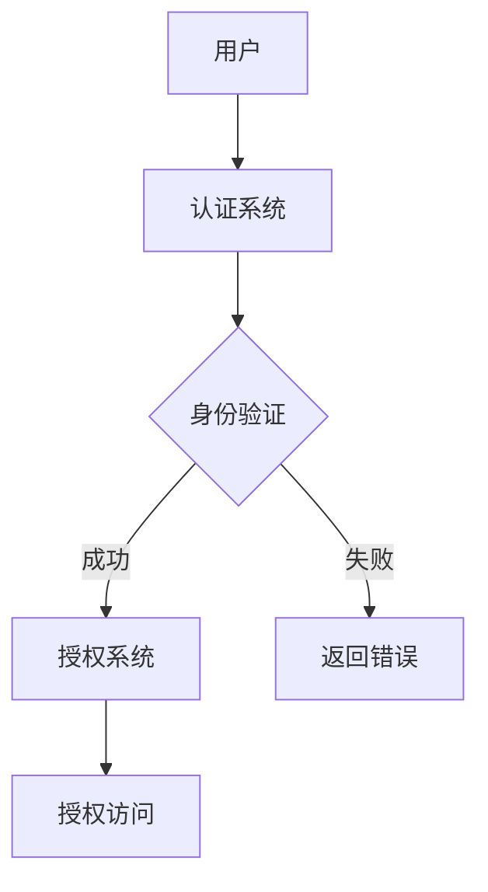
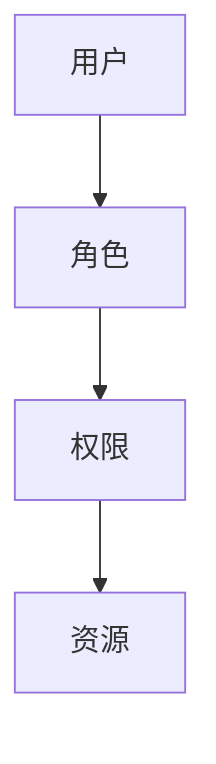
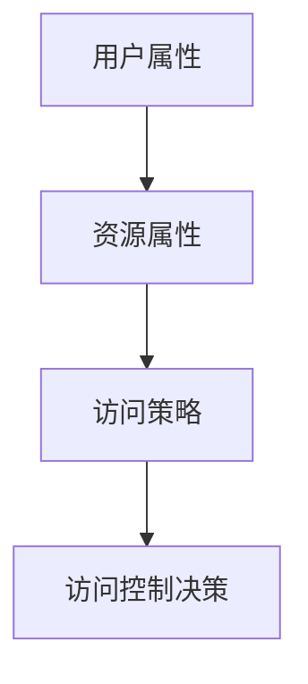
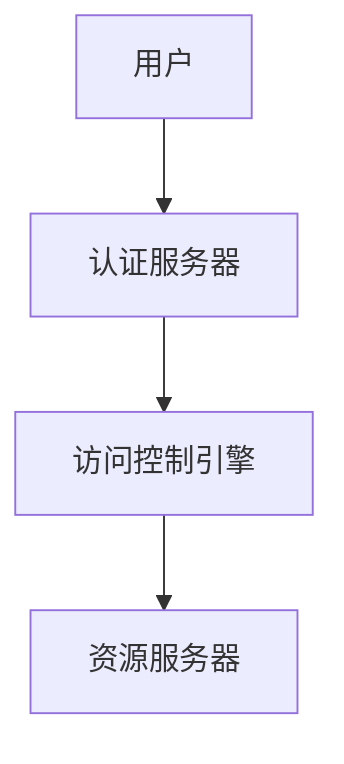

                 

# 认证与授权：保护LLM应用安全的关键

## 关键词
- **认证**
- **授权**
- **LLM应用**
- **安全防护**
- **OAuth 2.0**
- **OpenID Connect**

## 摘要
本文旨在探讨认证与授权在大型语言模型（LLM）应用安全保护中的重要性。首先，我们将介绍认证与授权的基本概念和原理，并利用Mermaid流程图展示两者的关系。接着，本文将深入分析认证技术原理，包括用户身份认证和常见认证方式。然后，我们将讨论授权管理原理，重点介绍基于角色的访问控制（RBAC）和基于属性的访问控制（ABAC）。在第二部分，我们将探讨LLM应用面临的安全挑战，并详细介绍如何通过认证与授权实现安全保护。接下来，本文将讨论安全策略设计、合规性要求以及相关法规。最后，我们将分享实践案例，介绍开源认证与授权工具，并展望未来认证与授权技术的发展趋势。通过本文的阅读，读者将了解如何保护LLM应用的安全，防范恶意攻击和数据泄露。

## 第一部分：基础概念与架构

### 第1章：认证与授权概述

#### 1.1 认证与授权的基本概念

认证（Authentication）和授权（Authorization）是信息安全领域中的两个核心概念，它们共同构成了访问控制的基本框架。

**认证**是指验证用户身份的过程，确保用户确实是他们所声明的个体。认证通常涉及用户提供某种形式的凭据，如用户名和密码、双因素认证（2FA）、生物特征等，然后系统将这些凭据与预先存储的记录进行比较，以确认身份。

**授权**是在认证成功后进行的，它确定了认证用户可以访问哪些系统资源或执行哪些操作。授权通常基于角色的访问控制（RBAC）或基于属性的访问控制（ABAC）模型，这些模型定义了用户权限的分配和执行规则。

**核心概念与联系**：
- **用户**：发起访问请求的实体。
- **身份**：用户的独特标识，通常由用户名、密码等组成。
- **认证**：验证用户身份的过程。
- **权限**：用户被授权执行的操作。
- **授权**：根据用户的身份确定他们可以访问的资源或执行的操作。

#### 1.2 认证与授权的关系

认证与授权紧密相连，但又有区别。认证是授权的前提，只有通过了认证，用户才能被授权访问系统资源。认证确保用户是合法的，而授权确保用户只能访问他们有权访问的资源。

**关系示意图**：


#### 1.3 安全性需求分析

在设计和实现认证与授权机制时，必须考虑以下安全性需求：

- **身份验证**：确保用户身份的真实性。
- **访问控制**：限制用户只能访问授权的资源。
- **审计**：记录用户的活动，以便在需要时进行审计和回溯。
- **安全通信**：确保数据在传输过程中不被窃听或篡改。
- **密码安全性**：使用强密码策略，防止密码泄露。
- **隐私保护**：确保用户的敏感信息不被泄露。

#### 1.4 认证技术的原理

**用户身份认证**：
用户身份认证是认证过程的核心。常见的认证方式包括：

- **用户名密码认证**：用户通过提供用户名和密码来验证身份。这是一种简单但安全性较低的认证方式，易受暴力破解和密码泄露的威胁。
  ```mermaid
  graph TD
      A[用户] --> B[输入用户名和密码]
      B --> C[认证系统]
      C --> D{验证用户名和密码}
      D -->|通过| E[授权访问]
      D -->|失败| F[返回错误]
  ```

- **双因素认证（2FA）**：在用户名和密码之外，再要求用户提供第二因素（如手机短信、应用程序生成的验证码）来进行身份验证。这种认证方式提高了安全性，但可能对用户体验产生一定影响。
  ```mermaid
  graph TD
      A[用户] --> B[输入用户名和密码]
      B --> C[认证系统]
      C --> D{验证用户名和密码}
      D --> E[发送验证码]
      E --> F[用户输入验证码]
      F --> G{认证系统]
      G -->|通过| H[授权访问]
      G -->|失败| I[返回错误]
  ```

- **生物特征认证**：通过用户的生物特征（如指纹、面部识别、虹膜扫描）来进行身份验证。这种认证方式具有较高的安全性，但可能涉及隐私问题和设备成本。
  ```mermaid
  graph TD
      A[用户] --> B[提供生物特征]
      B --> C[认证系统]
      C --> D{验证生物特征}
      D -->|通过| E[授权访问]
      D -->|失败| F[返回错误]
  ```

**常见认证方式**：
1. **用户名密码认证**：
   ```mermaid
   graph TD
       A[用户] --> B[输入用户名和密码]
       B --> C[认证系统]
       C --> D{验证用户名和密码}
       D -->|通过| E[存储密文密码]
       D -->|失败| F[返回错误]
   ```

2. **双因素认证（2FA）**：
   ```mermaid
   graph TD
       A[用户] --> B[输入用户名和密码]
       B --> C[认证系统]
       C --> D{验证用户名和密码}
       D --> E[发送验证码]
       E --> F[用户输入验证码]
       F --> G{验证验证码]
       G -->|通过| H[授权访问]
       G -->|失败| I[返回错误]
   ```

3. **生物特征认证**：
   ```mermaid
   graph TD
       A[用户] --> B[提供生物特征]
       B --> C[认证系统]
       C --> D{验证生物特征]
       D -->|通过| E[授权访问]
       D -->|失败| F[返回错误]
   ```

#### 1.5 授权管理原理

**授权管理**是确保用户只能访问他们有权访问的系统资源或执行的操作的过程。常见的授权管理模型包括基于角色的访问控制（RBAC）和基于属性的访问控制（ABAC）。

**基于角色的访问控制（RBAC）**：
RBAC是一种基于角色的访问控制模型，它将用户的访问权限与其角色相关联。角色是一组具有相似职责和权限的用户集合。通过为用户分配角色，可以简化访问权限的管理。

**RBAC模型架构**：


**示例伪代码**：
```python
# 用户身份认证
def authenticate(username, password):
    # 查询数据库中的用户记录
    user = find_user(username)
    # 验证用户密码
    if verify_password(user.password, password):
        # 分配角色
        assign_role(user, "admin")
        return "Authentication successful"
    else:
        return "Authentication failed"

# 用户授权
def authorize(user, resource):
    # 检查用户角色是否具有对资源的访问权限
    if has_permission(user.role, resource):
        return "Authorization successful"
    else:
        return "Authorization failed"
```

**基于属性的访问控制（ABAC）**：
ABAC是一种基于属性的访问控制模型，它根据用户属性（如部门、职位、时间等）和资源属性（如类型、所有者等）来决定用户是否可以访问资源。

**ABAC模型架构**：


**示例伪代码**：
```python
# 用户属性
user_attributes = {
    "department": "IT",
    "role": "developer"
}

# 资源属性
resource_attributes = {
    "type": "file",
    "owner": "admin"
}

# 访问策略
access_policy = {
    "IT": {
        "developer": ["read", "write"]
    }
}

# 访问控制决策
def access_control_decision(user_attributes, resource_attributes, access_policy):
    if user_attributes["department"] in access_policy and user_attributes["role"] in access_policy[user_attributes["department"]]:
        if "read" in access_policy[user_attributes["department"]][user_attributes["role"]]:
            return "Read access granted"
        if "write" in access_policy[user_attributes["department"]][user_attributes["role"]]:
            return "Write access granted"
    return "Access denied"
```

### 第2章：认证技术原理

认证技术是确保用户身份真实性的重要手段，它通过一系列的认证流程和常见的认证方式来验证用户的合法性。在这一章中，我们将深入探讨用户身份认证的过程，并详细介绍几种常见的认证方式，包括用户名密码认证、双因素认证和生物特征认证。

#### 2.1 用户身份认证的流程

用户身份认证的流程通常包括以下几个步骤：

1. **用户输入凭据**：用户通过输入用户名和密码（或其他认证方式）来证明自己的身份。
2. **认证系统验证**：认证系统接收到用户的凭据后，会与预先存储的记录进行比较，以验证用户身份。
3. **身份验证通过**：如果用户的凭据与存储的记录匹配，则认为身份验证通过，用户被授予访问权限。
4. **身份验证失败**：如果用户的凭据与存储的记录不匹配，则身份验证失败，用户无法访问系统资源。

**用户身份认证流程伪代码**：
```python
# 用户输入凭据
username = input("请输入用户名：")
password = input("请输入密码：")

# 认证系统验证
stored_username = get_stored_username()
stored_password = get_stored_password()

# 身份验证通过
if username == stored_username and verify_password(password, stored_password):
    print("身份验证通过，欢迎登录系统！")
else:
    print("身份验证失败，请检查用户名和密码！")
```

#### 2.1.1 常见认证方式

**用户名密码认证**：
用户名密码认证是最常见的认证方式之一。用户通过输入用户名和密码来证明自己的身份。然而，由于用户名和密码容易泄露或被暴力破解，这种方式的安全性较低。

**用户名密码认证流程伪代码**：
```python
# 用户输入用户名和密码
username = input("请输入用户名：")
password = input("请输入密码：")

# 验证用户名和密码
if verify_username_and_password(username, password):
    print("认证成功，欢迎登录系统！")
else:
    print("认证失败，请检查用户名和密码！")
```

**双因素认证（2FA）**：
双因素认证是一种在用户名和密码之外，再要求用户提供第二因素来进行身份验证的方法。第二因素可以是手机短信、应用程序生成的验证码、硬件令牌等。这种方式提高了安全性，但也可能对用户体验产生一定影响。

**双因素认证流程伪代码**：
```python
# 用户输入用户名和密码
username = input("请输入用户名：")
password = input("请输入密码：")

# 发送验证码
send_verification_code()

# 用户输入验证码
verification_code = input("请输入验证码：")

# 验证用户名、密码和验证码
if verify_username_and_password(username, password) and verify_verification_code(verification_code):
    print("认证成功，欢迎登录系统！")
else:
    print("认证失败，请检查用户名、密码和验证码！")
```

**生物特征认证**：
生物特征认证是通过用户的生物特征（如指纹、面部识别、虹膜扫描）来进行身份验证的方法。这种方式具有较高的安全性，但也可能涉及隐私问题和设备成本。

**生物特征认证流程伪代码**：
```python
# 用户提供生物特征
biometric_data = get_biometric_data()

# 验证生物特征
if verify_biometric_data(biometric_data):
    print("认证成功，欢迎登录系统！")
else:
    print("认证失败，请重新提供生物特征！")
```

#### 2.1.2 常见认证方式的比较

- **用户名密码认证**：简单易用，但安全性较低，易受暴力破解和密码泄露的威胁。
- **双因素认证（2FA）**：提高了安全性，但对用户体验有一定影响。
- **生物特征认证**：安全性较高，但可能涉及隐私问题和设备成本。

#### 2.1.3 用户名密码认证的安全性分析

用户名密码认证的安全性主要依赖于以下因素：

- **密码强度**：密码应足够复杂，包括字母、数字和特殊字符，并且不应过于简单，如"password"或"123456"。
- **密码存储**：密码不应以明文形式存储，而应使用哈希函数（如SHA-256）进行加密存储。
- **密码验证**：在用户登录时，应使用相同的哈希函数对输入的密码进行哈希处理，并与存储的哈希值进行比较。

**示例伪代码**：
```python
# 哈希密码
def hash_password(password):
    return sha256_hash(password)

# 存储密码
stored_password_hash = hash_password("password123")

# 验证密码
def verify_password(input_password, stored_password_hash):
    return sha256_hash(input_password) == stored_password_hash
```

#### 2.1.4 双因素认证的安全性分析

双因素认证的安全性主要依赖于以下因素：

- **第二因素**：第二因素应足够安全，如手机短信、应用程序生成的验证码、硬件令牌等。
- **验证码验证**：验证码应在一定时间内有效，并且不应被重复使用。
- **隐私保护**：在传输验证码时，应使用加密通信（如TLS）来保护数据不被窃听。

**示例伪代码**：
```python
# 发送验证码
def send_verification_code():
    verification_code = generate_verification_code()
    send_sms(verification_code)

# 用户输入验证码
def verify_verification_code(input_verification_code, stored_verification_code):
    return input_verification_code == stored_verification_code
```

#### 2.1.5 生物特征认证的安全性分析

生物特征认证的安全性主要依赖于以下因素：

- **生物特征识别算法**：算法应足够准确，以避免误识别和伪造。
- **隐私保护**：在传输生物特征数据时，应使用加密通信（如TLS）来保护数据不被窃听。
- **设备安全性**：生物特征识别设备应具有足够的安全防护措施，以防止数据泄露。

**示例伪代码**：
```python
# 生物特征识别
def verify_biometric_data(biometric_data):
    return biometric_data_match(biometric_data, stored_biometric_data)
```

### 第3章：授权管理原理

授权管理是确保用户能够访问他们有权访问的系统资源或执行的操作的过程。在本章中，我们将探讨授权管理的基本概念，并详细介绍基于角色的访问控制（RBAC）和基于属性的访问控制（ABAC）两种常见的授权管理模型。

#### 3.1 授权管理的基本概念

授权管理包括以下几个方面：

- **用户**：发起访问请求的实体。
- **权限**：用户被授权执行的操作。
- **资源**：用户可以访问的系统资源。
- **策略**：定义用户权限的规则。

**授权管理流程**：

1. **用户请求访问**：用户尝试访问系统资源或执行操作。
2. **访问控制决策**：系统根据用户权限和资源属性，决定用户是否可以访问资源或执行操作。
3. **权限验证**：如果用户具有访问权限，则允许访问；否则，拒绝访问。

**授权管理流程伪代码**：
```python
# 用户请求访问
def request_access(user, resource):
    # 检查用户权限
    if has_permission(user, resource):
        return "访问授权"
    else:
        return "访问拒绝"
```

#### 3.2 授权管理的架构

授权管理架构通常包括以下组件：

- **权限管理服务器**：负责存储和管理用户的权限。
- **认证服务器**：负责验证用户身份。
- **访问控制引擎**：负责根据用户权限和资源属性进行访问控制决策。
- **资源服务器**：负责提供用户请求的资源。

**授权管理架构示意图**：


#### 3.2.1 基于角色的访问控制（RBAC）

**基于角色的访问控制（RBAC）**是一种常见的授权管理模型，它将用户的访问权限与其角色相关联。角色是一组具有相似职责和权限的用户集合。

**RBAC模型的核心组件**：

- **用户**：发起访问请求的实体。
- **角色**：一组具有相似职责和权限的用户集合。
- **权限**：用户被授权执行的操作。
- **资源**：用户可以访问的系统资源。
- **策略**：定义用户权限的规则。

**RBAC模型的工作原理**：

1. **用户分配角色**：系统管理员将用户分配到不同的角色。
2. **角色定义权限**：为每个角色分配特定的权限。
3. **用户请求访问**：用户尝试访问系统资源或执行操作。
4. **访问控制决策**：系统根据用户的角色和资源的权限属性，决定用户是否可以访问资源或执行操作。

**RBAC模型伪代码**：
```python
# 用户分配角色
def assign_role(user, role):
    user.role = role

# 角色定义权限
def define_role_permissions(role, permissions):
    role.permissions = permissions

# 用户请求访问
def request_access(user, resource):
    if user.role in role_permissions and resource in role_permissions[user.role]:
        return "访问授权"
    else:
        return "访问拒绝"
```

**RBAC模型的优点**：

- **易于管理**：通过角色分配权限，简化了权限管理。
- **灵活性**：可以根据业务需求灵活定义角色和权限。

#### 3.2.2 基于属性的访问控制（ABAC）

**基于属性的访问控制（ABAC）**是一种更灵活的授权管理模型，它根据用户的属性（如部门、职位、时间等）和资源的属性（如类型、所有者等）来决定用户是否可以访问资源。

**ABAC模型的核心组件**：

- **用户属性**：定义用户的属性，如部门、职位、时间等。
- **资源属性**：定义资源的属性，如类型、所有者、时间等。
- **策略**：定义访问控制规则，根据用户属性和资源属性决定访问权限。

**ABAC模型的工作原理**：

1. **定义用户属性**：系统管理员定义用户的属性。
2. **定义资源属性**：系统管理员定义资源的属性。
3. **定义访问策略**：根据用户属性和资源属性，定义访问控制规则。
4. **用户请求访问**：用户尝试访问系统资源或执行操作。
5. **访问控制决策**：系统根据用户属性和资源属性，以及定义的访问策略，决定用户是否可以访问资源或执行操作。

**ABAC模型伪代码**：
```python
# 定义用户属性
def define_user_attribute(user, attribute, value):
    user.attributes[attribute] = value

# 定义资源属性
def define_resource_attribute(resource, attribute, value):
    resource.attributes[attribute] = value

# 定义访问策略
def define_access_policy(attribute, value, permission):
    access_policy[attribute][value] = permission

# 用户请求访问
def request_access(user, resource):
    if user.attribute in access_policy and access_policy[user.attribute][user.value] == "grant":
        return "访问授权"
    else:
        return "访问拒绝"
```

**ABAC模型的优点**：

- **灵活性**：可以根据具体业务需求定义用户属性和资源属性，以及访问策略。
- **适应性**：可以适应各种复杂的访问控制场景。

### 第二部分：LLM应用安全

#### 第4章：LLM应用安全挑战

随着大型语言模型（LLM）的广泛应用，其安全性问题也越来越受到关注。LLM应用面临着多种安全挑战，包括恶意攻击、数据泄露和软件供应链攻击。在本章中，我们将探讨这些挑战，并分析如何通过认证与授权机制来缓解这些风险。

#### 4.1 LLM应用的安全性问题

**恶意攻击的风险**：

LLM应用可能会遭受各种恶意攻击，如SQL注入、跨站脚本（XSS）攻击、跨站请求伪造（CSRF）攻击等。这些攻击可能导致数据泄露、系统瘫痪甚至恶意操作。

**数据泄露的风险**：

LLM应用通常处理大量的敏感数据，如用户个人信息、业务数据等。如果这些数据泄露，可能会对用户和企业造成重大损失。

**软件供应链攻击的风险**：

软件供应链攻击是指攻击者通过篡改LLM应用的依赖库或组件来植入恶意代码。这种攻击可能导致恶意操作、数据泄露等安全问题。

#### 4.2 认证与授权在LLM应用中的实现

为了保护LLM应用的安全，认证与授权机制是至关重要的。以下是如何在LLM应用中实现认证与授权的一些建议：

**4.2.1 认证与授权架构设计**

- **前端认证与授权**：在用户访问LLM应用的前端界面时，进行用户身份认证和权限验证。
- **后端认证与授权**：在用户请求访问LLM应用的后端资源时，进行用户身份认证和权限验证。

**4.2.2 安全协议与应用**

- **OAuth 2.0与LLM应用**：OAuth 2.0是一种常用的开放标准授权协议，可用于实现认证与授权。它允许第三方应用程序代表用户访问LLM应用的数据，同时保护用户的隐私。
- **OpenID Connect与LLM应用**：OpenID Connect是一种基于OAuth 2.0的认证协议，它为用户提供了单一的登录体验，并确保用户的身份得到验证。

**4.2.3 安全策略与合规性**

- **安全策略设计**：制定适当的安全策略，包括认证方式、权限分配、审计和日志记录等。
- **合规性要求**：遵守相关的法规和标准，如GDPR、CCPA等，确保用户的隐私和数据安全。

#### 4.3 实践案例

**4.3.1 案例背景**

某企业开发了一款基于LLM的自然语言处理应用，该应用需要处理大量的用户数据和业务数据。为了保护应用的安全，企业决定采用认证与授权机制。

**4.3.2 安全架构设计**

- **前端认证与授权**：采用OAuth 2.0和OpenID Connect协议实现用户身份认证和权限验证。
- **后端认证与授权**：采用JWT（JSON Web Token）实现用户身份认证和权限验证。
- **安全协议与应用**：使用HTTPS协议保护数据传输安全，使用数据库加密保护用户数据。

**4.3.3 实现与部署**

- **用户身份认证**：用户通过输入用户名和密码进行认证，认证成功后，系统生成JWT令牌。
- **权限验证**：用户请求访问资源时，系统验证JWT令牌的有效性和权限，确保用户只能访问授权的资源。

**4.3.4 代码解读与分析**

以下是用户身份认证和权限验证的代码示例：

**用户身份认证代码**：
```python
# 用户登录
def login(username, password):
    user = get_user_by_username(username)
    if user and verify_password(password, user.password):
        generate_jwt_token(user)
    else:
        return "登录失败"

# JWT令牌生成
def generate_jwt_token(user):
    payload = {
        "username": user.username,
        "exp": datetime.utcnow() + timedelta(hours=24)
    }
    jwt_token = jwt.encode(payload, SECRET_KEY, algorithm="HS256")
    return jwt_token
```

**权限验证代码**：
```python
# 权限验证
def verify_permission(jwt_token, resource):
    payload = jwt.decode(jwt_token, SECRET_KEY, algorithms=["HS256"])
    if payload["username"] in get_authorized_users(resource):
        return "权限验证通过"
    else:
        return "权限验证失败"
```

**4.3.5 案例分析**

通过实施认证与授权机制，该企业的LLM应用成功防范了恶意攻击和数据泄露风险。用户只能访问授权的资源，确保了数据的安全性和隐私保护。此外，企业还制定了安全策略和合规性要求，确保应用符合相关法规和标准。

### 第5章：认证与授权在LLM应用中的实现

#### 5.1 认证与授权架构设计

在LLM应用中，为了确保安全性和合规性，认证与授权架构的设计至关重要。以下是一个典型的认证与授权架构设计，包括前端认证与授权和后端认证与授权。

**5.1.1 前端认证与授权**

前端认证与授权主要涉及用户登录、注册、密码重置等功能。以下是一个简单的架构设计：

1. **用户注册**：用户通过填写注册表单，提交用户名、密码、邮箱等信息，前端进行基本验证后，将数据发送至后端进行存储。
2. **用户登录**：用户通过输入用户名和密码，前端进行基本验证后，将数据发送至后端进行身份认证。认证成功后，后端生成JWT（JSON Web Token）并发送至前端。
3. **密码重置**：用户通过输入邮箱地址，前端发送重置密码的邮件链接至用户邮箱。用户点击链接后，前端接收链接中的JWT，将其发送至后端进行密码重置。

**5.1.2 后端认证与授权**

后端认证与授权主要涉及用户身份认证、权限验证等功能。以下是一个简单的架构设计：

1. **用户身份认证**：后端使用JWT进行用户身份认证。用户登录时，前端将JWT发送至后端进行验证。验证成功后，后端返回用户信息和权限。
2. **权限验证**：后端根据用户的权限和请求的资源，进行访问控制决策。如果用户具有访问权限，则允许访问；否则，拒绝访问。

**5.1.3 安全协议与应用**

为了保证数据传输的安全性，前端和后端之间使用HTTPS协议进行通信。为了确保用户身份和数据的完整性，使用JWT进行认证。此外，为了提高系统的安全性，还可以采用以下措施：

- **加密存储**：使用哈希函数加密存储用户的密码。
- **双因素认证**：在用户登录时，使用短信验证码或应用生成的验证码进行二次验证。
- **权限控制**：使用基于角色的访问控制（RBAC）或基于属性的访问控制（ABAC）进行权限管理。

#### 5.2 安全协议与应用

**5.2.1 OAuth 2.0与LLM应用**

OAuth 2.0是一种开放标准授权协议，主要用于分布式系统中的认证与授权。在LLM应用中，OAuth 2.0可以用于第三方应用程序访问用户数据，从而保护用户的隐私和数据安全。

**OAuth 2.0的工作流程**：

1. **注册应用程序**：应用开发者向认证服务器注册应用程序，获取客户端ID和客户端密钥。
2. **用户授权**：用户登录认证服务器，应用开发者请求用户的授权。
3. **获取访问令牌**：用户同意授权后，认证服务器返回访问令牌。
4. **访问资源**：应用程序使用访问令牌访问受保护的资源。

**5.2.2 OpenID Connect与LLM应用**

OpenID Connect是一种基于OAuth 2.0的认证协议，旨在提供用户身份认证。在LLM应用中，OpenID Connect可以用于简化用户登录流程，并提供用户身份验证。

**OpenID Connect的工作流程**：

1. **注册应用程序**：应用开发者向认证服务器注册应用程序，获取客户端ID和客户端密钥。
2. **用户登录**：用户登录认证服务器，应用开发者请求用户的身份认证。
3. **获取身份认证信息**：认证服务器返回用户身份认证信息，包括用户名、邮箱等。
4. **访问资源**：应用程序使用身份认证信息访问受保护的资源。

#### 5.3 安全策略与合规性

**5.3.1 安全策略设计**

安全策略是确保LLM应用安全的核心。以下是一个简单安全策略的示例：

1. **用户认证**：使用强密码策略，要求用户使用复杂密码，并定期更换密码。
2. **权限管理**：使用基于角色的访问控制（RBAC）或基于属性的访问控制（ABAC），确保用户只能访问授权的资源。
3. **日志记录与审计**：记录用户的活动日志，定期进行审计，以便在发生安全事件时进行追踪和调查。

**5.3.2 合规性要求**

遵守相关的法规和标准对于确保LLM应用的安全和合规性至关重要。以下是一些常见的合规性要求：

1. **数据保护法规**：如GDPR、CCPA等，要求企业保护用户的个人信息和隐私。
2. **认证与授权相关的法规要求**：如OWASP认证与授权标准，要求企业采用安全的认证与授权机制，防范安全漏洞。

### 第6章：安全策略与合规性

#### 6.1 安全策略设计

为了确保LLM应用的安全，制定并实施适当的安全策略是至关重要的。以下是一个基于最佳实践的安全策略设计示例：

1. **用户认证策略**：
   - **强密码要求**：用户密码应包含字母、数字和特殊字符，且长度至少为8个字符。
   - **密码复杂度检查**：定期检查用户密码的复杂度，确保用户不使用易猜测的密码。
   - **密码加密存储**：使用哈希函数（如SHA-256）对用户密码进行加密存储，并添加盐值以增强安全性。
   - **双因素认证（2FA）**：强制要求用户启用2FA，以提高账户安全性。

2. **权限管理策略**：
   - **基于角色的访问控制（RBAC）**：为不同角色的用户分配不同的权限，确保用户只能访问其权限范围内的资源。
   - **最小权限原则**：用户应仅拥有执行其工作所需的最低权限，避免权限过度分配。
   - **权限审查**：定期审查用户的权限，确保权限的合理性和必要性。

3. **数据安全策略**：
   - **数据加密**：对敏感数据进行加密存储，确保数据在存储和传输过程中不被窃取或篡改。
   - **数据备份与恢复**：定期备份数据，并确保备份数据的安全性和可恢复性。
   - **数据访问日志**：记录用户对敏感数据的访问行为，以便在发生数据泄露时进行追踪和调查。

4. **日志记录与审计策略**：
   - **活动日志记录**：记录系统活动和用户操作，包括登录、访问、修改等行为。
   - **异常检测与报警**：使用监控工具检测异常行为，并自动发送报警通知。
   - **定期审计**：定期进行安全审计，检查安全策略的执行情况和系统的安全漏洞。

#### 6.2 安全策略的实施步骤

1. **评估当前安全状况**：
   - 对现有系统进行安全评估，识别潜在的安全漏洞和风险。
   - 分析安全需求，确定需要实施的安全措施。

2. **制定安全策略**：
   - 根据评估结果，制定符合实际需求的安全策略。
   - 确定安全策略的目标、范围和实施步骤。

3. **培训与宣传**：
   - 对相关人员进行安全意识培训，提高安全意识。
   - 通过内部通讯、培训课程等方式，宣传安全策略和最佳实践。

4. **实施安全措施**：
   - 按照安全策略的要求，实施相应的安全措施。
   - 配置安全设备、部署安全软件、加强访问控制等。

5. **监控与审计**：
   - 使用监控工具和审计日志，持续监控系统的安全状况。
   - 定期进行安全审计，检查安全策略的执行情况和系统的安全漏洞。

6. **更新与改进**：
   - 随着技术和业务需求的变化，定期更新安全策略。
   - 根据审计结果和监控数据，改进安全措施，提高系统的安全性。

#### 6.3 合规性要求

在LLM应用的安全策略中，合规性要求是确保应用遵守相关法律法规和行业标准的重要环节。以下是一些关键的合规性要求：

1. **数据保护法规**：
   - **GDPR（通用数据保护条例）**：确保用户的个人信息得到保护，包括收集、处理、存储和传输个人数据的合法性和透明性。
   - **CCPA（加州消费者隐私法案）**：确保用户的个人数据得到适当的保护，并允许用户对其数据的访问、删除和拒绝销售等权利。

2. **认证与授权相关的法规要求**：
   - **ISO/IEC 27001**：确保组织的信息安全管理符合国际标准，包括认证与授权机制的设计、实施和监控。
   - **OWASP（开放式网络应用安全项目）**：遵循OWASP的认证与授权最佳实践，确保认证与授权机制的安全性。

3. **隐私保护法规**：
   - **HIPAA（健康保险携带与责任法案）**：如果LLM应用涉及医疗信息，确保遵守HIPAA的隐私保护要求。
   - **COPPA（儿童在线隐私保护法案）**：确保涉及儿童信息的LLM应用遵守COPPA的规定，保护儿童的在线隐私。

为了确保合规性，LLM应用需要：

- **定期进行合规性评估**：评估当前的安全措施是否满足相关法规的要求。
- **与合规专家合作**：与法律专家和合规顾问合作，确保安全策略符合最新的法规要求。
- **持续监控与改进**：随着法规的更新和业务需求的变化，持续监控合规性，并根据需要进行改进。

### 第7章：实践案例与工具

#### 7.1 实践案例分享

在本节中，我们将分享一个企业内部LLM应用的安全防护案例，并详细讨论其安全架构设计、实现步骤和部署过程。

**7.1.1 案例背景**

某大型企业开发了一款基于LLM的自然语言处理应用，用于处理内部文档和业务数据。为了确保应用的安全性，企业决定采用完善的认证与授权机制，以防范恶意攻击和数据泄露。

**7.1.2 安全架构设计**

企业采用以下安全架构设计：

- **前端认证与授权**：使用OAuth 2.0和OpenID Connect协议，实现用户身份认证和权限验证。
- **后端认证与授权**：使用JWT（JSON Web Token）进行用户身份认证和权限验证。
- **安全协议与应用**：使用HTTPS协议保护数据传输安全，使用数据库加密保护敏感数据。

**7.1.3 实现与部署**

**1. 前端认证与授权实现**：

- 用户注册：用户通过填写注册表单提交用户名、密码、邮箱等信息。前端进行基本验证后，将数据发送至后端进行存储。
- 用户登录：用户通过输入用户名和密码进行登录。前端验证用户名和密码后，生成JWT令牌并发送至后端。
- 权限验证：用户请求访问资源时，前端将JWT发送至后端。后端验证JWT的有效性和权限，确保用户只能访问授权的资源。

**2. 后端认证与授权实现**：

- 用户身份认证：后端使用JWT进行用户身份认证。用户登录时，前端将JWT发送至后端进行验证。验证成功后，后端返回用户信息和权限。
- 权限验证：后端根据用户的权限和请求的资源，进行访问控制决策。如果用户具有访问权限，则允许访问；否则，拒绝访问。

**7.1.4 安全策略与合规性**

- **安全策略**：制定包括用户认证、权限管理、数据安全、日志记录等方面的安全策略。
- **合规性**：确保应用遵守GDPR、CCPA等相关法规的要求，保护用户的隐私和数据安全。

#### 7.2 开源认证与授权工具介绍

在本节中，我们将介绍一些流行的开源认证与授权工具，包括Keycloak、Apache Kafka和Apache Ranger。

**7.2.1 Keycloak**

Keycloak是一款开源的单点登录（SSO）和访问管理（AA）解决方案。它支持多种认证协议，如OAuth 2.0、OpenID Connect、SAML等。Keycloak的特点包括：

- **易用性**：Keycloak提供友好的Web界面，方便管理员进行配置和管理。
- **灵活的认证机制**：支持多种认证方式，如用户名密码、双因素认证、OAuth等。
- **集成性**：Keycloak可以与其他应用程序和服务集成，实现单点登录和访问控制。

**7.2.2 Apache Kafka**

Apache Kafka是一款开源的分布式消息队列系统。虽然Kafka本身不是专门的认证与授权工具，但它在LLM应用的安全架构中扮演着重要角色。Kafka的特点包括：

- **高吞吐量**：Kafka可以处理大规模数据流，支持高吞吐量的消息传输。
- **分布式架构**：Kafka可以横向扩展，支持分布式部署。
- **持久化存储**：Kafka的消息可以持久化存储，保证数据不丢失。

**7.2.3 Apache Ranger**

Apache Ranger是一款开源的统一数据安全和治理框架。它提供了细粒度的访问控制和审计功能，适用于各种类型的数据存储系统，如HDFS、Hive、HBase等。Ranger的特点包括：

- **细粒度访问控制**：Ranger支持基于用户、角色和资源的访问控制，确保用户只能访问授权的数据。
- **审计和监控**：Ranger记录用户对数据的访问行为，并提供监控和报警功能。
- **易于部署和管理**：Ranger提供基于Web的界面，方便管理员进行配置和管理。

#### 7.3 工具使用与部署

**7.3.1 Keycloak**

**安装与配置**：

- 在Linux服务器上安装Java环境。
- 下载Keycloak的最新版本，解压并运行。
- 使用Keycloak的Web界面进行配置，包括添加新的认证机制、角色和用户。

**7.3.2 Apache Kafka**

**安装与配置**：

- 在Linux服务器上安装Zookeeper。
- 下载Apache Kafka的压缩包，解压并运行。
- 配置Kafka的集群，设置Zookeeper连接信息和Kafka服务器配置。
- 启动Kafka服务器和Zookeeper，确保集群正常运行。

**7.3.3 Apache Ranger**

**安装与配置**：

- 在Linux服务器上安装Hadoop和相关组件。
- 下载Apache Ranger的最新版本，解压并运行。
- 配置Ranger的数据库连接，初始化Ranger的元数据存储。
- 使用Ranger的Web界面进行配置，包括添加新的Hadoop服务、角色和策略。

### 第8章：未来发展趋势与展望

#### 9.1 新兴认证与授权技术

随着技术的不断进步，新兴的认证与授权技术正在不断涌现，为LLM应用的安全提供更加高效和灵活的解决方案。

**9.1.1 生物特征识别**

生物特征识别技术，如指纹识别、面部识别和虹膜扫描，已经逐渐成为认证与授权领域的热门话题。这些技术具有高安全性和便捷性的特点，但同时也面临着隐私保护和设备成本等问题。

**9.1.2 区块链技术在认证与授权中的应用**

区块链技术以其去中心化、不可篡改的特点，为认证与授权提供了一种新的可能性。通过区块链技术，可以实现更加安全、透明和高效的认证与授权流程。

**9.1.3 AI驱动的安全防护**

人工智能（AI）技术在安全防护领域的应用正在逐渐成熟。AI可以用于异常检测、入侵防御和威胁情报分析，从而提高认证与授权的安全性和响应速度。

#### 9.2 安全趋势分析

**9.2.1 安全自动化**

随着安全自动化工具的不断发展，安全防护的自动化程度将进一步提高。通过自动化工具，安全团队可以更加高效地检测、响应和处理安全事件。

**9.2.2 云原生认证与授权**

随着云原生应用的兴起，云原生认证与授权技术也变得越来越重要。云原生认证与授权技术可以更好地适应容器化、微服务架构和动态资源分配的特点。

**9.2.3 安全合规性**

随着数据保护法规的不断完善，安全合规性将成为企业安全战略的重要组成部分。企业需要确保其认证与授权机制符合相关法规的要求，以避免法律风险和罚款。

### 第9章：总结与展望

本文从认证与授权的基本概念、认证技术原理、授权管理原理、LLM应用安全挑战、安全策略设计以及开源认证与授权工具等方面，全面探讨了认证与授权在LLM应用安全保护中的重要性。通过本文的阅读，读者可以了解到：

1. **认证与授权的基本概念和关系**：认证与授权是信息安全领域中的两个核心概念，它们共同构成了访问控制的基本框架。
2. **常见的认证方式**：用户名密码认证、双因素认证和生物特征认证是常见的认证方式，每种方式都有其优势和劣势。
3. **授权管理原理**：基于角色的访问控制（RBAC）和基于属性的访问控制（ABAC）是两种常见的授权管理模型，它们可以根据实际需求灵活应用。
4. **LLM应用安全挑战**：LLM应用面临多种安全挑战，如恶意攻击、数据泄露和软件供应链攻击，需要采取有效的认证与授权机制来应对。
5. **安全策略与合规性**：制定适当的安全策略和遵守相关法规要求，是确保LLM应用安全的关键。
6. **开源认证与授权工具**：Keycloak、Apache Kafka和Apache Ranger等开源工具提供了丰富的功能，可以帮助企业构建安全的认证与授权架构。

未来，随着新兴认证与授权技术的发展和云原生应用的普及，认证与授权技术将变得更加高效、灵活和可扩展。读者可以关注以下方面：

1. **生物特征识别技术**：探索其在认证与授权中的应用，提高安全性和用户体验。
2. **区块链技术**：研究其在认证与授权中的应用，实现去中心化、不可篡改的认证与授权流程。
3. **AI驱动的安全防护**：利用人工智能技术，提高认证与授权的安全性和响应速度。
4. **云原生认证与授权**：关注云原生环境下认证与授权的新技术和新方法，确保云原生应用的 安全性。

通过不断学习和实践，读者可以更好地应对LLM应用的安全挑战，构建安全、可靠和高效的认证与授权系统。

### 附录

#### 附录A：常用认证与授权协议详解

**A.1 OAuth 2.0 协议详解**

OAuth 2.0是一种开放标准授权协议，用于分布式系统中的认证与授权。以下是OAuth 2.0的工作流程和主要角色与职责：

**工作流程**：

1. **注册应用程序**：应用开发者向认证服务器注册应用程序，获取客户端ID和客户端密钥。
2. **用户授权**：用户登录认证服务器，应用开发者请求用户的授权。
3. **获取访问令牌**：用户同意授权后，认证服务器返回访问令牌。
4. **访问资源**：应用程序使用访问令牌访问受保护的资源。

**主要角色与职责**：

- **用户**：发起访问请求的实体，需要登录认证服务器。
- **认证服务器**：负责验证用户身份，并根据用户授权返回访问令牌。
- **资源服务器**：提供受保护的资源，需要验证访问令牌的有效性。
- **应用程序**：使用访问令牌访问资源服务器，获取用户数据。

**A.2 OpenID Connect 协议详解**

OpenID Connect 是基于 OAuth 2.0 的认证协议，提供用户身份验证。以下是OpenID Connect 的工作流程和主要角色与职责：

**工作流程**：

1. **注册应用程序**：应用开发者向认证服务器注册应用程序，获取客户端ID和客户端密钥。
2. **用户登录**：用户登录认证服务器，应用开发者请求用户的身份认证。
3. **获取身份认证信息**：认证服务器返回用户身份认证信息，包括用户名、邮箱等。
4. **访问资源**：应用程序使用身份认证信息访问受保护的资源。

**主要角色与职责**：

- **用户**：发起访问请求的实体，需要登录认证服务器。
- **认证服务器**：负责验证用户身份，并提供用户身份认证信息。
- **资源服务器**：提供受保护的资源，需要验证用户身份认证信息。
- **应用程序**：使用用户身份认证信息访问资源服务器。

#### 附录B：伪代码与数学模型

**B.1 用户认证算法伪代码**

```python
# 用户输入用户名和密码
username = input("请输入用户名：")
password = input("请输入密码：")

# 查询数据库中的用户记录
user = find_user(username)

# 验证用户密码
if verify_password(user.password, password):
    print("认证成功，欢迎登录系统！")
else:
    print("认证失败，请检查用户名和密码！")
```

**B.2 授权管理算法伪代码**

```python
# 用户请求访问资源
def request_access(user, resource):
    # 检查用户权限
    if has_permission(user, resource):
        print("授权访问成功！")
    else:
        print("授权访问失败！")
```

**B.3 数学模型**

**加密算法**：

假设用户A想要向服务器S发送消息m，并确保消息的机密性和完整性。用户A可以使用哈希函数H和加密算法E（如AES）进行加密：

$$
c = E(K, H(m))
$$

其中，K是加密密钥，H(m)是消息m的哈希值。服务器S接收到消息c后，使用相同的加密算法和解密密钥K解密消息：

$$
m' = D(K, c)
$$

如果m'等于m，则服务器S可以确认消息的完整性和真实性。

**访问控制模型**：

假设用户u请求访问资源r，系统根据以下访问控制规则进行决策：

$$
u \in P_r \land r \in R_u
$$

其中，$P_r$是资源r的权限集合，$R_u$是用户u的资源集合。如果上述条件成立，则用户u被授权访问资源r。

#### 附录C：源代码与案例分析

**C.1 LLM应用安全防护代码示例**

以下是一个简单的LLM应用安全防护代码示例，包括认证模块和授权模块。

**认证模块**：

```python
# 导入所需的库
import jwt
import json
import bcrypt

# 用户注册
def register_user(username, password):
    # 对密码进行哈希处理
    hashed_password = bcrypt.hashpw(password.encode('utf-8'), bcrypt.gensalt())
    # 将用户信息存储在数据库中
    # ...

# 用户登录
def login_user(username, password):
    # 从数据库中查询用户信息
    user = find_user_by_username(username)
    # 验证用户密码
    if bcrypt.checkpw(password.encode('utf-8'), user.password):
        # 生成JWT令牌
        jwt_token = jwt.encode({
            "username": username,
            "exp": datetime.utcnow() + timedelta(hours=24)
        }, SECRET_KEY, algorithm="HS256")
        return jwt_token
    else:
        return None
```

**授权模块**：

```python
# 导入所需的库
import jwt
import json

# 权限验证
def verify_permission(jwt_token, resource):
    # 解析JWT令牌
    payload = jwt.decode(jwt_token, SECRET_KEY, algorithms=["HS256"])
    username = payload["username"]
    # 检查用户是否有访问资源的权限
    if username in get_authorized_users(resource):
        return True
    else:
        return False
```

**C.2 恶意攻击案例解析**

以下是一个针对LLM应用的SQL注入攻击案例。

**攻击者试图注入恶意SQL代码**：

```python
# 用户输入搜索关键词
search_query = input("请输入搜索关键词：")

# 构造恶意SQL代码
malicious_query = search_query + "'; DROP TABLE users; --"

# 执行SQL查询
result = execute_sql_query(malicious_query)
```

**防御措施**：

1. **使用参数化查询**：避免直接将用户输入拼接成SQL查询语句，而是使用参数化查询，将用户输入作为参数传递。
2. **预编译查询**：使用预编译查询，将SQL查询语句和参数编译成可重用的查询计划，提高查询效率并防止SQL注入。
3. **输入验证与过滤**：对用户输入进行严格的验证和过滤，只允许合法的字符和格式，防止恶意代码注入。

**C.3 数据泄露事件分析**

以下是一个LLM应用的数据泄露事件案例。

**攻击者窃取JWT令牌**：

```python
# 攻击者拦截用户与服务器之间的通信，获取JWT令牌
jwt_token = intercepted_jwt_token

# 解析JWT令牌
payload = jwt.decode(jwt_token, SECRET_KEY, algorithms=["HS256"])
username = payload["username"]

# 检查用户是否有权限访问敏感数据
if verify_permission(jwt_token, "sensitive_data"):
    # 获取敏感数据
    sensitive_data = get_sensitive_data(username)
    # 将敏感数据发送给攻击者
    send_sensitive_data_to_attacker(sensitive_data)
```

**防御措施**：

1. **令牌安全**：确保JWT令牌在传输过程中使用HTTPS协议进行加密传输，防止令牌被窃取。
2. **令牌有效期**：设置JWT令牌的有效期，避免长期有效的令牌增加风险。
3. **令牌内容加密**：对JWT令牌的内容进行加密，确保令牌中的敏感信息不被泄露。
4. **多因素认证**：在敏感操作或访问敏感数据时，要求用户进行多因素认证，提高安全性。

**C.4 项目小结**

通过本案例的分析，我们可以得出以下结论：

1. **SQL注入攻击**：使用参数化查询和预编译查询可以有效防止SQL注入攻击。
2. **数据泄露**：确保令牌的安全传输、有效期限和内容加密，可以降低数据泄露的风险。
3. **安全策略**：制定全面的安全策略，包括用户认证、权限管理和数据保护，是确保LLM应用安全的关键。
4. **持续监控与改进**：定期进行安全评估和审计，及时修复漏洞和改进安全措施，是保持应用安全的关键。

#### 最佳实践 tips、小结、注意事项、拓展阅读

**最佳实践 tips**：

1. **使用强密码策略**：要求用户使用强密码，并定期更换密码。
2. **启用双因素认证（2FA）**：提高账户的安全性，防止密码泄露。
3. **加密存储密码**：使用哈希函数和盐值加密存储用户密码。
4. **使用HTTPS协议**：确保数据在传输过程中加密，防止窃听和篡改。

**小结**：

本文详细介绍了认证与授权在LLM应用安全保护中的重要性，包括基本概念、认证技术原理、授权管理原理、安全策略设计、开源认证与授权工具以及实践案例分析。通过本文的阅读，读者可以了解到如何保护LLM应用的安全，防范恶意攻击和数据泄露。

**注意事项**：

1. **认证与授权机制**：确保认证与授权机制的设计和实现符合最佳实践，提高系统的安全性。
2. **安全合规性**：遵守相关法规和标准，确保应用的安全性和合规性。
3. **定期审计与更新**：定期进行安全审计和更新，确保安全策略和技术的有效性。

**拓展阅读**：

1. **《网络安全原理与实践》**：详细介绍了网络安全的基本原理和实践方法。
2. **《认证与授权技术》**：深入探讨了认证与授权技术的原理和应用。
3. **《区块链技术原理与应用》**：介绍了区块链技术在认证与授权中的应用。

### 附录D：认证与授权相关技术术语解释

**认证（Authentication）**：验证用户身份的过程，确保用户确实是他们所声明的个体。认证通常涉及用户提供某种形式的凭据，如用户名和密码、双因素认证（2FA）、生物特征等。

**授权（Authorization）**：在认证成功后进行的，确定用户可以访问哪些系统资源或执行哪些操作的过程。授权通常基于角色的访问控制（RBAC）或基于属性的访问控制（ABAC）模型。

**基于角色的访问控制（RBAC）**：一种访问控制模型，将用户的访问权限与其角色相关联。角色是一组具有相似职责和权限的用户集合。

**基于属性的访问控制（ABAC）**：一种访问控制模型，根据用户属性（如部门、职位、时间等）和资源属性（如类型、所有者等）来决定用户是否可以访问资源。

**JSON Web Token（JWT）**：一种基于JSON的开放标准用于生成认证令牌，包含用户身份信息和有效期等信息。

**OAuth 2.0**：一种开放标准授权协议，允许第三方应用程序代表用户访问资源，同时保护用户的隐私。

**OpenID Connect**：一种基于OAuth 2.0的认证协议，提供用户身份认证功能。

**双因素认证（2FA）**：在用户名和密码之外，再要求用户提供第二因素（如手机短信、应用程序生成的验证码）来进行身份验证。

**生物特征认证**：通过用户的生物特征（如指纹、面部识别、虹膜扫描）来进行身份验证。

**SQL注入**：一种常见的网络攻击技术，攻击者通过在输入框中注入恶意SQL代码，从而执行未授权的数据库操作。

**HTTPS**：一种安全的HTTP协议，通过SSL/TLS加密传输数据，确保数据传输的安全性和完整性。

