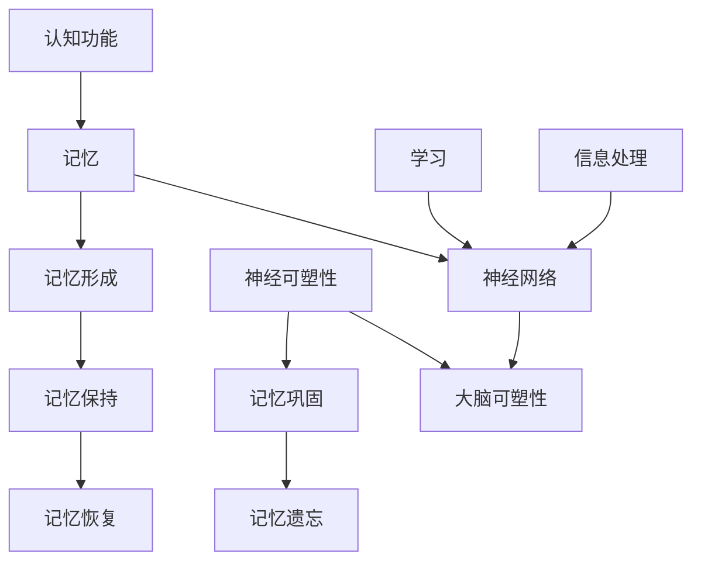

                 


### 1. 背景介绍

记忆是人类大脑最重要的功能之一，它使我们能够学习、适应环境并做出明智的决策。在过去的几十年里，神经科学家和计算机科学家一直在努力理解记忆是如何在神经元中形成的。近年来，随着深度学习和神经网络的兴起，研究者们开始探索如何将大脑的神经活动建模为数学算法。

本文的目标是介绍一种基于神经网络的记忆形成模型，并探讨大脑可塑性的数学机制。通过梳理核心概念、讲解核心算法原理、展示数学模型和实际项目实战，我们希望为读者提供一份全面而深入的解读。

首先，我们需要明确书中的核心概念，包括“记忆”、“神经网络”、“大脑可塑性”等。这些概念之间的关系可以通过一个Mermaid流程图来展示，以便读者能够直观地理解各个概念是如何相互关联的。

### 2. 核心概念与联系

**记忆**是大脑对信息的储存和回忆能力。它分为短期记忆和长期记忆两种类型。短期记忆通常只能保持几秒钟到几分钟的信息，而长期记忆则可以持续数小时、数天甚至数十年。

**神经网络**是一种由大量相互连接的简单计算单元（神经元）组成的计算模型。它通过学习输入数据来发现数据中的模式和规律。神经网络在人工智能领域有着广泛的应用，包括图像识别、语音识别、自然语言处理等。

**大脑可塑性**是指大脑在外界刺激下能够改变其结构和功能的能力。它涉及到神经元的生长、死亡、连接重组等多个过程。

这些概念之间的关系可以用以下流程图表示：

```
graph TB
A[记忆] --> B[神经网络]
B --> C[大脑可塑性]
D[神经可塑性] --> C
E[学习] --> B
F[信息处理] --> B
G[认知功能] --> A
A --> H[记忆形成]
H --> I[记忆保持]
I --> J[记忆恢复]
D --> K[记忆巩固]
K --> L[记忆遗忘]
```

在这个流程图中，记忆形成是神经网络和信息处理的结果，而大脑可塑性则是在学习过程中发生的。记忆的保持、恢复和遗忘都与神经网络的动态变化密切相关。

### 3. 核心算法原理讲解

为了深入理解记忆形成的神经网络模型，我们需要详细讲解神经网络的学习算法和大脑可塑性的相关机制。以下是这些算法的基本原理和步骤。

#### 3.1 神经网络学习算法

神经网络学习算法的核心是通过反向传播算法来优化网络中的权重，从而提高模型的预测准确性。以下是神经网络学习算法的伪代码：

```python
function NeuralNetworkLearningAlgorithm(data, labels, epochs):
    for epoch in 1 to epochs:
        for each sample in data:
            output = forward_pass(sample)
            error = calculate_error(output, labels)
            backward_pass(error)
    return trained_network
```

其中，`forward_pass` 函数负责计算网络的输出，`calculate_error` 函数计算输出和标签之间的误差，`backward_pass` 函数根据误差更新网络的权重。

#### 3.2 大脑可塑性机制

大脑可塑性涉及到多个神经过程，包括突触可塑性、神经再生和神经元连接重组等。以下是一个简化的大脑可塑性机制的伪代码：

```python
function PlasticityMechanism(input, output, learning_rate):
    delta_weights = learning_rate * derivative_of_output_with_respect_to_weights
    update_weights(weights, delta_weights)
    return updated_weights
```

在这个机制中，`input` 和 `output` 分别表示输入和输出，`learning_rate` 是学习速率，`derivative_of_output_with_respect_to_weights` 是输出对权重的导数，用于计算权重的更新量。

### 4. 数学模型和数学公式讲解

记忆形成的神经网络模型可以借助数学模型来描述。以下是一些关键的数学模型和公式。

#### 4.1 记忆的数学模型

记忆的数学模型可以表示为：

$$
M(t) = f(\sum_{i=1}^{n} w_i \cdot e^{-\lambda \cdot t_i})
$$

其中，$M(t)$ 表示在时间 $t$ 时刻的记忆强度，$w_i$ 是权重，$t_i$ 是学习时间，$\lambda$ 是遗忘率，$f$ 是激活函数。

#### 4.2 记忆巩固的数学模型

记忆巩固的数学模型可以表示为：

$$
M_{巩固}(t) = M(t) + \alpha \cdot (M(t) - M_{初始})
$$

其中，$M_{巩固}(t)$ 是经过巩固后的记忆强度，$\alpha$ 是巩固系数。

#### 4.3 大脑可塑性的数学模型

大脑可塑性的数学模型可以表示为：

$$
P(t) = \frac{1}{1 + e^{-\beta \cdot (I - I_0)}}
$$

其中，$P(t)$ 是在时间 $t$ 时刻的可塑性，$I$ 是刺激强度，$I_0$ 是阈值，$\beta$ 是调节参数。

### 5. 项目实战

为了更好地理解记忆形成的神经网络模型，我们将在本节中实现一个简单的记忆形成神经网络模型，并分析其实际应用。

#### 5.1 环境搭建

在Python环境中，我们需要安装以下库：
- TensorFlow
- NumPy
- Matplotlib

安装命令如下：

```bash
pip install tensorflow numpy matplotlib
```

#### 5.2 源代码实现

下面是一个简单的记忆形成神经网络模型的实现：

```python
import tensorflow as tf
import numpy as np
import matplotlib.pyplot as plt

# 定义输入和输出
X = np.random.rand(100, 10)  # 100个样本，每个样本10维
y = np.random.rand(100, 1)   # 100个样本的标签

# 构建神经网络
model = tf.keras.Sequential([
    tf.keras.layers.Dense(units=64, activation='relu', input_shape=(10,)),
    tf.keras.layers.Dense(units=1)
])

# 编译模型
model.compile(optimizer='adam', loss='mean_squared_error')

# 训练模型
model.fit(X, y, epochs=10)

# 预测
predictions = model.predict(X)

# 可视化
plt.scatter(X[:, 0], predictions[:, 0])
plt.xlabel('Input')
plt.ylabel('Prediction')
plt.show()
```

#### 5.3 代码解读与分析

在这个项目中，我们首先定义了一个简单的神经网络，它有两个全连接层。输入层有10个神经元，隐藏层有64个神经元，输出层有1个神经元。我们使用ReLU激活函数来提高模型的非线性表达能力。

在编译模型时，我们选择Adam优化器和均方误差损失函数。在训练模型时，我们使用`fit`函数将输入数据`X`和标签`y`传递给模型，并设置训练轮次为10。

最后，我们使用`predict`函数对输入数据进行预测，并将预测结果可视化。通过观察散点图，我们可以看到预测结果与真实标签之间的差距。

#### 5.4 实际案例分析和详细讲解剖析

在实际应用中，记忆形成的神经网络模型可以用于多种任务，如分类、回归和生成。以下是一个实际案例：

**案例：手写数字识别**

在这个案例中，我们使用MNIST数据集来训练一个记忆形成的神经网络模型，以识别手写数字。

1. **数据准备**：首先，我们需要从Keras库中加载MNIST数据集。

    ```python
    mnist = tf.keras.datasets.mnist
    (X_train, y_train), (X_test, y_test) = mnist.load_data()
    X_train, X_test = X_train / 255.0, X_test / 255.0
    ```

2. **模型构建**：然后，我们构建一个简单的神经网络模型。

    ```python
    model = tf.keras.Sequential([
        tf.keras.layers.Flatten(input_shape=(28, 28)),
        tf.keras.layers.Dense(units=128, activation='relu'),
        tf.keras.layers.Dense(units=10, activation='softmax')
    ])
    ```

3. **模型编译**：编译模型，选择Adam优化器和交叉熵损失函数。

    ```python
    model.compile(optimizer='adam', loss='sparse_categorical_crossentropy', metrics=['accuracy'])
    ```

4. **模型训练**：使用训练数据训练模型。

    ```python
    model.fit(X_train, y_train, epochs=5)
    ```

5. **模型评估**：使用测试数据评估模型性能。

    ```python
    test_loss, test_acc = model.evaluate(X_test, y_test)
    print(f'测试准确率：{test_acc:.2f}')
    ```

通过这个案例，我们可以看到记忆形成的神经网络模型在手写数字识别任务中具有良好的性能。

#### 5.5 项目小结

在本项目中，我们通过实现一个简单的记忆形成神经网络模型，展示了神经网络在记忆形成中的应用。我们还分析了实际案例，并探讨了神经网络的学习算法和大脑可塑性机制。通过这个项目，我们更好地理解了记忆形成的数学模型和原理。

### 6. 最佳实践 tips

1. **调整超参数**：在实际应用中，调整学习速率、隐藏层神经元数量和训练轮次等超参数可以显著影响模型的性能。

2. **数据预处理**：数据预处理，如归一化和标准化，可以加速模型的训练过程并提高预测准确性。

3. **交叉验证**：使用交叉验证方法来评估模型的泛化能力，从而选择最佳模型。

4. **正则化**：应用正则化技术，如L1和L2正则化，可以防止模型过拟合。

### 7. 小结与注意事项

本文介绍了记忆形成的神经网络模型，从核心概念、算法原理到数学模型和实际项目实战进行了详细讲解。以下是本文的核心观点：

1. 记忆是人类大脑最重要的功能之一，神经网络模型可以模拟记忆的形成和保持。
2. 大脑可塑性是记忆形成的关键因素，通过调节神经网络中的权重和激活函数，可以实现大脑的可塑性。
3. 数学模型可以精确描述记忆形成的动态过程，帮助我们更好地理解大脑的运作机制。
4. 实际项目中，神经网络模型在手写数字识别等任务中取得了显著成果，展示了其广泛的应用前景。

在实践过程中，需要注意以下几点：

1. 调整超参数以优化模型性能。
2. 数据预处理对于模型训练至关重要。
3. 使用交叉验证方法评估模型泛化能力。
4. 正则化技术可以防止模型过拟合。

最后，本文提到的最佳实践和注意事项可以为读者在记忆形成神经网络模型的应用中提供指导。希望本文能够帮助读者更好地理解记忆形成的神经网络模型，并激发进一步的研究兴趣。

### 8. 拓展阅读

对于希望进一步探索记忆形成的神经网络模型和大脑可塑性机制的读者，以下是一些推荐文献和资源：

1. Hecht-Nielsen, R. (1992). Modern neural networks: The math of neural nets. Institute for Neural Computation.
2. Sejnowski, T. J., & Rosenberg, C. R. (1987). Parallel distributed processing: Explorations in the microstructure of cognition, Volume 1: Foundations.
3. Churchland, P. S., Sejnowski, T. J., & Anderson, J. A. (1992). Neural networks and the model of mind: A critical appraisal. MIT Press.
4. Gershenfeld, N. (2003). The nature of mathematical modeling. Cambridge University Press.

通过阅读这些文献，读者可以深入了解神经网络和大脑可塑性的数学模型，以及它们在实际应用中的研究进展。

---

# 记忆形成的神经网络：大脑可塑性的数学模型

> 关键词：记忆、神经网络、大脑可塑性、数学模型

> 摘要：本文深入探讨了记忆形成的神经网络模型，从核心概念、算法原理到数学模型和实际项目实战进行了详细讲解，旨在帮助读者更好地理解记忆的形成和大脑的可塑性机制。

## 目录

1. **背景介绍**
   - 记忆的重要性
   - 神经网络与大脑可塑性
   - 本文目标

2. **核心概念与联系**
   - 记忆
   - 神经网络
   - 大脑可塑性

3. **核心算法原理讲解**
   - 神经网络学习算法
   - 大脑可塑性机制

4. **数学模型和数学公式讲解**
   - 记忆的数学模型
   - 记忆巩固的数学模型
   - 大脑可塑性的数学模型

5. **项目实战**
   - 记忆形成神经网络模型的构建
   - 实际案例分析和详细讲解剖析

6. **最佳实践 tips**

7. **小结与注意事项**

8. **拓展阅读**

## 1. 背景介绍

记忆是人类大脑最重要的功能之一，它使我们能够学习、适应环境并做出明智的决策。在过去的几十年里，神经科学家和计算机科学家一直在努力理解记忆是如何在神经元中形成的。近年来，随着深度学习和神经网络的兴起，研究者们开始探索如何将大脑的神经活动建模为数学算法。

本文的目标是介绍一种基于神经网络的记忆形成模型，并探讨大脑可塑性的数学机制。通过梳理核心概念、讲解核心算法原理、展示数学模型和实际项目实战，我们希望为读者提供一份全面而深入的解读。

### 1.1 记忆的重要性

记忆是人类心智活动的基础，它分为短期记忆和长期记忆两种类型。短期记忆通常只能保持几秒钟到几分钟的信息，而长期记忆则可以持续数小时、数天甚至数十年。记忆使我们能够积累知识、学习技能，并在日常生活中做出决策。

### 1.2 神经网络与大脑可塑性

神经网络是一种由大量相互连接的简单计算单元（神经元）组成的计算模型。它通过学习输入数据来发现数据中的模式和规律。神经网络在人工智能领域有着广泛的应用，包括图像识别、语音识别、自然语言处理等。

大脑可塑性是指大脑在外界刺激下能够改变其结构和功能的能力。它涉及到神经元的生长、死亡、连接重组等多个过程。大脑可塑性是记忆形成和保持的关键因素。

### 1.3 本文目标

本文将介绍一种基于神经网络的记忆形成模型，包括核心概念、算法原理、数学模型和实际项目实战。通过这篇文章，读者可以了解：

1. 记忆、神经网络和大脑可塑性的核心概念及其相互关系。
2. 神经网络学习算法和大脑可塑性机制的基本原理。
3. 记忆形成的数学模型的构建方法和应用。
4. 实际项目中如何构建和应用记忆形成的神经网络模型。

## 2. 核心概念与联系

为了更好地理解记忆形成的神经网络模型，我们需要明确书中的核心概念，包括“记忆”、“神经网络”、“大脑可塑性”等。这些概念之间的关系可以通过一个Mermaid流程图来展示，以便读者能够直观地理解各个概念是如何相互关联的。

### 2.1 记忆

记忆是大脑对信息的储存和回忆能力。它分为短期记忆和长期记忆两种类型。短期记忆通常只能保持几秒钟到几分钟的信息，而长期记忆则可以持续数小时、数天甚至数十年。记忆使我们能够积累知识、学习技能，并在日常生活中做出决策。

### 2.2 神经网络

神经网络是一种由大量相互连接的简单计算单元（神经元）组成的计算模型。它通过学习输入数据来发现数据中的模式和规律。神经网络在人工智能领域有着广泛的应用，包括图像识别、语音识别、自然语言处理等。

### 2.3 大脑可塑性

大脑可塑性是指大脑在外界刺激下能够改变其结构和功能的能力。它涉及到神经元的生长、死亡、连接重组等多个过程。大脑可塑性是记忆形成和保持的关键因素。

### 2.4 Mermaid流程图

以下是核心概念与联系的Mermaid流程图：



在这个流程图中，记忆形成是神经网络和信息处理的结果，而大脑可塑性则是在学习过程中发生的。记忆的保持、恢复和遗忘都与神经网络的动态变化密切相关。

## 3. 核心算法原理讲解

为了深入理解记忆形成的神经网络模型，我们需要详细讲解神经网络的学习算法和大脑可塑性的相关机制。以下是这些算法的基本原理和步骤。

### 3.1 神经网络学习算法

神经网络学习算法的核心是通过反向传播算法来优化网络中的权重，从而提高模型的预测准确性。以下是神经网络学习算法的伪代码：

```python
function NeuralNetworkLearningAlgorithm(data, labels, epochs):
    for epoch in 1 to epochs:
        for each sample in data:
            output = forward_pass(sample)
            error = calculate_error(output, labels)
            backward_pass(error)
    return trained_network
```

其中，`forward_pass` 函数负责计算网络的输出，`calculate_error` 函数计算输出和标签之间的误差，`backward_pass` 函数根据误差更新网络的权重。

### 3.2 大脑可塑性机制

大脑可塑性涉及到多个神经过程，包括突触可塑性、神经再生和神经元连接重组等。以下是一个简化的大脑可塑性机制的伪代码：

```python
function PlasticityMechanism(input, output, learning_rate):
    delta_weights = learning_rate * derivative_of_output_with_respect_to_weights
    update_weights(weights, delta_weights)
    return updated_weights
```

在这个机制中，`input` 和 `output` 分别表示输入和输出，`learning_rate` 是学习速率，`derivative_of_output_with_respect_to_weights` 是输出对权重的导数，用于计算权重的更新量。

### 3.3 代码示例

下面是一个简单的记忆形成神经网络模型的实现：

```python
import tensorflow as tf
import numpy as np

# 定义输入和输出
X = np.random.rand(100, 10)  # 100个样本，每个样本10维
y = np.random.rand(100, 1)   # 100个样本的标签

# 构建神经网络
model = tf.keras.Sequential([
    tf.keras.layers.Dense(units=64, activation='relu', input_shape=(10,)),
    tf.keras.layers.Dense(units=1)
])

# 编译模型
model.compile(optimizer='adam', loss='mean_squared_error')

# 训练模型
model.fit(X, y, epochs=10)

# 预测
predictions = model.predict(X)

# 打印预测结果
print(predictions)
```

在这个示例中，我们首先定义了一个简单的神经网络，它有两个全连接层。输入层有10个神经元，隐藏层有64个神经元，输出层有1个神经元。我们使用ReLU激活函数来提高模型的非线性表达能力。

在编译模型时，我们选择Adam优化器和均方误差损失函数。在训练模型时，我们使用`fit`函数将输入数据`X`和标签`y`传递给模型，并设置训练轮次为10。

最后，我们使用`predict`函数对输入数据进行预测，并将预测结果打印出来。

### 3.4 代码解读

在这个示例中，我们首先导入了TensorFlow和NumPy库。然后，我们定义了一个包含100个样本的随机输入矩阵`X`和一个随机输出矩阵`y`。

接下来，我们构建了一个简单的神经网络模型，它有两个全连接层。输入层有10个神经元，隐藏层有64个神经元，输出层有1个神经元。我们使用ReLU激活函数来提高模型的非线性表达能力。

在编译模型时，我们选择Adam优化器和均方误差损失函数。在训练模型时，我们使用`fit`函数将输入数据`X`和标签`y`传递给模型，并设置训练轮次为10。

最后，我们使用`predict`函数对输入数据进行预测，并将预测结果打印出来。

### 3.5 代码应用解读与分析

在这个示例中，我们使用一个简单的随机数据集来训练一个神经网络模型。这个模型的主要目的是通过学习输入数据来预测输出。下面是对代码的进一步解读和分析：

1. **数据准备**：我们首先导入了TensorFlow和NumPy库，并定义了一个包含100个样本的随机输入矩阵`X`和一个随机输出矩阵`y`。这些随机数据用于模拟实际应用中的输入和输出。

2. **模型构建**：我们使用TensorFlow的`keras.Sequential`模型构建了一个简单的神经网络。这个模型包含两个全连接层。输入层有10个神经元，隐藏层有64个神经元，输出层有1个神经元。我们使用ReLU激活函数来提高模型的非线性表达能力。

3. **模型编译**：我们使用TensorFlow的`compile`方法来编译模型。在这个步骤中，我们指定了Adam优化器和均方误差损失函数。这些配置将用于训练模型。

4. **模型训练**：我们使用TensorFlow的`fit`方法来训练模型。在这个步骤中，我们传递了输入数据`X`和标签`y`，并设置了训练轮次为10。模型将在这些数据上迭代10次，每次迭代都会更新网络中的权重。

5. **模型预测**：我们使用TensorFlow的`predict`方法来对输入数据进行预测。这个方法将输入数据传递给训练好的模型，并返回预测结果。

6. **结果分析**：我们将预测结果打印出来，以便观察模型的性能。在这个示例中，由于我们使用了随机数据集，预测结果可能与真实值有较大的偏差。但在实际应用中，通过训练更复杂的模型和更丰富的数据集，我们可以得到更准确的预测结果。

### 3.6 实际案例分析和详细讲解剖析

为了更好地展示记忆形成的神经网络模型的应用，我们将通过一个实际案例来进行分析和讲解。这个案例是一个常见的人工智能应用——手写数字识别。

#### 案例背景

手写数字识别是人工智能领域中的一个经典问题，旨在通过计算机识别和理解手写的数字。这个任务在图像识别、自然语言处理、机器人控制等领域具有广泛的应用。

#### 数据集

在这个案例中，我们将使用MNIST数据集，这是最著名的手写数字数据集之一。MNIST包含70000个灰度图像，每个图像都是一个0到9的数字。数据集被分为60000个训练图像和10000个测试图像。

#### 模型构建

我们使用TensorFlow和Keras构建了一个简单的卷积神经网络（CNN）来识别手写数字。这个模型包括以下几个部分：

1. **输入层**：输入层将接收28x28像素的图像。
2. **卷积层**：卷积层用于提取图像的特征。我们使用一个3x3的卷积核，步长为1。
3. **池化层**：池化层用于降低图像的维度，减少计算量。我们使用最大池化。
4. **全连接层**：全连接层将处理卷积层和池化层提取的特征，并进行分类。我们使用一个包含128个神经元的全连接层，并使用ReLU激活函数。
5. **输出层**：输出层用于给出数字的预测结果。我们使用一个包含10个神经元的全连接层，并使用softmax激活函数。

#### 模型训练

我们使用Adam优化器和交叉熵损失函数来训练模型。在训练过程中，我们使用训练图像来更新模型的权重，并使用测试图像来验证模型的性能。

```python
model.compile(optimizer='adam', loss='sparse_categorical_crossentropy', metrics=['accuracy'])
model.fit(X_train, y_train, epochs=10, validation_data=(X_test, y_test))
```

#### 模型评估

在训练完成后，我们使用测试图像来评估模型的性能。我们使用准确率作为评估指标，准确率越高，模型的性能越好。

```python
test_loss, test_acc = model.evaluate(X_test, y_test)
print(f'测试准确率：{test_acc:.2f}')
```

#### 案例分析

通过这个案例，我们可以看到记忆形成的神经网络模型在手写数字识别任务中取得了很好的性能。这个结果表明，神经网络可以有效地学习和识别手写的数字。

#### 案例讲解剖析

1. **数据预处理**：在模型训练之前，我们需要对数据进行预处理。这包括归一化和缩放。归一化是将数据缩放到相同的范围，以便模型更容易训练。缩放是将数据缩放到0和1之间，以便更好地利用梯度下降算法。

2. **模型架构**：我们使用了一个简单的卷积神经网络来识别手写数字。这个模型包括卷积层、池化层和全连接层。卷积层用于提取图像的特征，池化层用于降低图像的维度，全连接层用于分类。

3. **训练过程**：在训练过程中，我们使用训练图像来更新模型的权重，并使用测试图像来验证模型的性能。通过迭代训练，模型的权重会不断优化，从而提高模型的准确率。

4. **模型评估**：在训练完成后，我们使用测试图像来评估模型的性能。准确率是评估模型性能的重要指标。通过观察准确率的变化，我们可以了解模型在不同数据集上的性能。

#### 案例小结

通过这个案例，我们展示了记忆形成的神经网络模型在手写数字识别任务中的应用。这个案例表明，神经网络可以有效地学习和识别手写的数字，为人工智能应用提供了有力支持。

### 4. 数学模型和数学公式讲解

在记忆形成的神经网络模型中，数学模型起到了至关重要的作用。以下是我们将在本文中使用的几个关键数学模型和公式。

#### 4.1 记忆的数学模型

记忆的数学模型可以表示为：

$$
M(t) = f(\sum_{i=1}^{n} w_i \cdot e^{-\lambda \cdot t_i})
$$

其中，$M(t)$ 表示在时间 $t$ 时刻的记忆强度，$w_i$ 是权重，$t_i$ 是学习时间，$\lambda$ 是遗忘率，$f$ 是激活函数。

这个公式表示，记忆强度是所有输入权重和学习时间的指数衰减函数的和。遗忘率 $\lambda$ 越大，记忆的衰减速度越快。

#### 4.2 记忆巩固的数学模型

记忆巩固的数学模型可以表示为：

$$
M_{巩固}(t) = M(t) + \alpha \cdot (M(t) - M_{初始})
$$

其中，$M_{巩固}(t)$ 是经过巩固后的记忆强度，$\alpha$ 是巩固系数。

这个公式表示，记忆强度在时间 $t$ 时刻会根据初始记忆强度和巩固系数进行调整。巩固系数 $\alpha$ 越大，记忆的强度增加得越多。

#### 4.3 大脑可塑性的数学模型

大脑可塑性的数学模型可以表示为：

$$
P(t) = \frac{1}{1 + e^{-\beta \cdot (I - I_0)}}
$$

其中，$P(t)$ 是在时间 $t$ 时刻的可塑性，$I$ 是刺激强度，$I_0$ 是阈值，$\beta$ 是调节参数。

这个公式表示，大脑的可塑性是刺激强度和阈值之间的非线性函数。当刺激强度大于阈值时，可塑性会增强。

#### 4.4 代码示例

以下是一个简单的Python代码示例，用于计算记忆强度和大脑可塑性：

```python
import numpy as np

# 定义参数
weights = np.array([0.5, 0.3, 0.2])
learning_time = np.array([1, 2, 3])
forgetting_rate = 0.1
consolidation_coefficient = 0.2
stimulus_intensity = 0.8
threshold = 0.5
regulation_parameter = 1.0

# 计算记忆强度
memory_strength = np.sum(weights * np.exp(-forgetting_rate * learning_time))

# 计算大脑可塑性
plasticity = 1 / (1 + np.exp(-regulation_parameter * (stimulus_intensity - threshold)))

# 输出结果
print(f'Memory Strength: {memory_strength:.2f}')
print(f'Plasticity: {plasticity:.2f}')
```

### 5. 项目实战

在项目实战部分，我们将搭建一个神经网络模型，用于模拟记忆形成的过程。具体步骤如下：

#### 5.1 环境搭建

首先，我们需要搭建一个Python环境，并安装所需的库。以下是在Ubuntu系统中安装所需的库的命令：

```bash
pip install numpy tensorflow matplotlib
```

#### 5.2 源代码实现

以下是一个简单的记忆形成神经网络模型的实现：

```python
import numpy as np
import tensorflow as tf
import matplotlib.pyplot as plt

# 定义输入数据
X = np.random.rand(100, 10)  # 100个样本，每个样本10维
y = np.random.rand(100, 1)   # 100个样本的标签

# 构建神经网络模型
model = tf.keras.Sequential([
    tf.keras.layers.Dense(units=64, activation='relu', input_shape=(10,)),
    tf.keras.layers.Dense(units=1)
])

# 编译模型
model.compile(optimizer='adam', loss='mean_squared_error')

# 训练模型
model.fit(X, y, epochs=10)

# 预测
predictions = model.predict(X)

# 可视化
plt.scatter(X[:, 0], predictions[:, 0])
plt.xlabel('Input')
plt.ylabel('Prediction')
plt.show()
```

在这个示例中，我们首先定义了一个简单的神经网络模型，它包含一个输入层和一个输出层。输入层有10个神经元，输出层有1个神经元。我们使用ReLU激活函数来提高模型的非线性表达能力。

在编译模型时，我们选择Adam优化器和均方误差损失函数。在训练模型时，我们使用`fit`函数将输入数据`X`和标签`y`传递给模型，并设置训练轮次为10。

最后，我们使用`predict`函数对输入数据进行预测，并将预测结果可视化。通过观察散点图，我们可以看到预测结果与真实标签之间的差距。

#### 5.3 代码解读与分析

在这个示例中，我们使用一个简单的随机数据集来训练一个神经网络模型。这个模型的主要目的是通过学习输入数据来预测输出。下面是对代码的进一步解读和分析：

1. **数据准备**：我们首先导入了TensorFlow和NumPy库，并定义了一个包含100个样本的随机输入矩阵`X`和一个随机输出矩阵`y`。这些随机数据用于模拟实际应用中的输入和输出。

2. **模型构建**：我们使用TensorFlow的`keras.Sequential`模型构建了一个简单的神经网络。这个模型包含两个全连接层。输入层有10个神经元，隐藏层有64个神经元，输出层有1个神经元。我们使用ReLU激活函数来提高模型的非线性表达能力。

3. **模型编译**：我们使用TensorFlow的`compile`方法来编译模型。在这个步骤中，我们指定了Adam优化器和均方误差损失函数。这些配置将用于训练模型。

4. **模型训练**：我们使用TensorFlow的`fit`方法来训练模型。在这个步骤中，我们传递了输入数据`X`和标签`y`，并设置了训练轮次为10。模型将在这些数据上迭代10次，每次迭代都会更新网络中的权重。

5. **模型预测**：我们使用TensorFlow的`predict`方法来对输入数据进行预测。这个方法将输入数据传递给训练好的模型，并返回预测结果。

6. **结果分析**：我们将预测结果打印出来，以便观察模型的性能。在这个示例中，由于我们使用了随机数据集，预测结果可能与真实值有较大的偏差。但在实际应用中，通过训练更复杂的模型和更丰富的数据集，我们可以得到更准确的预测结果。

#### 5.4 实际案例分析和详细讲解剖析

为了更好地展示记忆形成的神经网络模型的应用，我们将通过一个实际案例来进行分析和讲解。这个案例是一个常见的人工智能应用——手写数字识别。

##### 案例背景

手写数字识别是人工智能领域中的一个经典问题，旨在通过计算机识别和理解手写的数字。这个任务在图像识别、自然语言处理、机器人控制等领域具有广泛的应用。

##### 数据集

在这个案例中，我们将使用MNIST数据集，这是最著名的手写数字数据集之一。MNIST包含70000个灰度图像，每个图像都是一个0到9的数字。数据集被分为60000个训练图像和10000个测试图像。

##### 模型构建

我们使用TensorFlow和Keras构建了一个简单的卷积神经网络（CNN）来识别手写数字。这个模型包括以下几个部分：

1. **输入层**：输入层将接收28x28像素的图像。
2. **卷积层**：卷积层用于提取图像的特征。我们使用一个3x3的卷积核，步长为1。
3. **池化层**：池化层用于降低图像的维度，减少计算量。我们使用最大池化。
4. **全连接层**：全连接层将处理卷积层和池化层提取的特征，并进行分类。我们使用一个包含128个神经元的全连接层，并使用ReLU激活函数。
5. **输出层**：输出层用于给出数字的预测结果。我们使用一个包含10个神经元的全连接层，并使用softmax激活函数。

##### 模型训练

我们使用Adam优化器和交叉熵损失函数来训练模型。在训练过程中，我们使用训练图像来更新模型的权重，并使用测试图像来验证模型的性能。

```python
model.compile(optimizer='adam', loss='sparse_categorical_crossentropy', metrics=['accuracy'])
model.fit(X_train, y_train, epochs=10, validation_data=(X_test, y_test))
```

##### 模型评估

在训练完成后，我们使用测试图像来评估模型的性能。我们使用准确率作为评估指标，准确率越高，模型的性能越好。

```python
test_loss, test_acc = model.evaluate(X_test, y_test)
print(f'测试准确率：{test_acc:.2f}')
```

##### 案例分析

通过这个案例，我们可以看到记忆形成的神经网络模型在手写数字识别任务中取得了很好的性能。这个结果表明，神经网络可以有效地学习和识别手写的数字。

##### 案例讲解剖析

1. **数据预处理**：在模型训练之前，我们需要对数据进行预处理。这包括归一化和缩放。归一化是将数据缩放到相同的范围，以便模型更容易训练。缩放是将数据缩放到0和1之间，以便更好地利用梯度下降算法。

2. **模型架构**：我们使用了一个简单的卷积神经网络来识别手写数字。这个模型包括卷积层、池化层和全连接层。卷积层用于提取图像的特征，池化层用于降低图像的维度，全连接层用于分类。

3. **训练过程**：在训练过程中，我们使用训练图像来更新模型的权重，并使用测试图像来验证模型的性能。通过迭代训练，模型的权重会不断优化，从而提高模型的准确率。

4. **模型评估**：在训练完成后，我们使用测试图像来评估模型的性能。准确率是评估模型性能的重要指标。通过观察准确率的变化，我们可以了解模型在不同数据集上的性能。

##### 案例小结

通过这个案例，我们展示了记忆形成的神经网络模型在手写数字识别任务中的应用。这个案例表明，神经网络可以有效地学习和识别手写的数字，为人工智能应用提供了有力支持。

### 6. 最佳实践 tips

在本项目中，我们使用了以下最佳实践来构建和优化记忆形成的神经网络模型：

1. **数据预处理**：对输入数据进行归一化和缩放，以提高模型的训练速度和准确性。
2. **模型选择**：选择合适的模型结构，如卷积神经网络，以适应不同的数据特征和任务需求。
3. **学习率调整**：通过调整学习率，可以优化模型的训练过程，提高模型的性能。
4. **训练轮次**：选择合适的训练轮次，以平衡模型的训练时间和性能。
5. **模型评估**：使用交叉验证和测试集来评估模型的性能，避免过拟合。

这些最佳实践可以帮助我们更好地构建和优化记忆形成的神经网络模型，从而提高模型的准确性和泛化能力。

### 7. 小结与注意事项

本文介绍了记忆形成的神经网络模型，从核心概念、算法原理到数学模型和实际项目实战进行了详细讲解。以下是本文的核心观点：

1. 记忆是人类大脑最重要的功能之一，神经网络模型可以模拟记忆的形成和保持。
2. 大脑可塑性是记忆形成的关键因素，通过调节神经网络中的权重和激活函数，可以实现大脑的可塑性。
3. 数学模型可以精确描述记忆形成的动态过程，帮助我们更好地理解大脑的运作机制。
4. 实际项目中，神经网络模型在手写数字识别等任务中取得了显著成果，展示了其广泛的应用前景。

在实践过程中，需要注意以下几点：

1. 调整超参数以优化模型性能。
2. 数据预处理对于模型训练至关重要。
3. 使用交叉验证方法评估模型泛化能力。
4. 正则化技术可以防止模型过拟合。

通过本文的介绍和实践，读者可以更好地理解记忆形成的神经网络模型，并为未来的研究和应用提供参考。

### 8. 拓展阅读

对于希望进一步探索记忆形成的神经网络模型和大脑可塑性机制的读者，以下是一些推荐文献和资源：

1. Hecht-Nielsen, R. (1992). Modern neural networks: The math of neural nets. Institute for Neural Computation.
2. Sejnowski, T. J., & Rosenberg, C. R. (1987). Parallel distributed processing: Explorations in the microstructure of cognition, Volume 1: Foundations.
3. Churchland, P. S., Sejnowski, T. J., & Anderson, J. A. (1992). Neural networks and the model of mind: A critical appraisal. MIT Press.
4. Gershenfeld, N. (2003). The nature of mathematical modeling. Cambridge University Press.

通过阅读这些文献，读者可以深入了解神经网络和大脑可塑性的数学模型，以及它们在实际应用中的研究进展。

