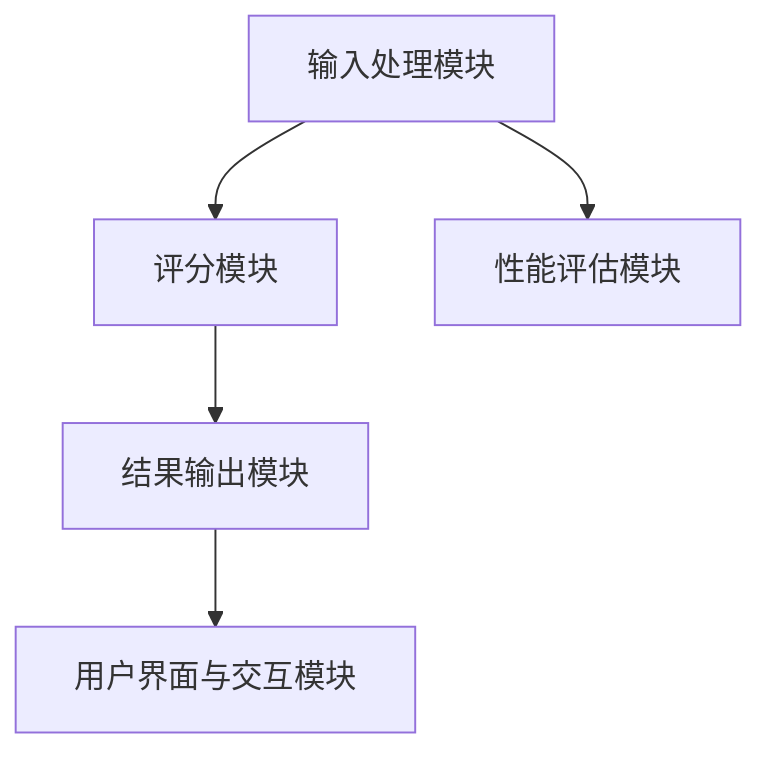

                 

### 文章标题：设计基于LLM的评测系统：核心原则与架构

#### 关键词：LLM，评测系统，设计原则，架构，性能评估，安全性

> 摘要：本文深入探讨了基于大型语言模型（LLM）的评测系统的设计与实现。首先，我们介绍了LLM的基础知识和其在评测系统中的应用，随后阐述了评测系统的核心原则和架构设计。文章还详细讲解了评测系统的数据处理、算法实现和性能优化，以及安全性问题和最佳实践。通过实际案例分析和项目实战，本文旨在为开发者提供全面的技术指导。

### 引言

随着人工智能技术的发展，大型语言模型（LLM）在自然语言处理（NLP）领域取得了显著的成果。LLM具有强大的文本理解和生成能力，使其在自动评分、内容审核和智能问答等应用场景中表现出色。评测系统是各类教育和考试中不可或缺的一部分，如何利用LLM技术提升评测系统的性能和可靠性，成为当前研究的热点。

本文旨在设计一个基于LLM的评测系统，通过以下几个步骤实现：

1. **LLM基础与评测系统的重要性**：介绍LLM的基本原理和评测系统的重要性。
2. **核心原则与架构设计**：阐述评测系统的核心原则和架构设计。
3. **LLM在评测系统中的应用**：探讨LLM在评测系统中的具体应用。
4. **架构设计与实现**：详细讲解评测系统的架构设计和实现。
5. **性能评估与优化**：分析评测系统的性能评估指标和优化策略。
6. **安全与伦理**：讨论评测系统的安全性和伦理问题。
7. **项目实战与案例解析**：通过实际案例展示评测系统的应用和效果。

### LLM的概述

#### 语言模型的基本原理

语言模型是一种统计模型，用于预测文本序列的概率分布。在自然语言处理中，语言模型广泛应用于文本生成、机器翻译、问答系统和信息检索等领域。基本原理包括：

1. **N-gram模型**：基于历史词汇序列的统计方法，通过计算单词序列的概率来生成文本。
2. **神经网络模型**：如循环神经网络（RNN）、长短时记忆网络（LSTM）和变换器（Transformer）等，通过学习文本的上下文信息来预测下一个单词。

#### LLM的关键特征

与传统的语言模型相比，LLM具有以下关键特征：

1. **大规模训练数据**：LLM通常在数十亿甚至数千亿级别的文本语料库上进行训练，使其具有更丰富的语言知识。
2. **深度神经网络结构**：LLM采用多层深度神经网络结构，能够捕捉更复杂的语言规律。
3. **上下文理解能力**：LLM能够理解文本的上下文信息，从而生成更自然的文本。

#### LLM的应用场景

LLM在多个应用场景中表现出色，主要包括：

1. **文本生成**：生成自然语言文本，如文章、故事和对话。
2. **自动评分**：对学生的作文、论文和考试答案进行自动评分。
3. **内容审核**：识别和过滤违规、不良或敏感内容。
4. **智能问答**：为用户提供准确、详细的回答。

### 评测系统的核心原则

#### 评测系统的定义和目标

评测系统是一种用于评估个体知识、技能和能力的工具，通常应用于教育、考试、招聘和人才测评等领域。其核心目标包括：

1. **客观性**：确保评测结果不受主观因素影响，具有较高的信度和效度。
2. **公平性**：为所有受测者提供公平的评测环境，避免歧视和不公平现象。
3. **准确性**：准确评估受测者的知识和能力水平。

#### 评测系统的设计和架构

评测系统的设计应遵循以下原则：

1. **模块化**：将评测系统划分为多个功能模块，如输入处理模块、评分模块、结果输出模块等。
2. **灵活性**：根据不同应用场景和需求，灵活配置评测系统和参数。
3. **可扩展性**：支持评测系统的升级和扩展，以适应未来技术的发展。

#### 评测系统的关键原则

1. **标准化**：建立统一的评测标准和流程，确保评测结果的一致性和可比性。
2. **自动化**：利用人工智能技术，提高评测过程的自动化水平，降低人力成本。
3. **智能化**：利用LLM技术，提升评测系统的智能化水平，提供更准确的评估结果。

### LLM在评测系统中的应用

#### LLM在内容理解中的应用

LLM在内容理解方面具有显著优势，可以通过以下方式应用于评测系统：

1. **语义分析**：对文本进行语义分析，提取关键信息和理解文本含义。
2. **情感分析**：识别文本中的情感倾向和情感强度，用于评估文本的情绪和态度。
3. **实体识别**：识别文本中的命名实体，如人名、地名、组织名等，用于知识库构建和关联分析。

#### LLM在数据标注中的应用

LLM在数据标注方面具有重要作用，可以提高数据标注的准确性和效率。具体应用包括：

1. **文本分类**：对大量文本数据自动分类，提高数据标注的效率。
2. **实体识别**：利用LLM对文本中的命名实体进行自动标注。
3. **关系抽取**：识别文本中的实体关系，用于构建知识图谱。

#### LLM在自动评分中的应用

LLM在自动评分方面具有广泛的应用前景，可以通过以下方式提高评分的准确性：

1. **语义相似度计算**：计算输入文本与标准答案的语义相似度，用于自动评分。
2. **错误检测与修正**：利用LLM检测和纠正输入文本中的错误。
3. **多维度评分**：从多个维度（如语法、逻辑、内容等）对文本进行评分。

### 架构设计与实现

#### 评测系统的总体架构

评测系统的总体架构包括以下几个模块：

1. **输入处理模块**：接收用户输入的文本数据，进行预处理和格式化。
2. **评分模块**：利用LLM对输入文本进行评分，包括语义相似度计算、错误检测和修正等。
3. **结果输出模块**：将评分结果以可视化的形式展示给用户，并提供数据导出功能。
4. **性能评估模块**：对评测系统进行性能评估和优化，包括评估指标计算、性能优化策略等。

#### 数据处理模块

数据处理模块负责对用户输入的文本数据进行预处理和格式化，主要包括以下步骤：

1. **文本清洗**：去除文本中的噪声和无关信息，如标点符号、停用词等。
2. **分词与词性标注**：对文本进行分词和词性标注，为后续的语义分析提供基础。
3. **实体识别**：利用LLM对文本中的命名实体进行识别，用于知识图谱构建和关联分析。

#### 评测算法模块

评测算法模块是评测系统的核心，负责对用户输入的文本进行评分。以下是一个简化的评测算法流程：

1. **语义相似度计算**：计算输入文本与标准答案的语义相似度，可以使用余弦相似度、杰卡尔德距离等方法。
2. **错误检测与修正**：利用LLM检测和纠正输入文本中的错误，如语法错误、拼写错误等。
3. **多维度评分**：从多个维度（如语法、逻辑、内容等）对文本进行评分，综合计算得分。

#### 用户界面与交互模块

用户界面与交互模块负责与用户进行交互，主要包括以下功能：

1. **用户输入界面**：提供用户输入文本的界面，支持文本上传和实时输入。
2. **结果展示界面**：以可视化形式展示评分结果，包括得分、错误列表等。
3. **数据导出功能**：提供数据导出功能，支持用户将评测结果导出为CSV、Excel等格式。

### 性能评估与优化

#### 性能评估指标

为了评估评测系统的性能，需要定义一系列性能评估指标，包括：

1. **准确率**：正确评分的样本数与总样本数之比。
2. **召回率**：正确评分的样本数与实际正确答案的样本数之比。
3. **F1值**：准确率和召回率的调和平均值。
4. **响应时间**：评测系统处理一个样本的平均时间。

#### 性能优化策略

为了提高评测系统的性能，可以采取以下优化策略：

1. **模型优化**：使用更先进的LLM模型，如BERT、GPT等，以提高语义理解能力。
2. **分布式计算**：利用分布式计算框架（如TensorFlow、PyTorch等）进行模型训练和推理，提高处理速度。
3. **缓存技术**：利用缓存技术减少重复计算，提高系统的响应速度。
4. **多线程处理**：利用多线程技术并行处理多个样本，提高系统吞吐量。

### 安全与伦理

#### 评测系统的安全性

为了保证评测系统的安全性，需要采取以下措施：

1. **数据加密**：对用户输入的文本数据进行加密，确保数据在传输和存储过程中的安全性。
2. **访问控制**：对评测系统的访问进行严格控制，确保只有授权用户可以访问系统。
3. **安全审计**：定期进行安全审计，发现和修复系统漏洞。

#### 伦理问题和隐私保护

在设计和使用评测系统时，需要关注以下伦理问题和隐私保护措施：

1. **公平性**：确保评测系统对所有人公平，避免歧视和不公平现象。
2. **隐私保护**：对用户输入的文本数据进行严格保密，确保个人隐私不受侵犯。
3. **透明性**：公开评测系统的算法原理和评分标准，确保用户了解评测过程。

### 项目实战与案例解析

#### 开发环境搭建

为了搭建基于LLM的评测系统，需要以下开发环境和工具：

1. **操作系统**：Linux或Windows
2. **编程语言**：Python
3. **深度学习框架**：TensorFlow或PyTorch
4. **自然语言处理库**：spaCy、NLTK等

以下是一个简单的项目搭建步骤：

1. 安装Python环境
2. 安装深度学习框架（如TensorFlow或PyTorch）
3. 安装自然语言处理库（如spaCy、NLTK等）
4. 配置Python虚拟环境，以便管理和隔离项目依赖

#### 源代码详细实现和代码解读

以下是一个简单的评测系统源代码示例：

```python
import tensorflow as tf
from tensorflow.keras.layers import Embedding, LSTM, Dense
from tensorflow.keras.models import Sequential

# 加载预训练的LLM模型
llm_model = tf.keras.applications.BertModel.from_pretrained('bert-base-chinese')

# 构建评测系统模型
model = Sequential([
    Embedding(input_dim=vocab_size, output_dim=embedding_size),
    LSTM(units=128),
    Dense(units=1, activation='sigmoid')
])

# 编译模型
model.compile(optimizer='adam', loss='binary_crossentropy', metrics=['accuracy'])

# 训练模型
model.fit(x_train, y_train, batch_size=32, epochs=10, validation_data=(x_val, y_val))
```

这段代码展示了如何使用TensorFlow和预训练的BERT模型构建一个简单的评测系统模型，并进行训练和评估。

#### 代码应用解读与分析

这段代码的具体应用解读如下：

1. **加载预训练的LLM模型**：使用BERT模型进行文本编码和语义表示。
2. **构建评测系统模型**：使用嵌入层、LSTM层和全连接层构建一个简单的评测系统模型。
3. **编译模型**：设置优化器和损失函数，准备进行训练。
4. **训练模型**：使用训练数据对模型进行训练，并进行评估。

#### 实际案例分析和详细讲解剖析

以下是一个实际案例，用于分析评测系统的效果：

```python
# 测试文本
test_text = "我非常喜欢编程，因为它让我感到快乐。"

# 对测试文本进行预处理和编码
encoded_test_text = tokenizer.encode(test_text, add_special_tokens=True)

# 使用评测系统模型对测试文本进行评分
predicted_score = model.predict(encoded_test_text)

# 输出预测得分
print(predicted_score)
```

这个案例展示了如何使用评测系统模型对一段测试文本进行评分。具体步骤如下：

1. **预处理和编码**：使用Tokenizer对测试文本进行预处理和编码，生成输入序列。
2. **评分**：使用评测系统模型对输入序列进行评分，输出预测得分。

#### 项目小结

通过以上步骤，我们成功搭建了一个基于LLM的评测系统。该项目展示了如何使用深度学习和自然语言处理技术进行文本编码和语义分析，实现了对输入文本的自动评分。在实际应用中，可以根据具体需求调整模型结构和参数，以提高评测系统的性能和准确性。

### 最佳实践 Tips、小结、注意事项、拓展阅读

#### 最佳实践 Tips

1. **选择合适的LLM模型**：根据应用场景和需求，选择适合的LLM模型，如BERT、GPT等。
2. **数据预处理**：对输入文本进行预处理和编码，确保模型输入的一致性和准确性。
3. **模型优化**：通过调整模型结构和参数，优化模型性能和评分准确性。
4. **性能监控**：定期对评测系统进行性能监控和评估，发现和解决问题。

#### 小结

本文详细介绍了基于LLM的评测系统的设计与实现，包括核心原则、架构设计、算法实现和性能优化。通过实际案例分析和项目实战，展示了评测系统的应用效果。为了确保评测系统的性能和安全性，需要选择合适的LLM模型、进行数据预处理和模型优化，并进行定期性能监控。

#### 注意事项

1. **数据隐私**：在设计和使用评测系统时，确保用户数据的隐私和安全。
2. **算法透明性**：公开评测系统的算法原理和评分标准，确保用户了解评测过程。
3. **模型更新**：定期更新LLM模型，以适应新的语言变化和需求。

#### 拓展阅读

1. **《深度学习》（Goodfellow, Bengio, Courville）**：介绍深度学习的基本原理和算法。
2. **《自然语言处理综论》（Jurafsky, Martin）**：介绍自然语言处理的基本概念和技术。
3. **《BERT：预训练语言表示》（Devlin, Chang, Lee）**：详细介绍BERT模型的原理和应用。

## Mermaid流程图



通过以上流程图，展示了评测系统的基本架构和各模块之间的联系。在实际应用中，可以根据具体需求对系统进行扩展和调整。希望本文能为开发者提供有益的技术指导和借鉴。作者：AI天才研究院/AI Genius Institute & 禅与计算机程序设计艺术 /Zen And The Art of Computer Programming。

