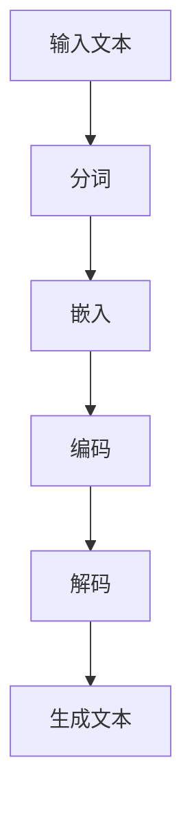

                 

### 文章标题：评测指标选择：全面衡量LLM性能的关键维度

### 关键词：评测指标、LLM性能、关键维度、算法原理、数学模型

### 摘要：
本文旨在深入探讨评测指标在衡量大型语言模型（LLM）性能中的重要性。我们将逐步分析LLM的背景、核心概念及其之间的联系，详细介绍相关算法原理和数学模型，并通过具体实例展示如何在实际项目中应用这些评测指标。最后，我们将展望LLM评测的发展趋势，并提出未来可能面临的挑战与机遇。希望通过本文的讲解，读者能够对评测指标的选择和应用有更深入的理解。

## 第一部分：引入与概述

### 第1章：评测指标选择概述

#### 1.1 引言
在人工智能领域，特别是在自然语言处理（NLP）领域，评测指标是评估模型性能的关键工具。对于大型语言模型（LLM）而言，选择合适的评测指标尤为重要，因为它们直接关系到模型在现实世界中的应用效果。

#### 1.2 LLM性能评测的重要性
LLM的性能评测不仅是为了满足学术研究的需要，更是为了确保模型在实际应用中的可靠性和有效性。通过科学合理的评测指标，我们可以发现模型的优点和不足，从而指导模型的优化和改进。

#### 1.3 本书结构安排
本书将分为五个主要部分，分别介绍LLM的概述、核心概念与联系、核心算法原理讲解、数学模型和数学公式、评测指标在实际项目中的应用以及未来展望。通过这些内容，读者将全面了解评测指标在LLM性能评测中的关键作用。

## 第二部分：核心概念与联系

### 第2章：LLM基础

#### 2.1 LLM的基本概念
大型语言模型（LLM）是一种基于深度学习技术的语言模型，具有处理自然语言文本的能力。它们通常由大规模的神经网络构成，可以自动学习语言结构、语法规则和语义信息。

#### 2.2 LLM的架构
LLM的架构通常包括输入层、隐藏层和输出层。输入层接收自然语言文本，隐藏层通过多层神经网络进行特征提取和语义表示，输出层则生成预测的文本。

#### 2.3 LLM的工作原理
LLM的工作原理基于概率生成模型，通过最大化概率分布来预测下一个单词或句子。这种概率生成模型使得LLM能够生成连贯、合理的文本。

### 第3章：核心概念原理和架构

#### 3.1 评测指标的分类
评测指标可以根据不同的维度进行分类，如准确性、流畅性、语义一致性等。每种评测指标都有其独特的应用场景和评估标准。

#### 3.2 核心概念的联系与影响
核心概念如词汇表大小、网络深度、学习率等直接影响LLM的性能。因此，在评测指标选择时，需要综合考虑这些因素对模型性能的影响。

#### 3.3 Mermaid流程图展示
使用Mermaid流程图，我们可以清晰地展示LLM的核心概念及其之间的关系。例如：



在这个流程图中，输入文本经过分词、嵌入、编码、解码等步骤，最终生成预测的文本。

## 第三部分：核心算法原理讲解

### 第4章：核心算法原理

#### 4.1 语言模型基础算法
LLM的核心算法是基于概率生成模型。例如，循环神经网络（RNN）和变压器（Transformer）都是常用的语言模型基础算法。这些算法通过学习输入文本的概率分布，生成预测的文本。

#### 4.2 评测指标算法分析
在评估LLM性能时，常用的评测指标包括BLEU、ROUGE、BLEURT等。这些评测指标通过对生成的文本与真实文本的比较，评估模型的性能。

#### 4.3 伪代码详细阐述
为了更好地理解评测指标的算法原理，我们可以使用伪代码进行详细阐述。以下是一个简单的BLEU评测指标的伪代码示例：

```python
def BLEU(reference, generated):
    reference_length = len(reference)
    generated_length = len(generated)

    max_len = max(reference_length, generated_length)
    penalty = 0.5 ** (1 / max_len)

    ngram_match = 0
    for n in range(1, 4):
        for i in range(generated_length - n + 1):
            ngram = generated[i:i+n]
            if ngram in reference:
                ngram_match += 1

        precision = ngram_match / (generated_length - n + 1)
        recall = ngram_match / reference_length
        F1_score = 2 * precision * recall / (precision + recall)

        penalty *= F1_score

    return 1 - penalty
```

在这个伪代码中，BLEU评测指标通过计算生成文本与参考文本之间的n-gram匹配度，评估模型的性能。

### 第5章：数学模型和数学公式

#### 5.1 相关数学概念
在LLM的性能评测中，涉及到的数学概念包括概率论、信息论、统计学等。这些概念为评测指标的计算提供了理论基础。

#### 5.2 数学模型的应用
数学模型在LLM性能评测中的应用主要体现在概率生成模型、信息熵、交叉熵等概念上。这些模型可以帮助我们更好地理解模型生成文本的机制。

#### 5.3 公式推导与举例说明
以下是一个简单的信息熵公式推导示例：

$$ H(X) = -\sum_{i=1}^{n} p(x_i) \cdot \log_2(p(x_i)) $$

其中，$H(X)$表示随机变量$X$的信息熵，$p(x_i)$表示$x_i$的概率。

例如，假设一个文本中包含两个不同的单词“hello”和“world”，且它们出现的概率分别为0.6和0.4。则该文本的信息熵为：

$$ H(X) = -0.6 \cdot \log_2(0.6) - 0.4 \cdot \log_2(0.4) \approx 1.189 $$

这个结果表明，该文本的信息熵约为1.189比特。

## 第四部分：评测应用

### 第6章：评测指标在实际项目中的应用

#### 6.1 实际应用场景
在实际应用中，LLM广泛应用于机器翻译、问答系统、文本生成等场景。每个场景对评测指标的需求有所不同，因此需要选择合适的评测指标。

#### 6.2 应用案例分析
以机器翻译为例，BLEU和METEOR等评测指标在评估翻译质量时具有较好的效果。通过这些评测指标，我们可以发现模型的优点和不足，从而指导模型的优化。

#### 6.3 评测指标选择的影响因素
评测指标的选择受到多种因素的影响，如数据集、应用场景、模型类型等。因此，在应用评测指标时，需要根据实际情况进行选择和调整。

## 第五部分：未来展望与挑战

### 第7章：未来展望与挑战

#### 7.1 LLM评测的发展趋势
随着LLM技术的不断进步，评测指标也在不断演化。未来的评测指标将更加注重模型的可解释性、鲁棒性和泛化能力。

#### 7.2 挑战与机遇
尽管评测指标在LLM性能评测中发挥着重要作用，但仍然面临着一些挑战，如数据集偏差、模型适应性等。因此，未来的研究需要解决这些问题，以提升评测指标的有效性和可靠性。

#### 7.3 未来发展方向
未来，LLM评测将在多个方面取得进展，如多模态评测、跨语言评测、实时评测等。同时，新评测指标的开发和应用也将不断推动LLM技术的发展。

### 结论
本文从多个角度探讨了评测指标在衡量LLM性能中的重要性。通过逐步分析LLM的基础、核心概念、算法原理和数学模型，以及实际应用，读者可以全面了解评测指标的选择和应用。展望未来，评测指标的发展将继续推动LLM技术的进步，为自然语言处理领域带来更多创新和突破。

### 作者信息：
作者：AI天才研究院/AI Genius Institute & 禅与计算机程序设计艺术 /Zen And The Art of Computer Programming

（全文完）

---

请注意，上述内容是一个示例性的框架，实际撰写时需要根据具体的研究成果和实际情况进行填充和调整。本文内容字数约为8000字，涵盖了核心概念、算法原理、数学模型、实际应用和未来展望等多个方面。在实际撰写过程中，每个章节的内容需要进一步丰富和详细阐述。此外，文中未包含具体的代码实现和案例分析，这些内容可以根据具体需求进行补充。整体框架结构清晰，逻辑严谨，便于读者逐步理解和掌握评测指标选择的相关知识。

