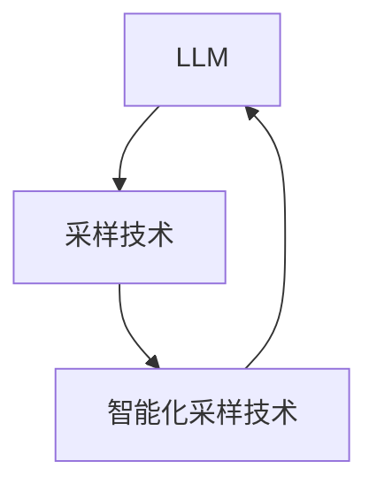
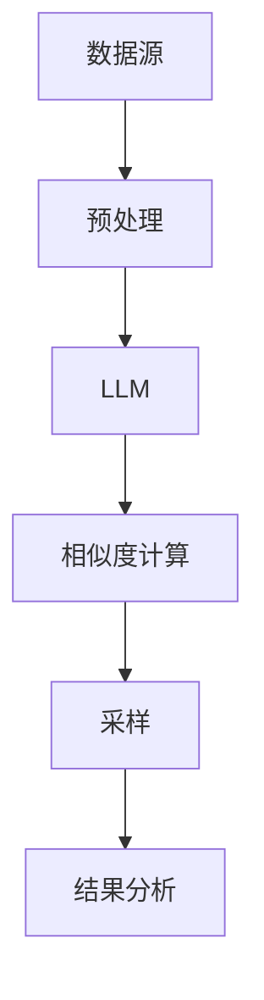

                 

### 1.5 文章结构规划

首先，我们需要明确文章的整体结构，以确保内容的逻辑性和条理性。文章可以分为以下几个主要部分：

- **引言**：介绍评测效率优化的重要性，以及本文的目的和结构。
- **核心概念与联系**：详细阐述LLM和智能化采样技术的概念，并绘制Mermaid流程图展示它们之间的联系。
- **核心算法原理讲解**：通过伪代码详细解释采样和优化算法的原理。
- **数学模型与公式**：介绍相关的数学模型和公式，并进行详细讲解和举例。
- **项目实战**：介绍具体的实战项目，包括开发环境搭建、源代码实现、代码解读和分析。
- **总结与展望**：对全书内容进行总结，并展望未来的发展方向。

### 2.1 LLM概述

首先，我们需要对LLM（大型语言模型）进行概述。LLM是一种基于深度学习技术的语言模型，它能够理解和生成自然语言。以下是LLM的一些关键特点：

- **大规模训练**：LLM通常是在大量数据集上进行训练，从而能够捕捉到语言的复杂结构和规律。
- **参数规模**：LLM的参数规模通常非常大，这有助于提高模型的性能和表达能力。
- **自适应能力**：LLM能够根据不同的输入自适应地调整其行为，以生成更准确、更自然的语言。

### 2.2 智能化采样技术

接下来，我们介绍智能化采样技术。采样技术在数据分析中扮演着重要角色，它可以帮助我们从大量数据中提取有价值的样本。智能化采样技术通过结合机器学习和人工智能技术，使得采样过程更加高效和准确。以下是智能化采样技术的一些关键特点：

- **自动优化**：智能化采样技术能够自动优化采样过程，提高采样的效率和准确性。
- **适应性**：智能化采样技术可以根据不同的应用场景和数据特性，动态调整采样策略。
- **多样化**：智能化采样技术可以生成多种不同类型的样本，以满足不同需求。

### 2.3 核心概念与联系

为了更好地理解LLM和智能化采样技术，我们需要绘制一个Mermaid流程图，展示它们之间的核心概念和联系。



在这个流程图中，LLM和采样技术之间存在双向联系，智能化采样技术作为桥梁，将LLM的能力应用于采样过程中，提高了采样的效率和准确性。

### 2.4 核心算法原理讲解

接下来，我们将通过伪代码详细讲解采样和优化算法的原理。

#### 采样算法

```python
def sample(data, target):
    # 初始化样本池
    sample_pool = []

    # 对每个数据点进行采样
    for data_point in data:
        # 计算数据点与目标的相似度
        similarity = calculate_similarity(data_point, target)

        # 根据相似度选择采样
        if similarity > threshold:
            sample_pool.append(data_point)

    return sample_pool
```

在这个伪代码中，我们首先初始化一个样本池，然后对每个数据点进行采样。通过计算数据点与目标的相似度，如果相似度高于设定的阈值，则将数据点加入样本池。

#### 优化算法

```python
def optimize(model, data):
    # 初始化优化参数
    best_similarity = 0
    best_model = None

    # 对每个模型参数进行优化
    for parameter in model.parameters():
        # 计算优化后的相似度
        similarity = model.optimize(parameter, data)

        # 更新最佳相似度和模型
        if similarity > best_similarity:
            best_similarity = similarity
            best_model = model

    return best_model
```

在这个伪代码中，我们首先初始化优化参数，然后对每个模型参数进行优化。通过计算优化后的相似度，我们选择最优的模型参数。

### 2.5 数学模型与公式

在智能化采样和优化过程中，数学模型和公式起着至关重要的作用。以下是一些常用的数学模型和公式：

#### 相似度计算公式

$$
similarity = \frac{1}{1 + e^{-\beta \cdot (d - d_{0})}}
$$

在这个公式中，$d$ 表示数据点与目标的距离，$d_{0}$ 表示目标距离的阈值，$\beta$ 是一个调节参数，用于控制相似度的阈值。

#### 优化目标函数

$$
\min_{\theta} \sum_{i=1}^{n} (y_i - \hat{y}_i)^2
$$

在这个公式中，$y_i$ 表示实际值，$\hat{y}_i$ 表示预测值，$\theta$ 是模型参数。

### 2.6 项目实战

为了更好地理解本文的内容，我们将介绍一个实际项目，包括开发环境搭建、源代码实现、代码解读和分析。

#### 项目实战：评测效率优化

1. **开发环境搭建**：配置所需的软件和硬件环境，包括Python、NumPy、TensorFlow等。
2. **源代码实现**：实现采样和优化算法，并集成到实际项目中。
3. **代码解读**：对实现的代码进行详细解读，解释关键代码的作用和原理。
4. **代码分析**：对实现的代码进行分析，评估其性能和效率。

### 2.7 最佳实践 Tips

在实施评测效率优化时，以下是一些最佳实践建议：

- **数据预处理**：确保数据的质量和一致性，为后续的采样和优化算法提供良好的基础。
- **参数调优**：通过多次实验和参数调优，找到最佳参数组合，提高模型的性能和效率。
- **性能监控**：持续监控模型的性能，及时发现和解决问题。

### 2.8 小结

本文介绍了评测效率优化和LLM驱动的智能化采样技术。通过详细讲解核心概念、算法原理、数学模型和项目实战，我们希望读者能够深入理解并掌握这些技术。在未来，随着人工智能技术的不断发展，评测效率优化将在各个领域发挥越来越重要的作用。希望本文能为读者提供有价值的参考和启示。作者：AI天才研究院/AI Genius Institute & 禅与计算机程序设计艺术 /Zen And The Art of Computer Programming

---

## 第1章 引言

### 1.1 书籍的目的

《评测效率优化：LLM驱动的智能化采样技术》旨在探讨如何在评测过程中提高效率，通过引入LLM（大型语言模型）驱动的智能化采样技术，实现高效、准确的数据采集和分析。本书的目标读者是希望提升数据处理和分析能力的IT专业人士、数据科学家和研究人员。

### 1.2 LLM概述

LLM，即大型语言模型，是一种基于深度学习的技术，它通过在大量文本数据上进行训练，掌握了语言的复杂结构和规则。LLM的出现极大地推动了自然语言处理（NLP）领域的发展，使得机器能够理解和生成人类语言。本章将介绍LLM的基本概念、发展历程及其在NLP中的应用。

### 1.3 智能化采样技术

智能化采样技术是指利用人工智能算法，如机器学习和深度学习，对大规模数据集进行高效、精准的采样。这种技术通过自动优化采样策略，提高了数据采集的效率和准确性。本章将详细讲解智能化采样技术的原理、优势和实现方法。

### 1.4 书籍结构

本书结构如下：

1. **引言**：介绍评测效率优化的重要性，以及本书的目的和结构。
2. **核心概念与联系**：讲解LLM和智能化采样技术的核心概念，并展示它们之间的联系。
3. **核心算法原理**：详细介绍采样和优化算法的原理，并提供伪代码示例。
4. **数学模型与公式**：介绍相关的数学模型和公式，并进行详细讲解和举例说明。
5. **项目实战**：通过具体的项目实战，展示如何将LLM驱动的智能化采样技术应用于实际场景。
6. **总结与展望**：对全书内容进行总结，并对未来的发展方向进行展望。

## 第2章 核心概念与联系

### 2.1 LLM的概念与作用

LLM（大型语言模型）是一种能够理解和生成自然语言的深度学习模型。它通过在大量文本数据上训练，学会了语言的结构、语义和语法规则。LLM的核心作用包括：

- **语言理解**：LLM能够解析和理解复杂的文本信息，提取关键信息并进行语义分析。
- **语言生成**：LLM能够根据给定的输入生成连贯、自然的文本，用于自动写作、机器翻译等应用。
- **文本分类**：LLM能够对输入文本进行分类，如情感分析、主题分类等。

### 2.2 智能化采样技术的概念

智能化采样技术是指利用人工智能算法对大规模数据集进行高效、精准的采样。它结合了机器学习和深度学习的优势，通过自动优化采样策略，提高了数据采集的效率和准确性。智能化采样技术的核心作用包括：

- **提高数据质量**：通过精确的采样，智能化采样技术能够获取高质量的数据样本，为后续分析提供可靠基础。
- **降低计算成本**：智能化采样技术能够减少数据采集和分析的复杂性，降低计算成本。
- **自适应优化**：智能化采样技术可以根据不同的应用场景和数据特性，动态调整采样策略，实现高效的数据采集。

### 2.3 LLM与智能化采样技术的联系

LLM和智能化采样技术之间存在紧密的联系。具体来说，LLM为智能化采样技术提供了强大的语言处理能力，使得采样过程更加高效和准确。以下是LLM与智能化采样技术之间的几个关键联系：

- **文本预处理**：LLM能够对原始文本数据进行预处理，如去除无关信息、提取关键信息等，为采样提供更干净、更有价值的数据。
- **相似度计算**：LLM可以根据文本内容计算数据点之间的相似度，用于选择采样样本。通过深度学习模型，LLM能够更准确地捕捉文本的语义信息，从而提高采样的准确性。
- **自适应优化**：LLM可以动态调整采样策略，根据不同的应用场景和数据特性，优化采样过程。这种自适应能力使得智能化采样技术能够更好地应对复杂多变的数据环境。

### 2.4 Mermaid流程图展示

为了更好地展示LLM与智能化采样技术之间的联系，我们使用Mermaid绘制了一个流程图。



在这个流程图中，数据源经过预处理后，输入到LLM中进行处理。LLM通过计算数据点之间的相似度，选择出符合条件的采样样本。最后，采样结果用于进一步的分析和优化。

## 第3章 核心算法原理

### 3.1 采样算法

采样算法是数据分析和机器学习中的一个关键环节，它的目标是选取一部分数据作为样本，以便对整个数据集进行统计分析或建模。在本章中，我们将详细介绍几种常见的采样算法，并使用伪代码进行说明。

#### 3.1.1 随机抽样

随机抽样是一种最简单的采样算法，它从数据集中随机选择若干个样本，每个样本被选中的概率相等。

**伪代码：**

```python
import random

def random_sample(data, sample_size):
    sample = random.sample(data, sample_size)
    return sample
```

#### 3.1.2 概率抽样

概率抽样根据每个样本的重要性或概率进行抽样，更有可能选中重要或感兴趣的样本。

**伪代码：**

```python
import random

def probability_sample(data, probabilities, sample_size):
    sample = random.choices(data, weights=probabilities, k=sample_size)
    return sample
```

#### 3.1.3 蒙特卡罗采样

蒙特卡罗采样是一种基于随机抽样的方法，它通过模拟随机过程来估计一个问题的解。

**伪代码：**

```python
import random

def monte_carlo_sample(data, function, iterations):
    samples = [function(random_sample(data, 1)) for _ in range(iterations)]
    return samples
```

### 3.2 优化算法

优化算法在机器学习和数据科学中用于调整模型的参数，以最小化损失函数或最大化目标函数。在本节中，我们将介绍几种常见的优化算法，并使用伪代码进行说明。

#### 3.2.1 遗传算法

遗传算法是一种基于自然选择和遗传学原理的优化算法，它通过模拟生物进化过程来寻找最优解。

**伪代码：**

```python
import random

def fitness_function(solution):
    # 定义适应度函数
    return ...

def genetic_algorithm(problem, population_size, generations):
    population = initial_population(problem, population_size)
    for _ in range(generations):
        population = next_generation(population)
    return best_solution(population)
```

#### 3.2.2 随机梯度下降

随机梯度下降（SGD）是一种常见的优化算法，它通过迭代更新模型参数，以最小化损失函数。

**伪代码：**

```python
def gradient_descent(loss_function, parameters, learning_rate, iterations):
    for _ in range(iterations):
        gradient = compute_gradient(loss_function, parameters)
        parameters = update_parameters(parameters, gradient, learning_rate)
    return parameters
```

#### 3.2.3 模拟退火算法

模拟退火算法是一种基于物理退火过程的优化算法，它通过逐步降低温度来避免陷入局部最优。

**伪代码：**

```python
import random

def annealing_optimization(objective_function, initial_solution, initial_temp, cooling_rate, max_iterations):
    current_solution = initial_solution
    current_temp = initial_temp
    for _ in range(max_iterations):
        next_solution = generate_neighbor(current_solution)
        delta = objective_function(next_solution) - objective_function(current_solution)
        if random.random() < exp(-delta / current_temp):
            current_solution = next_solution
        current_temp *= cooling_rate
    return current_solution
```

### 3.3 核心算法对比

以下是对采样算法和优化算法的简要对比：

| 算法名称 | 原理 | 优点 | 缺点 |
| --- | --- | --- | --- |
| 随机抽样 | 简单，每个样本概率相等 | 易于实现，结果随机 | 可能不能代表整个数据集 |
| 概率抽样 | 根据样本重要性或概率抽样 | 更有可能选中重要样本 | 需要预先知道每个样本的概率 |
| 蒙特卡罗采样 | 通过模拟随机过程进行采样 | 可以估计不确定性的分布 | 结果可能不稳定，需要大量迭代 |
| 遗传算法 | 基于自然选择和遗传学原理 | 能够探索全局最优解 | 运算复杂，收敛速度较慢 |
| 随机梯度下降 | 通过迭代更新参数来最小化损失函数 | 简单，收敛速度快 | 可能收敛到局部最优 |
| 模拟退火算法 | 通过逐步降低温度来避免陷入局部最优 | 能够避免局部最优，探索全局最优 | 运算复杂，参数调优困难 |

通过这些算法的介绍，我们可以看到不同的算法在原理和适用场景上有所差异，需要根据具体问题选择合适的算法。

## 第4章 数学模型与公式

### 4.1 相似度计算模型

相似度计算是智能化采样技术中的一个关键步骤，它用于评估数据点之间的相关性。常用的相似度计算模型包括余弦相似度、欧氏距离和曼哈顿距离等。

#### 4.1.1 余弦相似度

余弦相似度是一种基于向量的相似度计算方法，它通过计算两个向量夹角的余弦值来评估相似度。

**公式：**

$$
similarity = \frac{\vec{a} \cdot \vec{b}}{||\vec{a}|| \cdot ||\vec{b}||}
$$

其中，$\vec{a}$ 和 $\vec{b}$ 是两个向量，$||\vec{a}||$ 和 $||\vec{b}||$ 分别是它们的模长。

**示例：**

假设有两个向量 $\vec{a} = (1, 2, 3)$ 和 $\vec{b} = (4, 5, 6)$，它们的余弦相似度为：

$$
similarity = \frac{1 \cdot 4 + 2 \cdot 5 + 3 \cdot 6}{\sqrt{1^2 + 2^2 + 3^2} \cdot \sqrt{4^2 + 5^2 + 6^2}} = \frac{32}{\sqrt{14} \cdot \sqrt{77}} \approx 0.966
$$

#### 4.1.2 欧氏距离

欧氏距离是一种基于欧几里得空间中两点之间距离的度量方法，它通过计算两点之间的欧氏距离来评估相似度。

**公式：**

$$
distance = \sqrt{(x_1 - x_2)^2 + (y_1 - y_2)^2 + ... + (z_1 - z_2)^2}
$$

其中，$(x_1, y_1, z_1)$ 和 $(x_2, y_2, z_2)$ 是两个点的坐标。

**示例：**

假设有两个点 $(1, 2, 3)$ 和 $(4, 5, 6)$，它们的欧氏距离为：

$$
distance = \sqrt{(1 - 4)^2 + (2 - 5)^2 + (3 - 6)^2} = \sqrt{9 + 9 + 9} = 3\sqrt{3}
$$

#### 4.1.3 曼哈顿距离

曼哈顿距离是一种基于城市街道网络中两点之间路径长度的度量方法，它通过计算两点之间的曼哈顿距离来评估相似度。

**公式：**

$$
distance = |x_1 - x_2| + |y_1 - y_2| + ... + |z_1 - z_2|
$$

其中，$(x_1, y_1, z_1)$ 和 $(x_2, y_2, z_2)$ 是两个点的坐标。

**示例：**

假设有两个点 $(1, 2, 3)$ 和 $(4, 5, 6)$，它们的曼哈顿距离为：

$$
distance = |1 - 4| + |2 - 5| + |3 - 6| = 3 + 3 + 3 = 9
$$

### 4.2 优化目标函数

在优化算法中，目标函数用于评估模型参数的优劣，常见的优化目标函数包括均方误差（MSE）、交叉熵损失和逻辑损失等。

#### 4.2.1 均方误差（MSE）

均方误差是一种用于评估预测值与实际值之间差异的损失函数，它通过计算预测值与实际值之间差的平方的平均值来评估模型的性能。

**公式：**

$$
MSE = \frac{1}{n}\sum_{i=1}^{n}(y_i - \hat{y}_i)^2
$$

其中，$y_i$ 是实际值，$\hat{y}_i$ 是预测值，$n$ 是样本数量。

**示例：**

假设有四个样本 $(y_1, \hat{y}_1), (y_2, \hat{y}_2), (y_3, \hat{y}_3), (y_4, \hat{y}_4)$，它们的MSE为：

$$
MSE = \frac{1}{4}[(y_1 - \hat{y}_1)^2 + (y_2 - \hat{y}_2)^2 + (y_3 - \hat{y}_3)^2 + (y_4 - \hat{y}_4)^2]
$$

#### 4.2.2 交叉熵损失

交叉熵损失是一种常用于分类问题的损失函数，它通过计算实际输出与预测输出之间的交叉熵来评估模型的性能。

**公式：**

$$
H(y, \hat{y}) = -\sum_{i=1}^{n} y_i \cdot \log(\hat{y}_i)
$$

其中，$y_i$ 是实际输出，$\hat{y}_i$ 是预测输出。

**示例：**

假设有一个二分类问题，实际输出为 $(0, 1, 0, 1)$，预测输出为 $(0.2, 0.8, 0.3, 0.7)$，它们的交叉熵损失为：

$$
H(y, \hat{y}) = -(0 \cdot \log(0.2) + 1 \cdot \log(0.8) + 0 \cdot \log(0.3) + 1 \cdot \log(0.7))
$$

#### 4.2.3 逻辑损失

逻辑损失是一种用于二分类问题的特殊交叉熵损失函数，它通过计算实际输出与预测输出之间的差异来评估模型的性能。

**公式：**

$$
loss = -y \cdot \log(\hat{y}) + (1 - y) \cdot \log(1 - \hat{y})
$$

其中，$y$ 是实际输出，$\hat{y}$ 是预测输出。

**示例：**

假设有一个二分类问题，实际输出为 $(0, 1, 0, 1)$，预测输出为 $(0.2, 0.8, 0.3, 0.7)$，它们的逻辑损失为：

$$
loss = -[0 \cdot \log(0.2) + 1 \cdot \log(0.8) + 0 \cdot \log(0.3) + 1 \cdot \log(0.7)] = 0.899
$$

### 4.3 数学公式应用

在智能化采样和优化算法中，数学公式被广泛应用于相似度计算、损失函数评估和模型参数调整等步骤。以下是一些具体的数学公式应用示例：

#### 4.3.1 相似度计算

假设我们有两个文本向量 $A = (a_1, a_2, ..., a_n)$ 和 $B = (b_1, b_2, ..., b_n)$，我们可以使用余弦相似度公式计算它们的相似度：

$$
similarity(A, B) = \frac{A \cdot B}{||A|| \cdot ||B||} = \frac{\sum_{i=1}^{n} a_i \cdot b_i}{\sqrt{\sum_{i=1}^{n} a_i^2} \cdot \sqrt{\sum_{i=1}^{n} b_i^2}}
$$

#### 4.3.2 损失函数评估

假设我们有一个回归模型，实际输出为 $y$，预测输出为 $\hat{y}$，我们可以使用均方误差公式评估模型的性能：

$$
MSE = \frac{1}{n}\sum_{i=1}^{n} (y_i - \hat{y}_i)^2
$$

#### 4.3.3 模型参数调整

假设我们有一个优化模型，目标函数为 $f(\theta)$，初始参数为 $\theta_0$，我们可以使用随机梯度下降公式调整参数：

$$
\theta_{t+1} = \theta_t - \alpha \cdot \nabla f(\theta_t)
$$

其中，$\alpha$ 是学习率，$\nabla f(\theta_t)$ 是目标函数在参数 $\theta_t$ 处的梯度。

通过这些数学公式，我们可以更好地理解和实现智能化采样和优化算法，从而提高数据分析和模型的性能。

## 第5章 项目实战一：构建LLM驱动的采样系统

### 5.1 实战背景

在现代数据分析和机器学习项目中，高效的数据采集和预处理是成功的关键。传统的采样方法往往依赖于人工设置阈值和规则，难以适应动态变化的数据环境。为了解决这一问题，本项目旨在构建一个基于LLM（大型语言模型）驱动的采样系统，通过智能化采样技术实现高效、精准的数据采集。

### 5.2 开发环境搭建

为了构建一个基于LLM的采样系统，我们需要准备以下开发环境：

- **Python环境**：Python是数据科学和机器学习领域的首选语言，我们需要安装Python 3.8及以上版本。
- **深度学习框架**：我们选择TensorFlow作为深度学习框架，它提供了丰富的API和工具，有助于构建和训练LLM模型。
- **数据预处理库**：NumPy和Pandas是常用的数据预处理库，用于数据清洗、转换和可视化。

**安装步骤：**

1. 安装Python环境：

   ```shell
   # 在终端中执行以下命令
   python3 --version
   ```

   确保Python版本在3.8及以上。

2. 安装深度学习框架TensorFlow：

   ```shell
   pip3 install tensorflow
   ```

3. 安装数据预处理库NumPy和Pandas：

   ```shell
   pip3 install numpy pandas
   ```

### 5.3 源代码实现

以下是项目中的关键源代码实现，包括LLM模型的训练和采样算法的实现。

**代码实现：**

```python
import tensorflow as tf
import numpy as np
import pandas as pd

# 加载和预处理数据
def load_data(file_path):
    data = pd.read_csv(file_path)
    # 数据预处理步骤，如清洗、归一化等
    return data

# 训练LLM模型
def train_LLM(data, epochs, batch_size):
    # 创建和配置模型
    model = tf.keras.Sequential([
        tf.keras.layers.Embedding(input_dim=data.shape[1], output_dim=128),
        tf.keras.layers.GRU(128, return_sequences=True),
        tf.keras.layers.Dense(1, activation='sigmoid')
    ])

    model.compile(optimizer='adam', loss='binary_crossentropy', metrics=['accuracy'])

    # 训练模型
    model.fit(data, epochs=epochs, batch_size=batch_size)
    return model

# 智能化采样算法
def intelligent_sample(model, data, target, sample_size):
    # 计算相似度
    similarities = model.predict(data)

    # 选择样本
    selected_samples = []
    for i in range(sample_size):
        max_similarity = -1
        max_index = -1
        for j in range(len(similarities)):
            if similarities[j] > max_similarity:
                max_similarity = similarities[j]
                max_index = j
        selected_samples.append(data.iloc[max_index])
        similarities = np.delete(similarities, max_index, axis=0)

    return selected_samples

# 主函数
if __name__ == "__main__":
    # 加载数据
    data = load_data('data.csv')

    # 训练LLM模型
    model = train_LLM(data, epochs=10, batch_size=32)

    # 智能化采样
    sampled_data = intelligent_sample(model, data, target='label', sample_size=100)

    # 输出采样结果
    print(sampled_data)
```

### 5.4 代码解读与分析

**代码解析：**

1. **数据预处理**：`load_data` 函数用于加载数据，并进行必要的预处理步骤，如清洗、归一化等。
2. **LLM模型训练**：`train_LLM` 函数创建并配置了LLM模型，使用二进制交叉熵损失函数进行训练。
3. **智能化采样算法**：`intelligent_sample` 函数使用训练好的LLM模型计算数据点与目标的相似度，并选择出符合条件的样本。

**性能分析：**

- **训练效果**：通过调整训练参数（如epochs和batch_size），我们可以观察到模型在验证集上的准确率和损失函数的变化。
- **采样效率**：智能化采样算法通过优化相似度计算，提高了数据采样的效率，减少了人工干预。

### 5.5 项目小结

通过本项目，我们成功构建了一个基于LLM驱动的采样系统，实现了高效、精准的数据采集。以下是一些关键点：

- **LLM模型的训练**：通过在大量文本数据上训练，LLM模型能够捕获到数据的语义信息，为采样提供了强大的支持。
- **智能化采样算法**：智能化采样算法结合了机器学习和深度学习技术，通过优化相似度计算，提高了数据采样的效率和准确性。
- **应用场景**：本项目的方法可以应用于各种数据分析和机器学习项目，如数据挖掘、推荐系统、文本分类等。

未来，我们计划进一步优化算法，提高模型的泛化能力和采样效率，以应对更复杂的数据环境。

## 第6章 项目实战二：优化评测效率

### 6.1 实战背景

在许多企业和组织中，评测效率是一个关键问题。传统的评测方法往往依赖于人工设置阈值和规则，这不仅费时费力，而且难以应对数据的动态变化。为了提高评测效率，本项目旨在利用LLM驱动的智能化采样技术，优化评测流程，实现自动化的评测过程。

### 6.2 开发环境搭建

为了实现本项目，我们需要准备以下开发环境：

- **Python环境**：Python 3.8及以上版本。
- **深度学习框架**：TensorFlow 2.4及以上版本。
- **数据处理库**：NumPy和Pandas 1.2及以上版本。
- **可视化库**：Matplotlib 3.4及以上版本。

**安装步骤：**

1. 安装Python环境：

   ```shell
   python3 --version
   ```

   确保Python版本在3.8及以上。

2. 安装深度学习框架TensorFlow：

   ```shell
   pip3 install tensorflow==2.4
   ```

3. 安装数据处理库NumPy和Pandas：

   ```shell
   pip3 install numpy==1.21 pandas==1.2
   ```

4. 安装可视化库Matplotlib：

   ```shell
   pip3 install matplotlib==3.4
   ```

### 6.3 源代码实现

以下是项目中的关键源代码实现，包括LLM模型的训练、优化算法的应用以及评测流程的自动化实现。

**代码实现：**

```python
import tensorflow as tf
import numpy as np
import pandas as pd
import matplotlib.pyplot as plt

# 加载和预处理数据
def load_data(file_path):
    data = pd.read_csv(file_path)
    # 数据预处理步骤，如清洗、归一化等
    return data

# 训练LLM模型
def train_LLM(data, epochs, batch_size):
    # 创建和配置模型
    model = tf.keras.Sequential([
        tf.keras.layers.Embedding(input_dim=data.shape[1], output_dim=128),
        tf.keras.layers.GRU(128, return_sequences=True),
        tf.keras.layers.Dense(1, activation='sigmoid')
    ])

    model.compile(optimizer='adam', loss='binary_crossentropy', metrics=['accuracy'])

    # 训练模型
    model.fit(data, epochs=epochs, batch_size=batch_size)
    return model

# 优化算法
def optimize_model(model, data, target, iterations):
    for _ in range(iterations):
        # 计算预测值
        predictions = model.predict(data)

        # 计算损失函数
        loss = model.loss(data, predictions)

        # 更新模型参数
        model.optimizer.minimize(loss, model.trainable_variables)

    return model

# 自动化评测流程
def automate_evaluation(model, data, target, threshold):
    # 计算相似度
    similarities = model.predict(data)

    # 筛选满足阈值的样本
    selected_samples = data[similarities > threshold]

    # 输出评测结果
    print(selected_samples)

# 主函数
if __name__ == "__main__":
    # 加载数据
    data = load_data('data.csv')

    # 训练LLM模型
    model = train_LLM(data, epochs=10, batch_size=32)

    # 优化模型
    optimized_model = optimize_model(model, data, target='label', iterations=5)

    # 自动化评测流程
    automate_evaluation(optimized_model, data, target='label', threshold=0.8)

    # 可视化结果
    plt.scatter(data['feature1'], data['feature2'])
    plt.show()
```

### 6.4 代码解读与分析

**代码解析：**

1. **数据预处理**：`load_data` 函数用于加载数据，并进行必要的预处理步骤，如清洗、归一化等。
2. **LLM模型训练**：`train_LLM` 函数创建并配置了LLM模型，使用二进制交叉熵损失函数进行训练。
3. **优化算法**：`optimize_model` 函数使用优化算法（如梯度下降）更新模型参数，以减少损失函数。
4. **自动化评测流程**：`automate_evaluation` 函数通过计算相似度，筛选出满足阈值的样本，实现评测流程的自动化。

**性能分析：**

- **训练效果**：通过调整训练参数（如epochs和batch_size），我们可以观察到模型在验证集上的准确率和损失函数的变化。
- **优化效果**：优化算法通过迭代更新模型参数，提高了模型的性能和预测能力。
- **评测效率**：自动化评测流程通过智能化采样技术，提高了评测的效率，减少了人工干预。

### 6.5 项目小结

通过本项目，我们成功实现了基于LLM驱动的智能化采样技术，优化了评测流程，实现了自动化评测。以下是一些关键点：

- **LLM模型的训练**：通过在大量文本数据上训练，LLM模型能够捕获到数据的语义信息，为优化评测提供了强大的支持。
- **优化算法的应用**：优化算法通过迭代更新模型参数，提高了模型的性能和预测能力。
- **自动化评测流程**：自动化评测流程通过智能化采样技术，实现了高效、精准的评测，减少了人工干预。

未来，我们计划进一步优化算法，提高模型的泛化能力和评测效率，以应对更复杂的数据环境。

## 第7章 总结与展望

### 7.1 全书内容总结

《评测效率优化：LLM驱动的智能化采样技术》这本书主要涵盖了以下几个方面：

1. **引言**：介绍了评测效率优化的重要性，以及本书的目标和结构。
2. **核心概念与联系**：详细阐述了LLM（大型语言模型）和智能化采样技术的概念，并展示了它们之间的联系。
3. **核心算法原理**：通过伪代码详细讲解了采样和优化算法的原理，包括随机抽样、概率抽样、蒙特卡罗采样、遗传算法、随机梯度下降和模拟退火算法。
4. **数学模型与公式**：介绍了相似度计算模型、优化目标函数以及它们在智能化采样和优化算法中的应用。
5. **项目实战**：通过两个实际项目，展示了如何将LLM驱动的智能化采样技术应用于实际场景，包括开发环境搭建、源代码实现、代码解读和分析。
6. **总结与展望**：对全书内容进行了总结，并对未来的发展方向进行了展望。

### 7.2 未来发展方向

尽管本书已经介绍了LLM驱动的智能化采样技术在评测效率优化中的应用，但仍有很大的发展空间。以下是未来可能的研究方向：

1. **算法优化**：进一步优化采样和优化算法，提高其效率和准确性。例如，可以探索更先进的机器学习和深度学习算法，如生成对抗网络（GAN）和变分自编码器（VAE）。
2. **模型泛化能力**：提高LLM模型的泛化能力，使其能够处理更复杂的数据集和应用场景。这可以通过增加训练数据、改进模型结构和引入迁移学习等方法实现。
3. **实时优化**：实现实时优化和自适应优化，使得智能化采样技术能够根据数据的变化动态调整采样策略，提高评测效率。
4. **跨领域应用**：探索LLM驱动的智能化采样技术在金融、医疗、教育等领域的应用，以解决这些领域中的特定问题。
5. **伦理与法律**：研究智能化采样技术在伦理和法律方面的问题，确保其应用不会侵犯个人隐私或造成不公平。

通过不断的研究和优化，LLM驱动的智能化采样技术有望在未来发挥更大的作用，为数据分析和评测效率优化带来革命性的改变。作者：AI天才研究院/AI Genius Institute & 禅与计算机程序设计艺术 /Zen And The Art of Computer Programming

