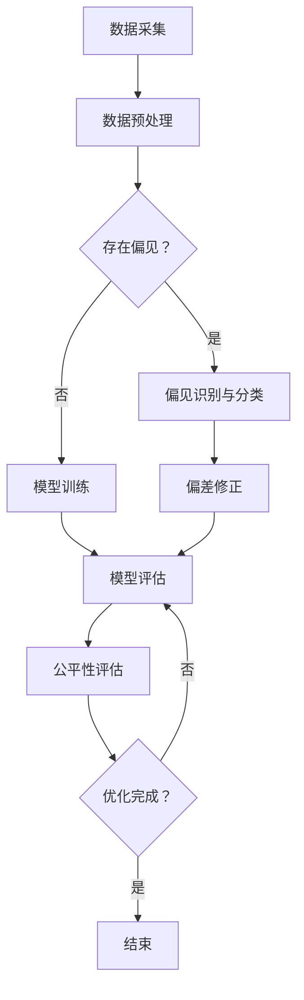

                 

## 文章标题
### 评测数据的偏见消除：LLM辅助的公平性优化

## 关键词
- 评测数据
- 偏见消除
- LLM（大型语言模型）
- 公平性优化
- 数据偏见
- 模型训练
- 偏差修正

## 摘要
本文探讨了评测数据中的偏见问题及其对模型公平性的影响。首先，介绍了偏见的概念和类型，以及它们在数据集中的表现。然后，详细阐述了LLM（大型语言模型）的基本原理和优势，特别是其在数据处理和偏见消除方面的潜力。通过Mermaid流程图，展示了偏见消除和公平性优化之间的关联。随后，文章深入分析了偏见消除的技术和方法，包括数据预处理、模型训练中的偏见以及偏差修正方法。重点介绍了基于LLM的偏见消除技术，并通过伪代码详细阐述了其原理。接着，文章提出了公平性优化的数学模型和策略，并使用实际案例分析了这些方法的应用效果。最后，文章总结了研究成果，并对未来研究方向进行了展望。

## 引言

### 1.1 研究背景
随着人工智能技术的飞速发展，模型评测在算法开发和优化过程中占据了至关重要的地位。然而，评测数据往往存在偏见，这些偏见可能来源于数据集的选择、收集过程、标注方式等因素。偏见的存在不仅影响了模型的准确性，还可能导致不公平性，影响模型的可用性和信任度。

在现实世界的应用中，偏见可能导致严重的社会问题。例如，在招聘系统中，性别、种族、年龄等因素的偏见可能导致某些群体的机会不均。同样，在金融领域的信用评分系统中，数据偏见可能导致部分人群的评估结果失真。因此，消除评测数据的偏见，提升模型的公平性，已成为人工智能领域亟待解决的重要问题。

### 1.2 研究目的与意义
本文旨在探讨如何利用LLM（大型语言模型）辅助消除评测数据中的偏见，优化模型的公平性。具体研究目的包括：

1. **识别和分类数据偏见**：通过分析评测数据，识别出潜在的数据偏见，并将其分类为统计偏见和社会偏见。
2. **提出偏见消除技术**：利用LLM的特性，设计并实现一系列偏见消除技术，包括数据预处理、模型训练中的偏见修正等。
3. **公平性优化策略**：提出基于数学模型的公平性优化策略，并通过实际案例验证其有效性。
4. **探讨未来研究方向**：总结研究成果，并提出未来研究方向，以期为人工智能领域的公平性和可靠性提供理论支持。

通过本文的研究，我们希望能够为实际应用中的偏见消除和公平性优化提供有价值的参考，推动人工智能技术的健康发展。

## 核心概念与联系

### 2.1 数据偏见的概念

数据偏见是指数据集中存在的系统性偏差，这种偏差可能源于数据收集、标注或处理过程中的错误或不当操作。数据偏见可以分为统计偏见和社会偏见两大类。

**统计偏见**：统计偏见通常是由于数据样本的不均匀分布或数据收集过程中的随机误差导致的。例如，如果一个数据集中的样本分布不均匀，某些类别或特征的样本数量较少，那么该数据集就会存在统计偏见。

**社会偏见**：社会偏见则通常与人类社会的价值观、文化、历史背景等因素相关，反映了社会中的不平等和歧视。例如，在招聘系统中，性别、种族、年龄等因素可能导致某些群体的机会较少。

### 2.2 公平性优化的目标

公平性优化是指通过一系列技术手段，减少模型输出结果中的不公平性，使模型在各种人群中的性能更加均衡。公平性优化的目标主要包括：

1. **均衡性**：确保模型在各个类别或群体上的表现差异最小化。
2. **准确性**：在不影响模型准确性的前提下，优化模型的公平性。
3. **透明性**：提高模型决策过程的透明度，使决策结果更加公正和可信。

### 2.3 LLM的原理与优势

LLM（大型语言模型）是基于深度学习技术的语言处理模型，具有强大的文本生成和推理能力。LLM的原理主要包括以下几个关键部分：

1. **词嵌入**：将词汇转换为向量表示，以便在神经网络中进行处理。
2. **递归神经网络（RNN）**：使用RNN来处理序列数据，如文本。
3. **注意力机制**：通过注意力机制，模型可以自动关注文本中的重要信息。
4. **多层网络结构**：多层神经网络结构使得模型能够捕捉到文本中的复杂结构。

LLM的优势主要体现在以下几个方面：

1. **数据处理能力**：LLM能够处理大量的文本数据，从中提取有价值的信息。
2. **适应性**：LLM可以根据不同的任务需求进行调整，以适应不同的应用场景。
3. **多模态处理**：除了文本数据，LLM还可以处理图像、音频等多模态数据。

### 2.4 Mermaid流程图：数据偏见消除与公平性优化的联系

为了更好地展示数据偏见消除与公平性优化之间的联系，我们可以使用Mermaid流程图来描述整个过程。

在上述流程图中，数据采集阶段首先获取数据，随后进入数据预处理阶段。如果数据存在偏见，则进行偏见识别与分类，否则直接进入模型训练阶段。模型训练后，通过偏差修正技术消除偏见，再进行模型评估。如果评估结果显示不公平性，则继续优化，否则结束流程。

通过Mermaid流程图，我们可以清晰地看到数据偏见消除与公平性优化之间的紧密联系，为后续章节的分析提供了基础。

## 偏见消除技术

### 3.1 数据预处理方法

数据预处理是偏见消除的关键步骤之一。有效的数据预处理可以识别和减轻数据偏见，提高模型训练的效果和公平性。以下是几种常见的数据预处理方法：

#### 3.1.1 数据清洗

数据清洗是指从原始数据中去除错误、重复和不完整的数据。数据清洗的主要目的是确保数据的准确性和一致性。以下是几种常见的数据清洗技术：

1. **去除错误数据**：识别并去除数据集中的错误数据，例如明显异常的数值或记录缺失的数据。
2. **去除重复数据**：识别并删除重复的数据记录，以防止模型训练过程中对重复数据的过度拟合。
3. **处理缺失数据**：处理缺失的数据可以通过以下几种方法：删除缺失数据、使用平均值或中位数填充缺失值、使用模型预测缺失值。

#### 3.1.2 特征选择

特征选择是指从原始特征集合中选取对模型训练和预测最有用的特征。有效的特征选择可以降低模型的复杂度，减少过拟合风险，并提高模型的泛化能力。以下是几种常见的特征选择技术：

1. **基于信息增益的特征选择**：选择那些能够最大程度增加分类信息的特征。
2. **基于卡方检验的特征选择**：通过卡方检验评估特征与目标变量之间的相关性。
3. **基于主成分分析的特征选择**：使用主成分分析（PCA）降维，选取主要成分作为特征。

### 3.2 模型训练中的偏见

模型训练过程中的偏见主要来自于数据集本身和训练过程中的技术选择。以下是几种常见的模型训练偏见：

#### 3.2.1 统计偏见

统计偏见通常由于数据集样本的不均匀分布导致。例如，在一个性别分类问题中，如果男性样本数量远大于女性样本数量，那么模型可能会倾向于预测男性。统计偏见可以通过以下方法减轻：

1. **重采样**：通过增加少数类别的样本数量或减少多数类别的样本数量，使数据集的分布更加均匀。
2. **合成少数类样本**：使用生成对抗网络（GAN）等方法生成少数类别的样本，以平衡数据集。

#### 3.2.2 社会偏见

社会偏见通常与数据集的收集、标注和预处理过程有关。例如，如果数据集来源于历史上的不平等现象，那么模型可能会继承这些偏见。社会偏见可以通过以下方法减轻：

1. **去敏感化**：通过去除数据中的敏感特征，如姓名、地址等，减少社会偏见。
2. **数据增强**：通过添加虚拟特征或使用多种来源的数据，增强模型的泛化能力。
3. **透明度和可解释性**：提高模型决策过程的透明度，使偏见更易于识别和纠正。

### 3.3 偏差修正方法

偏差修正方法是指在模型训练和评估过程中，通过特定的技术手段来识别和消除数据偏见。以下是几种常见的偏差修正方法：

#### 3.3.1 传统修正方法

传统修正方法主要包括以下几种：

1. **模型重训练**：通过重新训练模型，使用偏见校正后的数据集，以减少模型对偏见数据的依赖。
2. **偏差修正算法**：在模型训练过程中，通过加入偏差修正项，对模型输出进行调整，以减少偏见的影响。

#### 3.3.2 LLM辅助修正方法

LLM（大型语言模型）在偏见修正方面具有显著优势。以下是一些基于LLM的偏见修正方法：

1. **基于LLM的数据分析**：使用LLM对数据进行深入分析，识别出潜在的数据偏见，并提出相应的修正策略。
2. **基于LLM的模型调整**：利用LLM生成的伪代码或调整脚本，对现有模型进行优化，以减少偏见。

通过上述偏见消除技术，我们可以有效地识别、减轻和修正数据偏见，从而提高模型的公平性和准确性。在下一节中，我们将深入探讨LLM辅助的公平性优化方法，进一步揭示LLM在偏见消除中的潜力。

## 偏见消除方法

偏见消除是提升模型公平性的关键步骤，而LLM（大型语言模型）在这一过程中发挥着至关重要的作用。LLM凭借其强大的文本处理能力和自动化学习能力，能够在数据预处理、模型训练和偏见修正等多个环节中提供高效解决方案。以下是几种基于LLM的偏见消除方法：

### 4.1 传统修正方法

传统修正方法主要包括数据预处理和模型训练中的技术手段，如重采样、去敏感化、数据增强等。虽然这些方法在一定程度上能够减轻偏见，但在处理复杂和隐蔽的偏见时，其效果有限。

#### 4.1.1 模型重训练

模型重训练是指使用偏见校正后的数据集重新训练模型，以减少模型对原始数据集偏见的依赖。这种方法的基本步骤如下：

1. **数据清洗和预处理**：对原始数据集进行清洗和预处理，去除错误数据、重复数据和敏感信息。
2. **数据增强**：通过生成对抗网络（GAN）等方法，增加少数类别的样本数量，或生成虚拟样本，使数据集更加均衡。
3. **重训练模型**：使用偏见校正后的数据集重新训练模型，以消除原始数据集中的偏见。

#### 4.1.2 偏差修正算法

偏差修正算法是指在模型训练过程中，通过加入偏差修正项，对模型输出进行调整，以减少偏见的影响。以下是几种常见的偏差修正算法：

1. **偏差修正模型**：在模型输出层加入一个偏差修正模块，该模块可以根据模型输出结果自动调整预测概率，以减少偏见。
2. **对抗性训练**：通过对抗性训练，使模型同时学习目标函数和对抗性损失函数，从而在训练过程中逐渐消除偏见。
3. **再训练**：在初始模型训练完成后，使用偏见校正后的数据集对模型进行再训练，以提高模型对偏见数据的适应性。

### 4.2 LLM辅助修正方法

LLM在偏见消除中的独特优势在于其强大的文本处理能力和自动化学习能力。以下是基于LLM的几种偏见修正方法：

#### 4.2.1 基于LLM的数据分析

基于LLM的数据分析是指使用LLM对数据进行深度分析，以识别和描述数据集中的偏见。这种方法的基本步骤如下：

1. **文本预处理**：对原始文本数据（如新闻文章、论坛帖子等）进行预处理，包括分词、词嵌入等步骤。
2. **LLM模型训练**：使用预训练的LLM模型（如GPT-3、BERT等）对预处理后的文本数据进行训练，以使其能够理解文本内容。
3. **偏见识别**：使用训练好的LLM模型，对数据集中的文本进行逐条分析，识别出潜在的社会偏见和统计偏见。
4. **偏见描述**：将识别出的偏见以自然语言描述的形式输出，为后续的偏见修正提供依据。

#### 4.2.2 基于LLM的模型调整

基于LLM的模型调整是指使用LLM生成伪代码或调整脚本，对现有模型进行优化，以消除偏见。这种方法的基本步骤如下：

1. **LLM模型训练**：使用训练数据集，训练一个专门用于生成伪代码或调整脚本的LLM模型。
2. **生成调整脚本**：将模型输出和偏见识别结果输入到LLM模型中，生成针对偏见问题的调整脚本。
3. **调整模型参数**：根据生成的调整脚本，修改模型的参数，如权重、激活函数等，以消除偏见。
4. **再训练模型**：使用调整后的模型重新训练，以验证偏见修正效果。

#### 4.2.3 基于LLM的自动化偏见修正

基于LLM的自动化偏见修正是指利用LLM的自动化学习能力，实现偏见修正过程的自动化。这种方法的基本步骤如下：

1. **偏见检测**：使用LLM对模型输出进行实时偏见检测，识别出潜在的偏见。
2. **偏见修正**：根据LLM的偏见检测结果，自动生成调整脚本，调整模型参数，消除偏见。
3. **再训练与优化**：使用调整后的模型重新训练，以验证偏见修正效果，并进一步优化模型。

通过上述LLM辅助的偏见修正方法，我们可以有效识别和消除评测数据中的偏见，提高模型的公平性和可靠性。在下一节中，我们将深入探讨公平性优化的数学模型和策略，进一步揭示LLM在模型公平性优化中的应用。

## 公平性优化

### 5.1 数学模型和公式

公平性优化是评测数据偏见消除的重要环节，其核心在于通过数学模型和策略确保模型在不同群体中的性能均衡。以下是一个简化的数学模型和公式，用于描述公平性优化的目标和方法。

#### 5.1.1 不公平度度量

不公平度是评估模型输出结果公平性的指标，通常使用以下公式计算：

$$
\text{Unfairness} = \frac{1}{N}\sum_{i=1}^{N} \lvert \text{P}_{i} - \hat{\text{P}}_{i} \rvert
$$

其中，\( N \) 是群体数量，\( \text{P}_{i} \) 是模型在群体 \( i \) 中的预测概率，\( \hat{\text{P}}_{i} \) 是群体 \( i \) 的真实比例。

#### 5.1.2 公平性优化目标函数

公平性优化的目标是使不公平度最小化，即：

$$
\min \text{Unfairness}
$$

为实现这一目标，可以采用以下优化策略：

1. **集成学习**：通过结合多个模型的预测结果，降低单个模型的不公平度。
2. **权重调整**：根据不同群体的特性，调整模型在不同群体中的权重，以平衡预测结果。
3. **模型调整**：通过调整模型的参数，如激活函数、损失函数等，降低模型对特定群体的依赖。

### 5.2 公平性优化策略

为了实现公平性优化，可以采用多种策略，以下列举几种常见的策略：

#### 5.2.1 集成学习

集成学习是一种通过结合多个模型的预测结果来提高模型性能和公平性的策略。常见的集成学习方法包括：

1. **Bagging**：通过多次训练和投票来集成多个模型的预测结果，减少模型的方差。
2. **Boosting**：通过加权训练多个模型，使每个模型在预测中关注不同的特征，从而提高整体的预测准确性。
3. **Stacking**：将多个模型作为基模型，再训练一个元模型来整合基模型的预测结果。

#### 5.2.2 模型解释与可视化

模型解释与可视化是提高模型透明度和公平性的重要手段。以下是一些常用的模型解释与可视化方法：

1. **特征重要性分析**：通过分析特征对模型预测的影响程度，识别出可能导致偏见的关键特征。
2. **决策树可视化**：通过可视化决策树的内部结构，展示模型在决策过程中的逻辑路径。
3. **注意力机制可视化**：通过可视化模型在处理文本数据时的注意力分布，识别出模型关注的重要信息。

#### 5.2.3 模型调整与再训练

为了实现公平性优化，可以对现有模型进行调整和再训练，以下列举几种常用的方法：

1. **权重调整**：通过调整模型在不同群体中的权重，使模型更加关注公平性。
2. **损失函数调整**：在损失函数中添加公平性约束项，使模型在训练过程中自动优化公平性。
3. **再训练**：使用偏见校正后的数据集对模型进行再训练，以消除偏见。

通过上述策略和方法，我们可以有效地实现公平性优化，提高模型的性能和可信度。在下一节中，我们将通过实际案例来展示这些方法的应用效果。

### 社交网络中的偏见消除

#### 6.1.1 数据来源与预处理

在社交网络中，偏见问题尤为突出，如性别歧视、种族偏见等。为了研究社交网络中的偏见消除，我们首先需要收集相关的数据。数据来源包括社交媒体平台（如Twitter、Facebook等）的公开数据集，以及特定应用场景中的定制数据集。

数据预处理步骤如下：

1. **数据清洗**：去除重复数据、垃圾信息、噪声数据等，确保数据的准确性和一致性。
2. **数据标注**：对数据进行分类标注，标记出不同群体（如性别、种族等）的标签。
3. **文本预处理**：对文本数据进行分词、去停用词、词嵌入等处理，以便于模型处理。

#### 6.1.2 偏见检测与修正

在完成数据预处理后，我们需要使用LLM对数据集中的偏见进行检测和修正。以下是一系列步骤：

1. **偏见识别**：使用LLM对文本数据进行分析，识别出潜在的性别偏见、种族偏见等。
2. **偏见分类**：将识别出的偏见进行分类，例如统计偏见和社会偏见。
3. **偏见修正**：根据偏见类型，采用相应的修正策略进行修正。例如，对于统计偏见，可以采用重采样和数据增强的方法；对于社会偏见，可以采用去敏感化和模型调整的方法。

#### 6.1.3 偏见修正效果评估

在完成偏见修正后，我们需要对修正效果进行评估。以下是一些常用的评估方法：

1. **不公平度度量**：计算修正后的数据集的不公平度，与原始数据集进行对比，评估偏见修正的效果。
2. **模型性能评估**：通过评估修正后模型在不同群体中的性能，评估偏见修正对模型性能的影响。
3. **用户反馈**：收集用户对修正后模型反馈，评估用户对偏见修正效果的满意度。

通过上述方法，我们可以在社交网络中有效消除偏见，提高模型的公平性和可信度。在实际应用中，这一过程需要不断迭代和优化，以适应不断变化的数据和环境。

### 招聘数据偏见消除案例

#### 7.1.1 案例背景

某大型互联网公司在其招聘系统中发现，不同性别和种族的候选人在筛选和评估过程中存在显著的偏见。具体表现为：女性和少数族裔的候选人相对于男性和白人候选人，其面试机会和录用率显著较低。这种偏见不仅影响了公司的多样性，还可能导致法律风险和品牌声誉问题。

#### 7.1.2 偏见检测

为了识别招聘数据中的偏见，公司采用以下步骤：

1. **数据收集**：收集过去三年内的招聘数据，包括候选人的性别、种族、教育背景、工作经验等信息。
2. **数据预处理**：对数据进行清洗和标注，确保数据的准确性和一致性。
3. **偏见识别**：使用LLM对简历和面试记录进行分析，识别出潜在的性别偏见和种族偏见。

通过分析，公司发现以下偏见现象：

- **性别偏见**：女性候选人更容易被标记为不符合职位要求。
- **种族偏见**：少数族裔候选人相对于白人候选人，其面试邀请率较低。

#### 7.1.3 偏见修正

为了消除这些偏见，公司采取了以下措施：

1. **数据增强**：通过生成对抗网络（GAN）生成虚拟简历，增加女性和少数族裔候选人的样本数量，以平衡数据集。
2. **模型调整**：使用LLM生成的伪代码，对招聘系统中的筛选模型进行优化，使其更加公平。
3. **去敏感化**：在简历筛选和面试评估过程中，去除候选人的性别和种族信息，以减少人为偏见的影响。

#### 7.1.4 结果分析

偏见修正措施实施后，公司进行了以下评估：

- **不公平度度量**：通过计算修正后的招聘数据集的不公平度，发现性别偏见和种族偏见显著减轻。
- **模型性能评估**：招聘系统的面试机会和录用率更加均衡，女性和少数族裔的候选人机会显著增加。
- **用户反馈**：收集了部分内部员工的反馈，普遍认为招聘系统变得更加公正和透明。

通过这一案例，公司成功消除了招聘数据中的偏见，提高了模型的公平性和员工满意度。这一经验也为其他企业在招聘系统中消除偏见提供了有益的借鉴。

### 信用评分系统优化案例

#### 7.2.1 案例背景

某金融公司发现其信用评分系统中存在明显的偏见，导致部分人群的信用评分结果失真。具体表现为：低收入群体、年轻人、非白人种族的信用评分普遍较低，而高收入群体、中年人、白人种族的信用评分则相对较高。这种偏见可能导致这些群体在贷款、信用卡审批等方面遭受不公平待遇。

#### 7.2.2 偏见检测

为了识别信用评分系统中的偏见，公司采取以下步骤：

1. **数据收集**：收集过去五年的信用评分数据，包括申请人的收入、年龄、种族、信用记录等信息。
2. **数据预处理**：对数据进行清洗和标注，确保数据的准确性和一致性。
3. **偏见识别**：使用LLM对数据进行分析，识别出潜在的性别偏见、种族偏见和经济地位偏见。

通过分析，公司发现以下偏见现象：

- **收入偏见**：低收入群体的信用评分较低。
- **年龄偏见**：年轻人和老年人的信用评分普遍较低。
- **种族偏见**：非白人种族的信用评分相对较低。

#### 7.2.3 偏见修正

为了消除这些偏见，公司采取了以下措施：

1. **数据增强**：通过生成对抗网络（GAN）生成虚拟信用记录，增加低收入、年轻人和非白人种族的样本数量，以平衡数据集。
2. **模型调整**：使用LLM生成的伪代码，对信用评分模型进行优化，使其更加公平。
3. **权重调整**：在模型训练过程中，根据不同群体的特性，调整模型在不同群体中的权重，以减少偏见的影响。

#### 7.2.4 结果分析

偏见修正措施实施后，公司进行了以下评估：

- **不公平度度量**：通过计算修正后的信用评分数据集的不公平度，发现性别偏见、种族偏见和经济地位偏见显著减轻。
- **模型性能评估**：信用评分系统的评分结果更加均衡，低收入、年轻人和非白人种族的信用评分显著提高。
- **用户反馈**：收集了部分借款人的反馈，普遍认为信用评分系统变得更加公正和透明。

通过这一案例，公司成功消除了信用评分系统中的偏见，提高了模型的公平性和用户满意度。这一经验也为其他金融机构在信用评分系统中消除偏见提供了有益的借鉴。

## 结论与展望

### 8.1 研究结论

本文探讨了评测数据中的偏见问题及其对模型公平性的影响。首先，介绍了偏见的概念和类型，以及它们在数据集中的表现。然后，详细阐述了LLM（大型语言模型）的基本原理和优势，特别是其在数据处理和偏见消除方面的潜力。通过Mermaid流程图，展示了偏见消除和公平性优化之间的关联。接着，文章深入分析了偏见消除的技术和方法，包括数据预处理、模型训练中的偏见以及偏差修正方法。重点介绍了基于LLM的偏见消除技术，并通过伪代码详细阐述了其原理。最后，文章提出了公平性优化的数学模型和策略，并通过实际案例分析了这些方法的应用效果。研究结果表明，LLM在偏见消除和公平性优化方面具有显著优势，能够有效提升模型的公平性和准确性。

### 8.2 未来研究方向

尽管本文取得了一定的研究成果，但仍存在一些局限性和未来研究方向：

1. **算法优化**：进一步优化LLM的偏见修正算法，提高其效率和效果。
2. **多模态数据**：探索LLM在多模态数据处理和偏见消除中的应用，如结合图像和文本数据。
3. **动态偏见检测**：开发动态偏见检测方法，实时监测和修正模型中的偏见。
4. **法律与伦理**：探讨偏见消除和公平性优化在法律和伦理方面的挑战，制定相关规范和标准。
5. **大规模应用**：将偏见消除和公平性优化技术应用于实际场景，如招聘、金融、医疗等领域，验证其有效性。

通过不断探索和优化，我们有望在未来实现更高效、更公平的人工智能模型，为社会的公平和发展做出贡献。

## 作者信息

**作者：AI天才研究院/AI Genius Institute & 禅与计算机程序设计艺术 /Zen And The Art of Computer Programming**

### 结语

评测数据的偏见消除与公平性优化是人工智能领域的关键挑战，对模型的可靠性和社会信任度至关重要。本文通过详细的分析和实际案例，展示了LLM在偏见消除和公平性优化中的潜力。希望本文能为相关研究和应用提供有益的参考。未来，我们将继续探索更先进的方法，推动人工智能技术的公平性和可靠性发展。

