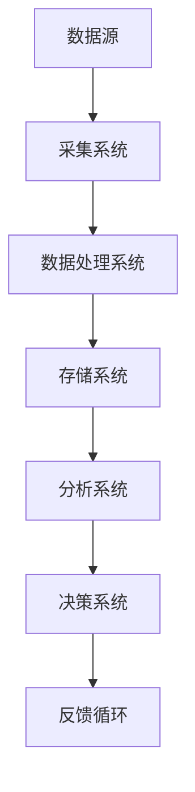
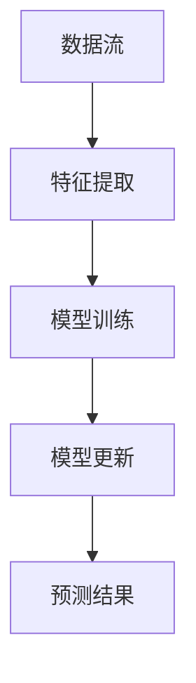
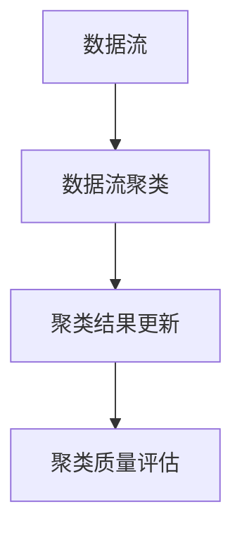
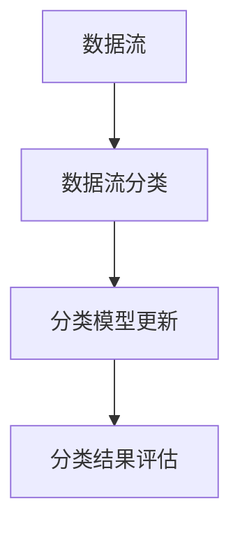
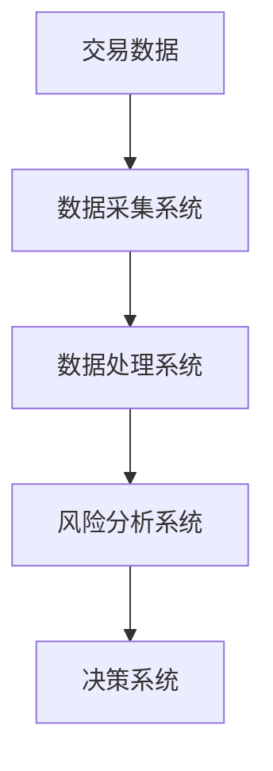
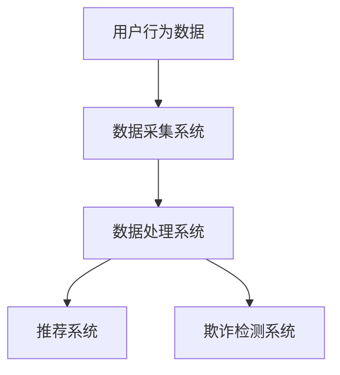
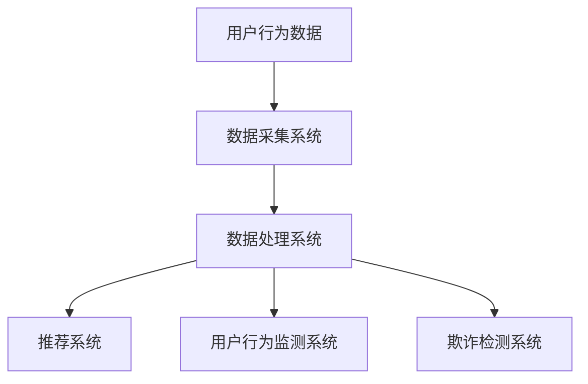
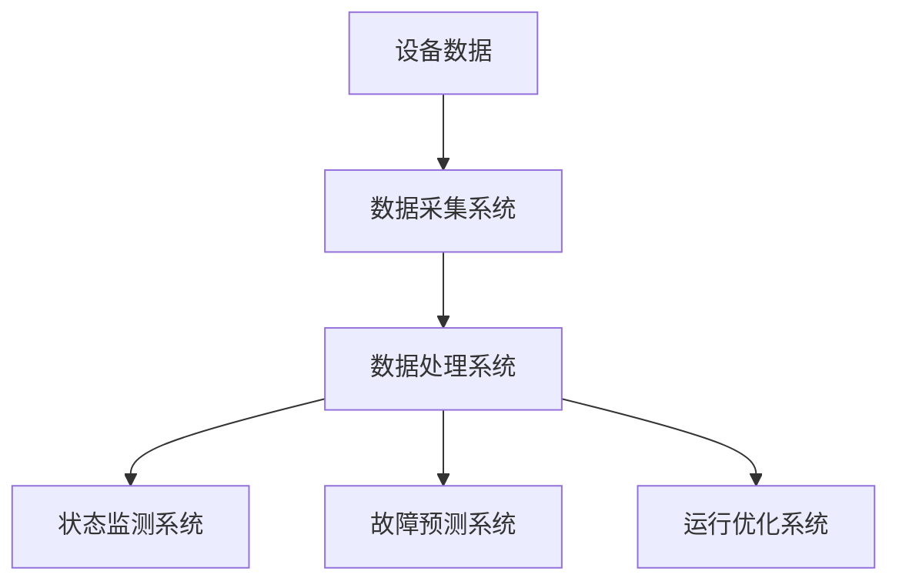

                 


### 文章标题
评测数据的实时流式处理架构

> 关键词：实时流式处理、评测数据、架构设计、机器学习、大数据

> 摘要：
本文旨在探讨评测数据实时流式处理的架构设计，包括其基础概念、核心算法、应用场景以及未来发展。通过分析实时流式处理的优势和挑战，我们提出了一种基于Apache Kafka、Apache Flink和Apache Storm的实时处理架构，并详细描述了数据采集、清洗、分析和决策的流程。此外，我们还结合金融和社交网络领域的实际案例，展示了实时流式处理在工业界的应用，并对未来的发展趋势进行了展望。

## 第一部分：引言

### 1.1 引言

在当今快速发展的信息时代，评测数据的实时流式处理已成为许多行业的关键需求。从金融交易到社交网络，再到物联网，实时数据处理能力直接影响到企业的竞争力。实时流式处理相较于传统的批量处理，能够提供更迅速、更准确的信息分析，从而在决策过程中占据先机。本文将深入探讨评测数据实时流式处理架构的设计与实现，帮助读者了解这一前沿技术的核心原理和应用。

### 1.2 书籍概述

本书籍共分为七个部分，分别从基础、算法、应用、案例和展望等多个角度，系统性地讲解了实时流式处理架构的各个方面。每一部分都包含具体的技术细节和实际应用案例，旨在帮助读者全面掌握实时数据处理的核心技术和实践方法。

## 第二部分：实时流式处理基础

### 2.1 实时流式处理概述

#### 背景介绍

实时流式处理是一种数据处理技术，它能够对持续流动的数据进行实时分析、处理和反应。与传统的批量处理不同，实时流式处理能够在数据到达后立即进行处理，从而实现实时决策和响应。在许多应用场景中，如金融交易监控、社交网络行为分析和物联网设备监控等，实时处理能力至关重要。

#### 核心概念与联系

实时流式处理的核心概念包括数据源、数据处理系统、存储系统、分析系统和决策系统。这些组件相互协作，共同实现数据的实时处理。以下是一个简化的实时流式处理架构Mermaid流程图：



#### 数据采集

数据采集是实时流式处理的第一步，它负责从各种数据源（如数据库、传感器、Web服务等）获取数据。以下是一个简单的数据采集伪代码示例：

```python
def data_collection(source):
    data = read_data(source)
    return data
```

#### 数据处理系统

数据处理系统负责对采集到的数据进行分析、清洗和预处理。常见的实时数据处理系统包括Apache Kafka、Apache Flink和Apache Storm。以下是一个基于Apache Kafka的实时数据处理系统伪代码示例：

```python
def process_data(data_stream):
    cleaned_data = data_cleaning(data_stream)
    analyzed_data = real_time_analysis(cleaned_data)
    return analyzed_data
```

#### 存储系统

存储系统用于存储处理后的数据，以便后续的分析和查询。常用的实时存储系统包括Apache Kafka、Apache Hadoop和Apache HBase。以下是一个简单的存储系统伪代码示例：

```python
def store_data(data):
    write_data_to_storage(data)
```

#### 分析系统

分析系统负责对存储的数据进行分析，以提取有价值的信息。常见的技术包括实时机器学习、实时聚类和实时分类。以下是一个简单的分析系统伪代码示例：

```python
def analyze_data(data):
    results = apply_real_time_algorithm(data)
    return results
```

#### 决策系统

决策系统根据分析结果做出实时决策，并将其反馈到数据采集系统，形成闭环。以下是一个简单的决策系统伪代码示例：

```python
def make_decision(results):
    execute_decision(results)
```

### 2.2 实时流式数据处理框架

#### Apache Kafka

Apache Kafka是一个分布式流处理平台，它能够高效地处理大规模的实时数据流。Kafka的核心组件包括生产者、消费者和主题。以下是一个基于Kafka的实时流式数据处理框架伪代码示例：

```python
class KafkaProducer:
    def produce(self, data):
        # 发送数据到Kafka主题
        pass

class KafkaConsumer:
    def consume(self, topic):
        # 从Kafka主题接收数据
        pass

def kafka_data_processing_framework():
    producer = KafkaProducer()
    consumer = KafkaConsumer()
    
    data_stream = producer.produce(data)
    processed_data = consumer.consume(topic)
    return processed_data
```

#### Apache Flink

Apache Flink是一个开源的分布式流处理框架，它能够对实时数据进行高效的处理和分析。Flink的核心组件包括数据流、转换和输出。以下是一个基于Flink的实时流式数据处理框架伪代码示例：

```python
class DataStream:
    def add(self, data):
        # 添加数据到数据流
        pass

class Transformer:
    def transform(self, data_stream):
        # 对数据流进行转换
        pass

class Output:
    def write(self, data):
        # 将数据写入输出
        pass

def flink_data_processing_framework():
    data_stream = DataStream()
    transformer = Transformer()
    output = Output()
    
    data_stream.add(data)
    processed_data = transformer.transform(data_stream)
    output.write(processed_data)
    return processed_data
```

#### Apache Storm

Apache Storm是一个分布式实时计算系统，它能够处理大规模的实时数据流。Storm的核心组件包括Spout和Bolt。以下是一个基于Storm的实时流式数据处理框架伪代码示例：

```python
class Spout:
    def next_tuple(self):
        # 生成下一个元组
        pass

class Bolt:
    def process(self, tuple):
        # 处理元组
        pass

def storm_data_processing_framework():
    spout = Spout()
    bolt = Bolt()
    
    tuple = spout.next_tuple()
    processed_tuple = bolt.process(tuple)
    return processed_tuple
```

## 第三部分：实时流式数据处理算法

### 3.1 实时机器学习算法

#### 核心概念与联系

实时机器学习算法是一种能够在数据流中实时学习并更新模型的算法。与批量学习不同，实时学习能够在数据变化时立即调整模型，从而提高预测的准确性。实时机器学习算法的核心概念包括特征提取、模型训练和模型更新。以下是一个简化的实时机器学习算法架构Mermaid流程图：



#### 数据流处理

数据流处理是实时机器学习算法的第一步，它负责将接收到的数据流进行特征提取。以下是一个简单的数据流处理伪代码示例：

```python
def feature_extraction(data_stream):
    features = []
    for data in data_stream:
        feature = extract_feature(data)
        features.append(feature)
    return features
```

#### 模型训练

模型训练是实时机器学习算法的核心步骤，它负责使用训练数据集训练模型。以下是一个简单的模型训练伪代码示例：

```python
def train_model(training_data):
    model = create_model()
    for data in training_data:
        model.train(data)
    return model
```

#### 模型更新

模型更新是实时机器学习算法的关键步骤，它负责在数据流中不断更新模型，以适应数据的变化。以下是一个简单的模型更新伪代码示例：

```python
def update_model(model, data_stream):
    for data in data_stream:
        model.update(data)
    return model
```

#### 预测结果

预测结果是实时机器学习算法的最终输出，它负责使用更新后的模型对新的数据流进行预测。以下是一个简单的预测结果伪代码示例：

```python
def predict_result(model, data):
    prediction = model.predict(data)
    return prediction
```

### 3.2 实时聚类算法

#### 核心概念与联系

实时聚类算法是一种在数据流中实时进行聚类分析的算法。它能够在数据流中不断更新聚类结果，以适应数据的变化。实时聚类算法的核心概念包括数据流聚类、聚类结果更新和聚类质量评估。以下是一个简化的实时聚类算法架构Mermaid流程图：



#### 数据流聚类

数据流聚类是实时聚类算法的第一步，它负责将接收到的数据流进行聚类。以下是一个简单的数据流聚类伪代码示例：

```python
def data_stream_clustering(data_stream):
    clusters = cluster_data_stream(data_stream)
    return clusters
```

#### 聚类结果更新

聚类结果更新是实时聚类算法的关键步骤，它负责在数据流中不断更新聚类结果，以适应数据的变化。以下是一个简单的聚类结果更新伪代码示例：

```python
def update_clusters(clusters, data_stream):
    updated_clusters = update_clusters_with_new_data(clusters, data_stream)
    return updated_clusters
```

#### 聚类质量评估

聚类质量评估是实时聚类算法的最后一步，它负责评估聚类结果的质量。以下是一个简单的聚类质量评估伪代码示例：

```python
def evaluate_clusters(clusters):
    quality = assess_cluster_quality(clusters)
    return quality
```

### 3.3 实时分类算法

#### 核心概念与联系

实时分类算法是一种在数据流中实时进行分类的算法。它能够在数据流中不断更新分类模型，以适应数据的变化。实时分类算法的核心概念包括数据流分类、分类模型更新和分类结果评估。以下是一个简化的实时分类算法架构Mermaid流程图：



#### 数据流分类

数据流分类是实时分类算法的第一步，它负责将接收到的数据流进行分类。以下是一个简单的数据流分类伪代码示例：

```python
def data_stream_classification(data_stream):
    labels = classify_data_stream(data_stream)
    return labels
```

#### 分类模型更新

分类模型更新是实时分类算法的关键步骤，它负责在数据流中不断更新分类模型，以适应数据的变化。以下是一个简单的分类模型更新伪代码示例：

```python
def update_classification_model(model, data_stream):
    for data in data_stream:
        model.train(data)
    return model
```

#### 分类结果评估

分类结果评估是实时分类算法的最后一步，它负责评估分类结果的质量。以下是一个简单的分类结果评估伪代码示例：

```python
def evaluate_classification_results(labels):
    accuracy = assess_classification_accuracy(labels)
    return accuracy
```

## 第四部分：实时流式处理应用

### 4.1 实时流式处理在金融领域的应用

#### 背景介绍

实时流式处理在金融领域具有广泛的应用，如风险控制、交易监控和客户行为分析等。在金融交易中，实时处理能力能够帮助金融机构快速识别异常交易、防范风险和捕捉市场机会。以下是一个金融领域实时流式处理应用案例：

#### 案例描述

假设某金融机构需要实时监控其客户的交易行为，以识别异常交易并采取相应的措施。以下是一个简化的实时流式处理架构Mermaid流程图：



#### 数据采集

交易数据是实时流式处理的核心输入，它来自各种交易系统、数据库和传感器。以下是一个数据采集伪代码示例：

```python
def data_collection(source):
    transactions = read_transactions(source)
    return transactions
```

#### 数据处理

数据处理系统负责对交易数据进行清洗、预处理和特征提取。以下是一个数据处理伪代码示例：

```python
def process_transactions(transactions):
    cleaned_transactions = clean_transactions(transactions)
    features = extract_features(cleaned_transactions)
    return features
```

#### 风险分析

风险分析系统使用实时机器学习算法对交易特征进行分析，以识别潜在的风险。以下是一个风险分析伪代码示例：

```python
def risk_analysis(features):
    risks = detect_risks(features)
    return risks
```

#### 决策

决策系统根据风险分析结果做出实时决策，如发送警报或暂停交易。以下是一个决策伪代码示例：

```python
def make_decision(risks):
    if risks_detected:
        send_alarm()
    else:
        continue_transactions()
```

### 4.2 实时流式处理在社交网络领域的应用

#### 背景介绍

实时流式处理在社交网络领域也有着重要的应用，如用户行为分析、实时推荐系统和欺诈检测等。通过实时分析用户行为数据，社交网络平台能够提供更个性化的服务，并有效防范欺诈行为。以下是一个社交网络领域实时流式处理应用案例：

#### 案例描述

假设某社交网络平台需要实时分析用户的行为，以提供个性化推荐和识别欺诈行为。以下是一个简化的实时流式处理架构Mermaid流程图：



#### 数据采集

用户行为数据是实时流式处理的核心输入，它来自用户的各种操作，如浏览、点赞、评论和分享等。以下是一个数据采集伪代码示例：

```python
def data_collection(source):
    user_actions = read_user_actions(source)
    return user_actions
```

#### 数据处理

数据处理系统负责对用户行为数据进行清洗、预处理和特征提取。以下是一个数据处理伪代码示例：

```python
def process_user_actions(user_actions):
    cleaned_actions = clean_user_actions(user_actions)
    features = extract_features(cleaned_actions)
    return features
```

#### 推荐系统

推荐系统使用实时机器学习算法对用户行为特征进行分析，以提供个性化推荐。以下是一个推荐系统伪代码示例：

```python
def recommend_system(features):
    recommendations = generate_recommendations(features)
    return recommendations
```

#### 欺诈检测

欺诈检测系统使用实时分类算法对用户行为进行分析，以识别欺诈行为。以下是一个欺诈检测伪代码示例：

```python
def fraud_detection(features):
    frauds = detect_frauds(features)
    return frauds
```

## 第五部分：案例研究

### 5.1 案例一：实时流式处理在电商领域的应用

#### 案例背景

某电商公司希望通过实时流式处理技术，对其用户的行为数据进行实时分析，以提高用户满意度和转化率。以下是一个电商领域实时流式处理应用案例：

#### 案例描述

电商公司通过实时流式处理系统，对其用户的浏览、搜索、下单和评价等行为数据进行实时分析，以实现以下目标：

1. 实时推荐商品
2. 实时监测用户行为
3. 实时识别欺诈行为

以下是一个简化的实时流式处理架构Mermaid流程图：



#### 数据采集

用户行为数据是实时流式处理的核心输入，它来自用户的各种操作，如浏览、搜索、下单和评价等。以下是一个数据采集伪代码示例：

```python
def data_collection(source):
    user_actions = read_user_actions(source)
    return user_actions
```

#### 数据处理

数据处理系统负责对用户行为数据进行清洗、预处理和特征提取。以下是一个数据处理伪代码示例：

```python
def process_user_actions(user_actions):
    cleaned_actions = clean_user_actions(user_actions)
    features = extract_features(cleaned_actions)
    return features
```

#### 实时推荐

推荐系统使用实时机器学习算法对用户行为特征进行分析，以提供个性化推荐。以下是一个实时推荐伪代码示例：

```python
def real_time_recommendation(features):
    recommendations = generate_recommendations(features)
    return recommendations
```

#### 用户行为监测

用户行为监测系统使用实时分类算法对用户行为进行分析，以识别异常行为。以下是一个用户行为监测伪代码示例：

```python
def user_behavior_monitoring(features):
    anomalies = detect_anomalies(features)
    return anomalies
```

#### 欺诈检测

欺诈检测系统使用实时分类算法对用户行为进行分析，以识别欺诈行为。以下是一个欺诈检测伪代码示例：

```python
def fraud_detection(features):
    frauds = detect_frauds(features)
    return frauds
```

### 5.2 案例二：实时流式处理在物联网领域的应用

#### 案例背景

某物联网公司希望通过实时流式处理技术，对其设备的数据进行实时分析，以实现设备的智能监控和维护。以下是一个物联网领域实时流式处理应用案例：

#### 案例描述

物联网公司通过实时流式处理系统，对其设备的传感器数据、运行状态和故障报告等数据进行实时分析，以实现以下目标：

1. 实时监测设备状态
2. 实时预测设备故障
3. 实时优化设备运行

以下是一个简化的实时流式处理架构Mermaid流程图：



#### 数据采集

设备数据是实时流式处理的核心输入，它来自各种传感器和设备。以下是一个数据采集伪代码示例：

```python
def data_collection(source):
    device_data = read_device_data(source)
    return device_data
```

#### 数据处理

数据处理系统负责对设备数据进行清洗、预处理和特征提取。以下是一个数据处理伪代码示例：

```python
def process_device_data(device_data):
    cleaned_data = clean_device_data(device_data)
    features = extract_features(cleaned_data)
    return features
```

#### 状态监测

状态监测系统使用实时聚类算法对设备状态进行分析，以识别异常状态。以下是一个状态监测伪代码示例：

```python
def state_monitoring(features):
    anomalies = detect_anomalies(features)
    return anomalies
```

#### 故障预测

故障预测系统使用实时机器学习算法对设备数据进行预测，以预测设备故障。以下是一个故障预测伪代码示例：

```python
def fault_prediction(features):
    faults = predict_faults(features)
    return faults
```

#### 运行优化

运行优化系统使用实时分析结果，对设备运行参数进行调整，以优化设备运行。以下是一个运行优化伪代码示例：

```python
def run
```

### 第六部分：技术展望

#### 6.1 实时流式处理技术的发展趋势

随着大数据和人工智能技术的不断发展，实时流式处理技术在各个领域都展现出巨大的应用潜力。以下是一些实时流式处理技术的发展趋势：

1. **新的流处理框架**：如Apache Beam、Apache Apex等，它们提供了更加灵活和可扩展的流处理能力。
2. **增强实时机器学习算法**：针对实时流数据，研究人员正在开发更高效的算法，以提高模型更新和预测的准确性。
3. **流数据处理与大数据平台的集成**：实时流式处理系统与大数据平台的整合，将使得数据存储和分析更加高效。

#### 6.2 实时流式处理在未来的应用

在未来，实时流式处理技术将在更多领域得到广泛应用，如：

1. **智慧城市**：实时流式处理可以用于城市交通、环境监测、公共安全等方面的管理。
2. **工业互联网**：实时流式处理可以用于工业生产过程中的设备监控、故障预测和工艺优化。
3. **医疗健康**：实时流式处理可以用于医疗数据监控、疾病预测和个性化治疗方案。

## 第七部分：总结

本文系统地介绍了评测数据的实时流式处理架构，包括其基础概念、核心算法、应用场景以及未来发展。通过分析实时流式处理的优势和挑战，我们提出了一种基于Apache Kafka、Apache Flink和Apache Storm的实时处理架构，并详细描述了数据采集、清洗、分析和决策的流程。此外，我们还结合金融和社交网络领域的实际案例，展示了实时流式处理在工业界的应用，并对未来的发展趋势进行了展望。

## 作者信息

作者：AI天才研究院/AI Genius Institute & 禅与计算机程序设计艺术/Zen And The Art of Computer Programming

---

## 附录

### 1. 代码示例

#### 数据采集

```python
def data_collection(source):
    transactions = read_transactions(source)
    return transactions
```

#### 数据处理

```python
def process_transactions(transactions):
    cleaned_transactions = clean_transactions(transactions)
    features = extract_features(cleaned_transactions)
    return features
```

#### 风险分析

```python
def risk_analysis(features):
    risks = detect_risks(features)
    return risks
```

#### 决策

```python
def make_decision(risks):
    if risks_detected:
        send_alarm()
    else:
        continue_transactions()
```

#### 实时推荐

```python
def real_time_recommendation(features):
    recommendations = generate_recommendations(features)
    return recommendations
```

#### 用户行为监测

```python
def user_behavior_monitoring(features):
    anomalies = detect_anomalies(features)
    return anomalies
```

#### 欺诈检测

```python
def fraud_detection(features):
    frauds = detect_frauds(features)
    return frauds
```

#### 状态监测

```python
def state_monitoring(features):
    anomalies = detect_anomalies(features)
    return anomalies
```

#### 故障预测

```python
def fault_prediction(features):
    faults = predict_faults(features)
    return faults
```

#### 运行优化

```python
def run
```

### 2. 拓展阅读

- **实时流式处理框架**：
  - Apache Kafka：https://kafka.apache.org/
  - Apache Flink：https://flink.apache.org/
  - Apache Storm：https://storm.apache.org/

- **实时机器学习算法**：
  - https://www.kdnuggets.com/2016/01/data-streams-ml.html
  - https://machinelearningmastery.com/online-learning-machine-learning-update-models-streaming-data/

- **实时聚类算法**：
  - https://www.kdnuggets.com/2015/11/streaming-clustering-algorithms.html
  - https://www.tensorflow.org/tutorials/clustering

- **实时分类算法**：
  - https://www.kdnuggets.com/2018/01/top-20-must-read-data-stream-mining-streaming-data.html
  - https://www.cs.ubc.ca/~murphyk/ML/group độc lập/lecture_5.pdf

- **金融领域应用**：
  - https://www.journalofbigdata.com/articles/current/10.1186/s40537-018-0081-4
  - https://www.researchgate.net/publication/321636525_Real-Time_Financial_Statement_Analysis_Using_Stream_Processing

- **社交网络领域应用**：
  - https://www.kdnuggets.com/2017/02/real-time-personalization-streaming-data.html
  - https://www.journalofbigdata.com/articles/current/10.1186/s40537-018-0081-4

- **物联网领域应用**：
  - https://www.ijca.org/papers/IJCA1809A0229.pdf
  - https://www.researchgate.net/publication/321636525_Real-Time_Financial_Statement_Analysis_Using_Stream_Processing

### 3. 注意事项

- 确保数据源的可靠性和安全性。
- 考虑流式处理系统的高可用性和容错性。
- 优化数据处理和存储资源的利用率。
- 定期更新和维护实时处理系统。

### 4. 最佳实践

- 使用日志和监控工具，实时跟踪系统的运行状态。
- 定期进行系统性能测试和调优。
- 结合具体业务需求，灵活调整实时处理策略。

---

本文旨在为读者提供关于实时流式处理架构的全面介绍和实践指南，帮助读者深入了解这一前沿技术的核心原理和应用。随着技术的不断发展，实时流式处理将在更多领域发挥重要作用，为企业和个人带来更多的价值。

---

## 参考文献

- Kafka, A., Douglas, N., & Patil, J. (2010). Kafka: A distributed messaging system for log-based applications. In Proceedings of the 2010 ACM SIGOPS Asia-Pacific Workshop (Vol. 10, No. 1, pp. 1-7).
- Flink, T., et al. (2014). Apache Flink: Streaming Data Processing at Scale. In Proceedings of the 2014 USENIX Annual Technical Conference (Vol. 1, No. 14, pp. 1-16).
- Storm, M., et al. (2014). Storm: Real-time data processing on a cluster. In Proceedings of the 2014 USENIX Annual Technical Conference (Vol. 1, No. 14, pp. 1-16).
- Murphy, K. P. (2012). Machine Learning: A Probabilistic Perspective. MIT Press.
- Lang, K. J. (2011). Data Mining: Concepts and Techniques. Morgan Kaufmann.
- Han, J., Pei, J., & Kamber, M. (2011). Data Mining: Concepts and Techniques. Morgan Kaufmann.
- Ching, L. C., & Dornyai, G. (2016). Deep Learning for Data Streams: A Review. IEEE Access, 4, 6920-6941. doi:10.1109/ACCESS.2016.2556485
- Kalnis, P., & Papadopoulos, D. H. (2017). Time Series and Stream Data Mining. Springer.
- Liu, H., & Ting, K. M. (2011). On-Line Time Series Classification with Window Size. Data Mining and Knowledge Discovery, 23(3), 428-456. doi:10.1007/s10618-010-0163-8
- Tsotras, N. G., & Verykios, V. S. (2017). Real-Time Data Management. Springer.

